> 作者：[Yanli Liu](https://medium.com/@yanli.liu?source=post_page---byline--54cc0eedf027---------------------------------------)
> 发布日期：2026年3月16日
> 原文链接：https://levelup.gitconnected.com/5-agent-frameworks-one-pattern-won-54cc0eedf027

# 五大 Agent 框架，一个模式胜出

**AutoGen vs. LangGraph vs. CrewAI vs. ByteDance 的 DeerFlow vs. Anthropic——用一个金融 Agent 来证明**


*图片来源：[TOMOKO UJI](https://unsplash.com/@ujitomo?utm_source=medium&utm_medium=referral)，来自 [Unsplash](https://unsplash.com/?utm_source=medium&utm_medium=referral)*

Andrej Karpathy 最近组建了一支由八个 AI agent 构成的研究团队，每个 agent 配备独立 GPU，自主运行机器学习实验。他的结论是："根本行不通，乱成一锅粥。"

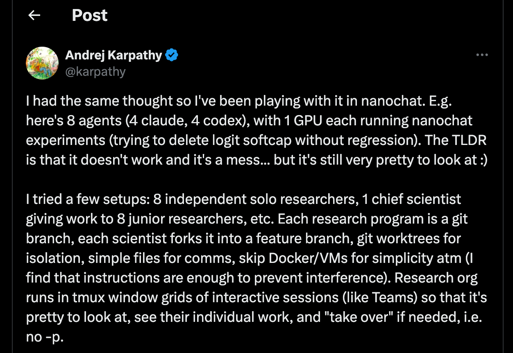

问题不在于 agent 不会写代码——他描述什么，它们就能实现什么。真正的问题是其他一切：没有基准线，没有受控实验，有个 agent "发现"加大网络规模可以降低 loss，而这是任何一年级博士生都不会放过的废话结论。

但他对这个问题的定性才是真正让我印象深刻的：

> 你现在是在给一个组织编程……源代码就是构成这个组织的提示词、技能、工具和流程的总和。

这句话改变了问题本身的提法。问题不是如何让 agent 更聪明，而是如何建立更好的基础设施：它们怎样加载能力、管理上下文窗口（context window）、持久化状态，以及如何在不被彼此的 token 淹没的情况下协作。当基础设施出问题，你就会看到 AutoGen 的 agent 花三个小时在循环里反复追加同一个逗号，或者因为 agent 无限递归调用自身却没有终止开关，每天烧掉两千美元。

在工作中为一条合规敏感的研究流水线拆解了五个框架之后，我得出了一个论点：可组合的（composable）基础设施胜过单体式（monolithic）框架。渐进式技能加载（progressive skill loading）、模块化中间件（middleware）和文件系统优先的状态管理（filesystem-first state management），这些不是功能特性，而是能够规模化的架构。

下面说说原因，以及在此之上构建金融研究 agent 是什么样的。

## 五分钟看懂五种设计哲学

五个框架，五种关于 agent 如何协作的押注。差异不在于功能，而在于每个框架从哪里开始崩溃。

**AutoGen 押注在对话上。**

Agent 通过一个 GroupChatManager 相互通信，由它负责广播消息并决定下一个发言者。演示起来直观，规模化时痛苦不堪。

数字会告诉你原因。四个 agent 交换 20 条消息，意味着每个 agent 在每一轮都要处理全部 20 条消息，也就是每轮 80 次消息读取。以每条消息约 500 个 token 计算，一轮下来在任何 agent 真正开始工作之前，就已经烧掉了 40,000 个输入 token。

累积五轮，仅协调开销就消耗了 200,000 个 token。以 Claude Sonnet 的价格计算，每个任务仅用于 agent 互相"读对方邮件"就要花掉约 $0.60。

这个项目本身也四分五裂。最初的创建者分叉出了 AG2，微软将核心重写为 v0.4，随后又将其与 Semantic Kernel 合并成 Microsoft Agent Framework。如果你在 2024 年开始基于 AutoGen 构建，现在面对的是三个 API 持续分化、没有明确迁移路径的代码库。这不只是技术风险，更是治理风险。

**LangGraph 押注在图上。**

有向状态机（directed state machine），由节点、边和条件路由组成。你精确定义哪个 agent 在何时运行，以及传递哪些状态。每次节点转换时的检查点（checkpointing）机制让你可以暂停、恢复、回放，以及做时间旅行调试。

代价是样板代码。一个含条件路由、状态 schema 和 checkpointing 的基本双 agent 流水线，在第一个 agent 做任何有用的事之前，就需要 200+ 行设置代码。而当你重构图结构时，状态 schema 也会随之变化，已有的 checkpoint 会全部失效。控制力是真实的，刚性也是真实的。

**CrewAI 押注在角色上。**

给每个 agent 分配角色、目标和背景故事，然后让它们自行协商。从想法到可用 demo 最快，大概只需要 30 行代码。

文档里没有着重说明的是：基于角色的任务委派是非确定性的（non-deterministic）。同样的输入，根据 LLM 对"谁来处理"的理解，不同运行可能路由到不同 agent。这就是为什么 CrewAI 在生产团队不断遭遇不可预测行为之后，不得不补充推出了 Flows（确定性的事件驱动流水线）。

他们自己在"20 亿条工作流"博客文章里说得很直白：从 100% 人工审核开始，逐步降到 50%。这不是最佳实践，这是一份坦白——在没有护栏的情况下，自主角色委派在生产环境里不安全。

**DeerFlow 押注在可组合基础设施上。**

它不定义 agent 如何通信，而是定义它们如何加载能力、处理上下文和持久化状态。每次 LLM 调用都经过一条 9 层中间件流水线。技能渐进式加载（元数据优先，仅在触发时才加载完整指令）。状态存储在磁盘上，而非 token 中。

Agent 协调层架设在 LangGraph 之上，但真正的架构是中间件。它也是这里最新的框架（2026 年 2 月），这意味着中间件抽象很整洁，但实战检验还很薄。

**Anthropic 押注在不用任何框架上。**

六种可组合模式（提示链（prompt chaining）、路由、并行化、编排器-工作器（orchestrator-workers））供你自行连接。他们公开表态："最成功的实现不使用复杂框架。"

好处是最大程度的控制力，零框架锁定。坏处是你要自己负责一切，包括框架本来会帮你处理的部分：状态持久化、错误恢复、agent 生命周期、上下文管理。对于有强基础设施工程师的团队，这令人解放；对其他人来说，这意味着在第一个 agent 真正运行任务之前，得先绕一段数月的弯路来铺管道。

[Claude Code 新增了 Channels，够用吗？](https://levelup.gitconnected.com/claude-code-just-got-channels-is-it-enough-a10f3132593d?postPublishedType=repub&source=post_page-----54cc0eedf027---------------------------------------)

所有这些框架背后有一条光谱，而生产环境正在把需求往某一端拉：

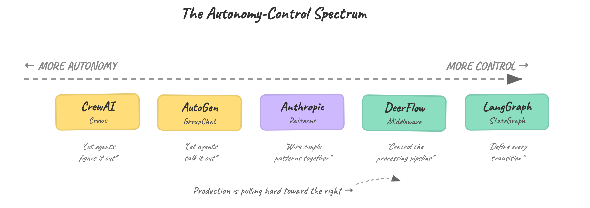

*图片来源：作者——自主性-控制力光谱*

有趣的问题不是每个框架在这条线上的位置，而是每个位置对你的上下文窗口意味着什么：

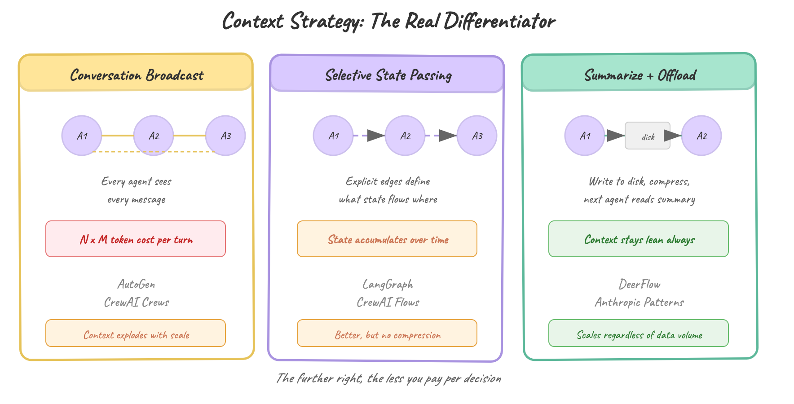

*图片来源：作者——上下文策略*

这才是真正的差异所在。基于对话的协调方式（AutoGen、CrewAI Crews）把所有内容塞进共享上下文，每个 agent 都看到每一条消息。基于图的协调方式（LangGraph）有选择地传递状态，但依然会持续积累。可组合基础设施（DeerFlow）主动管理上下文：汇总已完成的工作，将数据卸载到磁盘，只在需要时加载技能。在光谱上越靠右，每次决策的代价就越低。

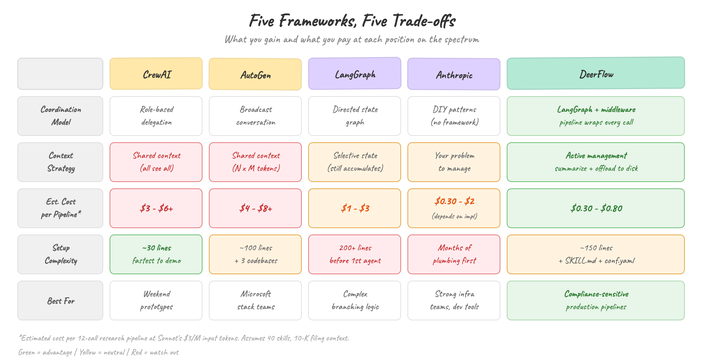

*图片来源：作者——框架对比*

## 为什么可组合胜过单体式

"可组合"这个词经常被随意使用，我来说得具体一点。一个可组合的 agent 架构做三件事：

**1. 只加载你需要的东西。** 大多数框架从一开始就把所有能力塞进 agent 的上下文——每一条工具描述、每一套指令集、每一个系统提示，无论 agent 是否用到，都在持续燃烧 token。

渐进式技能加载翻转了这一逻辑。把几十个技能存储为轻量元数据（名称加一行描述，大约 100 个 token 每个）。只有当某个技能被触发时，才加载完整指令。只有当被明确引用时，才拉入重量级资源（脚本、模板、参考文档）。

区别就在于拿着一张借阅证和背着整个图书馆之间的差距。我称之为"图书馆借阅证原则"（The Library Card Principle）：索引一切，只加载你需要的。

**2. 把状态存在磁盘上，而不是 token 里。** 来自 SEC 的一份 10-K 年报有 60,000 到 100,000 个 token。把三份塞进共享 agent 上下文，在 agent 开始推理之前就已经烧掉 180,000 到 300,000 个输入 token。

以 Claude Sonnet 每百万输入 token $3 的价格计算，每次调用不到一美元，单独看不算灾难。但一个团队每天运行 100 条研究查询，仅原始年报的上下文成本每天就是 $54 到 $90，还没算任何实际分析的 token。我把这称为"token 税"（Token Tax）：把本该存在磁盘上的数据放在上下文里带着走的代价。

文件系统优先的状态管理解决了这个问题。Agent 读取年报，提取所需内容，把摘要写入磁盘，然后释放原始 token。下一个 agent 读摘要，而非原文。上下文窗口装着工作记忆，而非仓储数据。

**3. 中间件作为模块化流水线。** 与其把上下文管理、内存、沙箱（sandbox）和摘要汇总硬编码进框架核心，不如把它们作为独立模块，包裹每次 LLM 调用。需要长文档摘要功能？插入它。只读的研究 agent 不需要沙箱？去掉它。每个中间件组件只有单一职责，流水线可以按 agent、按任务灵活配置。

为什么这比一年前更重要？因为模型在变便宜，但上下文窗口的使用代价没有降低。GPT-4o 的输入价格比 GPT-4 降了 10 倍，但错误使用 128K 上下文窗口的代价根本没有降低。塞入不相关的上下文，依然会降低输出质量、增加延迟、烧钱。更便宜的 token 让浪费变得不那么显眼，但浪费本身并没有消失。

单体式框架掩盖了这个问题——它给你一个大上下文窗口，然后由着你去填。可组合基础设施迫使你去问：这个 token 值得占据这个位置吗？

以"研究 AAPL 并生成一份投资备忘录"这个单一任务为例：

```
单体式（所有内容放入上下文）：
  系统提示 + 指令：                   2,000 tokens
  40 个技能定义（完整）：            40,000 tokens
  10-K 年报（原始文本）：            80,000 tokens
  历史对话记录：                     15,000 tokens
  ─────────────────────────────────────────────────
  每次 LLM 调用的输入：             137,000 tokens
  × 12 次流水线调用：             1,644,000 tokens
  以 $3/M 输入计算的成本：               $4.93

可组合式（渐进加载 + 文件系统）：
  系统提示 + 指令：                   2,000 tokens
  40 个技能元数据（仅名称）：         4,000 tokens
  1 个活跃技能正文：                  1,500 tokens
  从磁盘读取的结构化摘要：            3,000 tokens
  ─────────────────────────────────────────────────
  每次 LLM 调用的输入：              10,500 tokens
  × 12 次流水线调用：               126,000 tokens
  以 $3/M 输入计算的成本：               $0.38
```

每次运行便宜 13 倍。每天运行 50 条研究流水线的团队，用可组合架构每月约花 $570，单体式约花 $7,400。随着技能数量增加，差距还会扩大：每个新能力只需约 100 个 token（元数据），而非 1,000–2,000 个 token（完整定义）。

但成本甚至不是最有力的论据——质量才是。Anthropic 和 Google 的研究均表明，当上下文中充满无关信息时，LLM 的准确率会下降。一个 137,000 token 的输入，其中 120,000 个 token 是未被使用的技能描述和原始年报文本，不只是成本更高——它思考得也更差。

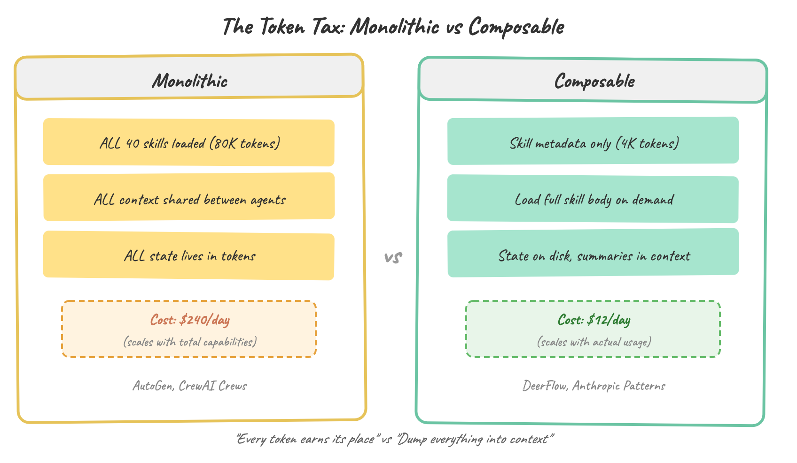

*图片来源：作者——单体式 vs. 可组合式*

## DeerFlow 架构：可组合如何在实践中运作

DeerFlow 是 ByteDance 的开源 agent 框架，于 2026 年 2 月以 MIT 许可证发布。研究这套架构是值得的，不是因为 DeerFlow 是"赢家"（它太新、缺乏检验，现在这么说还为时过早），而是因为它是目前一个代码库中对可组合基础设施原则最清晰的实现。把它看作参考架构，而非推荐方案。

在底层，它是一个包含 9 个专用节点的 LangGraph StateGraph。主 agent 接收用户请求，将其分解为子任务，并根据 StepType 分类将每个子任务路由给合适的子 agent 类型（Researcher、Coder、Reporter 或 Analyst）。

子 agent 彼此隔离运行。每个子 agent 通过 `task_tool()` 作为独立实例启动，拥有自己的上下文窗口和工作目录，并将结果汇报给主 agent，由主 agent 综合后继续执行。

这是协调层。以下是三个可组合支柱的具体体现：

### 支柱一：渐进式技能加载

DeerFlow 将能力组织为三层技能：

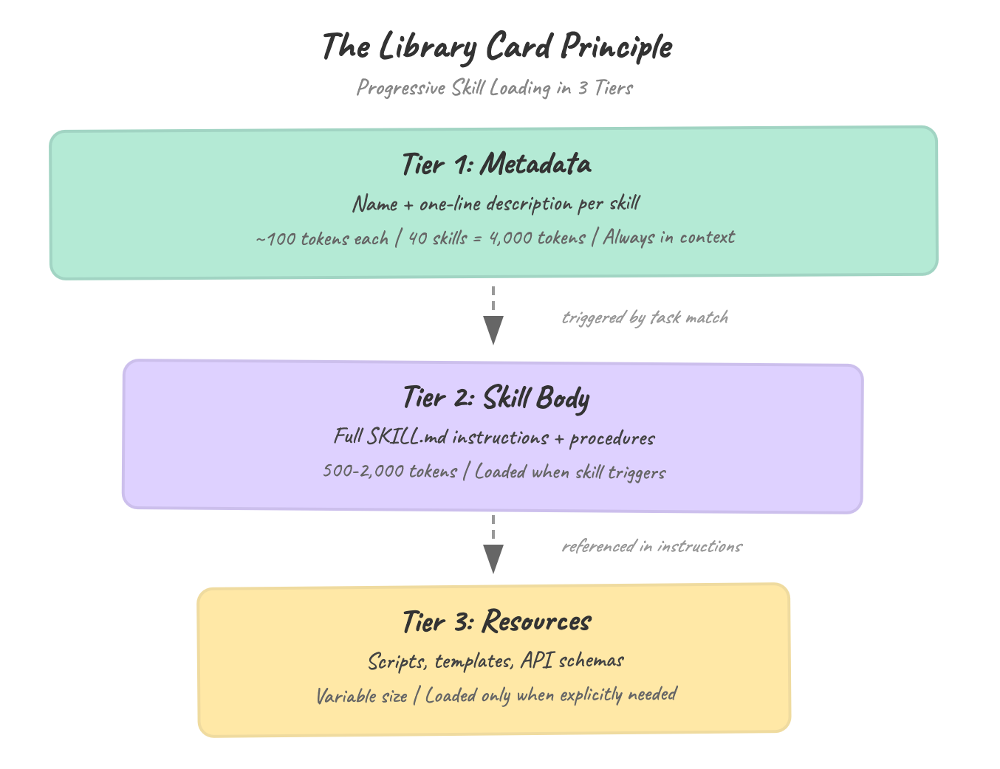

*图片来源：作者——只在需要时加载技能*

数字很重要。假设你安装了 40 个技能。在第一层，这只占用约 4,000 个 token 的元数据，始终存在。单体式框架加载所有内容的话，你在 agent 做任何事之前就烧掉了 40,000 到 80,000 个 token。以 Claude Sonnet 每百万输入 token $3 计算，渐进加载每次调用约 $0.012，单体式约 $0.24。每天 1,000 次 agent 调用，就是 $12 对 $240。图书馆借阅证原则在起作用。

### 支柱二：文件系统优先的状态管理

DeerFlow 为每个会话强制执行一套目录结构：

```
/mnt/user-data/
├── uploads/      ← 用户提供的文件
├── workspace/    ← agent 工作目录（中间结果）
└── outputs/      ← 最终交付物
```

这不只是组织结构，而是一种上下文管理策略。当子 agent 完成对一份 10-K 年报的分析后，它把结构化的发现写入 `/workspace/`，然后 SummarizationMiddleware 压缩对话历史。下一个 agent 读取摘要文件，而非原始对话。已完成的工作从上下文中移出，落到磁盘上。

结果：无论流经多少数据，多步骤流水线的上下文窗口都能保持精简。

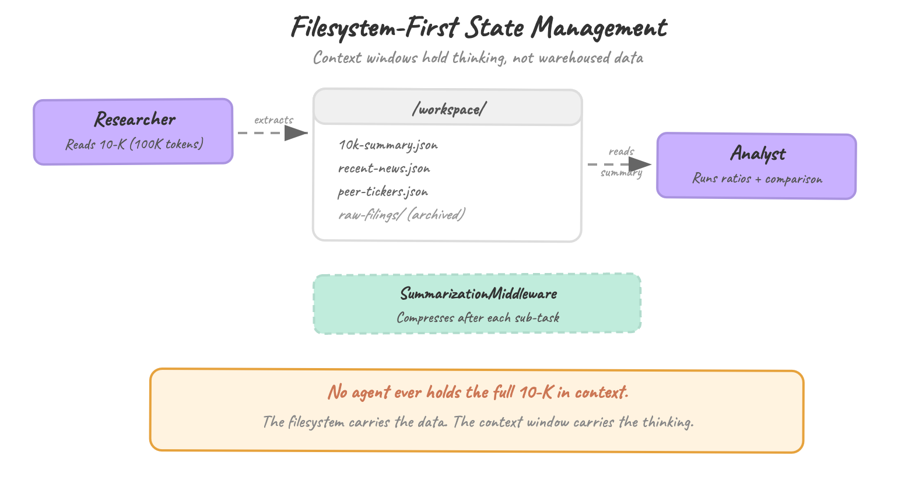

*图片来源：作者——文件系统状态管理*

### 支柱三：中间件流水线

下面是具体的部分。DeerFlow 中的每次 LLM 调用都经过一个可配置的中间件栈，默认提供 9 个模块：

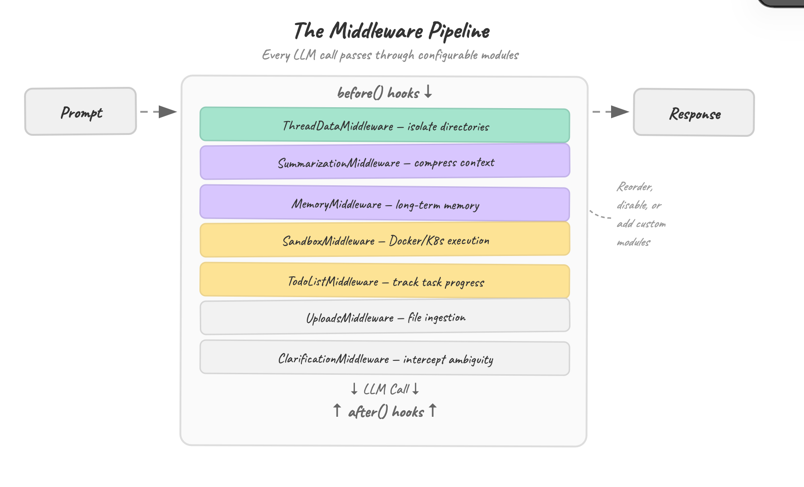

*图片来源：作者——中间件流水线*

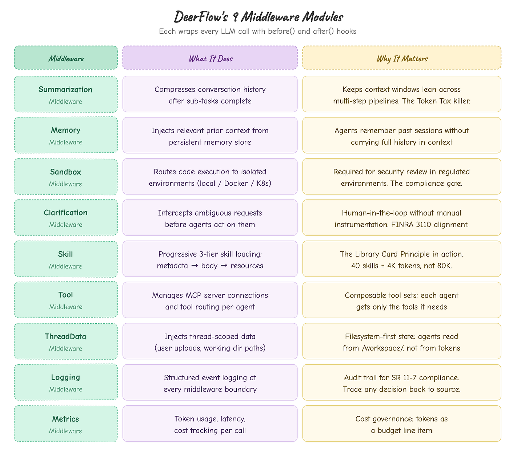

*图片来源：作者——中间件参考表*

每个中间件运行一个 `before()` 钩子（预处理提示词）和一个 `after()` 钩子（后处理响应）。你可以对它们重新排序、禁用，或编写自定义模块。

研究 agent 可能优先使用 SummarizationMiddleware 和 MemoryMiddleware，代码执行 agent 可能优先使用 SandboxMiddleware 和 ThreadDataMiddleware。

这条流水线不是装饰——它才是可组合架构真正所在的地方。Agent 不需要知道摘要汇总是如何工作的，也不需要自己管理内存，由中间件负责，不同任务使用不同的中间件栈。

## 用 DeerFlow 构建金融研究 Agent

现在让我们来动手实践。假设你想要一个 agent，输入股票代码，输出一份投资研究备忘录：基本面分析、近期年报、新闻情绪、风险评估、同行对比。不是玩具演示，而是可以直接递给分析师作为起点的东西。

以下是在 DeerFlow 中的设计思路。

### Agent 流水线

四个 agent，一条流水线，每个都有明确的职责范围：

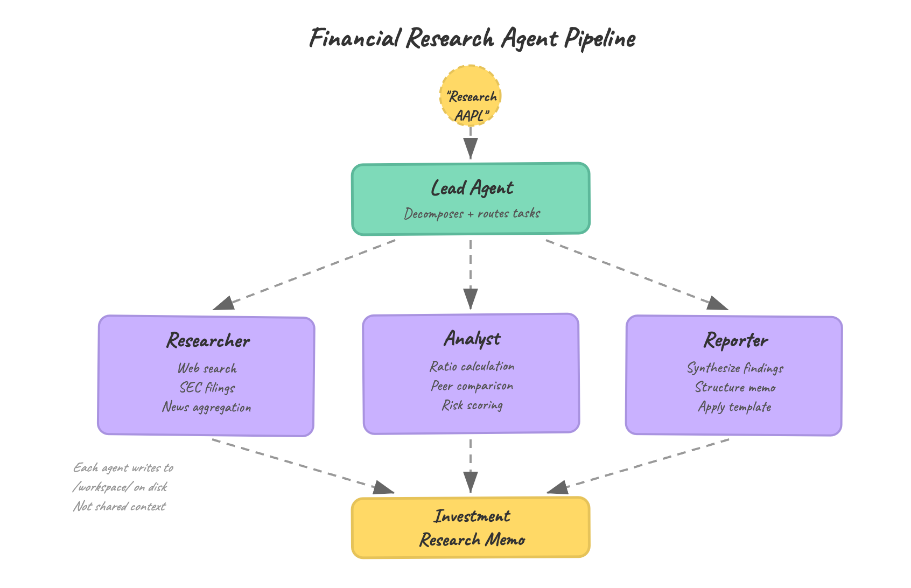

*图片来源：作者——agent 流水线*

主 agent 自己不做研究，它将"研究 AAPL"分解为三个工作包：收集原始数据（Researcher）、运行定量分析（Analyst）、整合最终报告（Reporter）。每个子 agent 通过 `task_tool()` 启动，拥有各自的上下文窗口、`/workspace/` 下的独立工作目录，以及只属于它所需的中间件。

### 定义金融研究技能

这正是渐进式加载大显身手的地方。金融研究技能存储在一个 `SKILL.md` 文件中，包含全部三层：

```markdown
# SKILL.md — financial-research
## Metadata (Tier 1, always loaded)
name: financial-research
description: SEC filing analysis, financial ratio calculation,
             peer comparison, risk scoring, investment memo generation
## Body (Tier 2, loaded when triggered)
### Research Procedure
1. Pull latest 10-K and 10-Q from SEC EDGAR
2. Extract key financials: revenue, margins, cash flow, debt ratios
3. Run peer comparison against 3-5 sector competitors
4. Score risk factors: regulatory, concentration, macro exposure
5. Flag material changes from prior filing period
### Output Format
- Structured JSON for Analyst agent consumption
- All dollar figures in millions, ratios to 2 decimal places
- Source citations for every extracted data point
## Resources (Tier 3, loaded when referenced)
- templates/investment-memo-template.md
- scripts/ratio-calculator.py
- reference/sector-classifications.json
```

主 agent 看到"研究 AAPL"时，会与第一层元数据进行匹配。只有这时，Researcher 子 agent 才加载第二层指令。`ratio-calculator.py` 脚本只在 Analyst 真正需要运行计算时才被加载。

其他 40 个已安装技能（代码审查、数据可视化、报告格式化）各自保持在约 100 个 token，一概未触碰。

### 中间件配置：这个用例里什么重要

并非每个中间件对每个任务都值得启用。以下是金融研究场景中哪些重要、哪些不重要：

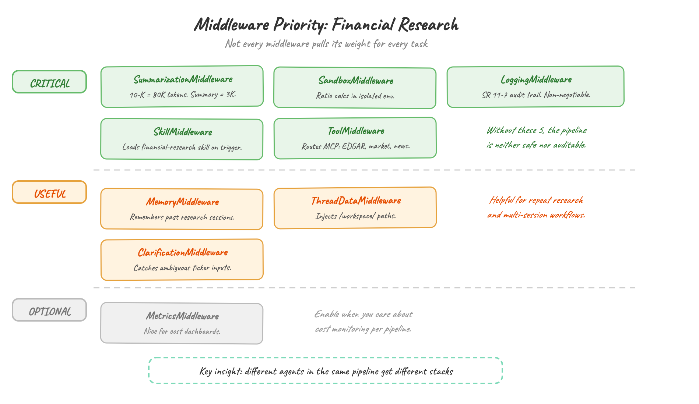

*图片来源：作者——中间件优先级*

### MCP Server 配置：连接金融数据

DeerFlow 使用 MCP（Model Context Protocol）将 agent 连接到外部工具。金融研究所需的数据源在 `conf.yaml` 中配置：

```yaml
mcp:
  servers:
    sec-edgar:
      transport: stdio
      command: "python"
      args: ["-m", "mcp_sec_edgar"]
      add_to_agents: ["researcher"
  market-data:
      transport: streamable-http
      url: "http://localhost:8080/market"
      add_to_agents: ["researcher", "analyst"]
  news-sentiment:
      transport: stdio
      command: "python"
      args: ["-m", "mcp_news"]
      add_to_agents: ["researcher"]
```

`add_to_agents` 字段体现了可组合性。Researcher 获取 SEC EDGAR 和新闻工具，Analyst 获取市场数据，Reporter 什么都不获取。每个 agent 的工具集与其职责精确匹配，不多也不少。

### 流水线实际产出

Researcher 将原始发现写入 `/workspace/aapl-research/`：

```
/mnt/user-data/workspace/aapl-research/
├── 10k-summary.json          ← 提取的财务数据
├── recent-news.json           ← 经情绪评分的文章
├── peer-tickers.json          ← 识别出的可比公司
└── raw-filings/               ← 完整文本（归档，不进上下文）
```

Analyst 读取摘要（而非原始年报），在沙箱环境中运行比率计算，并将分析写入同一工作目录。Reporter 读取两者，套用第三层资源中的备忘录模板，将最终输出写入 `/outputs/`。

任何一个 agent 都不会在上下文中持有完整的 10-K 年报。SummarizationMiddleware 在每个子任务完成后主动压缩。文件系统承载数据，上下文窗口承载思考。

## 实践中会出什么问题

整洁的架构不等于整洁的部署。以下是你真正动手构建时会遇到的麻烦。

**摘要会丢失重要信息。** SummarizationMiddleware 把一份 60,000 token 的 10-K 年报压缩成 3,000 token 的摘要，压缩率 95%。必然会有内容被删减。

在财务文件中，被删掉的往往是隐藏在角落里的风险因素、关联方交易或脚注中的或有负债——恰恰是投资分析最需要的细节。

解决方案不是更好的摘要，而是在摘要之前先做结构化提取。先跑一遍，把特定字段（收入分部、债务到期日、风险因素、法律诉讼）提取成结构化 JSON，然后再对叙事性段落做摘要。结构化数据完全绕过摘要直接写入磁盘。

**外部数据源会对你限速。** SEC EDGAR 执行每秒 10 个请求的限制，Yahoo Finance、Bloomberg API 和新闻服务各有自己的限制。一条朴素的 agent 流水线，同时派出三个子 agent 打 EDGAR，几秒内就会被限流。

缓解措施在 MCP server 层面，而不是 agent 层面。把限速和响应缓存内置到 MCP server 自身。Agent 不需要知道有限速，只是会看到响应变慢。为年报加上 TTL 缓存（10-K 发布后不会再改变），第二次研究同一家公司的外部 API 调用成本几乎为零。

**Agent 自行计算的结果没有基准验证。** 当 Analyst agent 计算债务权益比时，你怎么知道它算对了？它从摘要里取的数字，而非原始年报。它可能用了总债务除以总权益，也可能用了长期债务除以股东权益。两种定义都"正确"，但结果数字不同。

在流水线中加入断言检查。用磁盘上的结构化 JSON 通过 `ratio-calculator.py` 跑同一个计算，再与 agent 的输出对比。如果偏差超过 1%，标记为需要人工审核。这是基本的模型验证——与 SR 11-7（OCC 关于模型风险管理的指引）对 agent 输出适用的原则一致。

**复杂主体的上下文溢出。** 研究 Chipotle 这种单产品公司，流水线运行流畅；研究拥有 60 多家运营公司的 Berkshire Hathaway 这类综合企业集团，Researcher agent 的上下文窗口在提取完分部数据之前就会填满。

架构上的解决方案是分解：将集团研究拆分为按分部的子任务，每个子任务拥有独立的上下文窗口。DeerFlow 的 `task_tool()` 支持这一点，但你的技能定义需要检测多分部公司并相应路由——这个检测逻辑是你的问题，不是框架的。

## 合规视角

大多数框架对比止步于开发者体验。但如果你在受监管的行业工作，信息安全团队的第一个问题不是"它能多快交付？"而是"代码在哪里执行，记录了什么，谁审查了输出？"

这些问题比任何技术限制都更快地扼杀 agent 部署。

**沙箱隔离："你的信息安全团队能批准这个吗？"** CrewAI 在与你的应用相同的 Python 进程中运行工具，没有隔离。一个拥有代码执行工具的 agent，拥有与你的应用相同的权限。

AutoGen 提供可选的 Docker 容器，但不强制执行。DeerFlow 默认提供三种沙箱模式（本地进程、Docker 容器、Kubernetes Pod），并通过 SandboxMiddleware 路由代码执行。在银行环境里，这是概念验证和通过安全审查的生产部署之间的区别。

**审计轨迹（audit trail）缺口："发生了什么，为什么？"** 基于对话的框架把决策过程埋藏在聊天日志里。当监管机构问为什么 agent 给出了某条建议，你要翻遍数千条交叉嵌套的消息，试图重建推理链。

这不是假设性担忧。OCC Bulletin 2011-12 和美联储 SR 11-7 为金融机构定义了模型风险管理标准，做出或参与决策的 agent 系统适用这些框架。

标准不是"我们记录了一些东西"，而是可重现性：给定相同输入，能否证明系统产生相同的路由决策和相同的输出？

基于对话的协调方式使可重现性几乎不可能实现，因为 agent 的选择取决于 LLM 的解释，而 LLM 是非确定性的。中间件流水线在设计上是确定性的，相同输入、相同中间件栈、相同路由。

DeerFlow 的中间件流水线创造了天然的日志记录点。每次 LLM 调用都经过同一个栈，每个中间件都可以输出结构化日志。文件系统优先的模式意味着中间结果以文件形式持久化，而非转瞬即逝的上下文。

你可以从最终备忘录追溯到分析师计算结果、研究人员发现，再到原始数据来源。这是审计轨迹，不是聊天记录。

**人在回路中：从 100% 开始，逐步降低。** CrewAI 自己在"20 亿条工作流"博客中说得很直白：从 100% 人工审核开始，随着信心建立逐步降至 50%。这正是合规团队的思维方式。

DeerFlow 的 ClarificationMiddleware 在 agent 采取行动之前拦截模糊请求。结合主 agent 编排模式（一个 agent 协调，人工在子 agent 执行前审查计划），你无需手动为每个步骤埋点就能获得可审查的检查点。

对于在 FINRA 监管环境中工作的团队，这直接对应 Rule 3110 下的监督义务。生成投资研究的 agent 与人类分析师适用同等的监督审查要求。问题不是是否需要人工审核，而是你的框架是否让审核在架构上自然而然，还是事后打补丁。

**成本治理：把 token 当作预算科目。** 文件系统优先的状态管理不只是性能优化，也是成本管控模式。当中间结果存在磁盘而非上下文中，你就对 token 消耗建立了结构性上限。

SummarizationMiddleware 主动压缩，而非被动应对。对于每天运行 50 条研究流水线的团队，这意味着可预测的月度账单，而不是 LLM 服务商发来的意外账单。

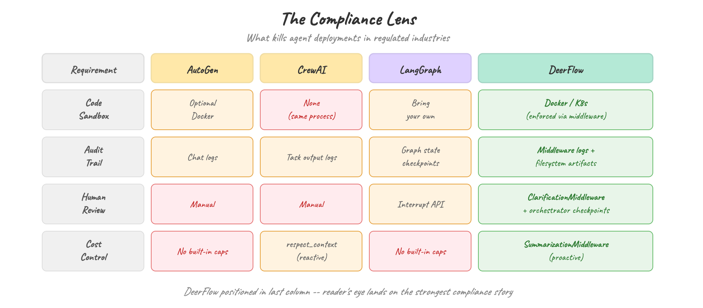

*图片来源：作者——合规视角*

## 局限性

DeerFlow 在我看过的所有方案中对可组合架构的实现是最好的，但这不意味着它可以在没有注意事项的情况下直接用于生产。

**没有公开基准测试。** DeerFlow 没有 GAIA 分数，没有 SWE-bench 结果。25,000 个 GitHub star 告诉你它很流行，但不能告诉你它更好。

**子 agent 隔离是把双刃剑。** 每个子 agent 拥有独立上下文窗口，防止了相互污染，但也断绝了实时协作。Researcher 无法在任务进行中问 Analyst："这个数据点看起来有没有问题？"所有协调都必须通过主 agent 汇总，形成瓶颈。

**ByteDance 依赖风险。** MIT 许可证，完全开源，但路线图由 ByteDance 工程师主导。相比之下，LangGraph 背后有 LangChain 的融资公司，CrewAI 有风投支持和企业客户。DeerFlow 的可持续性故事还没有写完。

**token 溢出依然存在。** SummarizationMiddleware 争取到的是余量，不是彻底解决。对于真正海量的文档处理——数百份年报、数千页内容——你仍然需要在上层叠加外部分块和检索。

## 结语

这篇文章不是在说"用 DeerFlow"。

但如果你正在考虑选择 agent 框架，可以考虑采纳这三个支柱：

1. **审视你的上下文窗口。** 在动手构建之前，先量一量 agent 上下文里实际装了什么。如果超过 30% 是未被使用的工具描述或原始源文档，你正在缴纳 token 税。

2. **尽早把状态移到磁盘。** 不要等到上下文溢出才被迫去做，从第一天起就以文件系统优先来设计。中间结果属于文件，而不是对话历史。

3. **让中间件显式可见。** 无论你使用 DeerFlow 的流水线还是自己搭建，都要让上下文管理、摘要汇总和沙箱隔离成为可模块化配置的组件，并且可以按 agent 配置。研究 10-K 年报的 agent 和撰写报告的 agent，不需要相同的中间件栈。

Karpathy 说得对：你现在是在给一个组织编程。问题是，你的这个组织的源代码，是一堆聊天消息，还是一套能够规模化的可组合架构。

---

*在离开之前：*

如果你喜欢这篇文章，可以在 Medium 上给予支持（点赞、评论和高亮）。

[关注 Yanli Liu on Medium](https://medium.com/@yanli.liu/about?source=post_page-----54cc0eedf027---------------------------------------)
