# 162:1——AI Agent 时代的网络流量结构与你的账单

> 一个被忽视的事实：在 48,633 次真实 Claude Code API 调用里，**上行 token 是下行 token 的 162 倍**。其中 96.1% 是 prompt cache 重传。Anthropic 文档与官方 SDK 源码确认：这部分字节**不会因为 cache 命中而少发**。
>
> 这不是个人使用习惯。这是 AI Agent 时代的结构性流量特征。
>
> 互联网二十年的商业模型——"内容方→用户方"——正在被反转。但绝大多数企业 IT 与云厂的合同、价目表、容量规划，**仍然停留在那个旧假设上**。

---

## 一、一个反直觉的数字：162:1

如果你做过 Web 后端运维，会本能地觉得"上行流量很小、下行流量很大"——用户点击、表单、API 请求，加起来一天也用不到几 GB；下行的图片、视频、JSON 响应，动辄几百 GB。

家宽运营商把这个直觉物理化：典型套餐**下行 1000 Mbps、上行 100 Mbps**，比例 10:1。云厂把这个直觉商业化：**入向免费、出向阶梯收费**，因为客户的"商业价值"在下行。BGP 互联结算同样：traffic ratio 接近 1:1 才能维持 settlement-free peering，因为大家假设这是稳态。

AI Agent 把这一切打穿了。

笔者最近做了一项研究：扫描本地 1,533 个 Claude Code 会话日志，统计 48,633 次 assistant 调用的 token 使用结构。结果——

| 指标 | 数值 |
|---|---|
| 上行 usage token 总计 | 6,543,776,386 |
| 下行 usage token 总计 | 40,394,466 |
| **上行 / 下行比例** | **162.0 : 1** |
| 中位数（单次调用） | 386 : 1 |
| p90 | 24,470 : 1 |

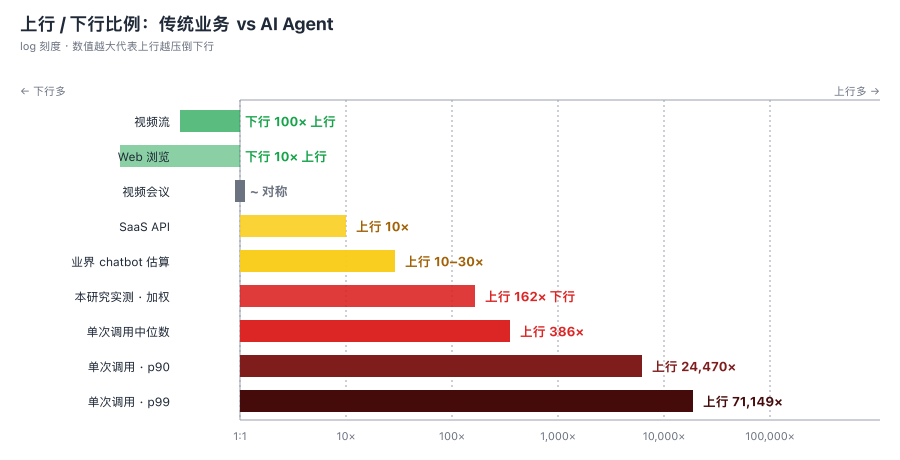

**单用户、单工具栈，比例 162:1**——比行业常见估算的 10:1 高出一个数量级。如果你的工程团队在用 Claude Code、Cursor、Devin 这类 Agent 工具，这个数字粗略代表你出口带宽里"上行流量正在发生什么"。

更扎心的细节：**96.1% 的上行 token 计入 `cache_read`**——也就是说，每一轮 API 调用都在把已经发送过的对话历史、文件内容、工具调用结果**重新打包上传一遍**。

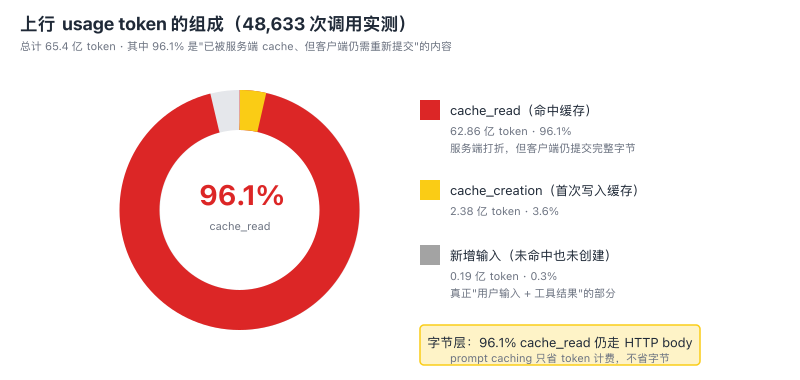

你也许会想："Anthropic 的 prompt caching 不是把 cache_read 价格打到 1 折了吗？"

**对，但只是计费打折，不是字节打折**。

---

## 二、prompt caching 的字节误解

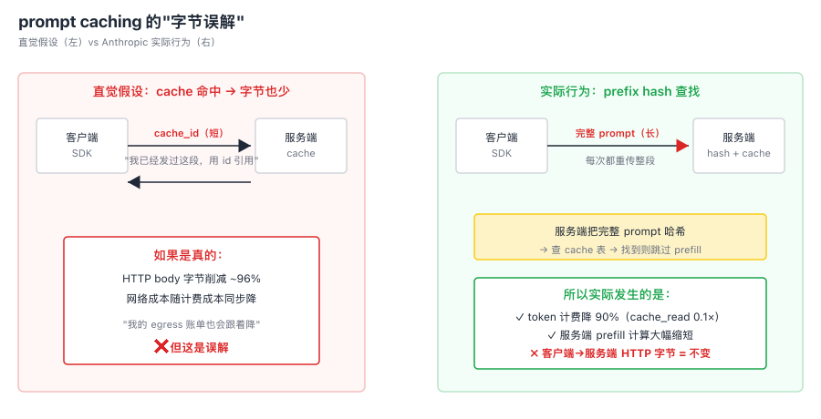

Anthropic 文档与官方 SDK 源码给出的事实链是这样的：

1. Anthropic Messages API 是**无状态接口**。多轮对话需要客户端把完整历史作为 `messages` 传入（[官方文档](https://platform.claude.com/docs/en/build-with-claude/working-with-messages)）。
2. prompt caching 的工作机制是**前缀哈希查找**：服务端在 `cache_control` 标记位置计算 prefix hash，然后在内部缓存表里查匹配。这意味着**客户端必须把完整内容发过来供服务端做 hash**。
3. 官方 Cookbook 中的 prompt caching 示例可以直接看到——第一次和第二次调用的代码**字符不差**地把整本《傲慢与偏见》拼进 `messages` 字段，区别只是服务端返回的 usage 里 `cache_read_input_tokens` 变成 187,361 而已。
4. anthropic-sdk-python 与 TypeScript SDK 的源码也确认：消息体一律完整 JSON 序列化。`cache_control` schema 里**没有** `cache_key`、`cache_id` 或任何引用语义。

**结论**：Anthropic prompt caching 把计费 token 价格降到 1 折、把服务端 prefill 计算大幅缩短，但**对客户端→服务端的 HTTP 字节，没有任何削减**。

OpenAI 提供了一条真正的字节削减路径：[Responses API](https://developers.openai.com/api/docs/guides/conversation-state) 的 `previous_response_id` 让客户端只发新 turn + 引用 id，把历史完全留在服务端。但 Anthropic 当前没有等价机制。

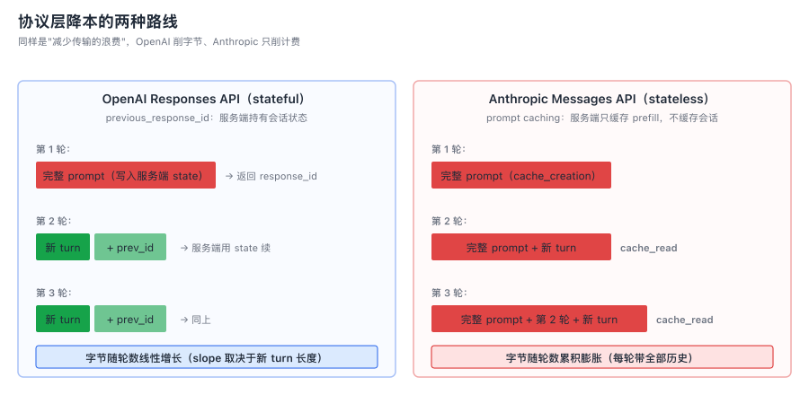

**对企业 IT 的含义**：如果你打开 GPT-4 / Claude 的账单，看到 cache_read 一栏让计费打了一折，**这不代表你的网络出口带宽也省了 90%**。它们是两个完全不同的钱袋。

---

## 三、162:1 之外，你的实际账单结构在如何被重写

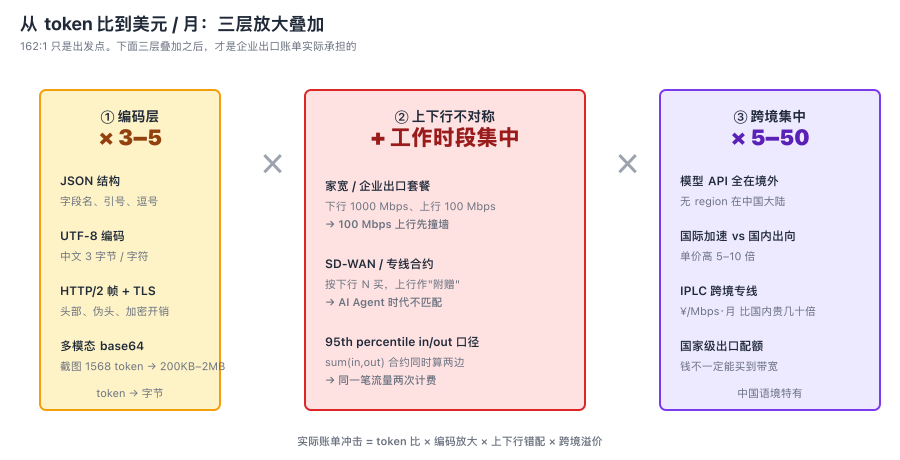

162:1 是 token 比，不是字节比。要把它翻译成"美元/月"，需要叠加三层：

### 3.1 编码层放大

每个 token 在 HTTP body 里平均要附带 3–5 字节的 JSON 结构、字段名、UTF-8 编码开销。流式响应里每个输出 token 还要附加 SSE 帧头、`data:` 前缀、双换行。多模态输入（截图、PDF）的 base64 编码会让单图字节数膨胀到 200KB–2MB——一张 Computer Use 截图就抵得上几千 token 的文本输入。

### 3.2 上下行不对称扩大

工作时间段企业出口流量结构是：

- 上行：持续高强度（多个工程师每个会话每轮都在传几 KB–几 MB）
- 下行：相对清淡（每次只回几百 token）

这和企业出口带宽采购的传统假设完全相反。SD-WAN、专线套餐基本按"下行 N Mbps，上行 N/5"在配。当 100+ 工程师团队全员使用编码 Agent 时，先撞到天花板的会是上行。

### 3.3 跨境流量集中

模型 API 的物理推理位置**没有一个在中国大陆境内**。Anthropic、OpenAI、Google AI 的 region 集中在美西、美东、欧洲、亚太边缘。这意味着：

- 中国境内企业的 Agent 调用**全部走跨境出口**
- 跨境带宽按运营商分层定价（CN2 GIA / GT / 普通 163），单价比国内出向高 5–10 倍
- 跨境专线（IPLC、MPLS-VPN）按 ¥/Mbps·月 计价，单价是国内 BGP 多线的几十倍
- 跨境带宽受**国家级出口节点配额管制**——量级到了，钱也未必能买

中国移动 2024 年报披露其总国际传输带宽为 **164 Tbps、330 POP**。这接近一条主要海缆（2Africa 180 Tbps、MAREA 200 Tbps）的容量量级。但当 AI Agent 流量真正起量时，这条管道的物理上限有可能成为约束。

---

## 四、互联网商业模型的旧前提与新事实

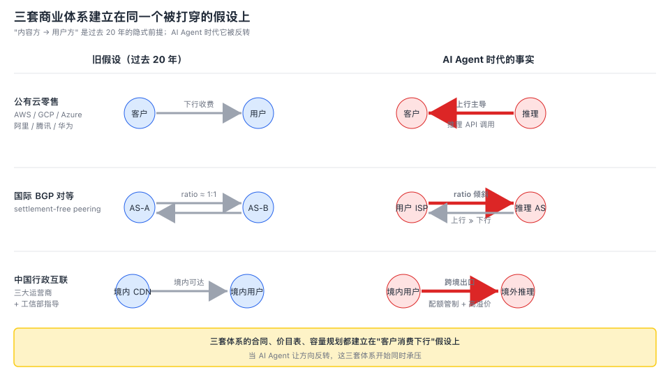

把上面的现象抽象一下，会看到三套商业体系**都建立在同一个被打穿的前提上**：

| 商业体系 | 旧前提 | AI Agent 时代的事实 |
|---|---|---|
| **公有云零售**（AWS / GCP / Azure / 阿里腾讯华为云） | 客户的商业价值在下行（出向收费、入向免费） | 客户的流量大量在上行（推理调用、工具结果） |
| **国际 BGP 对等** | Settlement-free peering 要求 traffic ratio ≈ 1:1 | 用户 ISP 端的方向开始反转 |
| **中国行政互联** | 内容资源主要是国内 CDN / 视频 | 模型 API 物理上压倒性地在境外 |

要强调一点：**当前 AI 流量量级还没有大到独立触发结算重写**。AMS-IX 2026 年的 daily peak in/out 分别是 13.308 Tb/s 和 13.281 Tb/s——几乎完美对称，差异 0.2%。IXP 公开统计里**看不到** AI 信号。Cloudflare 公开的 AI bot 流量也只占 HTML requests 的 4.2%（而且那是 web 爬虫，不是 LLM API 字节）。

但商业模型的拐点不必等到量级反转 50%。**peering ratio 政策的触发阈值通常在 2:1–3:1**，公有云大客户合约重新议价的窗口也比这更早。市场已经在动了——下文会看到。

---

## 五、各方在 2025–2026 已经做了什么

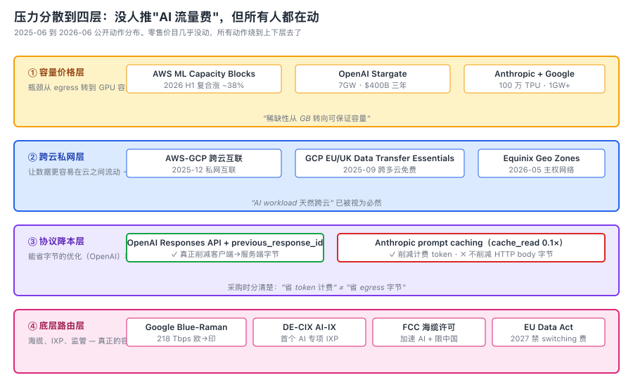

笔者拉了过去 12 个月（2025-06 到 2026-06）的公开动作。一个反直觉的发现：

**没有任何利益方在公开层面推出"AI 流量费"新计费项**。但全部动作分散到四层：

### 5.1 容量价格层：GPU 涨，不是 Egress 涨

- **AWS** 在 2026-01 和 2026-06 / 7 两次涨 EC2 Capacity Blocks for ML 的预留 GPU 价，复合涨幅约 38%。**这不是 egress 费**，但说明**稀缺性正在从"按 GB 出口"转向"可保证 GPU 容量"**。
- **OpenAI** 通过 Stargate 项目签 Oracle 五年约 3000 亿美元算力合同，计划部署 7GW 容量。**Anthropic** 与 Google 签 100 万 TPU、超过 1GW；与 Amazon 签十年超 1000 亿美元、最高 5GW 的合作。
- **中国**：国家拟投约 2 万亿元建设全国 AI 数据中心网格，目标 2028 联成单一计算网格（媒体报道，未官方确认）。

### 5.2 跨云私网层：让数据更容易在云之间流动

- **AWS** 与 **Google Cloud** 在 2025-12 发布跨云私网互联（AWS Interconnect-multicloud + Google Cloud Cross-Cloud Interconnect），服务跨云数据湖、RAG 和推理回源。
- **Google Cloud** 在 2025-09 推出 EU/UK Data Transfer Essentials，对同一组织跨多云并行处理的数据传输**免 outbound transfer fee**——欧盟 Data Act 的主动响应。
- 这意味着 hyperscaler 已经在为"AI Agent 流量天然跨云"做基础设施准备，**绕开公网 egress 收费**正在成为可选路径。

### 5.3 协议降本层：能省字节的，先省

- **OpenAI Responses API** 的 `previous_response_id` 让客户端不必每轮重传历史——**真正的字节削减**。
- **Anthropic prompt caching** 把 cache_read 单价降到 1 折——**计费降本，不是字节降本**（参见第二节）。
- 这两种路线代表两种不同的"降本"策略。如果你在采购侧 ，要分清楚——"我省下了字节"和"我省下了 token 计费"是完全不同的两件事。

### 5.4 底层路由层：海缆、IXP 和监管

- **Google Blue-Raman 海缆**（欧洲 → 印度，绕开埃及瓶颈）设计容量约 218 Tbps，本研究检索发布日期未明确，作为底层路由的代表性建设。
- **DE-CIX 推出 AI-IX**——首个 AI 流量专用 IXP 产品（[官网](https://www.de-cix.net/en/services/ai-ix)）。其他主流 IXP（AMS-IX、LINX、HKIX）截至 2026-06 仍以通用容量扩张为主。
- **2025-09 红海海缆中断**让 Azure 等服务被迫绕路——突显跨洲 AI 推理对海缆的依赖。
- **FCC** 提议更新美国海缆许可规则，加速 AI 基础设施同时限制中国技术进入。
- **EU Data Act** 2025-09-12 一般适用，2027-01-12 起完全禁止 switching charges。

**动作密度排名**（定性）：OpenAI > Google/GCP > Anthropic > 美/欧监管 > AWS > Azure > 中国侧 > IXP/ISP。

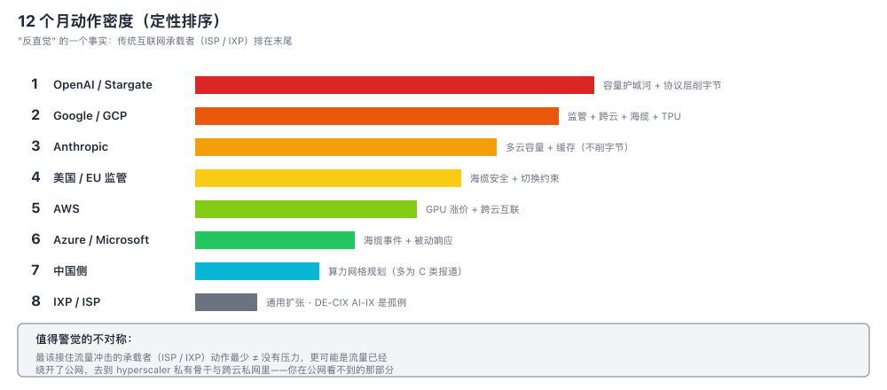

注意 ISP / IXP 在最末——除了 DE-CIX 这个例外，传统互联网承载层在 AI 议题上**远比想象的安静**。可能的解释是：流量已经绕开了公网，走 hyperscaler 私有骨干和跨云私网。这恰恰是企业 IT 应该警觉的——**真正的容量博弈在你看不到的私有合约层**。

---

## 六、企业 IT 管理团队的行动清单

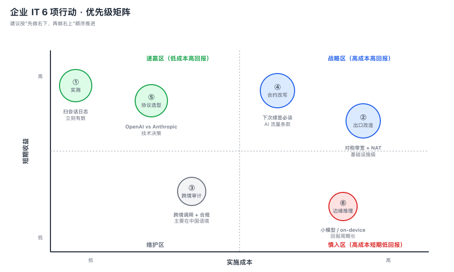

如果你是 CIO / IT 总监 / 网络架构师，看完上面这些，需要在接下来的 6–12 个月做几件事。建议按"速赢区先做（实测、协议选型）→ 战略区跟进（合约改写、出口改造）→ 维护与慎入区按需推进"的顺序展开。

### 6.1 测量你自己的 AI Agent 流量结构

在你的工程团队里实测一次 token in:out 分布，**不要相信行业平均**。差异巨大——纯对话 14:1，多 Agent 编排 228:1。具体取决于你的 workload。

最低成本：扫描 Claude Code / Cursor / Codex 的本地会话日志，按 token 类别统计。笔者公开了一个 Python 扫描脚本作为参考（见[研究原始数据](.)）。

下一步：在企业出口做透明 HTTPS 代理（mitmproxy + 内部 CA），抓实测 HTTP body 字节，把 token 比换算成真实字节比。这是把"模糊估算"升级为"采购决策依据"的关键一步。

### 6.2 重新评估出口带宽采购模型

传统出口带宽采购按"下行 N Mbps、上行 N/5"。如果你的团队有 100+ 工程师在重度使用 Agent，**上行先撞天花板的概率不低**。

- 升级前先实测，否则升级方向会错（很可能你需要的是上行而不是下行）
- 与 SD-WAN / 专线供应商重新谈判"对称带宽"条款——通常这是溢价的，但 AI Agent workload 下值得
- 注意 95th percentile 计费的 in/out 口径：如果你的合约是 `sum(in, out)`，那 AI Agent 流量会让账单同时被两个方向推高
- 出口 NAT 池容量——SSE 长连接 + 多 Agent 并发会比传统 SaaS 消耗更多 conntrack 表项

### 6.3 跨境 AI 调用的成本与合规审计

这是中国语境下最容易被忽视的成本。

- 盘点你的 AI Agent 调用里有多少走跨境出口
- 跨境流量按"国际加速 / CN2 GIA / 普通 163 / IPLC 专线"分层定价，单价差几倍到几十倍——你的实际路径可能不是最经济的
- 跨境带宽配额受运营商和监管层约束，**钱不一定能买到带宽**
- 数据出境合规：跨境 prompt 里有没有 PII、商业秘密、客户数据——这是与流量结构无关但同时存在的法律风险

### 6.4 把"AI 流量"写进云合约条款

下一次续签云合约或谈大额承诺时，把以下条款明确化——**别等云厂主动告诉你**：

- AI 推理调用相关流量的计费方式（特别是当推理服务商和你共在同一云上时的"内部循环"流量）
- 跨区流量（如果你的应用和模型 API 不在同一区域）
- 出向带宽承诺折扣阶梯——AI workload 的出向曲线可能与传统 SaaS 不同，旧的承诺曲线可能不再省钱
- 大客户专属网络产品（Direct Connect、ExpressRoute、Cloud Interconnect）的 AI 流量优惠

### 6.5 关注协议层降本

如果你的应用同时支持 OpenAI 与 Anthropic：

- OpenAI Responses API 的 `previous_response_id` 是**真正能省字节**的——适合长上下文 Agent
- Anthropic prompt caching 省 token 计费但不省字节——适合关心成本而非带宽的场景
- 多模态调用（截图、PDF）的字节成本是文本调用的几个数量级——预算时单独算一档

### 6.6 边缘推理与小模型

不是所有 Agent 任务都需要前沿模型。Gemini Flash/Lite 类小模型 + 端侧推理（Gemini Robotics On-Device）的方向已经清晰——**用小模型分流减少跨境调用**，能从源头削减大头流量。

---

## 七、公有云服务提供商的考虑

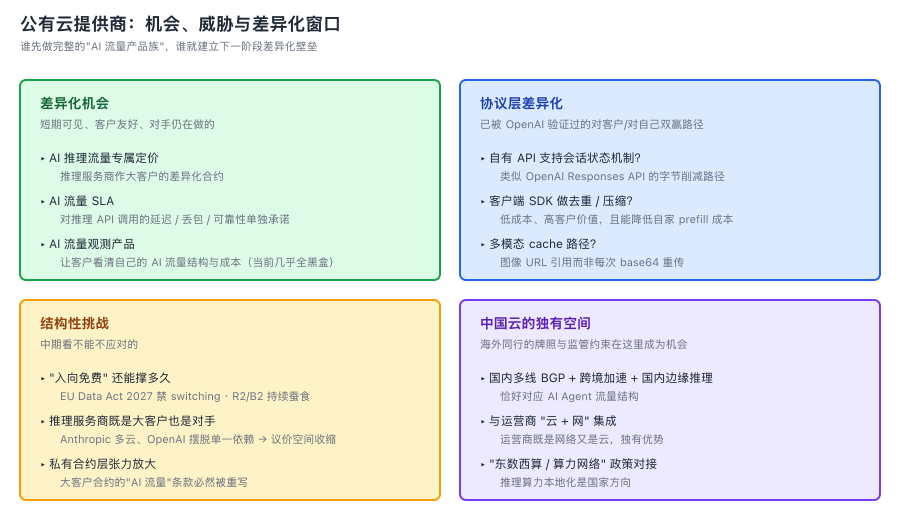

如果你是 AWS / GCP / Azure 或中国公有云的产品负责人 / 架构师，下面这些是同行已经在做或即将做的事——你可以同时看作"机会"和"友商已经领先的距离"。

### 7.1 "入向免费"还能维持多久？

短期看，三大云的零售价目表对 AI 流量基本没有专项调整。这是合理的——AI 流量在总流量里的占比还没大到值得专门定价。

但拐点临近的信号已经在三个方向出现：

- **客户层面**：推理服务商作为单一大客户的流量量级在快速增长，他们与你的合同条款可能已经在悄悄变化
- **挑战者层面**：Cloudflare R2、Backblaze B2 等"零出向"竞争者正在把"egress 是利润中心"叙事变成市场化反证
- **监管层面**：EU Data Act 2025-09-12 适用、2027-01-12 起禁止 switching charges——这是法律对 egress fee 的硬性约束

如果你的入向免费政策没有在 2026–2028 之间的某个时点重新设计或精细化，竞争对手会逼你做。

### 7.2 推理服务商既是大客户也是竞争对手

OpenAI、Anthropic 是你最大的 GPU 与网络客户，同时是你 Bedrock / Vertex / Azure AI 自有 API 业务的直接竞争对手。这种"客户兼竞争对手"关系在云行业并不新鲜，但 AI 让它的张力放大到史无前例的程度。

- 不要假设大客户合约能持续——Anthropic 已经在 AWS 之外签 Google TPU；OpenAI 在 Stargate 项目里部分摆脱了 Azure 单一依赖
- 自有 AI 产品要在"用户体验"层面真正可竞争，而不只是"作为 hyperscaler 我什么都有"——产品体验差距会让客户在合约谈判时拥有筹码

### 7.3 跨云互联是新一代"基础设施定价"

AWS-Google Cloud Cross-Cloud Interconnect、GCP Data Transfer Essentials 都是同一个方向：**降低多云数据搬运摩擦**。

这背后的逻辑是：客户的 AI workload 天然跨云（数据在云 A、模型 API 在云 B、应用在云 C），如果你的出向定价对这种 workload 不友好，客户会绕开你（用专线、用对手的跨云产品、用挑战者）。

如果你还在用"出向阶梯收费"作为主要利润来源，请认真考虑这个产品方向的产品 vs 利润权衡。

### 7.4 协议层是被忽视的差异化点

OpenAI Responses API 是协议层差异化的代表——通过让客户端少传字节，让客户的网络成本降低。这是一个**对客户友好、对自己也有 SLA 好处**（少了无效的 prefill）的双赢机制。

对应到云厂自有 AI 产品（Bedrock、Vertex AI、阿里通义 API）：

- 你的 API 是否支持类似的会话状态机制？
- 你的客户端 SDK 是否在做哪怕一层最简单的去重 / 压缩？
- 你的多模态输入是否支持 cache 路径（图像 URL 引用而不是每次 base64 重传）？

这些都是**低成本、高客户价值**的协议层改进。

### 7.5 边缘推理与跨区路由

Google 在端侧推理（Gemini Robotics On-Device）、TPU 集群内网络、AI Hypercomputer 上已经走得很远。其他云厂的对应布局：

- 边缘节点的 GPU 配置（让推理离用户更近）
- 跨区流量优化（多区域推理的智能路由）
- 海缆 / 自有骨干（减少对 transit 的依赖）

中国云厂在跨境层面有特殊约束（牌照、监管、配额），但**国内多线 BGP + 跨境加速 + 国内边缘推理**的产品组合恰好对应 AI Agent 流量结构——这是中国云厂相对海外同行的差异化空间。

### 7.6 "AI 流量专项"产品的窗口

DE-CIX AI-IX 是第一个进入这个赛道的——其他 IXP 还没跟。云厂的对应空间：

- **AI 推理流量专属定价**（针对推理服务商作为客户，按调用类型差异化）
- **AI 流量 SLA**（针对企业客户，对推理 API 调用的延迟、丢包、可靠性单独承诺）
- **AI 流量观测产品**（让企业客户能看清自己的 AI 流量结构与成本——这是绝大多数客户当前还在黑盒里的）

谁先推出第一个真正完整的"AI 流量产品族"，谁就建立了下一阶段的差异化壁垒。

---

## 八、几个还没有答案的问题

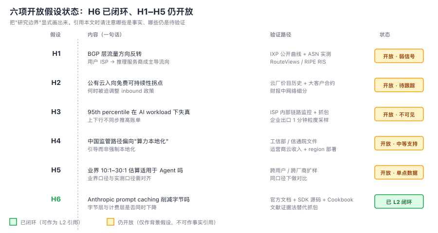

诚实地说，这项研究里有一些**结构性论断仍未被严格证实**。如果你在做决策时引用这篇文章，请注意以下边界：

1. **162:1 是 token 比，不是字节比**：编码层放大系数（JSON、SSE、base64）未实测，token 比是字节比的近似下界，但不是严格等价
2. **是否真的"BGP 流量方向反转"**：当前 IXP 公开数据看不到信号，可能是量级不足，也可能是流量绕开了公网
3. **入向免费拐点的具体年份**：本研究只给方向判断（数年内可能调整），不给精确年份
4. **中国监管路径的具体形式**：算力本地化是方向，但"鼓励 / 引导 / 强制"的力度差异很大，目前无法预判

这些问题需要更多团队、更长时间、更高质量的实测数据来回答。如果你的企业 IT 或公有云团队愿意做这种实测（出口代理抓包、跨用户 SDK instrumentation、ISP 内部 DPI），你做出的数据集本身可能就是行业里**最强的可信度信号**。

---

## 九、一句话总结

> AI Agent 可能正在动摇互联网最底层的商业假设——"内容方→用户方"。三套结算体系（公有云入向免费、BGP 对等、中国行政互联）都建立在这个旧假设上。
>
> 在 Anthropic usage token 计量层面观测到的 162:1 上下行不对称，是一个**值得跟踪的信号**，但具体的网络字节、跨用户分布、全球量级仍有待扩样验证。
>
> 当前量级尚不足以独立触发结算重写，但**资本市场和大客户已经在为未来 2-5 年的拐点做基础设施准备**。研究、监测、合同条款的更新工作，应当现在开始。

---

## 附：本文背后的研究

本文是基于一份内部研究报告的可读版本。完整报告（约 28 万字符、25 份文档）覆盖：

- 国际 BGP 结算与互联底座的历史脉络
- AWS / GCP / Azure 出向定价 20 年变迁与 EU Data Act 影响
- 中国互联网结算的行政 + 市场 + 牌照三层结构
- 48,633 次 Claude Code API 调用的单用户实测数据
- Anthropic prompt caching 字节行为的文献证据法验证（**H6 假设**）
- 各利益方 2025-2026 公开行动密度分析
- 六项开放假设（H1-H6）的验证方法与反证条件

完整研究采用四级证据评级（已实测 / 已发布 / 共识 / 推断）严格区分论断强度，并经过 Codex-B 三轮对抗审稿。所有数据点带可点击 URL，待复现脚本与抓包协议公开。

如果你或你的团队对本研究的实测数据、扩样合作、或独立验证有兴趣，欢迎联系。

---

*报告版本：v1.2.1*
*实测数据期：2025-2026*
*作者：饶辽源，2026-06-27*
