> 作者：Simranjeet Singh
> 发布日期：2026-04-08
> 原文链接：https://ai.plainenglish.io/agent-harness-12-agentic-harness-patterns-from-claude-code-5505b7c239c4

# Agent Harness：来自 Claude Code 的 12 种智能体控制框架模式

一份面向从业者的指南，告诉你如何设计 LLM 周围的那一层控制结构。

你已经做出了一个 AI 智能体（agent）。

它工作得很漂亮，大概能撑五步。

然后就出问题了。

它幻觉出一个根本不存在的函数。
它忘了自己刚才在做什么。
它覆盖了一个本不该碰的文件。
它陷入毫无意义的循环。

你调整提示词。
你换一个模型。
你塞进更多上下文。

仍然不稳。

于是你怪罪模型。

但有一个不太舒服的真相：

问题不在你的模型。
问题在你的 harness。

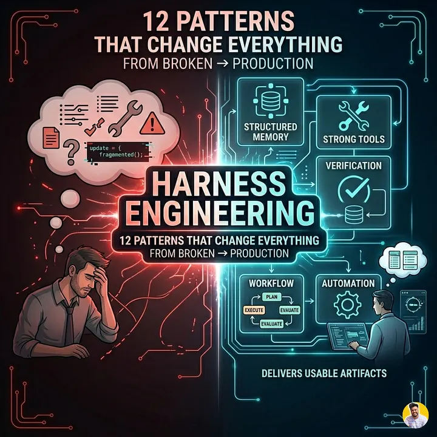

把一个炫酷 demo 和一套生产级 AI 系统区分开来的，从来不是智能；而是控制。

高级智能体背后真正的“魔法”，并不藏在 LLM 内部。
它在 LLM 周围那一层——那个负责做决定的系统里。

模型看到什么
模型被允许做什么
模型如何从失败中恢复
模型如何记住重要的事

这一层现在有了一个名字：

控制框架工程（Harness Engineering）

理解了它之后，你做智能体的方式不会再和从前一样。

先了解一下 Agent Harness 或 Meta-Harness。

[Agent Harness：决定你的 AI 智能体输赢的那层不可见结构](https://medium.com/@simranjeetsingh1497/agent-harness-the-invisible-layer-that-decides-whether-your-ai-agent-wins-or-loses-f946370ed2a1)
什么是 agent harness，以及为什么它比模型本身更重要。

medium.com

## 控制框架工程到底是什么？

大多数人以为做 AI 智能体是在做提示词。

不是。

提示词只是表层。
真正的系统在底下。

控制框架工程是一种实践——围绕 LLM 设计控制层：那些塑造模型长期行为的代码、结构与规则。

它涵盖一切位于以下两端之间的东西：

原始模型输出 → 真实世界中的动作

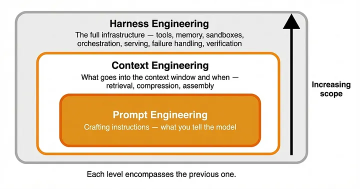

### 一个更精确的定义

控制框架工程的定义如下：

有意识地设计 LLM 周围的那一整套系统，由它来决定 LLM 如何感知上下文、执行动作、管理记忆与处理失败。

它包括：

上下文构建（context construction，即什么进入提示词）
记忆系统（什么在多步之间保留）
工具编排（tool orchestration，即智能体能做什么）
权限边界（permission boundaries，即智能体被允许做什么）
恢复逻辑（recovery logic，即出错时会怎样）

关键的洞察是：

决定你的智能体是否可靠的，是 harness，不是模型。

### 为什么现在这件事变得重要

最近的研究和真实世界的落地讲清楚了一件事：

再好的模型，没有结构也会失败。

实践中，今天做智能体仍然非常依赖人工：

观察失败
用启发式规则去打补丁
反复迭代

它更不像传统软件工程……
更像是用受约束的引导去训练一个系统。

这正是为什么控制框架工程恰好坐在三个学科的交汇处：

#### 1. 系统设计

你正在搭建一个分布式系统：

状态在多步之间流动
当下的决策影响未来的行为
失败如果不被控制就会级联放大

糟糕的 harness 造就脆弱的智能体。
好的 harness 造就有韧性的系统。

#### 2. UX，但服务对象是模型

这样想：

你的 LLM 就是你的用户。

提示词是 UI
上下文是导航
工具是可供性（affordance）

如果体验混乱、过载或不一致……

模型就会表现糟糕——和人类一样。

#### 3. 提示词架构

提示词依然重要——但只是一个更大系统中的一部分。

如果没有：

结构化的记忆
受控的执行
分阶段的工作流

……再好的提示词也会在真实复杂度面前崩塌。

### 缺失的心智模型

经验丰富的 AI 工程师靠直觉一直在做的事，现在变得显式了：

你不是在“调用”一个 LLM。
你是在为它设计一个它在其中运行的环境。

而那个环境——也就是 harness——决定了：

稳定性
可扩展性
安全性
性能

### 转变：从写提示词 → 做工程

我们正在从这里出发：

旧心态 → 新心态

“写更好的提示词” → “设计更好的系统”

无状态调用 → 有状态执行

“希望它能跑通” → “保证它会按预期运行”

调试输出 → 工程化约束

### 为什么大多数智能体会失败

智能体出问题，原因极少是模型“笨”。

而是因为：

上下文要么过载要么缺失
记忆不一致
动作无约束
失败无人处理

换句话说：

要么没有 harness，要么 harness 设计得很差。

### 关键性的洞察

对生产级编码智能体的深入解剖揭示了一件很有力量的事：

业余智能体和生产就绪系统之间的差距，不在于智能，而在于模式。

可复用、可组合的设计模式。

这些模式：

稳定行为
组织工作流
管理复杂度
让长周期的自主能力成为可能

而这正是接下来要讲的：

把脆弱智能体变成可靠系统的 12 个控制框架工程模式。

## 推动生产级智能体的 12 种模式

高级 AI 智能体里看上去像“魔法”的东西，本质是结构。

对真实系统的细致拆解（比如 Generative Programmer 分析过的那类 Claude Code 风格智能体）揭示了一个重要事实：

生产级智能体不是更聪明，而是组织得更好。

它们依赖的是一小组可复用模式。一旦你看见了它们，就会到处都看到它们。

我们一个一个拆。

## 记忆与上下文（5 种模式）

### 1. 持久指令文件（CLAUDE.md 模式）

大多数智能体在两次会话之间会忘掉一切。

生产级智能体不会。

它们依靠一个持久指令文件——一份活文档（living document，常被命名为 CLAUDE.md 或类似名字），用来定义：

编码规范
项目结构
命名约定
行为规则

这个文件总是被注入上下文，扮演长期的“人格 + 策略层”。

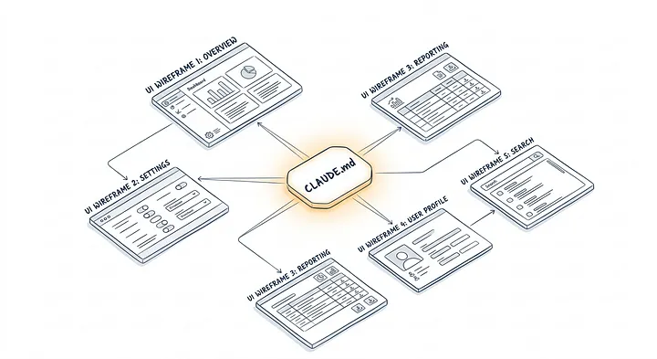

示例：
一个跨会话工作的编码智能体永远不会忘记：

“用 TypeScript，不要 JavaScript。”
“所有 API 路由必须遵循 /api/v1/。”
“未经确认不得修改 /core/ 中的文件。”

不需要每次都重复指令，harness 会去强制执行。

事实：持久指令层能减少提示词的膨胀，并稳定多次会话之间的输出。

### 2. 范围化上下文装配（Scoped Context Assembly）

把整个代码库一股脑塞进上下文是个错误。

生产级智能体只加载与当前作用域相关的内容。

不同目录 → 不同规则 → 不同上下文。

示例：
在一个 monorepo 里：

/frontend/ 加载 UI 规范
/backend/ 加载 API 契约
/infra/ 加载部署配置

harness 会根据智能体当前所处的位置，动态装配上下文。

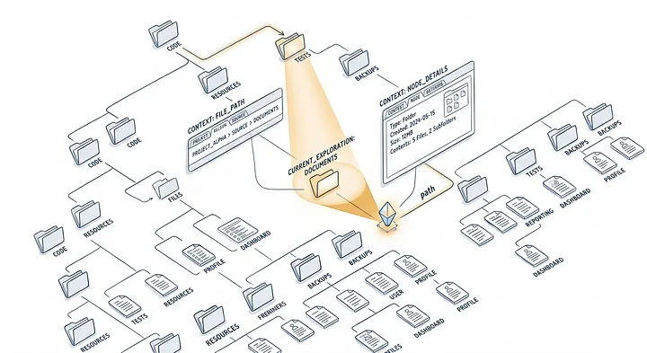

事实：更小、范围更明确的提示词能提高准确率，并减少幻觉。

### 3. 分层记忆（三层设计）

不是所有记忆都该一视同仁。

生产级系统使用三层结构：

紧凑索引（compact index）→ 对所有内容的快速摘要
按需加载文件（on-demand files）→ 针对具体话题的详细记忆
归档对话记录（archived transcripts）→ 完整历史，几乎不访问

这样既能避免上下文过载，又能保留长期知识。

示例：
不是一次塞进 50k tokens：

智能体先读摘要索引
仅在需要时拉取详细笔记
除非必要，忽略旧的对话记录

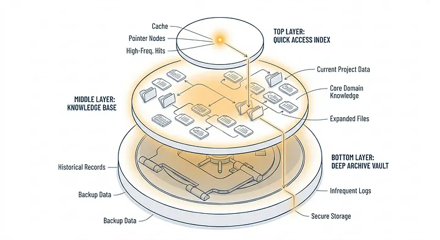

事实：分层记忆让长时段任务在不撞上下文上限的前提下成为可能。

### 4. 梦境整合（Dream Consolidation，即 AutoDream 模式）

这里就开始有意思了。

生产级智能体不仅存储记忆，还会清理记忆。

在空闲时间，一个后台进程会：

去除重复
合并相似想法
压缩冗余上下文

可以把它想成 AI 的“睡眠模式”。

示例：
经过对一个特性的多轮迭代之后：

冗余的笔记被合并
过时的步骤被去掉
只留下最新的理解

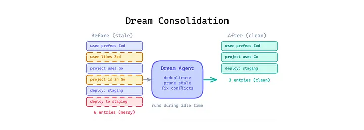

事实：没有整合机制，记忆系统会随时间退化。

### 5. 渐进式上下文压缩（Progressive Context Compaction）

随着对话变长，上下文成本变高。

生产级系统使用多阶段摘要，对上下文进行随时间的压缩。

早期阶段 → 完整细节
中期阶段 → 摘要片段
后期阶段 → 高层抽象

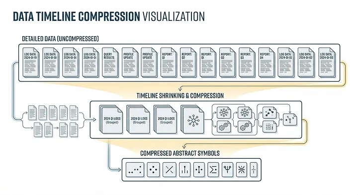

示例：
一个 200 步的工作流变成：

最近 5 步（保留细节）
最近 20 步（已摘要）
更早的步骤（仅保留压缩后的洞见）

事实：渐进式压缩对长时间运行的智能体不可或缺。

## 工作流与编排（3 种模式）

### 6. 探索 → 计划 → 行动 循环（Explore → Plan → Act Loop）

业余智能体上来就动手。

生产级智能体不会。

它们把执行分成三个不同阶段：

Explore（只读）→ 收集信息
Plan → 决定要做什么
Act → 执行变更

每一阶段拥有递增的权限。

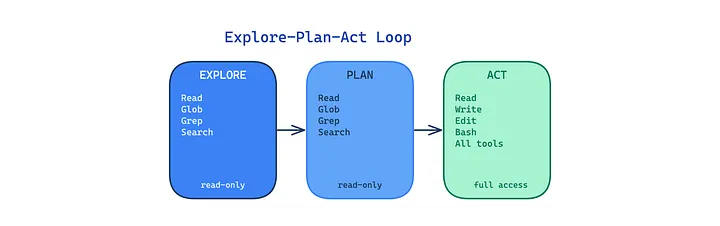

示例：
在改代码之前：

Explore：读文件
Plan：列出变更要点
Act：应用编辑

事实：这能显著降低破坏性错误的发生。

### 7. 并行工作流（Parallel Workstreams）

能用一个智能体做完，为什么不用多个？

生产级系统会为相互独立的任务派生多个子智能体。

然后再合并结果。

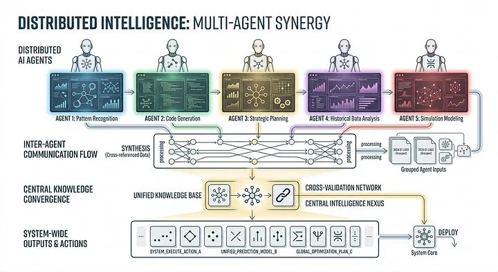

示例：
对一个特性需求：

智能体 1 → 后端逻辑
智能体 2 → 前端 UI
智能体 3 → 测试

一个监督者智能体把所有结果整合起来。

事实：并行化能显著提升速度与模块化程度。

### 8. 校验门（Verification Gate）

这是最重要的模式之一。

任何破坏性动作之前，智能体都必须先通过一个校验步骤。

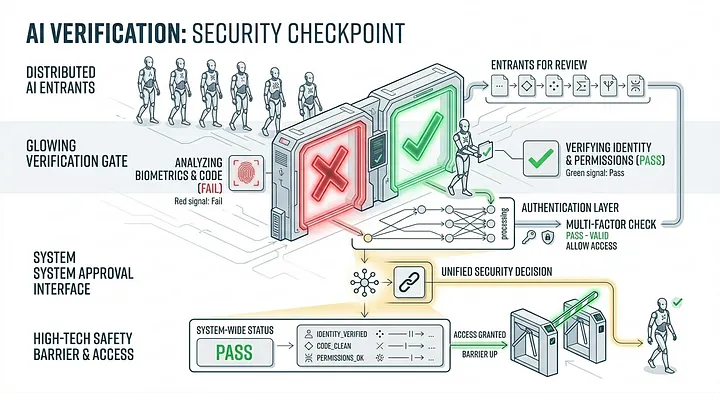

示例校验项：

“这会删除重要文件吗？”
“这会破坏现有功能吗？”
“这是否符合指令？”

只有通过校验之后 → 动作才被允许执行。

事实：校验门是安全自主性的关键。

## 工具与权限（2 种模式）

### 9. 最小权限范围（Minimal Permission Scope）

不要给智能体完整访问权限。

只给它当下需要的部分。

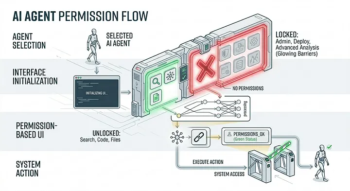

示例：

Explore 阶段 → 只读访问
Plan 阶段 → 不允许执行工具
Act 阶段 → 受限的写权限

事实：权限过剩的智能体是破坏性失败的头号成因。

### 10. 工具适配层（Tool Adapter Layer）

直接调用工具很脆。

生产级系统在智能体与工具之间放一个适配层。

它带来的能力包括：

测试
mock
日志
安全执行

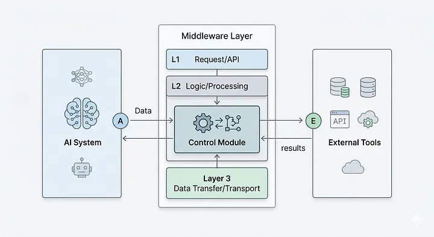

示例：
不是直接调用 API：

智能体 → 适配器 → API

适配器可以在测试时模拟响应。

事实：这种抽象在成熟软件系统中是标配——现在被搬到 AI 智能体上。

## 自动化（2 种模式）

### 11. 无头批处理模式（Headless Batch Mode）

并不是每个智能体都需要 UI。

生产级系统会把智能体作为流水线的一部分在后台运行。

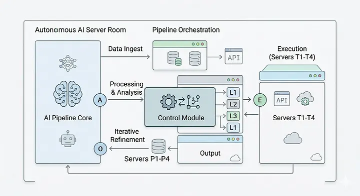

示例：

CI/CD 流水线运行智能体来：
重构代码
更新依赖
生成测试

无需人工交互。

事实：无头智能体真正解锁了企业级自动化。

### 12. 自愈循环（Self-Healing Loop）

事情一定会失败。

生产级智能体不会崩——它们会恢复。

它们会侦测失败信号：

错误信息
测试失败
非法输出

然后带着调整重新尝试。

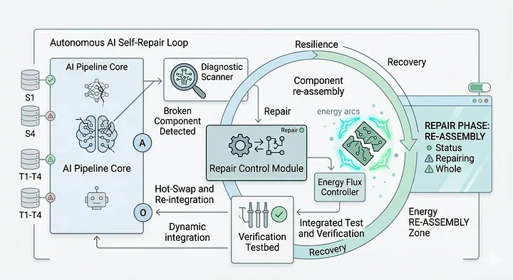

示例：

API 调用失败 → 智能体用修正过的参数重试
测试失败 → 智能体改写代码并重新运行

事实：自愈对长时间运行的自主系统是必备能力。

### 全景视角

单独看，这些模式都很有用。

合起来，它们形成了某种更有力量的东西：

一个结构化、有韧性、生产级的智能体系统。

差别就在这里：

业余智能体 → 反应
生产级智能体 → 运行

一旦你开始用这些模式去做设计……

你就停止了“写提示词”——开始“工程化智能”。

## 智能控制框架运行时（IHR）：让 harness 可以被执行

到这里，你理解了这些模式。

你能设计记忆系统。
你能组织工作流。
你能控制权限。

但还有一个更深的问题：

这一切实际上是怎么跑起来的？

因为 harness 不是一份设计稿。

它是一个有生命的系统。

最近的研究里出现了一个有力量的想法：

智能控制框架运行时（Intelligent Harness Runtime，IHR）

### 核心转变：从静态 harness → 可执行系统

大多数构建者把 harness 当作配置：

一组提示词
一些规则
一点编排逻辑

但在高级系统里，harness 不是被动的。

它在运行时被解释执行。

这就是 IHR 的关键想法：

LLM 不只是在生成输出——它是在主动解释并执行 harness 本身。

### IHR 实际在做什么

在每一步，系统会循环走过一个决策周期：

读取 harness（规则 + 结构）
读取当前状态（记忆 + 文件 + 进度）
读取环境（工具 + 输出 + 约束）
遵循运行时章程（runtime charter，包含预算、权限、失败规则）
决定下一步最优动作

然后重复。

这造就了与传统智能体根本不同的一种东西：

一个闭环系统，模型持续地推理“它应当如何行为”——而不仅仅是“它应当输出什么”。

### 为什么这件事重要

没有 IHR，大多数智能体的行为像这样：

输入 → 输出 → 完成

有了 IHR，行为变成：

输入 → 推理 → 行动 → 观察 → 调整 → 重复

这个循环是以下能力的来源：

长周期任务
适应性行为
自我纠错
带约束的多步推理

换句话说：

IHR 把 LLM 从一个函数变成了一个运行时。

### IHR 的三个核心组件

要理解它在实践中怎么运转，把它拆成三部分。

#### 1. 在循环内部的 LLM 解释器（In-Loop LLM Interpreter）

这是循环里的“大脑”。

不是一次性调用 LLM，而是把它持续保留在循环之中。

每一步，模型都：

解释 harness
评估当前状态
选择下一步动作

它不再只是回答问题。

它是在约束下做决策。

#### 示例

想象一个修 bug 的编码智能体：

第 1 步 → 读取错误日志
第 2 步 → 检查相关文件
第 3 步 → 提出修复
第 4 步 → 应用补丁
第 5 步 → 运行测试
第 6 步 → 侦测到失败 → 重试

每一步都由 LLM 动态地决定。

事实：这种循环式执行是智能体能处理“需要迭代而非一次完成”的任务的根本原因。

#### 关键洞察

模型不再是无状态的。

它变成了一个对自身环境具有状态意识的解释器（state-aware interpreter）。

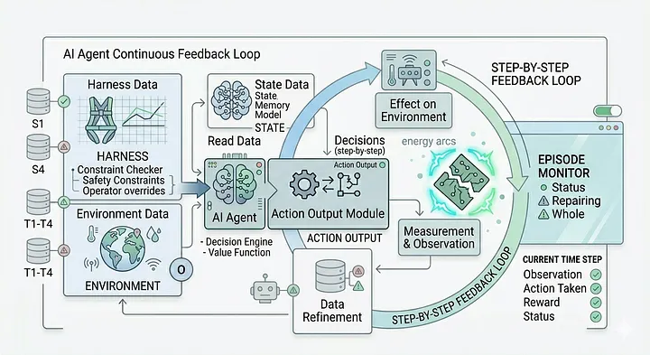

#### 2. 后端（工具 + 多智能体接口）

只有解释器是没有用的。

这就需要后端登场。

它提供：

终端访问（文件系统、代码执行）
API 与外部工具
多智能体协作接口

把它当作执行层。

#### 示例

当智能体决定：

“读文件” → 后端取来文件
“跑测试” → 后端执行命令
“派生子智能体” → 后端来编排

LLM 自己不直接动手。

它请求动作，由后端去完成。

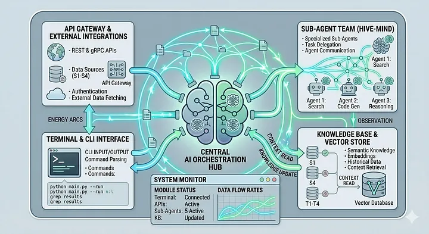

#### 为什么这一层至关重要

没有结构化的后端：

工具调用变得不一致
输出变得不可靠
调试变得不可能

有了合适的后端：

每一个动作都是可观测、可控制、可复现的。

#### 多智能体扩展

这里也是并行工作流落地的地方。

运行时可以：

派生子智能体
分配任务
合并输出

全在同一个系统之内。

#### 3. 运行时章程（系统规则）

这是被低估最严重——也是最重要——的组件。

运行时章程定义了：

什么算是合法状态
哪些动作被允许
失败长什么样
恢复应当如何发生
哪些约束绝对不可被突破

它本质上就是你智能体的“宪法”。

#### 示例

一个运行时章程可能包含：

“未经校验，不得修改生产文件”
“失败的 API 调用最多重试 3 次”
“测试覆盖率低于 80% 时立即中止”
“记录每一次文件写入”

这些不是提示词。

这些是被强制执行的行为契约。

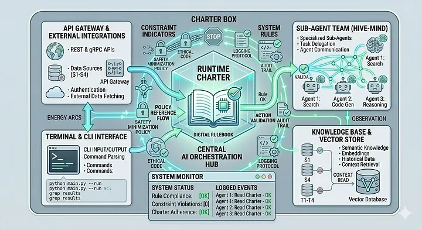

#### 为什么这件事改变一切

大多数智能体失败的根本原因，是规则隐式的。

运行时章程让规则变得显式。

它把“希望模型守规矩”变成“保证系统守规矩”。

#### 失败处理

最大的优势之一是：

失败不再是不可预测的。

它们是：

被分类的
被预期到的
被系统化处理的

### 把它们组装到一起

把这三个组件合在一起，你得到的是：

一个会思考的循环（LLM 解释器）
一个会动手的层（后端工具）
一个会治理的系统（运行时章程）

合起来，它们形成：

一个可执行的 harness。

### 心智模型升级

IHR 之前：

你写提示词
你祈祷输出还行

IHR 之后：

你定义系统
智能体在系统之内运行

### 真正的突破

这是从最近的研究与真实世界系统中浮现出来的一个更深层洞见：

AI 智能体的未来不是更好的提示词。

而是更好的运行时（runtime）。

## 如何上手：5 步 harness 设计流程

到这里，这些想法可能让人觉得复杂。但开始其实非常简单。

下面是一套你今天就能落地的 5 步流程：

### 1. 先写一份 CLAUDE.md（或等价物）

在动手做任何东西之前，先定义你智能体的规则。

这份文件应该包含：

编码规范
约束条件
该做什么、不该做什么
预期行为

把它当作智能体的“操作手册”。
没有它，每一次会话都从零开始。

### 2. 把任务映射到阶段

把工作流拆成清晰的阶段，比如：

Explore（只读）
Plan（仅推理）
Act（执行）

然后为每个阶段分配权限。

例如：

Explore → 仅读文件
Act → 受限写权限

这能预防绝大多数破坏性错误。

### 3. 把重要状态外部化

决定哪些信息必须在以下场景中存活下来：

长任务
上下文上限
重启

然后把这些信息存进文件（而不是只放在提示词里）。

举例：

摘要
决策记录
中间产物

如果它重要，它就该存在于上下文窗口（context window）之外。

### 4. 定义你的失败分类（failure taxonomy）

列出你智能体可能出错的所有方式：

输出错误
工具报错
任务未完成
不安全的动作

然后定义每种情形下应当发生什么：

重试
回滚
升级
停止

这样能把失败从“惊吓”转化为“可处理事件”。

### 5. 先搭一个小的校验 harness

不要从一个完整系统开始。

而是：

搭一个最小的设置
测试一个工作流
验证行为

只有在它稳定之后再扩展。

这能降低复杂度并加快学习速度。

## 收尾思考

你现在能用手工方式设计 harness 了。

你理解了这些模式。
你知道如何组织系统。
你能做出更可靠的智能体。

但还有一个转折：

研究者们正在构建让 AI 自己设计自己 harness 的系统。

不只是任务。
不只是代码。
而是控制层本身。

这件事改变一切。

## 如果这份指南帮到了你……

如果你学到了新东西，或者觉得这次拆解有用：

留个评论——分享你在自己的项目中觉得最可靠的指标。
点赞（或者双击点赞！）来帮助更多 AI 构建者发现这份指南。

把它分享给你的同事或社区，每一次对话都让我们离“更好、更公平的 AI 评估”更近一步。

[Google ADK Agentic AI 12 篇博客系列（含项目源码）](https://medium.com/@simranjeetsingh1497/google-adk-in-2026-the-complete-beginners-guide-to-building-ai-agents-part-1-2aca04ddf6ff)

[Agentic AI 14+ 个项目](https://www.youtube.com/playlist?list=PLYIE4hvbWhsAkn8VzMWbMOxetpaGp-p4k)

[GenAI 完整路线图（学习 LLM — RAG — Agentic AI 与配套资源）](https://youtu.be/4yZ7mp6cIIg)

[从零学 RAG 与端到端项目](https://www.youtube.com/playlist?list=PLYIE4hvbWhsAKSZVAn5oX1k0oGQ6Mnf1d)

[GenAI 75 Hard Challenge（含源码与资源）](https://github.com/simranjeet97/75DayHard_GenAI_LLM_Challenge)
[Kaggle Notebooks with LLM Fine-Tuning](https://www.kaggle.com/simranjeetsingh1430)

[YOUTUBE：GenAI / 深度学习 / 机器学习的领域端到端项目](https://www.youtube.com/@freebirdscrew2023)

如果你喜欢这篇文章并希望支持我，请：

为这篇故事鼓掌（100 次掌声）并关注我 👉🏻 Simranjeet Singh

在我的 Medium 主页查看更多内容

关注我：Medium | [GitHub](https://github.com/simranjeet97) | [Linkedin](https://www.linkedin.com/in/simranjeet97/) | [Community](https://chat.whatsapp.com/EhsiKqFWHTb0ENlr6cGMiF?mode=ems_copy_t) | [Topmate](https://topmate.io/simranjeet97/145435)

把我的内容分享给你的朋友与同事，帮我触达更广的读者。

来自我们创始人的一段话

嘿，我是 Sunil。我想花一点时间感谢你读到这里、感谢你成为这个社区的一员。你知道吗，我们的团队是以志愿者的方式在运营这些刊物，每月服务超过 350 万读者。我们没有任何资金资助，做这件事完全是为了支持社区。

如果你想表达一点支持，请花一点时间在 LinkedIn、TikTok、Instagram 上关注我。你也可以订阅我们的每周通讯。在你离开之前，别忘了为作者鼓掌并关注 ️！
