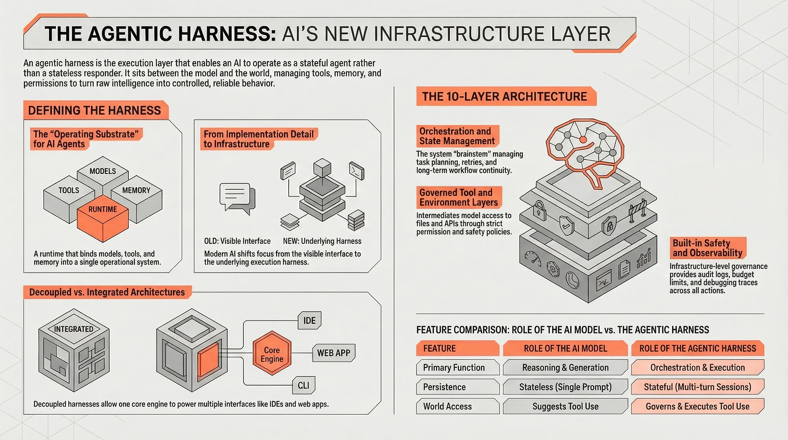
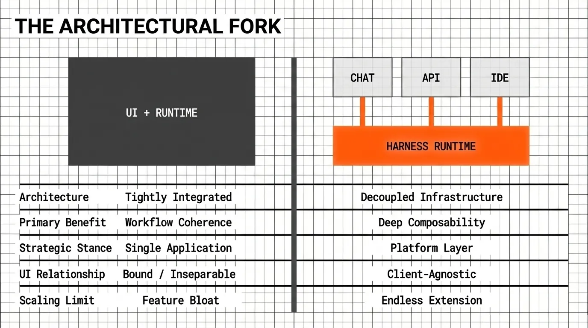
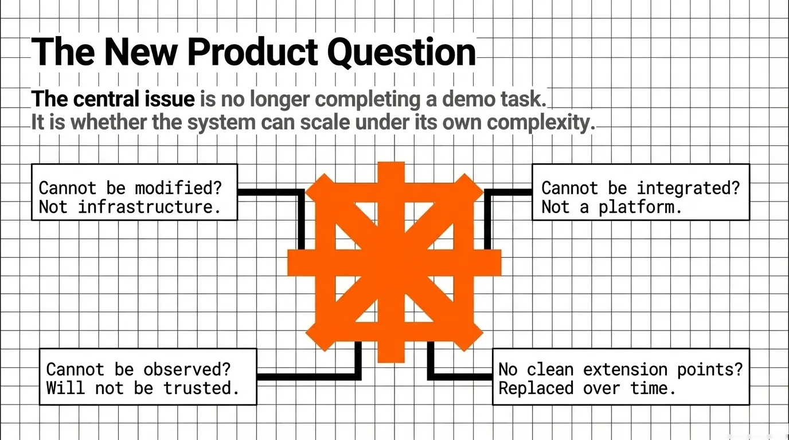

> 作者：balaji bal
> 发布日期：2026 年 4 月 5 日
> 原文链接：https://medium.com/@balajibal/agentic-harnesses-the-new-infrastructure-layer-for-ai-systems-3939c6fac1a6

# Agentic Harness：AI 系统的新基础设施层？

*当 agentic harness 一词逐渐成为热议焦点，更值得追问的是：把它视为基础设施意味着什么。*

近期围绕 AI 编码系统的热度，可以理解地集中在用户能直接看到的东西上。人们谈论 Claude Code、Codex、OpenCode、嵌入编辑器的 copilot、终端 agent，以及一批新涌现的运行环境——它们似乎能把语言模型变成可工作的软件协作者。可见的那一层确实有吸引力：输入提示，生成计划，文件被修改，命令被运行，测试被执行，事情就这么干完了。

但当人们对这些系统的理解深入下去，一种更重要的模式开始在底下浮现。真正的产品往往既不是模型，也不是界面，而是 harness。

这个词最近被频繁提起，因为它给许多人早已观察到、却一直缺乏清晰定义的东西命了名。在现代 agentic 系统的核心，坐着一个 harness：一个结构化的运行时，把模型、工具、记忆、权限、编排逻辑、执行环境和面向用户的界面绑成一个可运转的系统。

harness 不再只是一个实现细节。它正在变成基础设施。

## 定义 agentic harness

agentic harness（智能体执行框架，本文沿用原词 harness）是让 AI 系统作为 agent 而非无状态应答器（stateless responder）来运转的执行与编排层。

更具体地说，它是一个可配置的运行时，位于模型与外部世界之间。它负责系统如何接收任务、组装上下文、选择模型、调用工具、维护状态、执行权限、从故障中恢复，并通过一个或多个界面返回输出。

这个定义之所以重要，是因为 harness 经常和邻近概念混淆——那些概念也很重要，但与 harness 截然不同。

它不是模型。模型提供推理、生成，有时也提供工具选择能力，但它本身不提供持久化的工作流、状态转换、环境控制或运行安全。
它不是用户界面。一个终端 UI、IDE 扩展、聊天界面或网页应用可以把系统呈现得很漂亮，但它们只是表现层，并不是真正主导 agentic 执行的机制。
它也不仅仅是一个工具注册表（tool registry）。罗列可用工具是有用的，但 harness 做的远不止是把函数暴露出来。它决定工具能否被使用、在何种约束下、按何种顺序、需要哪些审批，以及在出错时如何恢复。

把 harness 想得最干净的方式，是把它视为 agentic 行为的操作底座（operating substrate）。正是这一层，让 AI 系统不再像单次问答（single-shot）的聊天机器人，而更像一个有边界、可扩展、有状态的执行者。

## 这个词为何突然变得重要

“agentic harness” 作为一个话题崛起，并非偶然。它是 AI 系统构建与体验方式发生整体变化的结果。

编码环境让架构变得可见。和经典的聊天机器人不同——经典聊天机器人的大部分系统都隐藏在简单界面背后——AI 编码工具暴露了整个循环：检查文件、规划、调用工具、编辑代码、重试、对反馈做出反应。终端优先（terminal-first）的系统更进一步，把命令、输出、检查点和错误实时呈现出来。在这些环境里，harness 不再被埋在技术栈深处，而是基本上站在了舞台上。

与此同时，越来越多的构建者选择不从零造自己的 harness。他们在已有的运行时之上构建，复用 agentic 编码系统的能力，或把 harness 嵌入到更广的工作流里。这既是技术选择，也是经济选择。把控制层做好很难。如果已经存在一个可用的 harness，许多团队宁愿接入它，也不想重新发明会话管理、工具调用策略、状态持久化、安全闸门和编排逻辑。

市场就是从这里开始变化的。一旦其他系统开始依赖某个 harness，它就不再是一个内部实现选择，而开始成为基础设施。

## 两种架构正在浮现

随着这一层走向成熟，两种宽泛的架构模式越发清晰。

第一种是紧耦合模型，harness 和用户体验紧紧绑定在一起。这在终端类系统和某些编码环境中很常见——运行时和界面被作为同一款产品来设计。它的好处是协调一致。系统可以围绕一种特定工作流做深度优化，抽象代价更小，执行逻辑与呈现层之间的摩擦也更少。
第二种是解耦模型，harness 被有意设计成一个独立运行时，可被多个外部界面消费。在这种架构里，UI 只是 harness 众多客户端中的一个。同一个运行时可能同时位于一个聊天系统、一个 API、一个消息平台、一个 IDE 集成，或一个网页界面之后。

这个区分很关键。在紧耦合模型里，harness 在技术上可能很出色，但如果太多逻辑被嵌入到一种体验中，它在战略上就受限了。在解耦模型里，harness 变得更可复用、更可组合，作为平台层往往也更有价值。

Hermes Agent 在这里是一个有用的参照点，因为它指向一个有意被设计为供外部消费的 harness。它的意义不仅在于内部做了什么，更在于它的 UI 可以来自别处。用户体验可能由消息系统中介，也可能由类似 Open WebUI 这样的东西来承载，而 harness 仍然是执行核心。这种分离，展示了 harness 成为独立基础设施、而不再是某个应用内的隐藏子系统，到底意味着什么。

## 为何把 harness 当基础设施是个好主意

把 harness 视为基础设施，无论从工程角度还是产品角度都很有吸引力。

第一，它带来关注点分离（separation of concerns）。负责规划、工具使用、权限、记忆和执行的运行时，不必和向用户呈现这些能力的界面纠缠在一起。这让两边都更容易独立改进。
第二，它提升迭代速度。一个团队可以新增一个界面、接入一个新的模型供应商、加上一条新的安全策略、或暴露一组新工具，而不必重建整个系统。如果边界清晰，特性就能落在正确的层。
第三，它带来跨界面的复用。终端客户端、代码编辑器扩展、网页控制台、聊天集成、后端自动化流水线，都可以依赖同一个底层 harness。也就是说，一套核心执行底座可以驱动多种产品和工作流。
第四，它强化治理。安全控制、审批流、审计日志、身份策略、资源预算、可观测性，在一个共享的基础设施层里实现一次，远比散落在不同的面向用户应用里、参差不齐地各自实现要可靠。
第五，它提升企业可用性。企业很少愿意要一个封死的黑盒。他们想要可被配置、可被扩展、可被观测、可被纳入既有控制体系的系统。一个暴露稳定扩展点的 harness，远比一个内嵌大量硬编码假设的单体 “agent app” 更容易被采用。
最后，它改善产品经济性。一个强大的 harness 可以支撑一个生态系统。一旦开发者能在它之上构建，产品就从单一应用变成一个有多个下游用例的平台。

换言之，harness 即基础设施，不仅仅是技术上的偏好，而是一种战略性的设计选择。

## 拆解 harness 的架构

如果 harness 正在成为核心基础设施，那么它的架构就极其重要。关键问题不只是它有哪些功能，而是这个系统如何被分解为模块、边界划在哪里、模块之间又如何在不塌成一团乱麻的前提下连起来。

理解 harness 的一个有用方式，是把它看作一个分层但高度互联的系统。

### 1. 界面与入口层（Interface and ingress layer）

这是任务进入系统、输出回到用户或调用方应用的地方。

它可能以终端 UI、IDE 扩展、网页应用、聊天界面、API、webhook 端点或消息集成的形式出现。它的工作不是实现 agentic 逻辑。它的工作是把用户或系统的意图翻译成一个 harness 能处理的请求，再把进度、输出和控制项渲染回那个界面。

这里关键的架构原则是：界面应当依赖稳定的 harness API，而不是内部运行时细节。如果太多编排逻辑泄漏进 UI，可移植性就会受损。

### 2. 会话与状态管理层（Session and state management layer）

agentic 系统不是单次应答器。它们需要会话、状态连续性、任务历史、检查点、可恢复性，以及对制品（artifact）的跟踪。

这一层管理工作随时间推进的生命周期。它知道哪个任务正在进行、已经发生了哪些步骤、累积了哪些上下文、生成了哪些输出，以及一旦执行被打断该从哪里恢复。

没有这一层，系统就无法在多轮交互或长流程工作中可靠运行。

### 3. 编排与控制循环（Orchestration and control loop）

这是 harness 的核心。

编排层管控 agent 如何从意图走到行动。它可能负责任务分解、规划、单步执行、分支、重试、升级、审批暂停，以及终止条件。它决定下一步是提问、调用工具、更新上下文、切换模型，还是给出答案。

某种意义上，这就是 harness 的“脑干”。它不是模型层面的智能，但它是那套把智能转换为受控行为的系统逻辑。

### 4. 模型抽象层（Model abstraction layer）

一个现代的 harness 不应当死绑在某一个模型或某一家供应商上。模型抽象层负责路由、回退逻辑、供应商选择、响应规范化、结构化输出（structured output）的强制约束，以及能力感知（capability-aware）的选择。

这之所以重要，是因为 agentic 工作流中不同步骤可能需要不同的模型特性。某个任务需要速度，另一个需要长上下文，再一个需要更好的代码生成，还有一个需要更高的结构化输出可靠性。harness 应当能做出这些区分。

### 5. 工具执行层（Tool execution layer）

如果说模型是推理引擎，那么工具层就是 harness 伸向世界的方式。

它包括文件操作、终端、浏览器、API、远程服务、内部企业系统、MCP 风格的连接器，以及任何其他可调用的能力。但关键问题不是“是否能访问”，而是“受控的访问”。工具层应当强制执行权限、schema、校验和执行策略，让工具使用始终保持有界且可被检视。

一个好的 harness 不会简单地“让模型用工具”。它会把工具执行作为一个受治理的子系统来中介。

### 6. 上下文与记忆层（Context and memory layer）

agentic 系统的成败取决于上下文管理。这一层负责为模型在每一步组装它要看到的工作集（working set）。

它可能包含提示词模板、任务说明、检索到的文档、摘要、以往的动作、长期记忆、环境快照、制品元数据和用户偏好。目标不是把所有东西都塞进上下文窗口（context window），而是在正确的时机以正确的格式提供正确的上下文。

这一层也是记忆策略变得重要的地方：哪些是临时的、哪些是持久的、哪些是按需检索的、哪些被压缩成可复用的状态。

### 7. 环境与运行时层（Environment and runtime layer）

许多 agentic 系统不只是思考和说话，它们还会执行。

这就需要一个运行时环境：本地文件系统、容器化沙箱、终端、浏览器、测试运行器、部署目标、联网系统，或隔离的计算上下文。这一层决定动作发生在哪里，以及在何种约束下发生。

它的设计直接影响安全、可复现性和能力上限。一个无法干净地管理执行环境的 harness，将很难支撑严肃的运营使用。

### 8. 安全与治理层（Safety and governance layer）

一旦系统能行动，安全就不再是提示词问题，而成了基础设施问题。

这一层包括审批流、策略执行、身份与访问控制、预算限制、风险分级、可审计性、凭证处理和执行护栏。关键之处在于：安全应当同时包裹模型行为和工具行为。它必须既覆盖模型提议要做什么，也覆盖系统实际被允许做什么。

这是 harness 应当属于基础设施的最清晰理由之一。治理不能是事后贴在 UI 边缘的补丁。

### 9. 可观测性与评测层（Observability and evaluation layer）

一个无法被检视的 harness 不会被信任。

这一层提供追踪、日志、指标、回放、调试、回归评测和性能监控。它应当能让团队回答这些实际问题：agent 为什么走了那一步？哪个工具失败了？用了哪个模型？延迟在哪里累积？哪条策略阻止了那个动作？为什么系统改动后输出质量下滑？

可观测性不是一个 “nice-to-have”，它是让 harness 可运维的东西。

### 10. 扩展面（Extension surface）

最后，一个强大的 harness 必须可扩展。

这意味着插件、适配器、策略模块、自定义工具、企业集成、模型路由器、替代记忆系统和可配置工作流。扩展面是产品变成平台的地方，也是路线图（roadmap）质量得以显形的地方。如果每加一个新功能都要在整个技术栈里做侵入式改写，架构就是脆的。如果功能能干净地挂到某个定义清晰的模块边界上，架构就是健康的。

## 连接关系的重要性

仅有组件还不够，重要的是它们如何连接。

编排层消费来自模型层的输出和来自工具层的结果。上下文层既喂给编排层，也喂给模型选择层。安全层包裹模型请求、工具执行和状态转换。可观测性层贯穿一切。界面层应当通过稳定的契约与会话层、编排层通信，而不是绕过它们。

许多系统正是在这里变得脆弱。它们不停堆功能，却缺乏有纪律的连接关系。逻辑跨边界泄漏。UI 代码开始处理工作流状态。工具权限的执行变得不一致。记忆与提示词模板纠缠在一起。评测脱离运行时行为。结果就是一个在 demo 里能跑、但抗拒扩展的系统。

一个好的 harness 架构通过让边界显式、接口稳定来避开这件事。灵活性不是靠堆更多组件来获得的，而是靠在它们之间设计正确的分离来获得的。

## 真正的产品问题

一旦 harness 成为基础设施，产品问题就变了。

核心议题不再只是系统能否在一场动人的 demo 里完成任务。而是：harness 能否在不被自身复杂性压垮的前提下，被配置、被嵌入、被扩展、被治理、被持续演进。

无法被修改的 harness 不是真正的基础设施。无法被集成的 harness 不是真正的平台。无法被观测的 harness 在严肃环境中不会被信任。一个无法暴露干净扩展点的 harness 会随着时间越来越没有吸引力，无论它的第一方界面多么惊艳。

这正是为什么路线图和架构如此要紧。每一个新增能力都需要落到一个目的清晰的模块上。每一个新增集成都应当强化边界，而不是削弱它们。每一个产品决策都应当增加而非削减他人在系统之上构建的能力。

## 结语

近期这一波 AI 编码系统让一件东西新近变得可见：在助手之下、在编辑器之下、在聊天界面之下，坐着一个 harness。正是 harness 把模型变成一个可运营的 agentic 系统。

随着越来越多的团队选择在这些运行时之上构建、而不是从零再造，harness 本身正成为一个基础性的层。有些 harness 会保持与用户体验的紧耦合。另一些会演化为解耦的基础设施，驱动多种界面和下游系统。但无论哪一种，同一条事实都越来越难以忽视。

agentic 系统的未来，将更少地由表层 UX 上的新鲜感所塑造，更多地由底层 harness 的质量所塑造：它的边界、它的控制、它的可扩展性、它的可观测性，以及它作为基础设施的能力。

把 harness 从界面中解开，让两者都更有价值。harness 可以作为基础设施去演化：更可控、更可扩展、可在多种系统间复用。而 UX 则可以变得远比从前更具领域专属性，更适合应对与 agentic 系统协作时正在浮现的认知过载——把复杂性塑造成人们真正能用得起来的形态。
