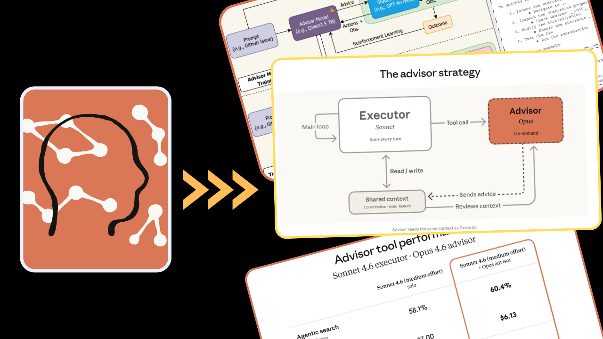
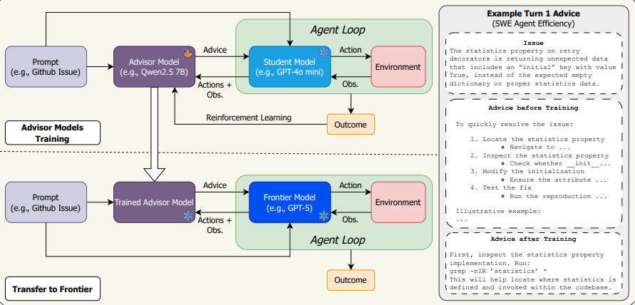
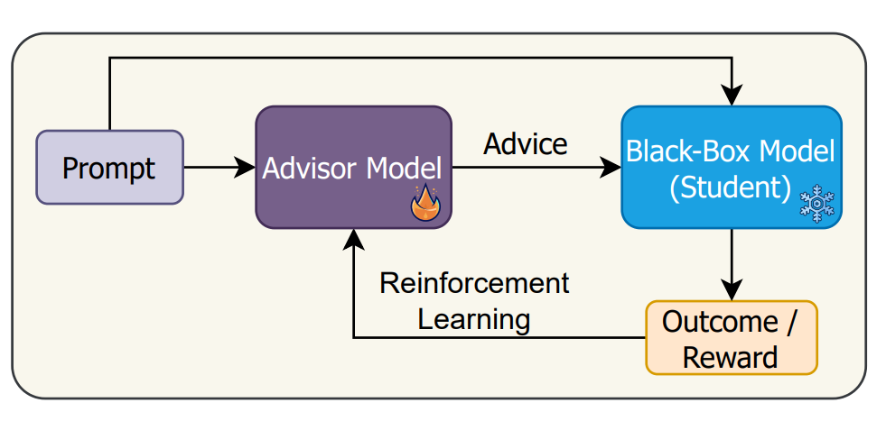
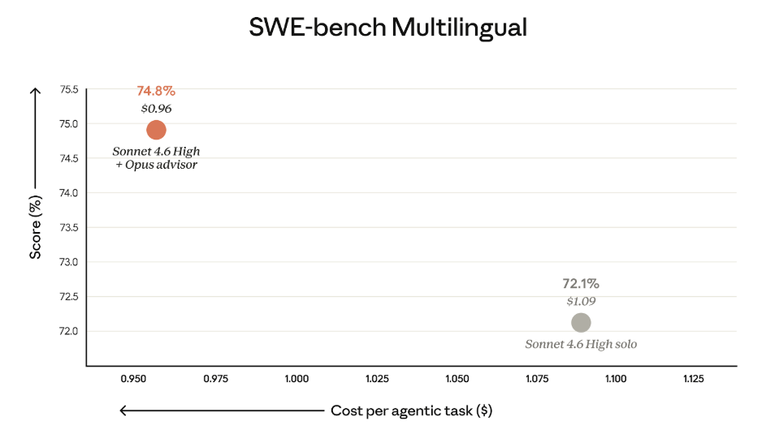
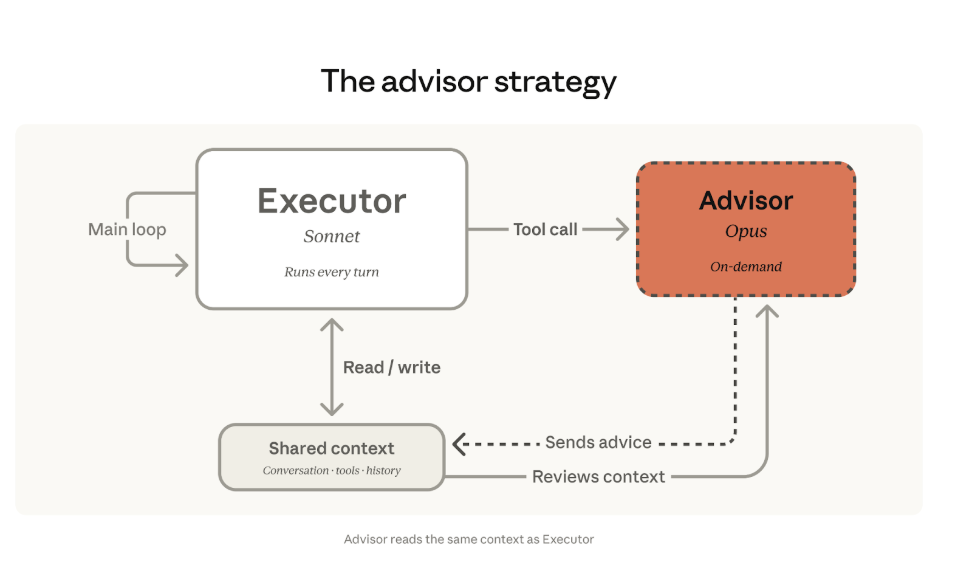
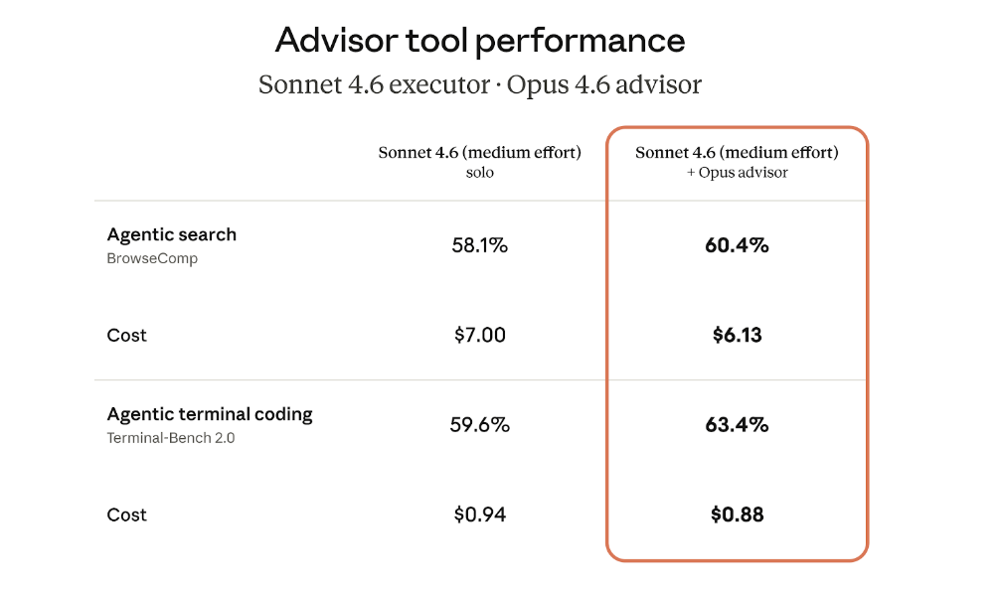
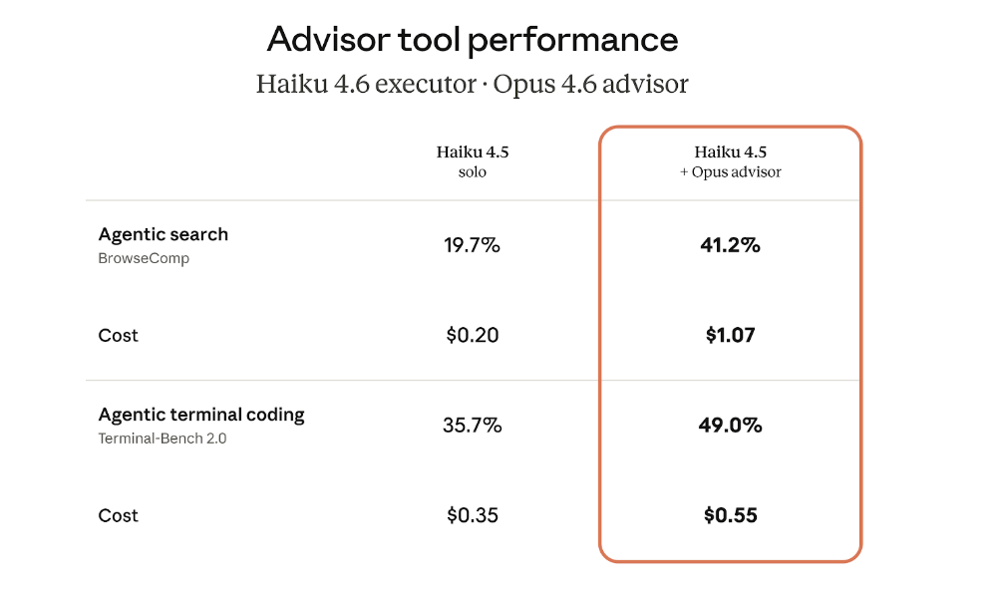
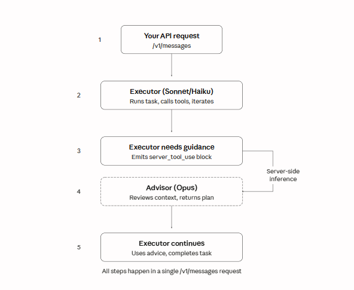
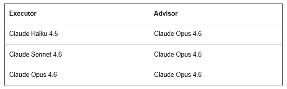

> 作者：Joe Njenga
> 发布日期：2026-04-11
> 原文链接：https://medium.com/ai-software-engineer/anthropic-just-made-cheap-models-think-like-opus-claude-advisor-tool-is-wild-07b26351a527

# Anthropic 让廉价模型拥有 Opus 的智慧——Claude Advisor Tool 解析



顾问工具（advisor tool）并非新思路，但它能把 Haiku 这类低成本模型提升到接近顶级模型的水平，在成本控制上意义重大。

> **我最早在今年二月发表的[这篇论文](https://arxiv.org/pdf/2510.02453)中看到顾问模型策略（advisor model strategy），论文将其作为提升模型性能的有效方案进行了论证。**

这一思路的背景是：GPT-5、Claude 等前沿模型（frontier model）都以黑盒（black-box）服务的形式部署，用户无法修改其权重。

唯一的定制手段是提示词，但它有局限——静态提示词无法适应多样化的输入，也受到上下文窗口（context window）长度的制约。

> **UC Berkeley 的研究者提出了一个解决方案：训练小型开放权重（open-weight）模型，让它为每个具体实例动态生成自然语言建议，从而引导更大的黑盒模型产出更好的结果。**



这篇题为《[How to Train Your Advisor: Steering Black-Box LLMs with ADVISOR MODELS](https://arxiv.org/pdf/2510.02453)》的论文展示了令人印象深刻的结果。

> **顾问模型将 GPT-5 在 RuleArena（税务申报基准）上的表现提升了 71%，将 Gemini 3 Pro 在 SWE agent 任务中的步骤数减少了 24.6%，在个性化输出方面也优于静态提示词优化器（85%–100% 对比 40%–60%）。**

这里的关键发现是：用低成本学生模型训练出来的顾问，无需重新训练就能将性能提升迁移到前沿模型上。

> **这篇论文验证了 Anthropic 现已作为新工具正式推出的 advisor tool 背后的机制。**



Advisor tool 允许更快、成本更低的执行模型（executor model，如 Sonnet 或 Haiku）在生成过程中向更高智能的顾问模型（advisor model，如 Opus）请求策略性指导。

顾问模型读取完整对话，生成一份计划或修正建议（通常 400 到 700 个 token），执行模型随后继续完成任务。

> **整体质量接近单独使用顾问模型的水平，而大部分 token 的生成仍按执行模型的价格计费。**

在 Anthropic 的评测中，Sonnet 配合 Opus 顾问在 SWE-bench Multilingual 上比单独使用 Sonnet 提高了 2.7 个百分点，同时每个智能体任务（agentic task）的成本降低了 11.9%。

Haiku 的提升更为显著——在 BrowseComp 上，Haiku 配合 Opus 顾问得分 41.2%，是其单独运行时 19.7% 的两倍多。

> **下面我来拆解其工作原理，以及它对构建具有成本效益的 AI agent 意味着什么。**



---

## 顾问策略

大多数多模型架构遵循一种常见设计：由一个大型编排模型（orchestrator model）分解工作，再委派给较小的工作模型。

> **这需要分解逻辑、工作池和编排开销。大模型负责思考，小模型负责执行。**

Anthropic 的顾问策略将这一逻辑倒转过来：



> **小模型主导全局。Sonnet 或 Haiku 作为执行模型，端到端地处理任务：调用工具、读取结果、迭代推进。**

当执行模型遇到自身难以合理解决的决策时，它会向 Opus 请求指导。

Opus 审阅共享的上下文（对话历史、工具定义、之前的结果），然后返回以下三种内容之一：

- 推进方案
- 对当前方法的修正
- 任务已完成的停止信号

> **顾问模型不调用工具，也不生成面向用户的输出，只负责指导执行模型，然后退出。**

这正是论文所称的"学会建议"（learning to advise）——将提示词工程从静态搜索问题转化为一种策略：为每个实例生成定制化建议。

---

## 成本

前沿级推理能力只在执行模型需要时才介入，其余时间仍按执行模型的成本运行。

> **顾问模型只生成简短的计划（通常 400–700 个 token），执行模型以更低的价格处理完整输出，因此总成本远低于全程使用 Opus。**

你只需为 Opus 思考几百个 token 付费，其余的任务交给 Sonnet 或 Haiku 完成。

---

## 研究验证

UC Berkeley 的论文揭示了一个关于可迁移性的重要发现。

> **用低成本学生模型（如 GPT-4o mini）训练的顾问，无需重新训练就能将性能提升迁移到前沿模型（如 GPT-5）上。**

这意味着你可以在更便宜的模型上开发和测试顾问策略，然后再配合更强大的模型部署。

> **建议内容能够迁移，是因为它是自然语言指导，而非针对特定模型的优化。**

论文还发现，在一个模型家族（GPT）上训练的顾问，可以迁移到另一个家族（Claude）上使用。

---

## 基准测试：Sonnet 和 Haiku 配合 Opus 顾问

Anthropic 在多个基准测试中对 advisor tool 进行了评测。

> **结果表明，以更低或相近的成本实现了更好的性能。**

### SWE-bench Multilingual（编程任务）

该基准测试覆盖九种编程语言的编码能力。


- Sonnet 4.6 单独运行：准确率 72.1%，每任务成本 $1.09
- Sonnet 4.6 + Opus 顾问：准确率 74.8%，每任务成本 $0.96

> **性能提升 2.7 个百分点，每任务成本降低 11.9%。**

### 智能体搜索与终端编程（Sonnet 执行模型）

Anthropic 还在 BrowseComp（智能体搜索）和 Terminal-Bench 2.0（智能体终端编程）上进行了测试。



BrowseComp：

- Sonnet 单独运行：58.1%，每任务 $7.00
- Sonnet + Opus 顾问：60.4%，每任务 $6.13

Terminal-Bench 2.0：

- Sonnet 单独运行：59.6%，每任务 $0.94
- Sonnet + Opus 顾问：63.4%，每任务 $0.88

> **两个基准测试均呈现性能提升、成本下降的结果。**

### Haiku 的转变

Haiku 配合 Opus 顾问，得分比单独使用 Sonnet 低 29%，但每任务成本低 85%。



BrowseComp：

- Haiku 单独运行：19.7%
- Haiku + Opus 顾问：41.2%

得分翻倍以上。

Terminal-Bench 2.0：

- Haiku 单独运行：35.7%
- Haiku + Opus 顾问：49.0%

> **对于需要在智能水平与成本之间取得平衡的高并发任务，这是一个更优的选择。**

---

## 实现 Claude Advisor Tool

Advisor tool 目前以 beta 版本在 Claude API 中提供。接入方式是在 `tools` 数组中添加相应配置。

> **以下是一个最简 Python 示例：**

```python
import anthropic

client = anthropic.Anthropic()
response = client.beta.messages.create(
    model="claude-sonnet-4-6",  # executor
    max_tokens=4096,
    betas=["advisor-tool-2026-03-01"],
    tools=[
        {
            "type": "advisor_20260301",
            "name": "advisor",
            "model": "claude-opus-4-6",  # advisor
        }
    ],
    messages=[
        {
            "role": "user",
            "content": "Build a concurrent worker pool in Go with graceful shutdown.",
        }
    ],
)
```

> **`advisor-tool-2026-03-01` 这个 beta 请求头是必填项。执行模型在顶层指定，顾问模型在 tool 定义内部指定。**

---

## Advisor Tool 工作原理

添加 advisor tool 后，执行模型自行决定何时调用它。

执行模型调用顾问时，流程如下：

- 执行模型输出一个 `server_tool_use` 块，`name` 为 `"advisor"`，`input` 为空
- Anthropic 在服务端对顾问模型执行独立推理
- 顾问模型看到完整的对话记录——系统提示词、工具定义、所有历史轮次、所有工具结果
- 顾问的响应以 `advisor_tool_result` 块的形式返回给执行模型
- 执行模型在顾问建议的基础上继续生成

> **以上所有步骤发生在单次 `/v1/messages` 请求内部。**



---

## 模型兼容性

顾问模型的能力必须不低于执行模型。以下是有效的模型组合：



> **如果请求的组合无效，API 会返回 `400 invalid_request_error`。**

---

## 计费与成本控制

顾问模型产生的 token 按顾问模型的价格计费，执行模型产生的 token 按执行模型的价格计费。

> **由于顾问模型只生成简短计划（400–700 个 token），执行模型以更低价格处理完整输出，总成本低于全程使用 Opus。**

可以用 `max_uses` 限制每次请求中顾问的调用次数：

```python
tools=[
    {
        "type": "advisor_20260301",
        "name": "advisor",
        "model": "claude-opus-4-6",
        "max_uses": 3,  # 每次请求最多调用 3 次顾问
    }
]
```

执行模型达到上限后，后续的顾问调用将返回错误，执行模型在没有额外指导的情况下继续运行。

> **用量记录在 `usage.iterations[]` 数组中：**

```json
{
  "usage": {
    "input_tokens": 412,
    "output_tokens": 531,
    "iterations": [
      {
        "type": "message",
        "input_tokens": 412,
        "output_tokens": 89
      },
      {
        "type": "advisor_message",
        "model": "claude-opus-4-6",
        "input_tokens": 823,
        "output_tokens": 1612
      },
      {
        "type": "message",
        "input_tokens": 1348,
        "output_tokens": 442
      }
    ]
  }
}
```

> **`type` 为 `"advisor_message"` 的迭代按 Opus 价格计费，`type` 为 `"message"` 的迭代按执行模型价格计费。**

---

## 与其他工具组合使用

Advisor tool 可与现有工具并列使用，将它们全部加入同一个 `tools` 数组即可：

```python
tools = [
    {
        "type": "web_search_20250305",
        "name": "web_search",
        "max_uses": 5,
    },
    {
        "type": "advisor_20260301",
        "name": "advisor",
        "model": "claude-opus-4-6",
    },
    {
        "name": "run_bash",
        "description": "Run a bash command",
        "input_schema": {
            "type": "object",
            "properties": {"command": {"type": "string"}},
        },
    },
]
```

> **执行模型可以在同一轮中搜索网络、调用顾问、使用自定义工具。顾问给出的计划可以指导执行模型接下来选用哪些工具。**

---

## 总结

Advisor tool 改变了构建智能 AI agent 的经济逻辑。

> **如果你在构建编程 agent、研究流水线或多步骤自动化系统，advisor tool 提供了一种注入前沿级智能的方式，而无需为每一个 token 付出高昂代价。**

这对于在规模化场景下运行复杂智能体工作流的团队最有价值。

> **你试过 Claude Advisor tool 吗？欢迎在评论区分享你的使用体验。**

---

## 参考资料

- [Claude Advisor Strategy](https://www.anthropic.com)
- [How to Train Your Advisor — Research Paper](https://arxiv.org/pdf/2510.02453)
- [Advisor Tool Documentation](https://docs.anthropic.com)
