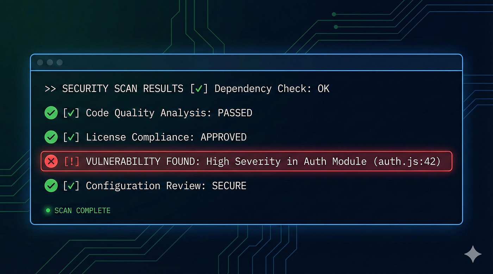

作者：Reza Rezvani
发布日期：2026 年 2 月 23 日
原文链接：https://alirezarezvani.medium.com/how-to-set-up-claude-codes-new-security-review-the-complete-practical-guide-0f900a680eb1

---

# 如何配置 Claude Code 的 Security Review 功能——完整实践指南

`/security-review` 命令与 GitHub Action 的配置方法、定制技巧、真实发现，以及局限性的诚实评估

---

上周四晚上，我在自己的一个代码仓库里运行了 `/security-review`。没有任何前置配置，直接输入命令。

不到一分钟，Claude 就标记出了一个我遗漏了几个月的授权绕过（authorization bypass）漏洞：一个中间件（middleware）函数检查了用户角色，却在某个边缘情况下没有校验 token 是否过期。这类 bug 在每次代码审查中都能"蒙混过关"，因为初看之下逻辑完全正确。


*Claude Code Security Review | 图片：由 Gemini 3.1 Pro 生成的 AI 插图 ©*

声明：AI 工具辅助了本文对 Claude Code 安全功能的研究。文中记录的动手测试、配置过程和发现均来自本人对该工具的直接使用体验。

就是这一个发现，让我决定花接下来几个小时把完整的流水线（pipeline）搭起来——本地命令用于日常工作流，GitHub Action 用于自动化 PR 扫描。本指南将带你走完这两条路，附上我在生产环境中实际运行的配置。

---

## Claude Code Security Review 究竟是什么

Anthropic 于 2026 年 2 月 20 日发布了两个互补的安全工具，它们从不同角度解决同一个问题。

**`/security-review` slash 命令**运行在你的 Claude Code 终端会话中。输入命令后，Claude 读取你的代码库并报告漏洞，附带严重性（severity）评级和修复建议。可以把它理解为提交代码前的安全检查——在 push 之前运行。

**GitHub Action**（`anthropics/claude-code-security-review`）在每个 pull request 上自动触发。它分析 diff，识别变更代码中的安全问题，通过多阶段验证过滤误报（false positive），然后在 PR 上以行内注释的形式给出发现和修复建议。

这里有个关键区别：传统的静态应用安全测试（SAST，Static Application Security Testing）工具依靠已知漏洞模式进行匹配，能发现明文密码和过时的加密算法，却会遗漏复杂问题——比如业务逻辑缺陷、细微的授权漏洞、依赖上下文的安全隐患。Claude 不靠模式匹配，它像人类安全研究员一样阅读并推理代码，追踪数据流，理解各组件之间的交互方式。

我仓库里的那个 authorization bypass？Semgrep 根本发现不了。那段逻辑技术上没有错——只是在特定 token 状态下存在遗漏。

---

## 第一部分：`/security-review` 命令

这是最快的入门方式。如果你已经安装了 Claude Code，距离你的第一次扫描只有五秒钟。

### 前置条件

- Claude Code 已安装且为最新版本（不确定时运行 `claude update`）
- 有效的 Claude Code 订阅（Pro、Max 或 API Console 账户）

就这些。无需额外安装包、无需配置文件、本地命令也不需要单独设置 API key。

### 运行第一次扫描

在任意项目目录下打开终端并启动 Claude Code：

```bash
# 进入你的项目目录
cd ~/projects/your-repo

# 启动 Claude Code
claude

# 运行安全审查
/security-review
```

Claude 会扫描整个代码库——不只是 diff，而是全量扫描。根据项目规模，耗时从 30 秒到几分钟不等。

### 输出格式

Claude 报告发现时包含四项关键信息：

- **漏洞类型**——SQL 注入、XSS、授权失效、硬编码密钥等
- **严重性评级**——HIGH、MEDIUM 或 LOW
- **说明**——为什么这是漏洞，附带利用（exploit）场景
- **建议**——附有代码示例的具体修复方案

该工具只关注 HIGH 和 MEDIUM 级别的发现，这是有意为之的设计选择——遗漏一些理论上的问题，好过用噪音淹没你。每条发现都是安全工程师在 PR review 中会有把握地提出的内容。

### 原地修复问题

这个工作流真正强大之处在于：Claude 找到漏洞后，你可以在同一个会话中直接让它实现修复。

```
# /security-review 报告发现之后：
"Fix the SQL injection vulnerability in src/api/users.ts"
```

Claude 保留了安全审查的上下文，清楚地知道你在引用哪条发现，并能直接应用补丁。你审查变更、提交，完成。安全审查与修复在同一个循环中完成，无需切换到其他工具。

### 自定义命令

默认的 `/security-review` 命令开箱即用效果很好。但如果你需要组织特定的规则——比如你在医疗行业工作，需要 HIPAA 相关检查，或者有自定义的认证（authentication）模式——可以进行定制。

将官方命令文件复制到你的项目：

```bash
# 如果目录不存在则创建
mkdir -p .claude/commands/
# 从 Anthropic 的仓库复制 security-review.md
# （或者基于官方模板自己创建）
```

然后编辑 `.claude/commands/security-review.md`，添加你的规则，例如：

```
## Additional Organization Rules
- Flag any direct database queries that bypass the ORM layer
- Check that all API endpoints require authentication middleware
- Verify that PII fields use the encryption wrapper from @company/crypto
```

Claude 会将这些指令纳入该项目的每次安全扫描。

---

## 第二部分：GitHub Action 配置

本地命令适合个人工作流，GitHub Action 则为整个团队强制执行安全审查——每个 PR，自动触发。

### 第一步：准备 API Key

这是最容易踩的坑。你的 Anthropic API key 需要同时开启 Claude API 和 Claude Code 的使用权限。仅用于 API 的标准 key 不行。去 console.anthropic.com 确认你的 API Console 设置。

### 第二步：将密钥添加到仓库

```bash
# 进入 GitHub 仓库 → Settings → Secrets and variables → Actions
# 添加新的 repository secret：
# Name: CLAUDE_API_KEY
# Value: your-anthropic-api-key
```

永远不要将 API key 直接提交到仓库，始终使用 GitHub Secrets。

### 第三步：创建 workflow 文件

在仓库中创建 `.github/workflows/security-review.yml`：

```yaml
name: Security Review

permissions:
  pull-requests: write  # 需要此权限才能留 PR 评论
  contents: read
on:
  pull_request:
jobs:
  security:
    runs-on: ubuntu-latest
    steps:
      - uses: actions/checkout@v4
        with:
          ref: ${{ github.event.pull_request.head.sha || github.sha }}
          fetch-depth: 2
      
      - uses: anthropics/claude-code-security-review@main
        with:
          comment-pr: true
          claude-api-key: ${{ secrets.CLAUDE_API_KEY }}
```

提交这个文件，开一个 PR，看 action 运行。这是最小化配置——已经很有用了。

### 第四步：按需配置

action 支持几个值得了解的配置选项：

```yaml
- uses: anthropics/claude-code-security-review@main
  with:
    comment-pr: true
    claude-api-key: ${{ secrets.CLAUDE_API_KEY }}
    
    # 排除不需要扫描的目录
    exclude-directories: "node_modules,dist,coverage,__tests__"
    
    # 指定模型（默认为 Opus 4.1）
    claude-model: "claude-opus-4-1-20250805"
    
    # 调整大型仓库的超时时间（默认 20 分钟）
    claudecode-timeout: "30"
    
    # 将结果作为 artifact 上传以便后续查看
    upload-results: true
```

`exclude-directories` 对于缩短扫描时间、避免生成代码或测试夹具（fixture）产生误报很重要。

### PR 上会发生什么

配置完成后，workflow 按以下顺序执行：

1. 有 pull request 被打开或更新
2. Claude 分析 diff，理解变更内容
3. 在上下文中审查变更——理解其目的和安全影响
4. 识别安全问题，附带说明、严重性评级和修复建议
5. 多阶段误报过滤器去除低影响发现
6. 剩余发现以行内 PR 评论的形式发布在具体的代码行上

行内评论包含利用场景和修复建议。团队在审查代码变更时一并查看，批准或驳回发现，满意后合并。

---

## 第三部分：真正有用的定制化配置

### 自定义扫描指令

如果你的项目有特定的安全关注点，可以创建一个包含附加指令的文本文件，然后让 action 指向它：

```yaml
- uses: anthropics/claude-code-security-review@main
  with:
    claude-api-key: ${{ secrets.CLAUDE_API_KEY }}
    custom-security-scan-instructions: ".github/security-scan-rules.txt"
```

`.github/security-scan-rules.txt` 的内容：

```
Focus especially on:
- Any changes to authentication or authorization middleware
- Database queries that accept user input
- File upload handling and path traversal risks
- API rate limiting on public endpoints
- Ensure all new API endpoints validate JWT tokens
```

这在 Claude 默认扫描的基础上，叠加了你们组织特有的安全关注点。

### 误报调优

每个代码库都有会触发误报的模式。你可以自定义过滤规则：

```yaml
- uses: anthropics/claude-code-security-review@main
  with:
    claude-api-key: ${{ secrets.CLAUDE_API_KEY }}
    false-positive-filtering-instructions: ".github/security-fp-rules.txt"
```

`.github/security-fp-rules.txt` 的内容：

```
Ignore the following patterns for this project:
- Our internal rate limiter handles DoS protection at the gateway level
- The admin API is only accessible via VPN, so CSRF on admin endpoints is acceptable risk
- Test fixtures in /fixtures/ contain intentionally vulnerable code for testing
```

这正是该工具与传统 SAST 工具相比真正出彩的地方：不需要编写复杂的 YAML 规则例外，直接用自然语言描述。Claude 理解上下文。

### 路径特定扫描

对于较大的团队，可以将安全审查与路径触发条件结合使用：

```yaml
name: Critical Path Security Review

on:
  pull_request:
    paths:
      - "src/auth/**"
      - "src/api/**"
      - "src/middleware/**"
      - "config/security.*"
jobs:
  security:
    runs-on: ubuntu-latest
    steps:
      - uses: actions/checkout@v4
        with:
          ref: ${{ github.event.pull_request.head.sha || github.sha }}
          fetch-depth: 2
      
      - uses: anthropics/claude-code-security-review@main
        with:
          claude-api-key: ${{ secrets.CLAUDE_API_KEY }}
          custom-security-scan-instructions: ".github/security-scan-rules.txt"
```

只有敏感文件发生变更时才触发安全审查——在降低 CI 成本的同时保护最关键的代码。

---

## 它实际能发现什么

该扫描器覆盖范围广泛。从我的测试来看，以下类别表现最强：

- **注入攻击**——SQL 注入、命令注入、NoSQL 注入、XXE（XML 外部实体注入）
- **认证缺陷**——授权失效、权限提升（privilege escalation）、不安全的直接对象引用（IDOR）、会话（session）问题
- **数据暴露**——硬编码密钥、敏感数据写入日志、个人身份信息（PII）处理违规
- **加密问题**——弱算法、不当的密钥管理
- **业务逻辑缺陷**——竞态条件（race condition）、检查时间/使用时间（TOCTOU）问题

它自动排除低影响发现：拒绝服务（DoS）、限速（rate limiting）问题、内存耗尽、无法证明影响的通用输入校验，以及开放重定向（open redirect）。这保持了较高的信噪比。

最让我印象深刻的是多阶段验证机制。Claude 不只是标记问题——它会重新审查每条发现，尝试证实或推翻自己的结论。通过这一自我审查的发现会附带置信度（confidence）评级。这与传统 SAST 工具扔出 200 条发现、其中 180 条是误报的方式有本质区别。

---

## 没人提的局限性

让我直说。

**它没有针对提示注入（prompt injection）做加固。**

官方文档明确说明：GitHub Action 只应用于审查可信的 PR。如果有人提交恶意 PR，在代码注释或 README 内容中精心构造旨在操控 Claude 的文字，扫描器可能会被误导。配置你的仓库，要求外部贡献者的 PR 在 workflow 运行前先经过审批。

**它无法替代你的安全团队。**

这个工具处理代码层面的漏洞，不做基础设施安全、网络扫描或渗透测试。它是纵深防御（defense-in-depth）中的一层，不是全部。

**API 成本是真实存在的。**

每次扫描都消耗 API token。如果团队在多个仓库的每个 PR 上运行，请监控使用量。默认模型是 Opus 4.1——效果好，但不便宜。对于频繁提交小 PR 的高频仓库，考虑使用路径触发而不是扫描每次变更。

**受上下文窗口（context window）限制。**

对于涉及数十个文件的超大 PR，扫描器可能会遗漏落在上下文窗口之外的文件中的问题。把大 PR 拆分成更小、更聚焦的单元——这本来也是好的实践。

---

## 向团队推广

从管理视角来看，我建议分阶段推进：

**第一周**：在你最关键的仓库上本地运行 `/security-review`，评估发现，感受误报率和发现质量。

**第二周**：在一个仓库上配置 GitHub Action，让它在真实 PR 上跑一周，根据团队的实际观察调整误报过滤规则。

**第三周**：根据代码库模式添加自定义扫描指令，向其余仓库推广。

**持续进行**：第一个月每周回顾发现，调整过滤规则，对全量扫描过于嘈杂或成本过高的仓库添加路径触发。

每个仓库的配置工作大约需要 15 分钟，调优时间更长——但这时间花得值。每过滤掉一个误报，就是少打扰工程师一次。

---

*关于作者：Alireza Rezvani（Reza），CTO，为工程团队构建 AI 开发系统。他的写作聚焦于通过实用自动化将个人专业知识转化为团队基础设施。*
