作者：Jim Clyde Monge  
发布日期：2026-04-14  
原文链接：https://generativeai.pub/my-ultimate-claude-code-setup-af8b3a8ca011

---

# 我的终极 Claude Code 开发环境配置

这是我将智能体开发（agentic development）效率提升 10 倍的 Claude Code 配置方案。

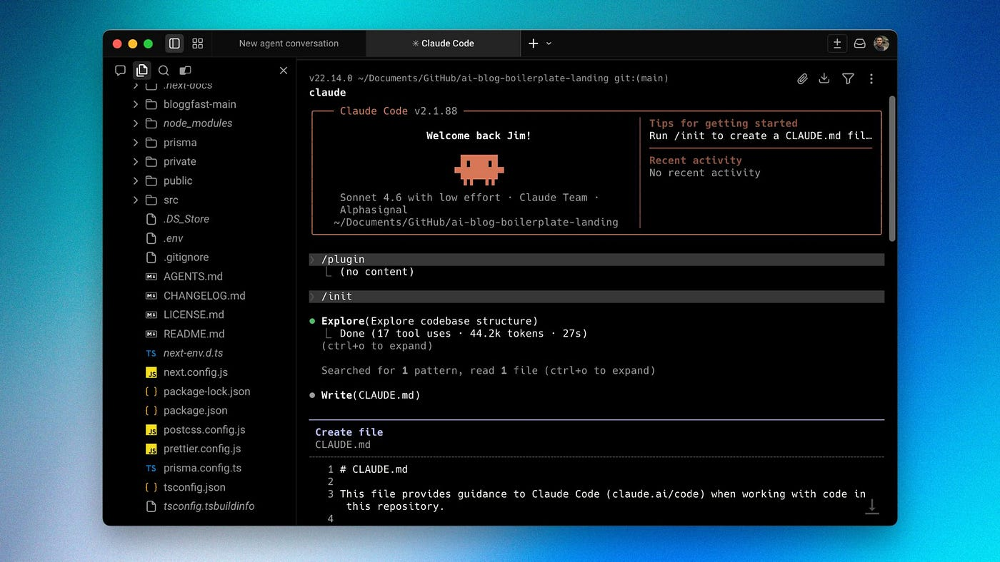

过去几年，我一直在探索：当编程智能体（coding agents）承担大量繁重工作时，软件开发究竟会发生什么变化。

我本是一名开发者出身的人，和大多数以构建软件产品为生的人一样，我目睹了工具的快速演进。最初不过是代码自动补全和代码建议，如今已进化为能够推理任务、搭建功能脚手架、重构大段代码库、调试问题，甚至以惊人速度辅助发布全栈应用的智能体。

在过去三年的 vibe coding 实践中，我尝试了大量工具和工作流。大多数可以归入三类：

- IDE（集成开发环境，Integrated Development Environment）
- CLI 内的编程智能体
- 桌面应用

当然，每类工具都有各自的优缺点。

## IDE vs CLI vs 桌面应用

Antigravity、Cursor、Kiro 这类 IDE 都是 VS Code 的衍生版本。它们为开发者提供了熟悉的环境，对初学者来说上手也更容易。

但代价是速度。

由于同时加载了大量 UI 组件，延迟会变得非常明显。速度对我至关重要，每当 IDE 卡顿或崩溃，我就会非常沮丧。

另一个问题是需要在提示框和终端之间来回切换。我觉得这个过程有些繁琐，经常搞不清楚自己在哪个窗口里操作。

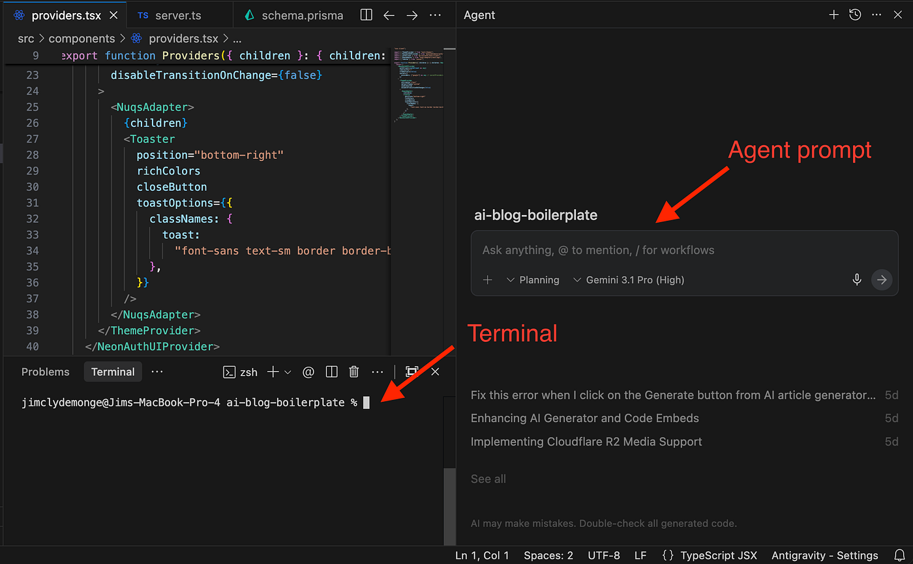

其次是终端。

硬核开发者永远偏爱终端。命令执行快，延迟感也不那么强烈。熟悉之后，它快速、灵活、顺手。

在使用 Warp 之前，我在 Mac 上直接用普通 CLI 运行 Claude Code，快速、灵活，作为开发者用起来也得心应手。

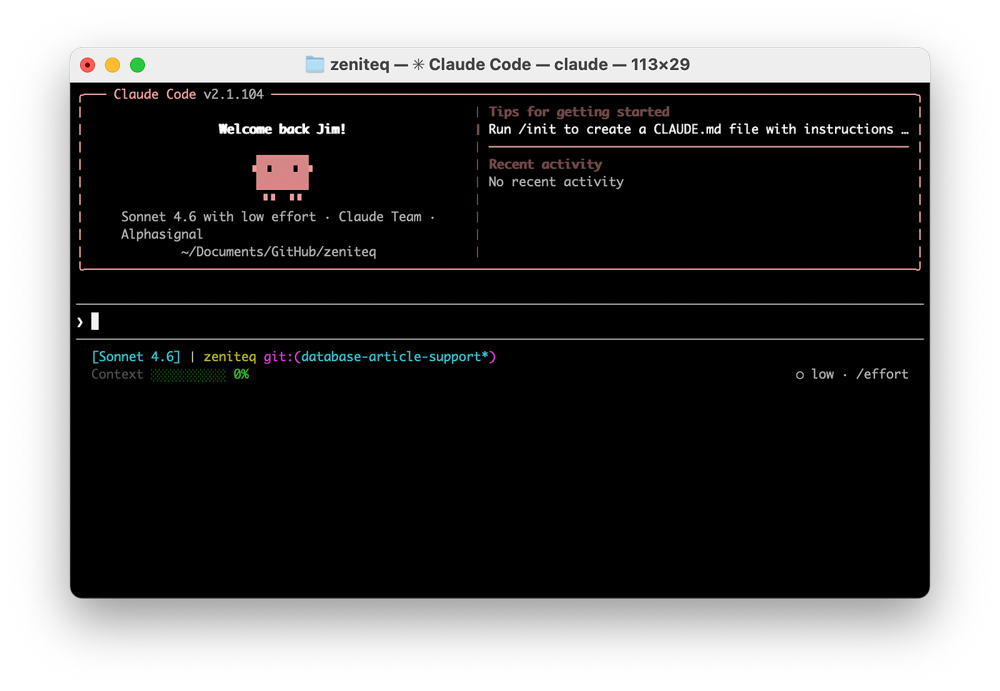

但有几件事一直让我头疼：

- 想查看源码时，必须另外打开一个 IDE 才能看到改动了什么。
- 跨多个终端窗口管理多个编程智能体实例非常混乱，没有标签页支持。
- 智能体在思考、token 耗尽或任务完成时，没有任何通知。

随着项目规模增大，代码审查、任务监控和多智能体管理变得越来越痛苦。

桌面应用是我最不喜欢的选项。OpenAI 的 Codex 和 Anthropic 的 Claude 桌面应用是目前最受欢迎的两款。

对我来说，它们太过简单、速度也太慢。对初学者来说可能没问题，因为不需要处理命令之类的技术细节，只需要写好提示词，让 AI 完成大部分工作就行。

但关键在于：你不必非得在这几类环境中二选一。

还有一个叫 Warp 的智能体编程工具，它兼顾了 CLI 的速度与轻量感，同时具备更直观的可视化体验。

下面我来介绍如何将 Claude Code 与它配合使用。

## 为什么切换到 Warp

Warp 是一款脱胎于终端的智能体开发环境（agentic development environment）。大约一年前我开始试用，立刻就喜欢上了它。

最吸引我的是：它既不像臃肿的 IDE，也不像那种让你自己摸索一切的裸终端，而是恰好处于两者之间——这正是我在使用编程智能体时想要的位置。

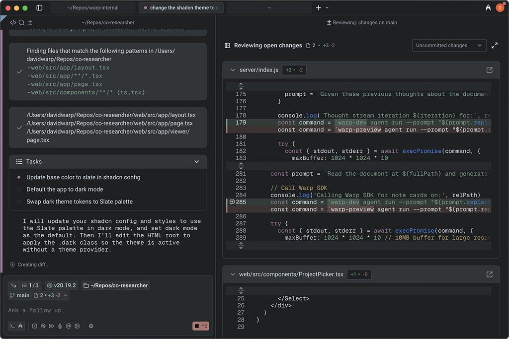

它轻量、快速、支持多种模型、具有智能体感，同时在终端与完整 IDE 之间提供了一个中间地带，而不会逼着你向任何一端妥协。

它并没有取代我在终端中使用 Claude Code 时喜欢的那些东西，只是让整体体验变得更好。

## 如何在 Warp 中使用 Claude Code

在 Warp 的提示框中可以直接输入终端命令，比如输入 `/model`，就会列出所有支持的模型。打开"Full Terminal Use"标签页，可以看到当前账号下所有可用的 Claude 模型。

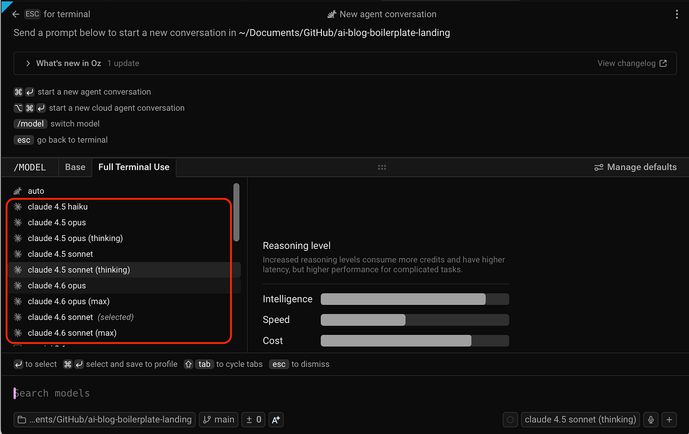

你也可以选择其他模型，或者启动 Warp 内置的 Oz 编排器（orchestrator）来为你处理智能体脚手架搭建。

当我更偏好在 Claude Code 而不是 Warp 内置的 composer 中工作时，只需运行 `claude`，就能像在 CLI 中一样继续使用。

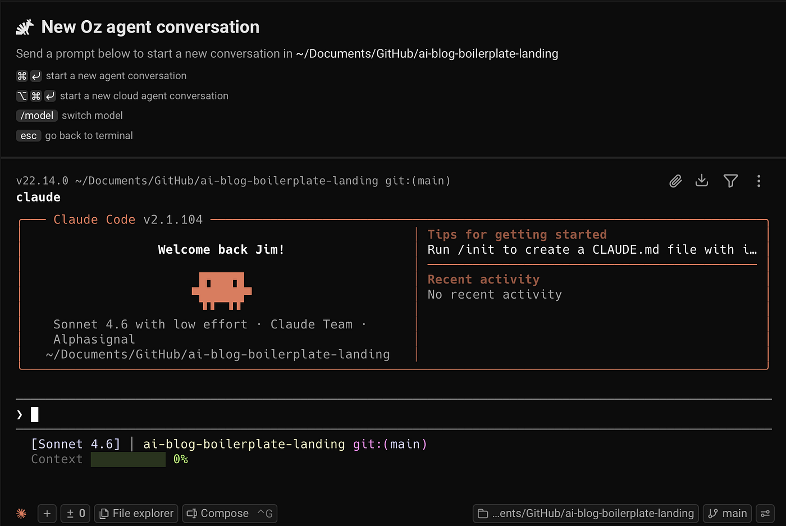

是不是很实用？要切回 composer，点击"Compose"按钮即可。

## CLI 智能体工具栏

我更偏爱 Warp 而非默认 CLI 终端的另一个原因，是工具栏（toolbar）区域可定制的快捷控件。

高阶用户希望智能体工作流能够贴合自己的习惯。工具栏让常用控件触手可及，无需离开终端环境。

右键点击工具栏区域，选择"Edit CLI agent toolbelt"即可进入配置界面。

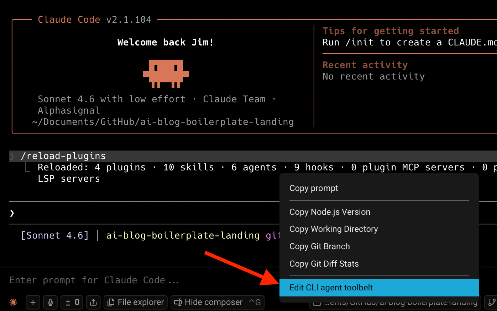

这会弹出一个模态窗口，可以自定义工具带（toolbelt）左右两侧显示的工具项。

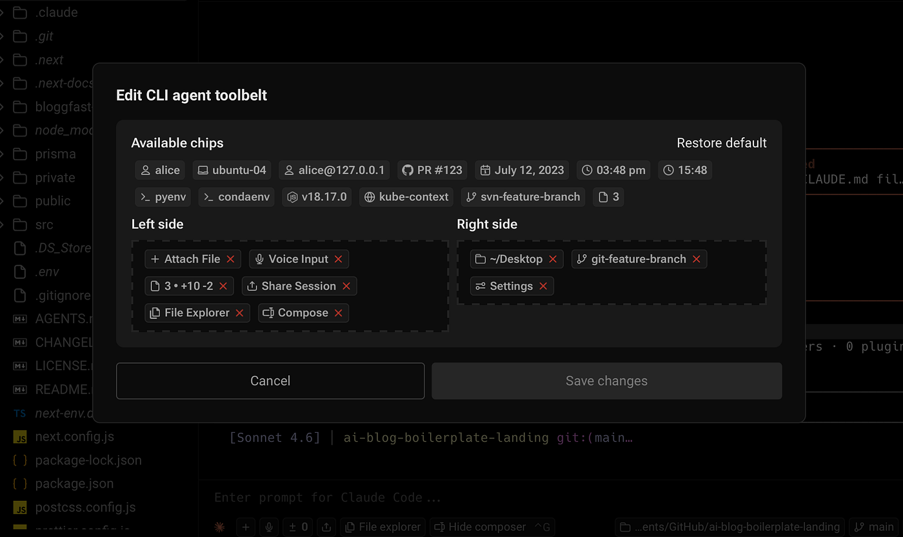

我的默认配置：关闭语音输入（我更习惯打字输入提示词），关闭会话分享（我是独立开发者），始终显示当前项目目录对应的活跃分支。

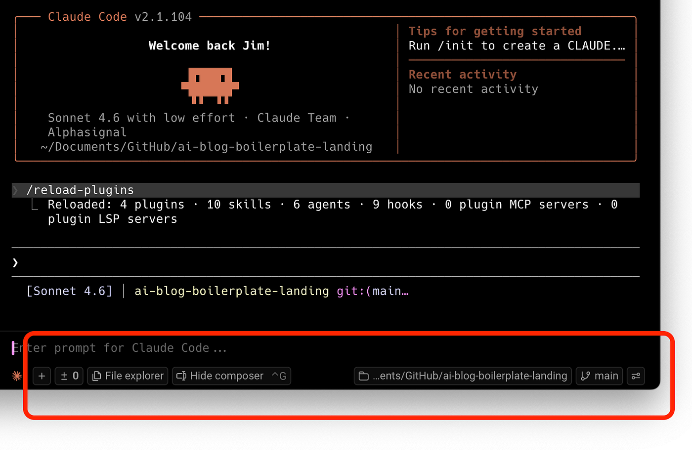

如果你在团队中协作，建议开启显示当前登录用户以及会话分享快捷入口。

这样我就能待在同一个环境里，快速访问使用智能体时真正需要的内容，不必在不同应用之间反复跳转来补充上下文或查看变更。这正是 Warp 比普通终端更完整的核心原因之一。

## 统一通知

智能体在后台运行，并不总是需要你立刻关注。

- 有时它还在思考中；
- 有时它在等待你的回应；
- 有时 token 已经耗尽；
- 有时它已完成任务，等待下一条指令。

在普通终端里，这一切都得靠你自己盯着。

Warp 通过统一通知（unified notifications）UI 解决了这个问题，让你能跨标签页同步所有智能体的状态，不必逐一手动检查每个会话。同时也支持桌面通知，在多任务处理时尤为实用。

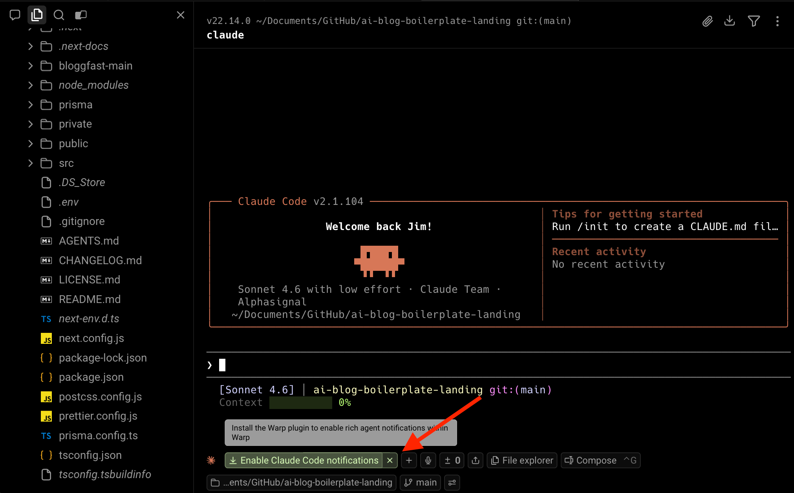

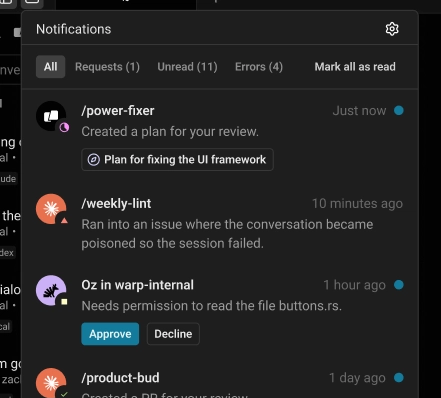

点击"Enable Claude Code notifications"，即可安装 Claude Code 插件。

对于运行时间较长的大型项目，我几乎全程依赖通知。以前我得不停地 alt-tab 切换终端窗口，检查智能体是否卡住或在等我操作，这很快就让人烦透了。现在不必了。

## 代码审查注释

智能体写代码的速度很快，但确保代码质量依然是人的责任。

这正是我喜欢 Warp 代码审查注释（code review comments）功能的原因。

Warp 没有把代码审查当作与智能体工作流完全分离的环节，而是收紧了整个反馈循环。我可以审查智能体生成的代码，添加内联注释（inline comments），然后直接将这些反馈发送给正在运行的第三方智能体会话。

举个例子：

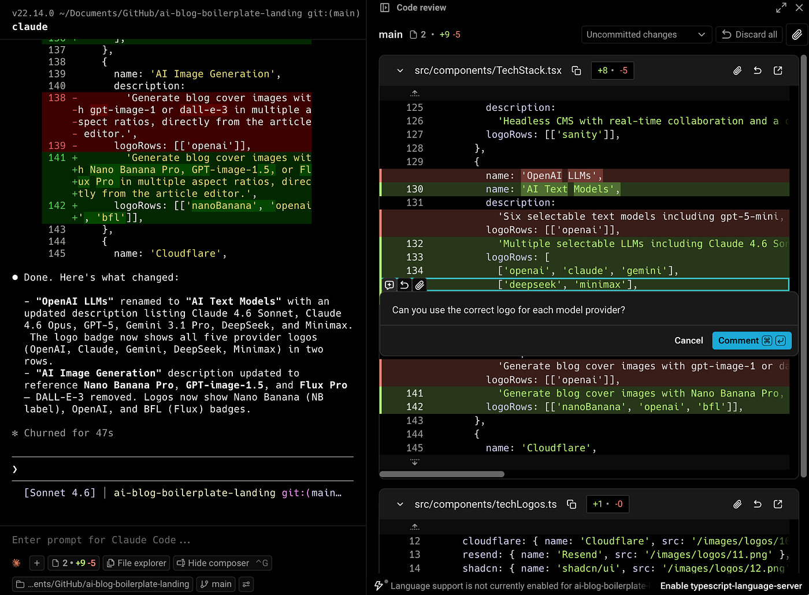

这意味着智能体可以根据非常具体的反馈进行迭代，而不需要我在另一个窗口里重新解释一遍。

这是一个非常聪明的工作流改进。

当前智能体开发中最大的缺口之一，正是生成容易、迭代却依然笨拙。Warp 让这个过程顺畅了很多。你可以在同一个地方生成、审查、注释、纠偏，一气呵成。

## 为什么这套配置很重要

如果你已经在使用编程智能体，或者正在认真考虑更多地用它来构建项目，这类配置的意义体现在以下几个方面。

**第一个原因是速度。**

这里说的不仅仅是模型速度，而是你作为开发者实际的工作速度——能多快地启动合适的环境、交接上下文、审查变更、监控进度，并在任务之间切换而不打断专注状态。这正是智能体周边环境发挥作用的地方。普通终端对此帮助不大；IDE 也许能做到，但你要为此付出重量和延迟的代价。

**第二个原因是可见性。**

一旦你开始更大量地使用智能体，就需要更清晰地掌握每个会话在做什么。你需要一种简便的方式，知道智能体何时需要关注、何时已完成，或何时即将触及 token 上限。当你所处的环境本身就是为此设计的，而不是把多个窗口临时拼凑在一起，这件事就会容易得多。

**第三个原因是灵活性。**

你不必局限于某一个模型，可以根据需要在不同模型之间切换——有时需要更快的响应，有时需要更强的推理能力，有时需要控制成本。为合适的任务选择合适的模型，是提高效率、控制开销最简单的方法之一。

**第四个原因是 Warp 似乎真的在倾听开发者的声音。**

在智能体开发这个变化如此迅速的领域，这一点非常重要。能在这里胜出的工具，是那些快速迭代、关注开发者实际工作方式、并持续输出有用功能的工具。就我所见，Warp 在这方面比大多数竞品都更加稳定持续。

我鼓励你关注他们的 X 账号，去感受他们有多善于倾听，以及他们处理重要反馈的速度有多快。

从我自己的使用体验来说，它确实有用。我一直在用 Warp 构建我的应用，Claude Code 的工作流也因此明显改善。不是因为它改变了 Claude 本身的能力，而是因为它让 Claude 周边的一切都更流畅了。

## 总结

简而言之，我的终极 Claude Code 配置，本质上是在不被迫完全绑定某一种环境的前提下，集各类环境之所长。

本文探讨了 IDE、CLI 和桌面应用各自的取舍。IDE 熟悉且易于上手，但有时会感觉笨重；CLI 快速灵活，但随着项目和智能体会话增多，管理起来会变得混乱；桌面应用简洁，但对我来说，面对正式工作往往过于有限。

这就是 Warp 在这套配置中如此契合的原因。

它给了我想从终端获得的速度与轻量感，同时在代码审查、任务监控、多智能体会话和提示词编写方面提供了更好的体验。垂直标签页（Vertical Tabs）、通知、CLI 智能体工具栏、代码审查注释以及模型灵活切换等功能叠加在一起，构成了一套在真实智能体开发场景中切实可用的工作流。

就我个人而言，将 Claude Code 与 Warp 配合使用，让我变得更高效、更有条理，在处理更大规模的项目时也更加从容。它帮助我保持专注状态，同时管理更多智能体，并减少在工作流尴尬环节上损耗的时间。

当然，这仍然基于我自己的个人偏好。每个人的工作方式都不同，这完全没有问题。好消息是，Warp 提供了足够的灵活性，让你自由探索并按自己的喜好定制配置。

如果你已经在使用 Claude Code，我认为 Warp 值得一试。

在 Warp 中运行 Claude Code，测试一套适合你工作流的配置，然后告诉我你的使用体验。
