> 作者：Youssef Hosni
> 发布日期：2026-05-07
> 原文链接：https://levelup.gitconnected.com/claude-codes-5-layer-agent-development-kit-the-architecture-most-engineers-are-missing-2e670e5f85ec

# Claude Code 的五层智能体开发套件：大多数工程师没看到的架构

> 从 CLAUDE.md 与 Skills，到 Hooks、Subagents、MCP，Claude Code 已经为记忆、专业能力、护栏、委托与工具访问，提供了一套分层的架构。

大多数工程师以为自己只是在把 Claude Code 当编程助手来用。事实上，他们坐在一套自己很少检查的、远比这更庞大的智能体运行时（agent runtime）之上。Anthropic 自己的文档表明，Claude Code 不只是一个套着强模型的终端界面。

它已经包含了通过 CLAUDE.md 实现的持久化记忆、可复用的 Skills、确定性的 Hooks、可委托的 Subagents、可安装的 Plugins，以及通过 MCP 与外部系统的连接。这意味着真正值得讲的，不只是 Claude Code 能生成什么，而是它的行为可以如何被塑造、约束、专业化，并跨工作流和团队共享。

这件事重要的原因在于，大多数智能体（Agent）的失败本质上不是提示词（prompt）的失败，而是架构上的失败。一个系统崩溃，是因为它没有持久的记忆层、没有模块化的知识层、没有确定性的护栏（guardrails）层、没有干净的委托（delegation）层，或者没办法把行为打包给整支团队复用。

Anthropic 的文档现在分别记录了这些机制：CLAUDE.md 用来承载始终在线的上下文，Skills 用来承载按需调用的专业能力，Hooks 用来做工作流自动化，Subagents 用来隔离任务执行，Plugins 则把一组能力打包成可安装的单元。

一旦你换上这种视角看这个产品，Claude Code 就不再像是「终端里的 AI」，而更像是一个隐藏在显眼处的智能体开发套件（Agent Development Kit）。

本文我会把 Claude Code 拆成一个五层栈：CLAUDE.md 是记忆层，Skills 是知识层，Hooks 是护栏层，Subagents 是委托层，Plugins 是分发层。目标不只是说明每一块在做什么，更是说明每一层为什么解决了仅靠提示词无法解决的问题。

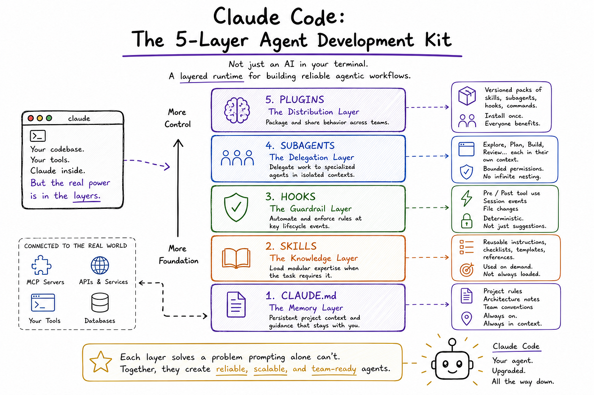

**目录：**

- Claude Code 不只是一个提示词界面
- 第一层 — CLAUDE.md：记忆层
- 第二层 — Skills：知识层
- 第三层 — Hooks：护栏层
- 第四层 — Subagents：委托层
- 第五层 — Plugins：分发层
- 大多数智能体失败都来自一层缺失

---

喜欢这篇文章吗？订阅 [To Data & Beyond](https://todatabeyond.substack.com/) — 一份帮助你在数据科学和 AI 上突破基础水平的 newsletter。

限时福利：

1. [50% 订阅 To Data & Beyond](https://todatabeyond.substack.com/subscribe?coupon=60cbbea5&utm_content=193521822)
2. [我的 8 本书 5 折](https://youssefhosni.gumroad.com/l/ofpngo?layout=profile)
3. [我的 6 门课全部 5 折](https://youssefhosni.gumroad.com/l/hvuiwm?layout=profile)

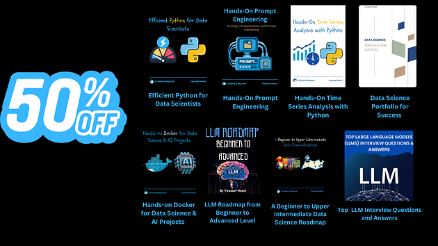

---

## 1. Claude Code 不只是一个提示词界面

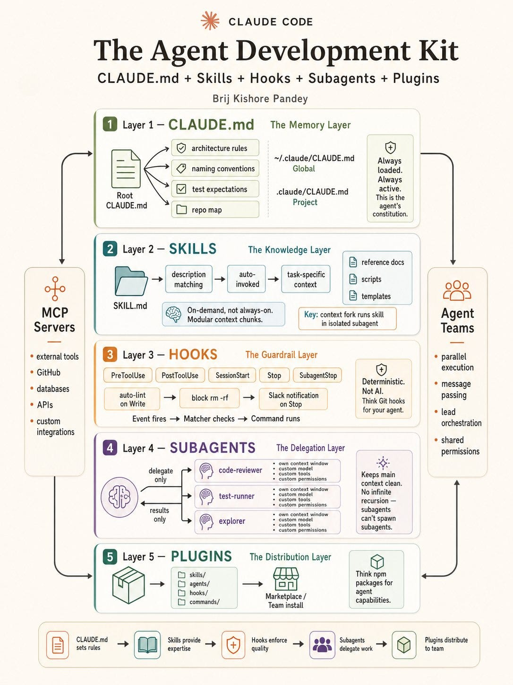

大多数工程师把 Claude Code 当成一个能力出色的编程助手在用：打开终端、给它一个任务、让它检查文件、运行命令、推动工作往前走。这没错，但不完整。

Anthropic 自己的文档把 Claude Code 描述为一个住在终端里的智能体编程工具，能理解代码库、执行常规任务，并通过 MCP 等机制连接外部系统。再仔细读一遍文档就会清楚，Claude Code 不只是一个套着 CLI 的模型。它更接近一个结构化的智能体运行时，提供了多个用于记忆、模块化知识、委托、确定性强制和外部工具访问的控制面。

这种区分很重要，因为光靠 LLM 不足以支撑生产工程工作。基础模型可以生成代码、解释文件、回答问题，但它本身解决不了持久化的项目记忆、可复用的任务专业能力、基础设施级护栏、有边界的委托，或团队范围内的标准化分发。

这些关切都不在提示词内部，而 Claude Code 的架构越来越清晰地反映了这一点。Anthropic 的文档现在会单独记录像 CLAUDE.md 这样的持久化指令文件、可扩展的 Skills、自定义 Subagents、Hooks 与预处理行为、设置作用域、Plugins，以及 MCP 连接性。把它们放到一起看，并不是一组随机的功能。它们构成了一套分层系统，让智能体行为更可靠、更可复用、在运维上也更可管理。

这就是为什么我觉得用架构视角而不是功能视角去看 Claude Code 更合理。值得问的问题不再只是「Claude Code 能做什么？」更好的问题是「Claude Code 暴露了哪些层，用来控制智能体行为如何被塑造、约束、委托与共享？」

一旦从那个角度看，整个栈就更容易理清：CLAUDE.md 充当记忆与策略层，Skills 提供模块化专业能力，Hooks 增加确定性护栏，Subagents 处理有边界的委托，Plugins 加上有作用域的设置帮助行为在团队内分发。MCP 与多智能体团队模式则坐在这套栈周围，是把它连接到外部世界的系统。

这种取景方式也解释了为什么很多智能体工作流在生产中的失败，并不来自模型不够强。它们来自一层缺失。

一支团队可能完全依赖提示词，却没有持久的项目记忆。或者他们写了很强的指令，却在高风险的工具使用周围没有确定性的控制。又或者他们把所有任务都堆给一个通用智能体，而不是把工作分拆给若干专业化的 Subagents。Claude Code 之所以有意思，是因为它的文档把这些问题的答案越来越清楚地分到了不同的层里。本文剩下的篇幅会逐层拆解这套栈，从最基础的那一层开始：CLAUDE.md。

---

## 第一层 — CLAUDE.md：记忆层

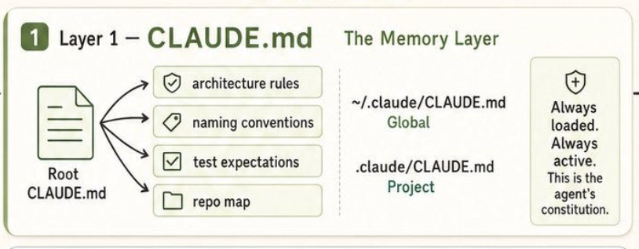

Claude Code 架构里的第一层是 CLAUDE.md，可以说也是最基础的一层。Anthropic 的文档把 CLAUDE.md 描述为给 Claude 写下「在某个项目里如何工作」的持久化指令的地方，而 auto memory 则保存 Claude 自己根据反复纠正与偏好为自己写下的笔记。

这个区分很重要。CLAUDE.md 不是临时提示词的便签纸。它是团队编码持久上下文的层：编码规范、架构决策、偏好的库、评审清单，以及那些应该在每次会话开始之前就摆在台面上的工作流约束。

技术上的关键一点是，Claude Code 不会把 CLAUDE.md 当成只从当前目录加载的单个项目文件。根据文档，Claude 会从工作目录沿目录树向上走，把途中发现的每一个 CLAUDE.md 与 CLAUDE.local.md 都加载进来。

这些文件会被拼接进上下文，而不是相互覆盖；越靠近启动目录的指令会越晚被读到。

这比大多数工程师以为的模型要灵活得多。它意味着 CLAUDE.md 不只是「一个配置文件」，而是一套有作用域的记忆系统，可以在更高层表达宽泛规则，在更靠近活动代码的位置表达更具体的规则。

> [Claude Code — MEMORY.md：你需要知道的一切以及如何上手](https://levelup.gitconnected.com/claude-code-memory-md-everything-you-need-to-know-how-to-get-started-8ac99e161153?source=post_page-----2e670e5f85ec---------------------------------------)
>
> 通过这个 friend link 免费阅读全文。
>
> levelup.gitconnected.com

这种加载模型，正是让 CLAUDE.md 真正变成一个记忆层、而不仅仅是另一个指令文件的原因。顶层文件可以承载全局仓库约束，比如命名规范、测试预期或架构边界；更深层的文件则可以为某个子系统收紧行为。

Anthropic 还通过 `@path/to/import` 语法支持指令文件的导入，让团队可以把庞大的指令集拆成更小、可复用的模块，而不是把单个 markdown 文件搞成倾倒杂物的桶。被导入的文件会在启动时展开进上下文，并且最多可以递归链式导入五层。在实践里，这让 CLAUDE.md 更接近一个可组合的项目记忆系统，而不是一个静态的提示词模板。

CLAUDE.md 与 auto memory 在运维上也有重要的区别。Anthropic 的文档明确说，两者都会在每次会话开始时被加载，但承担不同角色。CLAUDE.md 包含的是人类有意写下的指令；auto memory 则在本地机器的记忆目录里保存 Claude 自己累积的笔记，并通过 MEMORY.md 索引，会话开始时只加载该索引的前 200 行或前 25 KB。

相比之下，CLAUDE.md 文件无论多长都会被完整加载，不过 Anthropic 也指出，文件越短，遵循度往往越高。所以 CLAUDE.md 是受控的、声明式的记忆层，而 auto memory 是自适应的、涌现式的那一层。

这就是为什么我觉得，理解 CLAUDE.md 的正确方式，并不是「贴一次让 Claude 记住你风格的上下文」。它更像是智能体的工作章程。

Anthropic 的文档甚至列出了在 macOS、Linux、WSL 与 Windows 上为集中管理的 CLAUDE.md 文件提供的组织级部署路径，这进一步说明这一层是用来承载持久化运维策略的，而不仅仅是个人偏好。

从这个角度看，CLAUDE.md 的角色就清楚了：它是记忆与策略层，让团队不必在每次会话里重述同样的约束，并在任何任务相关工作开始之前，给智能体一个稳定的行为基线。

---

## 第二层 — Skills：知识层

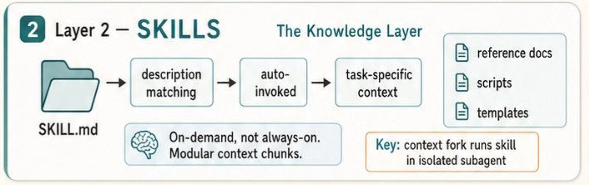

如果说 CLAUDE.md 是持久的记忆与策略层，那么 Skills 就是按需为 Claude Code 提供模块化专业能力的层。Anthropic 的文档把 Skills 描述为通过在 SKILL.md 文件里放入指令来扩展 Claude 能力的方式。

Claude 既可以通过斜杠命令直接调用某个 skill，也可以在检测到任务相关时自动加载它。架构上的要点是：Skills 不像永久项目记忆那样被加载。和 CLAUDE.md 不同，skill 的正文只有在确实需要时才会进入上下文，这让它成为附加可复用流程、清单或领域指引的一种更干净的方式，而不会让每次会话默认就被撑满。

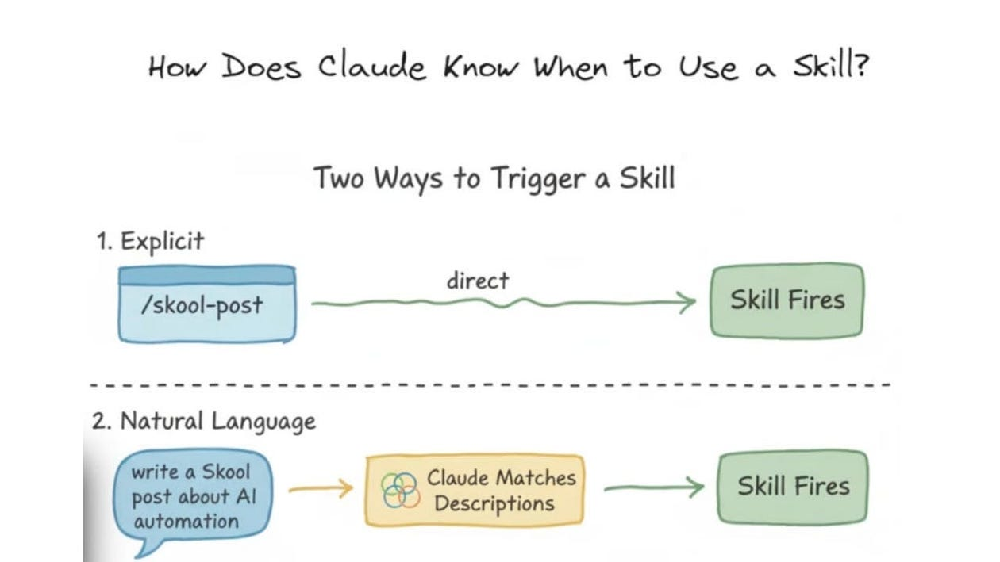

那种区别比第一眼看上去更重要。很多工程师把智能体定制当成一段长长的提示词：把所有东西塞进一份持久化上下文，然后指望模型自己判断什么重要。

Skills 提供了一种更结构化的替代。Anthropic 明确建议：当你发现自己在反复粘贴同一段指令，或者 CLAUDE.md 的某一部分已经从「事实」长成了「流程」时，就该建一个 skill。换句话说，CLAUDE.md 应该承载持久的项目规则，Skills 应该承载可复用的操作性 know-how。这样的分离让始终加载的上下文保持精简，并把复杂的工作流转化为 Claude 在适当时机才会去取用的模块化组件。

Anthropic 的文档也明确指出，Skills 不只是改了名字的自定义命令。从调用层面看，平台现在把更早的 `.claude/commands/*.md` 文件和较新的 `.claude/skills/*/SKILL.md` 定义视作功能上类似的东西，但 Skills 多出了不少控制力。

它们支持包含辅助文件的目录结构、可由用户或 Claude 触发的调用控制、动态上下文注入，甚至可以在 subagent 中执行。这就是为什么我觉得把 Skills 称为「知识层」是正确的取景方式。它们不是简单的快捷方式。它们是让专业能力、流程与可复用任务上下文在智能体运行时内变得可组合的基本单元。

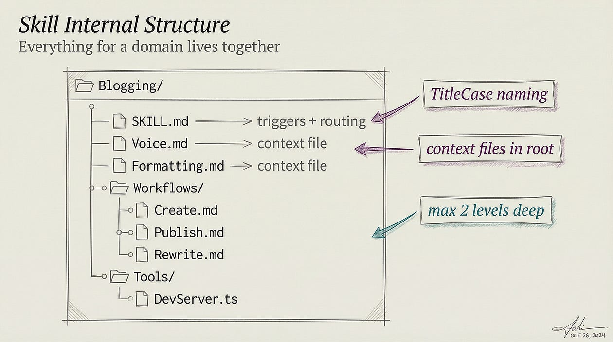

这也直接对应到那张架构图。在实践里，一个 Skill 工作起来像一个有边界、与任务相关的知识包：一段描述告诉 Claude 这个 skill 是用来干什么的，运行时匹配决定它是否适用，相关指令则只在确实有用时才被加载。Anthropic 的文档明确指出，像 `/debug`、`/loop` 和 `/simplify` 这样的内置 skill 是基于提示词、而非固定逻辑的，这是关于整体设计的一个重要线索。

Skills 是让 Claude 行为变得模块化的机制，而不必把所有东西硬编码进核心产品。比起指望一段巨型基础提示词覆盖所有工作流，这种模式可扩展得多。

实际价值很直白。假设一支团队有调试 flaky 测试、评审 SQL 迁移或准备 release notes 的标准流程。这些都属于持久化记忆太宽泛、一次性提示词又太啰嗦的场景。

Skill 让团队把流程打包一次、把参考资料放在它旁边，并在任务确实需要时让 Claude 加载这部分知识。Anthropic 还指出，Skills 内部的长篇参考资料在不被使用时几乎是零成本，这意味着 Skills 不仅在架构上更干净，在运维上也更高效。

也正因如此，我把 Skills 视为 Claude Code 栈中第二个核心层。CLAUDE.md 给了智能体一份稳定的章程，Skills 给了它有针对性、可复用的专业能力，且不会让主上下文窗口（context window）膨胀。

如果想进一步上手 Skills，可以阅读我的完整指南：[Claude Code Skills 101: Everything You Need to Get Started With](https://medium.com/gitconnected/claude-code-skills-101-everything-you-need-to-get-started-with-c06d388ca803?sk=c6a558e95a24143ed6cffb219cd76719)

> [Claude Code Skills 101: Everything You Need to Get Started With](https://levelup.gitconnected.com/claude-code-skills-101-everything-you-need-to-get-started-with-c06d388ca803?source=post_page-----2e670e5f85ec---------------------------------------)
>
> 如果你一直在用 Claude Code，就应该已经注意到每次新会话都从同一个起点开始：你……
>
> levelup.gitconnected.com

这两层的组合，正是把 Claude Code 从一个通用助手变成同时能携带持久项目记忆和模块化领域知识的系统的关键。下一层让这种行为在实践中更安全：Hooks。

---

## 第三层 — Hooks：护栏层

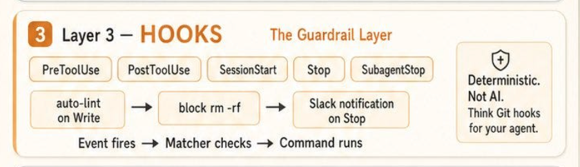

如果说 Skills 是模块化的知识层，那么 Hooks 就是把智能体行为变得在运维上可强制的那一层。Anthropic 的官方文档把 Hooks 描述为一种围绕 Claude Code 自动化工作流的方式：响应事件，并在某些动作之前或之后运行命令。

Hooks 指南明确介绍了这样的模式：编辑后自动格式化代码、阻止对受保护文件的编辑、压缩（compaction）后重新注入上下文、审计配置变更、文件变化时重载环境状态、自动批准特定权限提示。这与提示词扮演的角色完全不同。提示词可以建议某种行为，hook 则可以确定性地拦截或转换它。

也正因如此，我认为最好把 Hooks 理解为护栏层，而不是仅仅一种自动化便利。Anthropic 的文档显示，hook 可以挂载到 PreToolUse 等事件上；成本指南给出了一个具体的例子：一个 PreToolUse hook 拦截 Bash 命令，并改写测试调用，让 Claude 只看到失败输出，而不是完整的流。

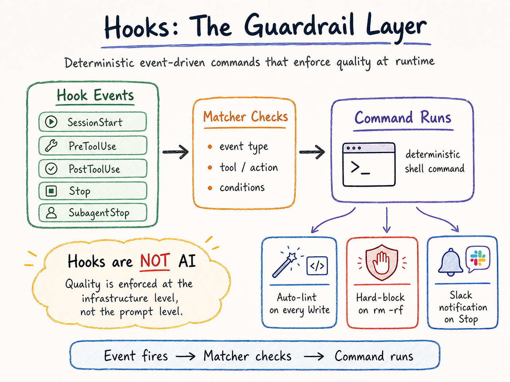

在那个例子里，hook 读取传入的 JSON 载荷、检查命令、并返回结构化的 JSON 来更新工具输入。这不是「AI 决定得更好」，而是基础设施在控制模型在工作流的某个时刻被允许看到或做什么。

这个区分之所以重要，是因为提示词层面的护栏对生产用途来说往往太软。如果一支团队希望生成的代码总被重新格式化、敏感文件不可被修改，或者破坏性的工具调用必须经过更严格的评审，那么仅靠指令是脆弱的。Hooks 把这些控制移到了模型自由裁量权之外。

Hooks 文档明确围绕这样的自动化模式来描述它们：阻止编辑、在特定生命周期事件上发出通知、在压缩之后保持会话上下文一致。换句话说，Hooks 让强制工作流行为成为可能：在事件层面执行，而不是仅仅请求模型守规矩。

Hooks 也很自然地嵌入到了更宽泛的 Claude Code 架构中，因为它们与上下文管理并行运作，而不是嵌入其中。Anthropic 的故障排查文档甚至把「hooks 没触发」单独列为一种配置问题，这是一个很有用的线索：产品把它们当作运行时环境的一部分，而不只是聊天里的内容。

文档还推荐使用 `/doctor` 来诊断 hooks、MCP 服务器和上下文使用上的问题，这进一步表明 Hooks 属于系统的执行层。它们不是 Claude 读取的指令，而是必须正确连入会话运行时的、配置驱动的行为。

这一层还有现实的成本与性能维度。Anthropic 的成本指南明确建议把处理工作下沉到 hooks 与 skills，因为 hooks 可以在 Claude 看到大体量输入之前先做预处理。他们自己给的例子就是把一份巨大的测试日志过滤到只剩失败项，把原本可能多达数万 token 的内容缩成一份小得多的载荷。

这是一个重要的架构教训：Hooks 不只是关于安全的，也关乎效率。一个放置得当的 hook 可以减少 token 浪费、保持上下文更干净，避免模型在那种确定性 shell 逻辑能更便宜、更可靠地完成的可预测过滤工作上耗时间。

也正因如此，我觉得 Hooks 是大多数团队最先低估的一层。持久化记忆帮助智能体记住事情，Skills 帮助它专业化，但只有 Hooks 才能让团队把反复出现的运维预期转化为确定性策略。

它们坐在「模型驱动的推理」与「系统强制的行为」之间的边界上，而这正是很多生产事故实际发生的地方。一旦这一层缺失，质量就会过度依赖提示词。下一层 Subagents 解决的是另一个问题：不是控制，而是委托。

---

## 第四层 — Subagents：委托层

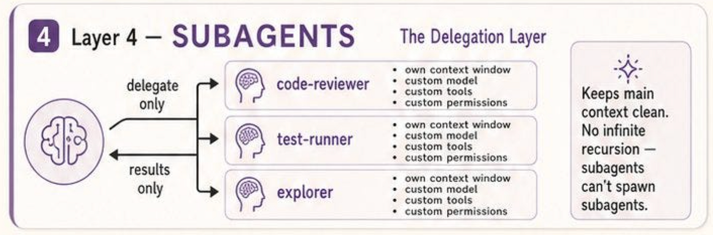

如果说 Hooks 解决的是控制问题，Subagents 解决的就是委托问题。Anthropic 的文档把 subagent 描述为在自己的上下文窗口里处理特定类型任务、并且只把结果返回给主智能体的专门化 AI 助手。

这个设计很重要，因为让一次智能体会话快速劣化的最常见方式之一，就是让每个旁支任务都用日志、搜索结果或永远不会被复用的探索性推理来污染主对话。

Subagents 是 Claude Code 对这个问题的回答：与其让一个通用智能体在一根线程里做所有事情，不如让主智能体把旁支任务委托给一个独立运作、最终汇报摘要的专门化 worker。

Subagents 有助于把探索与实现挡在主对话之外、用受限的工具访问来强制约束、跨项目复用配置、通过聚焦的提示词实现行为专业化，甚至通过把合适的任务路由到 Haiku 这样更便宜的模型来降低成本。

这就是为什么我觉得「委托层」是恰当的取景方式。一个 subagent 不只是一个有名字的提示词。它是一个有自己描述、系统提示、模型、工具权限、记忆设置和运行时作用域的、有边界的执行单元。

这也解释了为什么 subagents 不只是高级用户的便利。Anthropic 内置了若干 subagent，例如 Explore、Plan 与 General-purpose，每个都有不同的工具访问与预期用途。

Explore 针对只读搜索与代码库分析做了优化，Plan 用于规划工作流，general-purpose 智能体则处理涉及推理与行动的更复杂的多步任务。

值得注意的是，文档还指出，内置 subagents 会继承父对话的权限，并在此基础上施加额外的工具限制。这是一个微妙但重要的系统选择：委托并非无限制。它在设计上就是有边界的。

文档还确认了一个关键点：subagents 不会无限递归。Anthropic 明确指出 subagents 不能再生成其他 subagents，并且这一限制是 Claude 在仍能收集必要上下文的同时避免无限嵌套的方式之一。

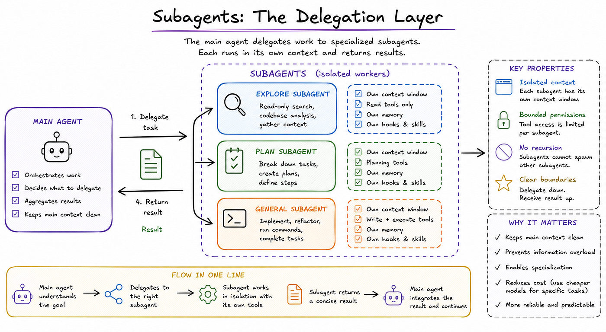

这是一个关键的设计决定。如果没有这样的硬边界，委托很容易演变成不受控的智能体树：昂贵、难以监控、也难以推理。通过禁止嵌套生成，Claude Code 让委托模型保持简单：主智能体把工作向下委托，subagent 在隔离环境里执行，结果再向上回传。

从工程实操的视角看，Anthropic 设计中最有用的部分是 subagents 可以在多个作用域上配置。

它们可以通过 `/agents` 命令交互式创建，可以在用户级别保存在 `~/.claude/agents/`，也可以在项目级别保存在 `.claude/agents/`，可以通过 CLI 在当前会话中传入，也可以通过 plugin 分发。

每个 subagent 只是一个带 YAML frontmatter 的 Markdown 文件，但它定义的行为很丰富：模型选择、工具访问、记忆行为、hooks 与 skills，都可以被限定到那个特定的委托 worker。换句话说，subagents 不只是角色标签。它们是为专业化工作打包好的执行 profile。

也正因如此，我把 subagents 视作 Claude Code 中最重要的架构层之一。

CLAUDE.md 让主智能体扎根于项目规则，Skills 给它模块化专业能力，Hooks 在运行时强制策略。但只有 subagents 能阻止整个系统坍缩成一个责任过载的对话。它们围绕旁支工作划出硬边界，让团队能把工作流专业化，并让主上下文保持更干净、更耐用。

一旦有了这层委托，下一个问题就从技术问题变成组织问题：你怎么把所有这些行为打包并分发给整支团队？这就是下一层登场的地方。

---

## 第五层 — Plugins：分发层

一旦一支团队在 CLAUDE.md 里有了持久化记忆、在 Skills 里有了模块化专业能力、通过 Hooks 有了确定性控制、通过 Subagents 有了有边界的委托，下一个问题就不再是局部行为了。问题变成了分发。

你怎么让那套架构在仓库、机器和队友之间可移植，而不必每次都重新手工搭一遍？这正是 plugin 层在心智模型上变得有用的地方。

Anthropic 的文档暴露了多种用于在不同作用域打包和复用 Claude Code 行为的机制：用户级与项目级的 subagents、共享的 Skills、plugin 设置、组织范围内部署 CLAUDE.md，甚至承载代码智能或附加能力的 plugins。

在实践里，这意味着 Claude Code 不只是为单一用户配置的工具。它越来越被设计成让团队能够标准化与分发智能体行为的工具。

这里最强的官方信号来自 Anthropic 的 plugin 与 settings 模型。成本与设置文档里描述了专门的 plugin 配置区段、plugin 白名单，以及像 `codeIntelligence.*` 这样的 plugin 权限，并支持项目本地设置与继承的用户设置。

Anthropic 还指出像 `--append-system-prompt` 与 `--allowedTools` 这样的 CLI 参数不会传播进 plugin，这强化了一个重要的架构观点：plugin 被视作有自己行为表面的、有边界的分发单元，而不是父会话的被动扩展。

这也是为什么我觉得「分发层」是合适的取景方式。Plugins 不只是为了添加工具。它们是为了把智能体行为打包，让它能被规模化地安装、复用与治理。

同样的分发模式也出现在 subagents 与 Skills 里。Anthropic 的 subagent 文档支持多种安装作用域，包括用户级别 `~/.claude/agents/`、项目级别 `.claude/agents/`、通过 CLI 传入的仅会话级 subagents，以及作为更广泛包的一部分被分发的 plugin 定义的 subagents。

Skills 遵循类似的模块化设计，让可复用的运维知识可以活在始终加载的记忆层之外，仅在相关时被调用。换句话说，Claude Code 的架构不止步于「智能体能不能做这件事？」它越来越关心「这种能力如何被打包并共享？」这是一个真正平台、而非单用户助手的标志。

这一层还有治理维度。Plugin 模型让团队不只能分发便利，还能分发策略。一个共享的包可以承载经批准的 subagents、被仔细收紧权限的工具、标准化的 hooks，或组织特定的工作流。

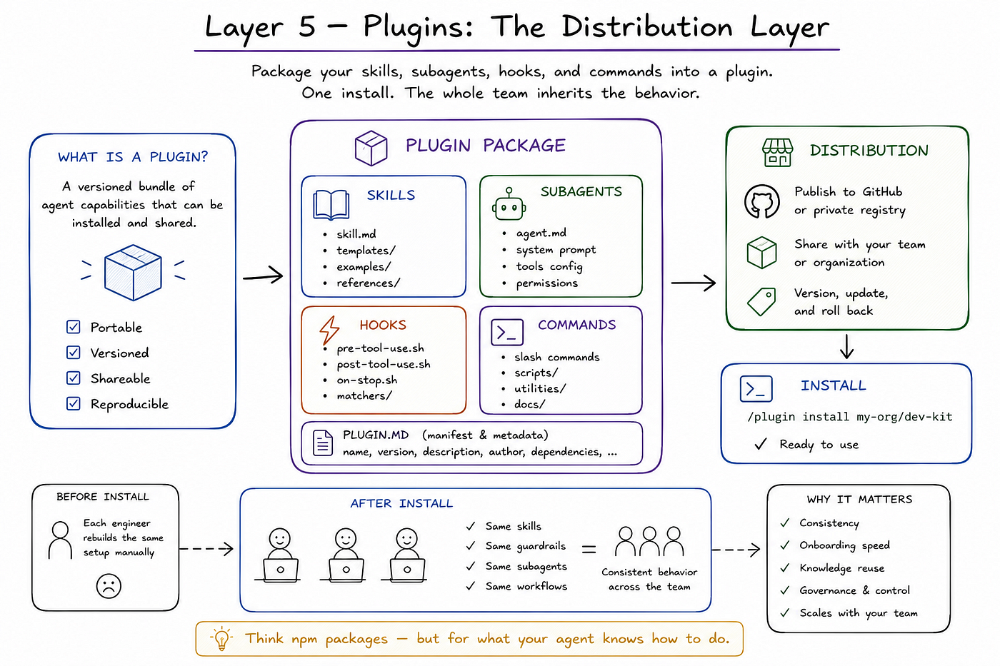

Anthropic 的记忆文档甚至记录了用于企业部署的、跨 macOS、Linux、WSL 与 Windows 的、集中管理的 CLAUDE.md 路径，这表明标准化并非事后补丁。

帮助单个工程师更快工作的那套分层架构，也可以被翻译成团队级的运营模型：记忆、专业能力、控制与委托，安装一次，统一继承。这比指望每个人都记得同一套提示词配方要稳健得多。

这就是为什么我觉得 Plugins 是栈中最后一个核心层。CLAUDE.md 定义稳定规则，Skills 打包专业能力，Hooks 强制运行时策略，Subagents 创造有边界的 worker，而 Plugins 与共享打包机制让所有这些变得可移植。

它们是把智能体行为从一个人的个人配置变成团队资产的关键。一旦有了这层分发，整个栈就能更轻松地通过 MCP 服务器连接到外部世界，并组合进更宏观的多智能体团队模式。

---

## 大多数智能体失败都来自一层缺失

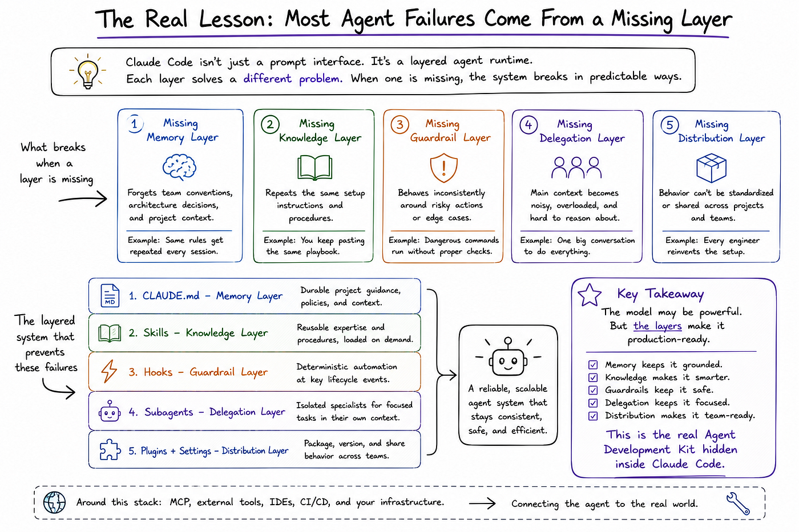

让 Claude Code 变得有意思的，不只是它是一个智能体编程工具。Anthropic 的文档明确指出，它同时还是一个可扩展的运行时，为持久化指令、模块化专业能力、确定性的工作流控制、被委托的执行与外部工具集成提供了不同的机制。

CLAUDE.md 定义持久的项目指引，Skills 在相关时加载可复用的任务知识，Hooks 在特定生命周期点自动执行，Subagents 在独立上下文中隔离聚焦的子任务。把它们放到一起看，并不是一组孤立的功能。它们是对真实智能体系统中不同失败模式的不同回答。

这就是为什么我觉得，大多数生产环境里的智能体工作流失败更应被理解为架构失败，而不是模型失败。当一个系统忘掉团队约定，缺的通常是持久化记忆这一层。当它反复重复同样的初始化指令，缺的就是模块化知识这一层。

当它在高风险动作周围表现得不一致，缺的就是确定性护栏这一层。当主上下文变得喧闹拥塞，缺的就是委托这一层。当行为没法在项目或团队之间标准化，缺的就是分发这一层。模型本身可能仍然不错，但缺了周围那些层，工作流就会持续脆弱。

Anthropic 自己的指引也强化了这种分层解读。他们的最佳实践文档明确把咨询性指令与确定性的 hooks 区分开，指出当某件事必须每次都执行、零例外时，hooks 才是合适的工具。

他们的 subagent 文档强调上下文保留与专业化。他们的 skills 文档把 skills 框定为承载反复出现的指令、清单与多步流程、不该活在始终加载的记忆里的内容的合适位置。

即便那些概览页面也始终把 Claude Code 描述为一个能读代码库、运行命令、与开发环境集成的工具——这远比一个聊天界面更接近一个运维系统。

我的看法是，这是接下来思考 Claude Code 时更有用的方式。最大的飞跃不是模型在编码上变得更强，而是围绕模型的系统正在越来越多地暴露出让编程智能体在实践中更可靠所需的那些层。

一旦你不再把 Claude Code 看作「终端里的助手」，整个架构就更容易理清。CLAUDE.md 给智能体一份章程，Skills 给它模块化专业能力，Hooks 在运行时强制质量，Subagents 让委托保持有边界，MCP 与更宽泛的扩展面把整个栈连接到真实工具与真实工作流。

而这，在我看来，才是隐藏在 Claude Code 内部的真正的 Agent Development Kit。不是某一个魔法功能，而是一套分层系统：每一部分都解决了仅靠提示词无法解决的问题。

---

## 加入我即将开课的直播工作坊：[Designing Multi-Agent Deep Search Systems](https://www.tickettailor.com/events/todatabeyond/2200589)

如果你想理解如何在简单的检索与基础工具调用之外架构深度搜索智能体，我会就这个主题做一场技术直播工作坊。

我们会覆盖完整架构：planner 智能体、executor 智能体、工具设计、MCPs、来源可靠性评分、矛盾处理、时间推理、记忆管理、合并与评估。

你还会拿到录像、幻灯片、技术手册、架构蓝图、来源评分模板与评估清单。

[预订座位](https://www.tickettailor.com/events/todatabeyond/2200589)

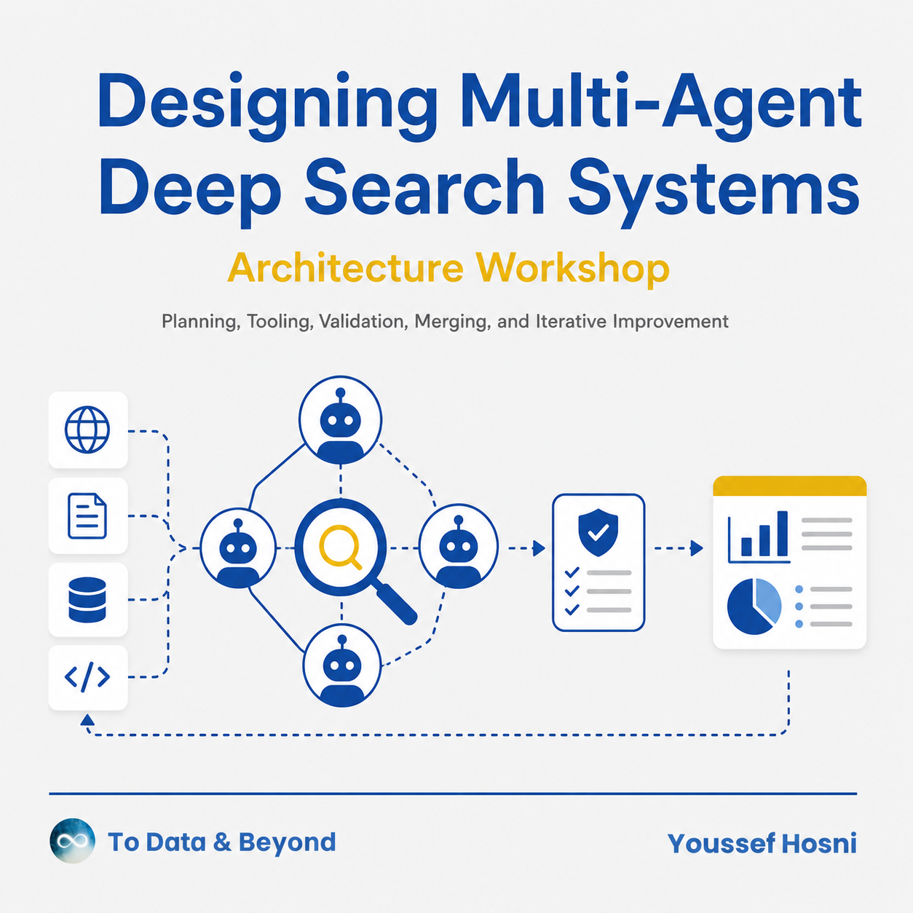
