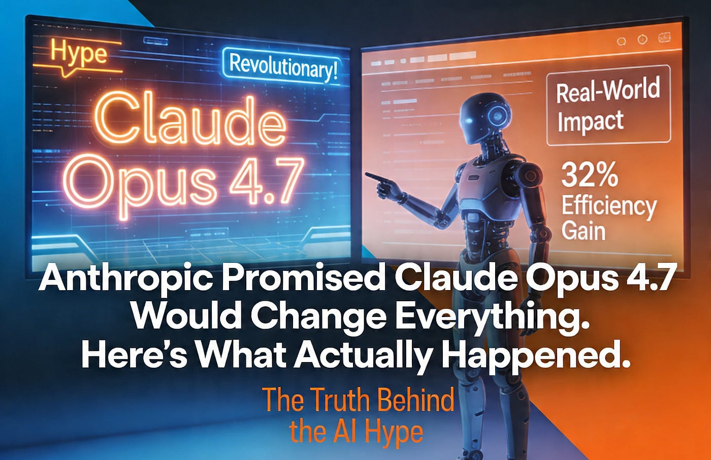
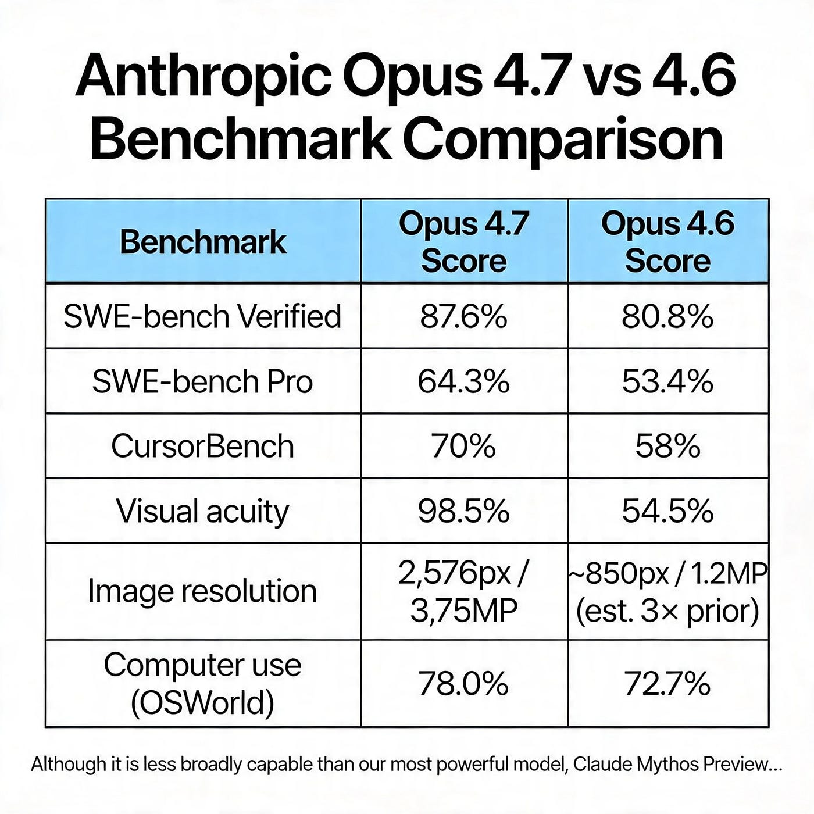
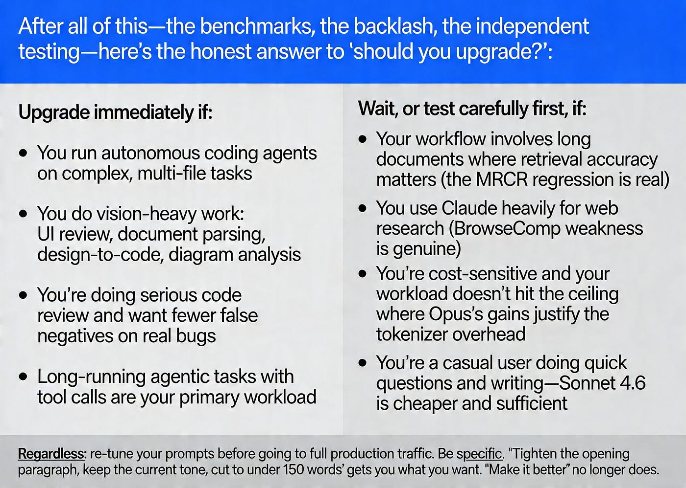

> 作者：Adi Insights and Innovations
> 发布日期：2026-04-21
> 原文链接：https://pub.towardsai.net/anthropic-promised-claude-opus-4-7-would-change-everything-heres-what-actually-happened-bc3bc18fafa6

# Anthropic 承诺 Claude Opus 4.7 会改变一切。真实情况是这样的。

> 基准测试说它是当世最强的编码 AI。2300 名开发者却称之为退步。两种说法都成立——而这本身就在告诉你一些重要的事。

四天前，每当一款新的前沿模型（frontier model）发布时，我都会做我惯常会做的事。

我没有看新闻稿（press release）。

不是因为它没用——它有用。但新闻稿告诉你的，是公司希望你相信的产品形象。我想知道的是另一回事：它真的能用吗？它在哪里会出问题？谁该现在升级，谁该再等等？

于是我用过去 72 小时通读了能找到的所有真实使用评测、所有 Reddit 讨论串、所有开发者拆解，主题都是 Claude Opus 4.7。我亲自在自己日常会跑的任务上测试了它——那些杂乱的、跨多文件的、真实工程问题。我把 Anthropic 给出的具体说法和独立评测者、开发者实测出的结果摆在一起对照。

下面是诚实的图景。没有炒作。没有 FUD（fear, uncertainty, doubt，恐惧、不确定、怀疑）。只有真实的部分。

## Anthropic 是这样宣称的

我们先把 Anthropic 的原话准确摆出来，因为这里的措辞很重要。

他们的发布公告把 Opus 4.7 描述为一款"以严谨与一致性处理复杂、长时间运行任务，精确遵循指令，并在汇报前自行设法验证输出"的模型。他们说这是"在高级软件工程上对 Opus 4.6 的显著改进，在最困难的任务上提升尤为明显"。他们说用户可以"放心地把最棘手的编码工作——那种过去需要紧密监督的——交给它"。

他们用基准测试作为佐证：

- SWE-bench Verified：87.6%（Opus 4.6 是 80.8%）
- SWE-bench Pro：64.3%（从 53.4% 跳上来——涨幅最大的一项）
- CursorBench：70%（从 58%）
- 视觉精度（Visual acuity）：98.5%（从 54.5%）
- 图像分辨率：2,576px / 3.75MP——是此前模型的 3 倍多
- 计算机使用（Computer use，OSWorld）：78.0%（从 72.7%）

强势的说法，亮眼的数字。耐人寻味的是，他们还加了一句大多数报道一笔带过的话：

> "尽管它的综合能力不如我们最强的模型 Claude Mythos Preview……"

我们稍后会再回到这句话。先看一个问题：这些说法站得住脚吗？

## Opus 4.7 真正交付的部分

我先讲这一面，因为诚实地说——在合适的任务上，它确实做到了。

**1. 困难问题上的编码：宣称的部分成立。**

SWE-bench 的数字不是合成的。SWE-bench Pro 衡量的是模型能否在跨多种编程语言的真实开源代码库（codebase）中解决真实的 GitHub issue。单次发布从 53.4% 提升到 64.3%、整整 10.9 个百分点的跳跃，不是误差。这相当于你最得力的工程师突然在他们本职工作上变得明显更厉害。

[CodeRabbit](https://www.coderabbit.ai/)——一家代码评审平台——拿 Opus 4.7 在 100 个已知存在 bug 的真实拉取请求（pull request）上做了测试，发现它在 100 个案例中命中目标问题 68 次，相比此前基线的 55 次提升明显。这是在"找到那个真正重要的 bug"这件事上提升了 24%（相对值）。换成实际意义：一个团队每周合入 20 个 PR，那意味着每周多在生产环境前拦下大约 3 个 bug。一个季度下来，就是 36 个不会在凌晨两点把人喊起来的 bug。

Opus 4.7 的代码评审意见现在的明确表态率（assertiveness rate）达到 77.6%，含糊措辞率（hedging rate）只有 16.5%。它先抛出明确的判断，再给一段简洁解释，最后给出具体的补丁。如果你已经厌倦了那种说"你或许可以考虑要不要想想……"的 AI 代码评审，这正是你想要的改变。

**2. 长程 agent 运行：可靠性的提升是真实的。**

对 Opus 4.6 最常见的抱怨之一是：在一项复杂的多步任务中，它会在第 25 步附近丢失线索——要么重复一次它已经发出过的工具调用，要么幻觉出一个从未见过的文件路径。Opus 4.7 在复杂多步工作流上的表现提升了 14%，同时使用更少的 token，并把工具调用错误数降到 Opus 4.6 的大约三分之一。

工具错误降到三分之一。这不是边际改进。这是"自主 agent 能完成任务"和"自主 agent 永远在原地打转"之间的差别。

在衡量企业代码库中真实生产工单（ticket）的 Rakuten-SWE-Bench 上，Opus 4.7 解决的生产任务数量是 Opus 4.6 的 3 倍。

**3. 视觉：这是没人在谈的最大单项改进。**

此前的 Claude 模型处理图像的分辨率约为 1.15 兆像素。Opus 4.7 接受长边最长 2,576 像素的图像——大约 3.75 兆像素。这不是规格表上的小升级。它从根本上改变了模型能"看到"什么。

之前：你给 Claude 发一张截图，它能勉强描述。细节模糊，标签会漏，坐标映射不可靠。

之后：在标准视觉基准上达到 98.5% 准确率——如果你曾因为 Claude 处理图像不够稳而把视觉任务路由到 GPT-5.4，现在值得重新评估。

具体哪些事情之前不行、现在能做：阅读化学结构图、解析密集的建筑施工图、为设计转代码工作流准确解读高分辨率 UI 截图、从高分辨率文档扫描件中抽取文字。一家生命科学研究公司报告说，他们利用这次分辨率提升来处理专利工作流——读取化学结构和技术图纸——这种工作此前在 Claude 模型上根本跑不通。

## 真实场景中复杂的那一面

下面这部分能解释：为什么发布后 24 小时内，一篇标题为 "Opus 4.7 不是升级，是严重退步" 的 Reddit 帖子收获了 2300 个赞，而一条声称该模型相比 4.6 没有改进的 X 帖子拿到了 1.4 万个赞。

**分词器（tokenizer）是一次隐形涨价——而 Anthropic 把它埋了起来。**

Anthropic 的价格保持原样：每百万输入 token 5 美元，每百万输出 token 25 美元。这一点他们大张旗鼓地宣布了。他们小声放在迁移文档里的事实是：在 Opus 4.6 中花费 X 个 token 的同一段文本，在 Opus 4.7 上可能需要多达 1.35 倍的 token——也就是相同工作量下，实际成本最高可能上涨 35%。

高熵内容——代码、技术文档——会更靠近这个区间的上端。又因为 Opus 4.7 在更高用力档位下"想得更多"，输出 token 也更多，复杂 agent 任务的真实成本上涨可能相当显著。

价格没变。但你为这个价格拿到的东西悄悄缩水了。所有订阅档位的用户都报告说，几次提示之后就把使用额度烧光了——这种情况在 Opus 4.6 时代不会出现。Anthropic 没有正面回应这个问题。

**没人写进标题的长上下文退步。**

这是几乎没有任何报道提到的基准：MRCR（Multi-Round Context Recall，多轮上下文召回），衡量模型能否准确从长文档中检索信息。Opus 4.7 在这一指标上从 78.3% 跌到 32.2%——一次悬崖式的结构性退步。

这能解释开发者讨论串中反复出现的一个具体抱怨：把一份 800 行的工作流文档喂给 Opus 4.7，让它就内容回答问题，它会说自己读过了——但输出的内容和文档实际写的完全无关。如果你的工作流涉及从密集文档中做长上下文检索，这就不是小问题。

**BrowseComp 是一个真实的弱项。**

BrowseComp 从 Opus 4.6 的 83.7% 降到 Opus 4.7 的 79.3%。GPT-5.4 Pro 在同一基准上是 89.3%，Gemini 3.1 Pro 是 85.9%。如果你的 agent 严重依赖网页搜索并跨多个页面综合信息，Opus 4.7 现在不是你的最佳选择。把这类负载路由到 GPT-5.4。Anthropic 在编码上领先。OpenAI 目前在网页研究上领先。这是诚实的竞争图景。

**自适应思考有时候不够用力。**

新的自适应思考特性——模型根据任务复杂度自行决定要推理多深——原理上很优雅。实际中，一些用户反映 Opus 4.7 即使在复杂问题上也不会深入思考，自适应推理在某些场景反而拖了后腿——固定的思考预算本来会强迫它做更彻底的分析。

变通办法是有的：明确提示模型"仔细思考"或"一步一步推理"。但对于这个价位的模型来说，这种摩擦本不该存在。

**字面化指令遵循的陷阱。**

Opus 4.7 在精确遵循指令上明显更好。这本身确实是一项进步。但它有一个让许多老用户措手不及的副作用：模型"不会从一项指令默默泛化到另一项，也不会推断你没有提出的请求"。

Opus 4.6 有一个很贴心的倾向——会把模糊的提示救回来——它会推测你大概想表达什么，然后把缺的部分补上。Opus 4.7 不这么做了。"让它更好"现在产出的是技术上更好的东西，但未必是你真正想改的那一处。你提示词库里所有依赖 Claude 帮你弥补不精确表达的地方，都需要重写。

## 按使用场景给出结论

把基准测试、社区反弹和独立测试都过完一遍之后，"是否应该升级"这个问题的诚实答案是：

**立刻升级，如果：**

- 你在复杂的多文件任务上跑自主编码 agent
- 你做大量视觉工作：UI 评审、文档解析、设计转代码、图表分析
- 你在做正经的代码评审，希望减少对真实 bug 的漏报
- 长时间运行、带工具调用的 agent 任务是你的主要工作负载

**先等等，或先谨慎测试，如果：**

- 你的工作流涉及长文档且检索准确性很关键（MRCR 退步是真实的）
- 你大量使用 Claude 做网页研究（BrowseComp 弱点是真实的）
- 你对成本敏感，且你的工作量没有触及 Opus 收益足以抵消分词器开销的那个上限
- 你是普通用户，主要是问问题和写写东西——Sonnet 4.6 更便宜也够用

**不论哪种情况：在切到全量生产流量之前，请重新调整你的提示词。**要具体。"收紧开头段，保持当前语气，压缩到 150 字以内"会拿到你想要的结果。"让它更好"已经不行了。

## 还有一件事——第三段里那一句

我说过我们会回来看的。

在 Anthropic 自己的发布文章里，第三段里埋了这样一句："尽管它的综合能力不如我们最强的模型 Claude Mythos Preview……"

Anthropic 刚刚发布了他们口中"对外可用的最强 AI"——并且在同一句话里告诉你，还有一个更强的、你拿不到的东西存在。这不是明年才出的下一代模型。是一个此刻就在运行、已经在生产环境中、被精挑细选出的十二家公司使用的东西，包括 AWS、Apple、Google、Microsoft 和 JPMorganChase。

它被限制使用的原因是：Mythos 在所有主流操作系统和所有主流网页浏览器中找出了数千个此前未知的零日漏洞（zero-day）。一位与之合作的研究人员说，他在几周内发现的安全 bug 比之前整个职业生涯加起来还多。其中一个 bug 已经在 OpenBSD 的网络栈里默默存在了 27 年。

Anthropic 告知美国政府官员，Mythos 会让 2026 年大规模网络攻击发生的可能性显著上升。然后他们决定不公开发布它。

而下面这一点是 Opus 4.7 真正超出基准表的意义所在：在训练过程中，Anthropic 主动尝试削弱 Opus 4.7 的网络攻击能力。他们正在把 Opus 4.7 的真实部署——也就是你现在在用的这款模型——当作一个测试场，用来开发让 Mythos 级别的能力最终能向所有人开放所必需的安全护栏。

Opus 4.7 不只是一个更好的模型。它是 Anthropic 用来证明"强大的 AI 可以被足够负责任地部署，从而最终解锁下一阶段"的一份实证。

你完全可以对这套叙事保持怀疑。时机这件事——据报道 Anthropic 的估值在两个月内从 3800 亿美元翻倍到了 8000 亿美元——并非无关紧要。"危险到不能发布"也是一句极好的营销文案。

但 27 年的旧 bug 是真的。2000 个零日漏洞是真的。今天你拿来在自己代码库上测试的这个模型——按 Anthropic 自己的设计——是更安全的那个版本。

这就是 Opus 4.7 的完整故事。所有部分——不只是他们写进标题的那一块。
