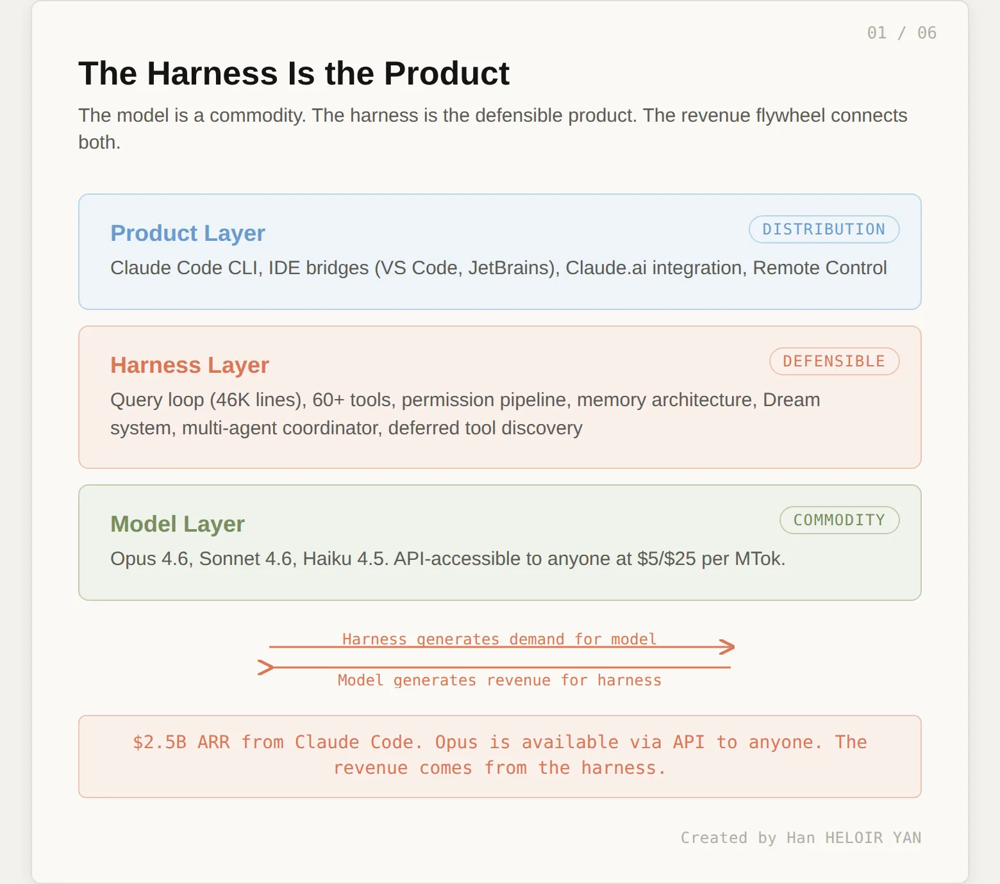
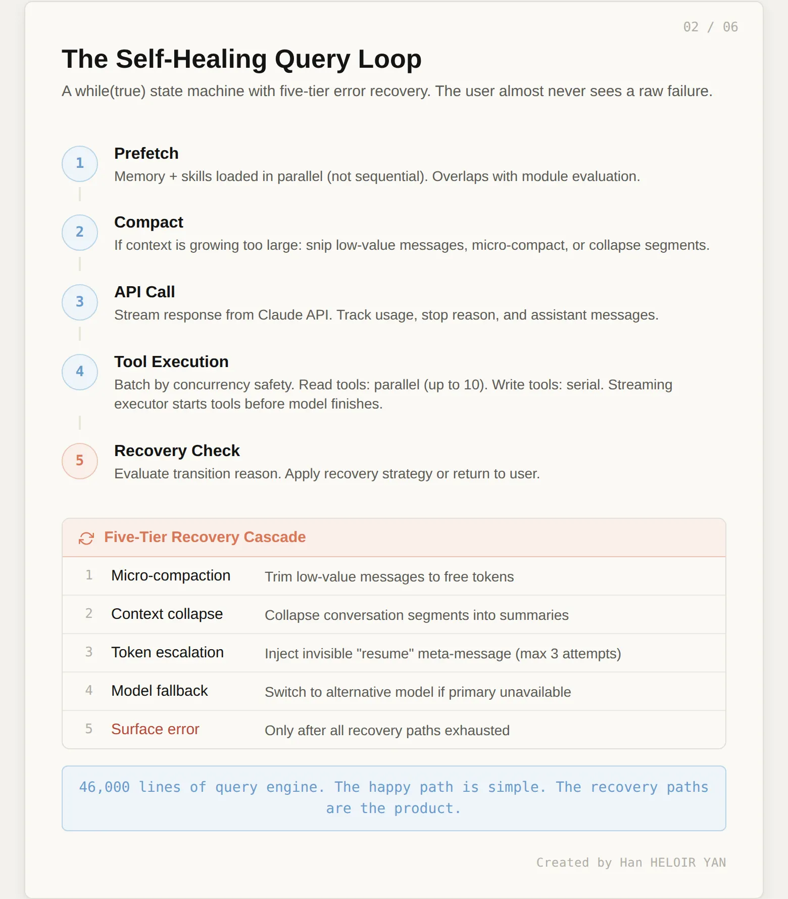
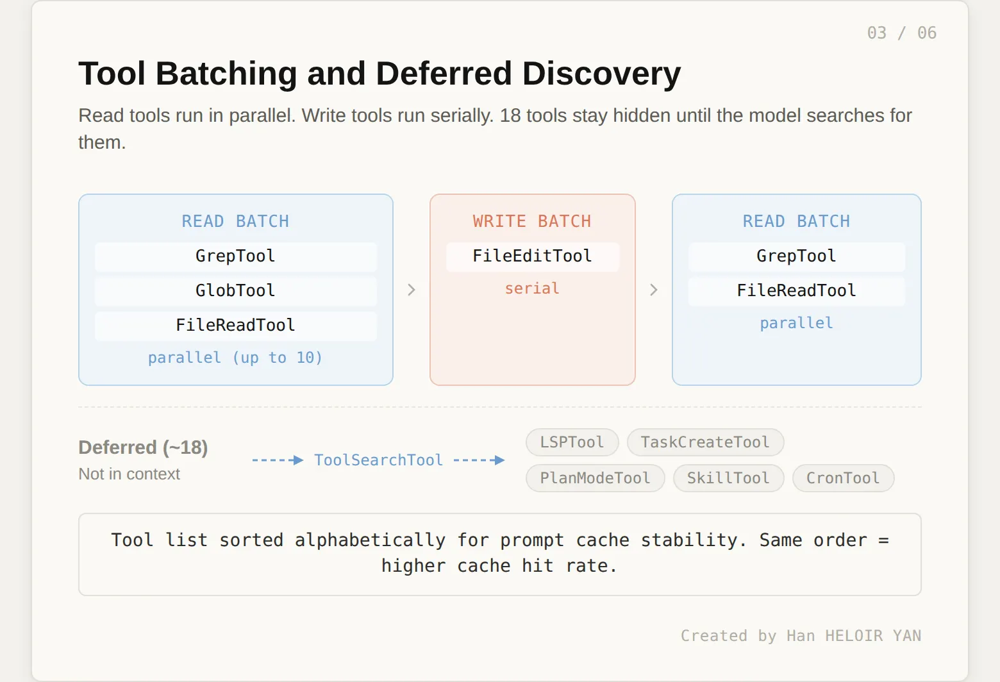
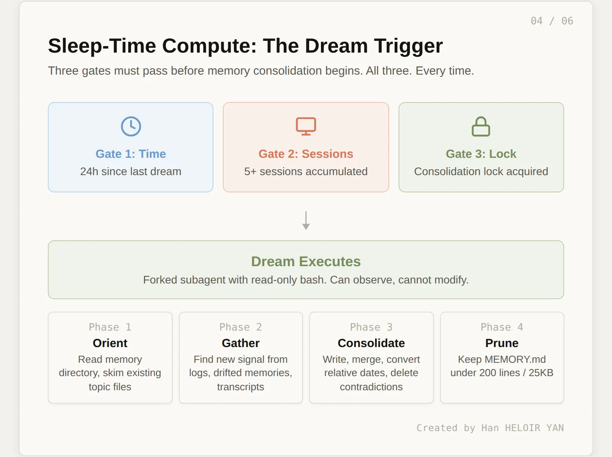
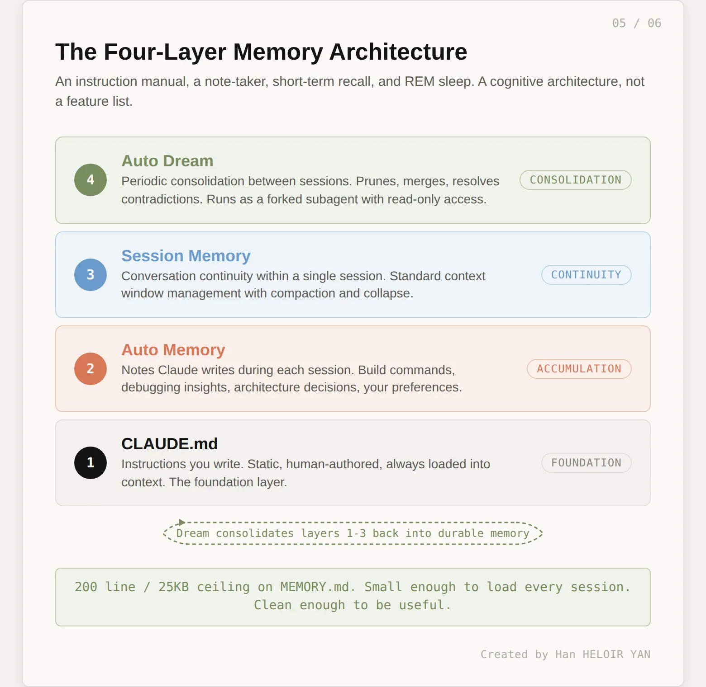
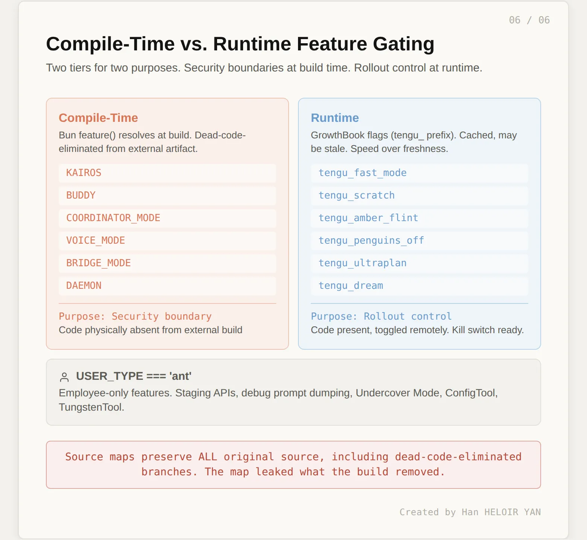
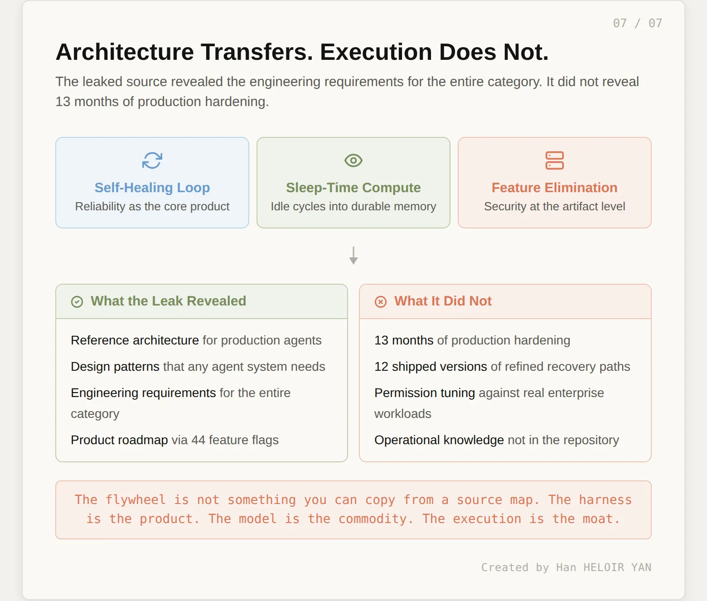

# 每个人都在分析 Claude Code 的功能，却没有人分析它的架构

**五十万行泄露源代码揭示：AI 编程工具的护城河不是模型本身，而是模型外围的Harness。**

> 作者：Han HELOIR YAN, Ph.D.
> 发布日期：2026年3月31日 · 阅读时长约 14 分钟
> 原文链接：[Medium](https://medium.com/@han.heloir/everyone-analyzed-claude-codes-features-nobody-analyzed-its-architecture-1173470ab622)

---

2026 年 3 月 31 日，全世界成千上万的开发者都在做同一件事：他们把 Claude Code 自己的源代码喂给 Claude，让它解释自己。

Anthropic 旗舰命令行工具 Claude Code 的整个 512,000 行 TypeScript 代码库刚刚泄露——原因是一个意外打包进 npm 包的源映射文件（source map）。几个小时内，互联网就梳理出了 44 个功能开关（feature flags）、一个包含 18 个物种和扭蛋机制的电子宠物（Tamagotchi）系统，以及 "Tengu"、"Fennec"、"Penguin Mode" 等内部代号。

但功能清单不是重点。那种文章已经满天飞了。这次泄露的真正价值，不在于 Claude Code **能做什么**，而在于它**如何思考**。而开发者们按 token 付费给 Anthropic，只为理解 Anthropic 自家的产品——这不是讽刺，这正是本文的核心论点。

---

## Harness即产品（The Harness Is the Product）

大多数人以为 Claude Code 是一个围绕 Claude API 的 **薄层 CLI 封装器** （ thin CLI wrapper）：一个发送提示词、流式接收响应、处理少量文件操作的终端界面。

泄露的源代码讲述了一个完全不同的故事。Anthropic 实际发布的是 512,000 行 TypeScript：

- 一个使用双缓冲屏幕输出（double-buffered screen output）和 Yoga Flexbox 布局的定制 React 终端渲染器；
- 60 多个带有权限门控（permission-gated）和延迟发现机制（deferred discovery）的工具；
- 一个能够生成并协调并行工作智能体的多智能体编排系统；
- 一个在你不使用时运行的后台记忆整合引擎；
- 以及一个拒绝崩溃的自愈查询循环。

这不是一个封装器（wrapper），这是一个 AI 智能体的操作系统。

Hacker News 社区分成了两派。一派用赌场类比来否定这次泄露的价值："老虎机的源代码对赌场经理而言无关紧要。" 模型才是核心，CLI 是可丢弃的。另一派看到了相反的结论：模型是发牌员（dealer），Harness 才是赌场（casino），而赌场非常难建。

数据支持第二种观点。Opus 4.6 对任何人开放 API 访问，价格为 $5/$25 每百万 token。然而 VentureBeat 报道称，仅 Claude Code 一项就产生了 25 亿美元的年化经常性收入（ARR），其中 80% 来自企业客户。开发者付费购买的不是模型本身，而是让模型变得可用的 Harness：

- 工具编排（tool orchestration）、
- 权限系统（permission system）、
- 上下文管理（context management）、
- 错误恢复（error recovery）。

去掉这些，你得到的只是一个昂贵的自动补全工具。

3 月 31 日当天的自指收入循环（self-referential revenue loop）让这一点变得具体。一位开发者专门搭建了一个 MCP 服务器，让人们可以用 Claude Code 交互式地探索被泄露的 Claude Code 源码。另一位开发者在凌晨 4 点用 Claude Code 将其核心架构移植到 Python，赶在日出前完成。一个中国团队基于泄露的源码构建了一套 12 节的逆向工程课程。开发者 Jingle Bell 用一句话概括了这个场景："Claude 今天的营收来自每个人都在用 Claude 分析 Claude 的源代码。"

Harness为模型创造需求。模型为Harness创造收入。这个飞轮（flywheel）本身就是产品。

以下是从泄露源码中提炼出的三种架构模式。不是功能特性，不是代号，而是驱动飞轮运转的工程原语（engineering primitives）。

---

## 模式一：自愈查询循环（The Self-Healing Query Loop）

Claude Code 中工程成本最高的部分不是 AI，而是错误处理。

Claude Code 的核心是一个查询循环。不是简单的请求-响应周期，而是一个 `while(true)` 状态机（state machine），跨迭代管理一个可变状态对象（mutable state object），只有一个最高设计目标：**永远不要向用户暴露原始错误**。

每次迭代遵循相同的序列：首先，并行预取记忆和技能（skills）（而非串行，串行会使延迟翻倍）；然后，如果上下文增长过大，则进行消息压缩（message compaction）；接着，带流式传输（streaming）调用 API；随后执行模型请求的工具；最后检查是否应该继续循环还是返回。在每一步，循环都会记录为何没有终止，将转换原因存入状态，以便下一次迭代可以做出调整。

错误恢复级联（error recovery cascade）是真正的工程核心所在。当某个环节失败时，循环不会崩溃，而是依次尝试一系列逐步激进的恢复策略：

1. **微压缩（Micro-compaction）**。从上下文中裁剪低价值消息以释放 token 空间。
2. **上下文坍缩（Context collapse）**。如果压缩不够，将整段对话折叠为摘要。
3. **Token 升级（Token escalation）**。如果模型的输出预算在任务中途耗尽，注入一条不可见的元消息（"直接继续，不要道歉，不要回顾"）然后继续。在向用户暴露停止原因之前，最多尝试三次。
4. **模型回退（Model fallback）**。如果主模型不可用，退回到备选模型。
5. **暴露错误（Surface error）**。只有在所有恢复路径都用尽之后，用户才会看到错误信息。

一位逆向工程了 12 个版本 Claude Code 混淆后 JavaScript 的开发者发现，5.4% 的工具调用被静默丢弃（silently orphaned）：模型请求了一个工具，工具也执行了，但结果从未被返回。自愈循环正是为了在用户无感知的情况下吸收这类故障。

工具执行增加了另一个层次。循环不会逐个运行工具，而是根据并发安全分类（concurrency safety classification）将工具调用分批（batch）。每个工具通过一个 `isConcurrencySafe()` 方法声明自身是否可安全并行执行。只读工具（grep、glob、文件读取）并发运行，一次最多 10 个。写工具（文件编辑、有副作用的 bash 命令）串行运行。批次交替执行：读批次、写批次、读批次。一个流式工具执行器（streaming tool executor）还可以在模型仍在生成输出时开始执行工具，将计算和 I/O 重叠以减少延迟。

工具系统本身同样遵循不浪费资源的原则。Claude Code 的 60 多个工具中，只有约 40 个在每次请求时加载，其余 18 个被标记为延迟加载（deferred）。它们对模型不可见，直到模型通过专门的 `ToolSearchTool` 搜索它们。当模型需要某个能力（LSP 集成、后台任务创建、定时任务调度）时，它搜索、获取 schema、并在同一轮调用该工具。用户看不到任何异常，但上下文窗口因此节省了约 200K token，因为模型不需要的工具 schema 从未进入工作记忆。

甚至工具列表的顺序也有讲究。工具在发送到 API 前按字母顺序排序。这不是为了美观，而是一种缓存优化（cache optimization）。字母排序使工具列表在跨请求时保持一致，从而最大化提示词缓存（prompt cache）的命中率。工具列表的一次缓存未命中意味着要重新处理数千个 token 的 schema 定义。按名称排序将其变成了一个稳定前缀（stable prefix）。

对于构建智能体系统的人来说，这里有一个反直觉的教训：可靠性不是在核心循环工作后再添加的功能。核心循环本身就是可靠性系统。Claude Code 的查询引擎有 46,000 行代码，不是因为正常路径（happy path）复杂，而是因为恢复路径（recovery paths）复杂。

---

## 模式二：睡眠时算力（Sleep-Time Compute）

Claude Code 做的最重要的事情，恰恰发生在你没有使用它的时候。

每个 AI 编程工具都面临同一个问题：你与它工作数小时，建立上下文——架构决策、调试思路、构建命令、个人偏好。然后你关闭终端，下一次会话从零开始。模型不记得昨天的事，你重复同样的话，它犯同样的错。你积累的上下文消失了。

Claude Code 的答案是一个叫 `autoDream` 的系统。这个命名是有意为之：Claude 在做梦。

在会话间隙，Claude Code 会生成一个派生的子智能体（forked subagent），其唯一职责是记忆整合（memory consolidation）。该子智能体读取你的项目记忆目录，回顾近期会话日志，识别值得持久化的新信息，并重写记忆文件使其更干净、更准确、对下次会话更有用。这个子智能体的系统提示词（system prompt）明确描述了它的角色："你正在执行一次梦境（dream），对你的记忆文件进行反思性回顾。将你最近学到的内容综合成持久的、组织良好的记忆，以便未来的会话能够快速定位。"

梦境不是随时运行的。它有一个三门触发机制（three-gate trigger），三个门必须全部通过才会开始整合。

- **门 1：时间（Time）**。距上次梦境至少 24 小时。防止在多个短会话之间过度整合。
- **门 2：会话数（Sessions）**。距上次梦境至少 5 个会话。确保积累了足够的新信号使整合有价值。
- **门 3：锁（Lock）**。子智能体必须获取整合锁（consolidation lock）。防止多个 Claude Code 实例并发做梦。

当三个门全部通过后，梦境执行四个阶段：

1. **阶段一：定向（Orient）**。列出记忆目录，读取索引文件（MEMORY.md），浏览现有的主题文件以了解当前状态。
2. **阶段二：采集信号（Gather Signal）**。搜索近期来源中值得持久化的新信息。优先级顺序：每日日志优先，然后是漂移记忆（drifted memories，即已变化的事实），最后是与工作中模型注意到的模式相关的会话记录搜索。
3. **阶段三：整合（Consolidate）**。写入或更新记忆文件。将相对日期（"昨天"）转换为绝对日期（"2026年3月30日"）。删除与更新信息矛盾的旧事实。合并冗余条目。
4. **阶段四：修剪与索引（Prune and Index）**。将 MEMORY.md 控制在 200 行以内、约 25KB。移除过时指针，解决矛盾。索引必须足够小，以便加载到每个未来会话的上下文中而不产生显著的 token 开销。

梦境子智能体只有只读的 bash 访问权限。它可以观察你的项目（读取文件、列出目录、检查 git 状态），但不能修改任何内容。这是一个安全边界：整合过程不应对你的代码库产生任何副作用。

这一架构对应了 UC Berkeley 关于睡眠时算力（sleep-time compute）的研究概念：利用空闲计算周期来提升未来的推理效率。该论文提出从累积的上下文中预推理可能的未来查询。`autoDream` 是向后看而非向前看——它组织过去的记忆，而非预测未来。但设计哲学一致：在用户不等待的时候投入算力，使下次会话启动更快、上下文更好。

最终形成的是一个四层记忆架构（four-layer memory architecture），目前没有其他 AI 编程工具发布过类似的实现：

- **第一层：CLAUDE.md**。你编写的指令。静态、人工编写、始终加载。
- **第二层：自动记忆（Auto Memory）**。Claude 在每次会话中写下的笔记——构建命令、调试心得、架构决策、你的偏好。自动积累。
- **第三层：会话记忆（Session Memory）**。单次会话内的对话连续性。标准的上下文窗口管理。
- **第四层：自动梦境（Auto Dream）**。对第一到第三层所有积累内容的周期性整合。垃圾回收器、碎片整理器、REM 睡眠。

一份指令手册、一个笔记员、短期记忆、和 REM 睡眠。这不是一个功能列表，这是一套认知架构（cognitive architecture）。

---

## 模式三：编译时功能消除（Compile-Time Feature Elimination）

源映射泄露的根本原因在于：安全系统确实生效了——代码被从构建产物中消除了，但它没有从映射文件中消除。

Anthropic 将一套代码库发布给两类受众。内部员工获得 KAIROS（常驻持续助手）、BUDDY（电子宠物伙伴）、Coordinator Mode（多智能体编排模式）、语音模式（Voice Mode）、桥接模式（Bridge Mode），以及十几个其他实验性子系统。外部用户什么都得不到。外部构建产物中不包含被 if 语句保护的死代码（dead code）——代码在物理上不存在于可执行文件中。

其实现机制是 Bun 的 `feature()` 函数，它在构建时（build time）求值，而非运行时（runtime）。当 Anthropic 构建外部包时，每个 `feature('KAIROS')` 调用被解析为编译时常量 `false`。随后 Bun 的打包器对整个分支进行死代码消除（dead-code elimination）。生成的 JavaScript 文件中不包含 KAIROS、BUDDY 或任何其他受控子系统的任何痕迹——没有字符串引用、没有函数体、没有导入路径。彻底消失。

这是两层功能系统（two-tier feature system）的第一层。

第二层是通过 GrowthBook（一个功能开关平台）进行的运行时门控（runtime gating）。运行时开关（在代码库中以 `tengu_` 为前缀）控制渐进式发布、A/B 测试和已通过编译时门控的功能的紧急终止开关（kill switches）。检查这些开关的函数命名为 `getFeatureValue_CACHED_MAY_BE_STALE()`。这个名称本身就是一个编码在代码中的设计决策：功能开关允许过时的数据（stale data）。速度比新鲜度重要。智能体永远不应该阻塞在一个开关检查上。

两层各有不同用途。编译时消除是安全边界：内部专属功能不能以任何形式存在于外部构建产物中，包括不可达代码。运行时门控是发布机制：已批准对外发布的功能可以逐步开启、监控，出问题时立即关闭。

两层之上还有第三层：`USER_TYPE === 'ant'` 门控限定 Anthropic 员工专属功能。包括预发布（staging）API 访问、调试提示词转储（debug prompt dumping）、潜伏模式（Undercover Mode，防止 Claude 在公开的开源贡献中暴露自己是 AI 的身份），以及 `ConfigTool`、`TungstenTool` 等内部专用工具。

导致本次泄露的讽刺之处是结构性的。源映射的存在是为了弥合编译产物与原始源码之间的鸿沟。它在 `sourcesContent` 数组中包含原始源码，与编译器移除了什么无关。死代码消除保护的是可执行文件，不保护映射文件。Bun 默认生成源映射，没有人配置让它停止生成，也没有人在 `.npmignore` 中添加 `*.map`。于是整个内部代码库随一个 59.8MB 的 JSON 文件一起发布到了 npm。

这不是第一次发生。同样的源映射问题在 2025 年 2 月 Claude Code 首次发布时就出现过。Anthropic 悄悄移除了它。然后在版本 2.1.88 中——13 个月后——它又出现了。打包流水线从未被修复。Bun 的默认设置从未被覆盖。一家拥有世界最好语言模型的 AI 公司，一家专门构建了潜伏模式来防止内部信息泄露的公司，被 `.npmignore` 中缺失的一行文本击败了。

对于构建者的教训是结构性的，而非轶事性的。如果你在发布智能体产品，你需要两层功能系统：编译时消除用于安全边界（外部构建产物中必须不存在的内容），运行时开关用于发布控制（存在但被关闭的内容）。以及一个能验证发布产物实际内容的构建流水线——每次发布前执行 `npm pack --dry-run`。每一次。

---

## 这对"Harness vs. 模型"之争意味着什么

互联网在 3 月 31 日忙于编目各种功能：电子宠物系统、动物代号、一个检测你对 AI 骂脏话的正则表达式（frustration regex）。这些很有趣，但并不重要。

重要的是这三个模式。

**一个自愈查询循环**，将可靠性视为核心产品而非附加功能。循环有 46,000 行代码，因为恢复路径（压缩、坍缩、token 升级、模型回退）比正常路径更复杂。工具执行按并发安全性分批。延迟发现使 18 个工具在需要之前不进入工作记忆。字母排序稳定提示词缓存。每个细节服务于同一目标：用户不应看到任何故障。

**一个睡眠时算力系统**，将空闲周期投入记忆整合。四个记忆层（指令、笔记、会话记忆、梦境整合）构成了生产级编程工具中首个认知架构。三门触发机制防止过度整合和不足整合。梦境子智能体只读运行。索引上限 200 行。设计是克制的、审慎的、经过生产打磨的。

**一个编译时功能消除系统**，在构建产物层面强制安全边界。两层架构（编译时用于安全、运行时用于发布）服务于不同目的。结构性的讽刺在于：这个专门设计来隐藏内部功能的系统，正是当源映射泄露时使其如此有价值的原因——编译器消除的所有内容仍然在映射文件中。

这些不是功能特性，而是原语（primitives）——任何生产级智能体系统最终都需要的基础构件，无论它基于 Claude、GPT、Gemini 还是开源模型。泄露的源码没有暴露 Claude Code 的竞争优势，它暴露的是整个品类的工程要求。

竞争对手现在拥有了一份参考架构。一位开发者在天亮前就将核心模式移植到了 Python。一个团队构建了 12 节的逆向工程课程。Rust 移植已经在进行中。模式会迁移，它们总会。

但了解架构和执行架构是两码事。Claude Code 在这些模式背后有 13 个月的生产锤炼。恢复路径经过 12 个发布版本的打磨。权限规则针对真实的企业工作负载进行了调优。权限系统有五种公开模式、一个用于自动审批的 ML 分类器，以及能在执行前静默修改工具参数的预执行钩子（pre-execution hooks）——模型本身不知道它的输入被修改了。源代码是一个快照，运维知识不在代码仓库里。

3 月 31 日的自指循环给出了最终论证。开发者为模型付费以理解 Harness。Harness 使模型可用。Harness 使模型盈利。这个飞轮不是你能从源映射中复制的东西。它就是产品本身。

---

## 参考资料与延伸阅读

- **Kuberwastaken/claude-code (GitHub)**：最完整的功能目录和泄露源码拆解。了解"做了什么"从这里开始。
  <https://github.com/Kuberwastaken/claude-code>

- **sathwick.xyz, "Reverse-Engineering Claude Code"**：38 分钟的架构深度分析，涵盖查询引擎、工具系统、权限流水线和终端渲染器。已发布的最佳技术分析。
  <https://sathwick.xyz/blog/claude-code.html>

- **VentureBeat, "Claude Code's source code appears to have leaked"**：商业背景，包括 Anthropic 190 亿美元的 ARR、Claude Code 25 亿美元的 ARR，以及与泄露同期发生的 axios 供应链攻击。
  <https://venturebeat.com/technology/claude-codes-source-code-appears-to-have-leaked-heres-what-we-know>

- **Penligent, "Claude Code Source Map Leak"**：最中立的安全评估，区分了证据支持的和不支持的结论。
  <https://www.penligent.ai/hackinglabs/claude-code-source-map-leak-what-was-exposed-and-what-it-means/>

- **thehuman2ai.com, "Claude Code source has been available for 13 months"**：完整时间线，证明这个源映射自 2025 年 2 月 24 日首发之日起就一直在发布。
  <https://thehuman2ai.com/blog/claude-code-source-leak>

- **shareAI-lab/learn-claude-code (GitHub)**：基于泄露架构构建的 12 节 Harness 工程课程，适合想要实现这些模式的构建者。
  <https://github.com/shareAI-lab/learn-claude-code>
