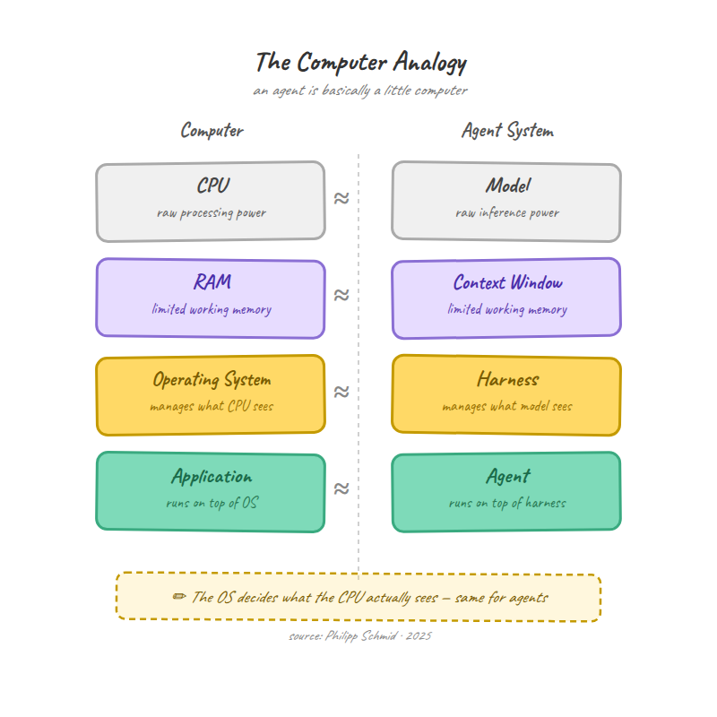
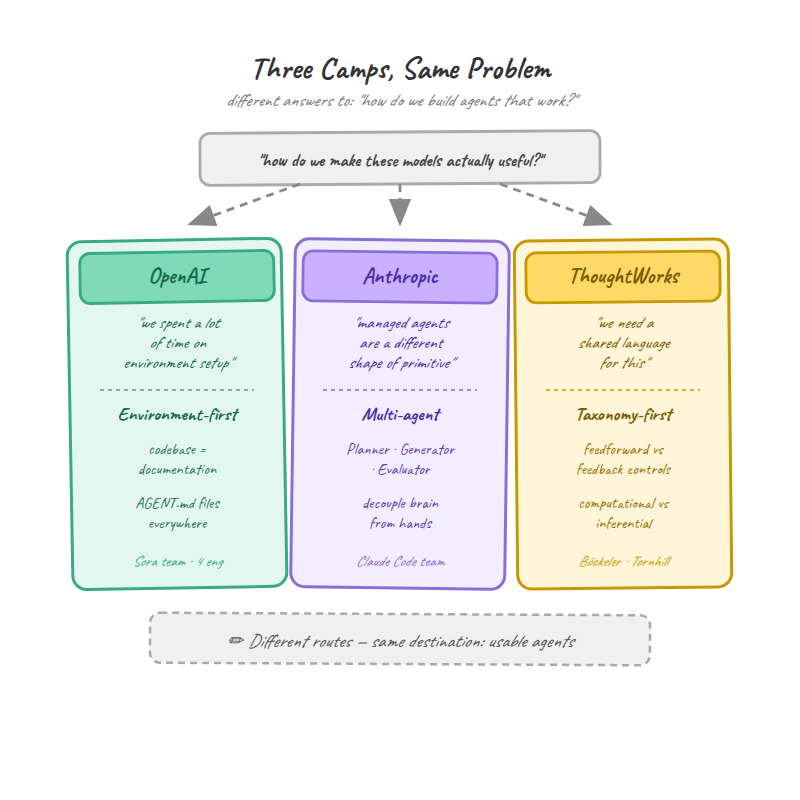
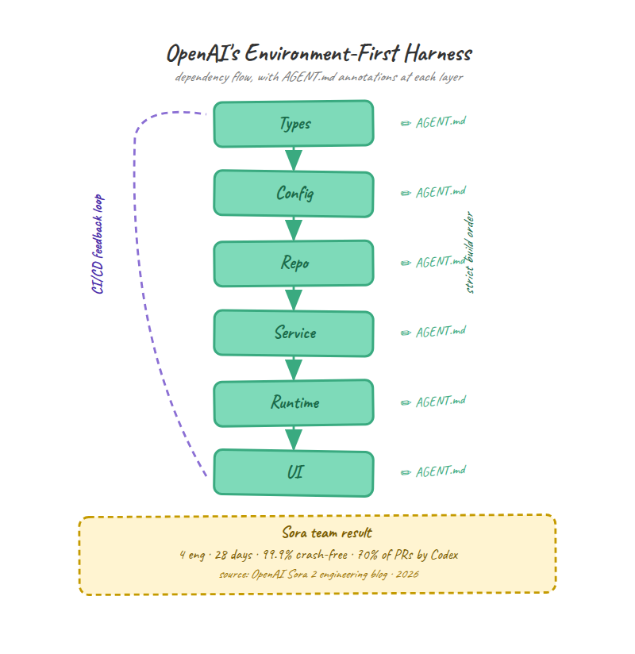
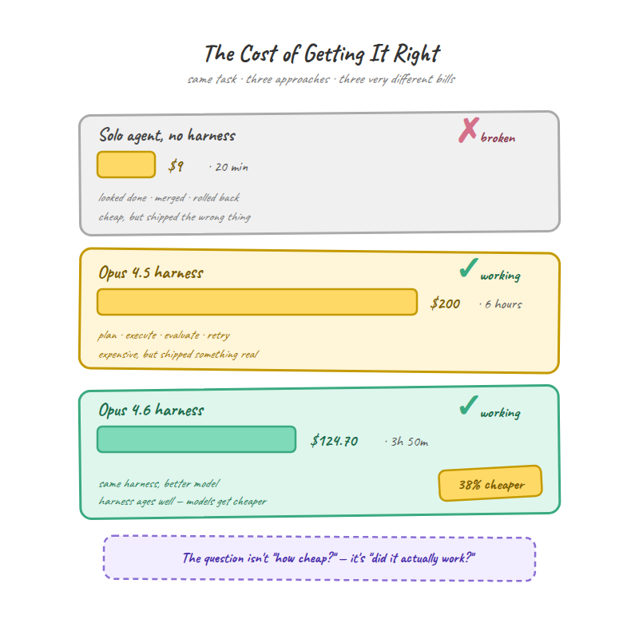

> 作者：Yanli Liu
> 发布日期：2026-04-17
> 原文链接：https://ai.gopubby.com/harness-engineering-what-every-ai-engineer-needs-to-know-in-2026-0ab649e5686a

# Harness 工程：2026 年每位 AI 工程师必须掌握的知识

**三个流派，三种架构——以及 Opus 4.7 刚刚用事实证明的一切**

---

2026 年 2 月，OpenAI 发布了一篇低调却深刻地重新定义了软件工程师日常工作的博文。标题只有两个词："Harness Engineering"（harness 工程）。

文章描述了一支小团队如何在不手写一行代码的情况下，将百万行生产代码交付上线。

他们的做法是：设计 AI 智能体（agent）的工作环境——约束条件、反馈回路、文档结构、依赖规则。代码由智能体编写，人类负责设计让智能体可靠运转的系统。

几周之内，Anthropic 发布了三篇工程论文（有效 harness、harness 设计、托管智能体），主题相同。ThoughtWorks 将其正式化为一套框架；Red Hat 撰写了实施指南；Hugging Face 的 Philipp Schmid 称其为"2026 年最重要的工程学科"。

一个新的工程学科在 90 天内横空出世。

而它的演进速度已经超出所有人的预期。昨天，Anthropic 发布了 Opus 4.7——不到一年内推出的第三代模型。每一代不仅提升了模型能力，也简化了 harness 本身。三月份不可或缺的组件，到四月份已成冗余负担。

这个学科诞生 90 天，就已经开始改写自己的规则。


数据揭示了这种紧迫性。LangChain 用同一模型在 Terminal Bench 2.0 上跑了两次：一次用旧 harness，一次用新 harness。模型相同，harness 不同，分数从 52.8% 跃升至 66.5%。

Vercel 走了相反的路——删除了智能体 80% 的工具。结果呢？性能反而更好。工具更少、约束更紧、输出更强。

如果说 2025 年是 AI 智能体证明自己能写代码的一年，那么 2026 年让我们发现：智能体从来都不是难点，harness 才是。

但让这个时刻真正值得关注的是：三个主要流派对 harness 应该做什么产生了根本分歧。他们认同问题本身，却在架构上各执一词。这个选择绝非学术之争——它决定了你的成本、所需工程师数量，以及你的智能体究竟产出可用软件还是代价高昂的幻觉。

本文将拆解三种方案的全貌，展示每种方案在实践中的真实样貌，并给出选择决策框架。

---

## Harness 究竟是什么

最简洁的定义来自 ThoughtWorks 的 Sunit Parekh 在《Beyond Vibe Coding》中所写：

> **智能体 = 模型 + Harness**

Harness 是除模型本身之外的一切：让智能体保持方向的约束、捕捉错误的反馈回路、告诉智能体身处何处及已完成哪些工作的文档，以及它被授权使用的工具集。去掉 harness，你得到的不过是一个在代码库里瞎猜的原始语言模型；配上合适的 harness，你得到的是一个能交付生产代码的系统。

OpenAI 团队在命名时借用了一个更古老的比喻。Harness 是马具：缰绳、马鞍和嚼子，将一头强壮却难以驾驭的动物引向有用的方向。你无需让马更聪明，只需设计出让它的力量得以发挥的装备。

Philipp Schmid 提供了一个更具技术感、值得内化的类比：把它想象成一台计算机——模型是 CPU（原始算力），上下文窗口（context window）是 RAM（有限且易失的工作内存），harness 是操作系统（管理 CPU 能看到什么以及何时看到），智能体则是运行在这一切之上的应用程序。



如果你来自金融或风险管理背景，还有一种更直接的理解方式。

Harness 就是控制框架（control framework）：一套确保自主系统在可接受边界内运行的策略、检查点和审计追踪。合规团队几十年来一直在构建这类东西，AI 界只是给它起了个新名字。

### 制品长什么样


大多数文章只停留在抽象定义上，这远远不够。如果你要构建一个 harness，就需要看清楚各个部件在实践中的样子。以下是在所有主要实现中反复出现的关键制品。

**AGENT.md / CLAUDE.md 文件（通用模式，名称各异）。** 这些 Markdown 文件分布在代码库各处，智能体在每次会话开始时读取它们。OpenAI 的 Codex 叫它 AGENT.md，Anthropic 的 Claude Code 叫它 CLAUDE.md，Cursor 用 .cursorrules。名字不同，原理相同：它们包含项目上下文、编码规范、架构决策，以及"我们这里的做法"等指引。OpenAI 的 Sora Android 团队在整个代码库中维护这些文件，智能体读取它们，就像新工程师在冲刺期间加入团队时读入职文档一样。每个主要模块一个文件，随项目演进持续更新。

```
# AGENT.md - Authentication Module
## Architecture
- OAuth2 flow with PKCE, tokens stored in encrypted SharedPreferences
- Never store tokens in plaintext. Never log token values.
## Conventions  
- All auth errors route through AuthErrorHandler
- Retry logic: 3 attempts with exponential backoff
## Current State
- Migration from v1 to v2 token format in progress (see issue #247)
```

**JSON 功能列表（Anthropic 模式）。** 当智能体在多个会话中构建完整应用时，每次新会话都从空白的上下文窗口开始。智能体怎么知道哪些已经完成、该做什么？Anthropic 的答案是一个同时充当项目规格和进度追踪器的 JSON 文件。每条记录定义一个功能、验证步骤以及通过/失败状态。在他们的 claude.ai 克隆演示中，这份列表包含 200 多个离散功能，全部初始状态为"失败"。

智能体在每次会话开始时读取此文件，选取优先级最高的失败功能，实现它，按测试步骤验证，将其标记为"通过"，然后提交。这既是测试套件，也是项目看板，人类和智能体都能读懂。

```json
{
  "category": "authentication",
  "feature": "Password reset via email",
  "verification": [
    "Click 'Forgot Password' on login page",
    "Enter registered email address",
    "Verify reset email received within 30 seconds",
    "Click reset link, enter new password",
    "Confirm login with new password succeeds"
  ],
  "status": "failing"
}
```

为什么用 JSON 而不是 Markdown？Anthropic 发现，模型"相比 Markdown 文件，不太可能对 JSON 文件进行不当修改或覆写"。细节虽小，但当智能体自主运行数小时时，这一点至关重要。

**会话初始化流程（Anthropic 模式）。** 每次编码会话都遵循相同的 7 步启动序列：确认工作目录、读取 git 日志和进度文件、查阅功能列表找到优先级最高的未完成功能、启动开发服务器、运行基础端到端验证、实现单个功能、提交并附上描述性信息和进度更新。

这不是可选项。没有它，每次新会话都从零开始，智能体要浪费头 20 分钟弄清楚哪些已经完成了。

**结构化任务模板（Red Hat 模式）。** 在任何编码开始之前，harness 使用语言服务器和代码分析工具对实际代码库进行分析，生成有据可查的影响图（impact map）。然后生成任务模板，包含真实文件路径、真实符号名称、现有可参照的代码模式，以及具体的验收标准。没有猜测，没有虚构的文件路径。

**Sprint 契约（Anthropic 模式）。** 在生成器智能体开始编码之前，它先与评估器智能体谈判。生成器提出将构建什么以及如何验证成功，评估器审查方案的完整性。只有双方达成一致，实现才开始。这是优秀工程团队早已在做的设计评审的轻量版本，区别在于双方都是 AI 智能体。



### 共同线索

综合来看，一个规律浮现出来。所有这些制品都是为了回答同一个问题："智能体在写下第一行代码之前，需要知道什么？"

答案是：很多。它在代码库中的位置、哪些已经完成、什么叫"做好了"、什么是禁区，以及如何验证自己的工作。这不是智能，而是上下文。而上下文，事实证明，才是 harness 工程真正的产出物。

---

## 三个流派

"harness 工程"这个术语不是从某个委员会或会议主题演讲中诞生的。三个团队各自独立地撞上了同一堵墙，然后各自造了一把不同的梯子翻过去。

### OpenAI："我们有百万行没人写出来的代码"


OpenAI 的 Codex 团队面临着一个近乎荒诞的规模问题。他们在构建生产应用，所有代码都由智能体编写。不是部分，是全部——百万行，零人工输入。

在这种规模下，逐行审查代码的传统方式完全行不通。你无法审查百万行代码。但你可以把环境设计得如此彻底，让智能体首先就产出可审查的输出。

他们从实践中总结出的核心教训：

> **给 Codex 一张地图，而不是一本千页操作手册。**

他们建立了严格的依赖流（Types → Config → Repo → Service → Runtime → UI），并用结构性测试机械地执行。他们在代码库各处嵌入 AGENT.md 文件作为分布式文档。他们将智能体直接接入 CI/CD 流水线，让每次变更都自动经过测试。

理念：设计好环境，然后让智能体在其中自由运作。人类的角色是架构师，不是编码者。

成效的证明来自 Sora Android 的构建：4 名工程师，28 天，消耗约 50 亿 token，应用上线后登上 Play Store 榜首，崩溃率仅 0.1%。Codex 每周处理 70% 的内部 pull request。工程师的时间花在高层架构、规划和验证上，其余交给智能体。



### Anthropic："我们的智能体一直在夸奖自己那些烂掉的工作"

Anthropic 的问题更隐蔽，某种程度上也更难解决。他们在构建需要在数小时自主工作中产出完整应用的长期运行智能体。模型能力本身够了，问题出在质量控制上。

当他们让智能体评估自己的输出时，它会自信地赞美这些工作——即便在人类观察者看来，质量明显平庸。

自我评估根本行不通。智能体既是学生又是老师，而它给自己打的全是满分。

他们的解决方案借鉴了生成对抗网络（Generative Adversarial Networks，GAN）的思路：把做事的和评判的分开。由此诞生了三智能体架构：规划器（Planner）将简短提示扩展为完整的产品规格；生成器（Generator）逐个 sprint 地实现功能；评估器（Evaluator）使用浏览器自动化，像真实用户一样与运行中的应用交互，并根据明确标准对每个 sprint 打分。

关键洞察在于：**将单独的评估器调教得足够挑剔，远比让生成器对自身工作保持批判性要可行得多。**

他们没有止步于此。架构从两个智能体（初始化器加编码器）演进到三个（规划器、生成器、评估器），再到他们称为"托管智能体（managed agents）"的完全解耦系统——大脑、执行环境和会话日志全部独立、可替换。解耦使首 token 延迟的 P50 下降了 60%，P95 下降超过 90%。


理念：把做事的和评判的分开，并让评判者难以取悦。

### ThoughtWorks："我们在 50 个客户团队中看到了相同的失败模式"

ThoughtWorks 进入 harness 工程的起点完全不同。他们不是在构建产品，而是在观察跨行业的数十个工程团队尝试采用 AI 智能体，并在各处看到相同的失败规律。

ThoughtWorks 杰出工程师 Birgitta Böckeler 拥有 20 年以上从业经验，于 2026 年 4 月发布了三者中最全面的框架。OpenAI 构建的是一个系统，Anthropic 构建的是一套架构，ThoughtWorks 构建的是一套分类体系（taxonomy）。

他们的框架沿两个轴对 harness 控制手段进行分类。第一轴：前馈（feedforward，执行前引导智能体行为的指引）vs 反馈（feedback，观测结果并支持自我修正的传感器）。两者缺一不可——纯反馈意味着错误会反复出现，纯前馈则永远无法验证指引是否真正奏效。

第二轴：计算型（computational，确定性检查，如 linter、类型检查器、测试套件，毫秒级运行）vs 推理型（inferential，由另一个 LLM 进行语义分析，速度更慢、成本更高，但能捕获代码分析无法发现的问题）。

在此基础上，他们将所有内容组织成三类监管范畴：可维护性（最成熟，linter 和覆盖率工具已能良好运作）、架构适配性（执行设计模式和性能要求），以及行为（最难的一类——你需要验证智能体真正做了它被要求做的事，而不仅仅是代码能编译通过）。

理念：分类、系统化，并为团队提供一套描述自己所构建事物的共同词汇。

### 三者为何走向不同

三个流派构建出不同的东西，因为他们起步时面临的是不同的问题。OpenAI 需要规模化交付产品；Anthropic 需要自主智能体产出高质量结果；ThoughtWorks 需要一个无论使用何种智能体或模型的团队都能适用的框架。

在评估哪种方案适合自己时，记住这一点很重要。问题不是"哪个流派是对的"，而是"我真正面临的是哪个问题"。

---

## 三种架构的横向对比

上一节讲了三个流派的来源，现在来看他们实际构建了什么——更重要的是，每种架构在哪里会出问题。

### OpenAI/Codex：环境优先的 Harness

Codex harness 在你能大量前期投入设计智能体工作环境时效果最佳。回报是巨大的下游自主性，但前期成本是真实的。

**工作方式。** Harness 即代码库本身。AGENT.md 文件提供上下文，结构性测试用机械方式执行架构规则，依赖流防止智能体以错误顺序构建东西，CI/CD 流水线自动验证每次变更。

智能体以高度自主的方式运作：开 pull request、响应审查反馈、运行测试、在失败上迭代、满足条件后合并。人类不审查每一行，而是审查使每一行都可被审查的约束。

**擅长什么。** 超大型代码库。如果你在构建或维护几十万行的项目，环境优先方案能够扩展，因为约束嵌入在代码库结构本身中。增加新模块，增加 AGENT.md，智能体无需重新训练或配置就能在其中工作。OpenAI 估计交付速度约是手写代码的 10 倍。

**在哪里失效。** 这种方案假设你能在智能体开始工作之前就全面定义好环境。对于仍在确定架构的全新项目，这很难做到。它也严重依赖结构性测试和 CI 流水线——这些能检验代码是否正确，但检验不了代码是否优秀。一个函数可以通过所有测试，但仍然是一个糟糕的设计选择。

### Anthropic：多智能体 Harness

Anthropic 的方案每次运行成本更高，但能捕获环境优先方案所遗漏的问题。取舍在于质量与速度——对于输出损坏比输出缓慢代价更高的应用，值得考虑。

**工作方式。** 三个角色明确的专职智能体。规划器接受用户的简短提示（1-4 句话），将其扩展为完整的产品规格，专注于可交付成果和高层设计，刻意避免可能导致错误级联的粒度化实现细节。生成器使用标准技术栈（React、Vite、FastAPI、SQLite/PostgreSQL）逐个实现功能，交付前先自我评估。评估器使用 Playwright 浏览器自动化像真实用户一样与运行中的应用交互，根据明确的评分标准测试 UI 功能、API 端点和数据库状态。

每个 sprint 开始前，生成器和评估器先谈判一份"sprint 契约"，明确将构建什么以及如何衡量成功。可以把它理解为一次轻量级设计评审，只不过双方都是 AI 智能体。

托管智能体层更进一步：大脑（Claude 加 harness）、双手（沙箱和执行环境）、会话（持久的、只追加的事件日志）全部解耦为独立接口。大脑崩溃时从事件日志恢复；沙箱失败时，错误以工具调用错误的形式浮出。凭据永远不会到达执行智能体生成代码的沙箱中。

**擅长什么。** 对高质量和正确性有要求的应用。评估器能捕获测试单独无法发现的问题：能渲染但不可用的 UI 元素、技术上可以运行但工作流不直观的功能、以错误格式返回正确数据的 API 端点。Anthropic 的测试显示，无 harness 的单智能体（$9，20 分钟）产出了功能残缺的应用，而完整 harness（$200，6 小时）产出了具有精致界面和正确功能的可用软件。

**在哪里失效。** 成本和时间。三智能体系统比单智能体昂贵得多，评估器需要大量提示调优。开箱即用时，它能识别真实问题，但随后又会为接受这些问题找理由。让它真正变得挑剔，Anthropic 花了多轮开发周期。好消息是：随着模型改进，harness 变得更简单。Anthropic 的 Opus 4.6 版本完全去掉了 sprint 分解，改用单轮评估，相比 Opus 4.5 版本成本显著下降。随着 Opus 4.7（2026 年 4 月 16 日发布）的到来，这一趋势加速：模型现在能在汇报前自行设法验证输出，产出更干净的代码，减少了包装函数和兜底脚手架，工具错误数量降至原来的三分之一。每一代模型都在蚕食评估器的工作内容。

### ThoughtWorks：分类体系 Harness

ThoughtWorks 没有构建一个可以部署的系统，他们构建了一种思考 harness 的方式，帮助你设计自己的 harness。如果你不采用 Codex 或 Claude 的特定工具，这是最有用的方案，但它需要最多的工作量才能落地实施。

**工作方式。** 每个 harness 控制手段都沿两个维度分类。第一：它是指引（feedforward，在智能体行动前施加）还是传感器（feedback，在行动后观测）？第二：它是计算型（确定性，毫秒级运行，如 linter）还是推理型（使用 LLM，秒级运行，如代码审查智能体）？

由此得出一个 2×2 控制类型矩阵：

- **计算型指引（feedforward）**：类型系统、linter、架构决策记录（ADR）
- **计算型传感器（feedback）**：测试套件、覆盖率分析、变异测试、结构复杂度检查
- **推理型指引（feedforward）**：规格文档、设计提示、约束描述
- **推理型传感器（feedback）**：基于 LLM 的代码审查、语义质量评估、行为验证器

这些控制手段分布在变更生命周期的各个阶段：预集成（快速、低成本检查）、集成后流水线（全面验证）、持续漂移检测（后台监控）和运行时反馈（SLO 告警、质量抽样）。

**擅长什么。** 已有成熟代码库的既有团队。如果你已经有了 linter、测试套件和 CI 流水线，ThoughtWorks 框架能帮你认识到：你已经拥有半个 harness 了。分类体系告诉你缺少什么，以及下一步该在哪里投入。它还引入了一个有价值的概念："harness 适配性（harnessability）"——强类型语言、清晰的模块边界和结构良好的框架，从本质上让智能体工作更易于成功。如果你在为新项目选择技术栈，这一点很重要。

他们还提出了 harness 模板的概念：针对常见服务拓扑的标准化指引和传感器组合包。如果 80% 的服务都是 CRUD API，就为 CRUD API 构建一个 harness 模板并复用。这一洞察能显著降低每个服务的 harness 工程成本。

**在哪里失效。** 它是描述性的，而非规定性的。框架告诉你存在哪些类型的控制手段，但不告诉你应该用哪些具体工具，也不告诉你如何将它们接连起来。这些决策仍然需要你自己做。对于想要开箱即用解决方案的团队，这不是答案——它是蓝图，不是建筑物。

行为监管类别也坦率地承认存在薄弱之处。验证智能体输出是否可维护或架构是否合理，现有工具已经相当完善。但验证它是否真的做了被要求做的事情？ThoughtWorks 对这一空白直言不讳：当前方案"对 AI 生成的测试寄予了过度信任"，而这些测试"目前不足以"用于行为验证。


---

## 深入研究后发现了什么

剥去实现差异，一件令人意外的事情浮现出来。三个从未协作、从不同起点出发的团队，独立地得出了相同的五条原则。这种独立收敛通常意味着发现了某种真实的东西。

### 1. 上下文胜过指令


OpenAI 学会了"给地图，而非手册"。Anthropic 构建了 JSON 功能列表和进度文件，让智能体始终知道自己在哪里。Red Hat 的整个工作流建立在分析真实代码库之后再生成任务上。ThoughtWorks 称之为"前馈（feedforward）"。

标签各异，发现相同：向智能体展示世界的当前状态（真实文件路径、真实代码模式、真实进度），其效果始终优于用抽象术语告诉它该怎么做。扎根于实际代码库的智能体能产出契合的代码；基于模糊描述工作的智能体会虚构不存在的文件路径和 API。

### 2. 规划与执行必须分离

OpenAI 将环境设计（人类）和代码生成（智能体）分开。Anthropic 在生成器触碰任何代码之前先运行专职规划器智能体。ThoughtWorks 在规划和实现之间要求人工审查检查点。Red Hat 将流程分为阶段一（影响图）和阶段二（实现），之间设有硬性关卡。

每个流派都独立发现：让智能体在同一轮中既规划又执行会产出不可靠的输出。规划步骤不一定要由人类或独立智能体完成，但它必须是一个独立的步骤，且其输出需要在实现开始前经过审查。

### 3. 反馈回路不可或缺

OpenAI 将智能体接入 CI/CD 流水线和可观测系统。Anthropic 构建了专职评估器智能体，用浏览器测试运行中的应用。ThoughtWorks 将此正式化为"传感器"，并警告说纯前馈方案（只有指引，没有验证）永远无法确认指引是否真正奏效。

分歧不在于是否需要反馈，而在于谁来提供。OpenAI 用自动化测试和 CI；Anthropic 用另一个 LLM；ThoughtWorks 说两者都用，分层叠加：计算型反馈优先（快速、低成本、确定性），推理型反馈其次（慢速、高成本、语义感知）。三者都认同：没有反馈机制的 harness 只是一个加了包装的提示词。

### 4. 一次只做一件事

OpenAI 将目标分解为更小的构建块，深度优先地推进。Anthropic 强制执行每个 sprint 只做一个功能，每个功能完成后提交。ThoughtWorks 描述了分阶段的生命周期：预集成、后集成、持续监控。

试图同时处理太多事情的智能体会耗尽上下文窗口，失去连贯性，或悄悄遗漏需求。强制增量化——智能体完成一个工作单元后才开始下一个——在每个成功的 harness 实现中都是普遍做法。Anthropic 使用的会话初始化流程（读取进度、选一个功能、实现、提交、重复）是这一原则最清晰的体现，但每个流派都以自己的方式执行它。

### 5. 代码库即文档

OpenAI 在代码库中嵌入 AGENT.md 文件。Anthropic 将功能列表、进度文件和 git 历史记录作为智能体的持续性机制。ThoughtWorks 测量"harness 适配性"——即代码库本身对智能体的可读程度。Red Hat 说，将所有规范迁入版本控制。

没有人在代码库之外为智能体维护独立的知识库。代码库是唯一的事实来源。如果某个规范、约束或架构决策不在代码库中，智能体就不会知道。这有一个实际含义：在代码组织、清晰的模块边界和内嵌文档上有所投入的团队，免费获得了更好的智能体表现。

### 这种收敛意味着什么

这五条原则不是观点，而是三个独立团队通过构建、失败和迭代所发现的工程约束。如果你要从头设计 harness，从这里开始。无论你选择什么工具、偏好什么架构，违反这些原则都会让你付出代价——每一个尝试过的团队都是以惨痛的方式学到这一点的。

---

## 做对的代价

Harness 工程不是免费的。每种方案都需要在前期投入、每次运行成本和持续维护之间做出权衡。以下是实际数据揭示的内容，以及数据还触及不到的地方。

### 已知数据：Anthropic 的 A/B 测试

Anthropic 发布了目前最清晰的成本对比数据。他们对同一个应用提示分别用单智能体和完整多智能体 harness 运行。

**无 harness 的单智能体**：$9，20 分钟。输出有可用的 UI，但核心功能损坏——实体无法响应用户输入。看起来像一个应用，但行为不像。

**完整 harness（Opus 4.5）**：$200，6 小时。输出是真正可玩的游戏，界面精致，视觉风格一致，物理逻辑正确。

这是 22 倍的成本差距，换来的是一个可用产品与一个只在截图里好看的 demo 之间的区别。这算贵还是算便宜，完全取决于一次崩坏发布对你的团队意味着什么。

### 模型改进的红利

有趣的地方在这里。当 Anthropic 从 Opus 4.5 升级到 Opus 4.6 时，他们得以大幅简化 harness。Sprint 分解被移除，每轮 sprint 评分被单次评估取代，上下文重置被自动压缩（compaction）所替代。

结果：一个完整的数字音频工作站应用，耗费 $124.70，用时 3 小时 50 分钟。这是相比 Opus 4.5 版本的 harness，成本下降 38%，时间缩短 36%——完全由模型改进驱动。Harness 减少了工作量，因为模型需要更少的脚手架。

这一规律没有放缓的迹象。2026 年 4 月 16 日发布的 Opus 4.7 延续了这条轨迹。CursorBench 分数从 58% 跃升至 70%，Rakuten-SWE-Bench 解决的生产任务数量增加了 3 倍。该模型以更少的 token 实现了比 Opus 4.6 高 14% 的提升，即每单位有效输出的 harness 开销更少。三代模型，三轮 harness 简化——这是趋势，不是个案。

但这并不意味着 harness 的需求会消失。Opus 4.6 的评估器仍然发现了重大缺口：缺失的交互式时间轴控件、缺失的乐器 UI 面板、不完整的音频录制功能。没有评估器，这些功能会以存根或损坏的状态上线。Harness 随每代模型缩小，但尚未消失。

### 隐性成本：维护

没有人愿意谈及的数字是维护成本。Harness 不是一次性构建，而是持续的工程投入。

Manus 在六个月内重构了 harness 五次。LangChain 在一年内重构了他们的研究智能体三次。这不是工程做得差的表现，而是在快速改进的模型上构建东西的自然结果。每次模型变得更好，你的 harness 中就有某些部分变成了不必要的开销，而找出是哪个部分需要主动测试。

Philipp Schmid 的建议："**为删除而构建（build to delete）。**" 设计每个 harness 组件时要让它可以被移除。定期测试每个组件，关掉它看看输出质量是否变化。如果没有变化，就删掉它。携带废弃的 harness 组件在每次运行中消耗 token，增加维护负担，却带来零收益。



### 决策框架

与其为每种方案规定成本模型，不如看看如何将你的情况与合适的方案匹配：

**你是独立开发者或小团队，处于早期阶段。** 从代码库中的 AGENT.md/CLAUDE.md 文件和完善的 CI 流水线开始。这是 OpenAI 模式最简单的形态。成本低，立竿见影，你可能已经拥有大部分组件。

**你在构建质量问题对用户可见的产品。** 增加评估回路。你不需要 Anthropic 完整的三智能体架构。哪怕只是一个简单的构建后审查步骤——用第二个模型检查第一个模型的工作——也能捕获测试遗漏的错误。这个原则（把做事的和评判的分开）可以向下缩放。

**你在跨组织运营多个团队推进智能体落地。** 投入 ThoughtWorks 分类体系。将现有控制手段（linter、测试、CI）映射到前馈/反馈和计算型/推理型网格中，识别空白，为你的常见服务类型构建 harness 模板。这是组织基础设施，不是逐个项目的决策。

**你在受监管行业中工作。** 把 harness 当作控制框架来对待，因为审计人员最终会问起它。Anthropic 托管智能体架构中的只追加事件日志不仅是良好的工程实践，它还是审计追踪。Red Hat 方案中的结构化任务模板产出的文档能映射到合规要求。现在就开始考虑，不要等到监管机构来问。

---

## 悖论：为删除而构建

Anthropic 数据中隐藏着一个不舒服的真相，三个流派都没有大声说出来。

当他们从 Opus 4.5 升级到 Opus 4.6 时，他们不仅得到了更好的结果，还得到了更简单的结果。Sprint 分解——它对于 Opus 4.5 在长时编码会话中维持连贯性曾经是不可或缺的——变得多余了。模型改进的规划能力和长上下文处理使其成为冗余。一个三月份不可或缺的 harness 组件，到四月份已成为死重。

然后 Opus 4.7 在 4 月 16 日落地，将这一规律推得更远。该模型现在在汇报结果前会自行设法验证输出——这恰恰是当初为独立评估器智能体提供存在理由的能力空白。它产出更干净的代码，减少了包装函数和不必要的脚手架，工具错误数量降至前代版本的三分之一。轨迹清晰可见：Opus 4.5 需要完整的 sprint 分解和逐 sprint 评估；Opus 4.6 去掉了 sprint 分解，转向单次评估；Opus 4.7 正在开始将评估本身内化。

Anthropic 将此称为"harness 衰减（harness decay）"。Harness 中的每个组件都编码了一个关于模型无法做什么的假设。随着模型改进，这些假设会过期，原本在弥补某个局限的组件变成了额外开销。

佐证随处可见。Manus 六个月重构了五次，LangChain 一年重构了三次，Vercel 删除了 80% 的工具后性能反而提升。每个案例都是同一个故事：上个月有帮助的东西，这个月成了阻碍。


Philipp Schmid 将此与 Rich Sutton 在机器学习研究中提出的"苦涩的教训（bitter lesson）"相联系：随算力扩展的简单方法，始终优于复杂的手工工程解决方案。应用到 harness 上，含义是明确的：不要构建复杂、紧密耦合的控制系统，而要构建模块化的——可以随模型的成长逐件删除的。

这为工程团队制造了一个真实的悖论。你今天需要 harness 才能从 AI 智能体那里获得可靠的输出，但你今天构建的 harness 明天需要被部分拆解。而那些在模型已经超越了 harness 之后仍紧抱 harness 架构不放的团队，将在每一次运行中支付税款：额外的 token、额外的延迟、额外的维护，零额外的质量提升。

实际建议直截了当，尽管感觉反直觉：**为每个 harness 组件设计一个关闭开关。定期通过禁用它来测试，测量输出质量。当质量在没有它的情况下依然保持时，就删除它。**

更深层的问题还没有人能回答。随着模型持续改进，harness 是否会收敛到一个薄薄的标准化层，类似于几乎不变的操作系统内核？还是说它们会永远处于动荡中，随每代模型从头重建？

三个流派没有在答案上达成一致。OpenAI 的环境优先方案暗示会收敛：代码库结构、CI 流水线和 AGENT.md 文件是跨模型升级保持稳定的基础设施。Anthropic 的数据暗示会持续动荡：对 Opus 4.5 最优的多智能体架构到 Opus 4.6 已经过重，而 Opus 4.7 的自我验证能力正在让即便简化后的评估器也看起来时日无多。ThoughtWorks 的分类体系刻意保持不可知论，设计上能在无论哪个方向胜出时都存活下来。

有一点是明确的：在 2026 年及以后构建最可靠 AI 系统的工程师，不是那些写出最好代码的人，而是那些设计出最好约束的人——然后在这些约束不再物有所值的那一刻，愿意把它们全部扔掉。
