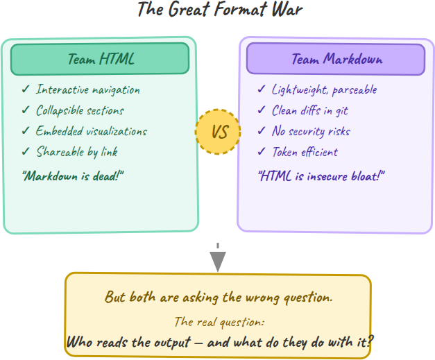
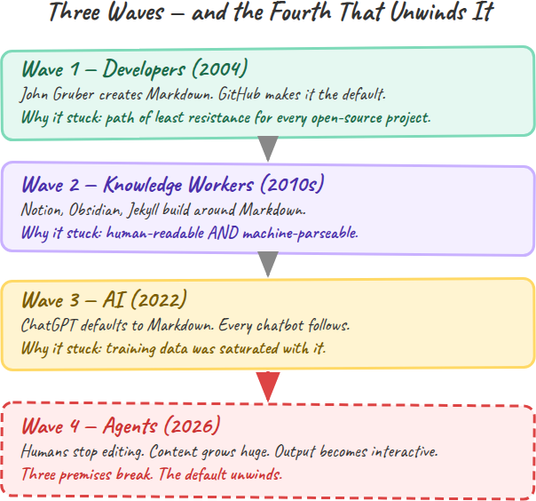
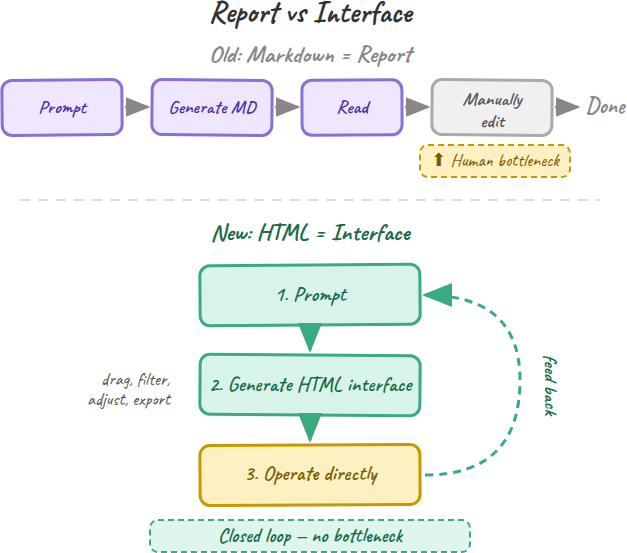
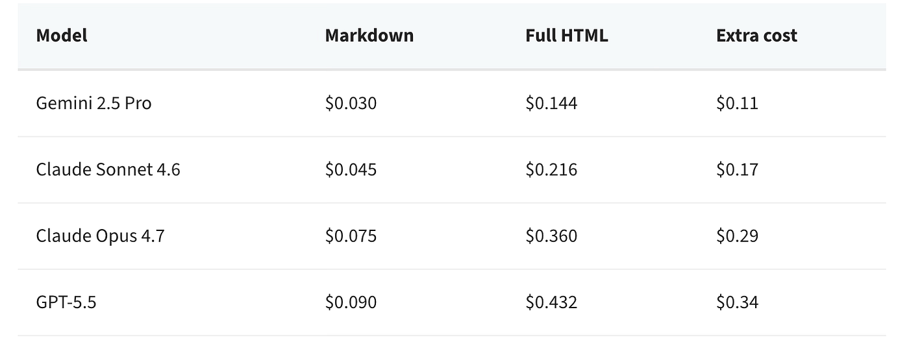
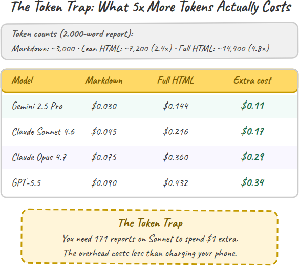
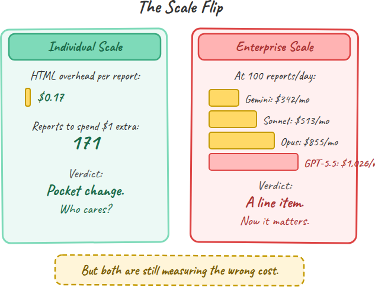
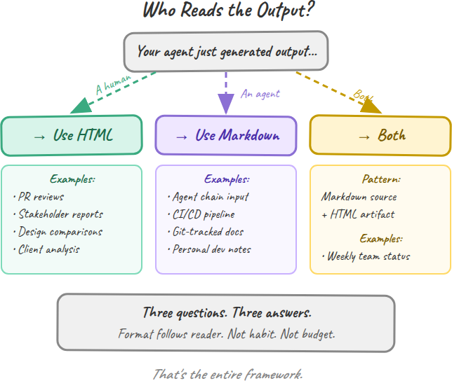
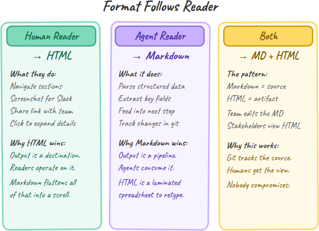
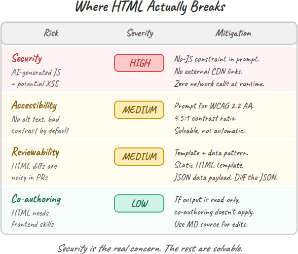
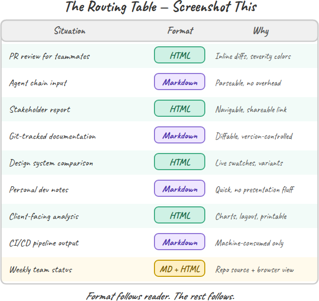

> 作者：Yanli Liu
> 发布日期：2026 年 5 月（2 天前）
> 原文链接：https://generativeai.pub/anthropics-engineer-said-kill-markdown-here-s-what-he-actually-meant-36bee00c0ca2

# Anthropic 工程师说"杀掉 Markdown"，他真正想表达的是什么

## HTML vs Markdown：两个阵营都缺的那棵决策树

*图片：[Olia Gozha](https://unsplash.com/@olia?utm_source=medium&utm_medium=referral) 摄于 [Unsplash](https://unsplash.com/?utm_source=medium&utm_medium=referral)*

上周，Claude Code 的工程负责人告诉开发者们停止输出 Markdown。互联网为此炸开了锅。

Thariq Shihipar，Anthropic 旗下 Claude Code 的工程负责人，发表了 [《HTML 的不合理有效性》](https://thariqs.github.io/html-effectiveness/)，附上了 20 个可运行的示例。他的论点是：Markdown 是 token 稀缺时代的遗物。HTML 能带来交互式导航、可折叠区块、内嵌可视化以及可分享的链接。

这篇文章在 16 小时内获得了 440 万次浏览。

反应来得又快又部落化。一夜之间分成了两个阵营。

HTML 派宣布 Markdown 已死。他们指向 Thariq 的示例：带颜色编码严重程度（color-coded severity）的代码评审、带可折叠区块的利益相关者报告、带可点击实时色卡（live swatches）的设计系统。"一份你只会滑过去的 Markdown 文件，等于不存在的文件。"

Markdown 派立刻反击。AI 生成的 JavaScript 带来的安全风险。代码评审中嘈杂的 diff。蚕食 API 预算的 token 开销。"HTML 是在牺牲源文件可读性、安全性和可评审性的代价下，追求视觉光鲜。"

两边都错了。不是全错，而是错在了关键点上。

HTML 派方向是对的，但忽略了成本。他们对 3 至 5 倍的 token 开销轻描淡写，跳过了 AI 生成 JavaScript 的安全影响，也从未提及 Anthropic 直接从这次切换中获利（更多 token 意味着更多收入）。

Markdown 派把风险讲清楚了，但他们在解决一个早已过期的问题。他们仍在为那种"GPT-4 还只有 8,000 token 上下文窗口（context window）"时代的预算做优化。如今上下文窗口已经达到 100 万 token。约束消失了，习惯却还在。

真正的问题从来不是 HTML 还是 Markdown，而是更简单的一个：谁在读这份输出，他们打算拿它做什么？

要理解为什么这个问题比格式之争更重要，你得先看清 Markdown 是怎么走到今天的。它成为默认选项并不是偶然，它乘上了三波浪潮。

## 三波浪潮，一个默认选项

Markdown 没有赢得格式之战。它只是在合适的时间一次次出现而已。

第一波是开发者。John Gruber 在 [2004 年创造了 Markdown](https://daringfireball.net/projects/markdown/)，作为一种可读的纯文本写法，可以转换成 HTML。它本是博主的便利工具。后来 GitHub 把它用于 README、issue 和文档。一夜之间，地球上每一个开源项目都在写 Markdown。不是因为它最好，而是因为它是阻力最小的路径。

第二波是知识工作者。整个 2010 年代，Notion、Obsidian 和 Jekyll 这类工具把整套编辑体验都搭建在 Markdown 之上。它成了 wiki、笔记、静态站点的默认格式。吸引力一脉相承：既适合人读，又适合机器解析。你可以在任何文本编辑器中写它，在任何地方渲染它。

第三波是 AI。2022 年 11 月 ChatGPT 上线时，它以 Markdown 渲染回复。不是因为 OpenAI 经过严密评估后选择了它，而是因为训练数据里到处都是它：GitHub 仓库、技术文档、wiki、博客文章。Markdown 是模型见得最多的格式，所以也是模型最常产出的格式。从那以后，每一个聊天机器人都沿用了同样的默认设定。

三波浪潮。每一波都强化了上一波。从来没有人是为 AI 输出而选择 Markdown 的，它是接班来的。

这种"接班"恰恰是问题所在。因为 Markdown 被设计出来时所面对的世界，和我们正在构建的世界，是根本不同的。Markdown 内嵌的三个假设正在同时崩塌。

## 三个前提正在崩塌

Markdown 成为 AI 输出的默认格式，建立在三个假设之上。在 2022 年这三个假设都说得通。到 2026 年没有一个还成立。

**前提 1：人类手动编辑内容。** Markdown 是为那些自己写自己改的人设计的。博客、文档、README 至今仍是这样工作。但智能体（agent）输出不同。你发出一个提示词，智能体生成一份 2,000 字的分析、一份代码评审、一份项目计划。你读它，也许把它分享出去。你几乎不会打开编辑器去重写其中的段落。这种格式的核心价值主张——便于手动编辑——已经不再匹配当下的使用场景。

**前提 2：内容很小。** 一篇 500 字的博客在 Markdown 下渲染得很好。一份 3,000 字、包含架构决策、权衡表格和代码样例的、由智能体生成的实施计划则不然。一旦超过大约 100 行，Markdown 就变成一堵文字墙。没有导航、没有可折叠区块，没法直接跳转到你关心的部分。Thariq 的观察很直白："超过 100 行的 Markdown 文件，没人真的会读。"

**前提 3：输出是只读的。** 旧工作流是线性的：发提示、生成、阅读、关闭。但智能体时代正把工作流推向不同的方向。用户希望与输出交互：筛选表格、调整参数、并排比较选项、导出子集、把结果反馈到下一次提示。Markdown 承载不了交互，它是一条单行道。

当这三个前提同时崩塌时，格式问题也随之改变。它不再是"哪种格式更高效？"，而是"哪种格式最匹配读者实际会做的事？"。

Markdown 是一份报告。你读完就关掉。

HTML 是一个界面。你在上面操作，并把结果传到下一步。

这个区分比任何 token 成本计算都更重要。但既然 token 成本是大多数人争论的焦点，那就让我们把账算清楚。

## 没人算过的 token 账

HTML 与 Markdown 之争围绕的是一个论断：HTML 的 token 成本高出 3 至 5 倍。这个数字被反复引用，几乎没人核对过它在真实美元上意味着什么。

我做了测试。同一份 2,000 字的报告用三种格式生成：纯 Markdown、精简的语义 HTML，以及带 CSS 样式和内嵌 SVG 的完整 HTML。token 数量如下：

- Markdown：约 3,000 个输出 token
- 精简 HTML：约 7,200 个输出 token（2.4 倍）
- 带 CSS 的完整 HTML：约 14,400 个输出 token（4.8 倍）

你看到的"3 到 10 倍"这个区间是真实的。对于带样式和交互的富 HTML，你大约要烧掉 5 倍的 token。下面是按当前 API 定价，每份报告的实际成本：

在个人层面，这点开销不过是零钱。在 Claude Sonnet 上你需要生成 171 份报告才能多花 1 美元。单份报告中 HTML 多花的 token 成本，比给你正在用来读这篇文章的手机充电的电费还低。

我把这称为 **token 陷阱（The Token Trap）**：为一项在你真实工程预算中只算误差范围的成本做优化。

但这笔账还有第二幕。把规模放大，数字就会反转。

每天 100 份报告的话，开销就实在了。Claude Sonnet：每月多花 513 美元；GPT-5.5：每月 1,026 美元。这就不再是误差，而是一条预算明细。

所以 Markdown 派在企业规模上有道理。但他们衡量的仍是错误的成本。

问题不是 token 值多少钱，而是人类注意力值多少钱。一位资深工程师的时薪是 75 到 150 美元。花 15 分钟去解析一堵本该是可导航 HTML 页面的 Markdown 文字墙，相当于消耗 19 到 38 美元的工程师时间。同一份报告的 token 开销呢？在 Sonnet 上是 0.17 美元。

token 陷阱在两个方向上都起作用。个人在 0.17 美元的事情上浪费时间争论。企业为节省几百美元的 token 成本，浪费数千美元的工程师注意力。两种情形下，格式决策都应该跟随读者，而非跟随预算。

## 决策树：谁在读这份输出？

如果格式跟随读者，你就得知道你的读者是谁。每份智能体输出都有三类受众之一。格式选择直接随之而定。

**读者 1：人类。** 你的利益相关者打开浏览器，扫到他们关心的那一节，截一张图发到 Slack，把链接分享给团队。这就是 Thariq 围绕其构建 20 个示例的使用场景。带行内注释和严重程度颜色的代码评审。带可折叠架构区块的实施计划。带可点击实时色卡的设计系统对比。

HTML 在这里胜出，因为输出本身就是目的地。读者要在上面导航、操作、分享。Markdown 把这一切压扁成一次滚动。

**读者 2：另一个智能体。** 你的输出馈入下游管道。一个智能体读取分析、抽取结构化数据、做出决策、触发下一步。从头到尾没有人类会看。这是 Markdown 仍然干净胜出的场景。它轻量、可解析、可 diff。Git 跟踪变更，CI 管道处理它，其它模型以最小的 token 开销消费它。

把 HTML 用于智能体之间的通信，就像把电子表格打印出来、塑封一遍，再交给一个准备重新把数字敲一遍的人。

**读者 3：两者皆是。** 这是最常见的情形，也是两边都没正面回应的那一种。一名开发者生成一份 PR 评审。他自己要读，同时还希望它被仓库追踪。一位团队负责人生成一份每周状态报告。利益相关者在浏览器里查看，数据则要喂给下周的规划提示。

针对这种情况的答案是：**Markdown 作源文件，HTML 作产物（markdown source, HTML artifact）**。把 Markdown 留作可编辑、可 diff、受 git 追踪的事实源；为需要阅读、导航和分享的人生成一份 HTML 伴随产物。Thariq 自己也这么建议："在仓库中保留 Markdown 作为可编辑的源文件，生成 HTML 作为面向利益相关者评审的伴随产物。"

决策树就是三个问题。人类要读它吗？用 HTML。只有智能体要读吗？用 Markdown。两者都要读吗？Markdown 源文件 + HTML 产物。整个框架就这么简单。

## 它会在哪里失灵（以及谁是获益方）

决策树是干净的。真实世界不是。在你重写 CLAUDE.md 把默认值改成 HTML 之前，下面这些是 Markdown 派说对了的风险。

**安全是真正值得担心的一项。** AI 生成的 HTML 可能包含 JavaScript。JavaScript 意味着潜在的 XSS 漏洞、本地数据泄漏，以及你并未要求的代码执行。有一位批评者说得很尖锐："运行未经审查的、AI 生成的 JS，会带来 XSS 或本地数据泄漏的风险。"这不是空想。如果你为内部工具生成 HTML，就需要一个评审步骤，或者在提示词里硬性约束"无 JS"。Thariq 自己的指引就要求：禁止外部 CDN 链接、禁止 unpkg 导入、只用系统字体、运行时零网络调用。

**可访问性是可以解决的，但不是自动的。** AI 生成的 HTML 默认并不符合 [WCAG](https://www.w3.org/TR/WCAG22/)。没有 alt 文本，焦点顺序不一致，文本对比度过低。你必须在提示词里明确要求："符合 WCAG 2.2 AA、描述性的 alt 文本、4.5:1 的颜色对比度、合乎逻辑的焦点顺序。"大多数开发者不会这么做。这是一道缺口，不是死结。

**可评审性需要的是一种模式，而不是换个格式。** HTML 的 diff 很嘈杂。一行内容的修改可能因为周围标签的位移产生 50 行 diff。对依赖 PR 评审的团队而言，这是真实的摩擦点。缓解办法是 **模板加数据（template-plus-data）** 模式：保持 HTML 模板静态，把可变内容存进一个 JSON 负载，仅对 JSON 做 diff。版本控制干净，视觉输出依然丰富。

接下来是大多数英文报道跳过的部分：谁是这次转变的获益方？

Anthropic 是获益方。HTML 输出比 Markdown 多消耗 3 至 5 倍的 token。更多 token 意味着更多 API 收入。HTML 还带来生态锁定：一旦你的团队围绕 Claude 生成的交互式仪表盘和报告搭起工作流，换到另一个模型就意味着重建这些工作流。这不是阴谋论，而是商业模式。它并不会让 Thariq 的论点失效，但你在整体采纳这条建议之前，应该先知道这套激励结构。

我还没见过企业规模上对 AI 生成 HTML 的安全审计，也没见过可访问性合规研究。在合适的使用场景中，HTML 的论点是站得住脚的，但配套工具与护栏仍在追赶愿景。

## 周一就改起来的清单

下面是路由表。截图保存。

| 场景 | 格式 | 原因 |
|---|---|---|
| 给团队同事看的 PR 评审 | HTML | 行内 diff、严重程度颜色、可折叠的文件区块 |
| 智能体链路的输入 | Markdown | 可解析、轻量、无渲染开销 |
| 利益相关者报告 | HTML | 可导航、可通过链接分享、便于截图发到 Slack |
| Git 追踪的文档 | Markdown | 可 diff、可评审、受版本控制 |
| 设计系统对比 | HTML | 实时色卡、可交互的组件变体 |
| 个人开发笔记 | Markdown | 快、可编辑、无展示开销 |
| 面向客户的分析 | HTML | 专业的版面、内嵌图表、可打印 |
| CI/CD 管道输出 | Markdown | 由机器消费，没有人类会读 |
| 每周团队状态 | Markdown 源文件 + HTML 产物 | 团队在仓库里编辑，利益相关者在浏览器里查看 |

Markdown 没死。它在被提拔。从展示层提到了协议层。它一直就更适合作为机器可读的格式，而不是人类可读的格式。智能体时代只是把这一点摆到了明面上。

HTML 也不是一切的未来。它是那种人类真的需要阅读、导航并据此行动的输出的未来。

如今真正重要的技能，不是挑出正确的格式，而是了解你的读者。其余的，自会跟上。

---

## 延伸阅读

- [OpenAI Quietly Told You to Throw Away Your Prompt Stack](https://ai.gopubby.com/openai-quietly-told-you-to-throw-away-your-prompt-stack-ef1178f2e5ec?source=post_page-----36bee00c0ca2---------------------------------------) — Anthropic 说的是同一件事。提示词的三个时代，以及最聪明的模型真正想要你做什么。
- [The 4 Lines Every CLAUDE.md Needs](https://levelup.gitconnected.com/the-4-lines-every-claude-md-needs-2717a46866f6?source=post_page-----36bee00c0ca2---------------------------------------) — Karpathy 诊断出了什么，6 万名开发者收藏了什么，以及为何行为约束胜过功能清单。
- [Harness Engineering: What Every AI Engineer Needs to Know in 2026](https://ai.gopubby.com/harness-engineering-what-every-ai-engineer-needs-to-know-in-2026-0ab649e5686a?postPublishedType=repub&source=post_page-----36bee00c0ca2---------------------------------------) — 三个阵营、三种架构，以及 Opus 4.7 刚刚就这三者证明了什么。

---

> 本文发布于 [Generative AI](https://generativeai.pub/)。在 [LinkedIn](https://www.linkedin.com/company/generative-ai-publication) 上联系我们，关注 [Zeniteq](https://www.zeniteq.com/) 以获取最新 AI 文章。
>
> 订阅我们的 [newsletter](https://www.generativeaipub.com/) 与 [YouTube](https://www.youtube.com/@generativeaipub) 频道，了解生成式 AI 的最新动态。
