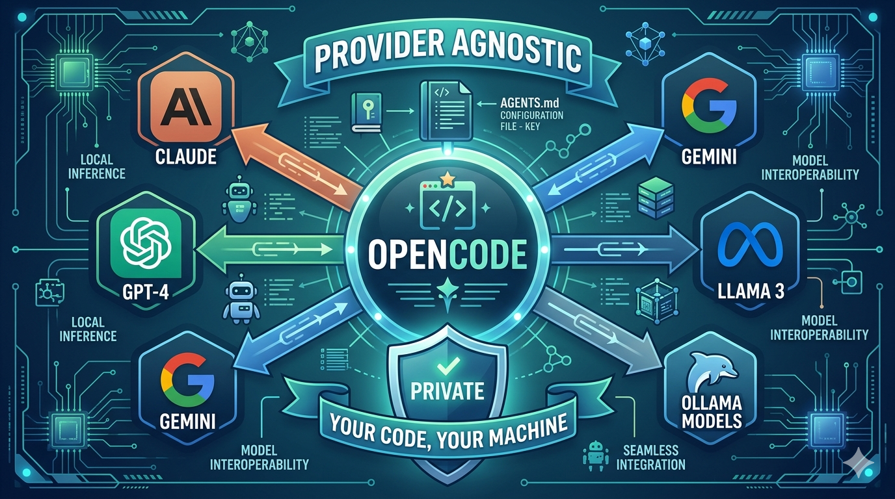
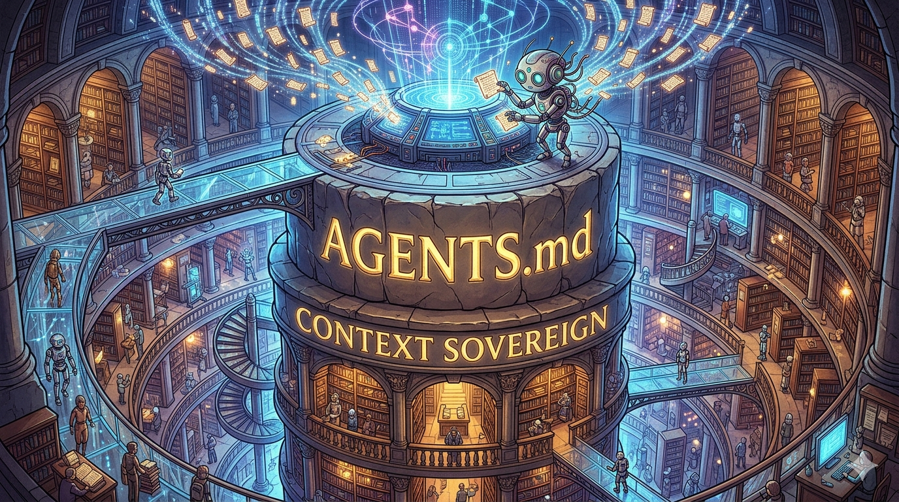
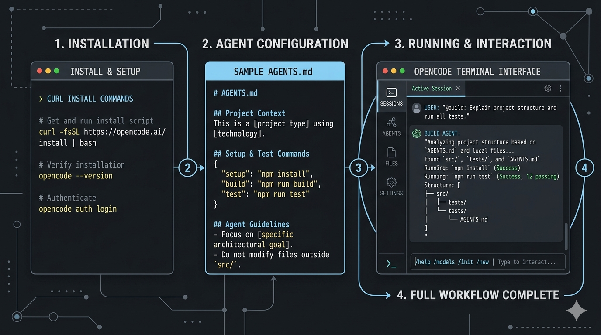
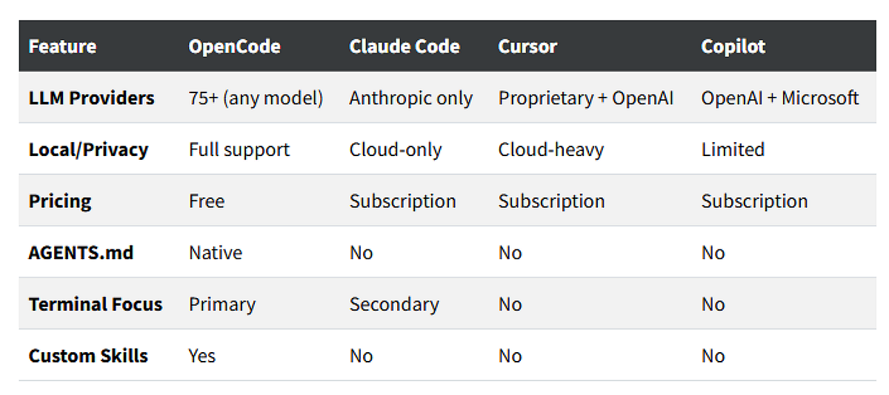
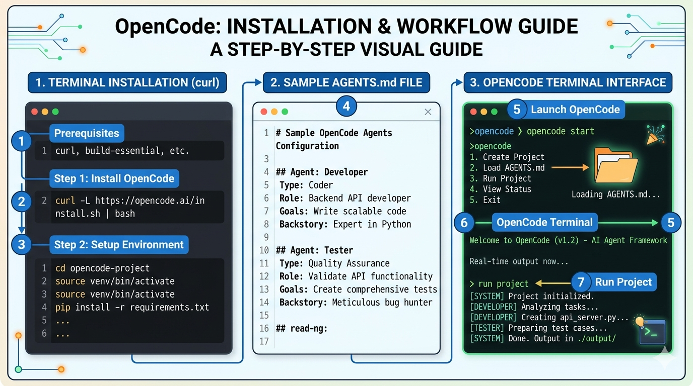
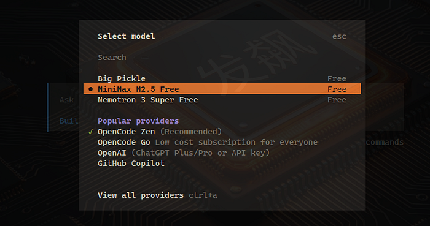
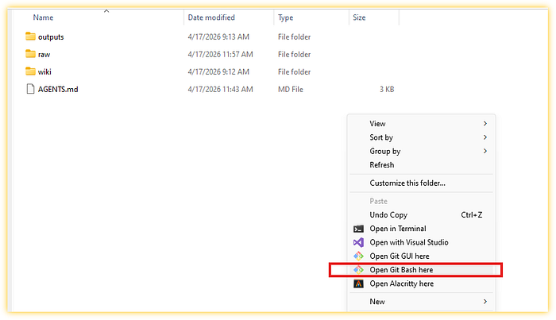
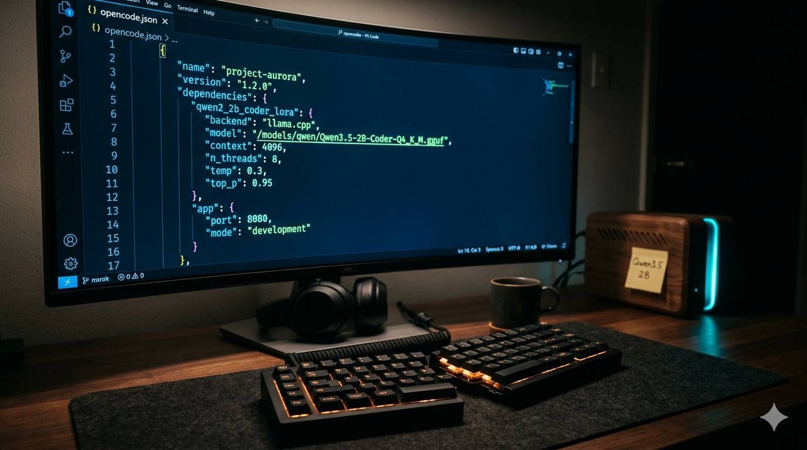

> 作者：Fabio Matricardi
> 发布日期：2026-05-01
> 原文链接：https://medium.com/artificial-intel-ligence-playground/opencode-is-the-linux-of-agents-and-thats-the-entire-point-05ec2194ff9e

# OpenCode 是「智能体的 Linux」：这恰恰是它的全部意义

## 上下文的主权者：为什么 AGENTS.md 是 LLM 的新秘诀



我在 AI 编程工具领域待得够久，看得出其中的套路。每隔几个月就会冒出一款「革命性」的新工具，配上一段炫目的演示视频和一道订阅付费墙。

Claude Code 在这边，Cursor 在那边，Copilot 哪里都有。不知怎么的，我们都被期待着要感激这些公司在「让 AI 普惠化」。

实话实说：我们是这场叫作生成式 AI（Generative AI）大型实验里的小白鼠。大厂发布连他们自己也搞不清楚用途的花哨工具，然后告诉我们……

让我们看看你能拿它做什么吧！

他们需要我们来证明这些东西的价值。

简单说，负担被外包了……外包给了你！我们都被征召成了产品测试员。

没有人问过你愿不愿意干这份活。但忽然之间，搞清楚怎么把 AI 用到生活里就成了你的责任。你被期待去做这些事：

把提示词改写五遍，直到 AI「领会」你的意思。
手动核对它说的每一句话（毕竟它幻觉起来像个失眠的诗人）。
把三种不同的 AI 工具拼接起来，只为完成一项简单任务。

这不是创新。这只是单纯让人筋疲力尽


没人告诉我们的是：我们其实并不掌握主动权。这些工具中的每一款都替你决定能用哪个模型、你的代码放在哪里、AI 记得你项目的哪些信息。你租住的不过是一只挂着漂亮窗帘的笼子。

这就是为什么我发现 [OpenCode](https://opencode.ai/) 时差点从椅子上跳起来。不是因为它完美（它远谈不上完美），而是因为它代表了我从第一款 AI 编程助手发布以来一直渴望的东西：所有权（ownership）。

让我解释一下我说的「智能体外壳（agent harness）」是什么意思，为什么 OpenCode 配得上「智能体的 Linux」这个称号，以及如果你在意隐私、灵活性，或仅仅是不愿被困在又一个生态系统里，这件事为何重要。

TL;DR
智能体外壳把 AI 模型连接到真实工作（文件访问、终端、记忆）
OpenCode 是一款开源外壳，支持 75 余家提供商、本地优先的隐私设计、以及 AGENTS.md 体系
它免费，运行在你的终端里，把代码留在你的机器上
开箱即用自带 3 个免费模型
代价：比闭源工具配置更繁琐，但你拥有完整所有权
如果你在意隐私、灵活性，或者只是不想再多一份订阅……这就是出路



## 改变我看法的那一刻

老实说：我并不是一上来就「领悟」了 OpenCode。第一次有人提起它时，我心想，又一款 AI 编程工具？算了吧。

我当时正深陷 Claude Code 阶段的研究。订阅、VS Code 扩展、整套仪式我一样不缺。它用得很顺手。但有一处痒处我始终挠不到：

每开一个新项目，我都得把整个技术栈重讲一遍。LLM 对我的约定、文件结构、对某些写法的怪癖偏好一无所知。更糟的是：一旦我停止付费，它「学到」的一切就一笔勾销。瞬间归零。

后来我偶然看到一篇博文提到 [OpenCode 的 AGENTS.md](https://opencode.ai/docs/agents/) 功能。前提很简单：你在项目根目录放一个文件，AI 会像读说明书一样读它。再也不用复述自己。再也不浪费上下文窗口（context window）去解释项目设置。

等等，我心想。这不应该是显而易见的吗？为什么不是所有人都这样做？

那一刻我才意识到（虽迟但到）：大多数工具不希望你拥有自己的上下文。它们希望你依赖它们的云。

[OpenCode](https://opencode.ai/) 不一样。

注：从此往下，每当你看到与 Claude Code 或 Codex 相关的内容，都可以把同样的原则与结构套到 OpenCode 上。主要差别在于：CLAUDE.md 改名叫 AGENTS.md。

## 那么「智能体外壳」到底是什么？

在继续之前，让我们先把概念对齐。你一直听到「外壳（harness）」这个词被到处使用，但它到底是什么意思？

可以这样理解：模型（Claude、GPT-4、Llama，无论哪一个）是大脑。它能思考、能推理、能写代码。但它自己什么都做不了。它读不了你的文件，跑不了终端命令，记不住五分钟前发生过什么。

外壳是身体。它是给模型提供以下能力的支架：

文件访问 ➡️ 在你需要的地方读写
终端执行 ➡️ 跑命令、跑测试、跑构建
上下文管理 ➡️ 决定哪些放进提示词，哪些忽略掉
记忆 ➡️ 在多次会话之间保留状态
安全 ➡️ 通过权限阻止它做出愚蠢（或恶意）的举动

2026 年大家都在用的公式很简单：

智能体（Agent）= 模型（Model）+ 外壳（Harness）

这是一次真正的转变。它意味着你不再被锁定在某一家供应商的「整体方案」里。你可以在保留身体的同时换掉大脑。可以为了隐私跑本地模型，再切到 API 获得更强算力，而不必去学一款新工具。

OpenCode 就是这样一款外壳……但带了一点我们稍后会谈到的转折。

## OpenCode 为何配得上「Linux」这个标签

关于 Linux 有一点很有意思：它不是最炫目的操作系统，也不是最精致的。但它无处不能跑、允许你掀开引擎盖看个清楚，没人能告诉你它能用来做什么、不能用来做什么。

OpenCode 就是把这套哲学搬到了 AI 编程智能体上。

😂 顺带一提，opencode 在所有操作系统上都跑得很好，这里说 Linux 只是个标题。

让我逐条拆解：

### 1. 与提供商无关（75 余款模型，还在增加）

OpenCode 不在乎你用哪个 LLM。Claude？GPT？Gemini？通过 Ollama 跑在自家机器上的本地 Llama？以上皆可。

不像 Claude Code（仅 Anthropic）或 Copilot（仅 OpenAI/Microsoft），OpenCode 把模型当成可互换的零件。你在一个 JSON 文件里配置 provider，或者用 [Bifrost-CLI](https://medium.com/stackademic/bifrost-cli-is-the-ai-gateway-for-coding-agents-we-were-waiting-for-8543a2ddd57a) 配置，就可以开工了。

对像我这样不断给小模型做基准、测试量化策略、把消费级硬件能跑的模型推到极限的人来说，这就是一切。

```json
{
  "provider": {
    "ollama": {
      "npm": "@ai-sdk/openai-compatible",
      "options": {
        "baseURL": "http://localhost:11434/v1"
      },
      "models": {
        "qwen2.5-coder:3b": {
          "name": "Qwen 3.5 2B Local"
        }
      }
    }
  }
}
```

这就是用本地模型所需的全部配置。没有云依赖，没有 API 账单。只有你的硬件和你的代码。你的 AI，你的规则。

### 2. 隐私优先设计（你的代码归你所有）

这是 OpenCode 真正与众不同的地方。大多数 AI 编程工具会把你的代码上传到云上，它们的工作机制就是如此。你的上下文是在别人服务器上处理的。

OpenCode 呢？默认零遥测（telemetry）。除非你显式配置，否则你的代码绝不会离开你的机器。配合本地模型，你完全可以离线使用。

对那些处理专有代码、敏感项目的开发者，或任何在意隐私的人来说，这非常关键。我曾在保密协议明令禁止使用云端 AI 工具的客户项目中用过它。OpenCode + Ollama 是我的救命稻草。



### 3. AGENTS.md 革命

还记得我说这个功能让我注意到 OpenCode 吗？让我再讲深入一点。

AGENTS.md 是一个你放在项目根目录里的文件。它包含 AI 需要知道的一切项目信息：

你用的语言/框架
你的代码约定
文件结构概览
具体的智能体行为或约束

```markdown
# AGENTS.md
## Project Context
- This is a Python FastAPI project
- We use SQLAlchemy for database operations
- Tests are in `tests/` using pytest
## Conventions
- All async functions use `async def`
- Error responses follow `ErrorResponse` schema
- Use type hints everywhere
## Agent Behavior
- Always run tests before committing
- Never modify more than 5 files in one session
- Ask before running destructive commands
```

第一次用这个东西的时候，我差点哭出来。给 AI 助手解释技术栈解释了五年，然后这里来了一份简单的文本文件，把问题解决了。

而美妙的地方在于：AGENTS.md 是可移植的。它就是一个 Markdown 文件。可以纳入版本控制，可以与团队共享，可以按项目定制。智能（intelligence）属于你，而不是工具。

### 4. 技能体系（按需加载的模块化能力）

OpenCode 有一套「技能（skill）」系统，让你在需要时加载特定能力。可以把它理解为插件，但更简单。

要做一次 git 发布？有对应的技能。数据库迁移？也有对应的技能。你在 SKILL.md 文件里定义技能，OpenCode 动态加载它们。

这让核心工具保持轻量，同时允许你按自己的方式扩展。只加载你需要的能力。

### 5. 终端优先（开发者真正干活的地方）

OpenCode 活在终端里。不是 Web 界面，不是浏览器内 IDE。是命令行。

这一点比你想象的更重要。终端是[我 90% 的编程时间](https://medium.com/artificial-intel-ligence-playground/that-blinking-cursor-just-saved-your-favorite-old-and-blurry-photo-baa5043d36f6)所在的地方。这里跑构建脚本，这里执行 git 操作，真正的工作在这里发生。让 AI 智能体直接走到这里来，而不是逼我进入 GUI，感觉相当自然。

👉 提示：Windows 系统的用户，我强烈建议使用 Git Bash 终端。智能体喜欢按 Linux 风格执行命令，PowerShell 在 80% 的情况下都会失败！

它有一个 TUI（Terminal User Interface，终端用户界面）用于交互式会话，也有一个 CLI 用于一次性命令：

```
opencode run "refactor this function to use async/await"
```

简单又快。

## 数字不会说谎

OpenCode 不是一个没人用的小众项目。看看正在发生的事：

GitHub stars 17.9 万以上（虽然原仓库已于 2025 年 9 月归档，下文会展开）
870 位贡献者在维护和构建项目
截至 2026 年月活 650 万
桌面端 beta 已在 macOS、Windows 和 Linux 上提供

作为参照：Claude Code、Cursor 和 Copilot 都广为人知。但 OpenCode 这种社区驱动的增长在 AI 编程领域是前所未有的。

## 对比（你肯定会问）

OpenCode 与几大头部产品对比如下：



代价是什么？OpenCode 在某些 API 调用上 token 效率不高（你没在使用提供商优化过的集成）。配置开销也比 Cursor 这类「魔法盒子」要多。

考虑到最近 Anthropic 削减旗舰模型推理配额、且未能高效利用 KV 缓存所引发的种种抱怨，Claude Code 正在变成一款小众产品（即使依然强大）。

但如果你在意所有权、灵活性、本地运行，那么选择是明确的。

而如果你把 Bifrost-CLI 用作外壳的配置器，再配上它自己的网关，这些门槛几乎可以全部消除。

## 值得一提的同类工具

OpenCode 不是「主权智能体（sovereign agent）」领域的唯一玩家。下面是其他几位也在为同一阵营战斗的：

[Aider](https://aider.chat/)：Git 原生的 CLI 智能体，与版本控制集成出色
[Cline](https://cline.bot/)：基于终端，支持 10 余家提供商，专注成本管理
[Continue.dev](https://www.continue.dev/)：面向开放 LLM 的 IDE 扩展，专注自动补全
[OpenHands](https://openhands.dev/)：前身是 OpenDevin，能自主修复 GitHub issue
[Agno](https://github.com/agno-agi/agno)：轻量极简，避开 LangChain 的臃肿

每个都各有所长，但 OpenCode 在提供商灵活性、AGENTS.md 与隐私优先设计上的组合，让它成了我每天的主力。



## 上手（轮到你了）

理论讲够了。我们来构建你自己的主权知识库。我们将用 OpenCode 作为外壳，并使用安装时自带的免费模型（共 3 个）。



注：如果你想了解如何用 llama.cpp 作为本地引擎、确保数据完全留在你的机器上，可以阅读系列「LLM-wiki」中的文章（链接在文末）。

### 1. 基础（Windows 设置）

在 Windows 上，管理 AI 工具最便捷的方式是通过 Chocolatey。以管理员权限打开 PowerShell 并运行：

```powershell
# PowerShell
# Install OpenCode and Git
choco install opencode git -y
# Refresh your environment variables
refreshenv
```

更多关于 [Chocolatey 的内容看这里](https://medium.com/ai-advances/chocolatey-for-python-ai-enthusiasts-how-to-turn-windows-into-your-in-house-developer-3d05c30bcdd2)。

👉 提示：虽然你也可以用 PowerShell，但大多数 AI 智能体更习惯运行类 Unix 命令。我强烈建议把 Git Bash（上面的安装包里已包含）当作主终端，避免命令解析错误。

### 2. 准备你的「数字办公室」

新建一个根目录（比如 `C:\My-project`），打开智能体之王：opencode。

在你的项目目录里打开 Git Bash（记得我们把它叫作 `C:\My-project`）。



进入 Plan 模式（TAB 键），开始描述你想构建什么、目录与文件如何组织更合适。

当 LLM 给出一个清晰的、对你而言细节充分的计划后，切到 Build 模式（TAB 键），回答 yes 进入实施阶段。

👉 记住：在 Plan 模式下，opencode 不能改动你的任何文件！

opencode 会在你的根目录里创建一个 AGENTS.md 文件。这是你的「老板」文件，或者说标准操作流程。这个文件告诉智能体如何处理你的项目。


## 更宏观的图景

我真正兴奋的是 OpenCode 所代表的趋势：从「模型即产品」转向「外壳即基础设施」。

我们花了多年争论哪个模型「最好」。Claude 对 GPT。Sonnet 对 Opus。Qwen 对 Llama。但真正的战场正在转入地下，转向把这些模型连接到你工作流的那一层。

OpenCode 看懂了这一点。它不试图成为最聪明的模型，而是要成为最好的胶水：让任何模型都能按你的方式为你所用的那一层。

这就是 Linux 哲学。它如此透明，以至于你可以拿它做任何事：你说了算！

## 这件事为什么重要（特别是对我们这群「Poor-GPU 党」）

我从不掩饰自己的处境：49 岁，用一台 2016 年的笔记本（带集成显卡）跑 AI 实验。没有 GPU，没有云预算。只有决心和过盛的好奇心。

多年来，AI 编程工具行业当我这种人不存在。每一个演示展示的都是把代码送到远端服务器处理的云方案。许多「免费」额度需要信用卡验证，或者每天的请求次数被限死。每一个「本地」方案都要求我买不起的硬件（CPU 上速度尚可、值得一提的大概只有 qwen3.5–0.8b，但它在配合智能体时不算精准）。

OpenCode 彻底改变了这本账。

我第一次在自己那台寒酸的机器上跑通 OpenCode + llama.cpp 服务时，用的是 Qwen3.5–2b（20 亿参数）。按业界标准这是个微型模型，远不及 Anthropic、OpenAI 用的 700 亿参数级别的庞然大物。但你知道吗？它管用。

不是次次完美，也不是次次都行（毕竟 2B 的体量摆在那里）。但已经足以做到：
- 解释我不熟悉的代码库
- 重构那些我懒得手动碰的函数
- 生成测试用例，节省了我数小时
- 帮我理解陌生的 API

重点不是说小模型能取代 Claude 或 GPT，而是说你不需要最贵的选项也能高效干活。你需要的是适合自身约束的工具。

OpenCode 把这种选择权交给了你。在 CPU 上跑一个微型量化模型，硬件好的时候跑一个更大的，根据手头工作来回切换。是你说了算，不是订阅档位说了算。

👉 提示：我通常用大模型（就是我经常提的那些免费的）来搭骨架、写 AGENTS.md、定义命令和技能。完成后再切换到 llama.cpp 上的本地模型。


## 行业在关注（哪怕嘴上不承认）

有意思的是：在 OpenCode 不断累积关注的同时，巨头们也开始注意到了。

Cursor 增加了更多 provider 选项。GitHub 扩展了 Copilot 的模型选择。Anthropic 也开始更多谈论「混合」部署。仿佛它们意识到了市场正在转向。

「外壳即基础设施」的范式正在成为新标准。因为这里有一条业内没人愿意公开承认的真相：单纯靠模型质量已不再是可持续的护城河。

人人都能通过 API 接到 Claude（付费）。人人都能用 ChatGPT（付费）。差异在于体验：模型如何与你的工作流连接，它对你项目了解多少，你掌握多少控制权。

而这正是 OpenCode 抓住的关键。当其他人都在争谁的模型最聪明时，OpenCode 造好了模型与开发者之间最好的那座桥。


## 真实案例：LLM-wiki 的实现

让我给一个具体的、我用 OpenCode 节省时间的例子。

我用这套配置来整理自己的研究。多年来，我关于 AI 量化与「灾难性遗忘（catastrophic forgetting）」的笔记零散到几乎无用，因为每次需要的时候我都找不到合适的关联。

这是我对 A. Karpathy 的 LLM-wiki 项目的个人实现，我在前一个系列里已介绍过。

[超越灾难性遗忘：如何为长跑构建 LLM-Wiki](https://medium.com/artificial-intel-ligence-playground/beyond-catastrophic-forgetting-how-to-build-an-llm-wiki-for-the-long-game-8cea92f3868c)
一份指南，教你用 Python、智能体和一点……把零散的 PDF 变成一个可累积的个人知识库

medium.com

我没有只是「跟模型聊天」，而是把 OpenCode 指向了我的 `AGENTS.md` 和装满技术论文的 `/raw` 目录。我用了一条自己写的自定义命令 `//wiki-list`，来查看所有还未处理的内容。

**工作流：**

我把三份关于「KV-cache 量化」的新 PDF 丢进了 `/raw`。
我对 OpenCode 说：「Process the new files.」
智能体——以「图书管理员（Librarian）」的角色——并没有只是做摘要。它打开了我 `/wiki` 目录下已有的 `Llama_CPP_Optimization.md`，把新发现追加进去，构建出一份不断累积的知识记录。

**结果：** 因为我用 llama.cpp 在本地运行，即便上下文窗口巨大，也没花一分钱的 API token 费用。更重要的是，下一次我开始一个新项目时，不必「重新教」AI。我只要说「读一下 wiki 页面」，它就立刻能跟上节奏。

它把我从「按次租用」智能升级成了「拥有」一个不断成长的数字大脑。



## 真正可用的配置

前面我一笔带过、但值得多说几句的，是 OpenCode 的配置体系。它基于 JSON、声明式（declarative），上手以后会发现意外地强大。

👉 还记得我提过把我的 llama.cpp 服务器跑在那台只用来供 Qwen3.5–2B 的、低配的 MiniPC 上吗？

下面是我本地开发实际使用的配置：

```json
{
  "$schema": "https://opencode.ai/config.json",
  "provider": {
    "ollama": {
      "npm": "@ai-sdk/openai-compatible",
      "options": {
        "baseURL": "http://localhost:11434/v1"
      },
      "models": {
        "qwen3.5": {
          "name": "Qwen 3.5 2B Local"
        },
        "gemma4": {
          "name": "Gemma 4 E2B Local"
        }
      }
    }
  },
  "agent": {
    "default": "build",
    "timeout": 300000
  }
}
```

来自我自身经验的几条建议：

从小模型起步。Qwen3.5–2b 这种小体量模型在它的尺寸下能力强得出乎意料。Gemma-4-E2B 也是一个稳妥的选择。
使用项目级配置。不要全局配置，把 `.opencode/opencode.json` 放在每个项目里。这样可以按项目定制。你甚至可以直接放到项目根目录！
给模型起清晰的名字。在 UI 中选择时，「Qwen 3.5 2B Local」比「qwen3.5–2b」更容易记。

## 常见陷阱（避免你也踩进去）

老实讲：OpenCode 并非一帆风顺。下面是我遇到过的几个问题，供你避雷：

### 1. 首次配置让人头大

第一次设置 OpenCode 时确有学习曲线。Provider 配置、模型选择、AGENTS.md 结构，全部加起来不少。

解决方法：从简单开始。用默认值。需要时再加复杂度。

### 2. 模型选择决定一切

不是所有模型在所有任务上表现都一样。有的擅长推理，有的擅长代码生成。

解决方法：用真实工作负载测试不同模型。不要默认「越大越好」。

要让 LLM 配合智能体工作，至少需要两个特性：

智能体就绪（agent ready）➡️ 能在提示词中接收并输出智能体调用
工具就绪（tools ready）➡️ 提示词模板能返回工具调用

使用 llama.cpp 服务器时，你需要启用 jinja 模板标志（`--jinja`），例如：

```
.\llama-server.exe -m .\Qwen3.5-2B-Q4_K_M.gguf --jinja -c 64000 -ngl 0 -ctk q4_0 -ctv q4_0 --mmap --port 11434
```

### 3. 上下文窗口的限制

即便有了 AGENTS.md，你仍然受上下文窗口约束。如果项目巨大，你不可能把所有东西都塞进去。

解决方法：在 AGENTS.md 里有取舍地选材。聚焦高层上下文，而不是逐文件细节。

如果你用 llama.cpp，记得加上量化 KV 缓存的标志，节省内存并扩大可用的上下文窗口：

```
.\llama-server.exe -m .\Qwen3.5-2B-Q4_K_M.gguf -c 64000 -ctk q4_0 -ctv q4_0
```

上面我们把 KV 缓存量化为 q4_0 格式。

### 4. 本地模型速度

我们就直说：CPU 上跑本地模型比云 API 慢，明显地慢。

解决方法：这是必然的代价。更低成本、更高隐私、更慢速度。按你的优先级选择。

如果用 llama.cpp 跑本地模型，记得使用线程数与内存映射的标志：

```
.\llama-server.exe -m .\Qwen3.5-2B-Q4_K_M.gguf -c 64000 -ngl 0 -t 4 --mmap
```

上面我们把线程数设为 4（记得至少给操作系统留出 1 到 2 个核）。

### 5. 文档不够全

OpenCode 的文档已经在改善，但在边角场景上仍可能不够。

解决方法：加入社区（Discord、GitHub discussions）。维护者和用户都很热心。


## 前路

OpenCode 并不完美。原仓库在 2025 年被归档让人担心（虽然开发通过 fork 在继续）。桌面应用还在 beta。某些 API 调用上的 token 效率仍可改善。

但让我保持乐观的是：核心理念是对的。

我们需要尊重用户所有权的开源工具。我们需要能与任何模型协作的外壳。我们需要不必先掏信用卡才能开始的 AI 编程助手。

OpenCode 在这些方面都做到了。而它的社区——850 名贡献者、650 万用户——证明了人们想要这种东西。

我并不是说它会取代 Claude Code 或 Cursor。那些工具也有真本事（模型质量、打磨度、IDE 集成）。但对像我这样的人——「Poor-GPU 党」、痴迷隐私者、半个写作者半个哲学家、想要掌控感的人——OpenCode 正是我们一直在等的东西。

## 结语

我已经用 OpenCode 几个月了，它从根本上改变了我和 AI 编程工具的相处方式。本地模型 + AGENTS.md + 零遥测的组合，正是我先前不知道自己需要的东西。

在一个小项目上试试。

写下你的第一份 AGENTS.md。

跑一个本地模型。

体会一下重新掌握主动权的感觉。

跟我说说效果如何。我是真的好奇：「智能体的 Linux」这个比喻，对你来说也击中要害了吗？

如果这篇文章对你有价值并希望略表支持，你可以：

为这篇故事多次鼓掌
高亮你认为值得记住的部分（这样以后你更容易找回，也帮我把后续文章写得更好）
加入我[完全免费的每周 Substack newsletter](https://thepoorgpuguy.substack.com/about)
在 Medium 上关注我
关注我的发布站 [https://medium.com/artificial-intel-ligence-playground](https://medium.com/artificial-intel-ligence-playground)

如果还想读更多，下面是几个推荐：

[That blinking cursor just saved your favorite old and blurry photo](https://medium.com/artificial-intel-ligence-playground/that-blinking-cursor-just-saved-your-favorite-old-and-blurry-photo-baa5043d36f6?source=post_page-----05ec2194ff9e---------------------------------------)
一项 30 年历史的技术老把戏（终端）如何成为前沿 AI 魔法的完美搭档

medium.com

[5 reasons why the Terminal should be your best friend](https://generativeai.pub/5-reasons-why-the-terminal-should-be-your-best-friend-d24084d0d45b?source=post_page-----05ec2194ff9e---------------------------------------)
Keep it simple stupid，有时一条终端命令就是你所有问题最好（也最快）的答案

generativeai.pub

[Your AI, Your Rules, Your Playground: LM Studio](https://medium.com/artificial-intel-ligence-playground/your-ai-your-rules-your-playground-lm-studio-5b5e8e1ec7e7?source=post_page-----05ec2194ff9e---------------------------------------)
一份循序渐进的指南，教你由 llama.cpp server 驱动、在本地（哪怕硬件平平）跑 AI

medium.com

[Your AI, Your Rules: why running AI on your own machine is the ultimate freedom](https://medium.com/artificial-intel-ligence-playground/your-ai-your-rules-why-running-ai-on-your-own-machine-is-the-ultimate-freedom-4484c747d876?source=post_page-----05ec2194ff9e---------------------------------------)
看本地 AI 应用如何让你掌控自己的数据、模型与创造力

medium.com

[Your Tabs are lying to you](https://blog.stackademic.com/your-tabs-are-lying-to-you-f68fdc2a4190?source=post_page-----05ec2194ff9e---------------------------------------)
我终于不再相信它们。我用 100 行 Python 脚本驯服了 70 个标签页的混乱，终于停止了……

blog.stackademic.com

[Pick Your Poison: a friendly guide to quantization formats](https://medium.com/artificial-intel-ligence-playground/pick-your-poison-a-friendly-guide-to-quantization-formats-ae6961d4d12c?source=post_page-----05ec2194ff9e---------------------------------------)
真正重要的 3 个问题（内存、上下文长度、耐心）——并非所有量化生而平等 第三部分

medium.com
