作者：Han HELOIR YAN, Ph.D. ☕️
发布日期：2026 年 4 月
原文链接：https://medium.com/data-science-collective/opus-4-7-is-absorbing-your-harness-heres-what-you-should-let-it-take-e8e5562923e0

---

# Opus 4.7 正在吞噬你的 Harness——哪些部分值得交出去

**自我验证智能体、差异化能力削减（differential capability reduction），以及 Anthropic 最新发布背后对构建者真正的考验**

Anthropic 刚刚发布了 Claude Opus 4.7。发布博客文章中四次提到，这个模型的能力不如另一个他们拒绝发布的模型。请再读一遍。一家公司举办发布活动，却反复指向一个被锁在保险库里的更好产品。

这不是产品发布公告，而是战略信号。

Opus 4.7 在它所做的事情上表现出色。基准测试是真实的，合作伙伴的评价是热情洋溢的，能力提升是可量化的。但围绕这个模型的故事比其内部的基准测试更重要。随着这次发布，两个转变同时出现，它们有着相同的底层形态：过去存在于你的 harness（运行时控制框架）代码中的决策，正在迁移到模型的权重（weights）中；而过去由你做出的决策，正在迁移到模型公司的训练流程中。

---

## TL;DR

- **Opus 4.7 的变化**：更严格的指令字面主义、3 倍视觉分辨率、推理循环（reasoning loop）内置自我验证步骤、新增 xhigh 算力档位、任务预算（task budgets，测试版）、行为人格转变，以及新 tokenizer（分词器）使相同内容的 token 数增加 1.0 至 1.35 倍，标牌价格不变。
- **战略信号**：Anthropic 在训练过程中刻意削弱了这个模型的网络安全能力。这是生产发布中首次公开承认差异化能力削减。
- **架构信号**：模型现在在上报结果之前会验证自身的输出。这种行为过去需要外部 harness 代码来实现，现在已被烘焙进权重中。
- **统一模式**：这两个转变方向一致——行为决策从运行时（构建者掌控的地方）迁移到训练时（模型公司掌控的地方）。
- **对构建者的建议**：将模型自我验证（self-verification）作为有用的初步过滤器，但将权威验证保留在你自己的代码中。便利是真实的，权威不应拱手相让。

---

## 第一节：真正发生了什么变化

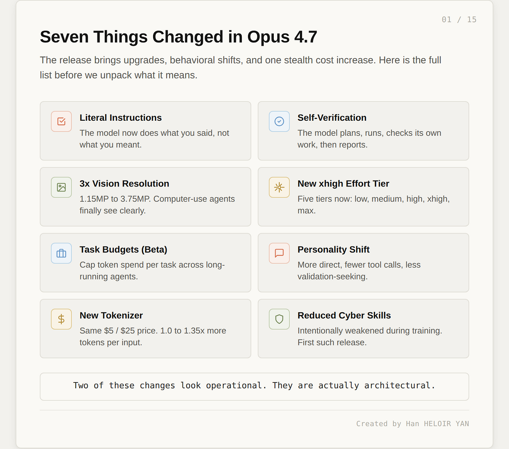

Opus 4.7 于 2026 年 4 月 16 日发布，距 Opus 4.6 发布约两个月。Anthropic 保持了大约两个月的发布节奏。定价维持不变：每百万输入 token $5，每百万输出 token $25。该模型是直接升级，而非新层级，它取代 Opus 4.6 成为默认的 Opus。这些都属于惯例。

以下七项变化不属于惯例。其中两项看起来是操作层面的，实质上是架构层面的。

### 指令字面主义，比以往更严格

Opus 4.7 会按字面意思解读提示词（prompt）。Opus 4.6 会揣摩弦外之音、推断你大概想要什么，而 Opus 4.7 只做你说的事。如果你写"把输出格式化得好看些"，你有三个项目要格式化，Opus 4.6 会对三个都应用格式。Opus 4.7 可能格式化第一个，留下第二个未处理，把第三个当作完全不同的情况对待。模型不会默默地将指令从一个项目推广到另一个，也不会推断你未明确提出的请求。

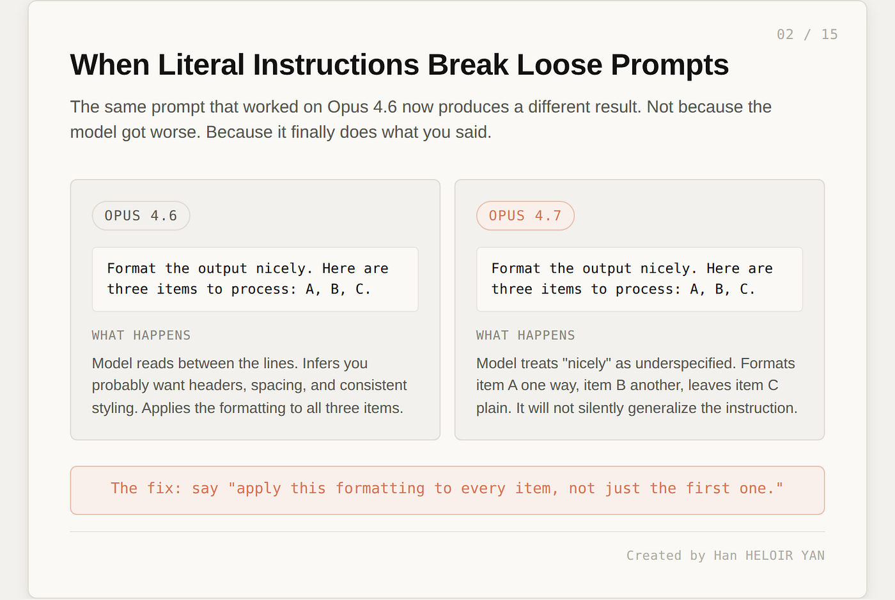

这同时是最大的升级和最大的迁移麻烦。升级：你精心调试的提示词产生更可预测的输出。麻烦：那些依赖模型旧习惯——填补隐含意图——的提示词，现在会产生看起来出了问题的结果，直到你意识到模型只是在严格执行你说的话。

当出了问题，解决方法是明确说明范围："将此格式应用于每个部分，而不仅仅是第一个。"把模型当成一份执行每条条款的合同，而不是能读懂言外之意的同事。

### 推理循环内的自我验证

这是架构上最有趣的变化。Opus 4.7 会规划、执行、检查自身输出，然后再上报结果。验证步骤是新加入的。Vercel 的工程团队注意到模型"在开始系统代码编写之前会先做证明，这是我们在早期 Claude 模型中从未见过的行为。"Hex 观察到 Opus 4.7"在数据缺失时正确上报，而不是提供貌似合理但实际错误的回答。"Devin 背后的团队 Cognition 报告称，模型"能连续工作数小时，在遇到难题时坚持推进而非放弃。"

上述每一条观察，描述的都是过去需要外部 harness 代码才能模拟的行为：重试循环、输出验证器、完整性检查——这些是我在 Five Layers 框架中描述为验证层（Verification Layer）的组件。在 Opus 4.7 中，它们的某种版本现在存在于模型内部。

第四节"来自下方的吞噬：自我验证智能体"将深入探讨这意味着什么。现在，先记下这个观察。

### 视觉分辨率，提升三倍

最大图像分辨率从长边 1,568 像素（约 115 万像素）跃升至 2,576 像素（约 375 万像素），视觉容量约为原来的三倍。实际影响是具体的：computer-use 智能体现在可以读取密集截图，从复杂图表中提取数据的可靠性大幅提升，坐标系与实际像素一一对应，无需以前所需的缩放系数换算。

XBOW 的自主渗透测试工作高度依赖视觉敏锐度，他们报告在内部视觉基准测试上从 54.5% 提升到 98.5%。这不是增量式提升，而是一项此前无法用于生产的能力，现在已经可以投入生产。

### 新增 xhigh 算力档位

effort 参数现在有五个档位：low、medium、high、xhigh 和 max。新增的 xhigh 档位位于 high 和 max 之间。Claude Code 对所有计划默认使用 xhigh。Anthropic 建议将其作为编程和智能体用例的起点。

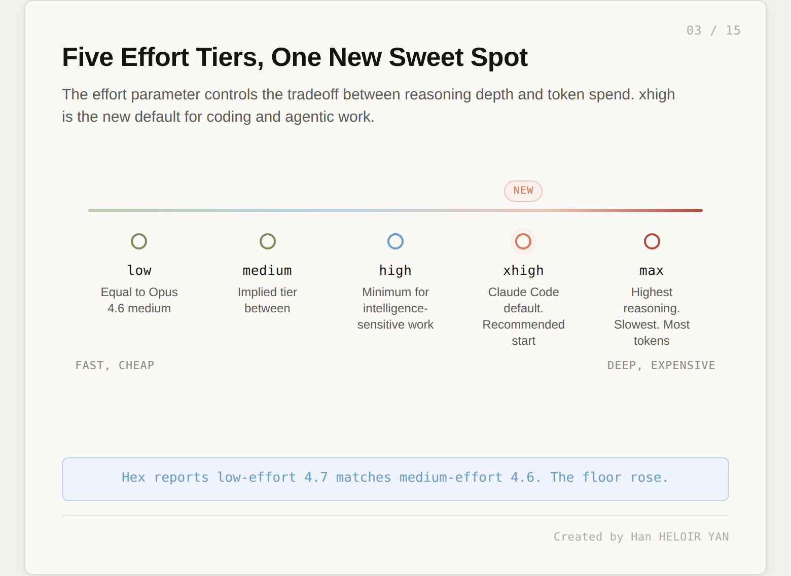

Hex 的 CTO 报告称"低 effort 的 Opus 4.7 大致相当于中 effort 的 Opus 4.6"。基准线提高了。对于对智能要求高的工作，Anthropic 建议最低使用 high 档位。xhigh 档位的存在，是因为智能体工作负载需要比 high 更深的推理，但又不需要 max 的完整延迟和 token 成本。

### 任务预算（测试版）

新增的 API 功能允许你为每个任务设置最大 token 数。模型随后在长时间运行的智能体任务中，在该预算范围内优化工作分配。这是对智能体工作负载引入的成本控制问题的直接回应：当一个模型可以运行数小时时，你需要在事后发现之前就有一种方式限制支出。

### 人格转变

Opus 4.7 比 Opus 4.6 更直接。寻求认可的措辞减少，emoji 减少，更愿意反驳用户建议。Replit 总裁指出："我喜欢它在技术讨论中反驳我，帮助我做出更好的决策。感觉真的像一个更好的同事。"Opus 4.7 默认情况下也更少调用工具，倾向于在内部推理问题，而不是伸手去用外部能力。

如果你在 Opus 4.6 较温暖、寻求认可的风格上构建了面向客户的对话，Opus 4.7 会感觉不同。这是系统提示词（system prompt）需要重新调整的问题，不是 bug。

### 新 tokenizer

Opus 4.7 使用了更新的 tokenizer。定价表没有变化：每百万输入 token $5，每百万输出 token $25。但相同的输入现在映射到大约 1.0 至 1.35 倍的 token 数，具体取决于内容类型。结合模型在更高 effort 级别下倾向于更深度推理，实际上形成了一次隐性涨价。Anthropic 自己的迁移指南指出，净效果在其内部编程评估中是有利的，但他们明确建议在承诺切换之前，先在真实流量上测量差异。

### 网络安全能力降低——出于设计

这是对本文走向最重要的变化。Opus 4.7 在 CyberGym（网络安全漏洞复现基准测试）上得分 73.1%，而 Opus 4.6 得分 73.8%。新模型在网络安全任务上略逊于前任。Anthropic 直白地表示："在训练过程中，我们尝试了差异化削减这些能力的方法。"

请仔细阅读这句话。一家前沿实验室在发布旗舰模型的当天，告诉你他们刻意让模型在某项特定能力上变差，且这是一次训练时的干预，而非运行时过滤器。这是前所未有的。我们后面会回到这个话题。

---

## 第二节：对 Harness 的吞噬

随 Opus 4.7 一同到来的两个转变，看起来毫不相关。自我验证：模型在上报结果之前检查自身输出。差异化能力削减：模型经过训练，在某项特定能力上变得更差。这两者读起来像独立功能，实际上是同一个架构决策穿了两套不同的外衣。

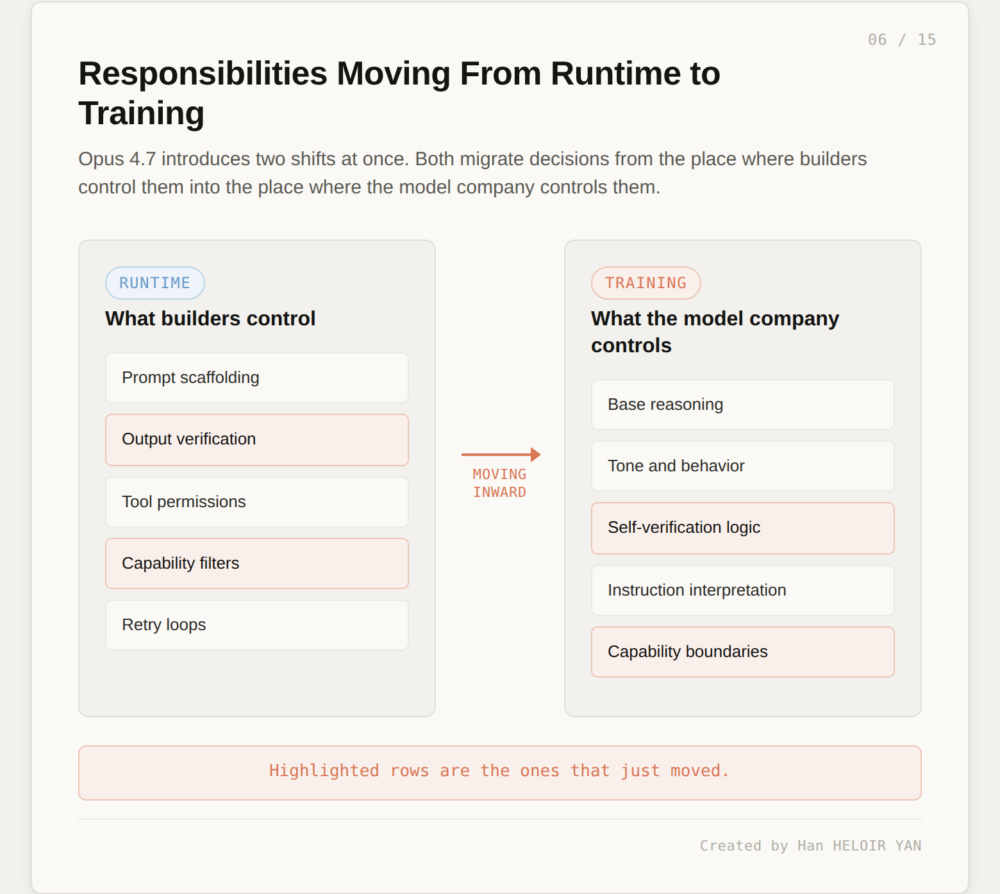

模式是这样的：行为决策正在从运行时（构建者掌控的地方）迁移到训练时（模型公司掌控的地方）。自我验证过去存在于你的 harness 代码中。如果你想检查模型的输出，你自己编写检查逻辑。你决定什么算有效，你对逻辑进行版本管理，进行测试，可以随时关闭。在 Opus 4.7 中，这种检查的某种版本现在存在于权重中。能力限制也是如此。过去，如果你想阻止模型协助网络安全攻击，你会编写分类器、提示词过滤器、策略检查——运行时控制。在 Opus 4.7 中，这种约束的某种版本也存在于权重中。

两种迁移形态相同。模型公司正在扩大它代表你做出的行为决策集合，同时缩小你在自己代码中做出的决策集合。这就是吞噬。

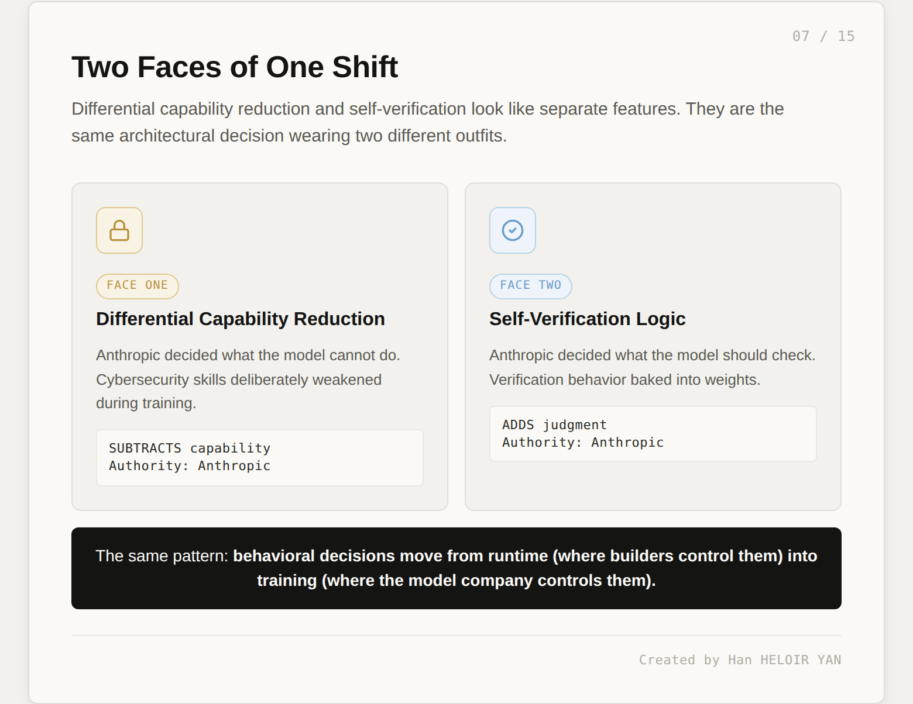

本文的核心论点，直接说明：差异化能力削减和自我验证是同一转变的两个面向。一个减去能力，另一个增加判断。两者都减少了你对模型行为的权威。

文章的其余部分依次检视每个面向。第四节审视能力削减的面向及其对部署策略的启示。第五节审视自我验证的面向，并提出更难的问题：如果模型提出替你处理验证，你应该让它接手吗？第六节将两者转化为今天使用 Opus 4.7 的团队的实际指导。

结论不会是简单的"接受所有吞噬"或"拒绝所有吞噬"。有些吞噬是真正有用的，有些是错误的人在替你做决定。关键在于分辨它们。

---

## 第三节：来自上方的吞噬——他们不会发布的模型

要理解为何 Opus 4.7 的网络安全能力被刻意削弱，你需要了解那个未被发布的模型。

Claude Mythos Preview 是 Anthropic 能力最强的模型。在 Opus 4.7 发布前一周，Anthropic 宣布了 Project Glasswing：一个围绕 Mythos 构建的网络安全计划，拥有十二家发布合作伙伴（Amazon Web Services、Apple、Broadcom、Cisco、CrowdStrike、Google、JPMorgan Chase、Linux Foundation、Microsoft、Nvidia、Palo Alto Networks）以及四十余个构建或维护关键软件基础设施的额外组织。Anthropic 承诺提供高达 1 亿美元的使用额度和 400 万美元的开源安全工作捐款。

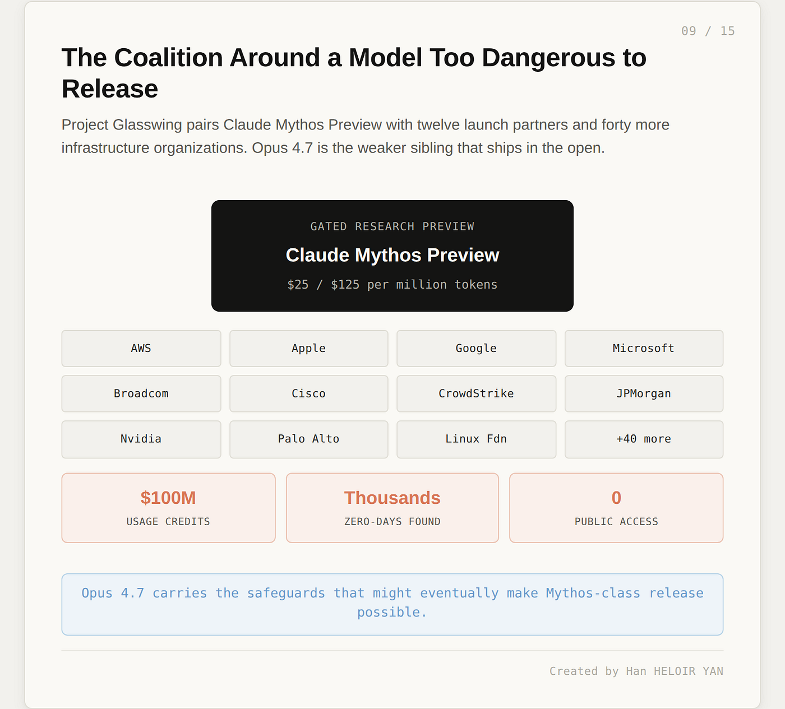

成立该联盟的明确原因：Mythos 已经在每个主要操作系统、每个主要 Web 浏览器以及一系列其他关键软件中发现了数千个零日（zero-day）漏洞。Anthropic 认定这种能力对于广泛发布而言过于危险。于是：限制访问的研究预览版，向合作伙伴提供，定价为每百万输入 token $25、每百万输出 token $125，并承诺随着零日漏洞被修补，在行业范围内共享发现。

Opus 4.7 存在于这一决策的阴影之下。Anthropic 需要发布某些东西，而 Mythos 被锁定了。于是他们发布了叠加了防护措施的 Opus 4.7，并在训练时刻意削减了使 Mythos 过于危险而无法发布的网络安全能力。发布帖子写得很明确："我们发布的 Opus 4.7 配备了防护措施，能自动检测并阻止指示禁止或高风险网络安全用途的请求。我们从这些防护措施的实际部署中学到的东西，将帮助我们朝着最终广泛发布 Mythos 级别模型的目标迈进。"

这是一次彩排。Opus 4.7 是为接下来任何事情准备的彩排。

### 差异化能力削减究竟做了什么

技术新颖性在于训练时的干预。Anthropic 尝试了修改训练信号的方法，在保留通用智能的同时降低特定危险技能。CyberGym 上 0.7 个百分点的退步是可测量的结果。模型的其他所有方面都在提升：编程变好了，视觉能力大幅提升，知识工作变好了。只有被针对的能力下降了。

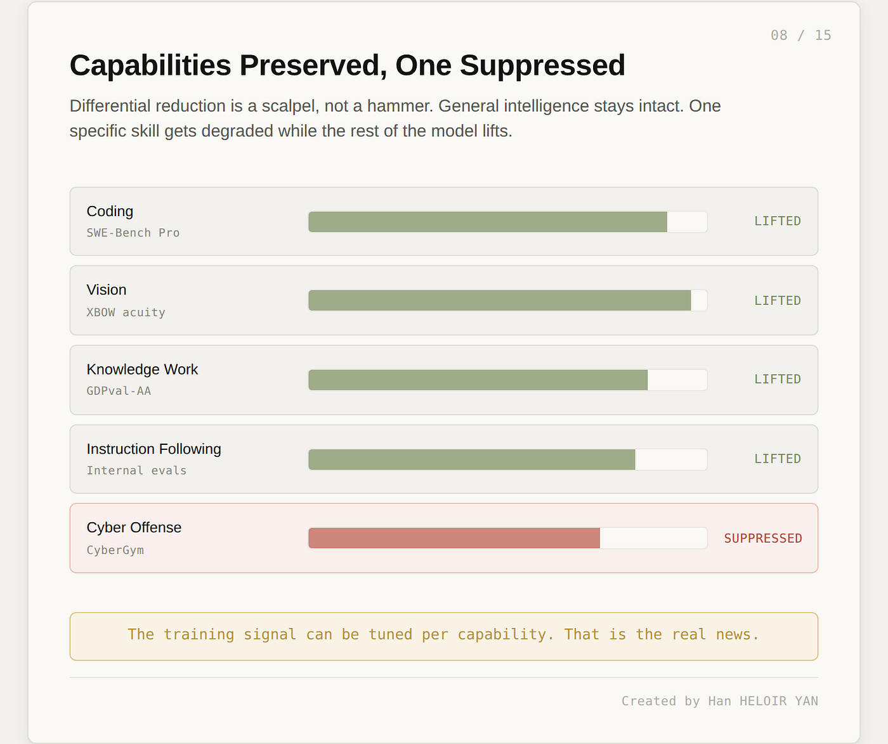

这是手术刀，不是锤子。你无法关闭它，无法检查哪些能力被削减了或削减了多少，也无法为了合法用途而恢复该能力——除非向 Anthropic 的 Cyber Verification Program 申请，该程序为漏洞研究、渗透测试和红队工作开放 Opus 4.7 网络安全能力的访问权限。你必须请求许可，才能以模型本可发布的能力级别使用它。

对于前沿能力级别的网络安全这一特定情况，这可能是正确的政策。落入错误之手的前沿网络安全能力确实危险。Mythos 能以此前不可能实现的攻击方式将漏洞串联起来。不发布 Mythos、以及在 Opus 4.7 中压制 Mythos 级能力的理由是有分量的。Bruce Schneier 在其博客上将 Glasswing 的周边公告称为"公关操作"，但他也承认底层的安全风险是可信的。

### 更难的问题

更难的问题是这个模式能否得到良好的推广。Anthropic 决定削减哪项能力，决定削减多少，决定谁有资格申请恢复，决定什么算合法用途。所有这些决定都在随模型一起交付的黑盒子里。你看不见削减，无法推断其边界，无法测试它可能遗漏什么。

当削减明显符合公众利益时，这没问题。如果下一次削减符合的是商业利益呢？或者是政治利益？或者是模型公司签署的你从未见过的合同？机制是相同的，只是目标变了。

需要铭记的问题：如果 Anthropic 可以选择性地削减你可能需要的能力，那么让他们能做到这一点的机制，也是让他们可以选择性地塑造你可能不认同的行为的相同机制。差异化能力削减是一种技术能力，它应该被用于什么目的，是一个治理问题——而目前没有治理机制，只有模型公司自己的判断。

---

## 第四节：来自下方的吞噬——自我验证智能体

如果说能力削减是来自上方的吞噬，那么自我验证就是来自下方的吞噬。构建者过去拥有的某些东西现在由模型处理，而且这种便利是真实的，你需要仔细思考你正在放弃什么。

### 发生了什么变化

Opus 4.7 在自身推理循环中插入了一个验证步骤：规划、执行、验证、上报。验证步骤是新加入的。

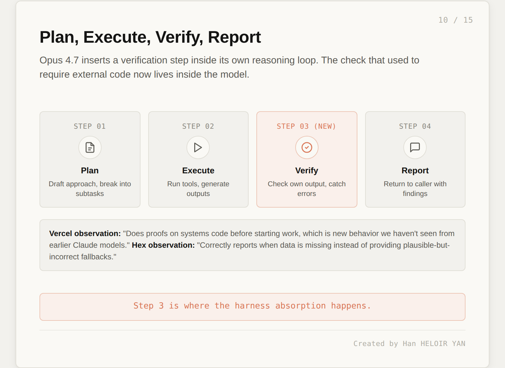

合作伙伴的证言告诉你这种行为在实践中是什么样的。Vercel："它在开始系统代码编写之前会先做证明，这是我们在早期 Claude 模型中从未见过的行为。"Hex："它在数据缺失时正确上报，而不是提供貌似合理但实际错误的回答，并且能抵御连 Opus 4.6 都会陷入的数据不一致陷阱。"Cognition（Devin）："它能连续工作数小时，在遇到难题时坚持推进而非放弃，解锁了一类我们以前无法可靠运行的深度调查工作。"Genspark："我们测量过的最高单次工具调用质量比率。"

综合来看，这些描述的是一个在提交结果之前能抓住自身错误的模型。过去需要外部验证代码完成的相当多的工作，现在发生在推理循环内部。

### 便利性论证

自我验证确实有用，先从这里诚实地出发。

如果模型在产生输出之前抓住错误，你就省了一次往返：不需要重试，不需要重跑，不需要下游纠错，延迟更低。token 成本也更低：在第三步抓住错误，比生成错误输出、让验证器拒绝它、再重新生成要便宜。harness 代码也变得更简单：更少的重试循环，更少针对简单情况的输出验证器，更少实际上只是在防范可预测幻觉的样板检查。

对于简单错误，算术很清楚。让模型便宜地抓住它们。这是正确的默认选择，这种便利不是营销话术，而是真实的操作减负。

### 同一权重问题

现在是困难的部分。一个自我验证的模型在生成步骤和检查步骤中使用相同的权重：相同的训练信号，相同的概率分布，相同的盲点。

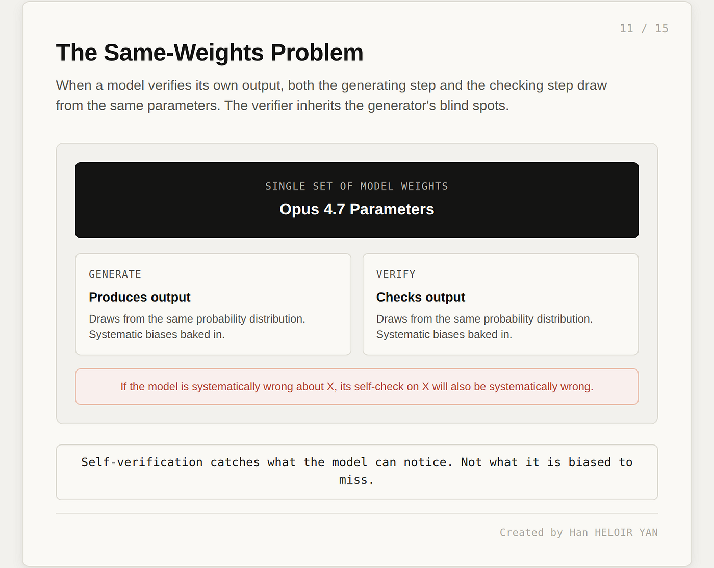

如果模型存在系统性偏差——倾向于幻觉某种特定类型的 API 响应、习惯性低估某种特定风险、在某个特定领域存在训练数据缺口——其自我验证步骤会继承这种偏差。生成器产生一个貌似合理但实际错误的输出，验证器看着它，而两个操作都来自相同的概率分布。验证器接受错误输出的可能性，恰好与生成器产生它的可能性相同。

这不是可以通过提示词工程绕过的 bug，而是结构性属性。你可以提示模型"仔细检查你的工作"，它会在权重所能注意到的范围内这样做。权重系统性错误的那类东西，恰恰是权重无法注意到的——再多的自我检查也无法修复，因为自我检查使用的是相同的权重。

自我验证能抓住模型有能力注意到的东西，无法抓住模型系统性地有偏差而会错过的那类错误。而那正是在生产中伤害你的那类错误，因为它们是那些不会被标记出来、悄悄溜过去的错误。

### 谁决定什么算已验证

暂且放下同一权重问题。假设模型的自我检查真的有能力——仍然有第二个问题：当模型说"我已验证这个"，意味着什么？

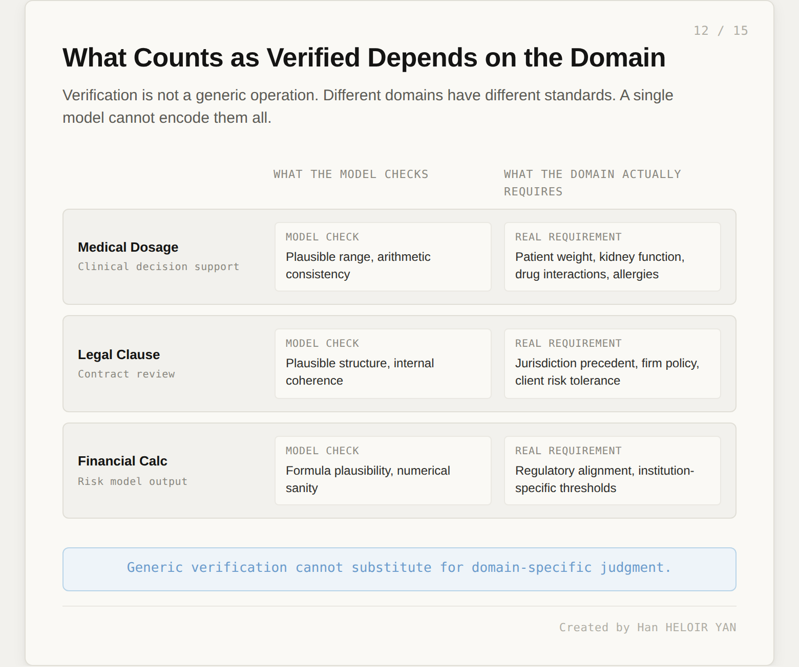

验证不是通用操作，而是领域特定的操作。一个检查用药建议的医疗平台，需要根据患者体重、肾功能、药物相互作用和过敏情况进行验证——模型的自我检查验证的是合理的范围和算术一致性，仅此而已，因为更多的东西不在权重里。一个审查合同条款的法律平台，需要根据司法管辖区的判例、律所政策和客户风险承受度进行验证——模型的自我检查验证的是结构合理性和内部一致性。一个验证风险模型输出的金融平台，需要根据监管合规和机构特定阈值进行验证——模型的自我检查验证的是数值合理性。

在每种情况下，模型的自我验证都是必要但不充分的。用户实际需要的领域特定验证，不可能被编码进一个为跨行业数百万客户服务的通用模型中。这不是模型的失败，而是通用智能与领域专业知识的本质差异。

当验证逻辑存在于你的 harness 代码中，你决定"已验证"对你的领域意味着什么。你可以审计规则，可以对它们进行版本管理，可以在法规变化时替换它们，可以为测试目的关闭它们。当验证逻辑存在于模型权重中，Anthropic 对什么算有效输出做出编辑决定。这些决定反映了他们的价值观、训练数据、商业激励和客户群体分布。对于大多数情况，这些决定是合理的。对于你的特定领域，它们可能不对齐，而且你没有办法检查它们。

### 模式的联系

这与差异化能力削减是同一模式，只是换了衣服。在第三节中，Anthropic 决定了模型不能做什么，而且这个决定被烘焙进了你无法检查的权重中。在这里，Anthropic 决定了模型应该对自身输出检查什么，而且这个决定同样被烘焙进了你无法检查的权重中。两者都是模型公司在训练过程中做出的编辑决策，影响每一次运行时交互，没有运行时覆盖机制。

一个面向减去能力，另一个面向增加判断，两者都将权威集中化。

### 可防御的立场

平衡的答案不是拒绝模型自我验证，而是理解它属于哪个层级。

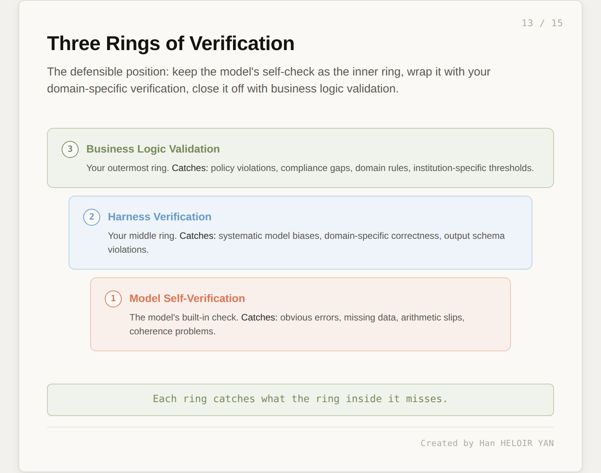

将模型自我验证视为最内层的环。它便宜、快速地抓住明显错误、算术失误、数据缺失、连贯性问题，与生成步骤紧密耦合。这是相对于 Opus 4.6 的真实升级，你应该使用它。

用 harness 验证包裹这一环。你的代码检查模型输出中你在生产中见过的系统性错误、对你用例重要的领域特定正确性规则，以及可以用确定性方法轻松检测的输出 schema 违规。这是抓住模型自我检查无法抓住的东西的那一环，因为它由了解你领域、见过你流量的人编写。

用业务逻辑验证包裹这一环。策略违规、合规缺口、监管阈值、机构特定规则——最外层的环执行那些本来就不可能适配进通用模型的规则。

每一环都抓住它内层那一环遗漏的东西。模型的自我检查现在是系统的一部分，而不是它的替代品。这是可防御的立场：让模型做它能做的事，在对你的领域重要的事情上保持权威，让它留在你的代码里，在你的掌控之下。

---

## 第五节：这对你的技术栈意味着什么

现在是实际操作部分。如果你今天正在使用 Claude 发布产品，或者计划从 Opus 4.6 迁移，以下是思考这次迁移的方式。

### 选择正确的 effort 档位

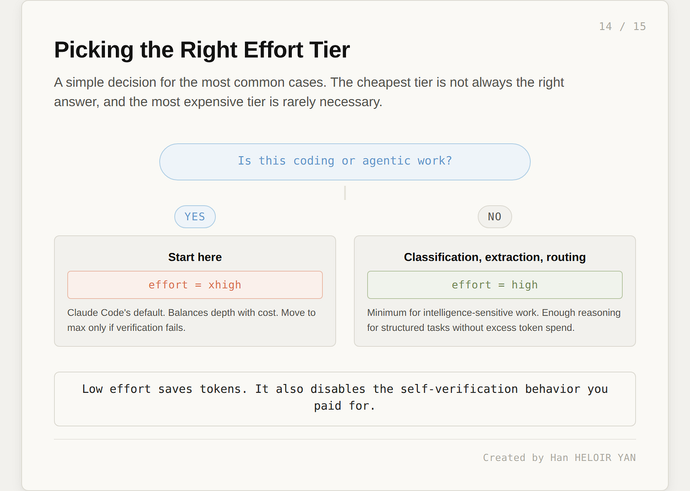

对于编程和智能体工作，从 xhigh 开始。这是 Claude Code 的默认选择，大部分自我验证行为在此档位发挥，合作伙伴的证言也是在这个档位下产生的。Anthropic 建议设置较大的最大输出 token 预算，至少 64,000，这样模型在推理和工具调用过程中有足够的空间思考和行动。

对于分类、提取、路由和其他结构化工作，high 是对智能敏感任务的最低要求。低于 high 会禁用相当大比例的推理深度，包括大部分自我验证行为。low 和 medium 档位节省 token，也产生不同的智能体——更接近于同等 effort 下的 Opus 4.6，而不是 Opus 4.7 的最佳状态。

将 max 保留给你已经尝试过 xhigh 但输出仍然不足的任务。成本跳升是真实的，延迟跳升是真实的，而大多数时候 xhigh 已经足够。

### 管理成本现实

定价没有变化，实际成本可能变了。新 tokenizer 将相同输入映射到 1.0 至 1.35 倍的 token 数，具体取决于内容类型。结合模型在更高 effort 级别下倾向于更深度思考，你应该为同等工作预算 15% 至 35% 更多的 token。Anthropic 自己的数据表明，对于复杂工作负载，净效果可能是有利的，因为模型以更少的无效工具调用产生更好的输出——但这是依赖工作负载的说法。在相信它之前，先在你的真实流量上测量。

任务预算（现在处于测试版）在这里是你的朋友。为每个任务设置上限，让模型自行优先排序。这对于长时间运行的智能体尤为重要，单次运行否则可能消耗无限数量的 token。没有预算，你只能在账单到来后才发现成本。

### 迁移时会发生什么

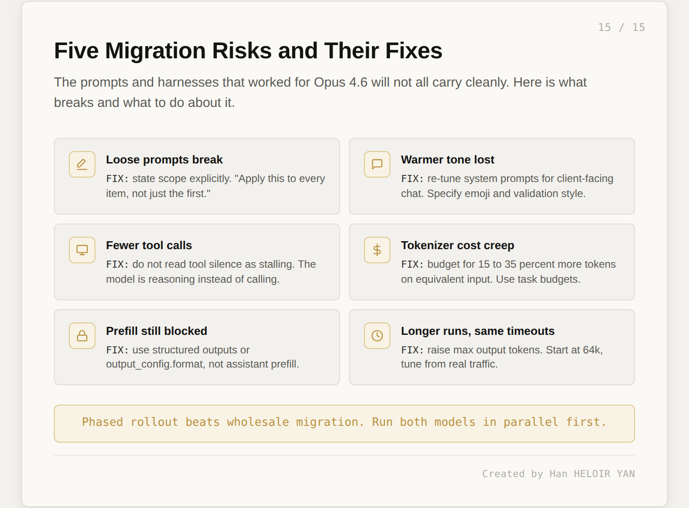

五个具体风险，每个都有修复方法。

**宽松提示词会失效。** 任何写了"把这个格式化得好看些"或"处理边缘情况"或"确保输出质量好"的提示词，都依赖于 Opus 4.6 的宽松解读。Opus 4.7 需要明确的范围："将此应用于列表中的每个项目，而不仅仅是第一个。"用新眼光重新审视你的提示词库，假设任何一个合同工可以用三种不同方式解读的指令，都会被以对你造成最大麻烦的方式解读。

**温暖的语气消失了。** 如果你的面向客户的对话依赖 Opus 4.6 更友好的风格，Opus 4.7 会感觉更冷。这是需要重新调整系统提示词的问题。明确指定你想要的 emoji 策略、认可风格，以及愿意认同用户观点的程度。模型有这个能力范围，只是默认到了不同的地方。

**更少的工具调用可能看起来像停滞。** 如果你的编排监控工具调用频率作为存活信号，你可能会把推理误读为停滞。模型在刻意减少工具调用，增加推理。更新你的存活检查，读取推理输出，而不仅仅是工具调用遥测。

**tokenizer 成本蔓延。** 在真实工作负载上追踪 token 使用情况。不要仅仅因为每 token 价格相同，就假设 Opus 4.6 和 Opus 4.7 每任务成本相当。如果可以，在两个模型上并行运行一周真实流量，用数字而不是感觉做迁移决策。

**prefill 仍然被阻止。** assistant message prefill 仍然返回 400 错误（这在 Opus 4.6 中引入，延续至今）。如果你依赖 prefill，请使用结构化输出、系统提示词指令或 `output_config.format`。

**更长的运行需要更长的超时。** Opus 4.7 在 xhigh 和 max 档位下思考时间更长。如果你的基础设施有严格的请求超时，请提高它们。从 64,000 最大输出 token 开始，根据真实流量进行调整。

### 验证立场

无论你选择哪个 effort 级别，无论你走哪条迁移路径，都要保留你的验证层。模型的自我检查现在是系统的一部分，而不是你控制机制的替代品。将它视为廉价抓住简单错误的最内层环，包裹在你的 harness 验证中，再包裹在你的业务逻辑验证中。三层环，每层抓住它内层那一环遗漏的东西。

一个值得运行的具体测试：取你最难的工作负载，在保持现有验证层的情况下，用 xhigh 的 Opus 4.7 运行它。记录每一个模型自我抓住的错误、每一个通过自我检查但被你的 harness 抓住的错误，以及每一个一路通过的错误。第一个数字告诉你吞噬为你带来了什么，第二个数字告诉你你的 harness 仍然值什么，第三个数字告诉你还需要在哪里加防御。

---

## 第六节：回顾与后续

三点带走。

**Opus 4.7 真正的意义不在于基准测试，而在于架构。** 模型正在吸收过去存在于你代码中的职责（自我验证），而模型公司正在吸收过去属于你的决策（差异化能力削减）。两个转变方向相同：权威从运行时迁移到训练时，从构建者迁移到模型公司。

**吞噬有两个面向。** 一个减去能力（模型不能做什么），另一个增加判断（模型决定什么是正确的）。本文的论点是它们是同一模式，它们向构建者提出的问题也是同一个：哪些行为决策应该存在于模型内部，哪些应该由部署它的人掌握？

**你可防御的立场不是拒绝吞噬，而是分层。** 接受自我验证作为第一过滤器的便利性。在你的 harness 中保留权威验证。将这一原则广泛推广：对模型吸收的每一项能力，问一问谁失去了权威，以及这个交换对你的领域是否可接受。有些吞噬是真正有用的，有些是错误的人在替你做决定。关键在于分辨它们。

本周的一个具体实验：在你最难的当前工作负载上，并行运行保持现有验证层的 xhigh Opus 4.7。测量哪些错误被模型自我抓住，哪些溜过去，哪些被你的 harness 抓住。这个比率告诉你吞噬在哪里有帮助，在哪里掩盖了仍然属于你的风险。这才是向你的团队汇报的数字，而不是基准测试。

更大的问题更难，值得深思。当 Mythos 级别的能力最终进入开源模型时，差异化能力削减对开源社区来说将不是一个选项。Anthropic 在 Opus 4.7 上测试的防护措施，是为一个即将到来的时刻准备的彩排，无论主要实验室是否已经准备好。明年发布的模型，将让这次发布提出的治理问题显得早该解决了。

---

## 参考资料与延伸阅读

- Introducing Claude Opus 4.7：Anthropic 官方公告，包含所有合作伙伴证言和基准测试数字。
- Migrating to Claude Opus 4.7：官方迁移指南，包括 tokenizer 变化和 effort 参数建议。
- What's new in Claude Opus 4.7：行为变化和破坏性差异的文档摘要。
- Project Glasswing：Mythos Preview 联盟公告及合作伙伴声明。
- Claude Mythos Preview：Anthropic 红队关于 Mythos 网络安全能力的技术报告。
- VentureBeat 报道：对 tokenizer 成本影响和部署动态的独立分析。
- Schneier on Glasswing：对发布策略的质疑性解读，值得与 Anthropic 的框架并置阅读。
