> 作者：[Han HELOIR YAN, Ph.D. ☕️](https://medium.com/@han.heloir)
> 发布日期：2026 年 5 月 29 日
> 原文链接：https://medium.com/data-science-collective/what-anthropic-didnt-say-about-opus-4-8-it-s-anthropic-absorbing-your-harness-6d4ea10bf66d

# Anthropic 没有明说的 Opus 4.8：它正在吸收你的 Harness

## Opus 4.8 不只是一次模型更新

你改了一个字符串。`claude-opus-4-7` 变成了 `claude-opus-4-8`，会话在零配置改动的情况下启动，基准测试成绩全面上扬。你完成了部署。你的流水线没有任何东西坏掉，所以你感觉什么都没变。

可有些东西确实变了。当你还在读那张基准测试表时，你的 harness 五个层级中有三个悄悄不再是你的活了。Anthropic 没有这么描述这次发布。他们称之为一次模型升级，而今天几乎每一篇分析都重复了这套说法：更高的编码分数、更便宜的快速模式、一个更诚实的模型。

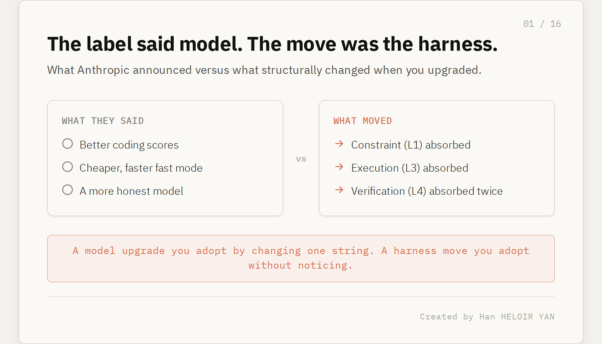

这套说法是一次障眼法。Opus 4.8 主要不是一个更聪明的模型。它是 Anthropic 把手伸进你的 harness，吸收掉那些你过去自己搭建的部分。下面就是他们没有公开说出口的内容，一层一层拆给你看。

（图片来自 [Svitlana](https://unsplash.com/@kekse_und_ich?utm_source=medium&utm_medium=referral) / [Unsplash](https://unsplash.com/?utm_source=medium&utm_medium=referral)）

### 开始之前

🦸🏻‍♀️ 如果这篇文章能帮你构建更好的 AI 系统：

👏 点 50 次 clap（是的，你可以连点）——Medium 的算法偏好这种互动，会把文章推荐给更多人，让他们也能发现它。
🔔 在 [Medium](https://medium.com/@han.heloir)、[LinkedIn](https://www.linkedin.com/in/hanheloiryan/) 上关注我，并[订阅](https://medium.com/@han.heloir/about)以获取我的最新文章。

## 所有人都在读的那张计分板

这就是今天每篇分析开头都引用的那张表。看中间几列，Opus 4.8 是一次干净利落的模型升级。看最后一列，它就是另一回事了：一张标明 Anthropic 这次把手伸进了哪些 harness 层级的地图。

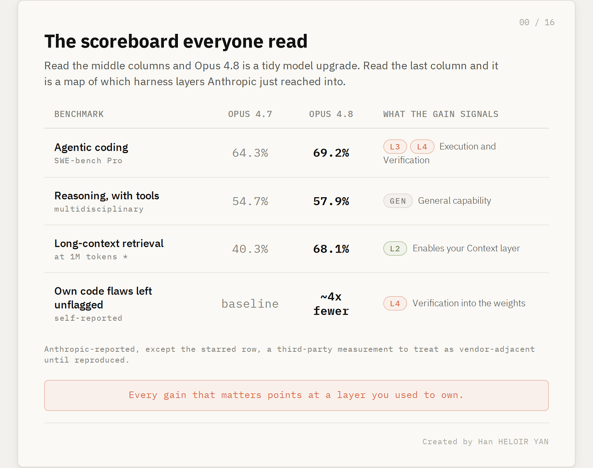

每一项有意义的提升，都指向一个你过去自己拥有的层级。编码能力的跃升对应你的执行与检查工作。诚实度的提升对应你的批评者（critic）。更宽的上下文窗口（context window）对应你的检索所要填满的那个房间。最后那一列就是整篇文章的主题。本文余下的部分就沿着它，一层一层走下去。

## harness 才是护城河，而护城河刚刚缩水了

如果你读过我之前的文章，你已经熟悉这套框架了。一个前沿模型不是产品。产品是你包裹在它外面的 harness：那套把一个原始的下一个 token 预测器变成你敢在生产环境里信任的东西的脚手架。我把这个 harness 拆成五层。

约束（Constraint，L1）是你如何给模型设定边界：路由、token 预算、你针对每个任务调校的算力与质量之间的取舍。上下文（Context，L2）是你喂给它什么：检索、记忆、对进入窗口的内容的工程设计。执行（Execution，L3）是工作实际如何运行：编排（orchestration）、子智能体（subagent）、工具循环、重试。验证（Verification，L4）是你在信任输出之前如何检查它：测试、裁判（judge）、那道在模型谎报自身进度时拦下它的关卡。生命周期（Lifecycle，L5）是围绕一次运行的一切：评估（eval）、部署、监控、回滚。

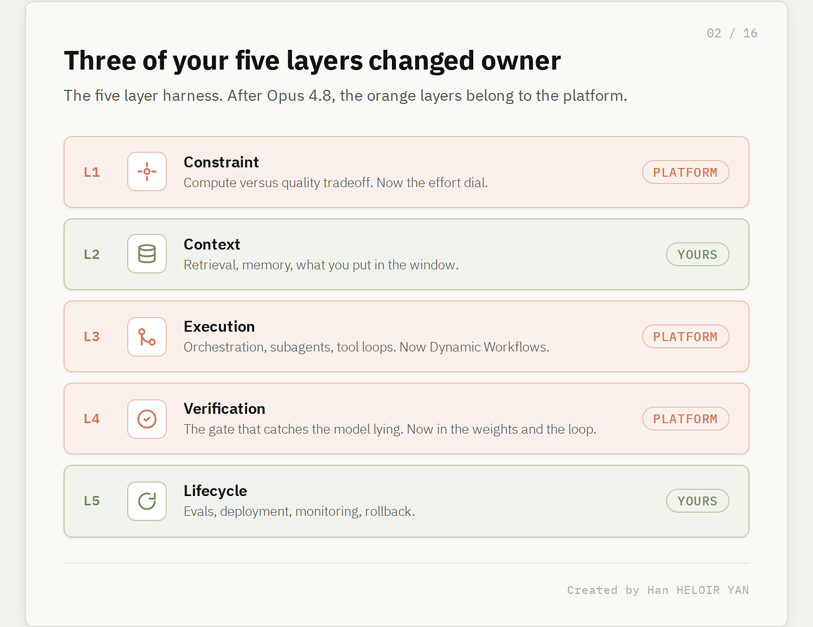

两年来，模型厂商卖给你引擎，把这五层全留给你。那道缝隙就是你的护城河。Opus 4.8 是这样一次发布：Anthropic 不再放着其中三层不管。它在一次发布里同时伸手进了约束、执行和验证——而且对验证伸了两次手。发布说明把这些叫作诚实度、动态工作流（Dynamic Workflows）和努力度控制（effort control）。从结构上读，这是一次圈地。

## 验证先进了权重，然后进了循环

先从那个头条数字说起，因为它正是每个竞争对手都跟着复述、却没注意到其含义的数字。Anthropic 报告称，Opus 4.8 让自己写出的代码中存在缺陷却不加标记直接放行的概率，大约比 Opus 4.7 低了四倍。公司把这件事包装成诚实度：模型在自己不确定时会告诉你，会抓出自己的 bug，而不是早早宣布胜利。

它的含义是：一种你过去要靠外部验证层才能买到的行为，现在已经部分驻留在权重里了。经典的 L4 harness 是一道二次检查。你先生成，然后跑一个 linter、一套测试、一个批评者模型、一个人类审查者，任何能在那种自信却错误的输出发货前抓住它的东西。这一层之所以存在，整个理由就在于模型爱下草率的结论。一个把自己写坏的代码放行概率降低四倍的模型，实际上已经内化了你的批评者的一部分。

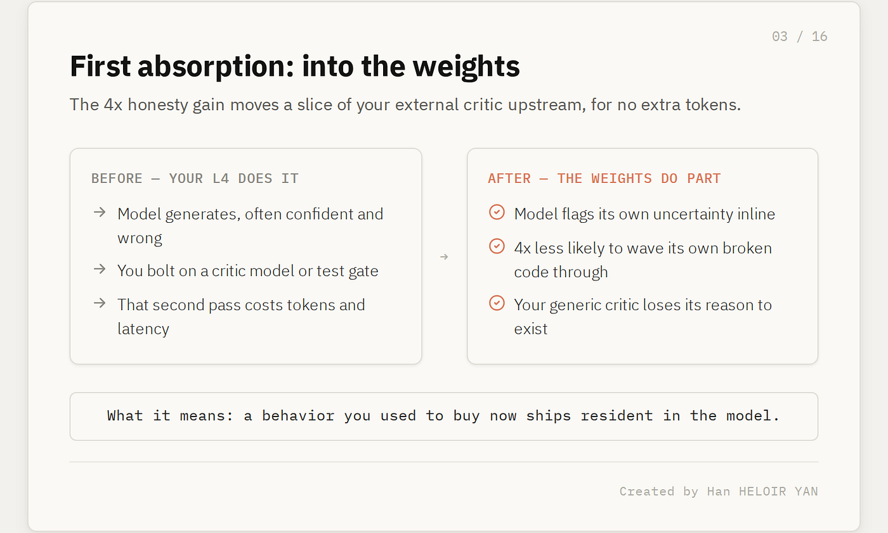

它为什么重要：你那个外挂式验证层的边际价值，恰好按模型如今免费替你做掉的那部分等量下降。如果你为了在漫长的智能体（agentic）运行中抓住静默失败而搭了一个批评者模型关卡，它的部分工作刚刚在上游就被做掉了，不花额外的 token。这可不是小事。一位 Bridgewater 的测试者告诉 Anthropic，最大的区别在于模型会主动标记一项分析的输入和输出存在的问题——这正是其他模型留给用户去抓的那件事。那是 L4 的活，正发生在模型内部。

接着，Anthropic 在另一个地方第二次吸收了同一层。Dynamic Workflows，这个 Claude Code 的新功能，不只是派发并行的子智能体。按照 Anthropic 自己的描述，Claude 会规划工作、运行数百个并行子智能体，然后在汇报结果之前验证自己的输出。验证现在是执行循环里一个内建的阶段，而不是你事后外挂上去的一道关卡。

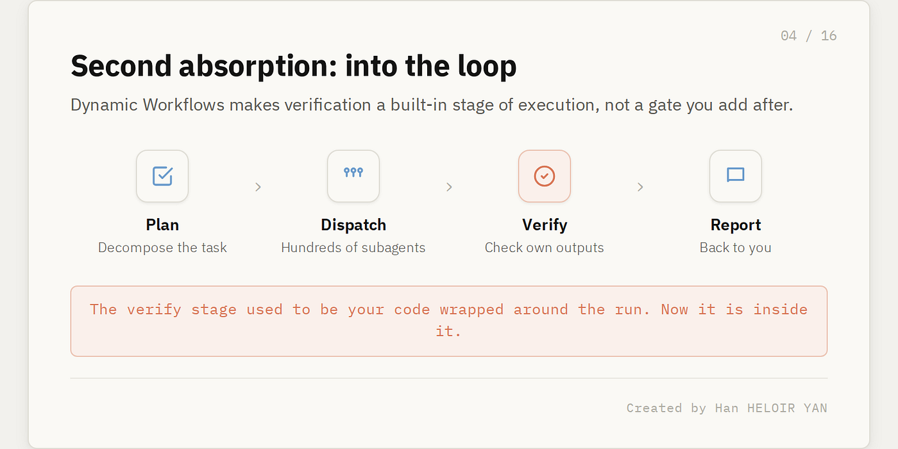

仔细体会这一点。验证在同一次发布里，既被吸收进了权重，又被吸收进了编排循环。如果你的 harness 的防御力倚仗于掌握那道检查步骤，那么 Opus 4.8 就是从两个方向同时来抢它的那次发布。

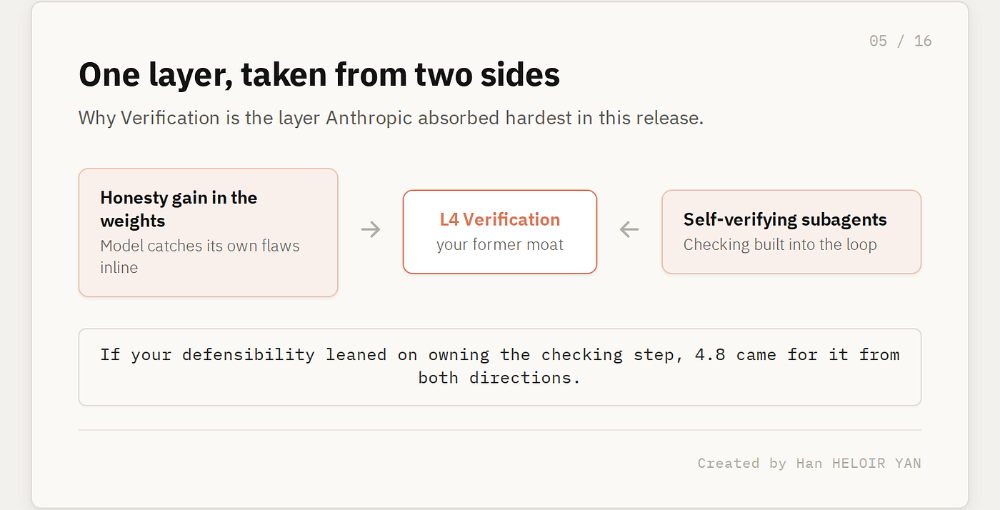

## 编排不再是一套你买来的框架

执行是 Anthropic 拿走的第二层。所有人报道的版本是那个令人印象深刻的：搭载 Opus 4.8 的 Claude Code 能把一次跨越数十万行的代码库级别迁移，从启动一路推进到合并，并以现有的测试套件作为衡量标准。一份早期记述描述了一次大约 75 万行 Rust 代码的移植，在十一天内达到 99.8% 的测试套件通过率。在你自己复现之前，请把这个具体数字当作一个带厂商立场的说法看待，但它的形态是真实的。

它的含义是：你过去要手工拼装的编排，如今成了一个平台原语。在此之前，把一个难题分散到许多智能体上跑，意味着那些难的部分都归你。你得写那个把任务分解开的规划器（planner）。你得管理向并行 worker 的扇出（fan-out）。你得在一个跨越数天的作业里处理部分失败、重试和状态。这些要么你自己造，要么你采用一个多智能体框架、连带继承它的种种成见。那套拼装是 L3，而它过去是你的。

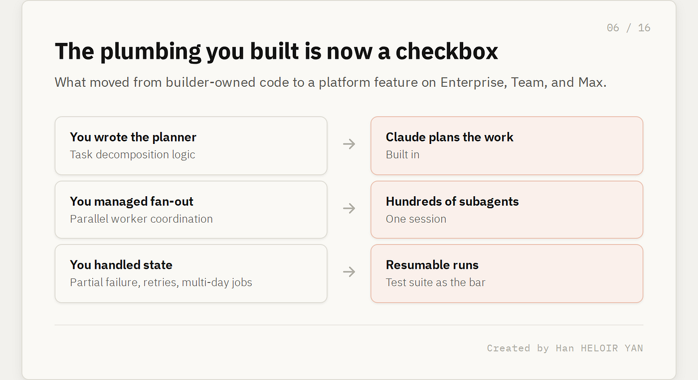

Dynamic Workflows 把它坍缩成了一个功能。规划，派发数百个从各自独立角度攻击问题的子智能体，验证，汇报。它的定位本身就是泄底的线索。一位 CyberAgent 的工程师把它描述为填补了「只发一个子智能体」和「搭建一整支智能体团队」之间的那段空白。那正是 Anthropic 在点名它正在吞并的那块地盘：编排的中间层——大多数团队因为没有现成方案合用而只能自己手搓的那一部分。

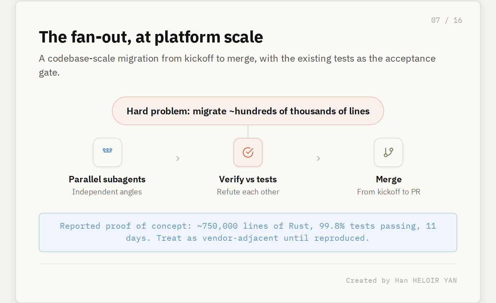

它为什么重要：如果你的差异化在于编排管道，那么这道护城河现在成了 Enterprise、Team 和 Max 套餐上的一个勾选框。在这里胜出的团队，是那些一直把编排当作没有差异化的体力活、并把精力花在别处的团队。一位 Klarna 的工程师指出，这个功能在跨大型代码库的探查与审查中价值最高，能找出静态分析漏掉的死代码（dead code）。注意这是什么：高价值，但不专有。它恰恰是那种你乐于交给平台去拥有的工作。

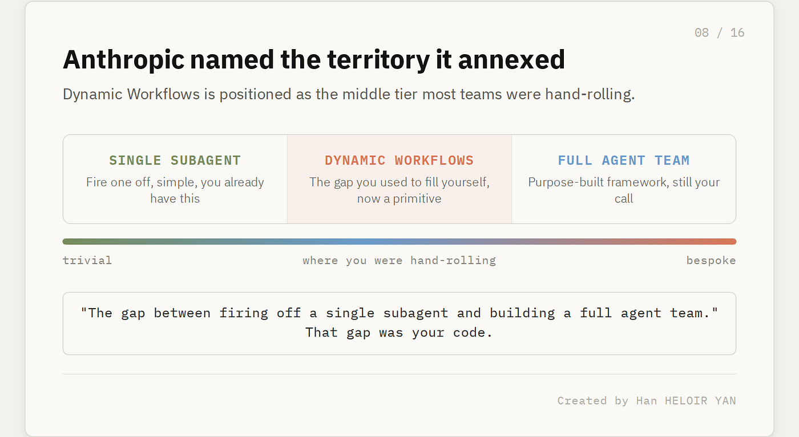

## 约束的旋钮如今归 Anthropic，不归你

最安静的一次吸收，是那个看起来像便利功能的东西。Opus 4.8 带来了努力度控制。在 claude.ai 和 Cowork 上，你来挑 Claude 在一次回应上下多大力气。在 Claude Code 里，档位分为 low、high、extra 和 max，而默认值降到了 high——在这一档，模型花费的 token 大致和 Opus 4.7 的旧默认值相当，得分却更高。

它的含义是：算力与质量的取舍属于 L1，约束层，而它过去是你的代码。是你在决定什么时候一个任务值得用昂贵的模型，什么时候一遍便宜的处理就够了。你搭了路由分层。你设了 token 上限。你写了那段把简单请求送往小模型、把困难请求送往前沿模型的逻辑，因为正是这段逻辑让账单还撑得住。努力度控制把那个决定变成了一个由厂商暴露、由厂商调校的旋钮。

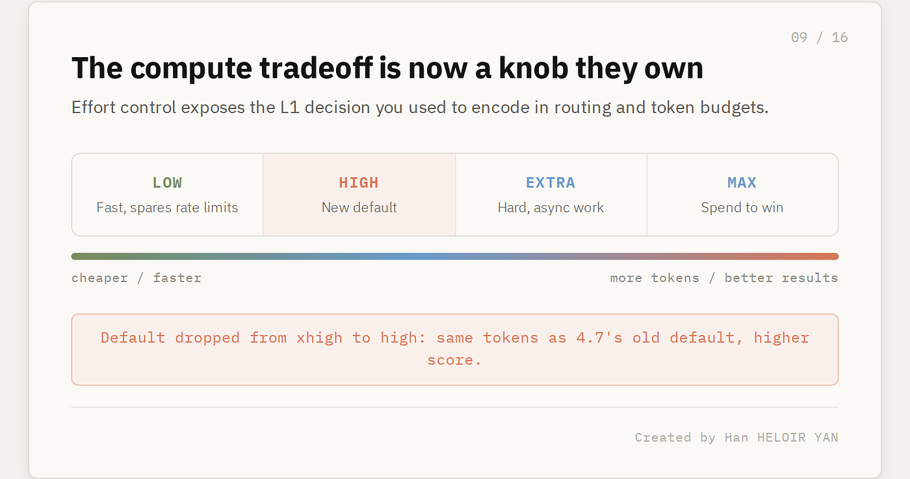

它为什么重要：平台每吸收一个自由度，你的路由层就少一块阵地。这不是自动就坏。一个校准得当的努力度旋钮可以打败一个粗糙的自制路由器，而更便宜、更快的模式又强化了这一点。快速模式现在的运行速度大约是标准 Opus 4.8 的 2.5 倍，成本比上一代的快速档低三倍，用 `/fast` 切换。厂商正在让交出这个取舍变得真的很有吸引力。吸收就是这么运作的。它感觉不像是失去控制。它感觉像一个你不用就显得傻的功能。

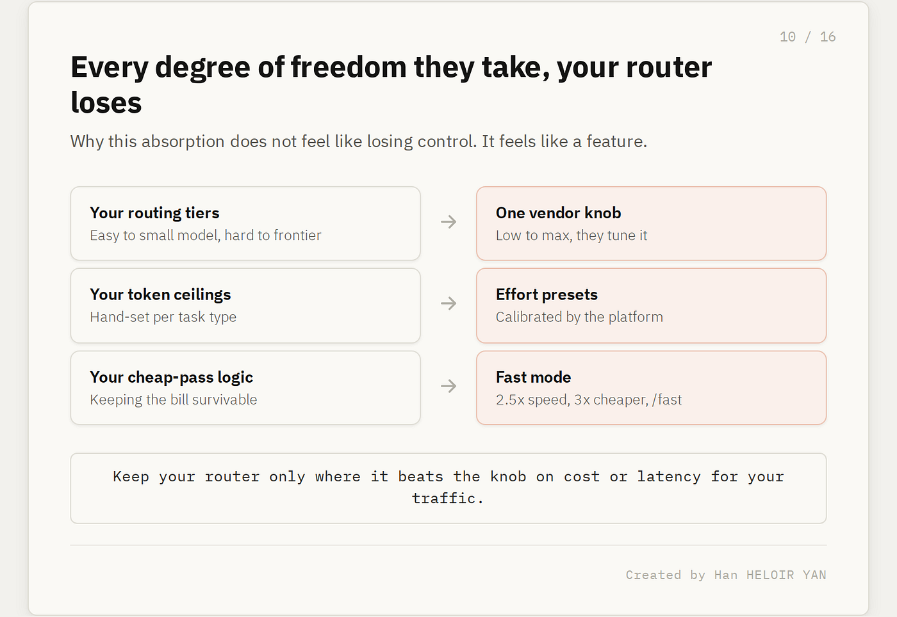

## 他们没有碰的那两层

这正是末日论式解读漏掉的部分。Anthropic 吸收了约束、执行和验证。它没有碰上下文（L2）或生命周期（L5），而这并非偶然。这两层是厂商在结构上无法拥有的，因为它们依赖于 Anthropic 看不见的东西。

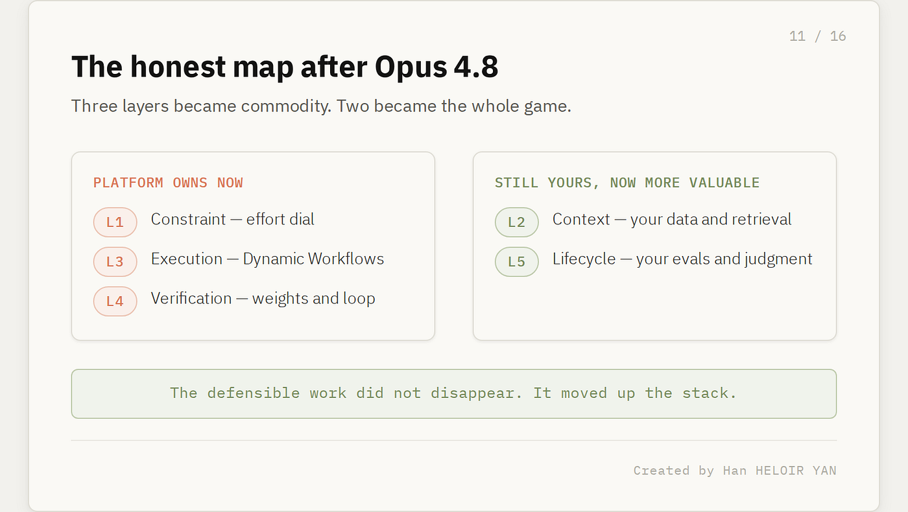

上下文是你放进窗口里的东西，而它高价值的那个版本，活在你的数据、你的检索策略、你的记忆设计和你的领域里。Opus 4.8 默认支持一百万 token 的上下文窗口，一份报告称其在一百万 token 处的长上下文检索为 68.1%，而 Opus 4.7 为 40.3%。那是一个更大、更清晰、有待布置的房间。它并不替你决定往里摆什么家具。决定那件事仍然是你的工程，而且如今更有价值，而非更没价值，因为房间变大了。

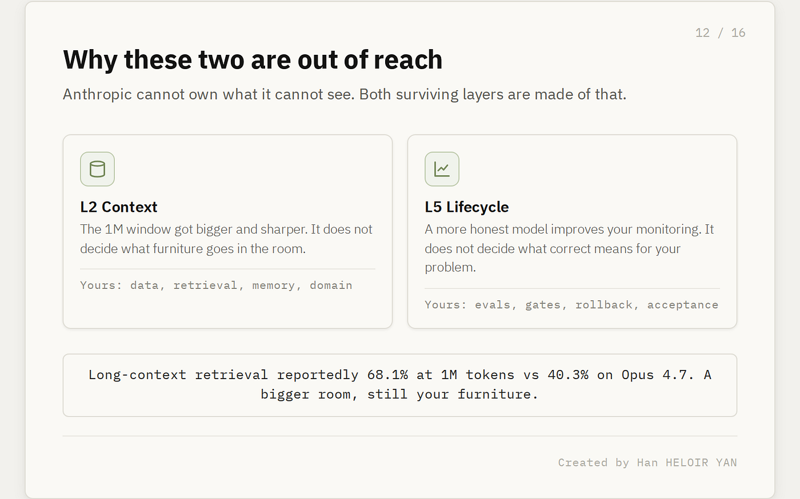

生命周期是围绕一次运行的一切，它编码了你对「这套系统是否真的在工作」的判断。你的评估套件就是你对你自己问题的「正确」的定义，而这不是模型自带的东西。你的部署关卡、你的监控、你的回滚计划、你的验收标准：所有这些都是「在你的语境下好长什么样」的制度性知识。一个会标记自身不确定性的更诚实的模型，会让你的监控变得更好。它不会替你决定该监控什么。

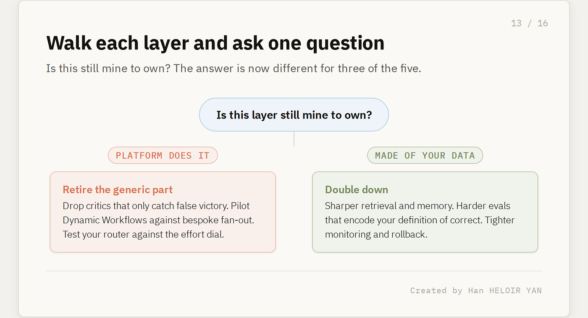

所以诚实的地图是这样的。三层一夜之间变成了大路货。两层变成了全部的胜负手。那些可防御的工作没有消失。它向技术栈的上方移动了，朝着那些由你的数据和你的判断构成、而非由你的管道构成的部分。

## 周一你到底该做什么

别因为这次替换毫无痛感，就忍不住什么都不做。模型的更换是微不足道的：把指向改成 `claude-opus-4-8`，或者用大窗口的 `claude-opus-4-8[1m]`，你的会话就继续跑。战略上的更换可不微不足道，而且它在成为一项建设工作之前，先是一项删除工作。

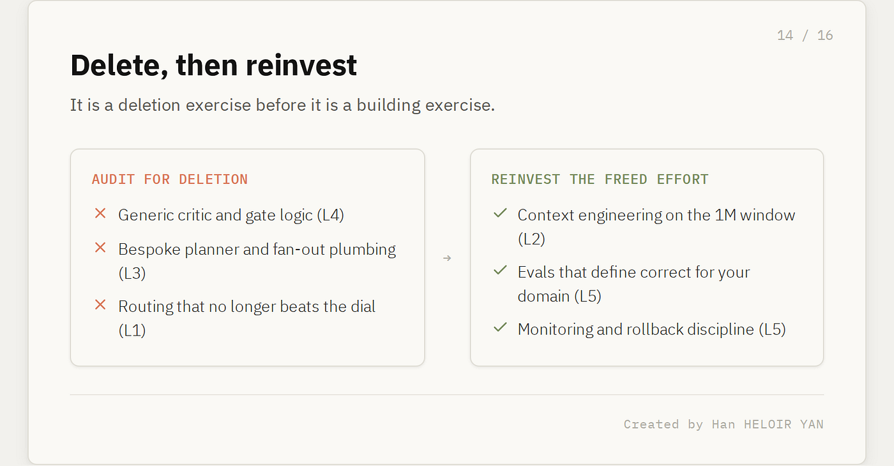

一层一层地走过你的 harness，在每一层问同一个问题：这还是该我自己拥有的吗。对验证，审计你的批评者与关卡逻辑，找出那些纯粹是为了抓模型谎报胜利而存在的部分，因为模型现在自己就承担了其中相当一份。保留那些编码了你领域规则的检查；退役掉通用的那些。对执行，如果你在维护定制的规划器与扇出管道，就在一次真实的迁移上让 Dynamic Workflows 与它对打，量一量你的代码是否还配得上它占的位置。对约束，让你的路由器与努力度旋钮对打，只在你的流量上、它在成本或延迟上能打败旋钮的地方，才保留你的路由。

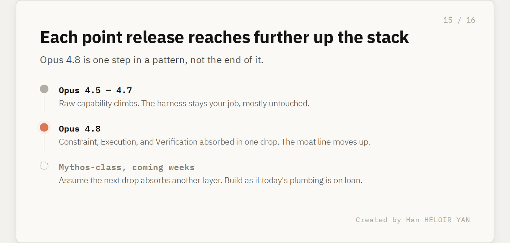

然后，把你腾出来的一切都花在如今成为你护城河的那两层上。把你的上下文工程磨得更利：更好的检索、更好的记忆、更好地利用那个一百万 token 的房间。把你的生命周期挖得更深：编码了「对你的问题而言正确意味着什么」的更硬的评估、更紧的监控、更快的回滚。差异化如今就活在那里，那也是下一次发布够不着的地方，因为 Anthropic 没有你的数据，也不知道你对「完成」的定义。

## 这条线会一直往前移

从单次发布退后一步，那个模式才是真正的故事。Opus 的每一个小版本发布，都往 harness 里多伸了一点。努力度控制、Dynamic Workflows 和诚实度的提升，是这次发布在技术栈上迈的三步，而它们不会是最后三步。Anthropic 已经放出了风声，称未来几周会有 Mythos 级别的模型。就当下一次发布会再吸收一层，并按照「你今天拥有的管道都是借来的」去构建。

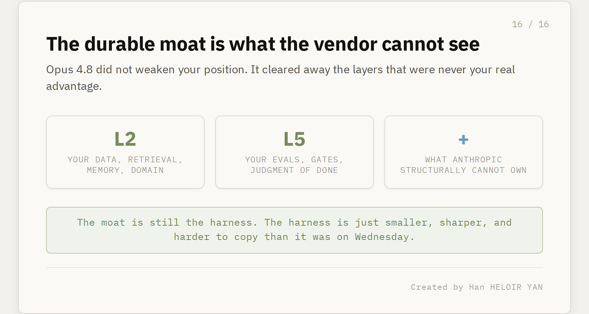

可持续的位置，是那个由厂商看不见的东西构成的位置。你的数据。你的领域。你的评估标准。你对「好长什么样」的判断。Opus 4.8 没有削弱那个位置。它清走了那些从来就不是你真正优势的层级，把所有人都推向那些才是优势的层级。护城河仍然是 harness。只不过这个 harness 比周三时更小、更利，也更难被复制了。

---

## 致谢与延伸阅读

- [Introducing Claude Opus 4.8](https://www.anthropic.com/news/claude-opus-4-8)，Anthropic。诚实度主张、努力度控制，以及 Dynamic Workflows「规划—派发—验证—汇报」循环的第一手来源。
- [Claude Opus 4.8 System Card](https://www.anthropic.com/claude-opus-4-8-system-card)，Anthropic。支撑那些头条数字的更广泛的对齐与能力评估，包括「未标记 bug 减少四倍」这一指标。
- [Anthropic releases Opus 4.8 with new dynamic workflow tool](https://techcrunch.com/2026/05/28/anthropic-releases-opus-4-8-with-new-dynamic-workflow-tool/)，TechCrunch。代码库级别迁移的说法，以及 Bridgewater 的现身说法。
- [Anthropic's Claude Opus 4.8 is here](https://venturebeat.com/technology/anthropics-claude-opus-4-8-is-here-with-3x-cheaper-fast-mode-and-near-mythos-level-alignment)，VentureBeat。快速模式的定价，以及自我验证子智能体的描述。

你可能还感兴趣的其他文章：

- [Anthropic Shipped Outcomes and Real Story Is Verification Becoming a SKU](https://medium.com/data-science-collective/anthropic-shipped-outcomes-and-real-story-is-verification-becoming-a-sku-085ab74d5203)
- [Opus 4.7 Is Absorbing Your Harness. Here's What You Should Let It Take.](https://medium.com/data-science-collective/opus-4-7-is-absorbing-your-harness-heres-what-you-should-let-it-take-e8e5562923e0)——自我验证的智能体、差异化的能力削减，以及 Anthropic 最新发布给所有人提出的真正问题。
- [Anthropic Just Shipped Three of the Five Harness Layers for Managed Agent](https://medium.com/data-science-collective/anthropic-just-shipped-three-of-the-five-harness-layers-for-managed-agent-and-the-other-two-are-on-14979cb4cf00)——这套 harness 栈模型会告诉你究竟哪些层该自己造、哪些该买、哪些你大概还缺。
- [The Schema Is the Product: An Architectural Reading of Karpathy's LLM Wiki](https://medium.com/data-science-collective/the-schema-is-the-product-an-architectural-reading-of-karpathys-llm-wiki-abf2fbb838c8)——Karpathy 发布了那个编译器，而 v2 用记忆来优化它。
- [Everyone Analyzed Claude Code's Features. Nobody Analyzed Its Architecture.](https://medium.com/data-science-collective/everyone-analyzed-claude-codes-features-nobody-analyzed-its-architecture-1173470ab622)——五十万行泄露的源代码揭示，AI 编码工具的护城河不是模型。
- [Cursor 3 Is Not an IDE Update. It's a Bet That You'll Manage Agents, Not Write Code.](https://medium.com/@han.heloir/cursor-3-is-not-an-ide-update-its-a-bet-that-you-ll-manage-agents-not-write-code-0d2bc51f0dcb)——Cursor 为何从零搭了一个新界面，2026 年 3 月的发布序列揭示了什么，以及对开发者意味着什么。
- [What Cursor Didn't Say About Composer 2 (And What a Developer Found in the API)](https://medium.com/data-science-collective/what-cursor-didnt-say-about-composer-2-and-what-a-developer-found-in-the-api-c67c31629c46)——基准测试很有创意。工程很扎实。模型 ID 却讲了另一个故事。
- [GPT-5.4 Came for Claude Code. The Real Story Is Bigger Than Both](https://medium.com/data-science-collective/gpt-5-4-came-for-claude-code-the-real-story-is-bigger-than-both-927059667584)——模型正在大路货化。战争转移到了运行时层。这对你的工作流意味着什么。
- [A Senior Engineer's Concern That Revealed the Most Important Role in Tech Right Now](https://medium.com/data-science-collective/i-just-watch-ai-write-code-all-day-f0f3fad2d857)——真正能交付的智能体系统。
- [The 89% Ceiling: Why Vector RAG is Failing and the Rise of Reasoning-Based Retrieval](https://ai.gopubby.com/the-89-ceiling-why-vector-rag-is-failing-and-the-rise-of-reasoning-based-retrieval-9c5fb16d7cac)——PageIndex 如何用层级树结构和 LLM 推理，在嵌入向量失效之处达到 98.7% 的准确率。
