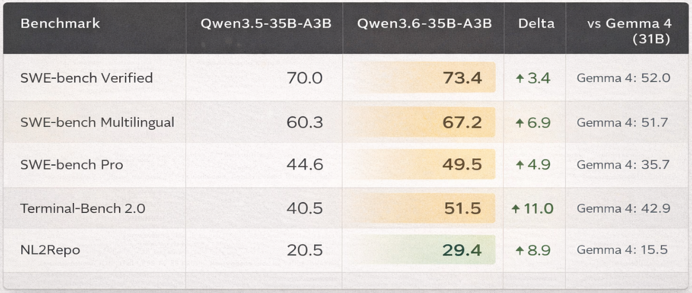
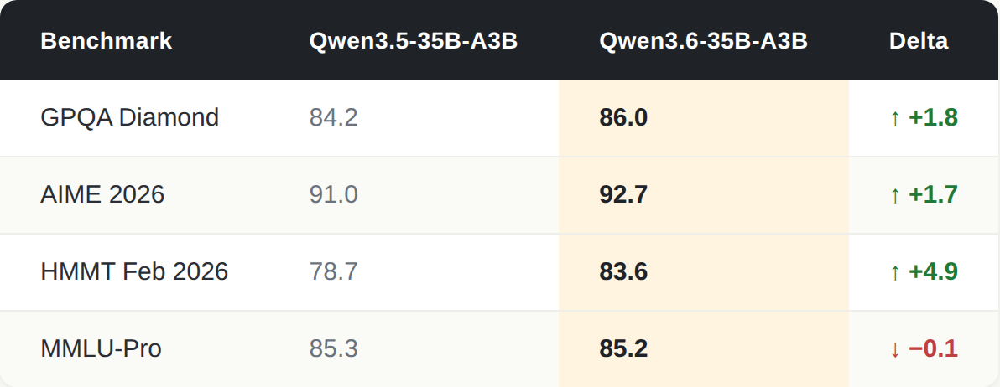
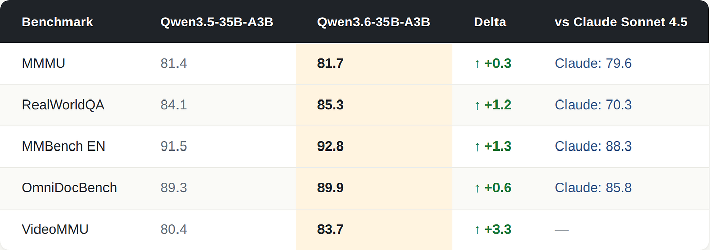
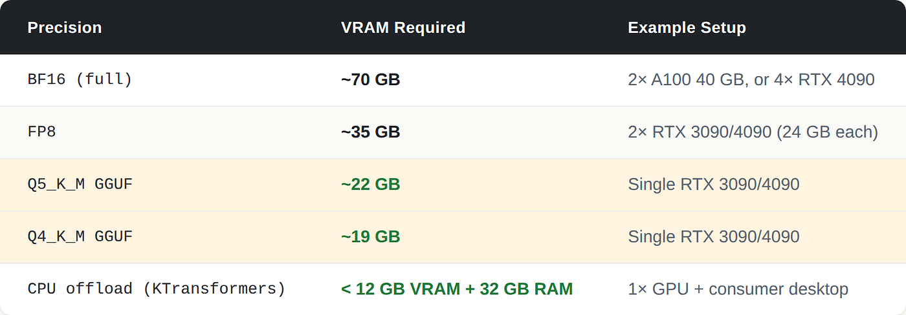
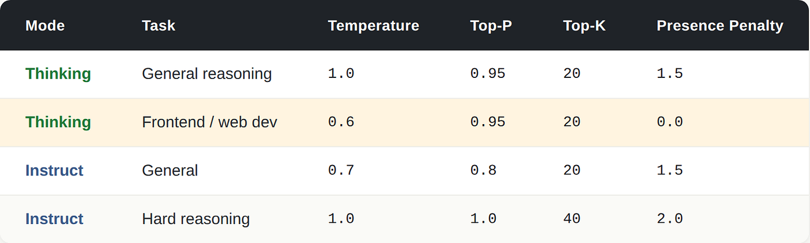

# 你的 AI 智能体只有金鱼记忆。[Qwen3.6–35B-A3B](https://qwen.ai/blog?id=qwen3.6-35b-a3b) 是解药。

> 作者：Mustafa Genc
> 发布日期：2026 年 4 月 21 日
> 原文链接：https://pub.towardsai.net/your-ai-agent-is-goldfish-brained-qwen3-6-35b-a3b-is-the-fix-b6a687c2094a

这次开源权重（open-weight）升级改变了智能体的推理方式——而一个新增参数的意义，超过所有基准（benchmark）数字加起来的总和。


你部署过的每一个 LLM 智能体（agent）都有一个它自己不会主动告诉你的问题。让它重构一个模块，进行三轮对话之后，再让它回过头审视前面的推理——你会看到它把两轮之前已经得出的结论从零开始重新推导一遍。模型并不会把自己的思考延续下去。每次回复结束，`<think>` 块就蒸发了，下一轮从一张白纸开始。智能是真实的，但走到这一步的记忆已经没了。

这就是金鱼脑问题。模型本身有能力，但在最需要状态化的地方——它自己的推理链——却是无状态的。

[Qwen3.6–35B-A3B](https://qwen.ai/blog?id=qwen3.6-35b-a3b) 由阿里巴巴在 2026 年 4 月发布，是 Qwen3.6 这一代里第一个开源权重模型。它使用的是和 [我之前那篇关于 Qwen3.5–35B-A3B 的文章](https://medium.com/@mustafa.gencc94/the-architecture-that-broke-the-scaling-myth-and-qwen-3-5-35b-a3b-model-e9580100627c) 中介绍过的同一套 35B 总量 / 3B 激活的混合架构——但从 3.5 到 3.6 的升级既不是把模型做得更大，也不是重新设计技术栈。它做的是修好那条金鱼。

如果你喜欢这篇文章，请鼓掌——如果你愿意慷慨一点，最多可以鼓 50 次掌 👏

## 你已经熟悉的基础（如果你是新手，请不要跳过）

Qwen3.6–35B-A3B 与 Qwen3.5–35B-A3B 共用同一副骨架。如果你想看完整的架构拆解——Gated DeltaNet 如何在长序列上避开二次方扩展、为什么线性注意力（linear attention）和完整 softmax 注意力（full softmax attention）之间 3:1 的混合比例是刻意设计而不是折中、以及 256 个专家如何把每个 token 路由给恰好 9 个激活的子网络——[那篇文章里有深入讲解](https://medium.com/@mustafa.gencc94/the-architecture-that-broke-the-scaling-myth-and-qwen-3-5-35b-a3b-model-e9580100627c)。

简短版本：模型存储 350 亿参数，每个 token 激活 30 亿参数；线性注意力（便宜、有状态）和完整 softmax 注意力（昂贵、精确）以滑动方式混合，分摊在 40 层之间。最终结果是：在适当量化（quantization）下，模型可以跑在单张 24 GB GPU 上，并且在实际编码任务上击败激活参数多出 7 倍的模型。

3.6 改变的是行为，不是骨架。

## Qwen3.6 实际带来的三件事

阿里巴巴把这次发布描述为"基于社区直接反馈构建"（[HuggingFace 模型卡](https://huggingface.co/Qwen/Qwen3.6-35B-A3B)）——这种说法在模型公告中并不常见。相对于 3.5 的差异是聚焦的而非全面的：

- 跨对话轮次的思考保留
- 用于加速推理的多 token 预测（Multi-Token Prediction）
- 更锐利的智能体编码与指令跟随

每一项写在 changelog 上都像是渐进改进。其中第一项，在实际使用中，会改变你组织智能体的方式。

## 思考保留：那个把笔记烧掉的侦探


标准的 LLM 推理在产生可见回复之前，会先生成一个隐藏的 `<think>` 块。那段推理痕迹——模型走过中间步骤、检查约束、对方案排序的过程——在回复发出的瞬间就被丢弃了。下一轮里，模型只剩下对话历史：问题、答案、工具输出。"我是怎么走到这里的"已经没了。

对单轮查询来说，这无关紧要。对一个跨 20 轮做增量调试的编码智能体来说，它是会累积的。模型会重新探索它已经标记过的领地，重新考虑它已经解决过的约束，有时甚至自相矛盾——因为它看不到自己曾经得出过那些结论。

想象一个侦探，每天结束时把案件笔记全烧掉，第二天只拿着访谈记录从头再来。访谈记录会告诉他发现了什么、谁说了什么，但不会告诉他为什么排除了哪条线索。他会重新调查那些已经被关闭的方向。

Qwen3.6–35B-A3B 引入了 `preserve_thinking`，一个把所有先前轮次的推理痕迹保留在当前上下文（context）里的参数。启用之后，模型不仅能看到自己说过什么，还能看到自己是如何推理出这一切的。对迭代式开发——增量重构、多步调试、长视野规划——这消除了一类"循环重复"失败，过去这些失败需要靠 prompt 工程才能绕过。

这个参数默认是关闭的。在默认模式（交错思考，interleaved thinking）下，只保留当前轮次的痕迹——上下文开销更低，对大多数任务足够。启用保留：

```python
from openai import OpenAI
client = OpenAI(api_key="EMPTY", base_url="http://localhost:8000/v1")
# Multi-turn agent - the model sees its own prior reasoning on each new turn
conversation = [
    {"role": "user", "content": "Add rate limiting to this FastAPI endpoint:\n\n@app.get('/data')\ndef get_data():\n    return db.query_all()"}
]
turn1 = client.chat.completions.create(
    model="Qwen/Qwen3.6-35B-A3B",
    messages=conversation,
    max_tokens=32768,
    extra_body={
        # Reasoning trace from this turn is kept in context for turn 2+
        "chat_template_kwargs": {"preserve_thinking": True},
    },
)
conversation.append({"role": "assistant", "content": turn1.choices[0].message.content})
# Turn 2 - model sees its prior reasoning, not just its answer
conversation.append({
    "role": "user",
    "content": "Now return a custom JSON error body when the limit is exceeded."
})
turn2 = client.chat.completions.create(
    model="Qwen/Qwen3.6-35B-A3B",
    messages=conversation,
    max_tokens=32768,
    extra_body={"chat_template_kwargs": {"preserve_thinking": True}},
)
```

有一个约束：推理痕迹很啰嗦。一个 15 轮的智能体会话，启用 `preserve_thinking` 之后，光是推理本身就可能吃掉 5 万到 8 万 token 的上下文预算，这还没算上代码、工具输出或文档上下文。会话超过约 10 轮时，要刻意规划上下文窗口（context window）——或者在你的智能体循环里加入对较旧痕迹的选择性截断。

## 多 token 预测：模型不变小但变得更快


标准的自回归解码（autoregressive decoding）严格是串行的。模型做一次完整前向传播，预测一个 token，把它附加到上下文中，然后再做一次完整前向传播预测下一个。对一个 350 亿参数的模型来说，这很贵——更糟的是，每次前向传播过程中 GPU 大部分时间都是闲置的。单 token 生成填不满硬件设计中的并行计算单元。你掏了法拉利的钱，却挂着一档开。

多 token 预测（Multi-Token Prediction，MTP）改变了工作的形状。在训练阶段，Qwen3.6 不仅学会预测下一个 token，还学会用共享同一内部表示的额外输出头同时预测若干个未来 token。在推理时，这就启用了推测解码（speculative decoding）：模型用一个便宜的步骤先草拟出后面几个 token，然后用主模型的一次前向传播把它们一并验证。如果草稿与模型本来会选择的内容一致，它们会被批量接受、一次性附加进去；如果某些草稿是错的，就会被拒绝并修正。在接受率高的运行中，你能用一次前向传播的代价拿到 2~3 个 token。

打个比方：一个写作者一次草拟一整个短语，只有当编辑反对时才收回。在结构化输出——代码、JSON、markdown——里，绝大多数短的续写是足够可预测的，编辑很少反对。`def` 后面几乎一定跟函数名。`"key":` 后面跟着一个值。模型押注于它已经熟悉的模式，而这一注通常会兑现。

让 Qwen3.6 的 MTP 比老式推测解码更可靠的原因是：草稿模型就是目标模型。早期的推测设置使用一个独立的小型草稿模型生成猜测，这造成了分布不匹配——小模型的预测往往与大模型本来会选的不一致，于是草稿被拒绝、算力被浪费。MTP 用同一套即将参与验证的权重自我起草，分布对齐，接受率因此高得多。

吞吐增益与具体工作负载相关。推理密集的输出——长 `<think>` 块后跟着结构化答案——受益最多，因为结构化文本熵低，草稿经常被接受。开放式创作型生成受益较少，因为下一个 token 真的可能是任何东西时，草稿会更频繁地被拒绝，最终又退回到普通的单 token 解码。

vLLM 启用 MTP 推测解码：

```bash
vllm serve Qwen/Qwen3.6-35B-A3B \
  --port 8000 \
  --tensor-parallel-size 4 \
  --max-model-len 262144 \
  --reasoning-parser qwen3 \
  --speculative-config '{"method":"qwen3_next_mtp","num_speculative_tokens":2}'
```

`num_speculative_tokens: 2` 这个参数控制模型每步往前草拟多少个 token。调高（3 或 4）会在草稿被接受时带来更大的潜在加速，但更长草稿序列里所有 token 都符合目标分布的概率呈几何级下降——推得太远，你就会在被拒绝的猜测上浪费算力。对大多数工作负载来说，2 是平衡的默认值；如果你的输出高度结构化，3 值得一试。

SGLang（当 MTP 吞吐是首要优先级时推荐——它使用基于树的推测方案，并行起草多条候选分支，以略高的验证开销换取更高的接受率）：

```bash
python -m sglang.launch_server \
  --model-path Qwen/Qwen3.6-35B-A3B \
  --port 8000 \
  --tp-size 4 \
  --context-length 262144 \
  --reasoning-parser qwen3 \
  --speculative-algo NEXTN \
  --speculative-num-steps 3 \
  --speculative-eagle-topk 1 \
  --speculative-num-draft-tokens 4
```

## 基准差异：从 3.5 升到 3.6 究竟买到了什么


下面所有分数都来自阿里巴巴自己的 [HuggingFace 模型卡](https://huggingface.co/Qwen/Qwen3.6-35B-A3B)——自报数据，单一来源。截至发稿，没有独立第三方对其结果的复现。Gemma 4（31B）的对比列同样来自阿里巴巴在自家 harness 上的复现，并非 Google 自己的报告——Google 公开的 Gemma 4 基准聚焦于 AIME、LiveCodeBench、GPQA，而不是 SWE-bench。这些数字是方向性的，不具备权威性。

### 编码与智能体任务



[Terminal-Bench 2.0](https://www.tbench.ai/)（+11 分）和 [NL2Repo](https://llm-stats.com/benchmarks/nl2repo)（+8.9）是涨幅最显著的两项。它们都衡量的是终端环境与多文件仓库任务中的实际智能体行为——比头条上的 SWE-bench Verified 数字更贴近生产编码智能体真正会遇到的场景。SWE-bench Verified 上 +3.4 的差距虽有意义但不算大；真正的故事在那些应用类基准里。

外部参照：73.4% 的 SWE-bench Verified 比 [Claude Opus 4.7](https://www.anthropic.com/news/claude-opus-4-7)（87.6%，Anthropic 自报）大约低 14 分，比上一代 [Opus 4.6](https://www.anthropic.com/news/claude-opus-4-6)（80.8%）大约低 7 分。与前沿的差距是真实存在的，但 Qwen3.6 在 Apache 2.0 许可下跑在你自己的硬件上——这与云端托管的闭源模型是不同的价值主张。

73.4% 的 SWE-bench Verified 比 Claude Opus 4.6（80.9%，Anthropic 自报）大约低 7 分。差距在缩小，并且 Qwen3.6 是在你自己拥有的硬件上、以 Apache 2.0 许可运行。

### 知识与推理



[MMLU-Pro](https://huggingface.co/spaces/TIGER-Lab/MMLU-Pro) 几乎没动。这不是一个在通用知识检索上有提升的模型。增益集中在竞赛数学和研究生水平科学条件下的推理。MMLU-Pro 的持平不是回归——它反映的是不同的优化目标。

### 视觉与多模态（Qwen 自报；见下方说明）



视觉方面是渐进式的提升。文档理解（OmniDocBench 89.9%）和视频推理（VideoMMU 83.7%）是面向企业文档流程和长视频分析的实际目标。

关于 Claude Sonnet 4.5 那一列有一点要说明：这是阿里巴巴在自家评测 harness 上的复现，并非 Anthropic 自报数字。例如，Anthropic 自己给 Sonnet 4.5 报的 MMMU 是 77.8%，而不是这里的 79.6%。跨厂商的多模态对比很少使用一致的评测条件，prompt 模板、图像预处理或评分流水线的微小差异就能让分数移动几个点。把 Claude 这一列当作方向性参照，而不是逐项对比的最终结论。

## 架构速览

如果你已经看过 [Qwen3.5 拆解](https://medium.com/@mustafa.gencc94/the-architecture-that-broke-the-scaling-myth-and-qwen-3-5-35b-a3b-model-e9580100627c)，可以跳过这一节。

混合注意力结构与 Qwen3.5 完全一致，所以这里我会写得简短——但足够让你不必跳到另一篇也能看懂。

模型有 40 层，组织成 10 组、每组 4 层的重复结构。每一组都遵循同样的节奏：三个 GatedDeltaNet 块后接一个 GatedAttention 块。两类块都搭配了一个混合专家（Mixture-of-Experts，MoE）前馈步骤，所以一整组看起来是这样：

`[DeltaNet + MoE] [DeltaNet + MoE] [DeltaNet + MoE] [FullAttention + MoE]`

3:1 的比例就是注意力设计的全部故事。

DeltaNet 层负责便宜的活儿。标准注意力之所以贵，是因为每个 token 都要和序列中其他每个 token 比较——这就是著名的 O(n²) 代价，让长上下文慢得难以承受。DeltaNet 用线性注意力绕过了这一点：它不做两两比较，而是携带一个紧凑的"状态"来概括到目前为止的序列，并随着每个新 token 的到来选择性地更新这个状态。计算量按 O(n) 而不是 O(n²) 增长。sigmoid 门控机制决定的是：对每个 token，状态的哪些部分要更新、哪些要保留——可以把它想成一个学到的过滤器，告诉你"留下这段记忆，覆盖那一段"。这就是 DeltaNet 能在你买得起的硬件上处理 262K token 上下文的关键。

每一组末尾的全注意力层负责精确的活儿。线性注意力快，但把序列压成一个滚动状态是有代价的：细粒度的位置精度。在代码和结构化推理里——"这个括号闭合的是 47 行之上的那个括号"必须丝毫不差——这种损失会带来麻烦。每组末尾那个单一的 GatedAttention 块是一次完整的 O(n²) 注意力传递，在下一组开始前重新锚定位置细节。三层便宜的层承担大头工作，一层昂贵的层让模型保持诚实。

接下来是 MoE 部分，35B 与 3B 这两个数字就是从这里来的。

每一个前馈步骤都把 token 路由进一个由 256 个专家子网络组成的池子。对每个 token，一个学到的路由器根据 token 的样子动态挑选 8 个专家。在这 8 个之上，还有 1 个共享专家，对所有 token 一视同仁——一种始终在线的通用层，处理所有输入共有的内容。所以每个 token 实际激活 9 个专家；其余 247 个则在内存中保持空闲。

这就是为什么模型被描述为"35B 总量、3B 激活"。所有 350 亿参数都被存储（加载到 GPU，或卸载到 CPU 内存），但任何一次给定的前向传播只触及大约 30 亿。你以小模型的推理代价，得到一个大模型的表示能力——正是这个核心权衡，让这套架构能部署在单张 24 GB GPU 上。

更深入的机制——为什么 3:1 的混合比例是 3:1，而不是 2:1 或 5:1；sigmoid 门在数值层面对激活到底做了什么；以及路由器如何学会在专家之间分配工作而不会塌缩到偏爱少数几个——见 [The Architecture That Broke the Scaling Myth](https://pub.towardsai.net/your-ai-agent-is-goldfish-brained-qwen3-6-35b-a3b-is-the-fix-b6a687c2094a#)。

## 上下文窗口：原生 262K，需要时可达 1M

原生上下文是 262,144 token。在 serving 命令里加上 `--max-model-len 262144` 之外不需要其他配置。对绝大多数真实工作负载——包括大型文档处理、多文件代码仓库和长智能体会话——262K 都已经绰绰有余。

## YaRN 实际做了什么

在配置之前，先了解你打开的是什么。Transformer 用 [RoPE（Rotary Position Embedding，旋转位置编码）](https://medium.com/@mustafa.gencc94/series-transformers-llms-part-5-c19751ba2821) 来追踪 token 位置——每个位置被分配一个独特的旋转"角度"，模型学着解读这些角度以理解词序。问题在于：模型只认识它训练时见过的角度范围。喂给它一个超过 262K token 的序列，位置角度就进入它从未见过的领域，输出会崩塌成胡言乱语。

YaRN（Yet another RoPE extensioN）不需要重新训练就能解决这个问题。它不教模型新的角度，而是把现有角度重新缩放——压缩它们，让更长的序列能塞进模型已经理解的角度范围内。一个简单的类比：你有一把刻度从 0 到 262 厘米的尺子，需要测量一个 1000 厘米长的物体。你可以买一把更长的尺子（重新训练模型——昂贵），也可以把每一厘米刻度重新解读为代表 4 厘米（应用 factor 为 4.0 的 YaRN）。尺子没变，你只是换了种读法。

让这件事并不简单的是其代价。重新缩放后的角度并不是模型训练时所学到的角度，所以即便在原本的 262K 范围内，每一个位置在模型看来都略显"陌生"。这会在短输入上带来可测量的质量下降——模型现在把一段 10K token 的输入解读成位置散落在一个被拉伸过、它从未充分学习过的坐标系上。factor 越大，重新缩放越激进，短输入的质量损失也越严重。

## 静态 YaRN 问题

YaRN 缩放在 factor 为 4.0 时把上下文扩展到约 1,010,000 token。[Qwen3-Next 官方模型卡](https://huggingface.co/Qwen/Qwen3-Next-80B-A3B-Instruct) 显式标注了一个延续到 Qwen3.6 这一代的注意事项：所有主流开源 serving 框架实现的都是静态 YaRN——无论实际输入长度如何，缩放因子都统一施加。[vLLM recipe 文档](https://docs.vllm.ai/projects/recipes/en/latest/Qwen/Qwen3.5.html) 确认 Qwen3.5 与 Qwen3.6 的部署都是同样的 serving 行为。

如果你大多数输入是短的（小于 32K token），但为了偶尔的长文档处理打开了 YaRN，你将在数量远多于长输入的短输入上承担质量下降。数学上对你不利：单次请求小幅的质量损失，乘以成千上万次短请求，通常会盖过偶尔在同一 server 上能处理百万 token 文档所带来的好处。

模型卡上的建议是：只有在确实需要长上下文处理时才修改 `rope_parameters`，并把 factor 调到与你典型的输入长度匹配。`factor: 2.0` 把上下文扩展到大约 524K token，重缩放惩罚比 `factor: 4.0` 温和得多——更适合那些偶尔需要长上下文、但通常不会触及百万 token 大关的混合工作负载。

## YaRN 与 vLLM

```bash
VLLM_ALLOW_LONG_MAX_MODEL_LEN=1 vllm serve Qwen/Qwen3.6-35B-A3B \
  --hf-overrides '{
    "text_config": {
      "rope_parameters": {
        "rope_type": "yarn",
        "factor": 4.0,
        "original_max_position_embeddings": 262144
      }
    }
  }' \
  --max-model-len 1010000
```

## 双实例模式

对那些需要处理混合长度工作负载的路由架构，最干净的方案是部署两个实例——一个原生 262K、不开 YaRN，一个开启 YaRN——并在推理时按估算的输入长度路由。低于约 200K 的请求走原生实例、保持完整质量；高于该阈值的请求走 YaRN 实例，那里重缩放惩罚是可以接受的，因为另一个选择是失败。

听起来是额外的基础设施，但只要吞吐和回复质量都重要，静态 YaRN 在短输入上的惩罚就足以正当化这种拆分。一个开启 YaRN 的实例服务所有请求是更简单的部署，但对任何输入分布并非以百万 token 为主的工作负载来说，这都是错误选择。

## 你到底需要什么硬件



官方 FP8 检查点发布在 [Qwen/Qwen3.6-35B-A3B-FP8](https://huggingface.co/Qwen/Qwen3.6-35B-A3B-FP8)。FP8 相比 BF16 把显存占用减半，质量损失极小——如果你有两张 24 GB GPU 并希望保留接近完整的模型保真度，这是最干净的选项。

对更小的硬件，你需要 [GGUF](https://github.com/ggml-org/llama.cpp/blob/master/docs/gguf.md) 量化。GGUF 是 [llama.cpp](https://github.com/ggml-org/llama.cpp) 生态使用的统一单文件格式。它把模型权重、tokenizer 和元数据打包进一个二进制文件，并且——更重要的是——支持激进的权重量化方案（4 bit、5 bit、8 bit 变种），用少量输出质量换取显著的内存削减。一个在 BF16 下需要约 70 GB 的 35B 模型，可以以 4 bit GGUF 的形式塞进不到 20 GB，代价是大多数基准上掉几个点。

[Unsloth 团队](https://unsloth.ai/) 在 [unsloth/Qwen3.6-35B-A3B-GGUF](https://huggingface.co/unsloth/Qwen3.6-35B-A3B-GGUF) 发布了经过测试的 GGUF 构建，使用他们的 Dynamic 2.0 量化方法——[在 22 个模型尺寸里有 21 个的平均 KL 散度（KL divergence）上达到 SOTA](https://unsloth.ai/docs/models/qwen3.6)，意味着他们的量化输出比其他方案更贴近原始 BF16 模型。常见量化等级的实际取舍：

- Q4_K_M（约 19 GB）——可以塞进单张 RTX 3090/4090，质量有轻度下降（在严苛的编码基准上预计掉几个点）
- Q5_K_M（约 22 GB）——24 GB 消费级 GPU 上 quality-per-GB 的甜蜜点；质量接近 FP8
- Q8_0（约 37 GB）——近乎无损，但在这个尺寸级别下你不如直接用官方 FP8 检查点
- UD-Q2_K_XL（约 12 GB）——2 bit Unsloth Dynamic 量化；用于工具调用流程意外地可用，但不推荐用于长推理链

[KTransformers](https://github.com/kvcache-ai/ktransformers) 走的是另一条路：CPU 卸载。像 Qwen3.6 这样的 MoE 稀疏模型从中受益比稠密模型更多，因为架构本身的工作方式——256 个专家里每个 token 只激活 9 个，所以在任意时刻另外 247 个都在内存里闲着。KTransformers 利用了这一点：只把路由器和共享专家固定在 GPU 显存中，把剩下 200 多个空闲专家保留在系统内存里。当路由器为某个 token 挑出专家后，需要的权重再按需从内存搬到 GPU。

代价是吞吐——由于 RAM 到 VRAM 的传输开销，你能看到的 tokens/秒会低于全 GPU 部署。但 35B 模型的显存占用降到 12 GB 以下，让消费级桌面（一张普通 GPU + 32 GB 内存）成为一个可行的部署选项。如果你是在本地做实验而不是为生产吞吐而部署，KTransformers 是解锁最广硬件范围的那条路。

## 完整代码参考

基础推理，启用思考模式：

```python
from openai import OpenAI
client = OpenAI(api_key="EMPTY", base_url="http://localhost:8000/v1")
response = client.chat.completions.create(
    model="Qwen/Qwen3.6-35B-A3B",
    messages=[
        {"role": "user", "content": "Refactor this to handle null inputs:\n\ndef parse_config(data):\n    return data['key']['nested']"}
    ],
    max_tokens=81920,
    temperature=1.0,     # recommended for thinking mode - higher temp improves reasoning diversity
    top_p=0.95,
    extra_body={"top_k": 20, "presence_penalty": 1.5},
)
# Response includes the <think>...</think> block followed by the final answer
print(response.choices[0].message.content)
```

关闭思考（更快，用于生产指令任务）：

```python
response = client.chat.completions.create(
    model="Qwen/Qwen3.6-35B-A3B",
    messages=[{"role": "user", "content": "Extract all email addresses from this text: ..."}],
    max_tokens=32768,
    temperature=0.7,     # lower temp is correct here — instruct tasks benefit from determinism
    top_p=0.8,
    extra_body={
        "top_k": 20,
        "presence_penalty": 1.5,
        "chat_template_kwargs": {"enable_thinking": False},
    },
)
```

图像输入（文档理解、图表分析）：

```python
response = client.chat.completions.create(
    model="Qwen/Qwen3.6-35B-A3B",
    messages=[{
        "role": "user",
        "content": [
            {
                "type": "image_url",
                "image_url": {"url": "https://your-host/architecture-diagram.png"}
            },
            {
                "type": "text",
                "text": "What design pattern does this diagram show? List every component and describe how data flows between them."
            }
        ]
    }],
    max_tokens=32768,
    temperature=0.7,
    top_p=0.8,
)
```

按任务推荐的采样参数（来自模型卡）：



针对编码场景的温度下调（0.6 vs 1.0）是有意为之的：前端代码生成受益于更紧的 token 分布，因为合法语法的空间是窄的。更低温度会减少生成"语法合法但模式错误"的代码。

## 反方观点与未知

所有基准都由阿里巴巴自报。截至发稿，没有独立第三方对 Qwen3.6–35B-A3B 分数的复现。QwenClawBench、QwenWebBench 和 NL2Repo 是内部评测——阿里巴巴同时控制基准的构造与执行评测。Terminal-Bench 2.0 与 SWE-bench 是外部基准，但方法学选择（脚手架、温度、重试次数）对结果的影响足够大，跨模型比较若要有意义就必须保持条件一致。

没有训练披露。预训练语料、训练算力、训练数据截止日期，以及训练后对齐方法（RLHF、DPO 或其他）都没有记录。模型卡和博客文章讨论的是能力，而不是这些能力是怎么得到的。

没有论文。从 3.5 到 3.6 各项具体改动的设计动机——包括是什么促成了思考保留特性、是什么训练改动推高了 Terminal-Bench——无法被审视。Terminal-Bench +11 分的提升要么是真的改进，要么反映了基准过拟合；缺少训练细节，无法分辨这两者。

`preserve_thinking` 有上下文成本。冗长的推理痕迹会迅速堆积。一个 20 轮的智能体会话在启用 `preserve_thinking` 后，光是推理就可能耗掉 8 万到 10 万 token 的上下文预算，这还没算代码或工具输出。这不是不该用这个特性的理由——这是把上下文预算管理嵌入到智能体循环里的理由。

静态 YaRN 是真实的限制。模型卡显式标出了这一点。在混合工作负载中为偶尔的长文档全局开启 YaRN 的部署，会在短输入上看到质量下降。如果这点对你重要，按上下文长度路由。

3.5→3.6 的差异是聚焦的，不是普遍的。MMLU-Pro 没有提升。标准知识检索和通用对话质量没有显著变化。Qwen3.6 是更好的智能体、更好的推理者；它并不是比 3.5 更好的通用助手。

## 这对你意味着什么

给今天部署这个模型的工程师三个实用要点：

第一，针对你具体的智能体任务来基准测试 `preserve_thinking`。这个特性在架构层面是有动机的——不是 prompt 把戏——而它在迭代式调试任务上带来的质性差异是可测量的。对多轮编码智能体，这是这次发布中最有影响力的特性。在模型需要跨轮跟踪约束的会话里启用它；在孤立单轮推理时关掉它以节省上下文预算。

第二，如果吞吐是约束，使用 SGLang + MTP 推测解码。推理类模型在 `<think>` 块上花掉很大一部分推理预算。MTP 推测解码恰好在那些推测准确率最高的输出模式（结构化代码、JSON、受限文本）里恢复吞吐，且不损失质量。MTP 自起草的方式避免了影响外部草稿模型的分布不匹配问题。

第三，Apache 2.0 许可让这个模型成为生产智能体工作负载的认真选项。在两张消费级 GPU 上运行、以无限制商业许可发布、SWE-bench Verified 73.4%（自报），这与云端托管的专有模型是不同的价值主张。与当前前沿——Claude Opus 4.7 的 87.6%、GPT-5.3-Codex 的 85.0%——之间的差距是真实的，但对大多数生产用例并非不可接受，尤其当你考虑到本地推理、没有按 token 计费，以及对部署环境的完全控制时。

## 来源

- [Qwen3.6–35B-A3B — HuggingFace Model Card](https://huggingface.co/Qwen/Qwen3.6-35B-A3B) — 架构规格、基准、采样参数、`preserve_thinking` 文档、YaRN 配置与 serving 示例
- [Qwen3.6 Blog Post — qwen.ai](https://qwen.ai/blog?id=qwen3.6-35b-a3b) — 发布公告、动机与社区反馈框架
- [Qwen3.6 GitHub Repository](https://github.com/QwenLM/Qwen3.6) — 官方仓库、serving 命令与 BibTeX 引用
- [Qwen3.5–35B-A3B — HuggingFace Model Card](https://huggingface.co/Qwen/Qwen3.5-35B-A3B) — 用于差异比较的 3.5 基线分数
- [Qwen3-Next-80B-A3B-Instruct — HuggingFace Model Card](https://huggingface.co/Qwen/Qwen3-Next-80B-A3B-Instruct) — 静态 YaRN 注意事项与 RoPE 缩放配置的主要来源，沿用至 Qwen3.6 一代
- [vLLM Qwen3.5 & Qwen3.6 Usage Guide](https://docs.vllm.ai/projects/recipes/en/latest/Qwen/Qwen3.5.html) — 两代模型的官方 serving 配方，包括 MTP 推测解码与 YaRN 配置
- [Unsloth Qwen3.6 Documentation](https://unsloth.ai/docs/models/qwen3.6) — GGUF 量化基准、运行指南与各量化等级的 KL 散度分析
- [Unsloth Qwen3.6–35B-A3B-GGUF](https://huggingface.co/unsloth/Qwen3.6-35B-A3B-GGUF) — 硬件章节中引用的经过测试的 GGUF 构建
- [Qwen3.6–35B-A3B-FP8](https://huggingface.co/Qwen/Qwen3.6-35B-A3B-FP8) — 官方 FP8 检查点
- [Introducing Claude Opus 4.6 — Anthropic](https://www.anthropic.com/news/claude-opus-4-6) — SWE-bench Verified 比较的参考点（Opus 4.6：80.8%）
- [Introducing Claude Opus 4.7 — Anthropic](https://www.anthropic.com/news/claude-opus-4-7) — Anthropic 当前旗舰，用于更新差距背景
- [The Architecture That Broke the Scaling Myth (Qwen3.5–35B-A3B)](https://medium.com/@mustafa.gencc94/the-architecture-that-broke-the-scaling-myth-and-qwen-3-5-35b-a3b-model-e9580100627c) — GatedDeltaNet 与 MoE 架构深度解读（本文作者，2026 年 3 月）
- [vLLM Blog: Qwen3-Next Hybrid Architecture Support](https://blog.vllm.ai/2025/09/11/qwen3-next.html) — 延续到 Qwen3.6 的 GatedDeltaNet 血统的 serving 框架背景
