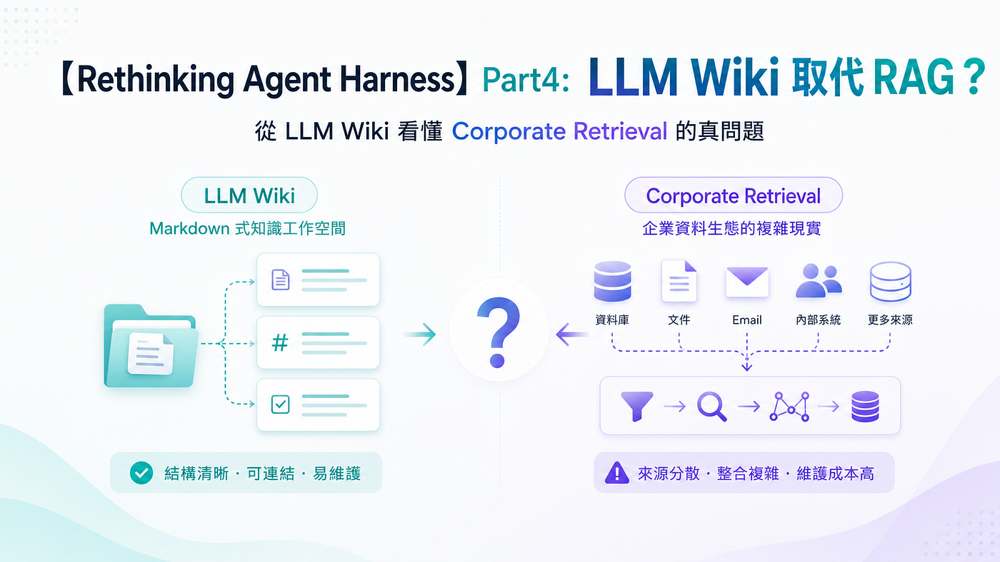
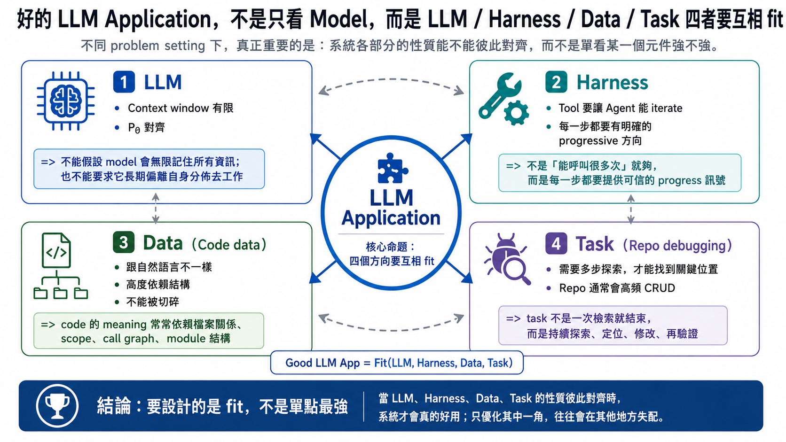
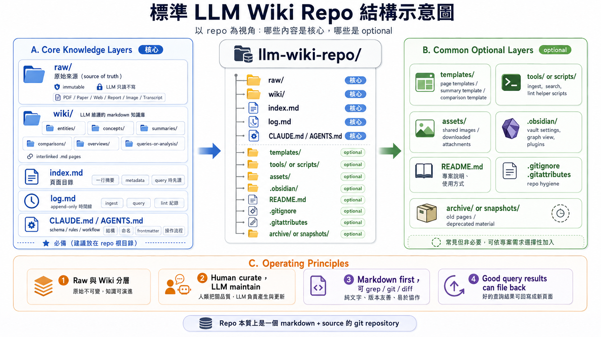
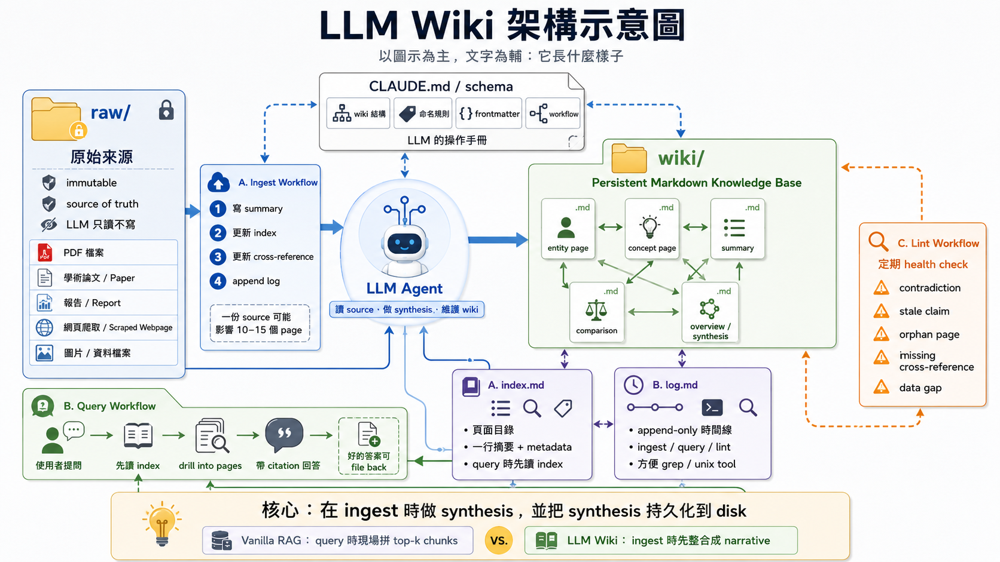
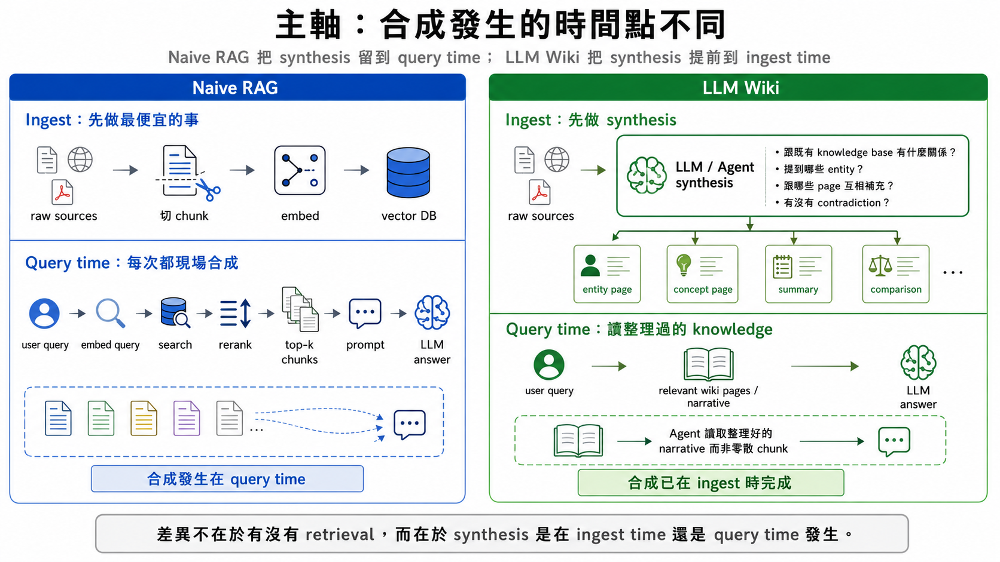
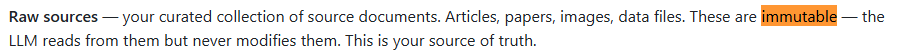
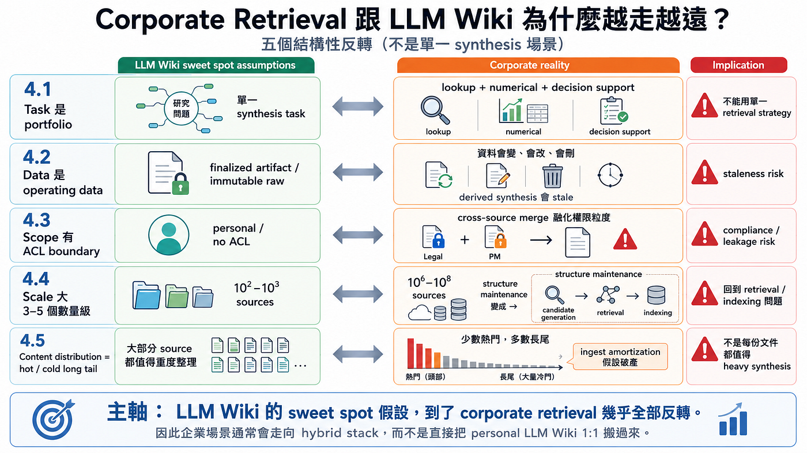
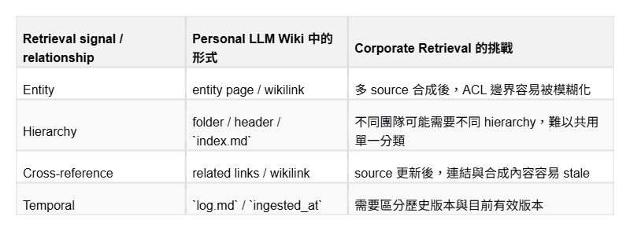

> 作者：倢恺 Oscar
> 发布日期：2026 年 6 月 2 日
> 原文链接：https://medium.com/@axk51013/rethinking-agent-harness-part4-llm-wiki-%E5%8F%96%E4%BB%A3-rag-041629319804

# 【Rethinking Agent Harness】Part4：LLM Wiki 取代 RAG ？

## 从 LLM Wiki 看懂 Corporate Retrieval 的真问题



今天来到 Rethinking Agent Harness 系列的第四篇，这一篇会解读大家最关注的 LLM wiki 这个概念 XD，甚至可以说前面三篇都是在为这一篇铺路。还没看过的朋友建议至少先把 Part2、Part3 读完，再回来看本文会更容易理解整体思路。

[【Rethinking Agent Harness】Part 2：理解 Skill 之美 — 从 Function Calling 的失败模式，看 Skills 背后的设计逻辑](https://axk51013.medium.com/)

[【Rethinking Agent Harness】Part 3：为什么 Grep 打败了 RAG？— 从 Repo-level Debugging 出发，理解 Coding Agent 为什么收敛到 File System](https://axk51013.medium.com/)

在前面三篇文章里，笔者其实一路都在处理同一件事：LLM 应用不是只有 model 本身，还有 model 被什么 harness 包起来、面对什么 data、要解什么 task。

因此我们要讨论任何 LLM 技术、LLM 应用时，都应该同时从 LLM、Harness、Data、Task 四个维度综合讨论（如下图），而只要任何一个方面理解不够深入，就很容易得到错误的结论。



前一篇我们特别举了「为什么到 Repo Level debugging 时，Grep 对于 Claude Code 会比 RAG 更好用」这个例子，作为整个系列里第一篇完整分析这四个 fit 的案例。

File system 之所以在 coding agent 里胜出，不是因为它更传统，也不是因为它更简单，而是因为它刚好同时打中四个条件：

- LLM 对 filesystem 操作很熟悉，包括指令、错误修正、使用方法。
- Claude Code Harness 把 Glob / Grep / Read 包成可以被简单调用的 iterative tool，所以 Grep 的使用对 Harness 也更自然。
- code data 本来就存在 filesystem 里，而且是最高标准的 Single Source of Truth。
- repo-level debugging 又天然需要多步探索。

.

而因为 File system 在 coding 场景表现实在太好，一个常见的错误延伸就是「那所有场景我们都用 Grep、File system 就好了」。

但这个结论其实有一个没有被检验的隐性前提：Part 3 整套推导只在 coding agent 这个场景（Task）验证过。

更精准地说，coding agent 不是 task 本身最简单，而是 **fit 轴线最干净** 的场景：data surface 单一、harness primitive 明确、task boundary 相对可控、scale 通常落在单一 repo。这让我们很容易得到一个漂亮结论：filesystem-native retrieval 很适合 agent。

🤔🤔 File system 是不是真的在更多 Task 场景下都可以统一适用、更优，则是本文重点要讨论的问题。

.

而这个主题最值得讨论的对象，就是 Andrej Karpathy 发出的 LLM Wiki gist。这个 gist 把 LLM Wiki 定义成一个「用 LLM 建立 personal knowledge base」的方案，并且明确说这是一份 idea file，可以 copy 到 OpenAI Codex、Claude Code、OpenCode 这类 LLM agent 里使用。它一出现后，大量社群都开始问同一个问题：

⁉️ LLM Wiki 是不是 Corporate RAG 的下一代 Solution？

.

本文会从三个角度切入这个问题：

- LLM wiki 到底好在哪？
- LLM wiki 适用范围有哪些？有多大？
- Corporate Retrieval 这个任务场景跟 LLM wiki 有多 Fit？

并引出更重要的问题：「如何把 LLM wiki 的优点结合到既有的 Corporate Retrieval system 中」，也就是在 ML 上我们常做的「combine the best of both worlds」。

---

## 1. 初识 LLM Wiki：核心不是 markdown，而是 ingest-time synthesis

延续 Part2 的习惯，笔者先把 LLM Wiki 的 pattern 讲清楚。这一段重点说明「它长什么样子」，先不急着分析为什么。

如果对 LLM wiki 完全没有概念，推荐先直接去看 [Andrej Karpathy 原始的 LLM wiki gist](https://gist.github.com/karpathy/442a6bf555914893e9891c11519de94f)，深入理解他的 prompt，而不要太快去看各种社群分析。

看过一次 LLM wiki 的 prompt，就会明白 Andrej Karpathy 的原始 gist 给了一个非常简洁的三层结构：

- `raw/`：所有 immutable 的原始资料，例如 PDF、论文、报告、scrape 下来的网页。这层是 source of truth，LLM 只读不写。
- `wiki/`：LLM 全权维护的 markdown knowledge base。entity page、concept page、summary、comparison 都长在这里。
- `CLAUDE.md`：schema / workflow 说明。定义 wiki 结构、命名规则、frontmatter 格式、agent 工作流程。

这个分层的第一个重点是：

⭐ **LLM Wiki 把 source of truth 跟 derived knowledge 切开。**

`raw/` 是不可变的原始资料，`wiki/` 是 LLM 消化后产生的 derived view。
概念上很像数据库里 raw table 对比 materialized view，只是这里不是 SQL，而是 markdown 文件，维护者不是 DBA，而是 LLM agent。或者可以说 LLM wiki 就是 LLM 针对 raw source 写的「结构化笔记」。

除了三层 directory，LLM Wiki 还靠两个 infrastructure file 撑住操作：

- `index.md`：所有 page 的摘要与 metadata，帮助 Agent 了解 wiki 内的知识架构。查询时 agent 先读 index，再 drill into 对应 page。
- `log.md`：append-only timeline。记录什么时候 ingest 了什么、更新了什么。

也就是说，一个标准的 LLM Wiki 通常会长成下面这个结构。



.

了解了 LLM wiki 本身长什么样，下一个问题就是 LLM wiki 具体是「怎么管理知识、怎么基于知识回答问题」。

整个系统大概靠三个 workflow 运作：

- **Ingest workflow**：用户丢一份新 source 给 LLM。LLM 读完后，整理 summary page、更新 index、补 cross-reference、append log。Karpathy 在 gist 里提到，一份 source 可能 touch 10–15 个 wiki page。
- **Query workflow**：用户提问。LLM 先读 index，找出候选 page，再读这些候选内容，从这些 page 的内容以及其中的 wikilink 再去 traverse 整个 wiki，必要时回到 raw source 检查 citation，最后回答。好的 query 结果也可以被更新回 wiki，成为新的 page 或新的内容。
- **Lint workflow**：定期检查 wiki。找出内容冲突、找出错误的 reference、找出孤立的知识……等等，必要时进行修正。



.

到这里可以先记住一件事：

⭐ **LLM Wiki 的核心不只是 markdown，而是「在 ingest 时做 synthesis，并把 synthesis 持久化到 disk」**，也就是让 LLM 写笔记这个行为。

Markdown 只是存储格式。理论上你可以换成 Obsidian、Notion、Office Documents、SQLite、甚至一个 graph DB。只要这个介质允许 LLM 读、LLM 写、可被搜索、可被 version control，它就可以承载类似 pattern。

.

所以这里就要引入 LLM wiki 跟 Naive RAG 之间最核心的差异。

Naive RAG 的 ingest 阶段通常做最便宜的事：切 chunk、embed、丢进 vector DB。真正的合成工作留到 query time：每次 query 进来，再 embed query、search、rerank、把 top-k chunk 塞进 prompt，让 LLM 现场拼出答案。

LLM Wiki 反过来。它在 ingest 时就先问：这份 source 跟既有 knowledge base 有什么关系？提到哪些 entity？跟哪些 page 互相补充？有没有 contradiction？这些 synthesis 被写进 wiki page，query 时 agent 看到的不是散落的 raw chunks，而是已经整理过的 narrative。



---

## 2. LLM wiki 适用范围有哪些、有多大？

在正式分析 LLM Wiki 的优点之前，我想先把它的适用边界讲清楚。因为很多讨论会直接跳到「Wiki vs RAG 谁更好」，但这其实会忽略一个更重要的问题：它到底是在哪一类 Data + Task 上表现好？

这个章节笔者要直接破题，LLM Wiki 真正的 sweet spot：**personal + immutable + synthesis-heavy**。⭐

笔者观察许多 LLM Wiki vs RAG 的讨论，常常会落到一种很粗糙的比较表：文档少于 100 用 wiki，大于 1000 用 RAG，中间看情况。

这种 heuristic 当作快速判断可以，但它没有回答真正的问题：为什么是 100，不是 50 或 500？为什么小 corpus 就适合 wiki？为什么 enterprise scale 就不适合？

笔者觉得更准确的说法是：LLM Wiki 不是「小规模友好」而已，它是**三个条件交集友好**的方案：

- **Immutable raw content**：raw source 是 paper、教科书、技术规格、公开财报、已定稿的报告。这些内容一旦发出去，通常不会被原地改写。
- **Personal scope**：单一 curator，通常就是你自己。没有 ACL、没有 multi-tenant、没有外部 audit 义务。
- **Synthesis-heavy task**：目标不是 lookup 一个 fact，而是跨多份 source 建立 mental model。

为什么会这样说？这三个条件刚好解掉 LLM wiki 三个最痛的问题。

### 1️⃣ immutable 解掉 stale synthesis（知识过期问题）

LLM Wiki 在 ingest 时把 source A 和 source B 的观点合成到一个 entity page。如果 source A 半年后被改掉，这个 derived page 就可能过时，你要知道哪些 statement 依赖 source A，还要决定哪些地方应该被 invalidate。

一个 raw source 的修正「可能造成大量的 wiki pages 修改」，而且原始 LLM Wiki 并没有提供一套成熟的 dependency tracking 机制，能稳定地从 raw source 反查所有受影响的 wiki pages。虽然可以额外设计 citation index 或 provenance graph，但那已经超出单纯 markdown wiki 的轻量设计。

这也是为什么 Andrej Karpathy 直接在 LLM wiki 中写明 `raw/` 内的文档应该是 "immutable"，这个 immutable 同时代表不能修改、也不能删除。


*prompt from LLM wiki gist*

Personal research 里常见的 paper、书、报告通常不会原地变动、修改频率极低，甚至根本不会发生。它们可能被后续工作补充或反驳，但原文不会每天改。于是 derived synthesis 的 staleness 问题被大幅降低。

.

### 2️⃣ 「personal 使用」解掉各种复杂的 ACL 融合

假设我们有两个 page source A、source B，分别有各自的权限列表，一旦 LLM 把 source A 和 source B 合成到同一个 page，这个 derived page 的权限应该是什么？是 A 和 B 权限的交集？并集？还是某一边？这在 enterprise 是大问题，也是笔者后续重点讨论的对象。

但 personal wiki 里根本没有这个问题。所有东西都给你自己看，权限不需要被精细传递。

因此 LLM wiki 原生的设计直接避免了所有 ACL 问题，因为 LLM wiki 就被标明是 personal 使用，所以理应没有不同 source 各自带 ACL 列表的情况。

.

### 3️⃣ learning task 让 ingest-time synthesis 从成本变成本质需求

你读 paper 本来就要做 synthesis：你会写笔记、画概念图、比较不同 paper、整理方法差异。LLM Wiki 只是把你本来就要做的学习工作自动化。

也就是说「Learning 的本质就是要高度理解不同 document 之间的关联、其中 entity 的联系」，所以 LLM 理解所有文档这件事「迟早要发生」，那既然都要发生，我们干脆让它早点发生、让它只要发生一次，因此才做 ingest-time synthesis。

如果 task 是 lookup，例如「公司 VPN 密码在哪里？」那 ingest-time synthesis 就是 overhead。但如果 task 是「这半年大家对 retrieval 的替代方案有哪些路线？」那 synthesis 本来就是需求本身。

.

所以 LLM Wiki 的 sweet spot 可以写成一句话：

⭐ **LLM Wiki 是一个高度适合 personal + immutable + synthesis-heavy 场景的设计。**

LLM Wiki 真正做对的是：它把 LLM-native 操作（Glob / Grep / Read）和 markdown knowledge structure 接起来，让 agent 能在你的 paper / book / report collection 上完成你原本要手动完成的 synthesis 工作。

这也解释了为什么 Karpathy 的 use case 看起来这么漂亮。他 ingest 的多半是 paper、blog post、公开报告，目标是学习与研究。换句话说，他刚好站在 LLM Wiki 的 sweet spot 上。

更精准地说，不是 LLM Wiki 对所有场景都「绝对更优」，而是它在 Karpathy 的 use case 里把 trade-off 全部站到自己这一边。

---

## 3. LLM wiki 好在哪？

前面理解了 LLM wiki 的适用范围之后，应该就可以很好地理解「LLM wiki 到底好在哪了」。

我们沿用前面的框架，同时从 LLM、Harness、Data、Task 四个 fit 来看「LLM wiki 好在哪？」

.

### 1️⃣ LLM fit

Part3 已经推过，LLM 对 filesystem 操作有很强的 distributional familiarity。

grep、find、cat、read file、follow path、看 markdown header，这些行为的 data 在 pretraining corpus 大概率都会出现，而且频率大概都很高。LLM 不需要学一套陌生的 retrieval API，它只要使用它已经熟悉的 filesystem / text 操作。

同样的推论可以直接套用过来，LLM Wiki 完全吃到同一个优势。读 `index.md`、grep entity name、read 对应 page、跟着 wikilink 跳、回 raw source 确认 citation，这些全部是 LLM 熟悉的动作。

.

### 2️⃣ Harness fit

Claude Code、Codex CLI、Langchain Deep Agent 这一代 coding agent，本来就把 filesystem-native primitive 正规化了：Glob / Grep / Read / Edit。LLM Wiki 几乎是直接寄生在这套 primitive 上。

它不需要重新设计 retrieval harness，它只要把知识库做成 agent 能读写的 markdown filesystem。

这里有一个关键点常被误解或被低估：

⭐ **Filesystem-native harness 不是 LLM Wiki 的「环境」，而是它的必要条件。**

只要 LLM wiki 是 markdown repo，它就可以被现有的 Coding Agent Harness 很好地「iterative 使用」。

LLM Wiki 的 query workflow 预设 agent 可以先读 index、再 drill into page、再跟着 wikilink 来回 traverse、再追到 raw source。这是一个 iterative navigation process。如果 agent 只有一个 `vector_search(query)` 的 single-shot tool，LLM Wiki 的整套操作感就跑不起来。

也就是说 LLM wiki 显然是一个「为了 File system、Bash tool 为主的 Coding Agent Harness 设计的方案。」
为了让这些 Agent 用好，才特别把整个知识库设计成 markdown filesystem。

.

### 3️⃣ Data fit

Code data 和 personal wiki data 不一样，但它们有一个共同性质：都能被压成 LLM 可精确操作的 text filesystem。Code 是天然的 filesystem；LLM Wiki 则把 paper / report / web page 编译成 markdown filesystem。

而以 Learning 而言的资料，「Markdown 笔记」、「用文字记录知识关联」又是一种足够好的使用方法。当然人类发明了大量更好的整理不同知识的方法，比如 Mind Map，但 Markdown 本身语法够丰富，加上 inline Latex、inline code block，其实就能涵盖大部分知识的记录方法。

同时这条 Data fit 还有一个比较少被关注的好处：markdown filesystem 是 git-trackable 的。每一次 ingest、每一次 lint 的 page rewrite、每一次用户手动 edit，全部留下 diff 跟 history、可以 review、可以 revert。Personal scope 上这就完整覆盖了 versioning 跟 audit 的基本需求。

简单说：能被 LLM 跟人类都直接读写、能够记录大部分知识的样貌、又能版本控的 data shape，就是这条 Data fit 最高的 setting，markdown filesystem 跟 code filesystem 两个都打中。

.

### 4️⃣ Task fit

最后看 Task fit。Repo-level debugging 是 partially observed 的探索型 task。你一开始不知道 bug 在哪，必须 search、read、form hypothesis、inspect more files、修正假设。

Learning / synthesis 也是类似的结构 —— 你一开始不知道不同 source 怎么互相补充，必须读、比较、跟 link、发现 contradiction、整理 mental model。

两个 task 的共同性质是：

- **Multi-step iteration**：不是 single-shot 就能解。
- **Partial observability**：开始时看不到所有信息。
- **Progressive disclosure**：边探索边调整方向。

这正好对应 LLM Wiki 的 query workflow —— 读 index → drill into page → 跟着 wikilink → 必要时回 raw source。

也就是说 LLM Wiki 不只是 data 结构像 code filesystem，连 task 结构也像 code debugging。这就是为什么 Claude Code 跟 LLM Wiki 看起来这么自然地关联在一起，它们都是同一组 fit 轴上的不同 instance。

.

把四个 fit 收起来：

⭐ **LLM Wiki 在 personal sweet spot 上漂亮，是因为它把 LLM × Harness × Data × Task 四个 fit 同时打中**：LLM 对 markdown / filesystem 操作熟悉，Harness 直接寄生在 Claude Code-style 的 filesystem-native primitive 上，Data 是 LLM 跟人类共读的 markdown，可以记载大部分类型的文本知识，Task 是需要 iteration 的 synthesis-driven exploration。

换句话说，Claude Code / Codex CLI / Cursor 把 filesystem-native retrieval primitive 推成主流 agent harness。Andrej Karpathy 的 LLM Wiki 则把同一个 filesystem-first 假设搬到 personal knowledge store。两者在不同 layer 上收敛到同一组设计偏好 —— LLM-readable、disk-resident、可 grep、可 iterative navigation。

但这也埋下一个伏笔：**如果一个场景的 Data + Task 不再适合 filesystem + iteration，LLM Wiki 的漂亮同源关系就会开始失效。**

下一节我们进入 corporate retrieval 来看这件事。

---

## 4. Corporate Retrieval 跟 LLM Wiki 的 fit 究竟有多远？

大部分企业其实没有那么在意 Andrej Karpathy 一开始提的「Personal Learning」场景，更在意的永远是「Corporate Retrieval」，也就是在我们海量的 wiki 中找到对的那一篇来回答用户问题，在我们复杂的产品 codebase 中找到对的段落来撰写 document。

而这些 Corporate Retrieval 的场景，几乎违反了 LLM wiki 的所有核心假设。corporate retrieval 跟 personal LLM Wiki 的场景在 Data 跟 Task 两条轴上几乎完全反过来。

笔者把这些反转拆成 5 个观察，让我们一个一个看。

.

### 1️⃣ Corporate Retrieval 的 Task 不只是 learning，而是一整个 portfolio

Personal LLM Wiki 的 query 几乎全是 synthesis：「这几篇 paper 对 X 的看法差异是什么？」「这个概念是怎么演化的？」「哪些方法之间有矛盾？」

但 corporate KB 的 query 分布是 portfolio。笔者列几种典型 task 来感受一下：

🔸 **Quick lookup**：「请假流程是什么？」「VPN 怎么设置？」「Project Atlas 的 owner 是谁？」这类 query 不需要 cross-source synthesis、只要找到对的那一段 SOP、关键段落就行。

在这种场景下 LLM Wiki 的 ingest-time synthesis 在这条 task 上是纯粹的 overhead，预先合成的 cross-source narrative 没人用、没有用，但 ingest cost 一份不少。

🔸 **Numerical / data query**：「Q3 revenue 是多少？」「上周 customer ticket 数？」「目前 active user 数？」这类 query 的 source 是 dashboard、database、各种数值化数据库，data 在 row-level、value 随时变动、根本不是「文档」这种 form。（或者藏在文档中的 Table）

LLM Wiki 可以处理小型、低频变动的 markdown table，但一旦问题进入大型 table、row-level database、dashboard metric 或即时数值查询，它就不是合适的主系统。这类问题更应该走 text-to-SQL、chat-to-BI 或 structured analytics tool。

🔸 **Cross-document synthesis**：「跟客户 X 过去半年所有互动的 timeline？」「不同部门对 Project X 的看法是什么？」这条才是 personal LLM Wiki 的 sweet spot 对应的 corporate task。

.

还有更多各式各样的任务，对于企业而言 LLM wiki 的假设根本上用不到、或是解不了。因此直接把 LLM wiki 当成 corporate retrieval 的核心，本质上其实跟把 RAG 当作核心一样是「偷懒的方案」。

⭐ **Task portfolio 的 implication：corporate KB 不能用单一 retrieval strategy 服务所有 query**。LLM Wiki 对 synthesis task 有 fit，可以做得很好，但对 lookup 跟 numerical task 是根本错误的方向。不只没用、还更烧钱。

.

### 2️⃣ Data 不是 finalized artifact，而是 operating data

第 2 节说过，LLM Wiki 的 sweet spot 里有一个很重要的假设：「raw source 最好是 immutable」，也就是原始资料一旦放进 `raw/`，就不要再改。
例如 paper、书、公开报告、已定稿的技术规格。

为什么要求这些 raw file 是 immutable？因为 LLM Wiki 会在 ingest 时把 source A、source B、source C 的内容整理成 wiki page。如果 source 本身不会变，那 derived page 也不会因为 source 改掉而突然过期。

但 corporate 场景刚好相反。企业内部的大量资料不是 finalized artifact，而是 operating data。

- Policy 上周改。
- SOP 昨天改。
- Jira ticket 下午状态又变。
- code 更是可能每个 commit 都在变。

这些资料不是「写完就放着」的资料，而是公司每天运作中的资料。

.

这件事会让 LLM Wiki 的 derived synthesis 变得很危险，主要危险来源有两个。

**第一、LLM wiki 如果遇到 raw source 修改，则需要大规模「重新扫过」整个 wiki，识别所有相对应受影响的范围，并做对应修改。**

Vanilla RAG 的 chunk 通常是 **source-isolated**，也就是说 Source A 改了，就重新切 A、重新 embed A，其他 source 不一定受影响。

但 LLM Wiki 的 page 是 cross-source synthesis，Source A 改了，你不只要更新 A 的 summary，还要知道哪些 entity page、comparison page、timeline page、index entry 曾经引用或吸收过 A 的内容。

这是一个 dependency tracking problem。而且 track 出这些页面就已经够难了，即便你真的 track 出所有要被改的 page，要做的修改量也是天文数字。

更麻烦的是，这个 dependency 不一定是显性的。LLM 可能在 ingest 时，把 Source A 的某个观点融合进一段 narrative 里，但没有留下非常完整的 citation。（你几乎无法保证 LLM citation 的 recall 是 100%）

半年后 Source A 改了，你很难反查「哪些句子其实被 Source A 影响」。

🔥 也就是说在 LLM wiki 的设计下，raw source 有「牵一发而动全身」的性质。

而比起「tracking 麻烦、改动成本高」，**更危险的是第二个问题：只要我们漏改一条过期信息（stale information），这些信息就有可能被 LLM wiki 在未来 ingest 新的 file 时反复使用到，LLM wiki 会把这段 stale information 当成既有背景知识，继续拿来整理新的 page。**

也就是说这些「过期的错误信息」不只是停在原地，而是开始扩散，使用 LLM wiki 越多扩散越凶，我们只能祈祷某一天 Lint 规则可以抓出这些错误。

**错误一旦被写进 wiki，它就不只是回答错，而是会变成后续知识整理的材料。**

这比 raw chunk 过时更危险。因为读者看到 wiki page，会自然假设它已经被整理、被 reconcile、被系统接受。

也就是说如果 raw source 改动，RAG 直接把旧的 chunks 全部丢掉，保证所有可以被 retrieved 到的对象都是最新信息，没有残留旧信息。但 LLM wiki 没有一个「一键清除」的方案，而这些「错误残留」甚至会影响到 LLM wiki 的「生长」，到某一个时刻整个 wiki 变得高度不可信。

⭐ **所以只要 raw source 是「高频率 CRUD」的场景，LLM wiki 都会非常痛。**

.

### 3️⃣ Scope 不是 single curator，而是 multi-tenant + ACL boundary

第 3 个反转是 scope。

Personal LLM Wiki 的使用者通常只有一个人，也就是你自己。所以它有一个很舒服的前提：只要资料进到我的 wiki，默认就是我可以看。

因此 LLM 在整理资料时，可以很自由地把 paper A、blog B、report C 的内容合在同一个 page 里。因为最后看这个 page 的人还是你自己，没有权限问题。

但 corporate retrieval 完全不是这样。

❗ 企业内部的 knowledge base 最麻烦的地方不是「资料很多」而已，而是：**同一个公司里，不同人本来就只能看到不同资料。**

HR 文档不是所有人都能看。法务 review note 不是所有 PM 都能看。客户合同、pricing、security incident、performance review、sales pipeline，也都可能有不同的权限边界。

这时 LLM Wiki 的 cross-source synthesis 就会变成很危险的事情。

.

举一个例子。

- Source A 是法务写的合同 review note，只有「法务团队 + C-level」能看。
- Source B 是 PM 写的 product spec，只有「product team + engineering leads」能看。

LLM Wiki ingest 这两份 source 时，发现它们都提到 Project Atlas，于是很自然地把两边内容整理到同一个 page：

`wiki/entities/project-atlas.md`

问题来了：这个 `project-atlas.md` 到底谁可以看？

- 如果用**交集**，只有同时能看 Source A 和 Source B 的人才能看，那可能剩没几个人，这个 wiki page 几乎失去 retrieval 价值。
- 如果用**并集**，只要能看 Source A 或 Source B 的人都能看，那 product team 可能看到法务内容，法务内容就外泄了。
- 如果只用其中一边的权限，那另一边内容就不能真的被合成进来，LLM Wiki 最核心的 cross-source synthesis 优势又消失了。

这就是 corporate retrieval 里非常核心的问题：

❗ **一旦 LLM 把不同 source 合成成同一个 derived page，原本附在 source 上的权限边界就被融化了。**

.

这在 personal wiki 里完全不是问题，因为「我自己的 wiki」没有多租户、没有部门边界、没有 ACL、没有 audit。但在 corporate retrieval 里，这是 hard constraint。

因为企业系统要保证的不只是「答案看起来合理」，还要「使用者只能看到他本来就有权限看到的 evidence。」

⭐ **Corporate retrieval 不是只要回答对，还要回答得合规。**

⭐ **Personal LLM Wiki 可以假设所有资料都属于同一个 curator，Corporate Retrieval 不能。而只要不同 file 有不同的 ACL 权限，LLM wiki 就不能直接使用两者。**

btw 这个问题其实在其他 cross source retrieval 的方案里早就讨论过，最典型就是 GraphRAG，所以其实市面上有一堆 open source GraphRAG project 有很好的算法，但根本没解 ACL 的问题，都可以直接过滤掉。

.

### 4️⃣ Scale 大 3–5 个数量级，structure maintenance 变成 retrieval / indexing 问题

Personal LLM Wiki 的典型规模可能是 10²–10³ 份 source。Corporate KB 的规模可能大 3–5 个数量级：Confluence / SharePoint / Google Drive / Slack / Jira / email / CRM / logs 全部加起来，10⁶–10⁸ 级别并不夸张。

很多人第一反应会把问题理解成 token cost。但 token cost 其实不是最核心的问题 XD

我们简单试算一下，假设 10M sources，每份 source touch 15 个 page operation，每个 operation 1k tokens，那总共是：

```
10M × 15 × 1k = 150B tokens
```

用 cheap model（Haiku-tier 的 $1 / 1M tokens）大约 $150K，不是亿美元级。换到 production-tier model（Sonnet 以上、$3–15 / 1M tokens）会变 $0.5M–$2M，很贵、但没有不能接受，仍然不是「破产级」的初始投资。

所以真正爆炸的不是这个简化的 token cost，而是：

- 每个 source 进来要不要 merge 到既有 entity page？
- merge 前要怎么找候选 entity？
- derived page 被改后谁来 validate？
- contradiction 要怎么找？
- cross-reference 断掉谁修？
- ...

换句话说，corporate scale 下的核心问题是 **structure maintenance**。

在 personal scope，entity catalog 小到可以被 agent 读进 context。新 source 进来，LLM 可以自己看 index、判断它应该 touch 哪些 page。

但 corporate scope 下，entity 可能有百万级。你不可能把所有 entity list 塞进 context、让 LLM 慢慢看。如果你真的让 LLM 全部看完，整个代价会变成 O(N²) 甚至更高，光是 cross source reference 你就要把所有 raw source pair 都给 LLM 检查一轮。

因此大概率需要一层 candidate generation：BM25、vector index、graph index、blocking rule、metadata filter，先把可能相关的 entity / page 找出来、再让 LLM 判断。敏感的读者应该发现了，**我们的 RAG 还是回来了。**

⭐ **一旦你要求 global consistency**，例如 entity dedup、contradiction detection、cross-page relation maintenance，你就需要一个 candidate-generation layer —— 而需要这层，你就已经回到 retrieval / indexing 问题。

⭐ **LLM wiki 的 ingest 场景还是高度依赖 LLM context window**，当我们 data 数量级显著超越 context window 后，LLM 就会变得不够用，我们迟早还是要有某种可以「处理更高数量级的方案」。

.

### 5️⃣ 企业内 Content distribution 通常是 long tail，不是 uniform

最后一条是笔者觉得在 corporate 场景里特别被低估的观察 —— corporate 内容不是 uniform 分布，而是极端 hot/cold long tail。

Personal scope 上你 ingest 的每一份 source 都是你自己选的、有意要读的 —— 所以 ingest 后预先做 heavy synthesis 是「值得的投资」，因为你后续真的会 query 它。

Corporate KB 的反例非常突出：

- 公司内部 Confluence、SharePoint 上有大量「躺在那里没人看」的垃圾 documentation：10 年前的 onboarding doc、3 任 PM 之前的 product spec、early-stage 的 design doc、没人维护的 team wiki。
- 真正每天被反复 query 的 content 只是极少数。
- 80/20 是保守估计，实务上更常见 95/5：5% 的 content 承担 95% 的 query volume，剩下 95% 的 content 一辈子可能不会被 query 一次，甚至更极端。

这个 distribution 对 LLM Wiki 的 ingest cost amortization 假设是致命的。

LLM Wiki 的隐性 assumption 是「ingest 成本摊平在后续 query 上，所以 ingest 投资得起」。Personal scope 上这个假设成立，你 ingest 的 paper 你会反复 query。Corporate KB 上完全相反，你预先 ingest 并 synthesize 的 95% content 一辈子不会被 query，那笔 LLM synthesis cost 直接打水漂。

换到 RAG 对比：

- Vanilla RAG 的 ingest 成本是「便宜的 chunk + embed」：对 cold content 投资得起，因为单份 cost trivial。
- LLM Wiki 的 ingest 成本是「expensive LLM synthesis + cross-reference + lint」：对 cold content 投资完全不划算。

⭐ **corporate 绝大多数 sources 是 cold content，一辈子不会被用到一次，ingest 成本根本不会回收。**

btw 原本 LLM wiki 的 cost amortization 就有问题，因为 LLM Query time 通常还要做多步的 traverse，大多时候成本就是硬性较高。这个章节是想强调，这甚至很多时候不是 quality–cost tradeoff，而是你投入的成本直接打水漂，根本没有用到。

.

回到开头 —— LLM Wiki 的 sweet spot 是 personal + immutable + synthesis-heavy。Corporate 场景的 5 条反转每一个都打在 LLM wiki 最痛的位置。



.

读者看到这里可能以为本文就要收在「LLM wiki 对于 corporate retrieval 几乎没用」，然后回头搞 RAG 了 XD

实际上最大的反转是「上述这些问题，在 retrieval 领域早就遇过、也有许多值得参考的解法方案」。

这些并非「解决不了的问题」，所以对我们而言问题变成：

- 如何保留 LLM wiki 的优点。
- 同时修正 LLM wiki 跟 corporate retrieval 不 fit 的问题。

但这边笔者要先卖个关子，具体的结合方案、解法会放在较久以后的文章，因为要铺路的东西太多 XD。本文先做其中两个铺垫，带大家理解：一、公司内如何正确套用 LLM wiki；二、LLM wiki 具体带给 retrieval 这件事哪些额外的好处。

---

## 5. 那 LLM Wiki 在 corporate 上完全没用吗？不是，要切 sub-corpus

首先我们先来看，既然前面说了那么多 corporate retrieval 的各种场景、需求 LLM wiki 无法满足，那我们也不要直接说「企业内永远不能用 LLM wiki」。

更正确的 framing 是：

⭐ **Corporate 不是单一 corpus，也不是单一 task。它是一个 portfolio。LLM Wiki 不适合直接取代整个公司 KB，但很可能适合某些 synthesis-heavy sub-domain。**

判断一个 corporate sub-domain 是否适合 LLM Wiki，最简单的做法就是「**把第 4 节五条反转倒过来看。**」

### 5.1 适合 LLM Wiki 的 corporate sub-domain

比较适合的场景通常有五个共同特征：

- **Scale bounded**：不是全公司 PB 级 KB，而是 team / project / account / research topic 大小。准确多大合适主要还是看实验。（btw 其实笔者也不清楚外面为什么那么常说 1000 份文档以上要用 RAG，因为这应该同时跟「doc 数量」「token per doc」以及「knowledge relationship complexity」有关。至少笔者自己就有多个项目试过上千份文档做 LLM wiki，表现都还是可以保持。）
- **Data relatively immutable**：source 偏 finalized artifact，CRUD 频率越低越好，不是每天变动的 operating data。
- **ACL uniform**：整个 sub-corpus 的 read-access 大致一致，不需要跨权限边界 merge。
- **Synthesis-heavy**：主要需求是跨 source 建立 mental model，而不是 quick lookup 或 numerical query。
- **Hot ratio 高**：sub-corpus 的内容大部分都会被反复 query，价值都很高，不是 95% cold content。

.

一些笔者觉得比较常见、符合这些条件的 corporate sub-domain 包括：

- **决策前研究**：例如评估 vendor、竞品、投资或并购对象。重点是整理多份资料后，判断优缺点、风险与建议。
- **研究团队知识整理**：例如 paper、技术 memo、实验记录。重点是整理「我们试过什么、学到什么、哪条路值得继续走」。
- **法规 / 合规研究**：例如进入新市场前，比较不同法规、限制与风险。资料通常较稳定，但要保留 citation 跟版本。
- **产品决策记忆**：例如 roadmap、ADR、pre-launch spec。重点是保存「当初为什么这样决定」。
- **大客户研究**：针对特定重要客户整理会议记录、需求、卡点与下一步策略，支援 pre-sales / customer success。
- ...

这些场景虽然在 corporate 里，但本质上仍然接近 personal LLM Wiki 的 sweet spot：小团队、bounded corpus、synthesis-heavy、相对低 mutability。

.

### 5.2 一张实用 checklist

在真的套用 LLM Wiki 之前，可以先跑下面这张 checklist。

```
[ ] 1. Scale：sub-corpus source 数量在一个合理范围中？
       或 index / overview 能在 agent context 里合理操作？

[ ] 2. Mutability：raw source 偏 finalized artifact，CRUD 频率较低，
       不是每天变动的 operating data？

[ ] 3. ACL：sub-corpus 对读者群是 uniform access？
       没有跨权限边界的 entity merge？

[ ] 4. Query distribution：主要 query 是 synthesis / comparison / mental model，
       而不是 quick lookup 或 numerical / data 查询？

[ ] 5. Hot ratio：sub-corpus 的内容大部分（> 70%）都会被 query，
       不是极端 long tail？（避免在 cold content 上 over-invest ingest synthesis）

[ ] 6. Curator：有明确 maintainer，能定期 review wiki 与 raw source 对齐？
```

不过还是需要注意，这些 threshold 是 heuristic，不是 hard rule。实务上建议用 checklist 结果搭配 sub-domain 的风险标准一起判断。

---

## 6. LLM Wiki 到底保留了哪些 retrieval signal？

到这里，本篇其实已经完成主要论证：LLM Wiki 在 personal 场景漂亮，是因为四个 fit 同时打中；但一进 corporate，Data + Task 反转，大概率最后还是要走 hybrid solution。

不过在收束之前，笔者想再把之后的问题定义清楚。

前面我们讲了一次「LLM wiki 为什么好？」，因为跟 Claude Code harness、LLM 高度 fit，因为 ingest time synthesis……等等。

但这一节我要再深入一层，**synthesis 到底做了什么，到底 synthesize 了哪些东西让 retrieval 更好**，这样我们未来才有机会「保留这些优点」。

.

如果不把 LLM Wiki 神化，它真正有价值的地方可以抽成三件事：

- **Ingest-time synthesis**：合成不是每次 query 现场做，而是在 ingest 时持久化。
- **Relationship encoding**：LLM 把 raw text 里的 entity、hierarchy、cross-reference、temporal、provenance、co-occurrence 等 signal 编到 wiki structure 里。
- **LLM-as-curator**：LLM 不只是 retriever，而是 data curator。它会整理、合并、补 link、找 contradiction、更新 wiki。（但这也导致前面说的——当 raw source 改变，wiki 中的 stale information 反而会污染整个 wiki）

这里我们来更深入思考一下，为什么这三件事会帮助 LLM query。也就是理解这三件事真正的 **query-time 价值**，为什么 ingest-time synthesis + relationship encoding 能让 LLM 在 query 时更好 traverse、更好找答案。

.

### 1️⃣ Ingest-time synthesis 的 query-time 价值是「把 integration burden 移开 query path」

传统 RAG retrieve 回几个 chunk 之后，LLM 要在 prompt 里边读边整合：「chunk A 说 X、chunk B 说 Y、所以推论 Z」。这个 query-time integration 容易 hallucinate、容易把不该连的东西连起来（因为 retrieve 到 noisy context）。

LLM Wiki 把 integration 提前到 ingest 时做、写成稳定的 wiki page，来回修改到 LLM 本身满意。query 时 LLM 直接读 wiki，不用在 query path 上做 creative join。

.

### 2️⃣ Relationship encoding 的 query-time 价值是「bounded、structured navigation 取代 unbounded similarity search」

传统 vector RAG 的 navigation 是「embed query → 找 top-k similar chunk」，这是 unbounded 的，agent 不知道下一步该往哪走。

LLM Wiki 上 agent 看到 entity page，可以顺着 wikilink 跳到相关 page、可以从 hierarchy 上下层找补充、可以从 `log.md` 找 temporal context、可以从 citation 回 `raw/` 确认 source，每一步都是明确的，agent 知道为什么往那个方向走、下一步该往哪走。这对 long-horizon multi-hop query 特别重要——agent 不会卡在「我捞到的 chunk 看起来不够，但我不知道该再捞什么」的死胡同。

.

### 3️⃣ LLM-as-curator 的 query-time 价值是「lint 过、reconcile 过的内容比 raw chunk 更可信」

RAG 捞出的 raw chunk 可能彼此矛盾、可能有过时信息。

LLM Wiki 的 page 经过 lint 找过 contradiction、被 curator 持续更新， agent 拿到的是 derived view，不是 raw evidence。当然这条同时也是 risk，但只要 LLM 对于这个 domain 的理解能力足够（大部分 domain 对于现在 top tier LLM 都不难），这种 already-reconciled 的内容，可信度是显著提升的。

.

而过去如果做过进阶的 RAG，就会发现这些方案都不是新东西。

我们过去做 RAG 偶尔会做 chunk summary 甚至是 hierarchical tree summary（像是 RAPTOR），其实就是一种 ingest time synthesis；GraphRAG、HippoRAG、Graphiti 就是典型 relational retrieval 的方案，差别只是你要基于 knowledge graph 来做 traverse 还是基于 PageRank 还是基于其他 relationship。

而绝大部分主流的 Memory 机制像是 Mem0、A-Mem 也都是 3 的一种实践——如果看到新的信息，旧的信息也有机会被修正、维护、重新撰写。

其他还有大量相关方案，笔者认为至少有 100 篇以上论文、项目早就提过这三个轴上任意一个轴的方案。

也就是说

⭐ **LLM Wiki 的特殊性不在「发明新东西」，而在「把这三件事同时做到、并且全部塞在同一份 markdown filesystem 上、让 agent 用同一套 Glob / Grep / Read primitive 操作它们」。**

这也意味着，当你要为 corporate retrieval 重新设计时，不一定要从 LLM Wiki 出发。更应该从这些已经各自做到极致的方案开始 hybrid —— 把 LLM Wiki 的三件事拆开来、参考自己 corporate 使用最重要的需求、各自找 production-grade 对应方案、最后再考虑怎么整合。

而其中当你想要加入某个「LLM wiki 的优点时」，很大概率也会同时引入某些限制，像是我们把 LLM wiki 会整理的 relationship 展开，就会发现每个 relationship 都会带来一些 corporate retrieval 的挑战，如下表。



这张表才是之后笔者真正要处理的问题：

⭐ **Corporate retrieval 的设计问题，不是「LLM Wiki vs RAG 谁取代谁」，而是：你要保留哪个优点？哪些 relationship？每条 relationship 的 corporate 痛点要用什么机制补？最后如何和 dense / sparse / rerank / graph / metadata / ACL system hybrid 起来？**

---

## 结论：Rethinking Agent Harness Part 1–4 解的是 LLM + Harness，但 production 真正卡的是 Data + Task

回头看整个 Rethinking Agent Harness 系列前面几篇，Part 1–3 其实都在优化 LLM + Harness 那一侧。

- Part 1 问的是：如何让 LLM 稳定产生 tool call？
- Part 2 问的是：如何把多步任务封装成 Skill，降低 auto-regressive 累积失败？
- Part 3 问的是：为什么 coding agent 最后收敛到 filesystem-native exploration？

这些问题都很重要，但它们主要处理的是 **LLM 如何透过 Harness 行动**。

Part 4 一开始也像是在谈 LLM + Harness：LLM Wiki 为什么和 Claude Code 同源？为什么 markdown + grep + read file 这么自然？

但推到 corporate retrieval 之后，我们其实已经离开 agent harness 那一侧了。真正让系统撞墙的，是 **Data + Task**：

- Data 会变，所以要 freshness / versioning。
- Data 有权限，所以要 ACL propagation。
- Data 来自多源，所以要 normalization / provenance。
- Task 是 portfolio，所以不能一种 retrieval strategy 打全部。

这些不是更好的 prompt、tool schema、Skill description 可以解的。

⭐ **Agent harness 只是 half the answer。**

让 agent 能稳定 call tool、优雅展开 Skill、用 filesystem primitive 自主导航，这些都重要。但另一半答案在 Data + Task 那一侧：data 变动率、权限粒度、合规约束、task distribution、scale 边界、failure mode 容错度。

笔者在公司内外看到很多 agent demo 失败，不是因为 model 不够强，也不是因为 harness 不够 fancy，而是 demo 走到 production 时，只优化了 LLM + Harness，Data + Task 根本没被设计，甚至没被关注，只是一味地想要用「某个新的 Harness Engineering 技术」。

⭐ **但永远要记得，AI 根本就是 No free Lunch！不会有一个 Solution 可以无脑套到所有场景。**

LLM Wiki 是一个很好的 case study。它漂亮的地方，集中在 LLM + Harness：markdown 是 LLM 母语，filesystem primitive 和 agent harness 高度对齐。它真正撞墙的地方，集中在 Data + Task：scale、mutability、ACL、provenance、audit、task portfolio。

所以，下次看到「LLM Wiki 取代 RAG」这种标题，笔者建议先停下来问一句：「这是在解 LLM + Harness 那两条轴的问题，还是在解 Data + Task 那两条轴的问题？」

---

## Reference

- Andrej Karpathy. 2026. LLM Wiki. GitHub Gist. https://gist.github.com/karpathy/442a6bf555914893e9891c11519de94f
- Hacker News. 2026. LLM Wiki — example of an "idea file"（Karpathy gist 讨论串，含 Hormozi 三本书实作 case）. https://news.ycombinator.com/item?id=47640875
- H. Ming, F. Li, X. Wu, W. Que. 2026. Retrieval as Reasoning: Self-Evolving Agent-Native Retrieval via LLM-Wiki. arXiv:2605.25480. https://arxiv.org/abs/2605.25480
- Theodore O. Cochran. 2026. Vector RAG vs LLM-Compiled Wiki: A Preregistered Comparison on a Small Multi-Domain Research Corpus. arXiv:2605.18490. https://arxiv.org/abs/2605.18490
- Atlan. 2026. LLM Wiki vs RAG: The Karpathy Concept and Enterprise Reality. https://atlan.com/know/llm-wiki-vs-rag-knowledge-base/
- AI Critique. 2026/05. Andrej Karpathy's latest concept "LLM Wiki" and the future of enterprise knowledge. https://www.aicritique.org/us/2026/05/08/andrej-karpathys-latest-concept-llm-wiki-and-the-future-of-enterprise-knowledge/
- Darren Edge et al. 2024. From Local to Global: A Graph RAG Approach to Query-Focused Summarization. arXiv:2404.16130. https://arxiv.org/abs/2404.16130
- Benjamin J. Gutiérrez et al. 2024. HippoRAG: Neurobiologically Inspired Long-Term Memory for Large Language Models. arXiv:2405.14831. https://arxiv.org/abs/2405.14831
- Microsoft Research. 2024. LazyGraphRAG: Setting a new standard for quality and cost. https://www.microsoft.com/en-us/research/blog/lazygraphrag-setting-a-new-standard-for-quality-and-cost/
- Patrick Sarthi et al. 2024. RAPTOR: Recursive Abstractive Processing for Tree-Organized Retrieval. arXiv:2401.18059. https://arxiv.org/abs/2401.18059
- VectifyAI. 2026. PageIndex: Vectorless, Reasoning-based RAG. https://github.com/VectifyAI/PageIndex
- Preston Rasmussen et al. 2025. Zep: A Temporal Knowledge Graph Architecture for Agent Memory. arXiv:2501.13956. https://arxiv.org/abs/2501.13956
- Mem0 paper. 2025. arXiv:2504.19413. https://arxiv.org/abs/2504.19413
- A-Mem paper. NeurIPS 2025. arXiv:2502.12110. https://arxiv.org/abs/2502.12110
- Ding Chen et al. 2025. HaluMem: Evaluating Hallucinations in Memory Systems of Agents. arXiv:2511.03506. https://arxiv.org/abs/2511.03506
- Glean. 2025. How knowledge graphs work and why they are the key to enterprise AI. https://www.glean.com/blog/knowledge-graph-agentic-engine
- Anthropic. 2024. Introducing Contextual Retrieval. https://www.anthropic.com/news/contextual-retrieval
- LlamaIndex. 2026. RAG is Dead, Long Live Agentic Retrieval. https://www.llamaindex.ai/blog/rag-is-dead-long-live-agentic-retrieval
