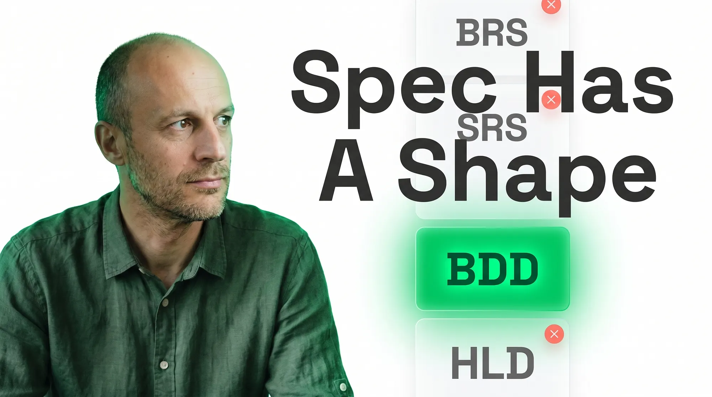
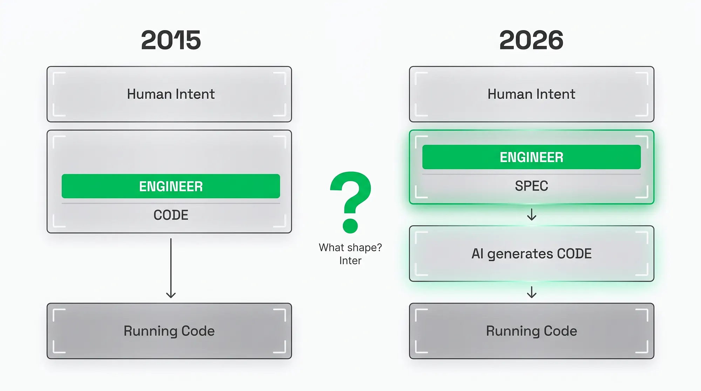
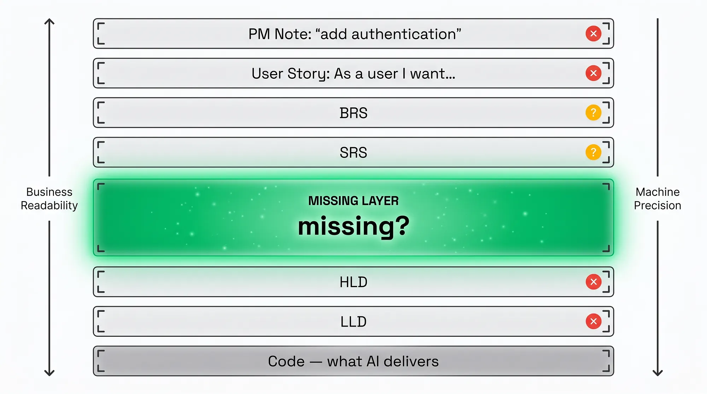
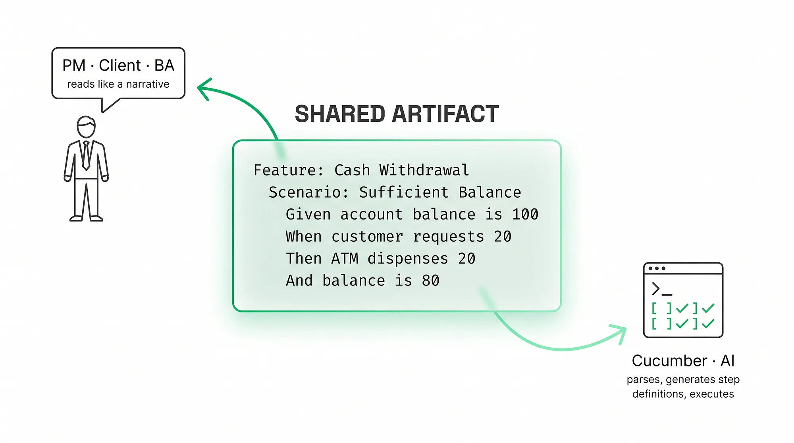
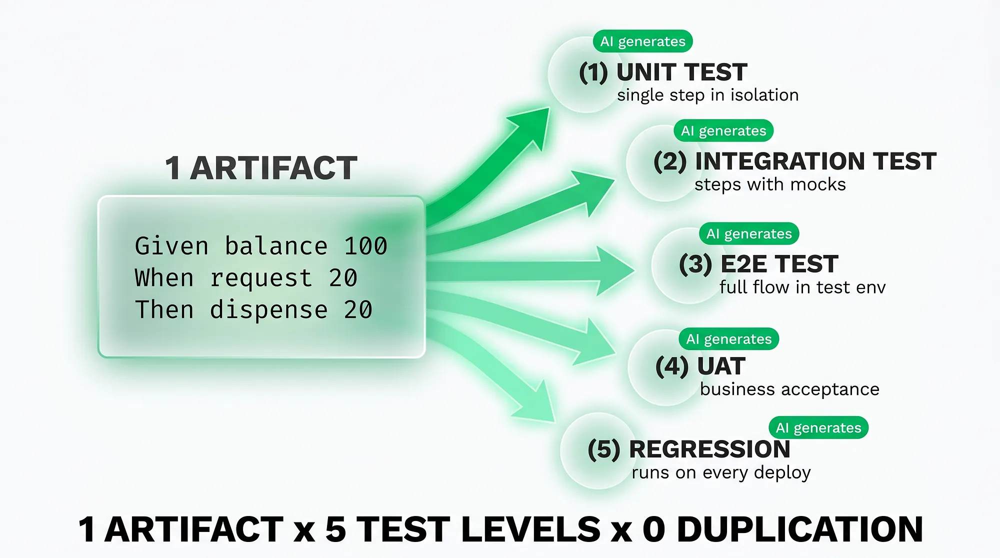
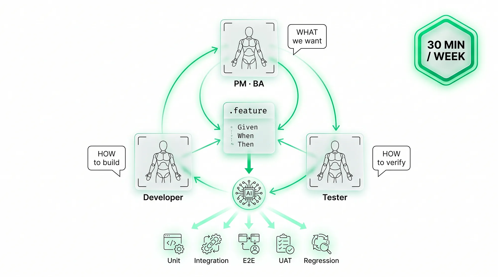
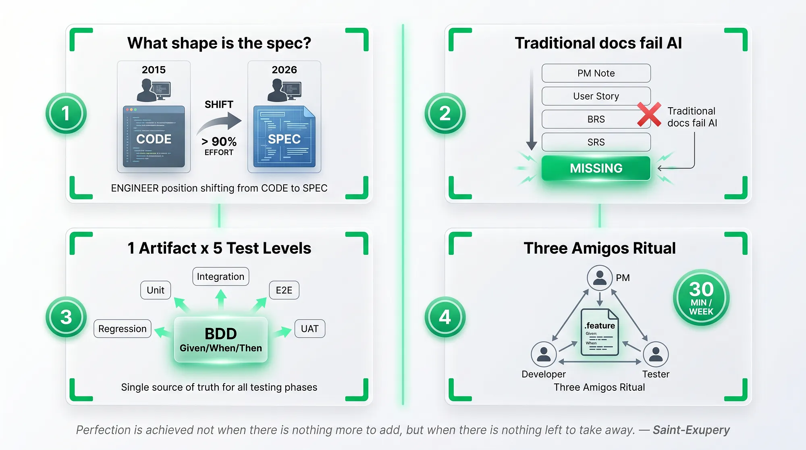

> 作者：Jarosław Wasowski
> 发布日期：2026-04-28
> 原文链接：https://medium.com/@wasowski.jarek/sdd-writing-specifications-for-ai-bdd-as-the-missing-link-spec-driven-development-ad1b540b7f75

# SDD 为 AI 编写规格说明：BDD 是缺失的那一环 —— 规格驱动开发

> 在 AI 写代码的时代，BDD 才是那门一直缺席的规格说明语言。一条 Given/When/Then 场景 = 业务规格 + 单元测试、集成测试、E2E、UAT 与回归测试。



我至今记得那一天：我把一份 80 页的 SRS 摆到团队面前，自以为干得漂亮。一位资深开发翻了三页，抬头看着我，平静地问："这里面到底哪一部分是你打算让它跑起来的？"那是 2018 年。到了 2026 年，那位资深开发还在 —— 只是名字换成了 Claude Code，而且他没那么客气了。

问题没变，变的只是语气。今天替我们写代码的 AI，不会像那位老同事那样替你抹平含糊。规格说明（specification）已经不再是一份归档文档，而成了一份执行合约（execution contract）。2026 年真正的问题不是"我们要不要做规格驱动开发"，而是 —— 这份规格里到底应该写些什么。

> "如果你不能把它讲清楚，说明你还没真正理解它。" —— 据传出自爱因斯坦（Albert Einstein），理论物理学家

## 目录

- [AI 写代码之后我们写什么](#ai-写代码之后我们写什么) —— 人类产出物（artifact）从代码转向意图，以及行业为何用 SDD 作答
- [传统工程文档不够用](#传统工程文档不够用) —— 为什么 BRS、SRS、HLD、LLD 都没法成为给 AI 的合约
- [BDD：那门缺失的语言](#bdd那门缺失的语言) —— 一条 Given/When/Then 场景的解剖结构与"双向阅读"机制
- [一条场景，五层测试](#一条场景五层测试) —— BDD 的双重价值与软件生产的经济学
- [AI 时代的 Three Amigos](#ai-时代的-three-amigos) —— 如何把 BDD 嵌进现成的 SDD 流水线

更多关于"用 SDD 高效管理上下文"的内容，可以在我的专栏里读到：[在 SDLC 各阶段管理 Agent 上下文](https://medium.com/@wasowski.jarek)

## AI 写代码之后我们写什么

2023 到 2026 年这几年里，我们这门职业发生了一件根本性的事，却几乎没人正面把它说破：工程师不再写代码 —— 他们在描述代码该做什么。键盘没换，IDE 没换，但留在仓库里的产出物（artifact）整体上抬了一个抽象层级。代码成了意图的副产品，而不再是意图本身。

业界正被 SDD（Spec-Driven Development，规格驱动开发）这个词点燃 —— 一种把规格说明、而不是代码作为首要工程产出物的做法。GitHub 推出了 Spec Kit，AWS 推出了 Kiro，Tessl 一共拿到了 1.25 亿美元融资（2500 万美元种子轮加上 1 亿美元 A 轮），它们押的都是同一个前提：代码不过是规格说明这份"源文件"被"编译"出的"二进制"。所有人都同意一件事：规格说明已经成为首要产出物 —— 但是哪一种规格说明？



Andrej Karpathy 把这次转变称作软件 3.0（Software 3.0）—— 一个新时代，源头产出物是用自然语言表达的意图，而非代码。Karpathy 在 2023 年写下"最热的新编程语言是英语"，他说对了，只是这句话的反讽要等到后来才显现。因为英语（还有波兰语、还有所有自然语言）天然就是含糊的。在人类彼此交流时让我们如鱼得水的特性，一旦换成对话对象是 agent，就成了最大的弱点。

OpenAI 的 Sean Grove 在那次被反复转发的演讲 "The New Code" 里把话说得最透：成为编程基本单元的，是规格说明 —— 不是 prompt，也不是代码。如果他是对的，那么 2026 年每一位团队负责人都要直面一个他们以前从来不必明确回答的问题：当读这份文档的不是有十年领域经验的资深工程师，而是一个上下文窗口（context window）20 万 token、零组织记忆的 agent 时，这份文档应该长什么样？

### 为什么默认选项行不通

方向上一致并不代表形态上一致。规格说明，到底是 Jira 卡上的一条用户故事？是一份 OpenAPI 文件？是 80 页的散文式文档？还是一份 Markdown 写就的"架构宪法"？今天上述每一种都被叫做 "SDD"，而大多数团队选哪一种，并不是经过权衡，而是顺着习惯漂过去的。

差距正出在这种习惯性漂移里 —— 这也解释了为什么三个团队用同一个 Cursor，能跑出三种截然不同的生产力曲线。"规格里写什么？"最自然的回答是："写我们一直在写的那些 —— SRS、HLD、LLD。"恰恰就是这个回答行不通。

## 传统工程文档不够用

经典的工程产出物层级，做了我们三十年的职业字母表。BRS（Business Requirements Specification，业务需求说明书）—— 一份从组织视角描述需求的业务文档，是 SRS 的前身。SRS（Software Requirements Specification，软件需求说明书）—— 一份描述功能性与非功能性需求的经典工程文档，常见篇幅 50–200 页散文。HLD（High-Level Design，高层设计）—— 一份描述系统组件及其交互的架构文档。LLD（Low-Level Design，低层设计）—— 一份描述模块内部结构（类、方法、调用顺序）的细节文档。

理论上，这套层级很漂亮。实践中 —— 过去二十年里 —— 它能跑下来主要是因为有那位资深开发在补漏。这四种格式名义上都要求无歧义，但它们永远都有洞。那些洞是用领域记忆和走廊里那张密密麻麻的非正式对话网补上的。AI 没有那张网，不在走廊里走动，也不会装作自己懂它其实并不懂的东西。



### 两种错位

第一类问题：BRS 和 SRS 在业务侧对 AI 来说太松。随便翻一份过去五年里经手的 SRS，就能找到这样的句子："系统应提供安全的身份认证。"那位资深开发读完点点头，他知道这意味着用 TOTP 的双因子认证（2FA），因为那个具体客户有 PSD2 合规要求。给 agent 写代码用，它没法接触到这层知识。它会生成一个最低复杂度要求的密码策略然后继续往下推 —— 因为反正每行代码都能编译通过。

第二类问题：HLD 和 LLD 在技术侧又太细。在 AI 时代写 LLD，几乎就是亲自把代码写了 —— 你正在定义类、方法和调用顺序。这等于把 agent 本来要做的 80% 的设计工作自己做掉了，AI 的价值随之蒸发。HLD 工作在组件和接口的层面 —— 但它不在业务功能的粒度上定义行为。它说的是系统由什么组成，而不是系统在做什么。

经验证据并不只是我个人的论断。今年有一项行业基准测试明确显示：当需求中被人为植入歧义时，所有受测的大模型生成代码的质量都会下降，而越先进的模型反而下降得越多 —— 因为它们填空填得更有创造力。模型自己识别不出歧义，也化解不了歧义；越聪明，就越会有创造力地猜出一个跟你心里想的完全不一样的东西。

按我自己的观察，凡是抱怨 "AI Slop"（AI 生成的低质量糊弄式输出）、每张卡要来回跑 3–4 轮的团队，结构性问题都是同一个。问题不在 prompt 的质量，也不在模型阴晴不定，而在输入格式。传统文档作为给 agent 的合约，从两端同时失效：SRS 太松，LLD 太细，而松散的用户故事又浅到所有边界条件都得让 agent 自己即兴发挥。

SRS 与代码之间，少了一层。一层在业务功能粒度上描述行为的东西 —— 精确到 agent 能照着实现，又可读到 PM 能照着审批。既然传统文档塞不进，松散的用户故事又太浅，那中间到底缺的是什么？答案已经存在 22 年了。

## BDD：那门缺失的语言

> "我的语言的边界，就是我的世界的边界。" —— Ludwig Wittgenstein，哲学家

2003 年的圣诞前夕，Dan North 注册了 jbehave.org 这个域名，写下了一个原本想替换 JUnit 的工具的最早几行代码。他不是想发明一种新的测试形式 —— 他在解一个教学难题：他教 TDD 时，学生总是卡在 "test"（测试）这个词上。North 把 "test" 换成了 "behavior"（行为）—— 一整类 "到底要测什么" 的问题瞬间消失了。写"行为"是自然的，写"测试"则不是。

这次教学实验长出了 BDD（Behavior-Driven Development，行为驱动开发）—— 一种用自然语言描述系统行为的方法学，业务可读、机器可执行，载体是 Given/When/Then 三段式场景。BDD 在二十多年间走出了一条戏剧性的弧线：2015 年达到流行峰值，2018–2024 年长期下行（这期间 SmartBear 把 Cucumber 转手了，Tricentis 直接砍掉了 SpecFlow），随后在 AI 时代意外复兴。这次复兴不是巧合，也不是因为 BDD "突然就更管用了"。是因为 BDD 从一开始就为之设计的那位读者，终于出现了。

### 一条 Given/When/Then 场景的解剖

BDD 的全部魔力，都装在一条场景的三段式结构里：

```gherkin
Feature: ATM cash withdrawal
Scenario: Sufficient balance
  Given the account balance is $100
    And the card is active
  When the customer requests a $20 withdrawal
  Then the ATM dispenses $20
    And the account balance is $80
```

这就是 Gherkin —— 用于在 `.feature` 文件里编写 BDD 场景的 DSL，基于 Given/When/Then 这几个关键字。这套句法对应单元测试里的 AAA 模式（Arrange/Act/Assert，准备/执行/断言），不同之处在于：断言不再是代码，而是用业务领域语言写的句子。三行字就足以让 PM、客户、BA、测试都明确知道一件完全相同的事 —— 而且让写代码的 agent 也明确知道他们知道的那件事。

让 Gherkin 异常强大的，是它的"双向阅读"。PM 坐在评审会上，把场景当叙事来读，频频点头 —— 因为这里用的是领域语言（balance、withdrawal、card），不是技术黑话。同一时刻，BDD 框架（Cucumber、Reqnroll、Behave）解析这条场景，把每一步映射到 step definition（步骤定义，把 Gherkin 文本与可执行测试实现连起来的代码），并把它当作验收测试运行。同一份文档，两类受众，零次翻译。



### 为什么 AI 拆掉了最后一道门槛

历史上 BDD 的代价不低：得有人手写 step definition，并跟着代码同步维护。这是一项最终没有团队真心愿意做的活儿 —— 也正是它在 2019 年把 Cucumber 拖进了坟墓。到了 2026 年，AI 直接根据场景自动生成 step definition —— 由此抹掉了 BDD 唯一真正的维护成本。

经验数据很清楚：以 BDD 场景作为大语言模型输入的研究显示，pass@1（衡量模型一次性解出编码任务的比例）相比无结构的自然语言提升了 15.1%。关键观察是：BDD 在精度坐标轴上恰好落在 SRS 和 HLD 之间。它工作在用户行为的粒度上 —— 这正是给写代码的 agent 最关键的粒度，因为业务歧义就活在这一层。它不像用户故事那样松散，不像 HLD 那样技术化，也不像 LLD 那样机械到代码级。它击中了一个甜区，而软件工程从前从未在这里做过形式化定义 —— 因为以前在这个位置上，并不需要一份可执行的产出物。

Cucumber 的创造者 Aslak Hellesøy 曾经语带挑衅地说：BDD 不是测试自动化 —— 它是协作式的需求分析与 TDD 的结合体。他说对了一半。BDD 两者都是；而到了 AI 时代，这种二重性变成了一种意想不到的强大经济力量。

## 一条场景，五层测试

> "完美不在于无可添加，而在于无可删减。" —— Antoine de Saint-Exupéry，作家与飞行员

有意思的事情正在这里发生。BDD 在 AI 时代的真正威力，并不来自所生成规格的质量，也不来自所生成代码的速度。它来自一个事实：一份产出物消灭了三套相互独立的流程 —— 业务规格、测试计划、技术文档。这种"压缩" —— 而不是"更好的 prompt" —— 才是行业真正的革命。

### 五层扇形

把刚才那条 ATM 场景拿来。"账户余额 100 美元的客户请求取出 20 美元，ATM 吐出 20 美元。"三行 Gherkin 展开成五层验证。

**单一来源，五种测试**。第一层，对每一个步骤的隔离单元测试 —— "账户扣款"在各种取值与边界条件下是否仍然正确？第二层，针对 ATM 后端打桩（mock）的步骤组集成测试 —— 整套流程是否正确调用了授权？第三层，在带真实数据库的真实测试环境里跑完整场景的 E2E 测试。

第四层，UAT —— 业务在 UAT 环境里把同一条场景点一遍并签收。第五层，回归测试 —— 这条场景跟着每次部署运行，用来防御未来的非预期改动。五种粒度，五层独立验证，一份源文件。



### 生产数据与概念史

这不是空头承诺。一项行业案例研究中描述的 AutoUAT 流水线（Critical TechWorks，BMW Group 与 CRITICAL Software 的合资公司）实现的正是这条流程：用户故事 → Gherkin 场景 → Cypress/TypeScript 测试脚本。结果是：95% 的生成场景被判定为有用，92% 的测试脚本被判定为有用（其中 60% 无需任何修改，其余在修订或重新生成后可用），平均每个脚本成本 0.12 欧元。这不是 "AI 让我们快了一点"，这是软件生产从未见过的经济学非对称。

有意思的是，这套底层思想其实已经 25 岁了。Specification by Example（基于实例的规格说明）—— 由 Gojko Adzic 在他 2011 年的著作（Manning 出版，2012 年获 Jolt Award）中正式提出 —— 是一种通过具体且可执行的行为示例来说明需求的方法。Adzic 概括了把规格与测试连接起来的六个关键模式：从目标推导范围、协作式规格、用例子来阐释、自动化校验、频繁校验、文档体系的演进。这套想法在等可以经济执行的那个时代，等了二十五年 —— 因为只有 AI 能解决手动维护 step definition 的问题。

当场景可执行、并在 CI/CD 中通过时，它们本身就是技术文档。Living Documentation（活文档）—— 永远是最新的文档，因为它同时也是一项可执行的测试。一旦它停止通过，它就停止作为文档存在。这恰恰是传统工程文档永远无法保证的品质 —— 因为它与代码是断开的。

### 双重价值的经济学

把账算一遍，规模就不再温柔。一个典型的电商功能，在旧世界里：分析师写 SRS 花 20 小时，测试写测试计划花 30 小时，技术写作者出文档花 10 小时，再加上不同产出物之间同步对齐的 20 小时 —— 总共 80 小时人力，分散在三种专家身上，跨越好几周日历时间。

在 BDD-AI 模型里：Three Amigos 一起在 3 小时内写好 Gherkin 场景，AI 在以 API 计时的时间里把它扇形展开成五层测试，成本以欧元每脚本计。基于我自己的估算 —— 来自 AutoUAT 案例数据与典型项目工作量 —— 视领域不同，每个功能的成本下降可达 60–80%。直说了吧：这不是 "AI 让我们提速"，这是 AI 把五份产出物里的四份直接消灭。讨论到这里，AI 生产力这件事就不再只是有趣，而是变得迫在眉睫。

## AI 时代的 Three Amigos

把 BDD 作为规格层接进既有的 SDD 工作流，并不需要新工具，也不需要管理层批准。它需要的是一场 30 分钟的 Three Amigos 会议 —— 一种在 2009 年提出的 BDD 实践，由三种角色（业务、开发、测试）围绕一条场景在实现之前开一次会 —— 以及一次产出物层级的调换：从 SRS → 用户故事 → 代码，变成 BDD 场景 → AI 生成代码与测试 → CI/CD 执行。三个人，每周 30 分钟，一个 `.feature` 文件。这就够了。



### 仪式的五个阶段

**阶段 1 —— 探索（5 分钟）**。PM 讲故事："银行 App 里的客户想查一下储蓄账户的余额。"测试当场追问边界："账户不存在怎么办？会话过期怎么办？客户有多个账户怎么办？"开发追问契约："账户列表从哪里取？标识符的格式是什么？"这五分钟的产出：一张要写的场景清单，每条都有清晰的上下文与动作。

**阶段 2 —— 落笔（15 分钟）**。每条场景按 Given/When/Then 写下来。共同协作，投屏在大家眼前，写进 `.feature` 文件。用业务领域语言，不用技术黑话。

校验方式简单粗暴 —— 把场景念出来，听上去自然，三个人都点头。用具体值，不用抽象："Given 一位余额为 1000 美元的客户"，而不是"Given 一位余额为正的客户"。具体值正是 AI 理解得最好的东西。

**阶段 3 —— AI 生成（API 时间）**。把场景交给 agent（Claude Code、Cursor、Copilot Workspace）。agent 生成实现、step definition、单元测试与集成测试。一个关键细节：agent 的上下文里有一份 `CLAUDE.md` 或 `AGENTS.md` 文件 —— 仓库里的一份 Markdown，agent 把它读作项目架构原则的常驻规格说明，作为跨会话之间的护栏。那些你不想在每条 prompt 里重复的规则，都住在这里。

**阶段 4 —— 验证（10 分钟）**。测试在 E2E 环境跑场景，业务在 UAT 环境的 UI 上点一遍。Cucumber/Reqnroll 生成业务可读的报告 —— "余额充足：通过。账户不存在：通过。"我们启用自我验证循环（self-verification loop）—— 实现完成后 agent 必须执行的一步：把结果与规格说明做比对，确认所有要求都满足。仅此一步，就能消掉今天吞噬冲刺的大部分"差不多能跑"的反复。

**阶段 5 —— 活文档（自动）**。CI/CD 里的场景就是文档。任何破坏场景的代码改动都会阻止合并。文档因此天然永远最新 —— 它停止通过的瞬间就停止作为文档存在。再也不会出现"代码做的是 A，文档说的是 B，资深工程师得猜哪个才是当下"的局面。

### 什么时候用 Three Amigos，什么时候 vibe coding

我用了几个月的一条实战启发法：业务行为清晰的功能（CRUD、决策流、表单、授权）—— Three Amigos 是必选项。50 行以内的 bug 修复和探索性原型 —— vibe coding 仍然合理。要做的是有意识地选，而不是顺着默认漂走。资深开发过去会凭直觉补上空白。在 AI 时代，那种奢侈已经没了。

## 总结

整篇文章的弧线收束于一句话：业界已就"规格说明是首要工程产出物"达成共识，却同时在"这份规格应该装些什么"上没有共识。传统的 BRS、SRS、HLD、LLD 因为不同原因都不能成为给 AI 的合约（要么太松，要么太细），松散的用户故事又太浅，中间那一层缺了 22 年，它的名字是 BDD。

工程师的角色三年里换了三次。直到 2023 年，我们是 coder。2023 到 2025，是 prompt 工程师。从 2026 起，是业务与机器之间的合约协调者。

我们留在仓库里的不再是代码 —— 是描述行为的场景。改变看似细微，经济后果却巨大。

这条弧线我带走五点：

1. 规格说明已经成为首要工程产出物 —— "要不要 SDD"已经定了，悬而未决的是"它长什么样"。
2. 传统工程文档（BRS/SRS/HLD/LLD）在 AI 面前失效 —— 业务上太松，或技术上太细；中间那一层缺位。
3. BDD 是缺失的那门语言 —— Given/When/Then 工作在行为层，对业务可懂，对机器无歧义。
4. 一条场景 = 五层测试 —— 单元、集成、E2E、UAT、回归，全部从一份产出物展开；功能生产成本下降估值 60–80%。
5. AI 时代的 Three Amigos = 每周 30 分钟 —— 一种不用新工具、不用管理层签字的引入仪式，第一个冲刺就能见到可度量的 ROI。

最后再不外交一次：30 分钟的 Three Amigos，能换掉 80 小时的功能生产工作量。如果这篇文章改变了你看待规格说明的方式 —— 从你下个冲刺里挑一条 Gherkin 场景，自己亲手试一遍。这是我能给出的最诚实的假设检验。



谢谢你读到这里。如果这十分钟值这个时间 —— 把文章转给那位每天都在为每张 AI 卡来回跑 3–4 轮的同事。想看后续，关注一下作者主页。也欢迎在评论里分享你团队今天用的是哪种规格格式。来自真实项目的留言，比任何理论都值钱。
