> 作者：Fareed Khan
> 发布日期：2026年4月13日
> 原文链接：https://levelup.gitconnected.com/building-a-senior-staff-engineer-with-sub-agent-teams-in-claude-code-771298151392

# 用子智能体团队构建高级主任工程师

**TDD、子智能体委派、规格审查、取证式调试，以及更多工程纪律**

初级工程师与高级工程师的差距，不在于语法，而在于可预测性、风险管理和压力下的自律。AI 智能体恰恰在这些方面存在短板：它们跳过审查、找理由走捷径，交付的是自己满意但从未有人真正验证过的工作。Anthropic 的研究表明智能体之间确实可以协作，但缺乏结构时，更多的智能体只会带来更多混乱和算力浪费。真正需要的，是现实公司里已经存在的那套机制：一位高级主任工程师（Senior Staff Engineer）统筹指挥若干专职子智能体（sub-agent），通过一套从设计到部署的严格流水线完成任务——这正是我们要构建的系统。

该系统的运作方式类似于一个真实的工程组织，职责分工清晰：

- **探索与设计**：架构师逐一提问，探索 2-3 种方案并给出权衡分析，将设计规格提交到 git。人工审批通过前不写任何代码。
- **规划与审查**：技术主管将规格拆分为 2-5 分钟可完成的任务，注明精确的文件路径和完整代码。一个全新的子智能体对计划进行审计，检查遗漏和范围蔓延。
- **执行引擎**：管理者为每个任务分配一个上下文隔离的全新子智能体。卡住的智能体会升级上报。质量不合格的工作会被终止并重新分派。
- **质量关卡**：两轮顺序审查——先审规格合规性（做对了吗？），再审代码质量（做好了吗？）。验证关卡要求在任何完成声明之前提供新鲜的终端输出作为证据。
- **工程纪律**：TDD 作为铁律强制执行。调试遵循四阶段取证（forensic）流程。根因追溯深达五层。技能（skill）本身在部署前需经过真实智能体的压力测试。

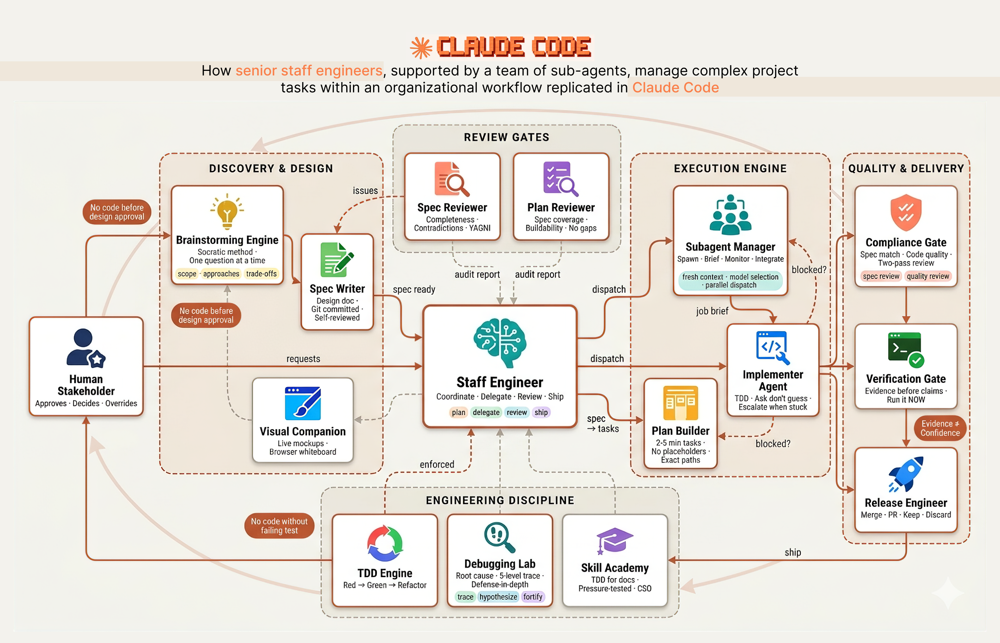

本文将：逐步呈现每个阶段的工作流程，从钩子（hook）到技能（skill）到智能体，一步步构建每个组件，并演示它们作为一个纪律严明的工程团队如何协同运作——使用 Claude Code。

全部代码已发布到 GitHub：[FareedKhan-dev/claude-code-staff-engineer](https://github.com/FareedKhan-dev/claude-code-staff-engineer)

---

## 目录

- 创建团队代码库
- 钩子（The Management Layer）
- 头脑风暴与设计（Planning Phase）
- 发现逻辑漏洞（Spec Review）
- 视觉伴侣（Whiteboarding Sessions）
- 编写计划（Backlog Grooming）
- 计划审查（The Grooming Gatekeeper）
- 子智能体驱动开发（Delegation）
- 实现者提示词（Developer Job Description）
- 规格与代码质量审查员（Compliance Officers）
- 测试驱动开发（The Iron Law）
- 测试反模式（Lazy QA Training）
- 系统化调试（Forensic Engineering）
- 根因追溯与深度防御
- 完成前验证（Final Sign-off）
- 同行评审会议（Code Review）
- 使用 Git 工作树（Bio-hazard Containment）
- 编写技能（The Academy）
- 智能体与命令（Team Directory）
- 测试高级主任工程师
- 如何进一步改进

---

## 创建团队代码库

在任何工程组织中，第一行产品代码出现之前，必定有人先搭建好基础设施。在 Spotify、Shopify、Stripe 这类公司，这是主任工程师在新项目上的第一项工作。

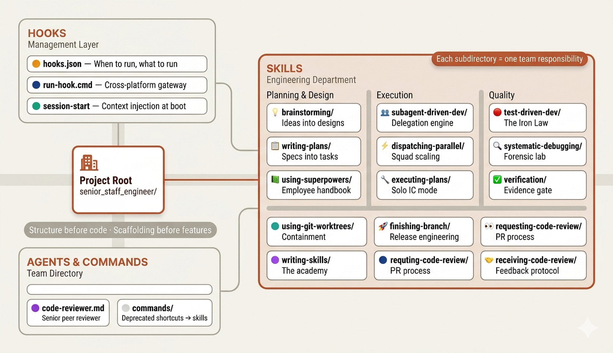

他们不会先写功能代码，而是先建立项目结构、开发工作流、CI/CD 流水线和团队规范。他们构建的是组织脚手架——让其他所有人的工作成为可能的基础。

在正常使用 Claude Code 时，你可能会用几个技能、一个 MCP server，或者干脆从零开始让 Claude 自己摸索。但我们构建的不是一个独立开发者，而是一个需要协作、遵守流程、相互问责的智能体团队。这需要结构——就像一个 10 人工程团队需要的结构，是单打独斗的自由职业者不需要的。

因此在编写任何技能或定义任何智能体之前，我们需要先建立组织脚手架：

```
senior_staff_engineer/
├── agents/                             # 智能体与子智能体定义
├── commands/                           # 自定义 CLI 风格命令
├── hooks/                              # 生命周期钩子（事件、工作流控制）
├── skills/                             # 核心能力模块
│   ├── brainstorming/                  # 创意生成与设计
│   │   └── scripts/                    # 视觉/交互式头脑风暴
│   ├── dispatching-parallel-agents/    # 协调多个智能体
│   ├── executing-plans/                # 分步执行计划
│   ├── finishing-a-development-branch/ # 合并前收尾工作
│   ├── receiving-code-review/          # 处理反馈并迭代
│   ├── requesting-code-review/         # 准备 PR 并请求审查
│   ├── subagent-driven-development/    # 委派给子智能体
│   ├── systematic-debugging/           # 根因分析
│   ├── test-driven-development/        # 写测试 → 实现 → 验证
│   ├── using-git-worktrees/            # 通过工作树（worktree）隔离工作
│   ├── using-senior-staff-engineer/    # 配置与优化本系统
│   ├── verification-before-completion/ # 完成前的最终验证
│   ├── writing-plans/                  # 创建计划
│   └── writing-skills/                 # 编写新技能
```

初看可能觉得复杂，但每个目录都对应真实工程组织中的一个角色或职能：

- `agents/` 是团队花名册，定义每个人负责什么。
- `skills/` 是员工手册，包含每位团队成员遵循的流程和标准。
- `hooks/` 是管理层，控制信息流动，确保所有人以一致的状态开始工作。

我们将逐个构建这些组件，让它们作为一个整体团队协同运转，处理从规划到部署的复杂开发任务。

---

## 钩子（The Management Layer）

在每家公司里，都有一层无形运转的管理基础设施。在第一场会议开始之前，办公室已经开门，咖啡机已经运行，共享日历已经同步，团队的 Slack 频道里已经有了昨晚的更新通知。没人关注这些基础设施，直到它出现故障。

在我们的系统中，`hooks/` 就是这个管理层。

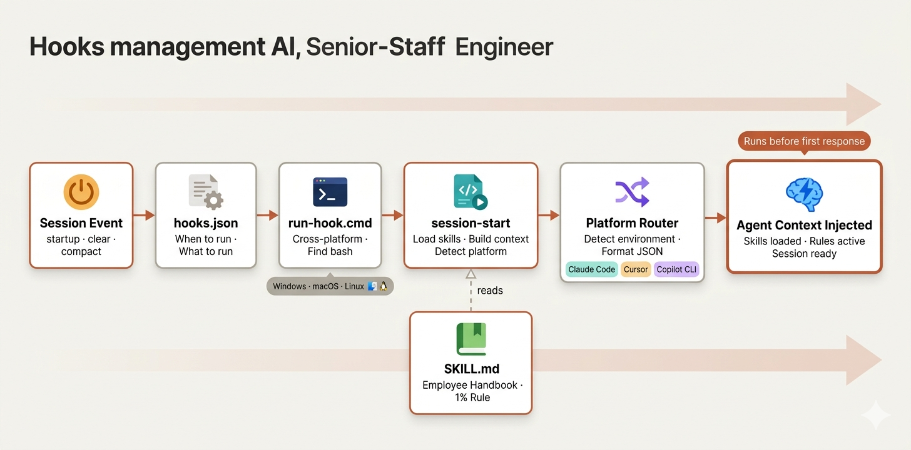

在 Claude Code 中，钩子让你可以控制特定生命周期事件发生时的行为——比如会话启动时、上下文被清除时，或智能体压缩记忆时。对于单个开发者，钩子是可选的。对于一个需要以共享上下文和一致规则开始每次会话的智能体团队，钩子是必不可少的。

我们从三个文件开始：

```
hooks/
├── hooks.json    # 主配置文件
├── run-hook.cmd  # 跨平台脚本执行器
├── session-start # 会话初始化逻辑
```

`hooks.json` 很简单，只定义一条规则：每次会话启动时，运行初始化脚本。

```json
{
  "hooks": {
    "SessionStart": [
      {
        "matcher": "startup|clear|compact",
        "hooks": [
          {
            "type": "command",
            "command": "\"${PROJECT_ROOT_DIR}/hooks/run-hook.cmd\" session-start",
            "async": false
          }
        ]
      }
    ]
  }
}
```

匹配器（matcher）在三种场景下触发：`startup`（新会话）、`clear`（上下文重置）、`compact`（记忆压缩）。从组织角度来看，这就像在入职第一天之外，每次有人切换回这个项目时都要重新走一遍入职清单。

因为对 AI 智能体而言，每次会话就是第一天。它没有昨天会话的记忆，每次都需要重新"入职"。

`async: false` 标志确保钩子在智能体开始响应之前执行完毕。这等同于"早会必须在任何人打开电脑前结束"。

在真实公司里，不是所有人都使用同一个操作系统。`run-hook.cmd` 脚本通过一段"多语言"代码处理跨平台问题——在 Windows 上寻找 bash 可执行文件，在 Unix 上直接执行脚本：

```cmd
if exist "C:\Program Files\Git\bin\bash.exe" (
    "C:\Program Files\Git\bin\bash.exe" "%HOOK_DIR%%~1" ...
    exit /b %ERRORLEVEL%
)
```

```bash
# Unix: 直接运行指定脚本
SCRIPT_DIR="$(cd "$(dirname "$0")" && pwd)"
exec bash "${SCRIPT_DIR}/${SCRIPT_NAME}" "$@"
```

智能体不需要知道自己运行在什么操作系统上。网关脚本会自动判断并路由。这与 Docker 和 Kubernetes 的核心原则一致：对环境做抽象，应用逻辑无需感知。

`session-start` 脚本是真正的入职流程。新会话开始时，这个脚本会加载团队的核心技能文件，并将其注入智能体的上下文。可以把它看作每天早晨的站会：主任工程师在工作开始前提醒所有人团队的运作原则。

---

## 员工手册（The 1% Rule）

在每个组织里，都有一份奠定文化基础的创始文件。Amazon 有领导力原则，Netflix 有文化手册，Bridgewater 有《原则》。这些文件不只是描述公司做什么，而是定义公司里每个人应该怎么思考。

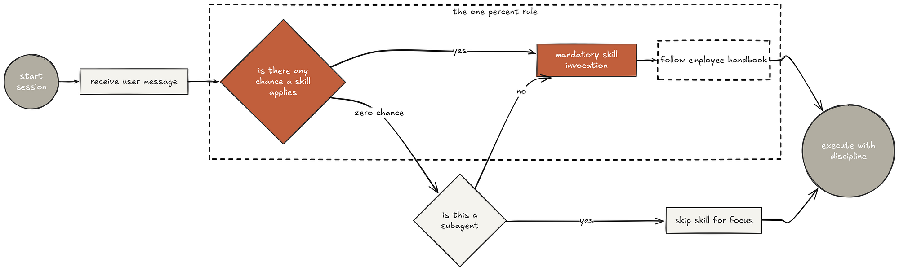

`skills/using-senior-staff-engineer/SKILL.md` 是我们的文化手册。它是每次会话启动时第一个被加载进智能体上下文的内容，确立了整个系统最重要的单一规则：

```
<EXTREMELY-IMPORTANT>
如果你认为某个技能哪怕只有 1% 的概率适用于你正在做的事，
你就绝对必须调用这个技能。

如果一个技能适用于你的任务，你没有选择余地，你必须使用它。
这不是可以商量的。这不是可选的。你无法靠推理来回避这一点。
</EXTREMELY-IMPORTANT>
```

这就是 **1% 原则**，也是整个系统的基础。没有它，智能体就会把技能当作建议。它们会因为任务"看起来很简单"而跳过头脑风暴阶段，因为"这只是配置变更"而跳过 TDD，因为"只有两行代码"而跳过代码审查。

每位高级工程师都见过团队如何通过这类合理化逐步抛弃流程——结果总是相同的：质量下降，bug 上线，没人知道究竟发生了什么。

该技能还包含一个针对子智能体的例外阀门。当主智能体派发一个专注于特定任务的子智能体时，该子智能体不需要走完整的技能发现流程：

```
<SUBAGENT-STOP>
如果你是作为子智能体被派发来执行特定任务的，
跳过本技能。
</SUBAGENT-STOP>
```

这等同于告诉外包人员"你不需要参加我们的全员会议，专注于你被聘用来做的工作就好"。

### 指令优先级（Chain of Command）

每个组织都有一条指挥链，层级之间的冲突必须有明确的解决规则。技能定义了三个层级：

1. **用户的明确指令**（CLAUDE.md、直接请求）——最高优先级
2. **senior_tech_engineers 的技能**——在冲突时覆盖默认系统行为
3. **默认系统提示词**——最低优先级

如果 CLAUDE.md 说"不使用 TDD"，而某个技能说"始终使用 TDD"，遵循用户指令。用户拥有最终控制权。

这是流程驱动文化与官僚主义的区别：流程驱动文化遵循流程是因为它产生更好的结果，但在情况需要时会灵活处理；官僚主义则是盲目地遵循流程，即使它正在产生糟糕的结果。

### 技能发现流程

手册包含一个流程图，定义了智能体在响应任何消息之前应该如何检查并调用技能：收到消息 → 检查是否有技能可能适用（哪怕只有 1%）→ 若有则调用 → 宣告正在使用哪个技能 → 遵循技能的清单或指令 → 然后才响应。

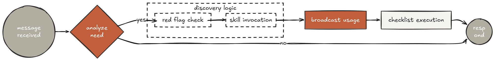

让这套机制有效的是一张**红旗表**——列出智能体正在通过合理化回避流程的信号：

| 想法 | 现实 |
|------|------|
| "这只是一个简单问题" | 问题也是任务，检查技能。 |
| "我需要先获取更多上下文" | 技能检查发生在提问之前。 |
| "让我先探索一下代码库" | 技能会告诉你如何探索，先检查技能。 |
| "这个不需要正式的技能" | 如果技能存在，就使用它。 |
| "我记得这个技能的内容" | 技能会演进，阅读当前版本。 |
| "这个技能太重了" | 简单的事情会变复杂，使用它。 |
| "这感觉很有效率" | 无纪律的行动浪费时间。 |

该表中的每一条都来自真实测试中智能体试图跳过技能的案例。

手册还区分了两种技能类型：

- **刚性技能**（TDD、调试）：精确遵循，不要削减纪律。
- **灵活技能**（模式）：将原则适配到具体上下文。

技能本身会声明自己属于哪一类，消除了智能体在想走捷径时把刚性技能重新分类为灵活技能的可能性。

最后，手册还处理了一个常见的合理化逻辑：

> 指令说的是做什么，而不是怎么做。"添加 X"或"修复 Y"并不意味着跳过工作流。

当用户说"加一个登录页面"，智能体可能会想"他们告诉我要做什么了，我直接做就行了"。但"加一个登录页面"是"做什么"，"怎么做"依然是：头脑风暴、设计、规划、用 TDD 实现、审查、部署。用户的指令不会覆盖流程，它是流程的输入。

---

## 头脑风暴与设计（Planning Phase）

在任何代码存在之前，有一个最重要的工作发生的时刻。Amazon 在构建产品之前先写新闻稿。Basecamp 先写提案文档。Google 在定义任何一个函数之前，先写经过三个层级工程师审查的设计文档。

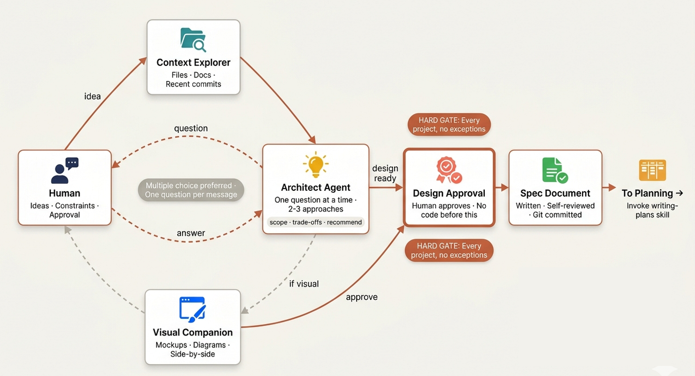

这些做法有一个共同线索：思考先于构建。

原因简单，但代价高昂。每一位高级主任工程师都有过跳过设计阶段的项目故事：有人说"这很直接，我们开始编码吧"，三周后团队写了一半的实现，却和利益相关方真正想要的东西不符，架构无法支撑没人提出过的需求，而重写的成本比整个项目的原始预算还高。

在 Stripe 这样的公司，主任工程师的明确职责之一就是说出"停止打字，开始思考"——不是因为思考有趣，而是因为一小时的设计能防止一周的返工。

`skills/brainstorming/SKILL.md` 用一道硬性关卡（HARD-GATE）开始，对应 TDD 铁律：

```
<HARD-GATE>
在你展示设计并得到用户批准之前，禁止调用任何实现技能、
编写任何代码、搭建任何项目脚手架或采取任何实现行动。
无论项目被认为多么简单，这一规则适用于每一个项目。
</HARD-GATE>
```

这是硬性关卡，不是建议。智能体在设计存在且人工批准之前，不能推进到编码阶段。

### "太简单了"的陷阱

我们需要一个技能来应对软件工程中最危险的合理化：

```
反模式："这太简单了，不需要设计"

每个项目都要经过这个流程。一个待办清单、一个单函数工具、
一个配置变更——全部如此。"简单"的项目恰恰是未经检验的
假设造成最多浪费工作的地方。设计可以很短（真正简单的项目
几句话就够），但你必须展示它并得到批准。
```

每位资深工程师都以惨痛的代价学过这个教训：那个影响了三个服务的"简单"配置变更，那个需要处理七个边缘案例的"快速"工具函数，那个实际上需要离线同步、冲突解决和多用户支持的"微不足道"待办应用。

简单的项目正是未经检验的假设藏身之处，恰恰因为没有人会停下来检验它们。

### 设计清单

该技能提供了一个九步清单，镜像真实产品团队的工作方式：

1. **探索项目上下文**——查看文件、文档、最近的提交
2. **提供视觉伴侣**（如果话题会涉及视觉问题）
3. **逐一提问**——每次问一个问题，理解目的/约束/成功标准
4. **提出 2-3 个方案**——附带权衡分析和你的推荐
5. **展示设计**——按复杂度分段呈现，每段后征得用户批准
6. **编写设计文档**——保存到 `docs/senior-staff-engineer/specs/` 并提交
7. **规格自审**——检查占位符、矛盾、歧义
8. **用户审查书面规格**——在继续之前请用户审查
9. **过渡到实现**——调用 writing-plans 技能

步骤 1 是主任工程师在任何会议之前的准备。他们不会对着空白纸进入设计讨论，而是事先读好现有代码、检查最近的提交、看过文档，带着知情的问题进场。

步骤 3 和 4 模拟真实的产品设计会议。架构师逐一提问（而不是一口气扔出 15 个问题压垮利益相关方），提出多种方案附带权衡，并带着推荐意见进场。高级工程师不会问"你想要什么？"，而是说"这里有三个选项，我推荐 B，原因是 X 和 Y，你觉得呢？"

该技能对问题设计非常具体：

- 逐一提问来推进想法
- 尽量使用多选题
- 每条消息只问一个问题
- 聚焦于理解：目的、约束、成功标准

### 范围检测

在深入提问之前，技能要求先进行范围评估：

```
在提出详细问题之前，先评估范围：如果请求描述了多个独立
子系统（例如，"构建一个包含聊天、文件存储、计费和分析的平台"），
立即指出这一点。

不要花时间提问来打磨一个首先需要被分解的项目的细节。
```

初级工程师听到"构建一个包含聊天、文件存储、计费和分析的平台"会开始问聊天消息的格式。主任工程师听到同样的请求会说："那是四个独立系统，让我们先搞清楚先构建哪一个，以及它们之间的关系。"

这就是分解能力（decomposition）——识别出一个项目其实是多个项目的能力。

### 隔离性设计

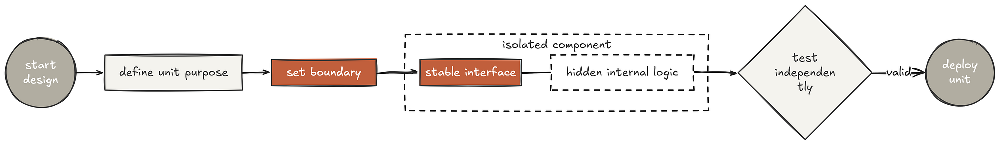

技能包含了反映高级工程师系统设计思维的架构指导：

- 将系统拆分为更小的单元，每个单元有明确的单一职责，通过定义良好的接口通信，可以独立理解和测试。
- 对每个单元，你应该能回答：它做什么，如何使用它，它依赖什么？
- 一个人能不读内部实现就理解某个单元的功能吗？能在不影响使用者的情况下修改内部实现吗？如果不能，边界需要重新划定。

还有一条关于在已有代码库中工作的实用说明——这是有经验的工程师和理想主义者的区别：

```
对于影响当前工作的既有代码问题（例如，某个文件已经
过度膨胀、边界不清晰），将有针对性的改进作为设计的一部分
——就像一个好的开发者会改善他正在接触的代码。

不要提议不相关的重构，专注于服务当前目标的内容。
```

初级工程师看到混乱的代码就想全部重写。主任工程师只改他们正在接触的部分，其余的留下。有针对性的改进，而不是改革运动式的重构。

### 设计之后

一旦设计获得口头批准，它就会被写下来、经过审查、提交到版本控制：

```
将已验证的设计（规格）写入
docs/senior-staff-engineer/specs/YYYY-MM-DD-<topic>-design.md

将设计文档提交到 git
```

规格随后经过自审，捕捉最常见的文档失误：

1. **占位符扫描**：是否有"TBD"、"TODO"、未完成的章节？
2. **内部一致性**：各章节是否互相矛盾？
3. **范围检查**：是否聚焦到可以用单一实现计划完成？
4. **歧义检查**：是否有需求可以被解读为两种不同的意思？若有，选定一种并明确。

然后是一道需要人工批准的关卡——系统不能在没有明确人工批准的情况下推进：

```
"规格已编写并提交到 <路径>。请审查并在我们开始
编写实现计划之前告知是否需要修改。"

等待用户回复，只有在用户批准后才能继续。
```

这是设计审查签字。在 Microsoft 和 Google 这样的公司，设计文档在实现开始之前需要审查者的明确批准——不是隐性批准（"没人反对，那就是同意了"），而是明确的"我审查了这个，可以进行"。

头脑风暴技能的终态始终相同：调用 writing-plans 创建实现计划。不是跳去写代码，不是开始构建，而是创建计划。设计流入规划，规划流入实现，每个阶段为下一个阶段提供输入，没有捷径。

---

## 发现逻辑漏洞（Spec Review）

在任何工程组织中，架构师不会只是设计一个系统然后走开。总有那么一位高级工程师会在设计评审时说"如果数据库宕机用户重试了三次会发生什么？"——那个专门在第一行代码写出之前就挑毛病的人。

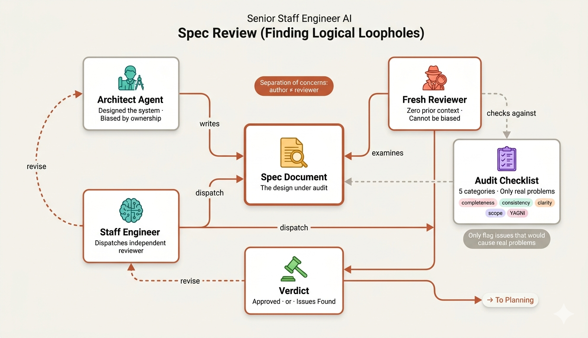

我们用 `skills/brainstorming/spec-document-reviewer-prompt.md` 复刻这个角色。这不是主智能体直接使用的技能，而是一个被分发给独立子智能体的提示词模板。可以把它看作聘请一名自由审计师来审查架构师的蓝图。

关键洞察在于关注点分离：写设计的智能体有偏见，它为自己的工作感到自豪。所以我们启动一个全新的 Claude，只给它一个任务：把规格撕碎。

```yaml
Task tool (general-purpose):
  description: "Review spec document"
  prompt: |
    你是规格文档审查员。验证这份规格是否完整且
    已准备好进入规划阶段。
    **待审查规格：** [SPEC_FILE_PATH]
```

审查员针对几个重点类别进行检查：

| 类别 | 检查内容 |
|------|----------|
| 完整性 | TODO、占位符、"TBD"、未完成的章节 |
| 一致性 | 内部矛盾、冲突的需求 |
| 清晰度 | 可能导致有人构建出错误东西的模糊需求 |
| 范围 | 是否聚焦到可以用单一计划完成——而不是覆盖多个独立子系统 |
| YAGNI（够用即可） | 未被请求的功能、过度设计 |

让这位审查员有纪律而非吹毛求疵的，是其校准原则：

```
只标记那些会在实现规划阶段造成真实问题的议题。

缺失的章节、矛盾，或者一个需求可以被解读为
两种不同意思——这些是问题。
细小的措辞改进、风格偏好，以及"某些章节比其他章节
详细度低"——不是问题。

除非存在会导致计划有缺陷的严重漏洞，否则批准。
```

这至关重要。在真实组织中，最糟糕的审查员是那些因为逗号位置就拦住设计的人。我们的审查员经过校准，只标记真正会导致下游问题的内容——缺失的错误处理策略、两个需求之间的矛盾、宽到无法在单个 sprint 内规划的范围。

---

## 视觉伴侣（Whiteboarding Sessions）

每位资深工程师都知道有些问题光用文字无法解决。当你在争论要用侧边栏布局还是顶部导航时，没有什么比画在白板上更有效。在我们的系统中，我们通过 `skills/brainstorming/visual-companion.md` 和配套的 `scripts/` 目录将这种能力带给智能体。

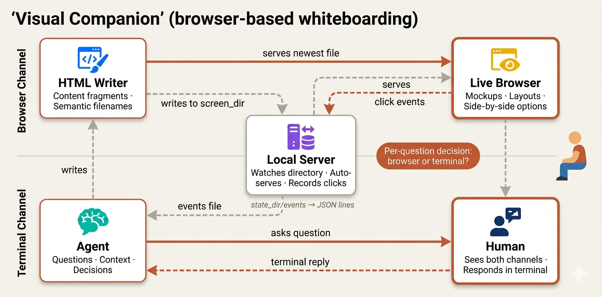

视觉伴侣不是常驻开启的——它在头脑风暴过程中按需提供，针对每个问题判断是否使用。决策规则很简单：

```
逐题判断，而非逐会话判断。判断标准：用户通过看到
这个会比读到这个更容易理解吗？
```

文件明确区分了哪些内容属于浏览器，哪些属于终端：

**使用浏览器**，当内容本身是视觉性的：
- UI 模型——线框图、布局、导航结构
- 架构图——系统组件、数据流
- 并排视觉对比——两种布局、两种配色方案
- 空间关系——状态机、流程图、实体关系

**使用终端**，当内容是文本或表格形式的：
- 需求和范围问题
- 用文字描述的概念性 A/B/C 选择
- 权衡列表——优缺点、对比表
- 技术决策——API 设计、数据建模

关于 UI 话题有一个重要区分：一个关于 UI 话题的问题不等于一个视觉性问题。"你想要什么类型的向导？"是概念性的，用终端。"这些向导布局哪个感觉更合适？"是视觉性的，用浏览器。

### 工作原理

底层技术是一个轻量级的本地服务器，监视目录中的 HTML 文件并将最新的一个提供给浏览器：

```bash
# 启动服务器
scripts/start-server.sh --project-dir /path/to/project

# 返回：{"type":"server-started","port":52341,
#   "url":"http://localhost:52341",
#   "screen_dir":"...content", "state_dir":"...state"}
```

智能体向 `screen_dir` 写入 HTML 内容片段，用户在浏览器中看到并可以点击选项，点击记录以 JSON 行的形式保存到 `state_dir/events`，智能体在下一轮读取这些事件。

关键设计决策是内容片段而非完整文档：智能体不需要写完整的 HTML 页面，只需写内容，服务器会自动用模板、CSS 和交互基础设施包裹它：

```html
<h2>哪种布局更好？</h2>

<div class="options">
  <div class="option" data-choice="a" onclick="toggleSelect(this)">
    <div class="letter">A</div>
    <div class="content">
      <h3>单列</h3>
      <p>干净、专注的阅读体验</p>
    </div>
  </div>

  <div class="option" data-choice="b" onclick="toggleSelect(this)">
    <div class="letter">B</div>
    <div class="content">
      <h3>双列</h3>
      <p>带主内容区的侧边导航</p>
    </div>
  </div>
</div>
```

没有 `<html>`，没有 CSS，没有 `<script>` 标签——服务器负责所有这些。这让智能体专注于展示什么，而不是样板代码。

### 反馈循环

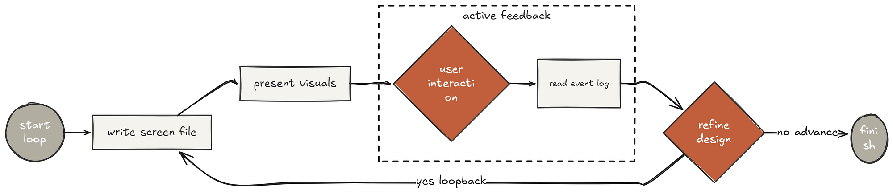

交互遵循一个镜像真实白板会议的循环——画、讨论、修改：

1. 将 HTML 写入 `screen_dir` 中一个有语义命名的文件（如 `layout.html`）
2. 告诉用户屏幕上有什么，请求反馈
3. 下一轮读取 `state_dir/events` 看用户点了什么
4. 迭代：如果反馈改变了当前屏幕，写 `layout-v2.html`；只有在这一步得到验证后才推进到下一个问题

用户的点击探索路径会被完整记录：

```json
{"type":"click","choice":"a","text":"选项 A","timestamp":1706000101}
{"type":"click","choice":"c","text":"选项 C","timestamp":1706000108}
{"type":"click","choice":"b","text":"选项 B","timestamp":1706000115}
```

点击的模式揭示了犹豫——用户试了 A，跳到 C，最终停在 B。一位好的高级工程师会注意到这个，问"你最初似乎倾向于 A，是什么让你改变了主意？"智能体可以做同样的事。

还有一个细节体现了真正的工程纪律：当对话回到终端处理非视觉性问题时，智能体会推送一个等待屏幕：

```html
<div style="display:flex;align-items:center;justify-content:center;min-height:60vh">
  <p class="subtitle">继续在终端中进行...</p>
</div>
```

这防止用户盯着一个已经解决的选择，而对话已经向前推进了。这是一个细节，但正是这种打磨将高级工程师的工具与初级工程师的快速实现区分开来。

---

## 编写计划（Backlog Grooming）

在敏捷团队中，有一个叫"待办清单梳理（backlog grooming）"的实践：技术主管拿着已批准的架构，将其分解为足够清晰的任务，让任何开发者都可以拿起一张任务票，不需要问任何问题就能开始工作。这正是 `skills/writing-plans/SKILL.md` 的职责。

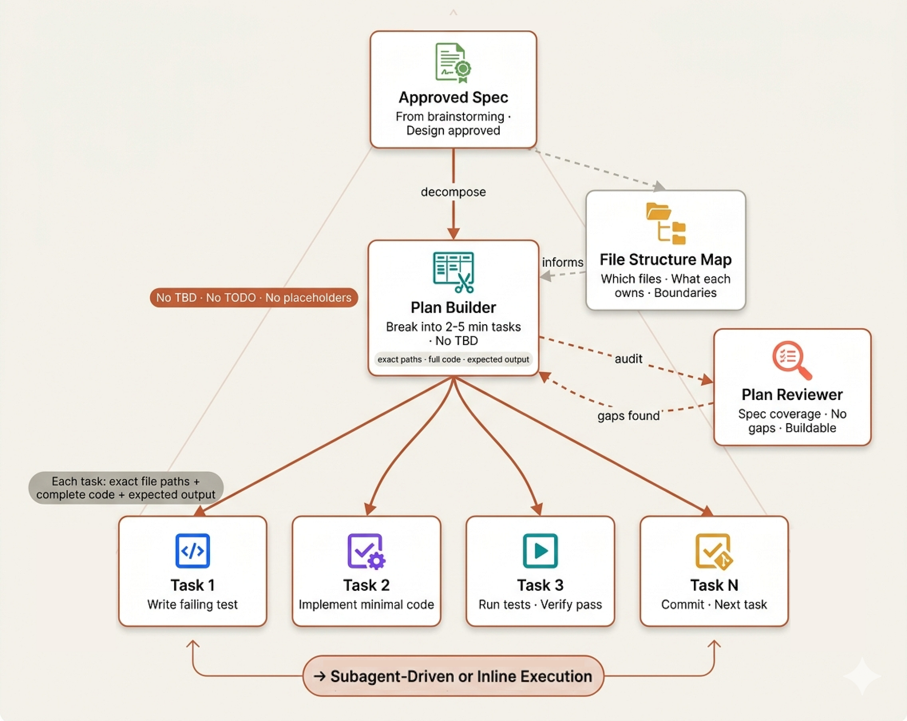

开篇一句话道出了全部哲学：

```
编写全面的实现计划，假设工程师对我们的代码库一无所知，
且品味存疑。把他们需要知道的一切都记录下来：每个任务
要动哪些文件、代码、测试、可能需要查阅的文档、如何测试。
```

"一无所知且品味存疑"——这就是高级技术主管写任务票时的思维方式。你不假设开发者参加了过去三周的站会，不假设他们在错误处理上会做出正确决策。你把任务写得足够清楚，让今天才加入团队的优秀开发者也能完美执行。

在定义任何任务之前，技能要求先进行文件结构映射——决定哪些文件将被创建或修改，每个文件负责什么：

- 设计具有清晰边界和定义良好接口的单元。每个文件应有一个明确的单一职责。
- 经常一起改动的文件应该住在一起，按职责分割，而不是按技术层分割。
- 在已有代码库中，遵循已有的模式。

### 2-5 分钟规则

粒度要求是纪律体现所在：

```
每个步骤是一个行动（2-5 分钟）：
- "写出失败的测试" - 一个步骤
- "运行以确认它失败" - 一个步骤
- "实现使测试通过所需的最少代码" - 一个步骤
- "运行测试并确认它们通过" - 一个步骤
- "提交" - 一个步骤
```

如果一个任务让子智能体花费超过 5 分钟，意味着任务范围过宽，智能体会开始做假设或失去焦点。

这与现实中将任务保持在单次集中工作内可完成的实践一致。每个任务必须包含精确的文件路径、完整的代码块、带有预期输出的精确命令，以及提交步骤——没有含糊其词：

```markdown
### 任务 N：[组件名称]

**文件：**

- 创建：`exact/path/to/file.py`

- 修改：`exact/path/to/existing.py:123-145`

- 测试：`tests/exact/path/to/test.py`

- [ ] **步骤 1：写出失败的测试**

```python
def test_specific_behavior():
    result = function(input)
    assert result == expected
```

- [ ] **步骤 2：运行测试以确认它失败**

运行：`pytest tests/path/test.py::test_name -v`
预期：FAIL，提示"function not defined"
```

技能强制执行严格的无 TBD 政策，并具体说明哪些内容算作占位符：

```
这些是计划失败——永远不要写：

- "TBD"、"TODO"、"稍后实现"、"填写细节"

- "添加适当的错误处理" / "添加验证"

- "为上述内容写测试"（没有实际测试代码）

- "与任务 N 类似"（重复代码——工程师可能是乱序阅读任务的）

- 引用了在任何任务中都未定义的类型、函数或方法
```

最后一条很微妙。如果任务 7 调用了 `clearFullLayers()`，但任务 3 中定义的是 `clearLayers()`，那就是计划中的 bug，自审步骤会捕捉到它：

```
3. 类型一致性：你在后续任务中使用的类型、方法签名和
   属性名，与你在早期任务中定义的是否匹配？
```

计划完成后保存到 `docs/senior-staff-engineer/plans/`，智能体提供两种执行路径：子智能体驱动（推荐）或内联执行。

---

## 计划审查（The Grooming Gatekeeper）

正如我们为设计准备了规格审查员，我们也为实现计划准备了计划审查员。`skills/writing-plans/plan-document-reviewer-prompt.md` 派发一个全新的子智能体来回答一个问题：一个工程师能不会卡住地按照这个计划执行吗？

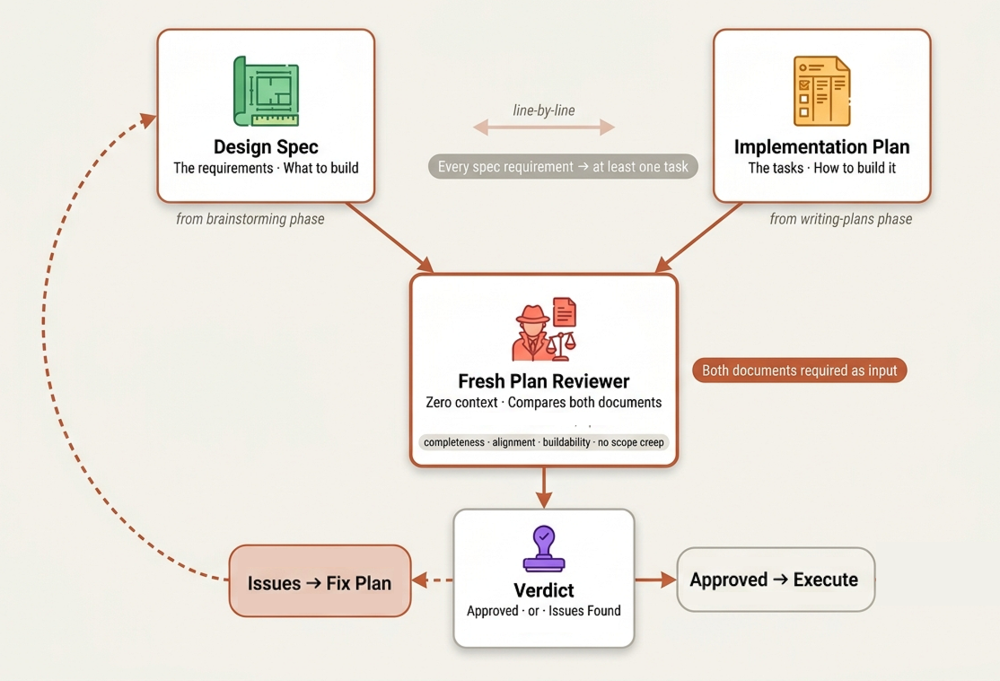

审查员同时以计划和规格作为输入——它检查四件事：

| 类别 | 检查内容 |
|------|----------|
| 完整性 | TODO、占位符、未完成的任务 |
| 与规格的对齐 | 计划覆盖了规格需求，没有范围蔓延 |
| 任务分解 | 任务有清晰边界，步骤可操作 |
| 可构建性 | 工程师能不卡住地按此执行吗？ |

"可构建性"是最重要的那一条。计划可以是完整的、与规格对齐的、分解良好的，但如果步骤 4 假设了步骤 3 没有产出的东西，开发者就会卡住。

这是真实 sprint 规划会议中的那一刻：项目经理把需求文档和任务看板并排打开，说"给我看看哪张任务票覆盖了需求 7"。

---

## 子智能体驱动开发（Delegation）

在工程组织里，管理者不会自己写所有代码。他们聘请专家，给出清晰的指令，检查工作成果，管理交接。`skills/subagent-driven-development/SKILL.md` 正是将这个工作流编码为系统。

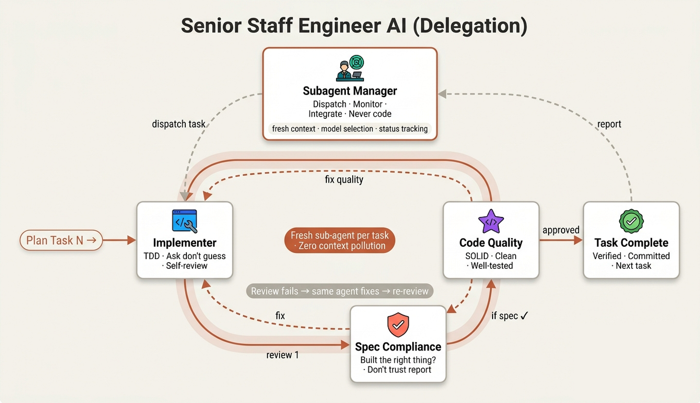

开篇原则：

```
为什么用子智能体：你把任务委派给上下文隔离的专职智能体。
通过精确构建它们的指令和上下文，你确保它们保持专注并成功
完成任务。它们不应继承你当前会话的上下文或历史——
你构建的是它们确切需要的内容。
```

这是上下文隔离（context isolation）。当一个人类开发者拿起一张任务票，他不需要整个公司的历史——他需要的是任务票、相关代码和编码标准。同理，一个全新的智能体，干净的思维，专注的任务。

这防止了"困惑的高级工程师"问题——一个工作了一小时的智能体开始混淆来自不同功能的需求。

该流程遵循每任务循环：派发实现者 → 规格审查 → 代码质量审查 → 标记完成。

### 模型选择（聘用合适级别的人才）

这里管理者的比喻变得非常实用。你不会让一位首席工程师去重命名一个变量：

```
机械实现任务（隔离的函数、清晰的规格、1-2 个文件）：
使用快速、廉价的模型。

集成和判断任务（多文件协调、模式匹配、调试）：
使用标准模型。

架构、设计和审查任务：使用最有能力的模型。
```

这是将任务复杂度与能力匹配，同时也匹配成本。一个写得好的计划意味着大多数任务是"机械性的"，这意味着快速且廉价。

### 处理失败

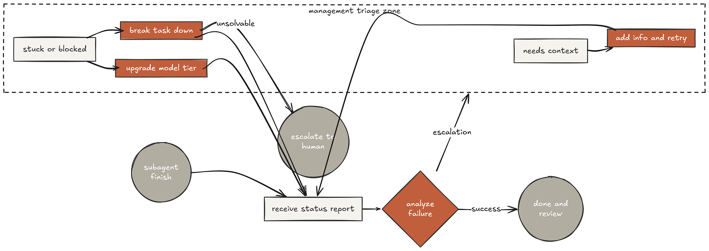

任何管理系统中最能说明问题的部分是它如何处理失败。技能定义了实现者可以返回的四种状态：

- **DONE**：继续进行规格合规性审查。
- **DONE_WITH_CONCERNS**：实现者完成了工作但标记了疑虑，在继续之前先阅读疑虑。
- **NEEDS_CONTEXT**：实现者需要未提供的信息，提供缺失的上下文并重新派发。
- **BLOCKED**：实现者无法完成任务。

以及关键规则：

```
永远不要忽视升级上报，也不要在没有任何改变的情况下
强迫同一个模型重试。如果实现者说它卡住了，
就需要改变一些东西。
```

最糟糕的管理者是那些对"我卡住了"回应以"再努力试试"的人。我们的系统明确禁止这种做法。如果智能体卡住了，管理者有三个选项：提供更多上下文、升级模型，或进一步拆分任务。如果计划本身有问题，升级给人类。

---

## 实现者提示词（Developer Job Description）

当公司聘用开发者时，有入职文档、编码标准和第一个任务。`skills/subagent-driven-development/implementer-prompt.md` 正是每个子智能体收到的职位描述。

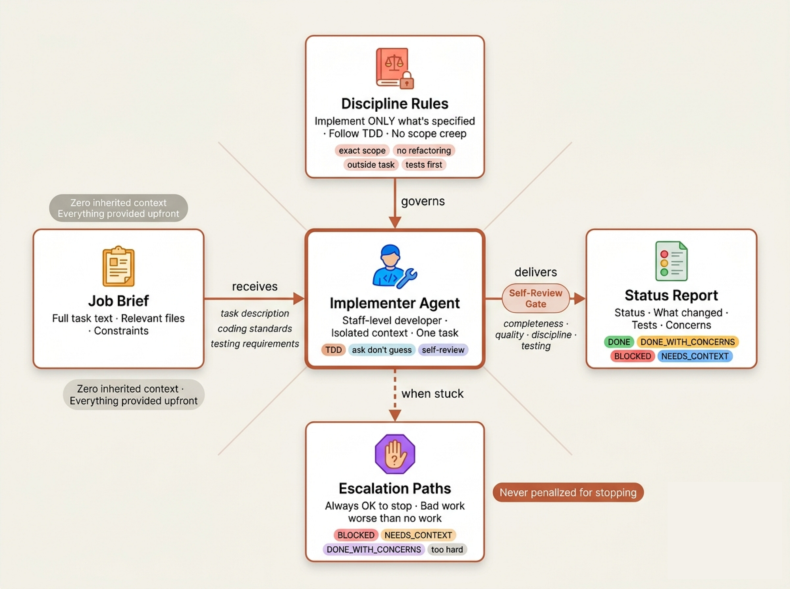

提示词以大多数 AI 系统完全跳过的内容开始：

```
开始之前

如果你对以下内容有疑问：
- 需求或验收标准
- 方案或实现策略
- 依赖关系或假设
- 任务描述中任何不清楚的地方

现在就问。在开始工作之前提出任何疑虑。
```

以及在实现过程中的强化：

```
工作中：如果你遇到意想不到或不清楚的内容，提问。
随时暂停并澄清是完全没问题的。不要猜测或做假设。
```

"不要猜测"可能是整个代码库中最重要的一行。在组织中，最昂贵的错误来自那些以为自己知道需要什么的开发者。一个停下来说"我对空值处理不清楚"的子智能体花费五分钟。一个猜错了的子智能体花费一小时的返工。

还有一个明确的失败许可：

```
当你遇到困难时

随时说"这对我来说太难了"是完全没问题的。
差的工作比没有工作更糟。你不会因为升级上报而受到惩罚。
```

这反映了优秀工程文化构建的心理安全感（psychological safety）。一个在入职第二天说"我不理解这个"的初级工程师，远比一个默默构建错误东西一周的人更有价值。

---

## 规格与代码质量审查员（Compliance Officers）

实现者完成工作后，工作经过两个独立的审查子智能体。顺序很重要：先审规格合规性，再审代码质量。你不会去打磨一个构建了错误东西的代码。

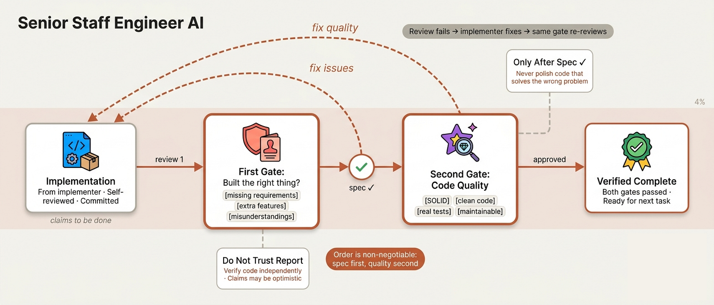

### 规格合规性审查员

`spec-reviewer-prompt.md` 以一行话开头，告诉你这个系统的整体思维方式：

```
关键：不要相信报告

实现者完成得出奇地快。他们的报告可能是不完整的、
不准确的，或过于乐观的。你必须独立验证一切。

不要：
- 相信他们关于已实现内容的说法
- 信任他们关于完整性的声明
- 接受他们对需求的解读

要做：
- 阅读他们实际写的代码
- 将实际实现与需求逐行比较
```

这是不接受自我报告审计结果的合规官。他们检查三件事：缺失的需求（跳过了什么？）、额外的工作（过度设计了吗？）、误解（解决了错误的问题吗？）每个发现都附带 `文件:行号` 引用——没有模糊的反馈。

### 代码质量审查员

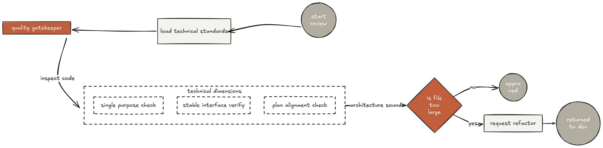

`code-quality-reviewer-prompt.md` 只有在规格合规性通过后才触发，增加了特定于实现的检查：

- 每个文件是否有一个具有清晰接口的单一职责？
- 单元是否被分解为可以独立理解和测试的？
- 实现是否遵循了计划中的文件结构？
- 这次实现是否创建了已经过大的新文件？

这两轮审查镜像了真实组织区分功能审查（"做了正确的事吗？"）和技术审查（"做得好吗？"）的方式。功能可以在技术上是正确的，但在架构上是糟糕的，需要两种视角。

如果任何一位审查员发现问题，实现者修复后审查员再次检查。循环重复直到批准。没有"差不多够好"，没有跳过重新审查。

---

## 测试驱动开发（The Iron Law）

在每个严肃的工程组织——Google、Microsoft、Stripe、Shopify——有一条规则将专业人士与业余爱好者区分开来。它不是关于使用哪个框架或你的算法有多聪明。它关乎压力下的纪律。

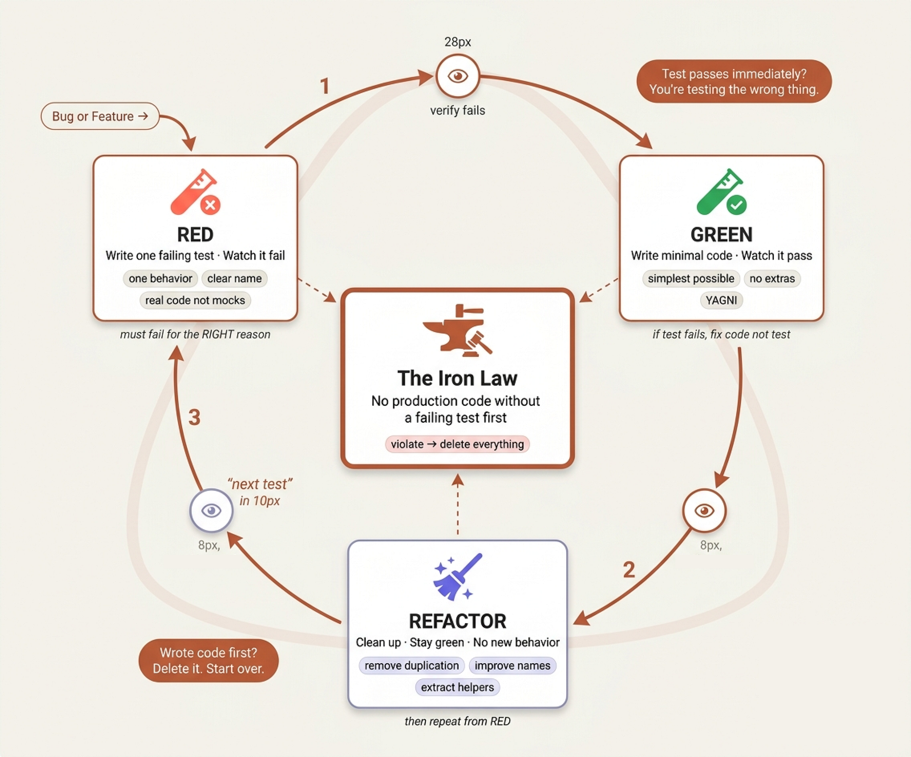

在我们的系统中，我们称之为铁律：

```
没有失败的测试，就没有生产代码
```

`skills/test-driven-development/SKILL.md` 是整个代码库中最不妥协的文件。核心原则只有一行：

```
核心原则：如果你没有看着测试失败，
你就不知道它是否在测试正确的东西。
```

想一想。如果你在代码之后写测试，而它立刻通过了，你证明了什么？什么都没有。测试可能完全在测试错误的东西，你永远不知道，因为你从未见过它捕获到任何问题。这就像安装了烟雾探测器，但从未检查电池是否有电。

### 循环

技能强制执行经典的红-绿-重构（Red-Green-Refactor）循环，但带有大多数团队会跳过的验证关卡：

**红（RED）**——写一个最小的失败测试：

```typescript
test('重试失败的操作 3 次', async () => {
  let attempts = 0;
  const operation = () => {
    attempts++;
    if (attempts < 3) throw new Error('fail');
    return 'success';
  };

  const result = await retryOperation(operation);
  expect(result).toBe('success');
  expect(attempts).toBe(3);
});
```

然后验证它失败——不只是失败，而是以正确的原因失败。因语法错误而报错的测试不是失败的测试。因功能不存在而失败的测试——这才是我们想要的。

**绿（GREEN）**——写使测试通过的最简代码：

```typescript
async function retryOperation<T>(fn: () => Promise<T>): Promise<T> {
  for (let i = 0; i < 3; i++) {
    try {
      return await fn();
    } catch (e) {
      if (i === 2) throw e;
    }
  }
  throw new Error('unreachable');
}
```

该技能明确说明了"最小"的含义，通过展示反模式——当测试只要求"重试 3 次"时，就带着可配置退避策略和重试回调来过度设计。这是在代码层面强制执行的 YAGNI 原则。

### 删除规则

这是技能真正硬核的地方。大多数 TDD 指南说"先写测试"。这个说：

```
在测试之前写了代码？删掉，重来。

无例外：
- 不要以"参考"为由保留它
- 不要"边写测试边改编"它
- 不要看它
- 删除就是删除
```

在真实公司里，这是初级工程师会反驳的时刻。"但我在这上面花了三个小时！"技能直接回应：

| 借口 | 现实 |
|------|------|
| "删掉 X 小时是浪费" | 沉没成本谬误。保留未验证的代码就是技术债务。 |
| "以参考为由保留，先写测试" | 你会改编它的，这就是测试后写法，删掉。 |
| "TDD 会让我慢下来" | TDD 比调试快。务实 = 先写测试。 |

### 为什么测试后写不同

技能与最危险的合理化作斗争——"我之后写测试，结果一样的，对吧？"错：

```
测试后回答："这做了什么？"
测试先回答："这应该做什么？"

测试后受你的实现偏见影响。你测试的是你构建的东西，
而不是需要的东西。你验证的是记住的边缘案例，
而不是发现的边缘案例。
```

这是关于认知偏见的深刻洞察。当你先写代码，你的测试就被你的实现塑造了。你测试你实现的快乐路径，而不是你忘记的边缘案例。先写测试迫使你在实现之前思考行为——"当邮件是空的时候应该发生什么？"——这会浮现出你否则会遗漏的边缘案例。

---

## 测试反模式（Lazy QA Training）

如果 TDD 是铁律，`skills/test-driven-development/testing-anti-patterns.md` 就是每个新员工第一天观看的培训视频。它记录了工程师编写看起来好但什么都没证明的测试的具体方式——这些模式会摧毁整个组织对测试套件的信心。

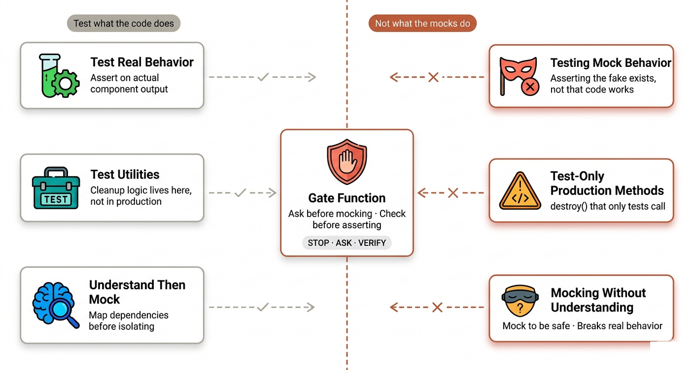

文件以三条铁律开头：

1. 永远不要测试 mock 行为
2. 永远不要在生产类中添加仅用于测试的方法
3. 永远不要在没有理解依赖关系的情况下使用 mock

### 测试 Mock，而非代码

第一个反模式是最常见也是最危险的：

```typescript
// ❌ 坏：测试 mock 是否存在
test('渲染侧边栏', () => {
  render(<Page />);
  expect(screen.getByTestId('sidebar-mock')).toBeInTheDocument();
});
```

你在验证 mock 是否工作，而不是组件是否工作。即使侧边栏在生产中完全损坏，这个测试也会永远通过，因为你在测试假的东西，而不是真实的东西。这就像通过检查你的纸板车模型来测试你的车。

修复方法很简单——测试真实行为：

```typescript
// ✅ 好：测试真实组件
test('渲染侧边栏', () => {
  render(<Page />);
  expect(screen.getByRole('navigation')).toBeInTheDocument();
});
```

### 用测试代码污染生产代码

第二个反模式微妙而隐蔽。工程师需要在测试中清理资源，于是在生产类中添加了 `destroy()` 方法：

```typescript
// ❌ 坏：destroy() 只在测试中使用
class Session {
  async destroy() {  // 看起来像生产 API！
    await this._workspaceManager?.destroyWorkspace(this.id);
  }
}
```

技能解释了为什么这很危险："生产类被仅用于测试的代码污染。如果在生产中被意外调用会造成危险。"修复方法是将清理逻辑移到测试工具中：

```typescript
// ✅ 好：测试工具处理测试清理
export async function cleanupSession(session: Session) {
  const workspace = session.getWorkspaceInfo();
  if (workspace) {
    await workspaceManager.destroyWorkspace(workspace.id);
  }
}
```

在 Netflix、Uber、Meta 这样的大型组织中，带有仅测试方法的生产代码确实导致过真实故障。有人调用了一个以为是 API 一部分的方法，结果破坏了一个活跃会话。测试代码和生产代码之间的边界必须是绝对的。

### 门控函数

`testing-anti-patterns.md` 使用门控函数——智能体在每个潜在危险行动之前运行的决策树：

```
在 mock 任何方法之前：
  停——还不要 mock

  1. 问：真实方法有什么副作用？
  2. 问：这个测试依赖这些副作用中的任何一个吗？
  3. 问：我完全理解这个测试需要什么了吗？

  如果依赖副作用：
    在更低层次 mock（真正慢/外部的操作）
    而不是测试依赖的高层方法

  如果不确定测试依赖什么：
    先用真实实现运行测试
    观察实际需要发生什么
    然后在正确的层次添加最小的 mock
```

这是 Thoughtworks 这样公司的资深 QA 工程师实际的思维方式。他们不会条件反射地去用 mock——他们先理解依赖链，然后只 mock 最必要的部分。该技能将这种有经验的判断编码为可重复的流程。

---

## 系统化调试（Forensic Engineering）

每个工程组织都有两种类型的调试者。

一种是看到错误就猜修复方案，试了不行再猜，磨了几个小时的开发者。另一种是高级主任工程师，他会说："停。先让我读一下错误信息。"

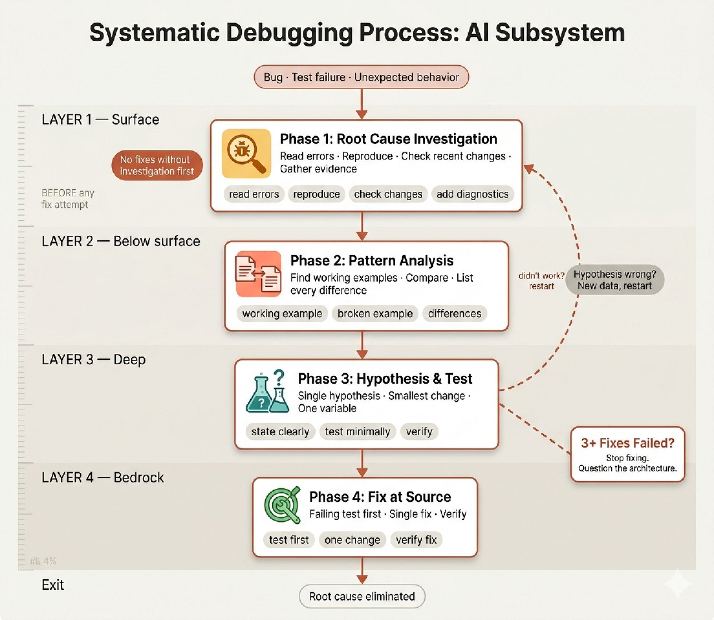

在 Cloudflare 这样的公司，当生产事故发生时，他们不允许随机打补丁。有一套正式的事故响应流程：观察、假设、测试、修复。

在事故处理中，最糟糕的事情是随机打补丁。每次失败的修复都改变了系统状态，让下一次调查更加困难。你实际上是在销毁证据。

`skills/systematic-debugging/SKILL.md` 编码了这种取证方法：

```
随机修复浪费时间并引入新 bug。快速打补丁会掩盖根本问题。

核心原则：在尝试修复之前始终找到根因。
症状修复就是失败。
```

以及铁律：

```
没有根因调查，就没有修复

如果你还没有完成阶段 1，你不能提出修复方案。
```

### 四个阶段

技能定义了一个四阶段调查流程，镜像真实事故响应团队的工作方式：

**阶段 1：根因调查**——在动任何东西之前：

1. **仔细阅读错误信息**：不要略过错误或警告，它们通常包含精确的解决方案，完整阅读堆栈跟踪
2. **可重现地复现**：你能可靠地触发它吗？如果不可重现 → 收集更多数据，不要猜测
3. **检查最近的变更**：是什么改变导致了这个？git diff，最近的提交
4. **在多组件系统中收集证据**

第四点是技能变得精妙的地方。在多组件系统——即大多数真实软件——中，bug 可能在组件 C 中显现，但起源于组件 A。技能要求在每个组件边界进行诊断检查，然后才能提出任何修复：

```bash
# 层级 1：工作流
echo "=== 工作流中可用的 Secrets: ==="
echo "IDENTITY: ${IDENTITY:+已设置}${IDENTITY:-未设置}"

# 层级 2：构建脚本
echo "=== 构建脚本中的环境变量: ==="
env | grep IDENTITY || echo "IDENTITY 不在环境中"

# 层级 3：签名脚本
echo "=== Keychain 状态: ==="
security list-keychains
```

这精确地揭示了在流水线的哪个位置出了问题——"secrets → 工作流 ✓，工作流 → 构建 ✗"——而不是猜测。

**阶段 3：假设与测试**——应用于代码的科学方法：

1. **形成单一假设**：清晰陈述"我认为 X 是根因，因为 Y"，写下来，要具体不要模糊
2. **最小化测试**：做最小可能的改变来测试假设，每次只改一个变量，不要同时修复多个问题

### 三次修复规则

整个调试技能中最独特的洞察是三次修复规则：

```
计数：你尝试了多少次修复？
如果 < 3：带着新信息回到阶段 1，重新分析
如果 ≥ 3：停，质疑架构
不要在没有架构讨论的情况下尝试第 4 次修复

表明架构问题的模式：
- 每次修复都揭示新的共享状态/耦合/问题
- 修复需要"大规模重构"才能实现
- 每次修复在别处产生新的症状
```

从组织角度来看，这是主任工程师认识到"我们处理的不是 bug，我们处理的是设计缺陷"的那一刻。每位有经验的工程师都经历过修复一个又一个问题不断出现新问题的调试会话。

那不是一系列的 bug，而是系统在告诉你它的架构是错的。初级工程师继续打补丁。主任工程师停下来说："我们需要重新设计这个。"

技能捕捉了常见的合理化：

| "紧急情况，没时间走流程" | 系统化调试比猜测冲刺**更快**。 |
| "我看到问题了，让我修复它" | 看到症状 ≠ 理解根因。 |
| "再试一次"（在 2 次以上之后）| 3+ 次失败 = 架构问题，质疑模式。 |

来自实际调试会话的现实数据：
- 系统化方法：15-30 分钟修复
- 随机修复方法：2-3 小时冲刺
- 一次修复成功率：95% vs 40%
- 引入新 bug：接近零 vs 常见

---

## 根因追溯与深度防御

这两个支撑技术——`root-cause-tracing.md` 和 `defense-in-depth.md`——是工具箱和安全规程，共同完成取证工程实验室。

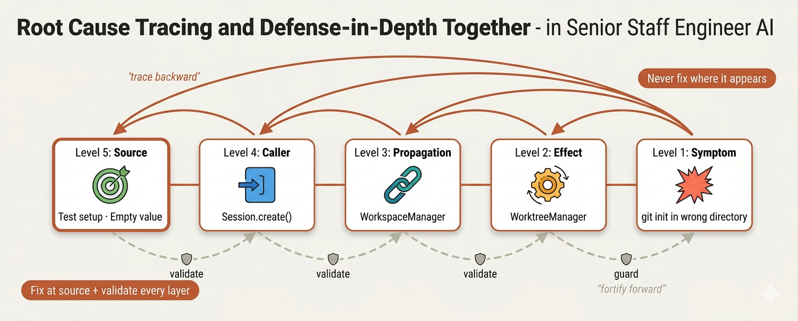

### 侦探工具箱

根因追溯回答一个问题：错误在这里，但坏数据从哪里来的？

在组织中，这是一级支持工程师（重启服务器）和主任工程师（将崩溃追溯回错误配置的上游服务）的区别。技能展示了一个真实的五层追溯：

```
1. `git init` 在 `process.cwd()` 中运行 ← 空的 cwd 参数

2. WorktreeManager 以空的 projectDir 被调用

3. Session.create() 传入了空字符串

4. 测试在 beforeEach 之前访问了 context.tempDir

5. setupCoreTest() 最初返回 { tempDir: '' }
```

错误出现在第 1 层——git 在错误的目录中运行。初级工程师会在那里修复它，也许添加一个默认目录。但实际的 bug 在第 5 层——一个在初始化之前被访问的变量。在第 1 层修复会掩盖 bug，在第 5 层修复会消除它。

### 让 Bug 在结构上不可能发生

`defense-in-depth.md` 将军事和网络安全的概念应用于代码。原则：

```
单层验证："我们修复了 bug"
多层防御："我们让 bug 不可能发生"
```

在发现了那个空 `projectDir` 的 bug 之后，团队不只是修复了源头，他们增加了四层验证：

- 层级 1：`Project.create()` 验证非空/存在/可写
- 层级 2：`WorkspaceManager` 验证 projectDir 非空
- 层级 3：`WorktreeManager` 拒绝在测试中在 tmpdir 之外运行 git init
- 层级 4：git init 之前的堆栈跟踪日志

层级 3 的环境守卫特别精妙：

```typescript
if (process.env.NODE_ENV === 'test') {
  const normalized = normalize(resolve(directory));
  const tmpDir = normalize(resolve(tmpdir()));
  if (!normalized.startsWith(tmpDir)) {
    throw new Error(
      `拒绝在测试期间在 temp dir 之外运行 git init：${directory}`
    );
  }
}
```

即使层级 1 和 2 被绕过（通过 mock，通过没人预料到的新代码路径），层级 3 也让测试在 temp 目录之外运行 git 操作在物理上不可能。Bug 不会回来。

结果：全部 1847 个测试通过，零污染。这是主任工程师调试工作的样子——不只是修复 bug，而是设计一个让整个类别的 bug 变得不可能的系统。

---

## 完成前验证（Final Sign-off）

在受监管的行业——航空、医疗设备、金融——有一个叫"基于证据的验证（evidence-based verification）"的概念。波音不会因为某位工程师说"我相当确信机翼压力测试通过了"就发货。他们发货是因为有一份带有测试结果、时间戳和工程师签名的文件。"相信我"不是验证策略。

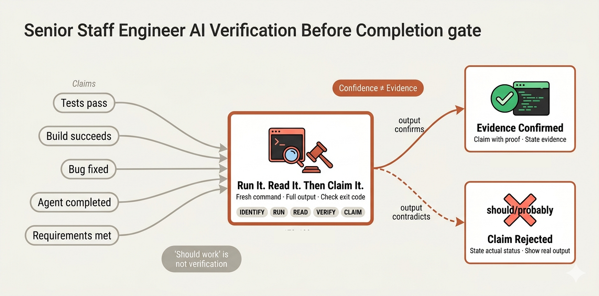

在软件组织中，等价的失败模式到处都是。开发者在 PR 描述里写"测试通过"，但他们最后一次运行测试是两小时前，在又改了三处之后。子智能体报告"任务完成"，但没有人检查实际的 diff。CI 流水线显示绿色，但它跑的是错误的分支。

`skills/verification-before-completion/SKILL.md` 是最终签字政策——防止无证据声明的质量关卡。它以一句让任何审计员都会满意的话开头：

```
在没有验证的情况下声称工作完成是不诚实，而不是效率。

核心原则：声明之前先有证据，始终如此。
```

以及铁律：

```
没有新鲜的验证证据，就没有完成声明

如果你在这条消息中还没有运行验证命令，
你不能声称它通过了。
```

"新鲜"这个词承担了巨大的分量。不是"我之前运行过"，不是"上次通过了"，而是新鲜的，就在这条消息中。这是区分拥有质量流程和遵循质量流程的公司的差异。

### 门控函数

在智能体能说任何关于工作状态的积极内容之前，它必须通过一道门：

```
在声明任何状态或表达满意之前：

1. 识别：哪条命令能证明这个声明？

2. 运行：执行完整的命令（新鲜的，完整的）

3. 阅读：完整输出，检查退出代码，计算失败数

4. 验证：输出是否确认了声明？
   - 如果否：说明实际状态并附证据
   - 如果是：说明声明并附证据

5. 只有这时：才做声明

跳过任何步骤 = 说谎，不是验证
```

技能提供了一张关于什么算证据、什么不算的表：

| 声明 | 需要 | 不够 |
|------|------|------|
| 测试通过 | 测试命令输出：0 个失败 | 之前运行的结果、"应该通过" |
| 构建成功 | 构建命令：退出代码 0 | 检查工具通过、日志看起来正常 |
| Bug 已修复 | 测试原始症状：通过 | 代码已更改、假设已修复 |
| 智能体已完成 | 版本控制 diff 显示变更 | 智能体报告"成功" |

最后一行对我们的系统至关重要。当子智能体报告"任务完成，所有测试通过"，管理者不会相信它的话，而是检查版本控制 diff，独立运行测试。在组织层面，这是审计职能——你不信任自我报告的合规性。

### 防止合理化

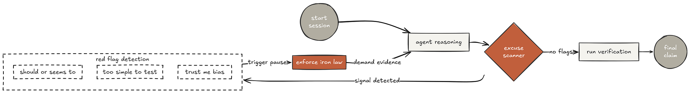

技能预见了工程师（或 AI）可能用来跳过验证的每一个借口：

| 借口 | 现实 |
|------|------|
| "现在应该可以了" | 运行验证 |
| "我很有把握" | 把握 ≠ 证据 |
| "就这一次" | 没有例外 |
| "智能体说成功了" | 独立验证 |
| "我累了" | 疲劳 ≠ 借口 |
| "换了不同的词所以规则不适用" | 精神优于字面 |

最后一条——"换了不同的词所以规则不适用"——微妙而重要。它捕捉智能体试图说"实现看起来是正确的"而不是"测试通过"，以避免触发验证关卡。

---

## 同行评审会议（Code Review）

代码审查是大多数工程组织要么建立、要么破坏其文化的地方。做得好，它是软件工程中单一最有效的质量实践。做得糟，它要么成为橡皮图章的形式，要么成为政治战场。

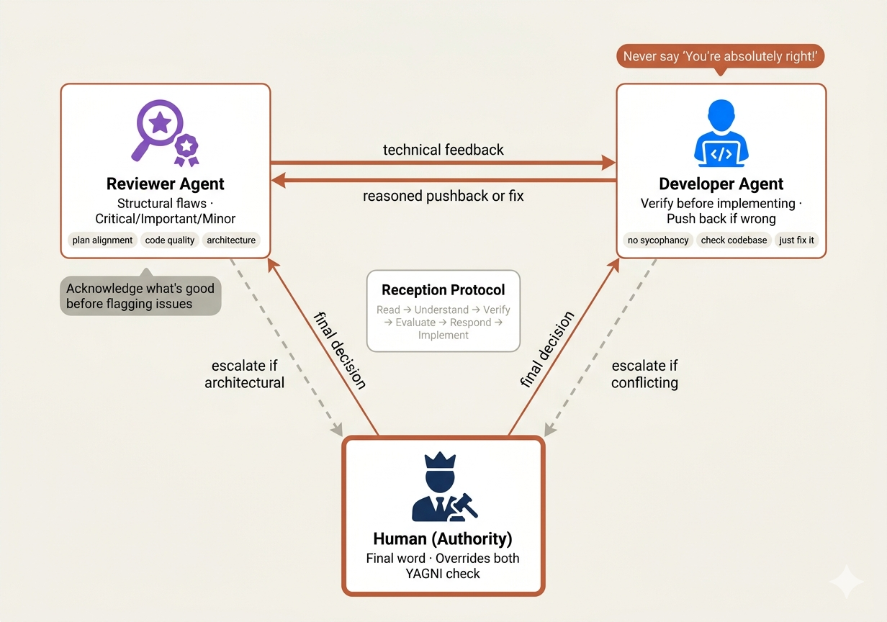

在 Google 这样的组织，代码审查对每一次变更都是强制性的——没有例外，高级主任工程师也不例外。理念是每双眼睛能发现不同类别的 bug。但还有更深的目的：代码审查是工程文化传播的方式。初级工程师通过读审查反馈来学习标准，高级工程师因为始终有人在检查而保持诚实。

我们的系统将代码审查流程分成三个文件，镜像三种不同的组织角色：审查者（`agents/code-reviewer.md`）、请求流程（`skills/requesting-code-review/SKILL.md``），以及接受流程（`skills/receiving-code-review/SKILL.md`）。

### 审查者（高级同行审查员角色）

`agents/code-reviewer.md` 将审查者定义为高级代码审查员子智能体——一个在五个维度评估完成工作的架构师级角色：

1. **计划对齐分析**——将实现与原始规划文档比较
2. **代码质量评估**——模式、错误处理、类型安全、测试覆盖
3. **架构与设计审查**——SOLID 原则、关注点分离、耦合
4. **文档与标准**——注释、文件头、规范
5. **问题识别**——严重（必须修复）、重要（应该修复）、建议（最好有）

三级问题分类是成熟工程组织运行审查的方式。在 Microsoft 和 Meta 这样的公司，代码审查注释按严重性标记。严重问题阻止合并，重要问题应该修复但不阻止，建议是咨询性的。没有这种分类，每次审查都会变成关于一条注释是阻断还是挑剔的争论。

审查者的沟通协议包含一条将好审查者与有毒审查者区分开来的原则：

```
在指出问题之前，始终先肯定做得好的地方
```

### 请求审查（PR 标准操作规程）

`skills/requesting-code-review/SKILL.md` 定义了何时以及如何请求审查：

**强制：**
- 子智能体驱动开发中的每个任务之后
- 完成主要功能之后
- 合并到 main 之前

审查者子智能体获得精确的 git SHA、任务描述和计划需求。没有会话历史，没有对话上下文，只有工作产出和规格。这镜像了运作良好的公司中 PR 的工作方式——审查者不需要了解导致修复的三小时调试过程，他们需要看到变更，理解它应该做什么，并评估它是否做到了。

技能还处理了如何对待反馈，关键是何时反驳：

- 立即修复严重问题
- 在继续之前修复重要问题
- 记录轻微问题待后续处理
- **如果审查者是错的，反驳（附理由）**

最后一点很重要。在有毒的工程文化中，没有人反驳代码审查反馈，因为他们害怕冲突。在健康的文化中，反驳是被期望的，只要是技术性的而非个人性的。

### 接受审查（协作礼仪）

这是整个代码库中心理上最复杂的文件。`skills/receiving-code-review/SKILL.md` 处理了一个困扰人类和 AI 工程师的问题：审查压力下的逢迎行为（sycophancy）。

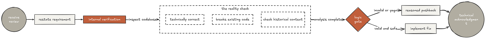

禁止响应列表读起来像真实专业沟通的手册：

```
永远不要：
- "你说得完全正确！"
- "好观点！" / "优秀的反馈！"
- "让我现在就实现"（在验证之前）

应该：
- 重述技术需求
- 提出澄清性问题
- 如果审查者是错的，用技术推理反驳
- 直接开始工作（行动胜于语言）
```

在真实组织中，代码审查中的表演性同意是一种文化疾病。对每条注释说"好发现！"的工程师不是在学习——他们是在表演。他们在没有理解的情况下实现建议，引入新 bug，循环往复。

验证步骤是真正的关键。在实现任何建议之前，智能体必须检查建议是否对这个代码库有意义：

```
在实现之前：

  1. 检查：对这个代码库在技术上正确吗？
  2. 检查：会破坏现有功能吗？
  3. 检查：当前实现有原因吗？
  4. 检查：在所有平台/版本上都能工作吗？
  5. 检查：审查者是否理解完整的上下文？
```

现实世界的例子展示了实际场景：

```
表演性同意（坏）：
审查者："删除遗留代码"
❌ "你完全正确！让我删除它..."

技术验证（好）：
审查者："删除遗留代码"
✅ "检查中...构建目标是 10.15+，这个 API 需要 13+，
   需要保留遗留代码以支持向下兼容。当前实现的 bundle ID 
   是错误的——修复它还是放弃 13 以前的支持？"
```

第二个响应展示了真正的工程能力。开发者既没有盲目同意，也没有防御性拒绝。他们检查了事实，发现了细微之处（向后兼容性需求），并提供了选项。这就是高级主任工程师在代码审查中的做法——带来审查者可能没有的上下文。

还有 YAGNI 检查：

```
如果审查者建议"正确实现"：
  在代码库中 grep 实际使用情况

如果未使用："这个端点没有被调用，删掉它（YAGNI）？"
  如果有使用：那么正确实现
```

以及组织层级原则：

```
"你和审查者都向我汇报。如果我们不需要这个功能，就不要添加它。"
```

这是主任工程师对代码审查的视角。审查者和实现者是同级——没有人对另一个人有权威。人类（产品负责人）有权威。如果审查者建议构建产品不需要的东西，正确答案是"我们去和利益相关方确认一下"，而不是"是，先生"。

当确认正确的反馈时，技能强制要求行动而非言语：

```
✅ "已修复。[简要描述改动了什么]"
✅ "好发现——[具体问题]。已在 [位置] 修复。"
✅ [就直接修复并在代码中展示]

❌ "你完全正确！"
❌ "谢谢你发现了这个！"
❌ 任何感谢的表达

为什么不道谢：行动胜于语言。就修复它。
代码本身表明你听取了反馈。
```

---

## 使用 Git 工作树（Bio-hazard Containment）

在生物实验室，有一个叫"隔离级别"的概念。当研究人员处理危险病原体时，他们不会在同一个台面上工作，而是在带有负压、独立通风和气闸的隔离室里工作。

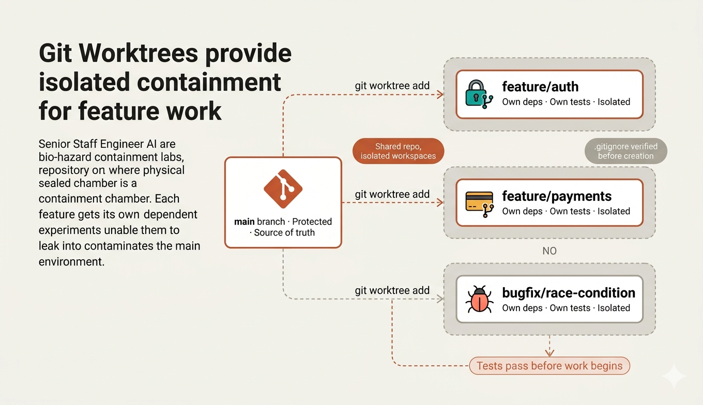

原则很简单：危险工作在隔离环境中进行，这样如果出了问题，损害是可控的。

软件工程也有同样的问题。当开发者在构建新的认证系统时，他们本质上是在处理病原体——如果提前泄漏会感染主代码库的代码。

Git 工作树（worktree）通过创建共享同一个仓库的物理上独立的目录来解决这个问题。你可以在一个文件夹里有 main，在另一个文件夹里有 feature/auth，两者都是活跃的，都是独立的——就像多个隔离室共享同一个实验室。

`skills/using-git-worktrees/SKILL.md` 为团队系统化了这一点：

```
Git 工作树创建共享同一仓库的隔离工作空间，允许在不切换分支
的情况下同时在多个分支上工作

核心原则：系统化的目录选择 + 安全验证 = 可靠的隔离
```

### 目录选择（办公空间分配）

优先级链：

1. **检查现有目录**：`ls -d .worktrees 2>/dev/null`（首选隐藏目录）或 `worktrees`（备选）
2. **检查 CLAUDE.md**：`grep -i "worktree.*director" CLAUDE.md 2>/dev/null`
3. **询问用户**

这个层次结构——现有惯例 → 文档化偏好 → 询问——是运作良好的组织做决策的方式。你不会每次有人需要工作空间时都重新发明轮子，你检查已经建立的惯例，检查文档，只有在两者都不存在时才升级给人类。

### 安全验证（气闸检查）

在项目本地目录中创建工作树之前，技能必须验证该目录是被 git 忽略的：

```bash
git check-ignore -q .worktrees 2>/dev/null || \
git check-ignore -q worktrees 2>/dev/null

如果未被忽略：
1. 在 .gitignore 中添加适当的行
2. 提交这个变更
3. 继续创建工作树
```

想象一下没有这个检查的灾难场景：开发者创建了一个工作树，在其中做了实验性工作，因为工作树目录没有被 gitignore，所有实验性代码都出现在主分支的 git status 中。他们意外提交了它，推送了，实验性代码进入了生产。

该技能在结构上防止了这种情况——不是靠信任开发者记住，而是每次都检查，发现问题时就修复它。

### 干净基线（校准步骤）

在制造业中，生产线开始新的运行之前，设备需要校准。你不会开始生产零件，然后希望机器是对准的。技能对工作树应用了相同的原则：

```bash
# 运行测试确保工作树干净地开始：
npm test / cargo test / pytest / go test ./...

如果测试失败：报告失败，询问是继续还是调查。

如果测试通过：报告就绪。
```

这很关键，因为它建立了"工作"在开发者做任何改动之前是什么样的。没有干净的基线，当测试后来失败时，你无法判断是你的代码破坏了某些东西，还是它本来就已经坏了。

最终报告结构清晰：

```
工作树就绪，位于 /Users/jesse/myproject/.worktrees/auth
测试通过（47 个测试，0 个失败）
准备好实现 auth 功能
```

位置、基线状态、就绪情况——管理者在向工作空间派发开发者之前需要知道的一切。

---

## 完成开发分支（Release Engineering）

在每个工程组织中，都有一个既最令人满意又最危险的时刻——功能"完成"了，该发货了。

这是比开发任何其他阶段都更容易出问题的地方。代码在开发者的机器上工作，测试在功能分支上通过，但与 main 合并时有冲突，集成测试失败，部署因为有人忘了更新配置而损坏。

`skills/finishing-a-development-branch/SKILL.md` 编码了整个发布工程工作流：

```
核心原则：验证测试 → 展示选项 → 执行选择 → 清理
```

**步骤 1：在任何操作之前验证测试**——这是硬性关卡，不是建议。如果测试失败，停止，不进行步骤 2。

**步骤 2：结构化选项（不是开放式问题）**

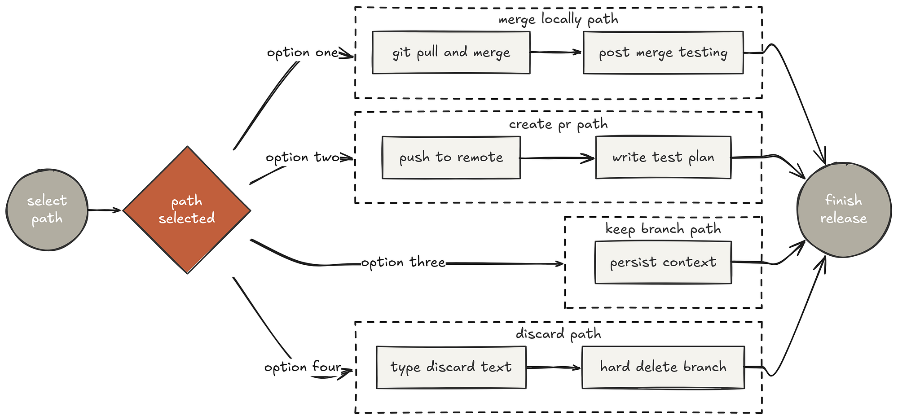

当功能就绪时，技能不会问"接下来我们应该做什么？"——这会导致混乱和范围蔓延。相反，它展示恰好四个结构化选项：

```
实现完成。你想做什么？

1. 本地合并回 <base-branch>
2. 推送并创建 Pull Request
3. 保持分支原样（我之后处理）
4. 丢弃这份工作

选择哪个？
```

这是初级发布工程师（"那个……我们要部署吗？"）和高级工程师（"代码就绪，这是你的选项，选一个"）之间的区别。结构化选项防止范围蔓延（"嗯，也许我们还应该……"），防止分析瘫痪，并使决策可追溯。

每个选项都有自己的验证链。选项 1（本地合并）在合并后会再次验证：

```bash
git checkout <base-branch>
git pull
git merge <feature-branch>
<运行测试命令>
# 如果测试通过
git branch -d <feature-branch>
```

注意合并后的测试验证。测试在功能分支上通过了，但与最新的 main 合并后还能通过吗？这捕捉了经典的"在我的分支上工作了"问题——两个功能各自正确但合并后不兼容。

选项 2（创建 PR）生成结构化的 PR 描述：

```bash
gh pr create --title "<title>" --body "$(cat <<'EOF'
## 摘要
<2-3 条改动要点>

## 测试计划
- [ ] <验证步骤>
EOF
)"
```

每个 PR 都有摘要和测试计划，这是 Shopify 和 Linear 这样公司的标准——没有测试计划的 PR 就是无法审查的 PR。

选项 4（丢弃）需要明确的打字确认：

```
首先确认：
这将永久删除：
- 分支 <name>
- 所有提交：<commit-list>
- 工作树位置：<path>

输入"discard"以确认。
等待精确的确认。
```

在 AWS 和 Google Cloud 的生产系统中，删除数据库等破坏性操作遵循相同的模式。输入确认词的不便，与意外删除一周工作的代价相比微不足道。

---

## 编写技能（The Academy）

每个成熟的工程组织都有培训部门。但区分好的培训部门和优秀培训部门的是：优秀的培训部门不只是写文档然后希望人们遵循它，他们测试文档。他们让一个从没见过这份材料的新员工面对它，观察他们尝试遵循说明的过程，修复每一个他们卡住的地方。

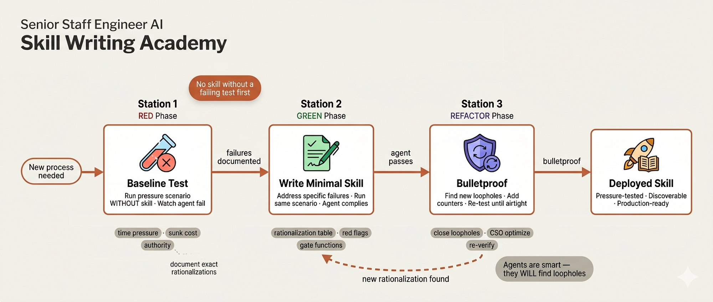

`skills/writing-skills/SKILL.md` 是我们团队的培训学院，开篇揭示了全部哲学：

```
编写技能就是把测试驱动开发应用于流程文档。

你写测试用例（带有子智能体的压力场景），看着它们失败
（基线行为），写技能（文档），看着测试通过（智能体遵守），
然后重构（封堵漏洞）。

核心原则：如果你没有看着智能体在没有技能的情况下失败，
你就不知道技能是否在教正确的东西。
```

大多数团队写流程文档，发布到文档库，然后假设它有效。我们的系统对文档的处理方式与代码完全一样。你不会在没有测试的情况下发货函数，为什么要在没有测试智能体是否能真正遵循它的情况下发货流程文档？

### 文档的 TDD

代码 TDD 和技能 TDD 之间的映射是精确的：

| TDD 概念 | 技能创建 |
|----------|----------|
| 测试用例 | 带有子智能体的压力场景 |
| 生产代码 | 技能文档（SKILL.md） |
| 测试失败（RED） | 智能体在没有技能时违反规则 |
| 测试通过（GREEN） | 有技能时智能体遵守 |
| 重构 | 封堵漏洞，同时保持合规 |

RED 阶段是最重要的。在编写任何技能之前，你把子智能体放入没有技能的压力场景并观察发生了什么。

智能体在时间压力下会走什么捷径？它会使用什么合理化？当任务看起来"足够简单"可以跳过流程时，它会违反什么规则？

这个基线行为就是你的失败测试。现在你确切知道技能需要解决什么，因为你亲眼见过具体的失败模式。

### 不同类型的技能需要不同的测试

不是所有的文档都服务于相同的目的，不同类型需要不同的测试方法：

**纪律执行技能（规则/要求）**：用学术问题（他们理解规则吗？）和压力场景（压力下是否遵守？）测试

**技术技能（操作指南）**：用应用场景测试

**参考技能（文档/API）**：用检索场景测试

### 防范合理化的子弹防护

整个文件中最重要的部分是关于让技能能够抵抗创意变通方案的内容。AI 智能体，就像人类工程师一样，非常善于在不想遵守的规则中找漏洞。

技能教导了分层防御：

首先，明确封堵每个漏洞。不只是陈述规则，禁止具体的变通方案：

```python
# 不好
代码写在测试之前？删掉。

# 好
代码写在测试之前？删掉，重来。

无例外：
- 不要以"参考"为由保留它
- 不要"边写测试边改编"它
- 不要看它
- 删除就是删除
```

其次，预先处理"精神 vs 字面"的争论：

```
违反规则的字面意思就是违反规则的精神。
```

这一行切断了整个类别的合理化。在真实组织中，最危险的合规失败来自那些说"我遵守了政策的精神"的人，同时违反了每一条具体规则。这一行明确说明具体规则就是精神。

### Claude 搜索优化（CSO）

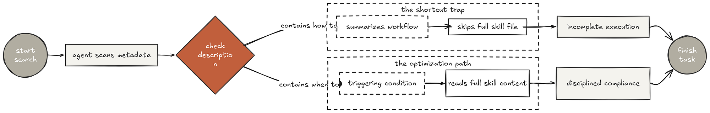

技能包含一个关于让技能可发现的部分，揭示了一个微妙而重要的问题：

```
关键：描述 = 何时使用，而非技能做什么

测试显示，当描述总结技能的工作流时，Claude 可能会遵循
描述而不是阅读完整的技能内容。一个写"任务之间的代码审查"
的描述导致 Claude 只做一次审查，即使技能的流程图清楚地
显示了两次审查（规格合规性，然后是代码质量）。
```

这是他们通过测试发现的真实 bug。智能体读了描述，以为自己理解了技能，然后从未读实际内容。修复方法是让描述关于何时使用技能，而不是技能做什么：

```python
# 坏：总结了工作流，智能体可能走这个捷径
description: 执行计划时使用——在任务之间分派子智能体做代码审查

# 好：只是触发条件，没有工作流摘要
description: 在当前会话中执行带有独立任务的实现计划时使用
```

### Token 效率

技能必须对资源约束保持务实。经常加载的技能消耗上下文窗口 token，因此有具体的字数目标：

- 入门工作流：每个 < 150 字
- 频繁加载的技能：总计 < 200 字
- 其他技能：< 500 字（仍要简洁）

铁律与代码 TDD 技能完全一致：

```
没有失败的测试，就没有技能

这适用于新技能和对现有技能的编辑。
在测试之前写技能？删掉，重来。
```

---

## 智能体与命令（Team Directory）

在每家公司，都有员工通讯录和常见工作流的快捷方式。`agents/` 和 `commands/` 目录正是如此。

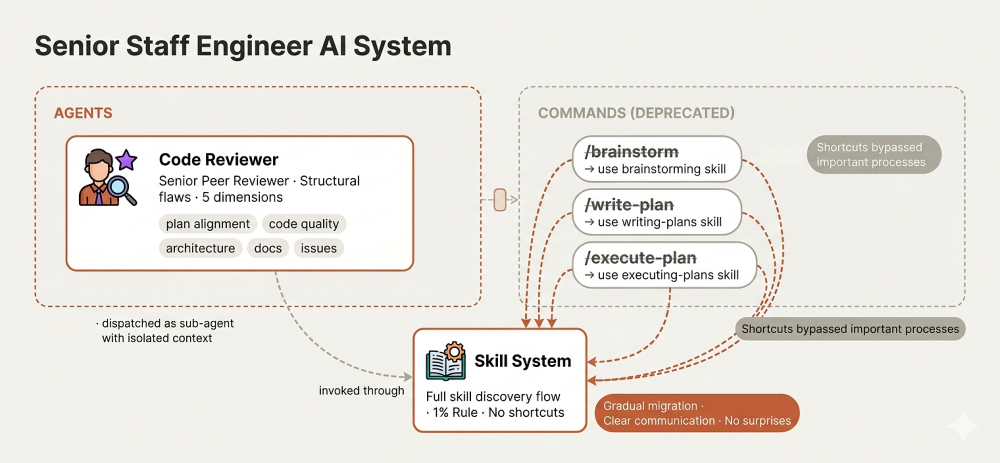

### 代码审查员智能体

我们已经在同行评审部分看到了代码审查员的完整职责。在 `agents/` 目录中，`code-reviewer.md` 将其定义为正式角色——带有特定专业知识和结构化审查流程的子智能体角色。

### 命令（已弃用的快捷方式）

`commands/` 目录包含三个文件，讲述了关于软件组织如何演化的有趣故事：

```markdown
# brainstorm.md
---
description: "已弃用——请改用 senior-staff-engineer:brainstorming 技能"
---
告诉你的人类合作伙伴此命令已弃用，将在下一个主要版本中删除。
```

写入的也是写作计划（`write-plan.md`）和执行计划（`execute-plan.md`）的弃用通知。

这三个都已弃用。它们曾经是直接命令快捷方式，就像在终端中输入 `/brainstorm`。随着系统的成熟，团队意识到这些快捷方式绕过了重要的流程——`brainstorm` 命令允许你直接跳入头脑风暴，而不经过技能发现流程；`write-plan` 允许跳过验证头脑风暴是否完整。

所以团队弃用了它们，不是删除，而是弃用。命令仍然存在，但现在它们礼貌地重定向："请改用技能。"

你不会一夜之间删除旧接口让人们遇到错误。你保留旧接口，让它解释变更，给人们时间适应。在组织层面，这就像一家曾经允许工程师直接从笔记本电脑部署的公司，随着团队成长建立了适当的 CI/CD 流水线。他们没有立即撤销笔记本电脑部署权限，而是添加了一条消息："直接部署已弃用，请使用 CI 流水线，该权限将在下个季度删除。"

弃用通知本身在代码库中存在，这就是组织成熟度的标志。初级工程师会直接删除旧文件，主任工程师知道某个地方的人对 `/brainstorm` 有肌肉记忆，当它消失时会感到困惑。

---

## 测试高级主任工程师

现在我们已经构建了每一个组件，可以通过向系统传递一个真实项目来测试它，观察它的行为。任务是从一批 YouTube 字幕中构建一个交互式技能关联可视化指南。让我们看看它是真的像高级工程师那样思考，还是直接跳去写代码。

**第一件事**，它做了高级工程师在新项目第一天会做的事：探索。它调用头脑风暴技能，派发子智能体扫描项目结构，在形成任何意见之前开始阅读文档。没有规划，没有架构，只是安静地理解现有的内容。

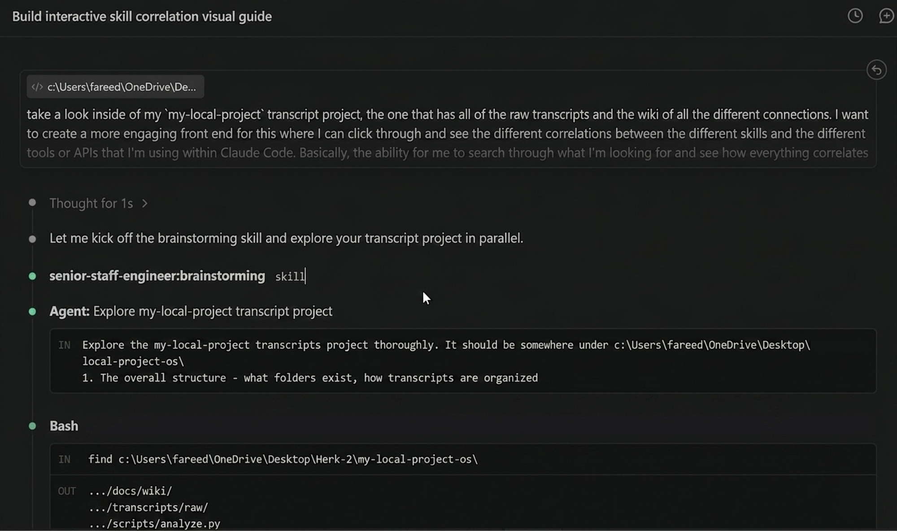

你可以看到它在分析文件夹结构，检查存在哪些字幕，它们是如何组织的，wiki 包含什么。这是头脑风暴清单中的"探索项目上下文"步骤，它正在彻底执行，而不是跳到令人兴奋的部分。

一旦完成探索，它将整个头脑风暴清单创建为待办清单，追踪每个步骤。"探索项目上下文"已经打勾。现在它转向"提供视觉伴侣"——这是大多数开发者甚至 Claude Code 的计划模式都会完全跳过的步骤。智能体建议，对于即将到来的一些设计问题，在浏览器中可视化可能比文字更好，所以它在提出第一个澄清性问题之前就提供了白板伴侣。

这是主任工程师的主动性——知道在会议中展示线框图比用三段 Slack 消息描述它更有价值。智能体没有被告知这样做，头脑风暴技能教它按问题评估视觉是否有帮助，它自己做了判断。

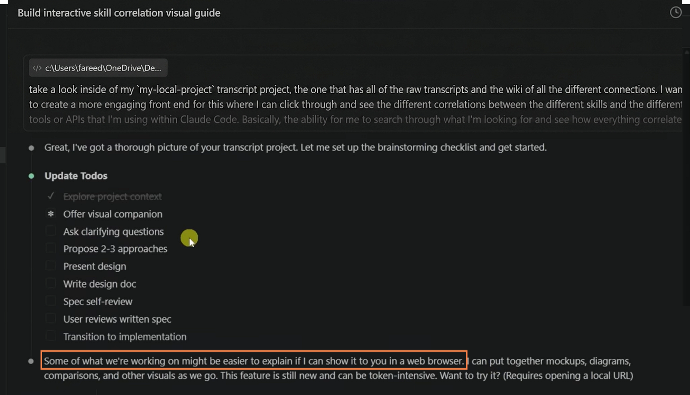

一旦我同意，它启动视觉伴侣服务器，确认 localhost URL，并立即开始第一个澄清性问题。但注意它在提问之前做了什么：它总结了在探索过程中发现的一切——56 个原始字幕、88 个 wiki 页面按类型分类、通过 Obsidian wikilink 的交叉引用结构。它在寻求方向之前展示了自己的功课。

然后是苏格拉底式提问，一次一个问题，正如头脑风暴技能要求的。"学生应该如何主要发现内容？"然后基于我的回答，它跟进："当学生点击一个节点时，详情视图应该显示什么？"然后："随着你发布新视频，你想怎么保持更新？"每个问题基于上一个回答，没有问题轰炸，没有五项调查，就是一条思维线索，追究到深处。

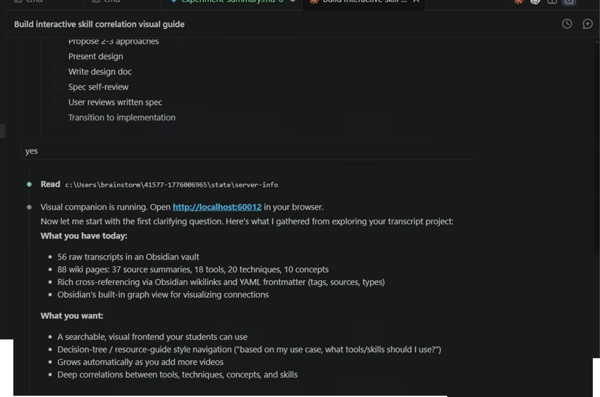

一旦它有了足够的理解，它没有跳去写代码，而是向视觉伴侣写 HTML，显示知识浏览器的三种不同方案，每种都有权衡分析，渲染在浏览器中，这样我可以看到和点击，而不是阅读和想象。

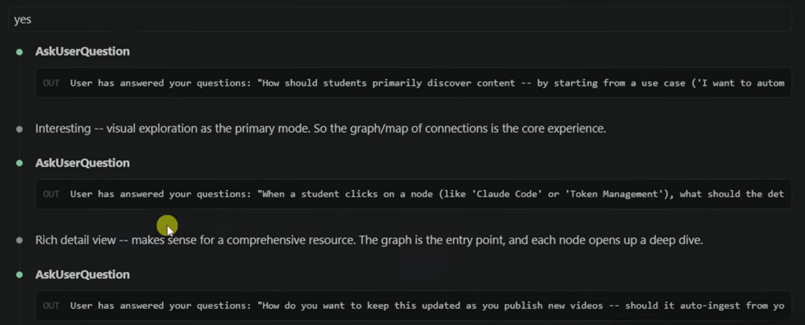

在浏览器中出现的是一个完整的知识图谱交互式模型——带有力导向节点，显示 Claude Code、MCP、Token 管理、RAG、技能及其连接，按类别用颜色编码，可拖动，可缩放，点击可查看详情。这是设计在第一行生产代码出现之前以视觉方式展示给人审批的样子。

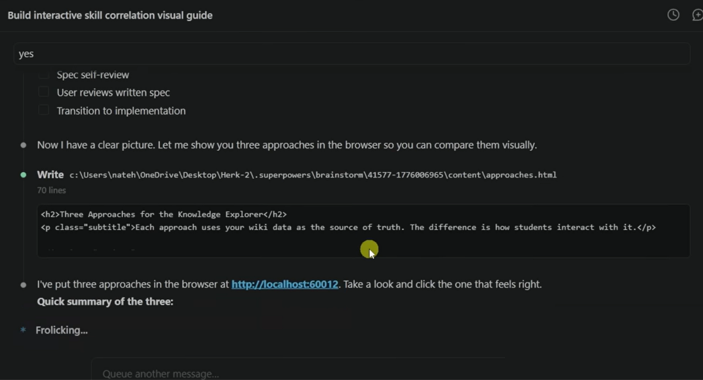

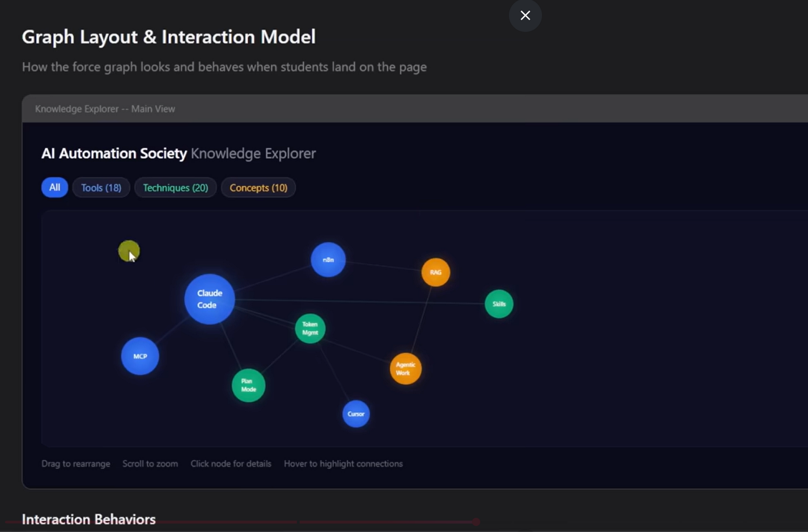

到目前为止，整个会话都是纯思考。没有实现，没有脚手架，没有"让我先设置项目结构"。只是一个探索了代码库、提出了专注的问题、并展示了视觉方案供人审批的智能体——正是高级主任工程师运营设计会议的方式。头脑风暴清单仍有"编写设计文档"、"规格自审"和"过渡到实现"待完成。它不会触碰代码，直到每个框都打了勾，人类说了"批准"。

这就是纪律严明的流程在真正被遵守时的样子。

---

## 如何进一步改进

- **跨会话记忆**：目前每次会话从新开始。一个持久记忆层——追踪过去的设计决策、已知的 bug 和架构模式——会让智能体随时间积累机构知识，就像在团队工作多年的真实主任工程师。

- **成本感知的模型路由**：模型选择器目前依赖管理者的判断。添加实际的每任务 token 成本追踪，并自动将简单任务路由到更廉价的模型，将使该系统对更大的项目具有生产可行性。

- **智能体间通信**：目前子智能体只向管理者汇报，从不互相交流。添加并行智能体之间的消息传递系统，将让它们在不经过管理者的情况下共享发现——比如"我发现了一个我们都需要的共享工具"。

- **技能的自动化回归测试**：技能在创建时经过手动压力测试，但随着底层模型的变化可能会漂移。一个每晚运行压力场景并在智能体开始突破技能防线时发出警报的 CI 流水线，将保持系统的锋利度。

- **人类反馈循环集成**：当人类覆盖一个决策或拒绝一个设计，那个信号应该反馈回技能系统，加强即将被违反的具体规则——让团队从修正中学习，就像真实团队从事后分析中学习一样。
