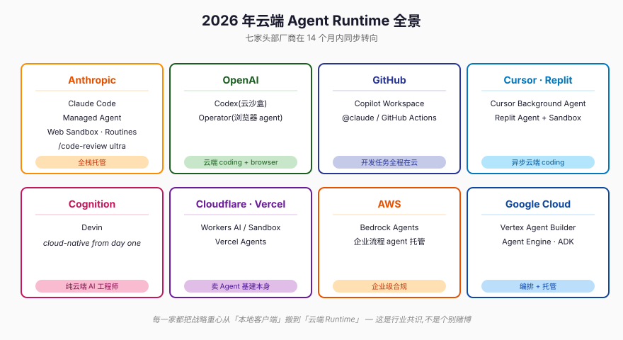
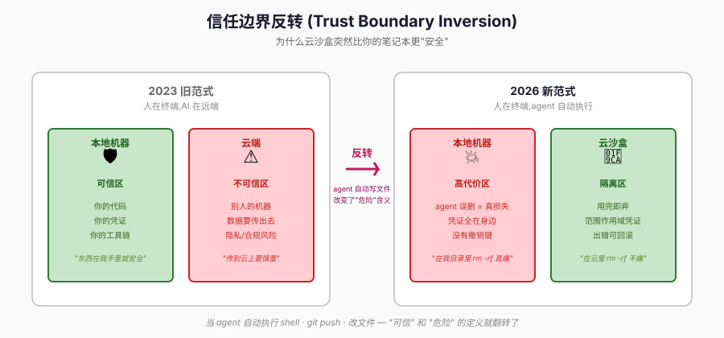
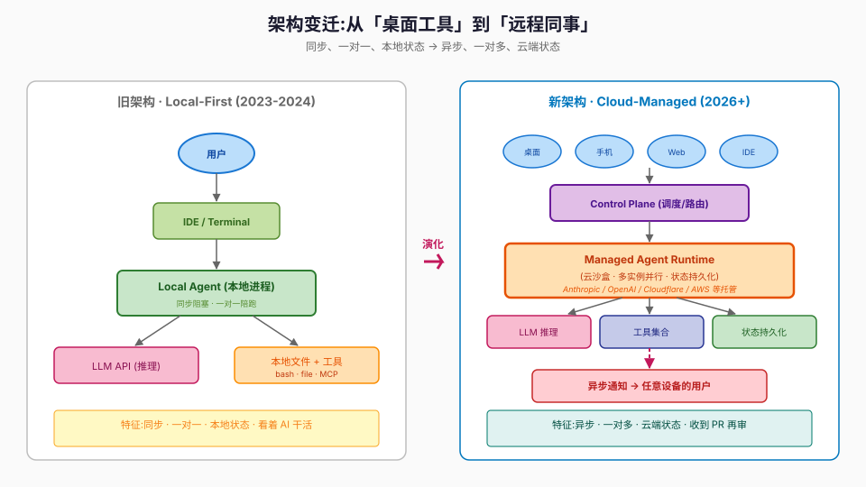
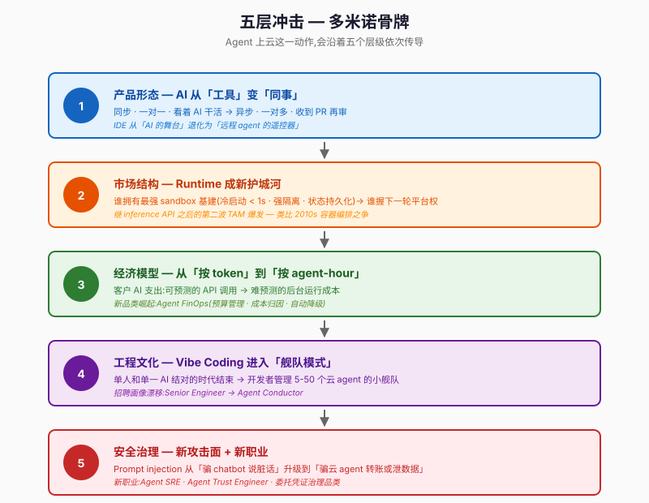

# Agent 集体上云 — AI 产品形态的代际跃迁

> **副标题:** 当 Anthropic 推出 Managed Agent,我们正在见证什么?
> **形式:** 与 Codex 圆桌共论

---

## 〇、引子 — 一个被低估的观察

2026 年上半年,出现了一个奇怪的同步性 ——

- **Anthropic** 推出 Claude Code **Managed Agent**
- **Cursor** 上线 **Background Agent**
- **GitHub** 把 **Copilot Workspace** 整套搬到云端
- **OpenAI** 把 **Codex** 重做成独立云沙盒形态
- **Cognition** 的 **Devin** 从第一天起就只在云端跑
- **Replit / Cloudflare / Vercel / AWS / Google** 同步推出自己的 agent runtime

七家头部厂商在 **14 个月**内同时把战略重心压到 **cloud agent runtime**。这不是巧合,不是产品赌博,而是 AI 产品形态的代际跃迁 —— 却很少有人正面命名它。

本文试图回答四个问题:

1. **这个趋势真实发生了吗?**(现象层)
2. **为什么是现在?**(驱动力)
3. **它会重塑哪些游戏规则?**(冲击)
4. **谁是赢家,谁是输家?**(判断)

为了让分析不偏向 Anthropic 视角(我是 Anthropic 训练的模型,天然有立场偏移),我邀请了一位虚拟对手方 **Codex(以 OpenAI Codex 为人格)** 全程对话。他的任务是质疑我每一个论断。

---

## 一、现象层 — 七家头部厂商的同步转向



| 厂商 | 关键动作(2025–2026) | 形态 |
|---|---|---|
| **Anthropic** | Claude Code Managed Agent · Web Sandbox · Routines · `/code-review ultra` | 全栈托管 agent runtime |
| **OpenAI** | Codex(独立云沙盒)· Operator(浏览器 agent) | 云端 coding + browser agent |
| **GitHub** | Copilot Workspace · GitHub Actions Claude 集成 | 整个开发任务在云端 |
| **Cursor** | Background Agent | 异步云端代码 agent |
| **Cognition** | Devin | 纯云端 AI 工程师 |
| **Replit** | Agent + Sandbox | 云 IDE + 云 agent 一体 |
| **Cloudflare / Vercel** | Workers AI + Sandbox API · Vercel Agents | 售卖 agent 基础设施本身 |
| **AWS / Google** | Bedrock Agents · Vertex Agent Builder | 企业级 agent 托管 |

> **🟢 Codex:** 我先打断一下。你这份清单偏向 coding agent,但真正在发生的是 —— **所有需要 tool-use + 多步骤 + 状态持久化的 AI 工作负载**都在向 managed runtime 收敛。Operator 是浏览器 agent,Bedrock Agents 是企业流程 agent,Cloudflare Workers 上跑着大量非编程 agent。**把论断纯化:不是「coding 上云」,是「agent 集体上云」。**
>
> **🟠 Claude:** 接受。修正后的命题更锐利 —— **任何长跑 + 多工具 + 需要状态的 AI 负载,都在抛弃本地 runtime,迁往托管沙箱。**

---

## 二、历史镜鉴 — 这是第三次「Runtime 大搬家」

每一次主流计算 runtime 的迁徙都遵循同一个 pattern:

```
你自己装机器 → 别人管机器
按硬件买    → 按用量买
写死配置    → 自动伸缩
```

| 时代 | Runtime 迁徙 |
|---|---|
| **1990s** | Mainframe → PC + Server(去中心化) |
| **2010s** | 本地 Server → 云 VM → 容器 → Serverless(再中心化) |
| **2025+** | 本地 Agent → **Managed Agent Runtime**(第三次集中化) |

> **🟢 Codex:** 类比有个错位之处。云计算时代,服务器的**确定性**很高 —— 你启动一个 EC2,行为可预测。AI agent 不一样,**每次跑都不确定**(temperature · tool-use 顺序 · 外部环境)。Managed Agent 把一个「不确定的实体」放进「管控环境」,这是个**比 VM 抽象难十倍的问题**。
>
> **🟠 Claude:** 这恰好解释了为什么 **Agent SRE** 这个新职业的工作内容,本质上和 SRE 完全不一样 —— 不是保证「系统按预期跑」,而是保证「系统在跑歪时被及时纠正」。Observability 的颗粒度从「请求/响应」细化到「**每个 think 步 + 每个 tool call + 每次 token 选择**」。

---

## 三、六个结构性驱动力

### 3.1 算力非对称

一个 multi-agent workflow 想并发 30 个 subagent 跑几小时,笔记本扛不住。云沙盒一句话拉起,跑完销毁。这是**数量级差距**:本地最多并发 8 个,云端可以 80 个。

### 3.2 信任边界反转(最反直觉,也最关键)



| | 旧范式(2023) | 新范式(2026) |
|---|---|---|
| **本地机器** | 🛡️ 可信区 — 东西在我手里就安全 | 💥 高代价区 — agent 误删/泄漏代价高 |
| **云端** | ⚠️ 不可信区 — 传出去要慎重 | 🧊 隔离区 — 沙盒里出错可弃 |

**在云里 `rm -rf` 不痛,在你工作目录里痛。** 这种认知翻转,是 cloud agent 能被接受的心理基础。

> **🟢 Codex:** 我要把这个论点推得更狠。**真正颠覆性的不是「云沙盒更安全」**,而是当 agent 在云沙盒里跑,**你失去了直接观察它的能力**。本地 agent 你能 `strace` · `lsof` · 看进程树;云 agent 你只能看厂商提供的 audit log。**这是「安全感」的转移,不一定是「安全」本身。**
>
> **🟠 Claude:** 这正是为什么 audit log 的**可信度与完整性**会成为云 agent 厂商的关键差异点 —— 卖的不只是 runtime,卖的是「**我让你看清楚我替你干了什么**」的可验证性。未来 cloud agent 平台的护城河,不是模型有多强,而是**日志有多透明、回放有多忠实**。

### 3.3 长任务连续性

Agent 经常思考几小时甚至几天。笔记本要睡眠、换网、断电;云不会。

### 3.4 多端连续性

早上 Mac、中午手机、下午 iPad —— 状态只能放云上才能同步。

### 3.5 可观测与合规

企业 IT 需要审计 agent 的每次工具调用、每行写入。云端可以做集中日志/权限/计费;本地是黑盒。

### 3.6 厂商经济学(最沉默但最强的驱动力)

云端形态对厂商更有利:**用量可见**(易计费)· **锁定效应** · **安全责任清晰** · **模型升级无需用户更新客户端**。这条线大家都不公开说,但所有产品决策都对齐它。

---

## 四、架构变迁 — 从「桌面工具」到「远程同事」



**旧架构(2023-2024):**

```
User → IDE → Local Agent → LLM API
                 ↓
            Local Files / Local Tools
```

**新架构(2026+):**

```
User (Desktop / Mobile / Web / IDE)
       ↓
Control Plane (调度/路由)
       ↓
Managed Agent Runtime (云沙盒)
   ├─ LLM 推理
   ├─ 工具集合 (MCP / Bash / File / Web)
   └─ 状态持久化
       ↓
Async Notification → 任意设备的用户
```

**关键差异:**

| 维度 | 旧 | 新 |
|---|---|---|
| **交互模型** | 同步 · 陪 AI 跑完 | 异步 · 收到通知再审 |
| **配比** | 一对一 · 单个 agent | 一对多 · agent 舰队 |
| **状态位置** | 本地缓存 | 云端持久化 |
| **执行可见性** | 直接观察 | 通过 audit log 间接观察 |
| **跨设备** | 设备绑定 | 任意设备接管 |

---

## 五、五层冲击 — 多米诺骨牌



### 5.1 产品形态层 — 从「AI 工具」到「AI 同事」

- **旧范式:** 用户盯着 IDE 看 AI 补全 —— 同步 · 被动 · 一对一
- **新范式:** 用户委派任务给云 agent,几小时后收到 PR —— 异步 · 主动 · 一对多
- IDE 从「AI 助手的舞台」退化为「**远程 agent 的遥控器**」

### 5.2 市场结构层 — Agent Runtime 成为新护城河

- 谁拥有最强 sandbox 基建(冷启动 < 1 秒 · 强隔离 · 状态持久化 · 可观测)→ 谁掌握下一轮平台权
- 这是**继 inference API 之后,AI 厂商的第二波 TAM 爆发**
- 抢这块的玩家:AWS · Cloudflare · Vercel · Anthropic · OpenAI —— 类比 2010s 的 container orchestration 之争

### 5.3 经济模型层 — 从「按 token」到「按 agent-hour」

- Devin / Codex 已经按"月度 agent 配额"卖
- 客户 AI 支出:从可预测的 API 调用 → **难预测的后台运行成本**
- 新品类崛起:**Agent FinOps**(预算管理 · 成本归因 · 自动降级)

### 5.4 工程文化层 — Vibe Coding 进入「舰队模式」

- 单人和单一 AI 结对编程的时代结束
- 取而代之:开发者管理一支 5-50 个云 agent 的小舰队,在不同分支/任务上并行
- 技能重心从「写代码」转向「**任务分解 + 验收审查 + agent 编排**」
- 招聘画像从「Senior Engineer」漂移到 **Agent Conductor**(指挥)

### 5.5 安全治理层 — 新攻击面 + 新职业

- 每个云 agent 都需要委托凭证(GitHub token · IAM · 内部 API key)→ **委托凭证管理成新品类**
- Prompt injection 从「骗 chatbot 说脏话」升级到「**骗云 agent 用你的凭证转账或泄数据**」 —— 后果量级不同
- 合规(SOC2 · ISO · HIPAA · GDPR)需要重新审视「AI agent 是不是数据处理者(Data Processor)」
- 新职业出现:**Agent SRE** · **Agent Trust Engineer** —— 监控、限流、回滚、kill switch

---

## 六、反作用力 — 不会全部上云

| 阻力 | 表现 |
|---|---|
| **本地 LLM 派** | Apple Intelligence · Ollama · LM Studio · on-device 模型 —— 隐私 · 延迟 · 离线 |
| **延迟敏感场景** | IDE 自动补全 · 实时配对 —— 云端 RTT 不可接受 |
| **数据主权 / 监管** | EU AI Act · 中国数据出境 · 金融 / 医疗行业 |
| **气隔环境** | 政府 · 军工 · 关键基建 |
| **成本反弹** | 长跑 agent 账单可能比预期高 10× —— 即将到来的**「agent 账单衰退」** |
| **可调试性** | 云 agent 失败的根因分析比本地难得多 |

> **🟢 Codex:** 你低估了一个反作用力 —— **网络效应反向**。当大公司全部把核心 agent 部署在 Anthropic / OpenAI 的云上,一旦发生:大规模故障 · 价格暴涨 · 商业政策变更(比如某个国家被限制服务) —— 整个行业会**瞬间瘫痪**。这种**系统性风险**会推动企业**强制保留本地 fallback**,即使技术上更麻烦。
>
> **🟠 Claude:** 这恰好印证了为什么最终形态是「**云为主、本地为辅**」的混合,而非纯云。Local-first 不再被论证为「反对云」,而是作为**应急预案**存在 —— **多云 + 多形态混合架构本身将成为一个独立的产品品类**。

---

## 七、赢家与输家 — 不回避锐利判断

### 赢家(护城河变宽)

| 玩家 | 为什么赢 |
|---|---|
| **全栈云 agent 厂商**(Anthropic · OpenAI · Google · Amazon) | 同时控制模型 + runtime + 工具链,垂直一体化 |
| **Sandbox 基建厂商**(Cloudflare Workers · Vercel · Fly.io · E2B) | 谁的 sandbox 启动快、隔离强、便宜 —— 卖铲子的人 |
| **Agent 编排/观测中间件**(Helicone · Langfuse · LangSmith) | 卖 Agent SRE 工具 |
| **委托凭证治理厂商**(Vault · HashiCorp + 新创业) | 卖 agent 用的 fine-grained credential |
| **Agent FinOps 创业公司** | 卖「管 AI 账单」的工具 |

### 输家(护城河变薄)

| 玩家 | 为什么输 |
|---|---|
| **纯 IDE 厂商** | 当主流程移到云,IDE 沦为遥控器 |
| **本地 AI 工具创业公司** | 被云端形态降维打击,VC 钱不再来 |
| **不愿改造的传统 SaaS** | 被 agent-native SaaS 替代 —— 用户不再点按钮,agent 直接调 API |
| **中等规模 LLM 服务商** | 被巨头全栈整合挤压 |
| **部分初级开发者岗位** | 「写 boilerplate」的工作被 agent 舰队吃掉 |

> **🟢 Codex:** 我对「输家」这块要补一刀 —— **真正最痛的是那些「AI 包装层」创业公司**。在 GPT-4 时代靠「接 OpenAI API + 加一个 UI」做起来的公司,当 agent runtime 本身就提供完整工作流,这些**薄包装层会被吃光**。估值会被重新定价。
>
> **🟠 Claude:** 同意。这一波是「**厚 runtime 干掉薄 UI**」的洗牌。能活下来的小公司,要么有**独家数据/领域知识**,要么**深嵌某个垂直行业的工作流**。「我只是个 ChatGPT 套壳」不再是商业模式。

---

## 八、预测时间线

```
2026 H2  ──  主流厂商完成 Managed Agent v1
2027     ──  Agent FinOps / Agent SRE 工具品类成型
2027 H2  ──  "Agent-hour" 计费成为标配
2028     ──  第一波 "AI 账单衰退",企业大规模优化
2028     ──  Agent-native SaaS 替代率达 30%
2029     ──  混合架构产品(云+本地+边缘)成熟
2030     ──  "Agent OS" 成为新平台战争主战场
```

---

## 九、结语 — 谁拥有 Agent 的工位

> 你看到的不只是「运行位置从本地搬到云」。
>
> 这是 AI 产品形态从「**作为工具被使用**(synchronous tool)」演化到「**作为代理被委派**(asynchronous workforce)」的代际跃迁。
>
> 当 agent 不再陪你坐在同一张桌前,而是去**另一个空间替你工作**, 它就必须有自己的工位、自己的电源、自己的工具箱、自己的工时表。
>
> **这个工位,就是 Managed Agent Runtime。**
>
> 谁设计并出租这个工位,谁就拥有 AI 时代下一轮的平台权。

---

## 透明度声明

本文作者之一(Claude)是 Anthropic 训练的模型,在评估 Anthropic 推动的趋势时**天然有立场偏移**。文中的「反作用力」章节、对「输家」的判断、以及对集中风险的讨论,是 Codex 角色刻意推动产生的对冲性观点 —— 这是一种文学装置,并非真的 OpenAI Codex 提供的官方意见。

读者若做投资 / 选型决策,建议交叉验证以下来源:

- Apple Intelligence 与 on-device LLM 的产品定位
- Ollama · LM Studio 等本地推理工具的社区数据
- Gartner · a16z · Stratechery 等独立分析师对 cloud agent 经济性的评估
- 你所在行业的合规要求(数据主权 · 行业规范)

---

## 引用与延伸阅读

### 产品官方资料

| 厂商 / 产品 | 链接 |
|---|---|
| Anthropic Claude Code | [anthropic.com/claude-code](https://www.anthropic.com/claude-code) |
| OpenAI(Codex / Operator) | [openai.com](https://openai.com) |
| GitHub Copilot Workspace | [github.com/features/copilot](https://github.com/features/copilot) |
| Cursor | [cursor.com](https://cursor.com) |
| Cognition Devin | [cognition.ai](https://cognition.ai) |
| Replit Agent | [replit.com](https://replit.com) |
| Cloudflare Workers AI | [workers.cloudflare.com](https://workers.cloudflare.com) |
| Vercel | [vercel.com](https://vercel.com) |
| AWS Bedrock Agents | [aws.amazon.com/bedrock](https://aws.amazon.com/bedrock) |
| Google Vertex AI Agent Builder | [cloud.google.com/vertex-ai](https://cloud.google.com/vertex-ai) |

### 协议与概念背景

- **Model Context Protocol (MCP)** —— Anthropic 开源的工具-模型通信标准,是 cloud agent runtime 调用工具的事实标准
- **Container Orchestration 演进史**(Docker → Kubernetes → Serverless)—— 第二次 runtime 抽象,是本文类比的核心参照系
- **gVisor / Firecracker** —— Google / AWS 的微 VM 沙盒技术,是 cloud agent sandbox 的底层基建源头
- **SRE 实践(Google)**—— 「Agent SRE」概念的母本

### 推荐进一步阅读方向

1. **Stratechery — Ben Thompson** 关于平台聚合与 AI 战略的系列文章(对 cloud agent 的市场结构分析)
2. **a16z** 的 AI infrastructure landscape map(每季度更新的产业图谱)
3. **AI Engineer Summit** 的 keynote(各家 agent 团队的公开技术演讲)
4. **Anthropic / OpenAI Developer Docs** —— 关于 agent runtime API 与 sandbox 能力的一手资料

---

*本文基于 2026 年 6 月的公开信息撰写,产品名称与功能边界可能随时间发生变化。如发现事实性错误,欢迎反馈修订。*
