> 作者：Ran Isenberg
> 发布日期：2026-02-03
> 原文链接：https://blog.devops.dev/ai-driven-sdlc-how-to-build-secure-governed-and-scalable-software-with-ai-3d71f7294bca

# AI 驱动的 SDLC：如何借助 AI 构建安全、可治理且可扩展的软件

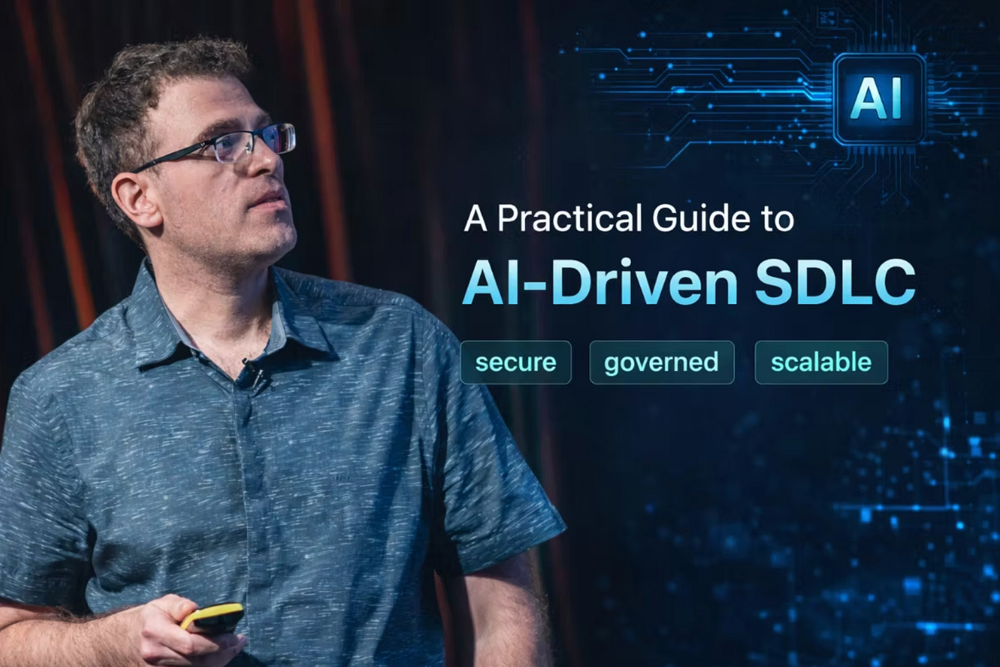

我们都遵循某种形式的软件开发生命周期（Software Development Life Cycle，SDLC）来将产品构想推进到生产环境。几十年来，这一模式主要由人类主导——工具提供辅助，流程依赖人工把控。

过去一年，AI 智能体（agent）进入了日常工程工作流，开始重塑软件构建的方式。开发者如今与自治系统（autonomous systems）并肩协作，这些系统能够以前所未有的速度完成规划、设计、实现、测试和运维。

正确应用时，这一转变使团队能够更快交付更高质量的软件，也让新员工从第一天起就能做出有意义的贡献。但若缺乏治理（governance）和安全保障，则会带来碎片化、技术债务（technical debt）以及严峻的运营风险。

本文探讨 AI 如何改变 SDLC、无序引入为何会拖慢团队而非加速，以及组织如何构建一套安全、可治理且可扩展的 AI 驱动开发模型。

[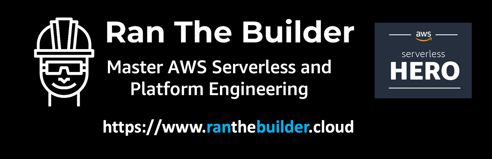](https://www.ranthebuilder.cloud/)

[立即预约 AWS Serverless 或平台工程咨询！](https://www.ranthebuilder.cloud/)

## 目录

- [传统软件开发生命周期](#传统软件开发生命周期)
- [传统 SDLC 的缺陷](#传统-sdlc-的缺陷)
- [AI 赋能开发者的愿景](#ai-赋能开发者的愿景)
- [AI 驱动的软件开发生命周期简介](#ai-驱动的软件开发生命周期简介)
- [早期 AI 引入的问题](#早期-ai-引入的问题)
- [构建安全可治理的 AI-SDLC](#构建安全可治理的-ai-sdlc)
- [AI 驱动 SDLC 中的治理与安全层](#ai-驱动-sdlc-中的治理与安全层)
- [AI-SDLC 的挑战](#ai-sdlc-的挑战)
- [总结](#总结)
- [参考资料](#参考资料)

## 传统软件开发生命周期

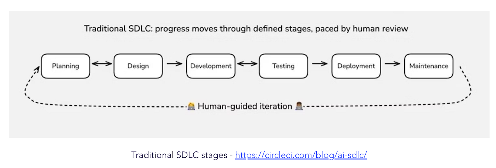

*传统 SDLC 各阶段 — [https://circleci.com/blog/ai-sdlc/](https://circleci.com/blog/ai-sdlc/)*

近几十年来，传统 SDLC 帮助团队稳定交付软件，其流程包含以下几个阶段：

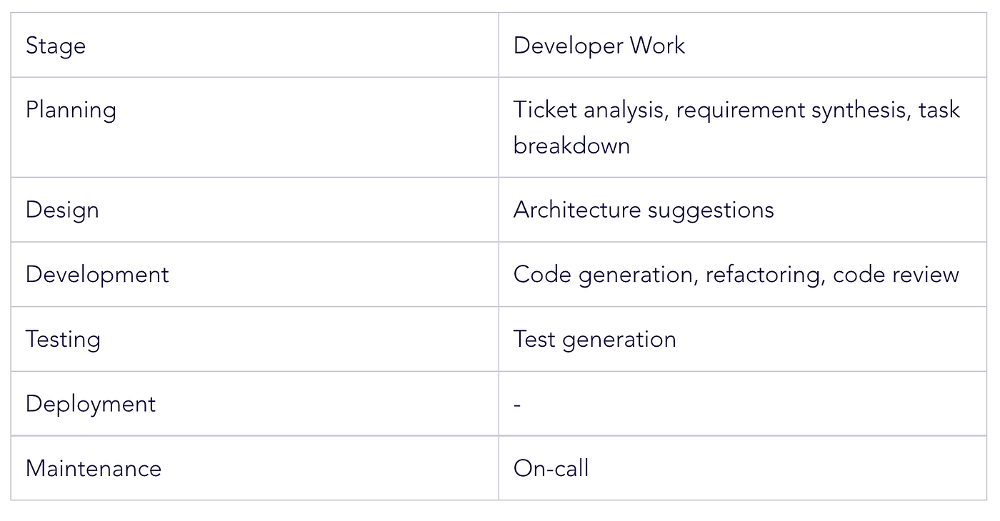

## 传统 SDLC 的缺陷

传统 SDLC 支撑了数十年的软件可靠交付，但在大规模场景下也暴露出若干结构性弱点。

> AI 辅助开发（AI-assisted development）——AI 强化特定任务，例如文档、代码补全和测试；以及 AI 自治开发（AI-autonomous development）——AI 根据用户需求无需人工干预地生成完整应用。两种方式在速度和软件质量方面均产生了次优结果，这正是 AI-SDLC 力图解决的问题。— AWS

**1. 最佳实践执行不一致**

工程规范、安全准则和架构原则往往有文档记录，却执行参差不齐。随着团队规模增长，确保每位开发者始终遵循最佳实践愈发困难。现有的执行机制依赖人工审查和个人自律。静态代码 linter 有一定效果，但还远远不够。

**2. 代码审查是一门主观的艺术**

代码审查既不可或缺，又高度主观。审查质量严重依赖审查者的经验、可用时间和注意力。在时间压力下，审查往往只聚焦表面问题，而忽略更深层的架构、安全或可维护性隐患。这导致反馈不一致，风险被遗漏。

**3. 规划模糊且不完整**

有效的规划需要清晰的需求和结构化的任务分解。现实中，规划往往仓促或残缺。许多开发者不喜欢写详细规格说明，导致工单内容含糊。这种模糊性向下游传播，造成后期返工。

**4. 测试质量参差不齐且覆盖有限**

实现全面且有意义的测试仍是一项挑战。很少有团队能覆盖所有业务场景、边界情况和失败模式。高质量的测试设计往往需要专职的 QA 架构师，但这一角色并不总是存在。因此，关键场景经常被遗漏。

**5. 反馈循环缓慢**

当规划不清晰、审查不一致、测试不完整时，反馈就会在生命周期的末尾才到来。问题在集成、部署甚至生产阶段才被发现，而那时修复成本已远高于早期阶段。

这种状况已持续多年，不会一夜之间改变，但 AI 可以优化它，提升整体质量和团队效率。

## AI 赋能开发者的愿景

**TL;DR：** 每位开发者在自己偏好的 IDE 中工作，使用组织配置的、经过安全审查的 AI 助手，在整个 SDLC 中遵循标准化的规范驱动（spec-driven）流程。

在 AI 驱动的 SDLC 中，开发者在交付的每个阶段都与 AI 智能体协作，从规划和设计到开发、测试、部署和运维，无一例外。这些智能体可以根据任务需要，扮演架构师、工程师、安全专家或 SRE 的角色。

相较于使用零散的 AI 工具，这一模型将智能体直接嵌入生命周期，充当随时可用的高级工程师、架构师和审查员。智能体协助完成工单分析、设计、实现、测试、审查、部署和事故响应，减少人工开销，缩短反馈周期。

在幕后，所有智能体遵循一致的流程，生成可重复的输出，并通过集中式、安全且可审计的集成层和配置来访问内部工具、服务和数据。

这种方式在保留个人生产力和灵活性的同时，确保所有工作都符合公司标准和最佳实践。

## AI 驱动的软件开发生命周期简介

AI 有潜力强化 SDLC 的每个阶段，从工单创建和需求分析，到设计、实现、测试、部署和运维。

AI-SDLC 不是将 AI 视为一组孤立工具，而是将智能系统直接集成到现有工作流中。这些智能体与 Jira、源代码管理系统、MCP 服务、CI/CD 流水线和可观测性（observability）工具交互，同时在统一的治理和安全策略下运行。

以下是 AI 融入 SDLC 的几个示例：

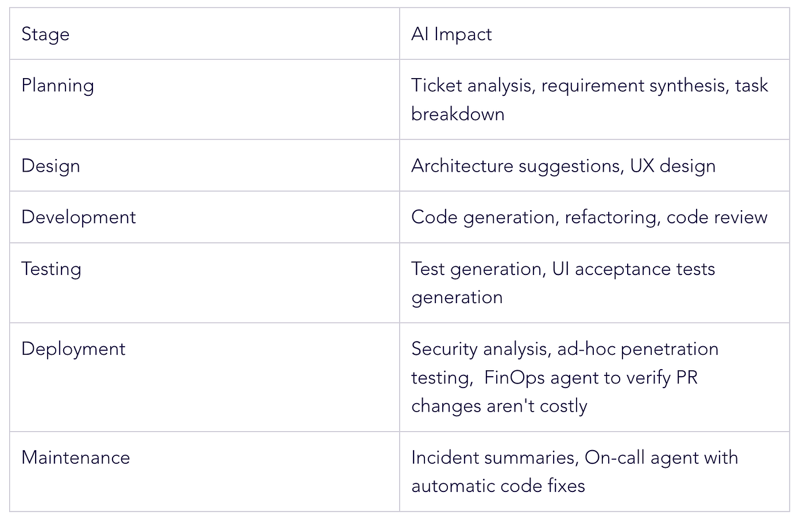

AI 有潜力强化 SDLC 的每个阶段——从工单创建和需求分析，到设计、开发、测试、部署和运维。AI-SDLC 不是将其视为一组孤立工具，而是将智能系统直接嵌入现有工作流，与 Jira、源代码管理、MCP 服务、CI/CD 流水线和可观测性工具集成，并在统一的治理和安全策略下运行。

在各阶段，AI 支持规划、架构、编码、测试、安全验证和事故响应，同时提供大规模分析和持续反馈。这些能力共同减少了人工开销，加快了交付速度，提升了质量，同时不失去控制权。

## 早期 AI 引入的问题

大多数组织以碎片化的方式引入 AI（主要集中在代码开发环节），且由个别开发者自发驱动，而非协调一致的策略。这导致工作流不一致，结果难以预测。

不同团队使用不同的工具、提示词（prompt）和配置，难以产出可重复的结果。缺乏集中的安全控制，AI 集成可能暴露敏感数据，造成过度授权的访问路径。

缺乏治理意味着 AI 生成的代码往往忽视内部规范、库和命名约定，增加技术债务和重构工作，甚至通过暴露组织数据和服务的 MCP 服务器引入安全问题。

无结构的"随性编码"（vibe coding）在实验中或许可行，但无法扩展到生产系统。

工具蔓延（tool sprawl）和配置漂移（configuration drift）带来运营复杂性，降低可靠性。

此外，开发者与 AI 协作不当会导致 token 浪费、上下文重复构建、更长的审查周期和更高的成本，而非提升效率。

> 想要成功的团队需要更新心智模型，以匹配当今的现实——工作向多个方向流动，决策更加分散，人类与自治系统并肩构建。— [https://circleci.com/blog/ai-sdlc/](https://circleci.com/blog/ai-sdlc/)

成功引入 AI 不仅是技术挑战，也是文化和管理挑战。开发者需要信任工具，理解其价值，持续看到高质量的输出，并在改变工作方式时感到有支撑。当 AI 能持续交付真实价值、可重复的结果和更短的 SDLC 周期，开发者才会更愿意接受它。

## 构建安全可治理的 AI-SDLC

在可治理的 AI-SDLC 中，开发者继续在自己偏好的 IDE 中工作，同时在交付的每个阶段使用组织认可的智能助手。

组织提供一套安全、标准化、规范驱动的开发流程。

> 规范驱动开发（spec-driven development，SDD）是指在用 AI 写代码之前先编写"规格说明"（"文档优先"）。规格说明是一种结构化的、面向行为的制品——或一组相关制品——以自然语言表达软件功能，作为 AI 编码智能体的指引。— Martin Fowler

每个阶段产生结构化的输出，为下一阶段积累上下文。这些制品与代码一起存储在仓库中，作为后续阶段的输入。例如，规划输出指导架构和设计决策，而这些决策又驱动实现和测试。

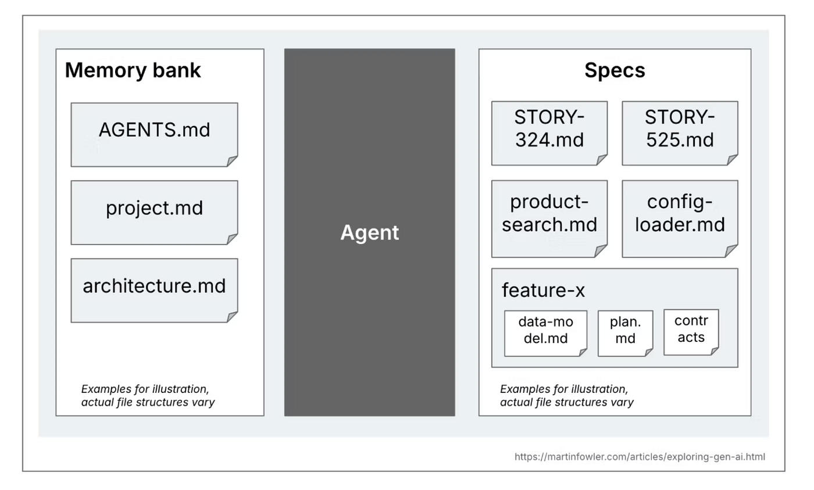

*规格说明的定义*

这种上下文的持续积累确保了一致性、可追溯性和与组织标准的对齐。

SDLC 的每个阶段遵循一个共同的子流程：规划、与利益相关方验证、执行。这一模式产生可预测的结果，支持早期反馈，减少代价高昂的返工。

这些实践共同构成了可扩展、安全、可重复的 AI 驱动开发生命周期的基础。

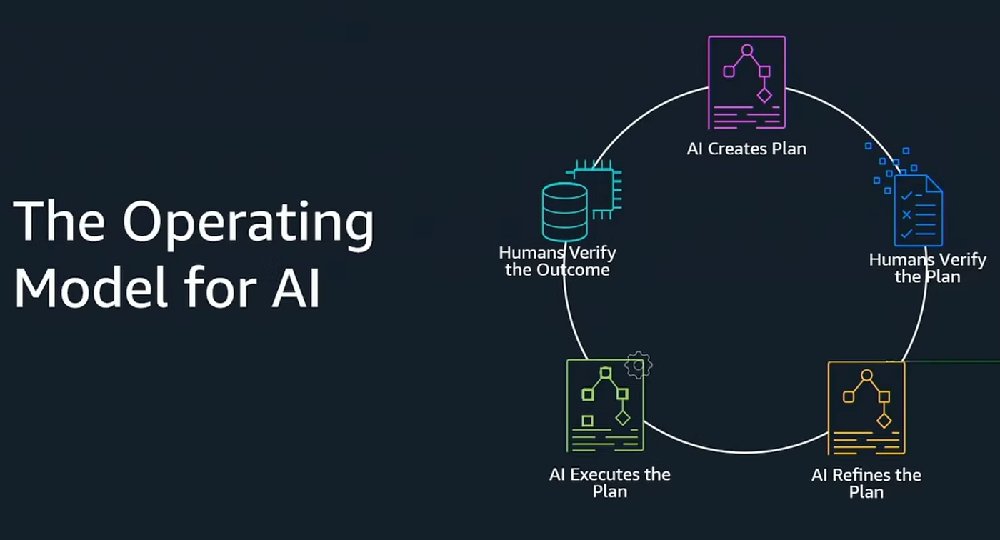

*AWS — AWS re:Invent 2025 — Spec-driven development with Kiro (DEV314)*

## AI 驱动 SDLC 中的治理与安全层

要使 AI 驱动的开发具有可扩展性和可信度，治理和安全必须嵌入生命周期的每个阶段，并与组织数据和工具深度集成。

安全的规范驱动开发模型建立在若干基础层之上。

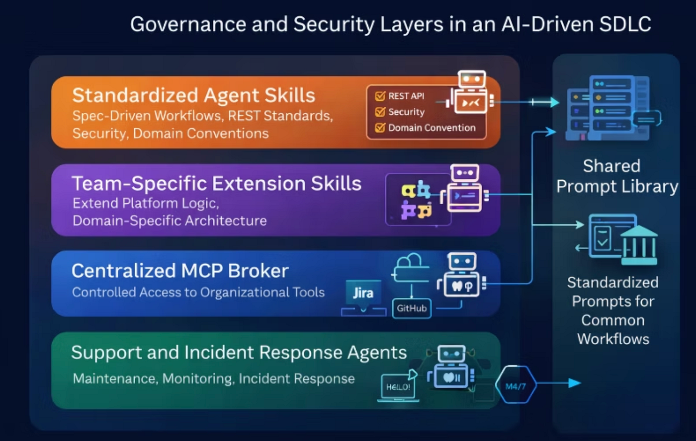

**标准化智能体 AI-SDLC 技能**

所有代码仓库和已获批的 IDE 使用一套通用的智能体技能。这些技能强制执行规范驱动的工作流，并标准化每个交付阶段，包括需求定义、架构设计、工具使用和工程实践。这确保了 REST 规范、安全模式、领域约定和内部框架的一致应用。

**团队专属扩展技能**

服务团队可以用反映自身领域逻辑、架构模式和运营需求的自定义技能扩展核心平台，同时仍在组织标准内运作。

**集中式 MCP Broker**

由平台、IT 和安全团队集中管理的 MCP broker，控制对内部和外部工具的访问。只有经过审批和配置的服务才对智能体开放，确保本地和远程环境中集成的安全性、可审计性和合规性。

**共享提示词库**

为常见工作流和专项任务（如入职、平台采用、迁移和合规验证）提供可复用、经过审查的提示词模板。这些提示词通过内部 CLI、库和托管仓库分发，支持跨团队的一致使用。

**支持与事故响应智能体**

专用的运营智能体在维护阶段提供支持：监控系统、汇总事故、协助根因分析（root cause analysis），并在适当时协调自动化修复。

### 示例流程：从 Jira 工单到生产环境

1. 开发者打开自己选择的 IDE。
2. 使用内部库中的认可提示词，开发者通过智能体界面发起 Jira 工单分析和任务分解。
3. 智能体生成结构化计划并存储到本地仓库，同时识别待解答的问题并请求澄清。
4. 开发者细化需求并验证提议的任务。
5. 智能体迭代实现各任务（含测试），随着系统演进同步更新规格说明和设计制品。
6. 开发者审查每项变更，并提交代码和更新后的文档。
7. 智能体运行所有 PR 所需的 linter，并发起 pull request。
8. 专项智能体——包括代码质量、FinOps 和安全审查员——对 pull request 进行审查。
9. 人工审查者验证业务意图并批准合并。
10. 部署后，支持智能体监控生产系统，通过可观测性平台呈现异常。

### 使用 Kiro 进行规范驱动任务实现的示例

首先，生成服务的当前架构（只需一次，每个功能迭代更新）。每个生成的文件都为手头的下一个任务提供上下文。

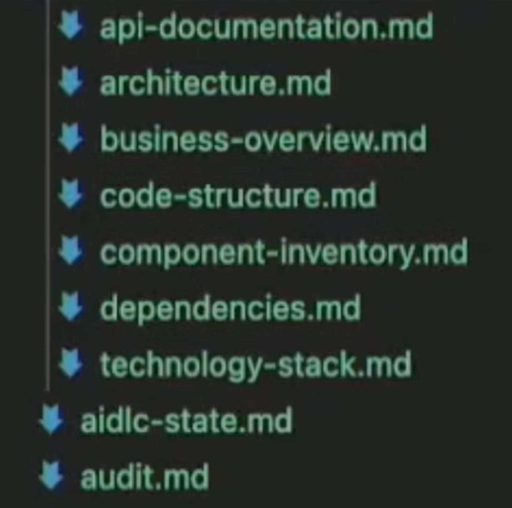

*每个生成的文件都为下一个任务提供上下文*

使用本地文件定义需求并请求澄清：

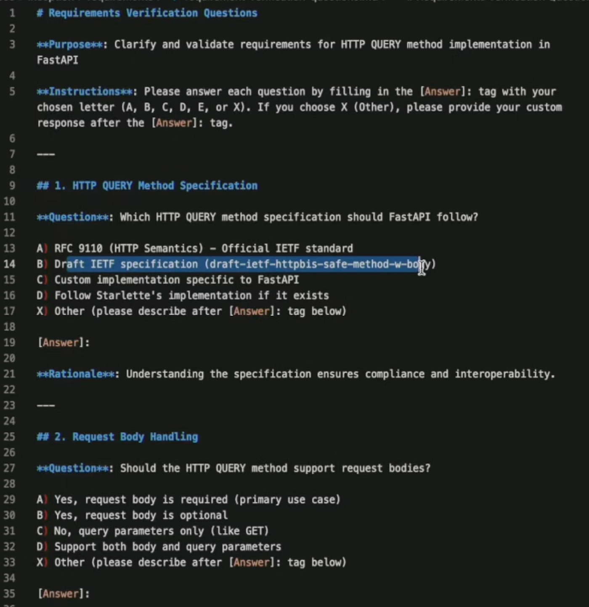

*使用本地文件定义需求并请求澄清*

创建任务规格说明，展示各步骤，请求人工验证：

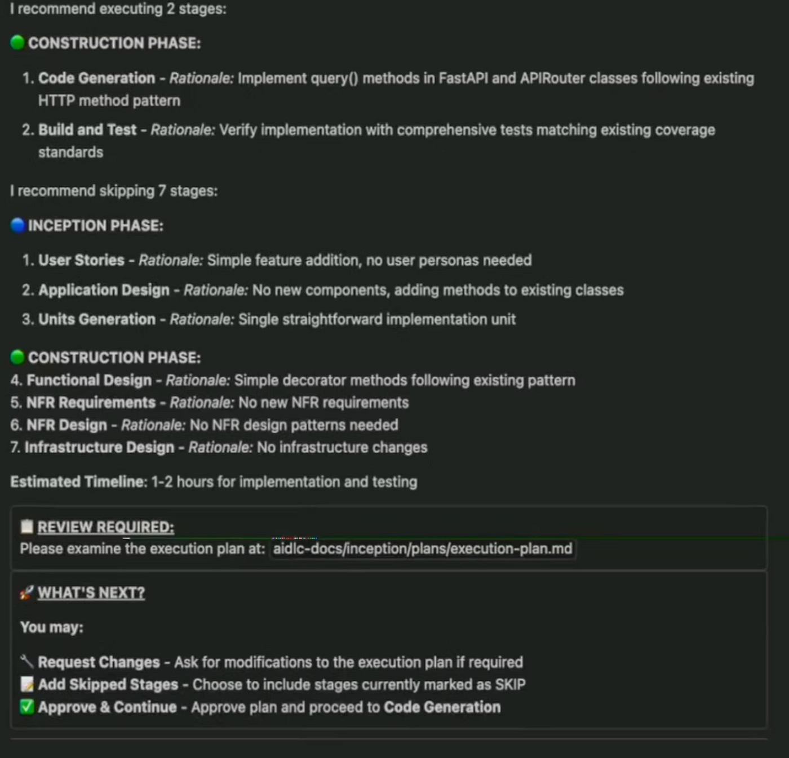

*创建任务规格说明，展示步骤并请求人工验证*

追踪 AI-SDLC 进展：

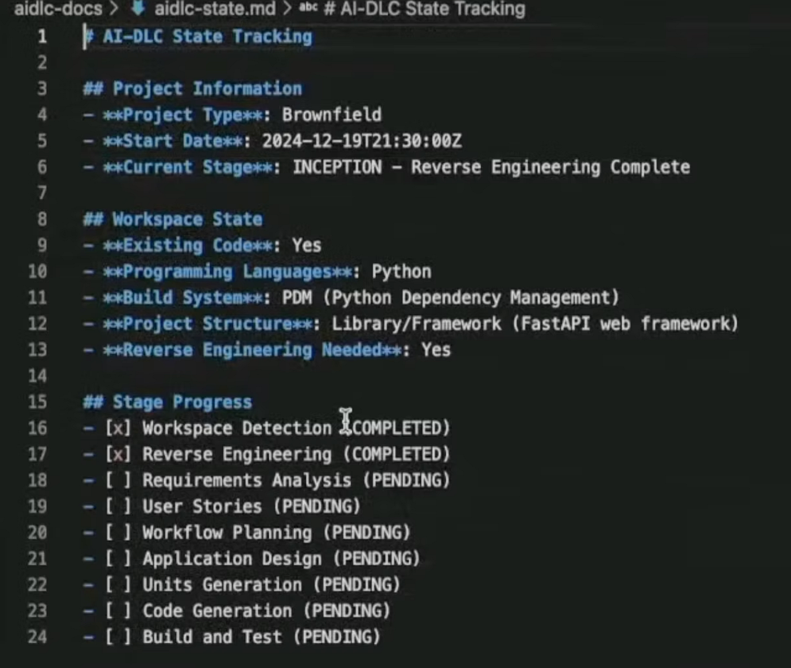

## AI-SDLC 的挑战

与所有新方法论一样，存在若干挑战：

- 使用 AI 是一种需要团队主动培养的技能。治理通过提供更好的开箱即用效果、减少常见错误，以及通过培训、共享实践和知识传递支持采用，有助于加速这一过程。
- 随着开发速度加快，传统代码审查面临成为瓶颈的风险。大型 AI 生成的 pull request 难以审查，会拖慢团队节奏。保持 PR 小型化并引入审查智能体，有助于标准化质量，让开发者聚焦业务意图，而非格式和风格。
- 由于非确定性的特性，以及不同仓库、服务、任务复杂度和所用模型之间的差异，工具难以评估。

此外，规范驱动开发还带来若干实践挑战：

- 设计既结构化又不过于冗长繁琐的工作流。如果规格流程太重，开发者会绕开它，因此需要持续调优。
- 选择一款能长期有效的规格工具。大多数工具都有强烈的主见，采用不同的方式——例如"规格优先"（spec-first，预先编写详细规格）和"规格锚定"（spec-anchored，在功能生命周期中持续维护规格）。Kiro、Spec-It 和 BMAD 等工具各有侧重，使得标准化和切换工具都很困难。
- 审查规格说明（.md 文件）比审查代码更复杂，会拖慢反馈速度，降低审查质量。
- AI 智能体并非完全确定性的，可能偶尔忽略或重新解释部分规格说明，因此持续验证和人工监督不可或缺。
- SDD 对于小型任务可能过于繁重。何时使用它的最佳实践尚不明确，需要反复试验（也取决于你的配置）。参见下图。

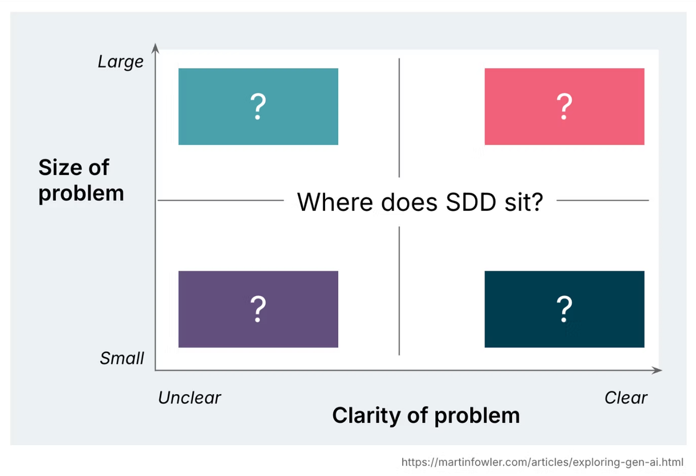

*SDD 平衡——何时使用 SDD，何时只用简单提示词？*

## 总结

规范驱动开发和 AI 驱动的 SDLC 仍在演进中，早期采用者应做好应对变化和偶尔阵痛的准备。标准、工具和工作流仍将持续调整。然而，在速度、质量和可扩展性方面的潜在收益是显著的。等待完全成熟意味着错失这些优势。那些早期投入、负责任地实验并建立强大治理体系的组织，将在生态系统稳定后处于最有利的位置。

## 参考资料

- [https://aws.amazon.com/blogs/devops/ai-driven-development-life-cycle/](https://aws.amazon.com/blogs/devops/ai-driven-development-life-cycle/)
- [https://www.youtube.com/watch?v=4qcWgPb-8Fk](https://www.youtube.com/watch?v=4qcWgPb-8Fk)
- [https://www.youtube.com/watch?v=1HNUH6j5t4A](https://www.youtube.com/watch?v=1HNUH6j5t4A)
- [https://circleci.com/blog/ai-sdlc/](https://circleci.com/blog/ai-sdlc/)
- [https://github.com/awslabs/aidlc-workflows](https://github.com/awslabs/aidlc-workflows)
- [https://martinfowler.com/articles/exploring-gen-ai/sdd-3-tools.html](https://martinfowler.com/articles/exploring-gen-ai/sdd-3-tools.html)
