> 作者：Fareed Khan
> 发布日期：2026 年 4 月 6 日
> 原文链接：https://levelup.gitconnected.com/building-claude-code-with-harness-engineering-d2e8c0da85f0

# 用 harness 工程构建 Claude Code
## 多智能体、MCP、技能系统、上下文管道等

截至 2026 年初，Claude Code 在发布后的六个月内实现了 10 亿美元的年化收入。这并非源于更好的提示词（Prompt），而是因为 Anthropic 围绕合适的模型构建了正确的 harness，包含流式 agent 循环、受权限治理的工具分发系统，以及一个能让模型在任意长度会话中保持专注的上下文管理层。这个 harness 是完全可复现的，而这正是我们要构建的内容。

Claude Code 架构由五个协同工作的核心组件组成：

1.  **单线程主循环**：驱动模型完成感知、推理和工具执行循环，将结果反馈回上下文，直到任务达到终态。
2.  **类型化工具分发注册表**：将工具名称映射到处理程序（bash、read、write、grep、glob 等），每个工具都有严格的输入模式（schema），约束了模型的表达能力和 harness 必须执行的操作。
3.  **上下文管理层**：结合按需技能注入、三层对话压缩和磁盘持久化内存，在会话超过模型上下文窗口（context window）时维持连贯推理。
4.  **基于规则的权限治理系统**：具有三个评估层级（始终拒绝、始终允许和用户授权审批），由生命周期钩子（lifecycle hook）支持，允许外部钩子观察并拦截每次工具调用。
5.  **多 agent 协调层**：支持子 agent（subagent）上下文隔离、异步队友委派、有限状态机（finite state machine, FSM）治理的跨 agent 协议，以及用于并行任务执行且无文件冲突的 git 工作树（worktree）隔离。

在这些组件内部，还有更多细节……

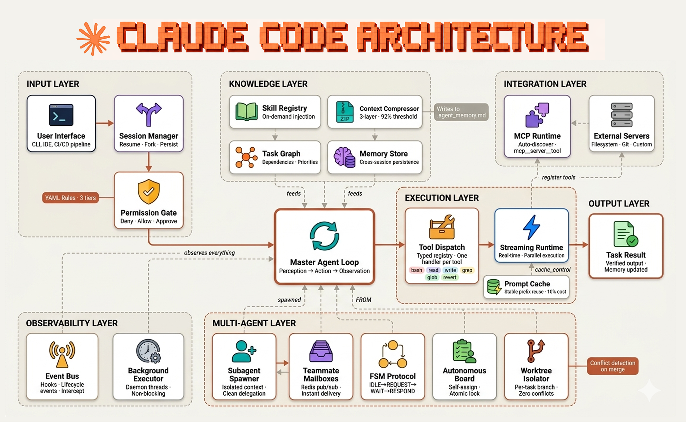

在这篇博客中，我们将逐一构建并测试 Claude Code 的每个组件，理解它们如何协同工作以超越其他 agent 框架。

所有代码均可在 GitHub 仓库中获取：
[GitHub - FareedKhan-dev/claude-code-from-scratch: Claude Code 架构的 23 个组件](https://github.com/FareedKhan-dev/claude-code-from-scratch)

我们的代码库结构如下：

```
claude-code-from-scratch/
│
├── core.py                          # 共享基础 — 客户端、工具、分发、权限
├── 01_perception_action_loop.py     # 极简 While 循环 — 核心 agent 模式
├── s02_tool_use.py                  # 工具分发映射 — 名称 → 处理程序注册表
├── s03_todo_write.py                # TodoWrite — 执行前先规划
├── s04_subagent.py                  # 子 agent 生成器 — 隔离的子上下文
...
├── s10_team_protocols.py            # FSM 协议 — IDLE→REQUEST→WAIT→RESPOND
├── s11_autonomous_agents.py         # Agent 从共享看板自分配任务
├── s12_worktree_task_isolation.py   # 每个并行任务使用独立的 Git 工作树
│
├── s13_streaming.py                 # 实时 token 流式传输
...
├── s21_mcp_runtime.py               # 官方 MCP SDK — 自动注册外部工具
│
├── s22_production_mailbox.py        # Redis 发布/订阅 — 替换 JSONL 信箱
├── s23_worktree_advanced.py         # 完整工作树生命周期 — 处理边缘情况
...
└── skills/                          # Agent 技能 — 由 s05 按需加载
```

我将 Claude Code 架构的每个组件分离开来，以便我们可以单独运行和测试。

## 目录
- 什么是 harness 工程？
- Claude Code 如何使用 harness 工程？
- 第一阶段：核心 Agent 循环
    - 极简 While 循环
    - 工具分发映射（Dispatch Map）模式
    - TodoWrite：执行前的规划
    - 子 agent 上下文隔离
- 第二阶段：知识与上下文管理
    - 按需技能加载
    - 三层上下文压缩
    - 基于文件的任务依赖图
- 第三阶段：异步执行与多 agent 团队
- 第四阶段：生产环境加固
- 第五阶段：高性能异步运行时
- 第六阶段：企业级升级
- 如何进一步改进

---

## 什么是 harness 工程？

harness 工程（harness engineering）是围绕 AI 模型构建环境的学科，而不是构建模型本身。模型负责推理和决策，而 harness 负责执行、约束和连接。一个设计良好的 harness 能为模型提供其所需的精确工具，并治理其被允许执行的操作。

如果将 harness 工程的概念分解为四个核心原则，它们将是：

1.  **决策唯一性**：模型是决策的唯一来源，harness 永远不会根据模型输出进行分支判断，它只执行模型请求的操作。
2.  **工具即接口**：工具是模型与世界之间的唯一接口。从读取文件到生成子 agent，每一项操作都通过类型化、经过模式验证的工具调用完成。
3.  **受管理的上下文**：上下文是一种受管理的资源。模型在每一步看到的内容是经过精心策划、压缩和刻意注入的，而不是盲目累积的。
4.  **声明式权限**：权限是声明式的，而非过程式的。哪些被允许、哪些被禁止、哪些需要审批，都在配置中定义，而不是散落在条件逻辑中。

---

## Claude Code 如何使用 harness 工程？

Claude Code 不是一个 agent 框架。它是一个 harness，是目前生产环境中部署过的设计最精良的 harness 之一。Anthropic 并没有编写逻辑来决定何时读取文件或运行测试，他们给了 Claude 相应的工具，并信任模型能决定何时需要使用它们。

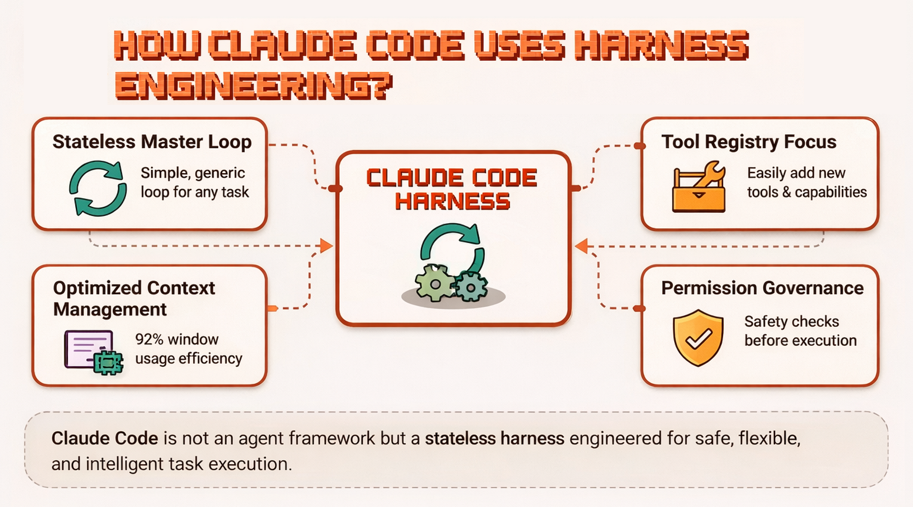

Claude Code 的架构在多个方面遵循了 harness 工程的原则：

1.  **主循环是无状态且通用的**：无论任务是一个单行修复还是数小时的重构，主循环运行方式完全相同，因为所有特定于任务的智能都存在于模型中。
2.  **工具注册表是唯一的扩展点**：为 Claude Code 添加新功能意味着注册一个新工具，包含名称、描述和输入模式。
3.  **上下文主动管理**：在窗口使用率达到约 92% 时，旧的对话轮次会被总结并持久化到磁盘，使模型的显存专注于当前任务。
4.  **权限治理作为预执行层运行**：每次工具调用在 harness 执行前都会经过规则评估，使安全性成为一种结构属性，而非模型行为。

---

## 第一阶段：核心 Agent 循环

Agent 循环是所有其他功能构建的基础架构原语。在工具、权限和多 agent 协调之前，存在一个调用模型、观察其意图、执行并反馈结果的循环。

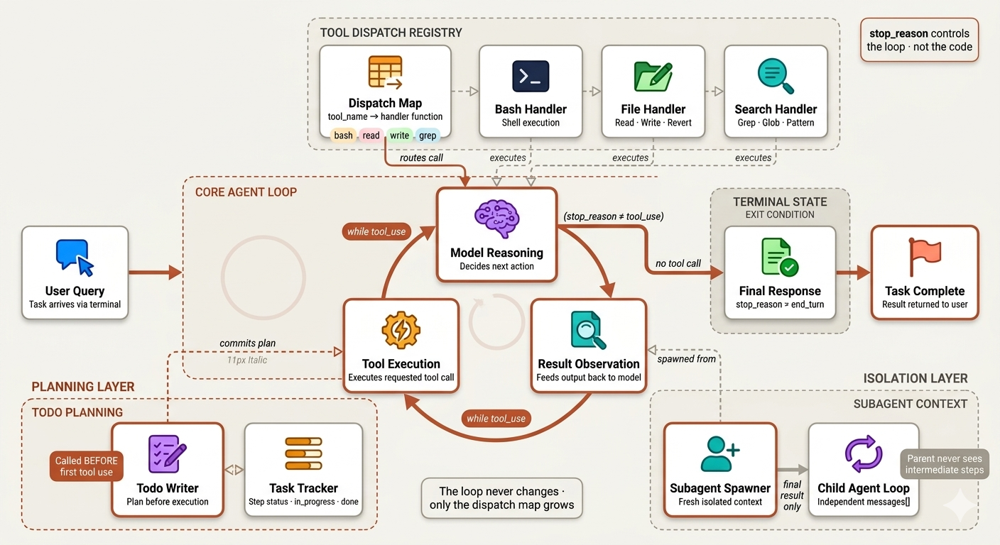

在这个阶段，每个会话都在不改变循环本身的情况下，为该循环添加一种机制。

### 极简 While Loop：

任何 agent 系统最基本的原则都是感知-行动-观察循环（perception-action-observation cycle）。

1.  Agent 接收任务，尝试使用工具解决。
2.  观察结果，并决定是继续还是停止。这一切都由模型驱动，而非代码。

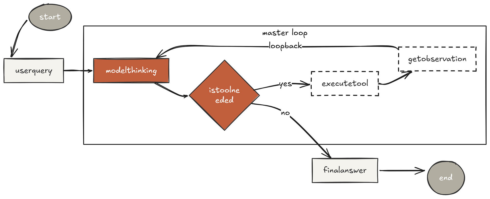

这不是一个重试循环或后备机制。它是核心推理引擎。在 Claude Code 中，这就是 nO 主循环，无论你是要求 Claude 修复单行 bug 还是重构整个代码库，它都运行同一个循环。代码永远不变，改变的只是模型在其中做出的决策。

为了使用 Anthropic 模型构建 Claude Code 的最基本现象，我们首先需要初始化客户端和模型。

```python
# 导入必要的库
from anthropic import Anthropic

# API Key（必填）
# 获取地址：https://console.anthropic.com/
ANTHROPIC_API_KEY="sk-ant-xxx"
# 模型 ID（必填）
MODEL_ID="claude-sonnet-4-6"

# 初始化 Anthropic 客户端
client  = Anthropic(base_url="https://api.anthropic.com", api_key=ANTHROPIC_API_KEY)
MODEL   = MODEL_ID

# 系统提示词是 agent 行为的基础，它为模型处理任务设定了基调
DEFAULT_SYSTEM = f"You are a coding agent at {os.getcwd()}. Use tools to solve tasks. Act, don't explain."
```

由于我们在构建 Claude，所以使用 Anthropic 模型，但你可以使用 LiteLLM 来切换任何你喜欢的模型，我的 GitHub 代码库非常灵活，支持任何模型提供商。

系统提示词是 agent 行为的基础。虽然它并不总是万能的，但对于设定模型处理任务的基调至关重要。

正如我之前提到的，Claude 是围绕工具构建的，因此我们需要为 agent 定义一些基础工具来与世界交互。

```python
BASIC_TOOLS = [
    {
        "name": "bash",
        "description": "Run a shell command.",
        "input_schema": {
            "type": "object",
            "properties": {"command": {"type": "string"}},
            "required": ["command"],
        },
    },
]
```

这里我们定义了一个名为 `bash` 的工具。

```python
BASIC_DISPATCH: dict = {
    "bash": lambda inp: run_bash(inp["command"]),
}
```

分发（Dispatch）是连接模型工具调用与实际代码执行的机制。它是一个将工具名称映射到处理函数的字典。这对于像 Claude Code 这样包含大量工具的大型架构非常重要，它允许我们将工具定义与实现分离。

```python
def dispatch_tools(response_content: list, dispatch: dict) -> List[Dict[str, Any]]:
    """
    执行模型响应中的所有 tool_use 块并收集结果。
    """
    results = []

    for block in response_content:
        if block.type != "tool_use":
            continue
        tool_name = block.name
        tool_input = block.input
        tool_use_id = block.id
        handler = dispatch.get(tool_name)
        
        # 记录工具调用以供用户查看
        first_val = str(list(tool_input.values())[0])[:80] if tool_input else ""
        print(f"\033[33m[{tool_name}] {first_val}...\033[0m")
        if handler:
            try:
                output = handler(tool_input)
            except Exception as e:
                output = f"Error during tool execution: {e}"
        else:
            output = f"Error: Unknown tool '{tool_name}'"
        
        print(str(output)[:300])  # 打印预览
        
        results.append({
            "type": "tool_result",
            "tool_use_id": tool_use_id,
            "content": str(output),
        })

    return results
```

`dispatch_tools` 是一个助手函数，负责识别、执行工具调用并收集结果。

```python
def agent_loop(messages: List[Dict[str, Any]], dispatch: Dict) -> None:
    """
    运行核心 agent 交互循环，直到模型给出最终答案。
    """
    while True:
        # 1. 调用 LLM
        print("\n\033[36m> Thinking...\033[0m")
        response = client.messages.create(
            model=MODEL,
            system=DEFAULT_SYSTEM,
            messages=messages,
            tools=BASIC_TOOLS,
            max_tokens=8000,
        )

        messages.append({"role": "assistant", "content": response.content})

        # 2. 检查是否终止
        if response.stop_reason != "tool_use":
            break

        # 3. 执行工具
        results = dispatch_tools(response.content, dispatch)
        messages.append({"role": "user", "content": results})
```

我们的 agent 循环是一个简单的 `while` 循环，直到模型指示已得出最终答案。

让我们运行这个组件来测试一下：

```python
history: List[Dict[str, Any]] = []

while True:
    try:
        query = input("\033[36ms01 >> \033[0m")
    except (EOFError, KeyboardInterrupt):
        print("\nExiting.")
        break

    if query.strip().lower() in ("q", "exit", ""):
        break

    history.append({"role": "user", "content": query})
    agent_loop(history, BASIC_DISPATCH)

    last_message = history[-1]
    print("\n\033[32mFinal Answer:\033[0m")
    for block in last_message.get("content", []):
        if block.type == "text":
            print(block.text)
```

运行示例：

```
s01 >> List all Python files in the current directory.
> Thinking...

[Tool Call: bash]
Command: ls *.py
[Result]
bash: ls: command not found

> Thinking...
[Tool Call: bash]
Command: find . -name "*.py" -type f

[Result]
./main.py
./utils.py
./agent.py

Final Answer:
- main.py
- utils.py
- agent.py
```

Agent 在第一次尝试时使用了错误的命令并报错，随后它自我修正，使用了合适的 `find` 命令并成功找回了列表，展示了感知-行动-观察循环在现实世界中的纠错能力。

### 工具分发映射（Dispatch Map）模式

在 Claude Code 的内部架构中，工具注册表是工程师们通过逆向工程研究最多的组件之一。

Claude Code 附带了 18 个注册工具，如 `bash`、`read`、`write`、`edit`、`glob`、`grep`、`WebFetch`、`AskUserQuestion`、`TodoWrite` 等。这个系统的优雅之处不在于工具的数量，而在于添加新工具无需对核心循环进行任何更改。

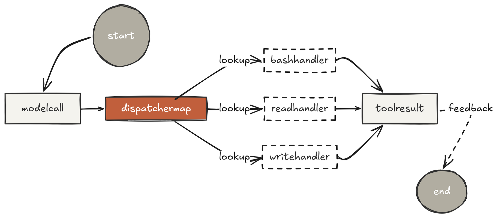

分发映射（dispatch map）模式使这成为可能。它是一个字典，连接了模型的意图与执行意图的代码。

```python
EXTENDED_DISPATCH: dict = {
    "bash":   lambda inp: run_bash(inp["command"]),
    "read":   lambda inp: run_read(inp["path"], inp.get("start_line"), inp.get("end_line")),
    "write":  lambda inp: run_write(inp["path"], inp["content"]),
    "grep":   lambda inp: run_grep(inp["pattern"], inp.get("path", ".")),
    "glob":   lambda inp: run_glob(inp["pattern"]),
    "revert": lambda inp: run_revert(inp["path"]),
}
```

工具描述同样重要。它们不是文档，而是指令。

```python
EXTENDED_TOOLS = BASIC_TOOLS + [
    {
        "name": "read",
        "description": "Read a file and return numbered lines. Use when you need to inspect file content or reference specific line numbers. Returns up to 50,000 characters. Use start_line/end_line for large files.",
        "input_schema": {
            "type": "object",
            "properties": {
                "path":       {"type": "string"},
                "start_line": {"type": "integer"},
                "end_line":   {"type": "integer"},
            },
            "required": ["path"],
        },
    },
    # ... 其他工具定义 ...
]
```

如果描述写得不好，模型会选错工具。Claude Code 的内部工具描述对每个工具的使用时机规定得极其详尽。

### TodoWrite：执行前的规划

通过逆向工程发现，Claude 在处理复杂任务前，总是会调用 `TodoWrite`。

计划领先于行动，且行动只有在计划提交后才会执行。

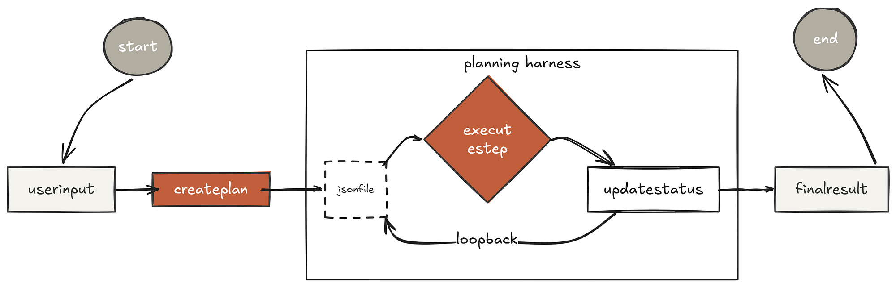

Anthropic 观察到，如果没有明确的规划机制，模型在多步任务中会产生漂移。`TodoWrite` 工具从架构层面解决了这个问题——不是通过让模型更聪明，而是给它一个承诺机制，让它在执行过程中对自己负责。

```python
TODO_FILE = Path(".agent_todo.json")

def todo_write(tasks: list) -> str:
    data = [{"id": i, "task": t, "status": "pending"} for i, t in enumerate(tasks)]
    TODO_FILE.write_text(json.dumps(data, indent=2))
    return "Plan written:\n" + "\n".join(f"  [{i}] {t}" for i, t in enumerate(tasks))
```

三个工具协同工作：`todo_write` 提交初始计划，`todo_update` 标记每一步的进度，`todo_read` 让模型随时检查进度。

系统提示词更新以使规划成为强制性：

```python
SYSTEM = (
    f"You are a coding agent at {os.getcwd()}. "
    "Before working on any multi-step task, ALWAYS call todo_write first "
    "to write your complete plan. Execute each step in order. "
    "Call todo_update after completing each step."
)
```

这里的“ALWAYS”至关重要，它能产生更可靠的行为。

### 子 agent 上下文隔离

当被要求理解一个新的代码库时，Claude 不会直接将文件读入主对话。它会生成三个并行的探索子 agent（subagent），每个都有不同的侧重点，且彼此完全隔离。主对话只接收三个干净的摘要。

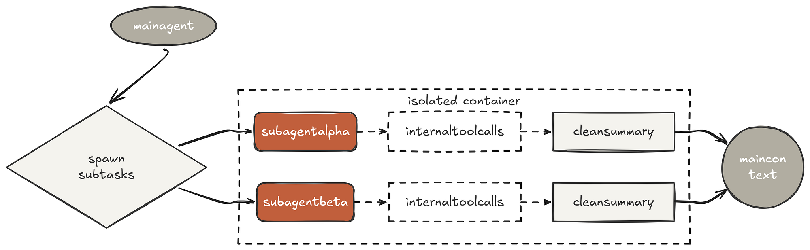

这就是子 agent 上下文隔离（subagent context isolation）模式。它允许 Claude Code 在处理庞大代码库时，不让主对话窗口充斥噪音。父 agent 只为它实际需要的上下文付费。

隔离通过为每个子 agent 提供完全独立的 `messages[]` 列表来实现。

```python
def spawn_subagent(prompt: str) -> str:
    """运行一个具有完全隔离上下文的新 agent 循环。"""
    print(f"\033[35m  [subagent spawned] {prompt[:60]}\033[0m")
    sub_messages = [{"role": "user", "content": prompt}]
    # ... 运行循环 ...
    return result
```

子 agent 运行与父 agent 相同的循环，拥有相同的工具，唯一的区别是它的 `messages[]` 列表起始为空，且系统提示词专注于特定任务。

---

## 第二阶段：知识与上下文管理

第三阶段（注：原文此处指 Phase 2）涉及认知基础设施，即 agent 仅在需要时加载领域知识。

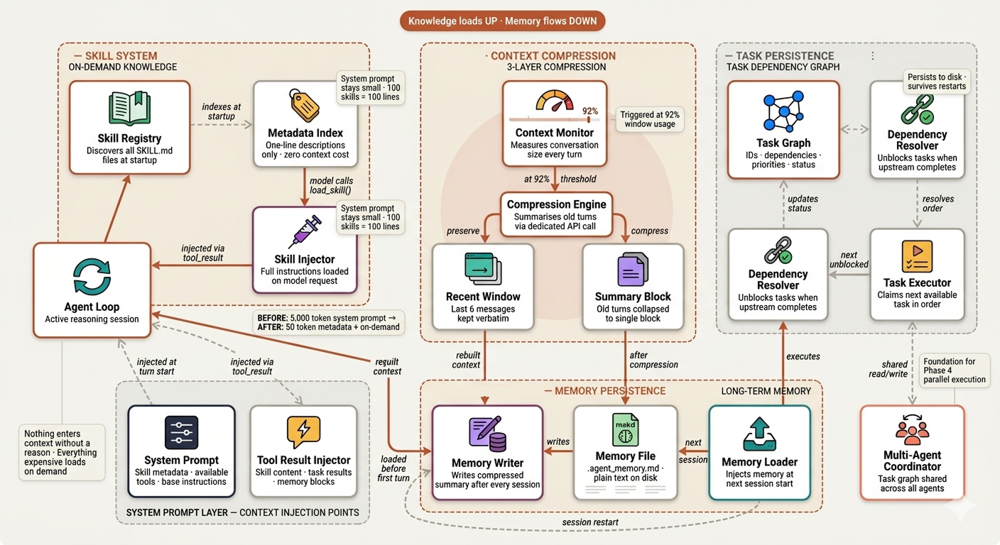

这包括在对话历史降低推理质量前对其进行压缩，并将任务状态持久化到磁盘。这就是 Claude Code 技能系统、压缩器 wU2 和长期记忆文件的由来。

### 按需技能加载

harness 工程中最昂贵的错误之一是将模型可能需要的所有内容都放入系统提示词中。

Claude Code 通过渐进式披露（progressive disclosure）解决了这个问题。

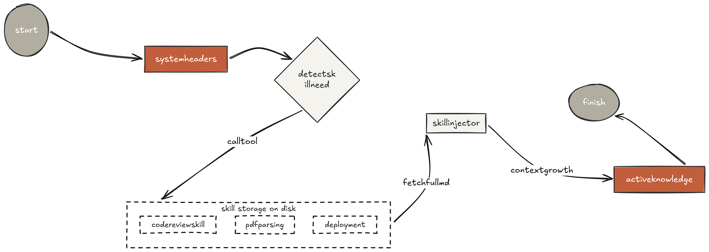

模型系统提示词仅包含可用技能的简短描述。当模型意识到需要特定领域的专业知识时，它会调用 `load_skill()`，完整的指令会直接注入到对话中。模型仅在知识真正相关时才支付上下文成本。

技能文件遵循统一格式：包含用于发现的元数据头，以及模型读取并执行的程序化指令。

```
skills/
├── agent-builder/
│   └── SKILL.md
...
```

发现机制在启动时扫描技能目录，构建一个轻量级注册表放入系统提示词中。

```python
def load_skill(name: str) -> str:
    skill_path = SKILLS_DIR / name / "SKILL.md"
    return f"=== SKILL: {name} ===\n{skill_path.read_text(encoding='utf-8')}"
```

### 三层上下文压缩

每个长期运行的会话都会遇到同一个瓶颈：上下文窗口充满了十分钟前有用但现在只是噪音的工具输出和中间结果。

Claude Code 的压缩器 wU2 在上下文窗口使用率达到约 92% 时自动触发。它不会丢弃历史，而是对其进行总结，在大幅减少 token 占用的同时保留信息。

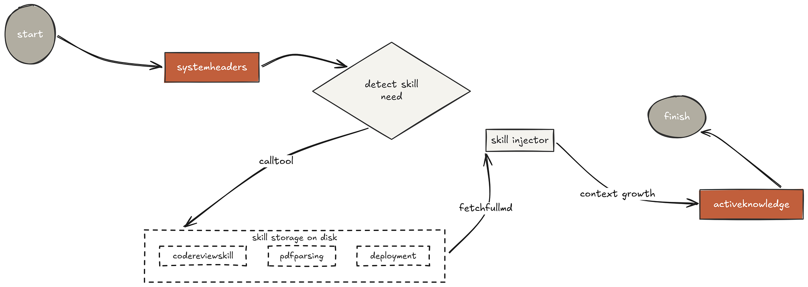

实现方案使用了三个层级：最近的消息按原样保留；较旧的消息通过专门的压缩 API 调用折叠为单个摘要块；该摘要被写入 `.agent_memory.md`，以便下次会话加载。

```python
def maybe_compress(messages: list) -> bool:
    if _estimate_size(messages) < COMPRESS_THRESHOLD:
        return False
    # ... 执行总结并替换旧消息 ...
    return True
```

在会话启动时，agent 会检查是否存在内存文件并加载它。

### 基于文件的任务依赖图

上下文压缩保持了对话窗口的可控性，但任务图（task graph）解决的是跨会话、跨重启的任务跟踪问题。

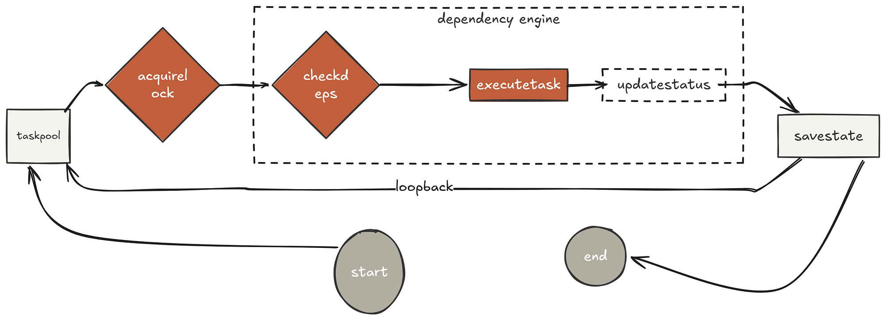

Claude Code 的 `TodoWrite` 系统是会话作用域的。关闭终端，计划就消失了。而本节中的任务图将其扩展为一个持久的、感知依赖关系的结构。每个任务都有 ID、描述、状态、优先级和前置任务 ID 列表。

该图保存在 `.agent_tasks.json` 中，在进程崩溃、会话重启或机器重启后依然存在。

```python
def run_task_create(description: str, depends_on: list = None,
                    priority: str = "medium") -> str:
    # ... 创建并持久化任务 ...
    return f"created task {task['id']}: {description}"

```python
def run_task_next() -> str:
    """返回下一个未被阻塞且待处理的任务 - 遵循依赖链。"""
    tasks = _load()
    done_ids = {t["id"] for t in tasks if t["status"] == "done"}
    for t in sorted(tasks, key=lambda x: {"high":0,"medium":1,"low":2}[x["priority"]]):
        if t["status"] != "pending":
            continue
        if all(dep in done_ids for dep in t.get("depends_on", [])):
            return f"[{t['id']}] [{t['priority']}] {t['description']}"
    return "(no unblocked tasks available)"

def run_task_update(task_id: str, status: str, result: str = "") -> str:
    with _TASKS_LOCK:
        tasks = _load()
        for t in tasks:
            if t["id"].startswith(task_id):
                t["status"] = status
                if result:
                    t["result"] = result
                _save(tasks)
                return f"task {t['id']} → {status}"
    return f"Error: task '{task_id}' not found"
```

在每次读写操作上加线程锁（threading lock）至关重要。在第四阶段，多个 agent 将并发调用 `_load()` 和 `_save()`。如果没有锁，两个 agent 可能会同时读取相同状态，各自独立修改，导致后写入的改动覆盖掉前者的修改。锁确保了每次任务状态转换的原子性。

运行示例：

```
s07 >> We need to migrate the codebase to use async tool implementations throughout.
       Break this down into tasks, identify dependencies, and start working through them.

> Thinking...
[task_create] Audit all sync tool functions in core.py (priority: high)
[task_create] Write async versions of run_bash, run_read, run_write (depends: audit, priority: high)
...
[task_next] [a3f2c891] [high] Audit all sync tool functions in core.py
[read] agents/core.py (lines 1-100)
[task_update] a3f2c891 → done

> Thinking...
[task_next] [b7d1e445] [high] Write async versions of run_bash, run_read, run_write
...
```

Agent 自动识别了依赖链并按正确顺序执行，从未在依赖项完成前尝试后续任务。由于图表持久化在磁盘上，即便进程中途崩溃，重启后也能从断点继续，而无需重复工作。

---

## 第三阶段：异步执行与多 agent 团队

第四阶段（注：原文此处指 Phase 3）旨在突破单 agent 的瓶颈。这包括在不阻塞主循环的情况下运行后台线程、将任务委派给持久化的专家级 agent、通过有限状态机治理 agent 间的通信、实现无需中央协调器的自主任务申领，以及在 Git 工作树级别隔离并行文件的写入。

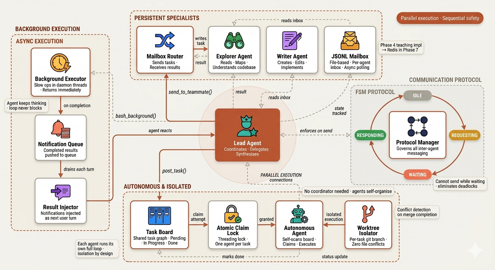

这里我们将从基本原理重新构建 Claude Code 的并行子 agent 孵化、后台执行队列和任务委派架构。

### Background Task Execution with Notifications

在 Claude Code 的内部架构中，`h2A` 异步队列是其最实用的性能机制之一。当 Claude 运行测试套件、编译项目或执行耗时的数据库迁移时，它不会坐等结果。它会将操作推送到后台，继续规划后续步骤，并在操作完成后接收通知。主推理循环永远不会被 I/O 阻塞。

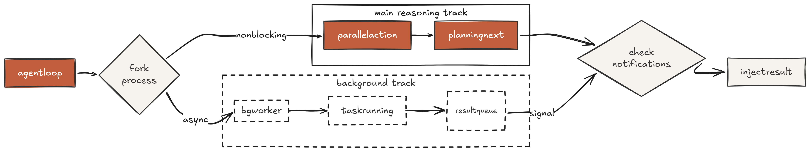

如果没有这种机制，编码 agent 的速度将受限于其最慢的工具调用。一个运行 45 秒的测试套件意味着 45 秒的停滞。后台执行通过解耦操作执行与 agent 推理循环，彻底消除了这一上限。

实现方案为每个后台操作使用一个守护线程，并共享一个通知队列。

```python
_BG_QUEUE: queue.Queue = queue.Queue()

def run_bash_background(command: str, label: str = "") -> str:
    """在后台守护线程中启动 shell 命令。立即返回。"""
    def _run():
        print(f"\033[90m  [bg] started: {label}\033[0m")
        # 执行命令...
        _BG_QUEUE.put(f"[Background task '{label}' {status}]\n{output}")
        print(f"\033[90m  [bg] {label} {status}\033[0m")

    thread = threading.Thread(target=_run, daemon=True)
    thread.start()
    return f"Background task started: '{label}'. You will be notified when it completes."
```

在 `agent_loop_with_bg()` 函数中，我们在每一轮循环后检查 `_BG_QUEUE`。

运行示例：

```
s08 >> Run the full test suite in the background, then while that runs
       add docstrings to all functions in core.py that are missing them.

> Thinking...
[bash_background] python -m pytest tests/ -v --tb=short
Background task started: 'full test suite'.

> Thinking...
[read] agents/core.py
... (agent 执行添加文档字符串的操作)
[bg] full test suite completed
[Background task 'full test suite' completed] 44 passed in 2.1s

Final Answer:
Added docstrings while the test suite ran in the background.
```

在阻塞模型中，这需要顺序执行时间。而有了后台执行，总耗时受限于较慢的操作，而非两者的总和。这正是 Claude Code 在实践中处理长时任务的方式。

### Persistent Teammates with JSONL Mailboxes

Claude Code 的并行子 agent 系统会孵化临时（ephemeral）agent，它们随任务创建而销毁。但真实的工程工作需要跨多个任务持久存在的专业化分工。

持久队友（Persistent Teammates）能在多个委派任务中保留上下文。

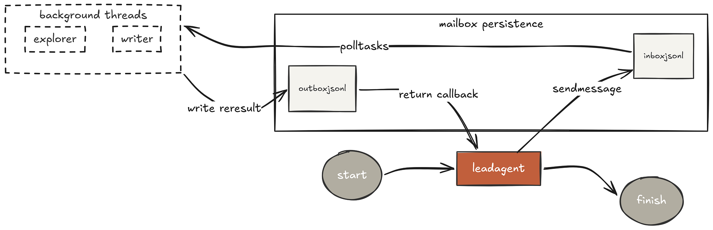

每个队友在后台线程中持续运行，拥有特定的专业方向，并以 JSONL 文件作为信箱。

```python
TEAMMATES = {
    "explorer": "你是一个专门负责阅读和理解代码库的探索 agent...",
    "writer": "你是一个专门负责创建和编辑代码的编写 agent...",
}

def _run_teammate(name: str, system: str, stop_event: threading.Event):
    while not stop_event.is_set():
        for msg in _receive(name):
            # 运行 agent 循环并发送回结果
            _send(msg["from"], name, result)
```

运行示例：

```
s09 >> We need to understand the multi-agent architecture and then
       add proper logging to all inter-agent communication functions.

> Thinking...
[send_to_teammate] explorer
[explorer] [glob] agents/**/*.py
[explorer] [grep] def _send|def _receive
[explorer] result sent to lead

> Thinking...
[send_to_teammate] writer (Add structured logging to these 5 functions...)
[writer] [write] agents/s09_agent_teams.py
[writer] result sent to lead

Final Answer:
Explorer mapped 5 functions. Writer added logging to all 5.
```

主 agent 将探索任务委派给一个专家，将实现任务委派给另一个，且任何一项任务都没有污染主 agent 的上下文。这种协作发生在架构层面，而非提示词层面。

### FSM Team Communication Protocol

当多个 agent 同时发送和接收消息时，不加协调的通信会产生竞态条件和死锁。

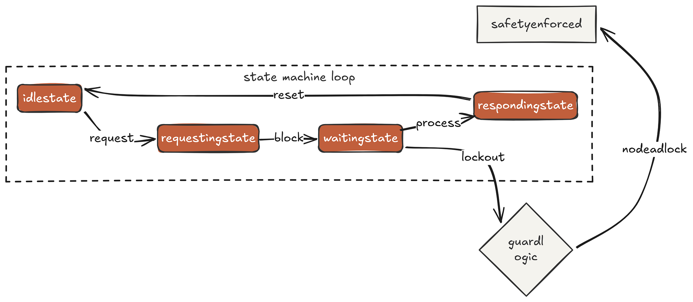

Claude Code 通过工具调用的同步性质隐含地解决了跨 agent 协调问题。对于异步通信的持久队友架构，有限状态机（FSM）使协议变得显式且强制。每个 agent 都有四种状态：`IDLE`（空闲）、`REQUESTING`（请求中）、`WAITING`（等待中）、`RESPONDING`（响应中），并遵循一条严格规则：agent 在 `WAITING` 状态下不能转换为 `REQUESTING`。

```python
class AgentState(Enum):
    IDLE       = "idle"
    REQUESTING = "requesting"
    WAITING    = "waiting"
    RESPONDING = "responding"
```

这从架构层面消除了所有协调死锁问题，模型只需调用 `delegate`，FSM 会处理其余工作。

### Autonomous Task Self-Assignment

FSM 协议治理了 agent 间的通信，但仍需要一个主 agent 来分配工作。对于极大的工作量，主 agent 也会成为瓶颈。自主自分配（Autonomous self-assignment）完全去除了协调器。

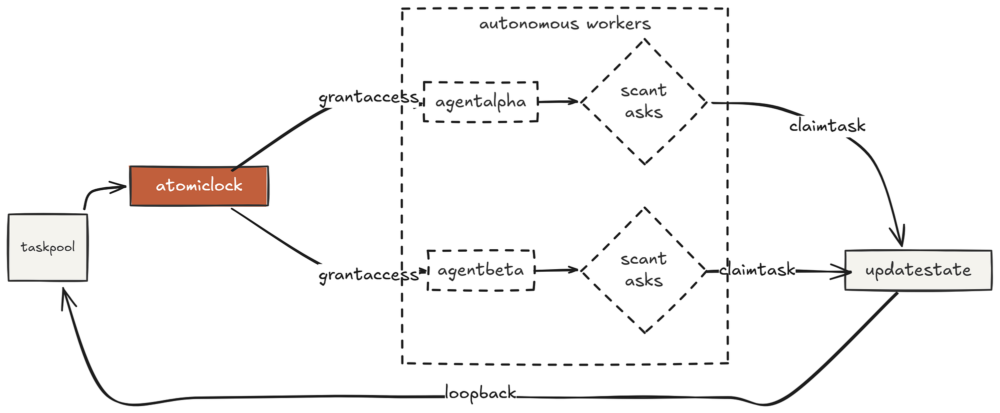

每个 agent 针对 Phase 3 中的共享任务图运行一个持续扫描循环。当发现未被阻塞的待处理任务时，它会使用线程锁原子性地申领该任务。

```python
def claim_next_task(agent_id: str) -> dict | None:
    with _TASKS_LOCK:
        # 扫描并申领任务...
        t["status"]     = "in_progress"
        t["claimed_by"] = agent_id
        return t
```

运行示例：

```
s11 >> Post tasks to add type annotations to every function in core.py.
       Each tool function gets its own task. Let the autonomous agents handle it.

> Thinking...
[post_task] Add type annotations to run_bash
...
[agent-1] claimed [a1b2c3d4] (run_bash)
[agent-2] claimed [e5f6a7b8] (run_read)
... (并行执行)
[agent-1] claimed [mypy_task] (所有依赖已完成后)
```

任务排序的智能存在于依赖图中，而非协调 agent 中。

### Git Worktree Task Isolation

多个并行 agent 在同一个目录中向同一个文件写入内容最终会产生冲突。文件系统并不了解 agent 的意图。

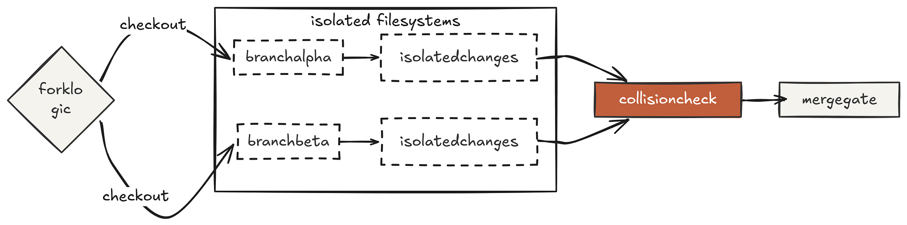

Git 工作树（worktree）赋予每个 agent 完整的仓库副本：独立的目录、独立的分支、独立的工程树。

```python
def create_worktree(task_id: str) -> tuple[str, str]:
    """为任务创建隔离的 git 工作树。"""
    branch = f"task/{task_id}"
    path   = f".worktree-{task_id[:8]}"
    _git("worktree", "add", "-b", branch, path)
    return path, branch
```

没有任何发生写入冲突的可能性，因为文件本身是物理隔离的。任务完成后，harness 会对比改动并识别重合部分，由人工审核后再合并。


---

## 第四阶段：生产环境加固

第五阶段（注：原文此处指 Phase 4）弥合了“可运行 agent”与“可部署 agent”之间的鸿沟。流式传输让模型输出实时可见，文件工具通过自动快照变得可逆，权限治理通过 YAML 规则系统变得声明式，每次工具调用通过生命周期事件总线变得可观测，且会话通过持久化变得持久耐用。

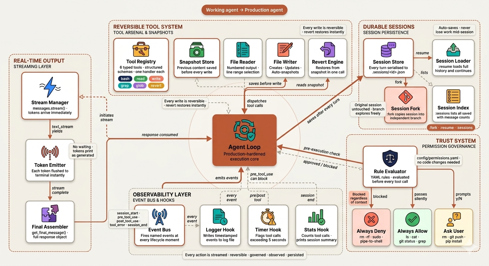

这里我们将实现 Claude Code 的信任系统、钩子架构和会话持久化。

### Real-Time Token Streaming

在 Claude Code 中，流式传输（Streaming）不是一个可选项，而是默认设置。每次交互都会在生成 token 时实时推送到终端。流式 agent 与阻塞式 agent 的区别，就像协作伙伴与批处理作业的区别。

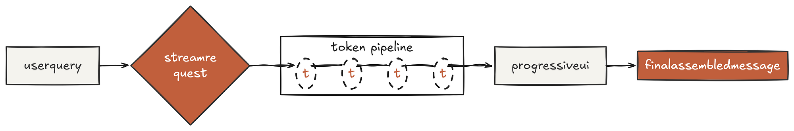

从阻塞切换到流式只需要更改一行代码：将 `client.messages.create()` 替换为 `client.messages.stream()`。

```python
def agent_loop_streaming(messages: list):
    while True:
        with client.messages.stream(
            model=MODEL,
            system=DEFAULT_SYSTEM,
            messages=messages,
            tools=EXTENDED_TOOLS,
            max_tokens=8000,
        ) as stream:
            for text in stream.text_stream:
                print(text, end="", flush=True)
            response = stream.get_final_message()
        # ... 后续逻辑 ...
```

运行示例：

```
s13 >> Refactor the agent_loop function in s01 to use streaming
       and explain what changed and why.

> Thinking...
I will start by reading the current implementation...
[read] agents/s01_agent_loop.py
...
```

你会发现响应是逐词（token）显示的。在阻塞模型中，所有文本会在数秒等待后同时弹出。这是 Claude Code 用户在每一次交互中都能体验到的行为。

### Extended Tool Arsenal and File Snapshots

Claude Code 附带了专门的文件工具（Read、Write、Edit、Glob、Grep），并非因为 `bash` 无法处理文件，而是因为专用工具能为模型提供精确的语义操作和结构化输出。

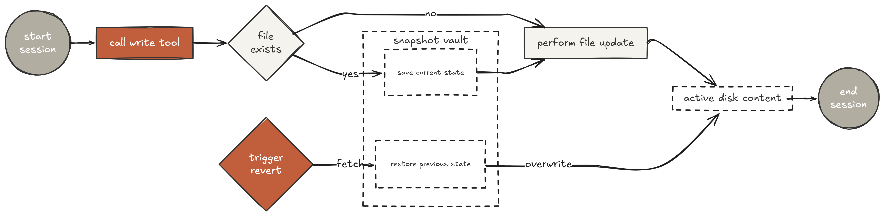

当模型调用 `read` 时，它会收到带有行号的文本，从而可以在随后的 `write` 中通过行号进行引用。结构化的输出（如 `grep` 返回的文件路径和行号）允许 Claude 进行精确的针对性编辑，而不是重写整个文件。

快照（snapshot）机制同样关键。每次 `write` 调用都会在覆盖前静默保存原始内容。

```python
SNAPSHOTS: dict[str, str | None] = {}

def run_write(path: str, content: str) -> str:
    if os.path.exists(path):
        with open(path, "r", encoding="utf-8") as f:
            SNAPSHOTS[path] = f.read()
    else:
        SNAPSHOTS[path] = None # 标记为新创建
    # ... 执行写入 ...
    return f"updated/created: {path} (snapshot saved)"

def run_revert(path: str) -> str:
    # ... 恢复快照 ...
```

### YAML Rule-Based Permission Governance

Claude Code 的权限系统非常严密。你可以选择“自动批准”或“确认”模式，这直接映射到权限层级系统。

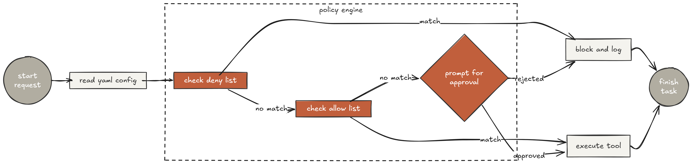

我们将这一模型实现为 YAML 配置文件。安全策略存在于配置中，而非代码中。

```yaml
# config/permissions.yaml
always_deny:
  - pattern: "rm -rf /"
    reason: "无条件递归删除根目录"
always_allow:
  - pattern: "^ls( |$|-)"
    reason: "列出文件始终安全"
ask_user:
  - pattern: "^rm "
    reason: "删除文件需要确认"
```

权限检查会在每次分发执行前进行包装。

运行示例：

```
s15 >> Install the requests library, then delete the old requirements.txt
[bash] pip install requests
  [PERMISSION] bash: pip install requests
  Reason: Package installation requires confirmation
  Allow? [y/N] y
...
[bash] rm requirements.txt
  [PERMISSION] bash: rm requirements.txt
  Allow? [y/N] y
```

模型在执行安全操作时不会被打断，仅在涉及真实后果时才会暂停请求许可。

### Event Bus and Lifecycle Hooks

Claude Code 暴露了一个钩子（hooks）系统，允许用户在 agent 生命周期（工具运行前、运行后、报错时等）附加自定义逻辑。

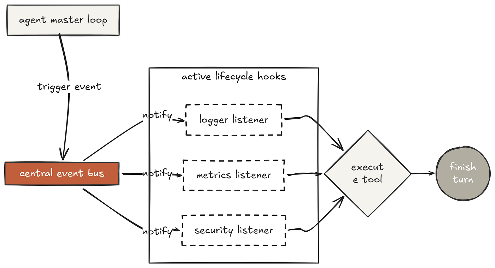

事件总线（Event Bus）使可观测性成为 harness 的一种结构属性。

```python
class EventBus:
    def emit(self, event: str, **payload):
        # 触发注册的处理程序...
```

例如，我们可以添加记录器、统计工具调用次数的统计钩子，以及测量工具耗时的计时钩子。

运行示例：

```
s16 >> Find all functions in core.py that dont have return type annotations
[pre_tool_use] tool=read → logger ✓ timer started
[read] agents/core.py
...
[stats] 6 tool calls: {'read': 1, 'grep': 1, 'write': 1, 'bash': 2}
```

这一切都无需在 agent 循环内部编写一行观测代码。

### Session Persistence, Resume, and Fork

无法恢复的会话是无法在长任务中获得信任的。Claude Code 会在本地存储每一条消息、工具调用和结果。

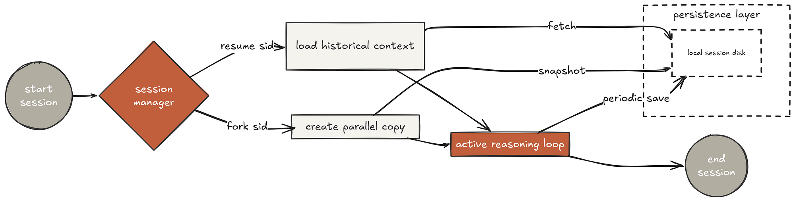

我们通过三个 REPL 命令实现这一机制：`:resume` 继续现有会话，`:fork` 在不影响原会话的情况下开启分支，`:sessions` 列出所有已保存的会话。

运行示例：

```
s17 >> :sessions
  a3f2c891  2026-04-01 11:23:45  Add error handling to run_write  (14 msgs)
s17 >> :resume a3f2c891
s17 >> :fork a3f2c891
```

这确保了即使终端关闭，你也能找回推理上下文。

---

## 第五阶段：高性能异步运行时

第六阶段（注：原文此处指 Phase 5）关注性能与控制，通过 `asyncio.gather` 并行化工具调用、支持实时中断注入、利用提示词缓存（Prompt Caching）减少开销，并集成官方 MCP 运行时。

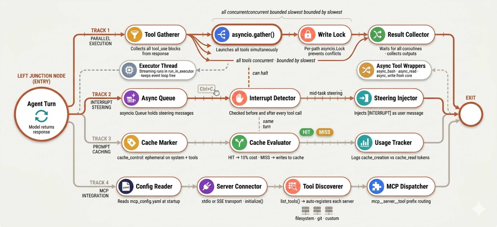

### Parallel Tool Execution with asyncio.gather

Claude Code 绝不会按顺序运行工具调用（除非必要）。如果模型在一个轮次中请求了三个 `grep` 和两个 `read`，这五个调用将同时执行。

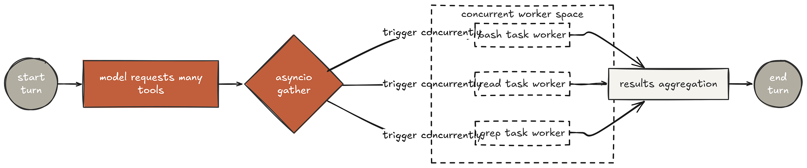

这需要将同步分发循环重构为异步循环，并使用 `asyncio.gather()`。

```python
async def agent_loop(messages: list):
    # ... 获取模型响应 ...
    # 同时执行所有工具调用，而不是逐个执行
    pairs = await asyncio.gather(*[_dispatch_one(b) for b in tool_blocks])
    # ...
```

运行示例：

```
s18 >> Analyse the entire agents/ directory...
Running 3 tools in parallel...
All 3 greps completed in 0.4s (vs ~1.2s sequential)
```

这对于需要探索数十个文件的任务来说，速度提升非常显著。

### Real-Time Interrupt Injection

Claude Code 允许你在任务中途按下 `Ctrl+C` 来重定向 agent 而不丢失任何已完成的工作。这就是 `h2A` 导向队列：一个与 agent 循环并行的异步通道。

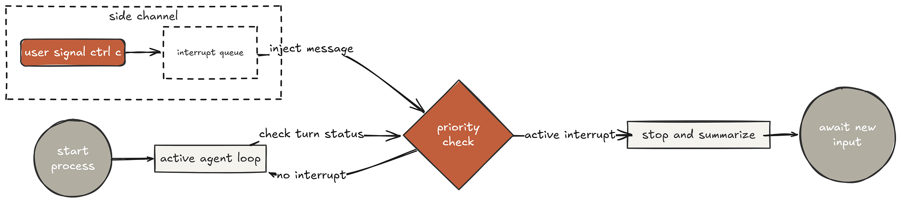

如果没有这种机制，长任务一旦开始就成了“赌博”。有了中断注入，你可以中途纠偏、补充上下文或让它停下来总结。

运行示例：

```
s19 >> Refactor every session file...
...
^C   ← 用户按下 Ctrl+C
[INTERRUPT] User pressed Ctrl+C. Stop current task.
I have completed type annotations for s01, s02... What would you like me to do next?
```

### Prompt Caching and KV Cache Optimisation

Claude Code 的执行痕迹显示，其内部 agent 调用的提示词前缀复用率高达 92%。通过将稳定的内容（如系统提示词和工具定义）放在开头，并使用缓存控制标记（cache_control），可以显著降低成本。

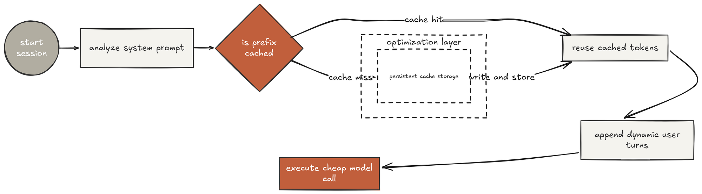

```python
SYSTEM_BLOCKS = [
    {
        "type": "text",
        "text": "...",
        "cache_control": {"type": "ephemeral"}, # 缓存此块
    }
]
```

运行示例：

```
[cache] MISS → 1,847 tokens written (第一次调用建立缓存)
[cache] HIT  → 1,847 tokens read (后续调用，节省约 90% 成本)
```

### Official MCP Runtime Integration

Claude Code 原生支持 MCP。任何符合规范的服务器工具都会成为 agent 注册表中的“一等公民”。

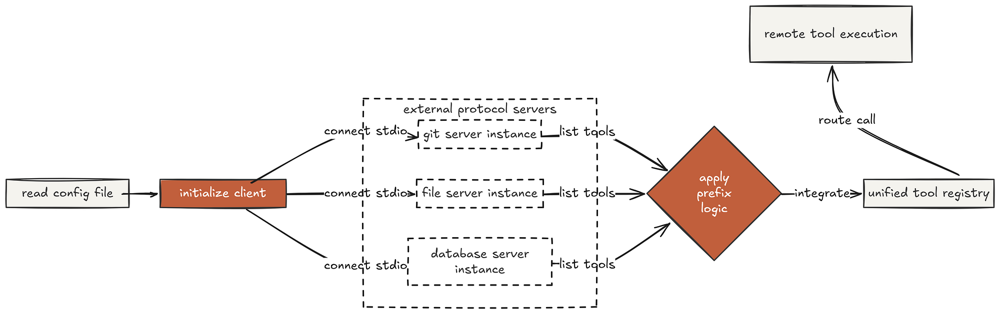

模型调用 MCP 工具的方式与调用内置工具完全相同。

```python
async def connect_mcp_servers():
    # 发现并注册 MCP 工具，前缀为 mcp__<server>__<tool>
```

运行示例：

```
s21 >> Using the connected git MCP server, show me the git log...
[mcp__git__git_log] {"repo_path": ".", "max_count": 5}
```

---

## 第六阶段：企业级升级

第七阶段（注：原文此处指 Phase 6）将教学级实现替换为生产级方案，包括 Redis 发布/订阅频道、完整的工作树生命周期管理，并将所有机制整合到一个可部署的参考方案中。

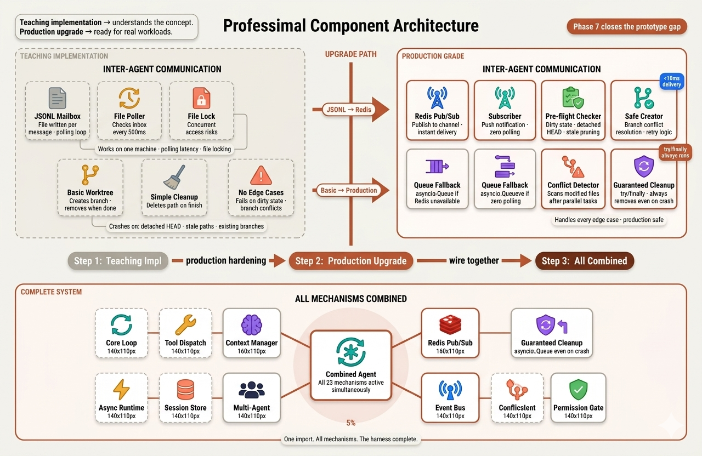

### Redis Pub/Sub Production Mailboxes

Phase 4 中的 JSONL 信箱系统存在轮询延迟、并发锁定和单机限制等问题。生产级架构使用 Redis 发布/订阅（Pub/Sub）频道，实现即时、无锁且跨进程的消息传递。

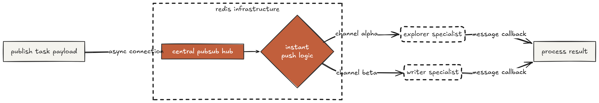

```python
class RedisMailbox(MailboxBackend):
    async def send(self, to: str, message: dict):
        await self.redis.publish(self._channel(to), payload)
```

运行示例：

```
[mailbox] Redis connected at redis://localhost:6379
Explorer 识别了 3 个缺失分支，Writer 补全了测试。
Redis 交付延迟：<10ms (对比 Phase 4 的 ~500ms 轮询)。
```

### Advanced Worktree Lifecycle Management

生产环境下的 Git 工作树管理需要处理各种边缘情况：脏工作区、冲突的分支名、分离的 HEAD 状态等。

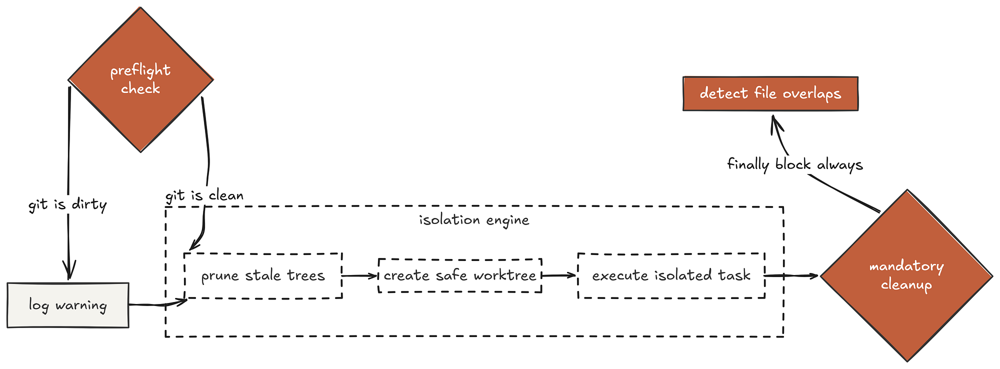

生产级的管理程序在任务开始前会进行系统化的“起飞前检查”（pre-flight check）。

```python
def check_git_state() -> dict:
    # 检查分支状态、是否脏写、工作树数量等...
```

运行示例：

```
Pre-flight check: Branch: main | Dirty: no
[worktree] created: .worktree-task-a1b2
...
Conflict detection: Tasks a1b2 and e5f6 both modified agents/core.py.
```

### 所有机制整合（All Mechanisms Combined）

现在，我们将 Phases 2 到 4 的所有机制整合在一起：待办事项规划、任务图依赖跟踪、子 agent 上下文隔离、按需技能加载、三层上下文压缩、后台任务执行、持久 agent 团队、FSM 通信协议和 Git 工作树隔离。

运行示例：

```
full >> We need to add a new skill called "debugging"...
[load_skill] agent-builder
[todo_write] ...
[spawn_subagent] (分析任务列表 JSON)
[compress] context large - summarising...
[bash_background] python -m pytest ...
```

---

## 如何进一步改进

到目前为止，我们已经从极简 agent 循环构建出了一个完整的 Claude Code harness。但仍有改进空间：

- **并行子 agent 孵化**：目前是顺序执行，重构为 `asyncio.gather` 可以进一步提速。
- **向量内存存储**：将长对话历史存入向量数据库（如 ChromaDB），实现语义检索。
- **精细化 token 计费**：增加成本账单功能，记录每个操作的开销。
- **基于 Webhook 的事件总线**：将钩子事件转发到 Slack 或 Datadog。
- **评估框架**：添加“LLM 评审（LLM-as-a-judge）”层，对 agent 输出的准确性和效率进行评分。

作者：Fareed Khan

