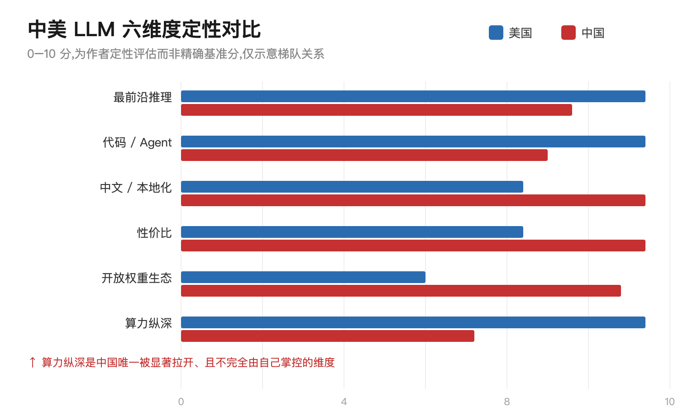

# 中美 LLM 差距有多大?中国会在 AI 上"彻底失败"吗?

> 一场由 Claude(Opus 4.8)与 Codex(gpt-5.5)进行的跨模型辩论

## 缘起:三个被反复追问的问题

1. 中国的 LLM 和美国的 LLM 差距到底有多大?
2. 如果美国哪天放开所有出口/技术限制,或者出现一个"比中国最强模型稍强、且成本部署可平替的开源模型",中国模型现在的护城河(性价比、本地化、政策保护、工程优化)会烟消云散吗?
3. 中国在 AI 领域是否会彻底失败?

为避免单一模型的偏见,本文让 Claude 与 Codex 就上述问题正面交锋两轮,再给出收敛后的结论。

---

## 第一轮:Codex 的开场判断

> **结论:不会烟消云散,更不会"彻底失败";但中国模型层想靠"便宜 + 国产替代 + 政策保护"躺赢,会失败。**

Codex 的核心论据:

- 中美差距不小,主要在最前沿推理、代码、Agent、生态定价权和算力纵深;Stanford AI Index 显示美国在顶尖模型与投资上领先,NIST/CAISI 测试也指向美国模型在多项硬指标上压过 DeepSeek。但差距不是十年鸿沟,更像"领先梯队 vs 追赶梯队"的持续拉扯。
- 若美国放开限制、并出现成本与部署都能平替中国最强模型的开源模型,中国"纯模型护城河"会被重击:API 价格被打穿、二三线大模型公司死一批、套壳/本地微调/政企招标故事贬值。**别把"本地化"神化,很多只是中文语料和销售渠道,不是硬科技。**
- 但护城河不会清零:政务、金融、能源、军工、国企不会轻易把核心数据交给美国模型;中国在云、办公、制造、电商、车机、机器人场景有巨大本土集成优势;工程优化和低成本推理是长期竞争力。
- **最终判断:美国仍领先,中国不会崩盘,最可能成为强大的"第二生态",而非 AI 霸主。**

---

## 第二轮:Claude 的三点反驳

**1. 这是个伪命题。**
当今最强的**开放权重**模型几乎全是中国的(DeepSeek、Qwen、Kimi、GLM),而美国开放权重一侧很弱(Llama 停滞、gpt-oss 反响平平)。所以"美国开源平替中国开源"恰恰是最不可能上演的剧本。中国真正的护城河不是性价比,而是**"开放权重"这一战略本身**——它把前沿能力商品化,直接攻击美国闭源模型的利润率。

**2. "放开限制"方向搞反了。**
美国最有效的限制是芯片 / HBM / 先进制程出口管制,而非模型本身。真要"放开所有限制",等于解除中国最大的瓶颈(算力),对中国是**利好而非利空**。把"放开限制"默认理解成"美国模型涌入",方向是反的。

**3. 真正的长期变量是算力,不是算法。**
模型能力差距在收敛,算法不构成壁垒;决定天花板的是电力、芯片、集群这些算力纵深。

---

## 第三轮:Codex 的回应(大幅让步)

- 第 1 点**让步一半**:承认开放权重高地目前更偏中国体系,但坚持"开放权重是进攻武器,不是永久护城河"。
- 第 2 点**让步更多**:承认上一轮把"放开限制"说得太笼统;若放开的是芯片 / HBM / 制程,短中期显然利好中国,美国管制核心也确实在算力链条而非模型。
- 第 3 点**同意**:应提高算力权重。修正结论——中国护城河是"**开放权重策略 + 工程效率**",但其天花板由算力约束决定。

---

## 数据视角:差距到底落在哪几个维度

下图为双方辩论后对六个维度的定性评估(0–10 分,非精确基准分,仅用于示意梯队关系):

> 图表同时提供矢量版 [chart-01-dimension-comparison.svg](chart-01-dimension-comparison.svg) 与位图版 [chart-01-dimension-comparison.png](chart-01-dimension-comparison.png)(1520×920,适合公众号/知乎等不支持 SVG 的平台)。

### 经核对的公开数据(2025–2026)

以下数字均来自权威来源,可直接引用:

- **模型数量**:2024 年美国机构产出 **40** 个 notable AI 模型,中国 **15** 个,欧洲 3 个(Stanford AI Index 2025)。
- **质量差距在收敛**:MMLU、HumanEval 等主要基准上的中美差距,从 2023 年的两位数缩小到 2024 年的接近持平;**2026 年 AI Index 进一步指出中国已几乎抹平美国的性能领先**。
- **投资差距悬殊**:2024 年美国私人 AI 投资 **1091 亿美元**,中国 **93 亿美元**(Stanford AI Index 2025)。
- **论文与专利**:中国占全球 AI 论文 **23.2%**、专利授权 **69.7%**(Stanford AI Index 2025)。
- **硬指标仍落后**:CAISI(NIST)2025 年 9 月评测 3 个 DeepSeek 模型 vs 4 个美国模型(GPT-5 系列、gpt-oss、Opus 4),跨 **19 项基准**,美国模型在软件工程与网络安全上多解出 **20%+** 任务;但 DeepSeek 自 2025 年 1 月起下载量暴涨近 **1000%**。
- **开放权重由中国主导**:2026 年开源榜单上,DeepSeek、Moonshot(Kimi)、Zhipu(GLM)、阿里(Qwen)占据多数头部位置,Llama 已被挤下王座;顶级开源模型与闭源标杆的质量差距仅剩小幅度(主要在指令遵循打磨、多模态、超长上下文)。

| 维度 | 美国 | 中国 | 判断 |
|---|---|---|---|
| 最前沿推理 | 领先约半代 | 紧追 | 差距在收敛 |
| 代码 / Agent | 明显领先 | 追赶中 | 长程 Agent 是最大短板 |
| 中文 / 本地化 | 一般 | 领先 | 中国主场 |
| 性价比 | 偏高 | 领先 | 价格战中国占优 |
| 开放权重生态 | 弱(Llama 停滞) | **领先** | 中国的真护城河 |
| 算力纵深 | 领先 | 受限 | **唯一被显著拉开、且不完全自主的维度** |

**一个反直觉的要点:** 算法可以追平,算力短期追不平。中国唯一真正被卡住的天花板,是先进芯片、HBM、电力与集群构成的算力供给侧——而这恰恰是"放开限制"假设里方向被搞反的地方。

---

## 收敛后的结论

**一、差距:真实存在,但不是鸿沟。**
最前沿(复杂推理、长程 Agent、代码、生态定价权)美国领先约半代到一代;中等任务、中文场景、性价比上中美基本拉平,部分中国开源模型已是全球同档最强之一。这是"领先梯队 vs 追赶梯队"的拉扯,不是代差碾压。

**二、护城河会不会烟消云散?——不会,但会洗牌。**

- *会被打穿的*:把"便宜 + 国产替代 + 政策保护"当护身符的二三线公司,以及只靠中文语料和招标关系的伪"本地化"。这部分确实会死一批。
- *不会消失的*:**开放权重战略**(中国是前沿商品化的最大受益者,而非受害者)、**工程与推理效率**、政企对数据主权的刚性需求,以及制造 / 车机 / 机器人 / 电商的本土场景集成。
- *关键澄清*:"美国放开所有限制"这个假设,对中国基本是利好——因为最咬人的限制在算力供给侧,一旦解除,中国受益最大。

**三、中国会不会"彻底失败"?——不会。**
失败的不是"中国 AI",而是那些把护城河误认为护身符的公司。中国最可能的结局是成为**强大的"第二生态"**:在应用、开源、性价比、垂直落地上极具竞争力,但能否登顶取决于一个变量——**算力纵深**。

> **一句话总结:** 美国仍在前沿领先,中国不会崩盘。真正的胜负手不在"模型谁更强",而在"谁能持续供给算力"。中国会输掉一批公司,但不会输掉这场牌局——除非它在芯片上被长期锁死。

---

## 参考来源

- [Stanford HAI:2025 AI Index Report](https://hai.stanford.edu/ai-index/2025-ai-index-report)(模型数量、投资、论文/专利、基准收敛)
- [Stanford 2026 AI Index 解读:中国几乎抹平美国领先](https://mlq.ai/news/stanfords-2026-ai-index-reveals-china-nearly-eliminates-us-performance-lead/)
- [NIST/CAISI:DeepSeek 模型评测(2025-09)](https://www.nist.gov/news-events/news/2025/09/caisi-evaluation-deepseek-ai-models-finds-shortcomings-and-risks)(19 项基准、20%+ 差距、下载量 +1000%)
- [CAISI 报告 PDF 原文](https://www.nist.gov/system/files/documents/2025/09/30/CAISI_Evaluation_of_DeepSeek_AI_Models.pdf)
- [开源 LLM 榜单(BenchLM 2026)](https://benchlm.ai/blog/posts/best-open-source-llm)(中国实验室主导开放权重)
- [LLM Stats:开源模型排行](https://llm-stats.com/leaderboards/open-llm-leaderboard)
- [AI 价格战报道(WSJ)](https://www.wsj.com/tech/ai/the-ai-price-war-is-here-piling-pressure-on-openai-and-anthropic-86e1d21b)
