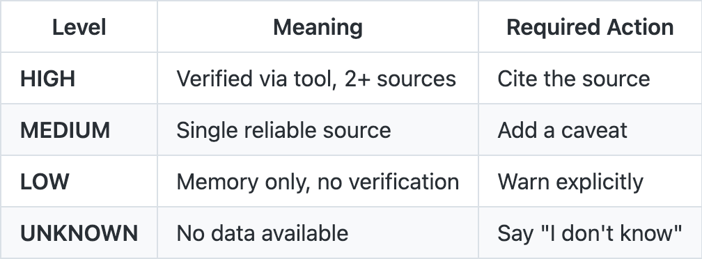
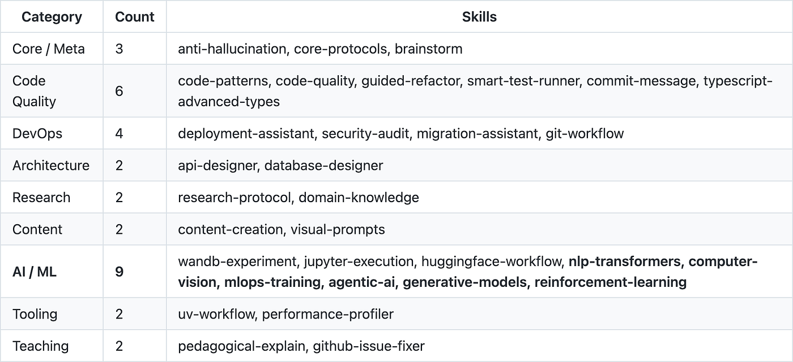
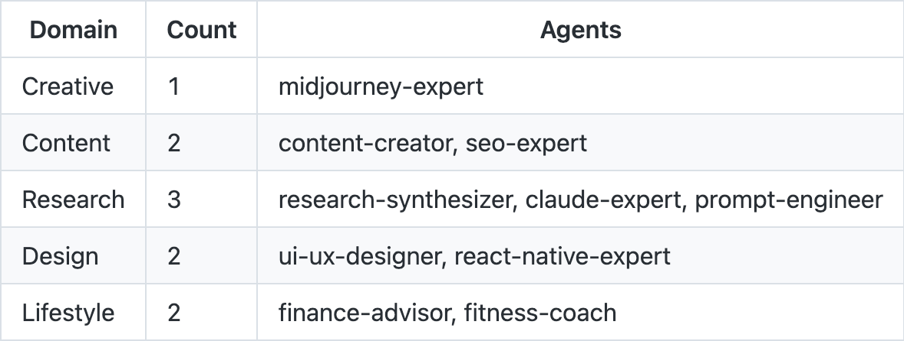
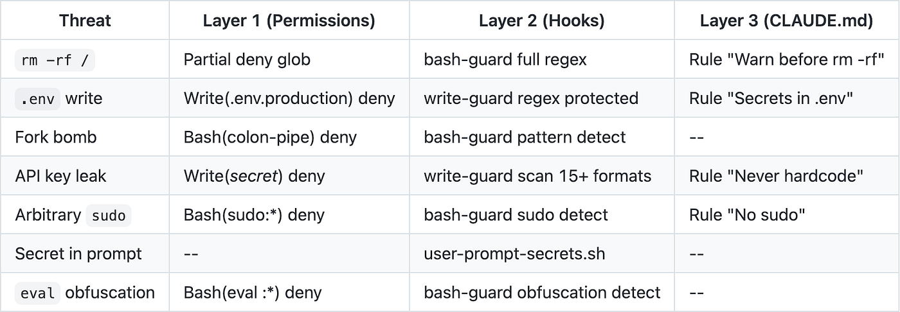
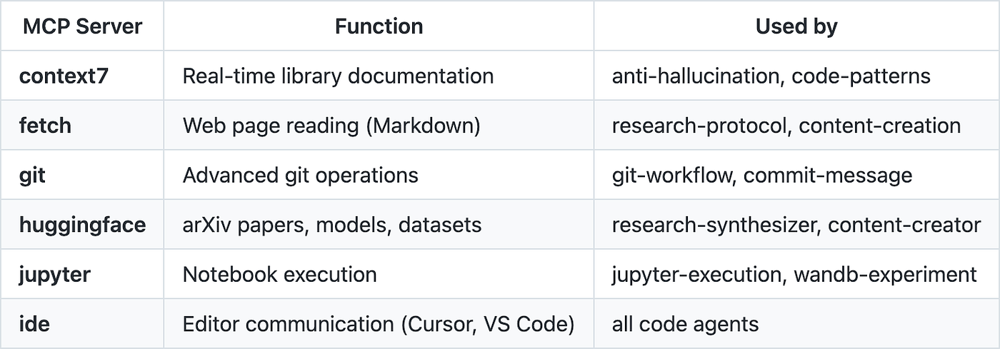
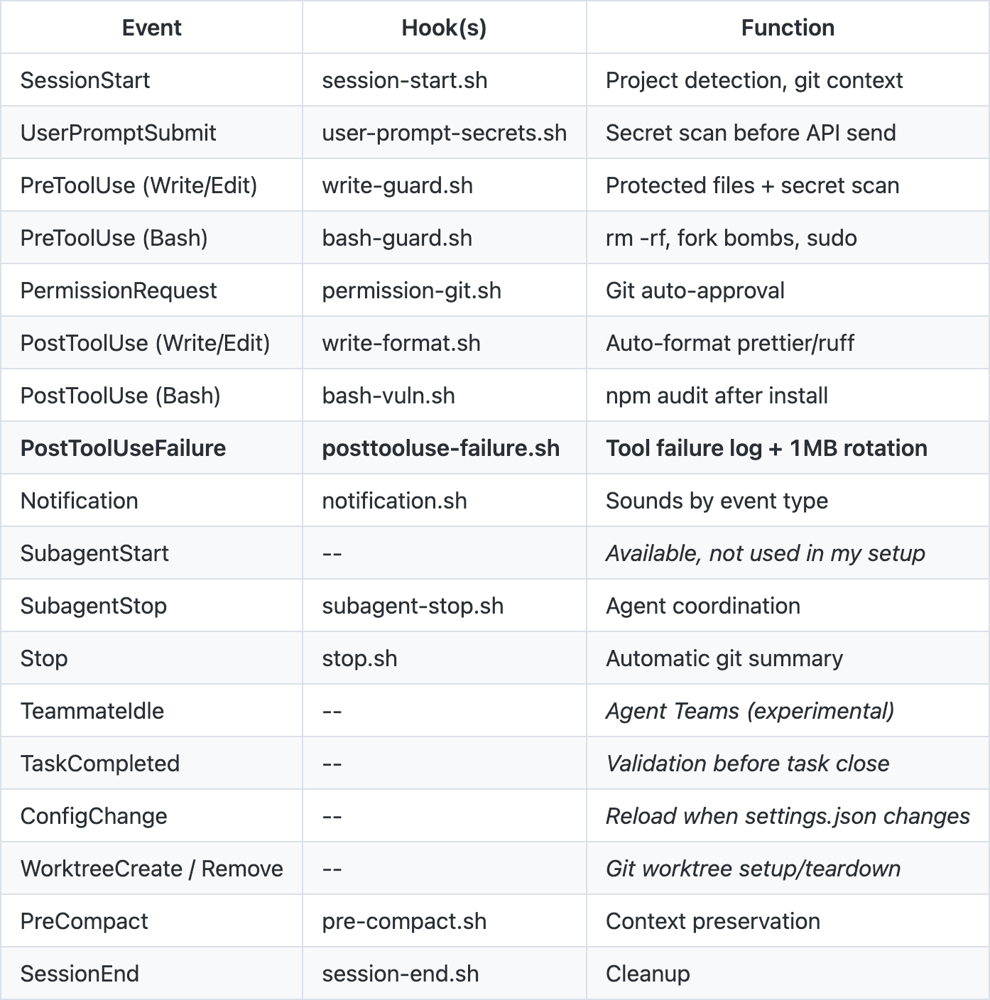

作者：Delanoe Pirard
发布日期：2026 年 3 月 3 日
原文链接：https://ai.gopubby.com/claude-code-setup-skills-hooks-agents-mcp-blueprint-80bdef0c62f6

# 我把 Claude Code 改造成了操作系统——这是蓝图

**如何通过钩子（hook）、技能（skill）、智能体（agent）和零信任（zero-trust）权限系统配置 Claude Code。一套经过实战验证的架构，从设计上消除幻觉（hallucination）和不安全命令。**


*Claude 凭空编造了三个充满自信的 FastAPI 参数。我损失了 40 分钟。这篇文章讲的就是我为杜绝此事再次发生而构建的系统。*

---

## TL;DR

**Claude Code** 不是**带终端的聊天机器人**，而是一个可编程平台。本蓝图将其构建为一个六层操作系统，由 skill、hook、agent 和 MCP 服务器在零信任安全架构下协同运行。系统包含以下内容：

- **78 条权限规则**（40 条允许 + 38 条拒绝）：零信任模型，每条命令、每次写入、每次 MCP 访问均经明确授权或拦截。[Anthropic 文档](https://code.claude.com/docs/en/hooks)
- **17 个钩子覆盖 17 个生命周期事件**：bash 脚本（或 HTTP 端点，或 LLM prompt）拦截每一个动作的执行前后。包括密钥检测、破坏性命令拦截、自动格式化、故障自动记录。纯确定性。
- **32 个技能，分属 10 个类别**：从反幻觉到生成式 AI，每个技能遵循统一的五阶段架构模式（ASSESS、ANALYZE、PLAN、EXECUTE、VALIDATE）。其中包含 6 个专用 AI/ML 技能（NLP、视觉、MLOps、强化学习、生成式、智能体）。
- **10 个专业智能体，分布在 5 个领域**：不是通用助手，而是拥有专用工具、模型和颜色标识的自治部门。代码类智能体已被更模块化的插件（plugin）取代。
- **6 个 MCP 服务器作为集成层**：实时文档、git 操作、网页读取、Jupyter Notebook。连接 Claude 与外部世界的神经系统。
- **持久记忆**：`memory/` 目录允许 Claude 在会话之间保留学习成果。已验证的模式、架构决策、工作流偏好。
- **全部开源**：[claude-code-blueprint](https://github.com/Aedelon/claude-code-blueprint) 包含本文描述的 CLAUDE.md、技能、智能体、钩子、规则、命令和配置。克隆、改造、迭代。
- **核心命题**：Claude Code 不是带终端的聊天机器人，而是一个可编程平台。大多数人只使用了终端这一层。

---

> **开源仓库示例：** [HERE](https://github.com/Aedelon/claude-code-blueprint)。

---

三个月前，Claude **当面对我说了谎**，毫无迟疑。

我正在开发一个 FastAPI 应用，需要向某个端点注入一个条件依赖项。我向 Claude Code 询问 `Depends()` 的确切签名。答案在两秒内到达，带着外科医生解释手术的那种自信：`Depends(dependency, use_cache=True, allow_override=False)`。三个参数，详细说明，使用示例。一切都清晰、有条理、令人信服。

我围绕这三个参数重构了代码。花了四十分钟把 `allow_override` 整合进依赖逻辑。然后我跑了测试。

**一切都崩了。**

`Depends()` 只接受**一个参数**。就是依赖本身。仅此而已。另外两个参数根本不存在，从来就不存在。Claude 凭空编造了它们，用的是引用勾股定理时才会有的那种确信。

这就是 LLM 的根本问题：它们**不知道自己不知道什么**。一个在口试中作弊的学生，被追问时多少会露出不安。而一个产生幻觉的 LLM 会直视你的眼睛，满怀确信。没有任何警告信号，没有语气上的迟疑，没有"我认为"。只有一个错误答案，以核实事实的口吻说出。

**四十分钟的工作**，毁于一个虚构的函数签名。

那天，我决定不再让这种事发生。不靠我自己的记忆，也不靠模型的记忆，而是靠构建一个让幻觉在结构上难以发生的系统。

那个系统就是我将在这里描述的内容。不是一份教程，不是一份技巧清单，而是一个 Claude Code 环境的完整架构——每一层都有其职能，错误在触及代码之前就被拦截，模型永远不是最后一道防线。

---

## Claude Code 架构：六层系统

在深入细节之前，先看全局。系统分为六层，每层有独立职责：

```
+---------------------------------------------------+
| 第六层：MCP                                        |
| 6 个服务器（context7、fetch、git、                 |
| huggingface、jupyter、ide）                        |
+---------------------------------------------------+
| 第五层：安全                                       |
| 40 条允许 + 38 条拒绝 + 17 个生命周期钩子          |
| + 正则表达式密钥检测 + 失败关闭陷阱                 |
+---------------------------------------------------+
| 第四层：智能体                                     |
| 10 个专业智能体（5 个领域）                         |
| 多智能体头脑风暴（4 个并行）                        |
+---------------------------------------------------+
| 第三层：技能                                       |
| 32 个技能（10 个类别），自动加载                    |
| 统一模式：5 个 AAPEV 阶段                           |
+---------------------------------------------------+
| 第二层：记忆                                       |
| 持久 memory/ + 项目级 rules/                       |
| 跨会话学习成果                                     |
+---------------------------------------------------+
| 第一层：CLAUDE.md（内核）                          |
| 反幻觉 + 置信度等级 + 工具链 +                     |
| 代码标准 + /compact 规则                           |
+---------------------------------------------------+
```

六层架构以 CLAUDE.md 作为内核（第一层），依次叠加持久记忆（第二层）、上下文感知技能（第三层）、专业智能体（第四层）、带钩子的零信任安全（第五层），以及 MCP 服务器集成（第六层）。每一层都建立在前一层之上。移除任一层会降低系统能力，但不会使其崩溃。


*六层架构：CLAUDE.md 作为内核、持久记忆、懒加载技能、专业智能体、零信任安全，以及 MCP 集成。每一层只负责一件事。*

操作系统的类比并非装饰性的，而是系统实际的工作方式。`CLAUDE.md` 是**内核**：定义基础行为。持久记忆是**文件系统**：在会话之间保留学习成果。技能是**共享库**：按需加载。智能体是**进程**：拥有专用资源的自治实体。安全是**权限层**：谁能做什么、在哪里做、在什么条件下做。MCP 服务器是**外设驱动**：与外部世界的接口。

---

## CLAUDE.md 作为内核

大多数教程会告诉你把"偏好"放进 CLAUDE.md——代码风格、偏爱的框架，也许还有一句"记得用 TypeScript"的提醒。

这远远不够。

`CLAUDE.md` 不是偏好文件，而是**系统内核**。它定义每个会话、每个工具、每个响应的默认行为。不在 `CLAUDE.md` 中的一切都是可选的；在其中的一切都是强制的。


*CLAUDE.md 是内核：它在任何对话开始前启动，执行反幻觉协议，定义置信度等级，并为每次交互设定基调。改变内核，就改变了整个系统。*

### 反幻觉协议

这是**第一条规则**，写于 FastAPI 事件当天。这是一棵决策树，Claude 在回答任何技术问题**之前**必须遵循：

```
在回答之前：
+-- API/库问题       --> 先查 Context7
+-- 近期事实/新闻    --> 先 WebSearch
+-- 文件内容         --> 先 Read
+-- 不确定           --> "我需要验证" + 使用工具

永远不要：
+-- 编造函数签名
+-- 猜测库版本
+-- 在未经验证的情况下假设 API 行为
+-- 捏造引用或来源
```

每个分支都是**直接指令**，不是建议，不是"最好"。如果 Claude 需要回答关于某个 API 的问题，它必须先查询 Context7（一个提供实时文档的 MCP 服务器）。如果无法验证，它必须说明这一点。

### 强制置信度等级

每个技术性断言必须附带置信度等级：



*表 1：置信度等级（来源：个人 CLAUDE.md）*

这不是噱头，而是操作约束。当 Claude 以 MEDIUM 置信度回答"这个函数接受 3 个参数"时，我知道需要去验证。当它以 HIGH 置信度并附上 Context7 链接回答时，我可以信任。两者之间的差距正是**四十分钟重构的代价**。

### /compact 时的保留规则

Claude Code 有上下文窗口（context window）限制。当一段对话变得过长，`/compact` 命令会压缩上下文。问题在于：如果没有明确指令，压缩会丢失关键信息。我的 `CLAUDE.md` 指定了必须保留的内容：

```
压缩上下文时，始终保留：
- 已修改文件的列表及路径
- 当前 git 分支和未提交的更改
- 待处理任务和 TODO 项
- 测试结果和失败记录
- 本会话中做出的关键架构决策
```

没有这条规则，每次压缩都是*部分失忆*。有了它，就是**结构化摘要**。

### 持久记忆

Claude Code 有一个根本问题：每个会话**从零开始**。你花一个小时解释架构、偏好和约定，第二天全部遗忘。上下文窗口是易失性的。


*每个会话结束，上下文就死亡。记忆层写入结构化 Markdown 文件，在重启后依然存活。会话结束了，知识却没有。*

解决方案是 `memory/` 目录。Claude Code 可以在 `~/.claude/projects/<项目>/memory/` 中读写文件。这些文件在会话之间持久存在。`MEMORY.md` 会被自动加载进每次对话，是永久工作记忆。[记忆文档](https://code.claude.com/docs/en/memory)

```
memory/
├── MEMORY.md         <-- 自动加载（最多 200 行）
├── patterns.md       <-- 项目中已确认的模式
├── debugging.md      <-- 反复出现问题的解决方案
└── architecture.md   <-- 结构性决策
```

`MEMORY.md` 是索引，必须保持简洁（超过 200 行的部分会被截断）。卫星文件包含细节。Claude 在会话中更新这些文件，记录的不是临时笔记，而是经多次交互**验证的学习成果**。

我在那里存储的内容：
- 项目中已验证的架构模式（不是假设）
- 已确认的工作流偏好（"始终使用 uv"、"不要自动提交"）
- 关键路径和项目结构
- 反复出现问题的解决方案

我**不**存储的内容：当前会话上下文、未经验证的信息、推测性结论。记忆是事实账本，不是便签。

与 `/compact` 的区别：compact 保留的是**会话内**的上下文；记忆保留的是**会话间**的学习成果。*前者是 RAM，后者是持久存储。*

### 基于路径的规则

`CLAUDE.md` 是全局的，适用于一切。但一个同时包含 Python 和 TypeScript 的项目，两者的约定并不相同。把 `"use ruff"` 和 `"use prettier"` 放在同一个文件里，就得靠 Claude 自己判断哪条规则适用于哪里。这是用概率性手段处理本可确定性解决的问题。

`~/.claude/rules/` 目录解决了这个问题。每个文件都有 `paths:` frontmatter，定义何时加载：

```
~/.claude/rules/
├── python.md       <-- *.py, pyproject.toml（40 行）
└── typescript.md   <-- *.ts, *.tsx, package.json（38 行）
```

`python.md` 包含 uv、ruff、pytest、类型标注和异步模式。`typescript.md` 包含 prettier、vitest、strict 模式、用 `satisfies` 而非 `as`、不用 enum。`paths:` frontmatter 类似 glob：当被编辑的文件匹配该模式时，规则才会加载。

**诚实说明**：撰写本文时，路径作用域有一个[已知 bug](https://github.com/anthropics/claude-code/issues/16299)。无论 `paths:` 如何设置，所有 `rules/` 文件都会在会话开始时加载。实际上，我的 78 行约定会系统性地被加载。这并非灾难性的：78 行在 200K 上下文窗口中大约占 100 个 token。当 bug 修复后，路径作用域会自动生效，无需更改文件。

相较于把所有内容集中在 `CLAUDE.md` 中，这种做法让内核保持在 109 行，语言特定约定另行存放，不污染主文件的可读性。

---

## 32 个 Claude Code 技能及其加载方式

技能是 Claude Code 中被大多数人跳过的机制。技能是 `~/.claude/skills/` 中带有 YAML frontmatter 的 Markdown 文件。当对话内容匹配技能描述时，Claude 会自动加载它们。无需 API，无需 SDK，无需构建步骤。纯文本，模型像遵循指令一样遵循它。[官方文档](https://code.claude.com/docs/en/skills)


*32 个技能，启动时一个都不加载。每个 YAML 文件保持休眠，直到 Claude 检测到触发关键词。懒加载模式让上下文保持精简，响应速度保持快捷。*

### 技能的结构

每个技能遵循相同的结构。以反幻觉技能的 frontmatter 为例：

```yaml
---
name: anti-hallucination
description: |-
  Verify API signatures, library methods, and factual claims
  before answering using Context7 and WebSearch.
  MUST BE USED when user asks about: function parameters,
  method signatures, library versions, API behavior.
allowed-tools:
  - mcp__context7__resolve-library-id
  - mcp__context7__get-library-docs
  - WebSearch
  - Read
  - Grep
---
```

`description` 是关键，Claude 用它来决定是否加载该技能。`allowed-tools` 字段是白名单：技能只能使用列出的工具。frontmatter 之后的内容定义行为，包括一棵完整的决策树：

```
问题类型？
+-- API/库签名    --> 先查 Context7，再回答
+-- 近期事件/事实 --> 先 WebSearch
+-- 文件内容      --> 先用 Read 工具
+-- 代码行为      --> 先 Read + 追踪
+-- 历史事实      --> 可使用训练数据
+-- 无法验证      --> 声明"我不知道"
```

### 统一架构模式

所有 32 个技能遵循相同的五阶段模式：

```
第一阶段：ASSESS / CLARIFY   --> 理解问题
第二阶段：ANALYZE / RESEARCH --> 先研究再行动
第三阶段：PLAN / DESIGN      --> 提出计划
第四阶段：EXECUTE / IMPLEMENT --> 执行变更
第五阶段：VALIDATE / VERIFY  --> 验证结果
```

这个模式对模型施加了一种认知纪律。Claude 不会直接跳到实现（第四阶段），而是先理解（第一阶段），再研究（第二阶段），再规划（第三阶段），最后由第五阶段完成验证闭环。*这正是一位高级工程师应有的推理方式。*

### 32 个技能的分类



*表 2：按类别划分的技能（来源：`~/.claude/skills/`）*

**AI/ML** 类别是系统中密度最大的。最近新增的 6 个技能覆盖了完整的机器学习流水线：`nlp-transformers` 用于微调和嵌入，`computer-vision` 用于 YOLO 和 SAM，`mlops-training` 用于分布式训练和量化，`agentic-ai` 用于智能体和工具使用，`generative-models` 用于 Stable Diffusion 和 LoRA，`reinforcement-learning` 用于 PPO 和 Gymnasium 环境。每个技能都遵循相同的 AAPEV 模式，并定义各自的工具白名单。

加载是懒加载（lazy loading）的：只有描述与对话上下文匹配的技能才会被注入。请求 FastAPI 端点帮助时，不会加载 `visual-prompts` 技能。请求头脑风暴时，会加载 `brainstorm` 技能，可能还会加载 `research-protocol`。系统**从设计上就是选择性的**。

---

## 智能体层：部门，而非助手

Claude Code 智能体是 `~/.claude/agents/` 中定义专业子智能体（sub-agent）的 Markdown 文件。与技能的区别在于：智能体有自己的模型、自己的工具，并可作为独立进程启动。技能传授的是方法；智能体**本身就是**专家。[官方文档](https://code.claude.com/docs/en/sub-agents)

值得一提的是：这个系统已经演进。最初有 18 个智能体，今天是 15 个（本文描述其中 10 个主要的），减少的原因不是裁减，而是**成熟化**。


*十个专业智能体，而非十个相同聊天机器人的副本。每个都有固定模型、工具白名单和路由触发条件。部门，而非助手。*

### 智能体的结构：以 research-synthesizer 为例

```yaml
---
name: research-synthesizer
model: opus
description:
  |-
  Multi-source academic research: literature reviews,
  cross-domain synthesis, DOI/arXiv/PMID citations.
  MUST BE USED when user asks for: "literature review",
  "research synthesis", "SOTA", "state of the art",
  "find papers", "compare studies".
tools: [Read, Grep, Glob, WebSearch, WebFetch,
mcp__fetch__fetch, mcp__arxiv-mcp-server__search_papers,
mcp__arxiv-mcp-server__read_paper,
mcp__huggingface__get-paper-info,
mcp__huggingface__get-daily-papers]
color: "#8B5CF6"
---
```

每个智能体定义：
- **model**：`sonnet` 用于常规任务，`opus` 用于复杂分析
- **tools**：可访问工具的白名单（不是系统中的所有工具）
- **description**：自动路由触发条件
- **color**：在终端中的视觉标识

### 从 18 个智能体到 10 个：插件的教训

系统第一个版本有 18 个智能体，其中三个被移除：`python-expert`、`typescript-expert` 和 `frontend-developer`。不是因为它们不好用，而是因为**插件**能做得更好。

Claude Code 插件（`feature-dev`、`pr-review-toolkit`、`frontend-design`）将完整系统（智能体、技能、工作流）打包为可分发模块。我的 `python-expert` 是一个 200 行的 Markdown 文件。而 `python-development:python-pro` 插件是一个完整系统，内置代码审查、测试运行器和集成模式。同时维护两者是多余的，于是自定义智能体让位。

与此同时，最臃肿的几个智能体（seo-expert、fitness-coach、claude-expert、prompt-engineer、ui-ux-designer）平均**精简了 70%**。文字更少，能力不变。教训是：*智能体不需要一部小说才能有效*。它需要的是**精准的描述**和**合适的工具**。



*表 3：按领域划分的 10 个主要智能体（来源：`~/.claude/agents/`）*

### 多智能体头脑风暴

`brainstorm` 技能可能是系统中最有趣的一块。它将多个智能体并行编排，从不同角度攻克一个问题：

```
第一阶段：CLARIFY    --> 理解主题（2–3 个问题）
第二阶段：MAP        --> 选择专家智能体
第三阶段：EXPLORE    --> 并行启动智能体
第四阶段：SYNTHESIZE --> 汇总：共识、分歧、建议
```

每个接收头脑风暴 prompt 的智能体必须：
- 从其专业领域提出 2–3 种方案
- 给出每种方案的权衡和风险
- 用来源为每条建议提供依据
- 声明置信度等级
- 标注无法验证的内容

综合环节识别共识点（强烈信号）和分歧点（决策节点），并生成有论据的建议。这不是投票，而是**结构化审议**。


*多智能体头脑风暴：一个编排者并行启动专业子智能体，每个从不同角度攻克问题，结果汇总为单一的结构化输出。*

---

## 零信任权限与钩子

这是系统变得严肃的地方。

Claude Code 可以执行 shell 命令，可以写文件，可以修改生产代码。默认信任是一种在某天终将失效的策略。我的系统从相反的原则出发：**一切皆被禁止，除非经过明确授权**。

### 第一级：静态权限

`settings.json` 文件定义了 78 条权限规则，40 条授权，38 条拒绝。[权限文档](https://code.claude.com/docs/en/permissions) 以下是节选：

**允许：**
```
"Bash(git:*)", "Bash(uv:*)", "Bash(npm run:*)",
"Bash(python:*)", "Bash(cargo:*)", "Bash(docker:*)",
"Bash(ruff:*)", "Bash(gh:*)",
"mcp__context7__*", "mcp__fetch__*", "mcp__git__*"
```

**拒绝：**
```
"Bash(chmod 777:*)", "Bash(sudo:*)", "Bash(:|:*)",
"Bash(dd if:*)", "Bash(eval :*)", "Bash(nc :*)",
"Write(~/.ssh/*)", "Write(*.pem)", "Write(*secret*)",
"Edit(.env.production)", "Edit(*credentials*)"
```

逻辑简单明了：Claude 可以运行 `git`、`python`、`cargo`、`docker`，不能运行 `sudo`、`chmod 777`、`eval`，也不能写入 `~/.ssh/` 或任何文件名包含"secret"的文件。每条权限都是一个**明确的决策**。


*78 条明确权限。钩子失败时关闭。一个在命令执行前就进行模式匹配的 bash-guard。零信任意味着系统必须赢得行动的权利。*

### 第二级：PreToolUse 钩子

静态权限还不够。一条允许的 `Bash(rm:*)` 在完整命令为 `rm -rf /` 时依然危险。PreToolUse 钩子在执行之前检查每条命令的**内容**。

`bash-guard` 拦截破坏性模式：

```bash
#!/usr/bin/env bash
set -euo pipefail
# 失败关闭：出错时默认拦截
trap 'echo "{\"hookSpecificOutput\":{...\"deny\"...}}"' ERR
input=$(cat)
command=$(echo "$input" | jq -r '.tool_input.command // empty')
# Sudo/Su：直接拦截，不仅仅是警告
if echo "$command" | grep -qE \
  '(^|;|&&)\s*(sudo|su |doas |pkexec)'; then
  # --> DENY：提权操作被拦截
  exit 0
fi
# 破坏性模式
# 检测：rm -rf /、fork bomb、chmod -R 777、
# curl 管道执行 bash、mkfs、dd 到设备
if echo "$command" | grep -qE "$dangerous_patterns"; then
  # --> DENY：检测到危险命令
  exit 0
fi
# 混淆：eval $var、base64 解码管道 shell
if echo "$command" | grep -qE "$obfuscation_patterns"; then
  # --> DENY：检测到间接执行
  exit 0
fi
```

一个脚本，三重防护：提权拦截、破坏性模式检测（fork bomb、`rm -rf`、管道执行 bash）、混淆检测（`eval $var`、base64 解码 shell）。

`write-guard` 保护敏感文件并扫描内容中的密钥：

```bash
# === 敏感文件保护 ===
# 拦截写入：.env、credentials、id_rsa、
# .pem、.key、.ssh/、.npmrc、.pypirc、.aws/、kubeconfig...
protected='\.env($|\.)|credentials|id_rsa|\.pem$|\.key$|\.ssh/'
if echo "$file_path" | grep -qiE "$protected"; then
  # --> DENY：受保护文件
fi
# === 写入内容中的密钥检测 ===
# 正则表达式覆盖 15+ 种密钥和 token 格式：
# - OpenAI 密钥（sk-...）
# - AWS 密钥（AKIA...）
# - GitHub token（ghp_...、gho_...、github_pat_...）
# - GitLab、Slack、Google、Stripe、SendGrid token
# - SSH/TLS 私钥（BEGIN ... KEY）
# - 数据库连接 URL（含内联密码）
# - JWT（eyJ...eyJ...sig 格式）
if echo "$content" | grep -qE "$secret_patterns"; then
  # --> DENY：检测到潜在密钥
fi
```

这套正则表达式覆盖了最常见的意外泄漏场景：来自主流云服务和 SaaS 提供商的 API 密钥、证书、认证 token 以及包含明文密码的数据库连接。不是穷举，但足以覆盖最高频的情况。

### 第三级：失败关闭模式

所有钩子中最重要的一行大概是这个：

```bash
trap 'echo "{\"hookSpecificOutput\":{
  \"permissionDecision\":\"deny\",
  \"permissionDecisionReason\":\"Hook error - fail-closed\"}}"' ERR
```

如果钩子本身崩溃，如果 `jq` 解析输入失败，如果某个变量为空，如果任何地方出错——默认响应是**拒绝**。不是允许，不是"再看看"，而是拒绝。这就是失败关闭（fail-closed）原则：有疑问时，拦截。

### 超越 bash：HTTP 钩子和提示词钩子

我所有的钩子都是 bash 脚本。但这已不再是唯一选项。Claude Code 现在支持三种钩子类型：

- `"type": "command"`：shell 脚本（我使用的方式）
- `"type": "http"`：向 URL 发送 POST JSON，接收 JSON 返回
- `"type": "prompt"`：解释事件的 LLM 子智能体

HTTP 钩子提供了有趣的可能性：将每次工具失败发送到 Slack webhook，将安全指标推送到仪表盘，或将允许/拒绝决策委托给集中式服务。提示词钩子允许比正则表达式更细致的判断，代价是 token 消耗和延迟。为了确定性和速度，我坚持使用 bash，但架构支持三种方式。[钩子文档](https://code.claude.com/docs/en/hooks)

### 发送前扫描

最后一个钩子在用户 prompt **发送至 API 之前**进行拦截：

```bash
# 检测 prompt 中是否提及密钥（但不拦截关于密钥的问题）
if echo "$prompt" | grep -qiE \
  '(password|api.?key|token|credential)'; then
  if ! echo "$prompt" | grep -qiE \
    '(how|help|explain|what is)'; then
    echo '{"systemMessage":"Warning: your prompt
    mentions sensitive information."}'
  fi
fi
```

如果你直接在 prompt 中输入密码（而不是在询问密码相关问题），钩子会在文字发往 Anthropic 服务器之前警告你。

### 防护矩阵



*表 4：多层安全矩阵（来源：`settings.json` + `hooks/scripts/`）*

每种威胁都被**至少两层**覆盖。这就是**纵深防御**（defense in depth）原则：如果一层失效，下一层拦截。

### 安全网：PostToolUseFailure

`PostToolUseFailure` 拦截工具**失败**：Read 失败、Bash 超时、MCP 无响应。钩子记录这些错误，而非放任其消失：

```bash
TOOL_NAME=$(echo "$INPUT" | jq -r '.tool_name // "unknown"')
ERROR=$(echo "$INPUT" | jq -r '.error // .stderr // "no details"' \
  | head -c 500)
LOG_FILE="$HOME/.claude/logs/tool-failures.log"
# 超过 1MB 自动轮转
if [ -f "$LOG_FILE" ] && \
  [ "$(stat -f%z "$LOG_FILE")" -gt 1048576 ]; then
  mv "$LOG_FILE" "$LOG_FILE.old"
fi
echo "[$(date '+%Y-%m-%d %H:%M:%S')] FAIL tool=$TOOL_NAME \
  error=$(echo "$ERROR" | tr '\n' ' ' | head -c 200)" \
  >> "$LOG_FILE"
```

这不严格属于安全领域，而是可观测性（observability）。当钩子拦截一个动作时，我立刻知道。但当工具静默失败（MCP 超时、文件未找到、意外格式）时，如果没有记录，这些错误是不可见的。`PostToolUseFailure` 弥补了这个缺口。超过 1MB 自动轮转，保持磁盘整洁。


*`PostToolUseFailure` 在每次工具报错时触发。进程以非零状态退出，动作被阻止，失败记录按 1MB 自动轮转。安全网不发出警告，它只是接住。*

---

## MCP 服务器：6 个集成点

MCP（[Model Context Protocol](https://code.claude.com/docs/en/mcp)，模型上下文协议）是允许 Claude Code 连接外部服务的开放协议。每个 MCP 服务器暴露 Claude 可直接调用的工具，就像它们是其原生功能的一部分。



*表 5：MCP 服务器（来源：`~/.claude/settings.json`）*

`context7` 服务器是反幻觉协议的基石。当 Claude 需要回答关于 FastAPI 的问题时，它调用 `mcp__context7__resolve-library-id` 找到库，然后调用 `mcp__context7__get-library-docs` 获取当前文档——而不是依赖训练记忆。**真实的、最新的文档**，包含正确的函数签名。


*六个 MCP 服务器：Context7 提供已验证文档，Fetch 获取实时网页内容，Git 执行仓库操作，HuggingFace 访问模型，Jupyter 进行计算，IDE 提供实时编辑器反馈。连接 Claude 与外部世界的神经系统。*

*如果 `context7` 在 `Depends()` 事件发生那天就已在系统中，那次幻觉不会通过协议的第二阶段。*

加载是懒加载的。只有当某个 MCP 工具真正被调用时，服务器才会初始化。25,000 的 `MAX_MCP_OUTPUT_TOKENS` 防止大型响应撑满上下文窗口。

---

## 为什么钩子在格式化和安全方面优于 LLM

我在这个系统中对每个决策应用一条简单规则：***永远不要让 LLM 做一个 linter 能做得更好的事。***

代码格式化是最典型的例子。Claude 可以格式化 Python，而且做得相当不错。但"相当不错"不是确定性的。LLM 会根据上下文、token 采样的概率分布、甚至月相，将 `dict[str, Any]` 格式化出不同的结果。

而 linter 永远以同样的方式格式化 `dict[str, Any]`。每次。毫无例外。


*钩子是确定性函数：相同输入，相同输出，每次如此。LLM 是概率分布：相同输入，不同输出，每次如此。对于格式化和安全，你需要的是函数。*

Write/Edit 的 `PostToolUse` 钩子践行了这一原则：

```bash
if [ -n "$file_path" ] && [ -f "$file_path" ]; then
  case "$file_path" in
    *.ts|*.tsx|*.js|*.jsx|*.mjs|*.cjs)
      npx prettier --write "$file_path" 2>/dev/null || true
      ;;
    *.py)
      ruff format --quiet "$file_path" 2>/dev/null || true
      ;;
    *.json)
      npx prettier --write "$file_path" 2>/dev/null || true
      ;;
  esac
fi
```

Claude 写入的每个文件都会被对应的确定性工具自动重新格式化：TypeScript/JavaScript/JSON 用 `prettier`，Python 用 `ruff`。Claude **甚至不会看到**最终的格式化结果。它写入，钩子重新格式化，结果保证合规。

同样的原则适用于漏洞检测。每次 `npm install` 之后，`posttooluse-bash-vuln.sh` 钩子扫描输出中是否出现 CVE：

```bash
if echo "$command" | grep -qE \
  '^(npm|pnpm|yarn) (install|add|remove)'; then
  if echo "$stdout" | grep -qiE '(vulnerabilit|CVE-)'; then
    echo '{"systemMessage":"Vulnerabilities detected.
    Run npm audit for details."}'
  fi
fi
```

**确定性。可复现。零 token 消耗。**

---

## Claude Code 完整生命周期：17 个事件的全景图

以下是当我在 Claude Code 中输入一条命令时，整个系统的运作过程：

```
用户输入："重构这个 FastAPI 端点"
                |
                v
[SessionStart] --> session-start.sh
检测到：Python 项目，main 分支，3 个修改文件
                |
                v
[UserPromptSubmit] --> user-prompt-secrets.sh
扫描：prompt 中无密钥 --> OK
                |
                v
Claude 加载技能 "code-patterns" + "anti-hallucination"
Claude 查询 Context7 获取 FastAPI 文档（第二阶段：ANALYZE）
Claude 提出重构方案（第三阶段：PLAN）
                |
                v
[PreToolUse: Write] --> write-guard.sh
文件：src/api/endpoints.py --> 非受保护文件 --> OK
内容：无密钥检测 --> OK
                |
                v
Claude 写入文件
                |
                v
[PostToolUse: Write] --> write-format.sh
扩展名 .py --> ruff format --> 自动格式化
                |
                v
[PreToolUse: Bash] --> bash-guard.sh
命令：pytest tests/ --> 非危险命令 --> OK
                |
                v
Claude 运行测试（第五阶段：VALIDATE）
                |
                v
[Stop] --> stop.sh
Git 摘要：main 分支，1 个修改文件，0 个已暂存
```

Claude Code 支持 17 个生命周期钩子事件。以下是完整列表，以及我的配置中激活的钩子：



*表 6：17 个生命周期事件及其钩子（来源：`~/.claude/settings.json` + [官方文档](https://code.claude.com/docs/en/hooks)）*

---

## 为什么 Claude Code 是平台，而非聊天机器人

Claude Code 不是一个工具，而是一个平台。区别在于结构。*工具是用来使用的；平台是用来编程的。* `settings.json` 是系统配置文件。钩子是事件监听器。技能是按需加载的模块。智能体是拥有隔离资源的进程。MCP 服务器是外设驱动。

大多数关于 Claude Code 的文章展示的是孤立的齿轮："这是如何写一个钩子"、"这是一个有用的技能"、"这是 5 个值得安装的 MCP 服务器"。这些都是组件。它们没有展示这些组件如何构成一个每层都相互强化的系统。

反幻觉协议之所以有效，**是因为** Context7 是一个可访问的 MCP 服务器。安全钩子之所以有效，**是因为**静态权限定义了边界。多智能体头脑风暴之所以有效，**是因为**智能体拥有专用工具和模型。移除任一层，其他层的有效性都会降低。

我的立场是：Claude Code 的价值**不在于模型本身**，而在于**围绕模型的基础设施**。模型是引擎，`CLAUDE.md`、技能、智能体、钩子、权限和 MCP 服务器是底盘、传动系统、制动器和仪表盘。

最后一点：这个系统不是展示品，而是我每天的工作环境。每个技能、每个钩子、每条权限规则，都是为了解决我遇到的真实问题而写的。反幻觉协议诞生于一个虚构的函数签名。write-guard 诞生于一个意外写入文件的 API 密钥。bash-guard 诞生于一条方向错误的 `rm -rf`。这不是预防性工程，而是**响应式工程**，被提炼为确定性代码。

---

## 本文分析的局限性

- **幸存者偏差**。我展示的是一个对我有效的系统。我的工作流（技术文章、Python/TypeScript API、ML 研究）不代表所有使用场景。移动端开发者或数据工程师会有不同的配置。
- **token 成本**。32 个技能，即便是懒加载，也会消耗上下文。相较于极简配置，我没有精确测量 token 开销。直觉是：开销不小。
- **bash 钩子的脆弱性**。钩子依赖 `jq`、`grep` 以及 Claude Code 稳定的 JSON 输入格式。一旦输入格式更新，系统可能崩溃。我没有针对钩子本身的自动化测试。
- **正则表达式不是安全措施**。基于正则表达式的密钥扫描是一种启发式方法，不提供保证。经过 base64 编码或跨多行的密钥可以通过。这不能替代密钥管理器（secrets manager）。
- **维护成本**。32 个技能、10 个智能体、17 个钩子——这是一个需要维护的系统。API 在演进，模型在变化，模式会老化。前期投入是相当大的。好消息是：插件可以将最通用智能体（代码审查、测试、前端）的维护委托给社区包。

---

## 这对你意味着什么

我发布了一个**配套仓库**，包含精心挑选的即用内容：[claude-code-blueprint](https://github.com/Aedelon/claude-code-blueprint)。其中包含 CLAUDE.md、8 个技能、4 个智能体、11 个钩子（2 个经脱敏处理）、规则、命令和权限模板。这不是我配置的镜像，而是一个经过改造可供使用的起点。

**如果你刚开始使用 Claude Code**：从蓝图的 `CLAUDE.md` 开始。加入反幻觉协议和置信度等级。这是投入产出比最高的改变，预计花费 30 分钟。

**如果你已有中级配置**：添加安全钩子。蓝图中的 `write-guard` 和 `bash-guard` 包含完整的结构和威胁类别，在此基础上添加你自己的正则表达式。半天时间即可完成适配和测试。再为你的主要使用场景添加 3–5 个技能。

**如果你已准备好构建完整系统**：按领域设计你的智能体，配置 MCP 服务器，写出你的零信任权限规则。蓝图提供骨架；预计花一周时间适配和迭代。这个系统的投入是前置的，收益是后置的。

---

## Claude Code 配置常见问题

### 为什么用 Markdown 文件而不是 SDK 或 API？

这是 Anthropic 的架构选择。技能和智能体是模型按指令解读的纯文本。优点：零构建步骤、零依赖、完全可移植。缺点："运行时"是模型本身，带有一定程度的非确定性解读。

### Claude Code 钩子会拖慢执行速度吗？

每个钩子都有超时时间（根据类型不同，为 2 到 15 秒）。实际上，我的钩子执行时间都在 100ms 以内。`write-format.sh` 是最慢的（调用 prettier/ruff），但在 15 秒的超时下，这是透明的。[Anthropic 文档](https://code.claude.com/docs/en/hooks)

### 这套配置能用于非 Claude 模型吗？

不能。技能、智能体、钩子和 `CLAUDE.md` 是 Claude Code 特有的。架构概念（分层、零信任、确定性）是可迁移的，但实现与 Anthropic 生态系统绑定。

### 32 个技能不会撑满上下文窗口吗？

加载是懒加载的。Claude 只在描述匹配对话上下文时才加载某个技能。实际上，同时加载的技能通常是 2 到 4 个，很少更多。25,000 的 `MAX_MCP_OUTPUT_TOKENS` 和最大 64,000 token 的输出提供了充裕余量。

### 如何调试一个无效的钩子？

钩子向 stderr 写入调试信息（对 Claude 不可见，但在日志中可见）。`set -euo pipefail` + `trap ERR` 模式保证了损坏的钩子会触发拦截，而不是静默失败。开发期间我会加入 `echo "DEBUG: ..." >&2`。自从添加了 `PostToolUseFailure` 钩子，每次工具失败都会自动记录到 `~/.claude/logs/tool-failures.log`。

### 持久记忆会不会变成过时信息？

这是真实风险。`MEMORY.md` 不是自动转储，而是经过整理的账本。我只存储跨多个会话确认的模式，绝不存储假设。当信息过时时，Claude 会更新或删除它。原则是：不将未经项目验证的内容写入记忆。

---

## 结语：从自信的说谎者到会核验的系统

### 回到 Depends()

三个月前，Claude 毫不眨眼地为 `Depends()` 编造了三个参数。四十分钟化为乌有，一场无谓的重构，以及一个认识：信任 LLM 是一种有有效期的策略。

今天，同样的问题将经过一条验证链：反幻觉协议会触发 Context7，后者实时查询 Starlette/FastAPI 文档，返回真实签名（`Depends(dependency)`，一个参数），附带 HIGH 置信度等级和源链接。那个谎言会在触及我的代码之前被拦截。

有一个值得说清楚的矛盾。*防止 Claude 说谎的系统，是用 Claude 构建的。* 拦截危险命令的钩子，是在一个 Claude 可以执行危险命令的终端中写成的。构建零信任系统所需的信任，正是这个系统被设计来消除的那种信任。


*这个系统不会让 Claude 变得更聪明，而是让 Claude 变得可问责。每一个断言都有置信度等级，每一次工具调用都有守卫，每一个会话都有记忆。这就是自信的说谎者与可靠系统之间的差距。*

### 我的立场

Claude Code 是一个**几乎没有人将其当作可编程开发平台来使用**的可编程开发平台，现在是 2026 年。不是因为模型，而是因为基础设施。钩子、技能、智能体、权限和 MCP 共同构成了一个极简操作系统，LLM 是处理器，其他一切都是确定性代码。

把 Claude Code 当作带终端的聊天机器人使用的人，只用到了它能力的一小部分。把它当作可编程平台使用的人，交付更快，出错更少。

### 下一步

*大多数关于 Claude Code 的文章展示的是齿轮，这篇文章展示的是钟表机构。*

但这台钟表机构还未完工。HTTP 钩子和提示词钩子（如上文所述）允许用端点或专业子智能体替换 bash 脚本。插件将完整系统打包为可分发模块。MCP 协议每周都在新增服务器。

然后是 [Agent Teams](https://code.claude.com/docs/en/agent-teams)，目前最重要的实验性功能。不再是一个 Claude Code 实例编排沉默的子智能体，而是多个实例并行协作，队友之间直接通信。一个领队分配任务，队友在各自的上下文中工作，无需通过中间人协调。这是我这套系统的自然演进：从单核 OS 迈向多核 OS。该功能仍隐藏在 `CLAUDE_CODE_EXPERIMENTAL_AGENT_TEAMS=1` 后面，但方向已经清晰。

问题不再是*Claude Code 能否取代我的 IDE*，而是：*在一个智能体的可编程性被推进到多远之前，它本身就成了一个操作系统？*

我没有答案。但我知道，这个问题值得**四十分钟的重构**。

---

> ✦ **DELANOE PIRARD** ✦ 人工智能研究员与工程师
>
> [delanoe-pirard.com](http://www.delanoe-pirard.com/) · [github.com/Aedelon](http://github.com/Aedelon) · [linkedin.com/in/delanoe-pirard](http://linkedin.com/in/delanoe-pirard) · [x.com/0xAedelon](http://x.com/0xAedelon)

---

## 参考资料

### 第一层：官方文档

- Anthropic (2026). "Hooks reference." Claude Code Docs. [链接](https://code.claude.com/docs/en/hooks)
- Anthropic (2026). "Automate workflows with hooks." Claude Code Docs. [链接](https://code.claude.com/docs/en/hooks-guide)
- Anthropic (2026). "Extend Claude with skills." Claude Code Docs. [链接](https://code.claude.com/docs/en/skills)
- Anthropic (2026). "Create custom subagents." Claude Code Docs. [链接](https://code.claude.com/docs/en/sub-agents)
- Anthropic (2026). "Orchestrate teams of Claude Code sessions." Claude Code Docs. [链接](https://code.claude.com/docs/en/agent-teams)
- Anthropic (2026). "Configure MCP servers." Claude Code Docs. [链接](https://code.claude.com/docs/en/mcp)
- Anthropic (2026). "Memory and CLAUDE.md." Claude Code Docs. [链接](https://code.claude.com/docs/en/memory)
- Anthropic (2026). "Permissions." Claude Code Docs. [链接](https://code.claude.com/docs/en/permissions)
- Anthropic (2026). "Extend Claude Code — Features overview." Claude Code Docs. [链接](https://code.claude.com/docs/en/features-overview)

### 第二层：技术文章

- Julian B (2026). "The OS Hiding In Claude Code." Medium. [链接](https://medium.com/@julian.burns50/the-os-hiding-in-claude-code-6153dccb6023)
- David Haberlah (2026). "Configure Claude Code to Power Your Agent Team." Medium. [链接](https://medium.com/@haberlah/configure-claude-code-to-power-your-agent-team-90c8d3bca392)
- alexop.dev (2026). "Understanding Claude Code's Full Stack: MCP, Skills, Subagents, and Hooks." [链接](https://alexop.dev/posts/understanding-claude-code-full-stack/)

### 第三层：社区资源

- ChrisWiles (2026). "claude-code-showcase." GitHub. [链接](https://github.com/ChrisWiles/claude-code-showcase)
- hesreallyhim (2026). "awesome-claude-code." GitHub. [链接](https://github.com/hesreallyhim/awesome-claude-code)
- Okhlopkov (2026). "My Claude Code Setup: MCP, Hooks, Skills." [链接](https://okhlopkov.com/claude-code-setup-mcp-hooks-skills-2026/)
