> 作者：Rick Hightower
> 发布日期：2026年4月
> 原文链接：https://pub.towardsai.net/gsd-vs-superpowers-vs-c63b10b8da87

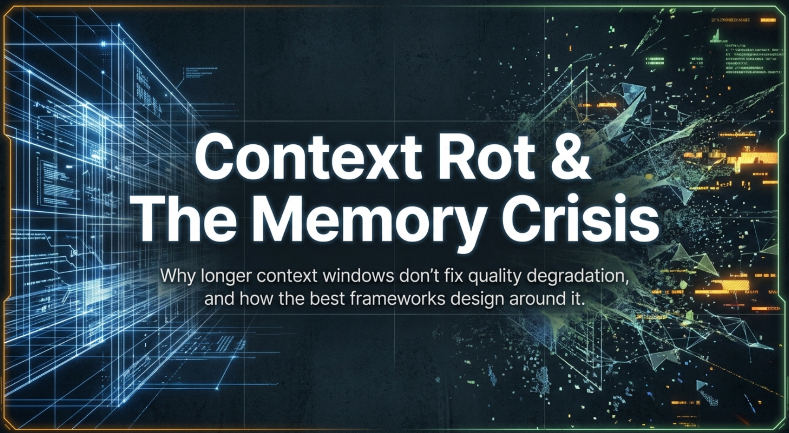

# GSD、Superpowers 与 BMAD 如何应对上下文腐化——AI 开发中的上下文腐化（context rot）与记忆危机

**为什么更大的上下文窗口（context window）无法解决质量退化问题，以及真正有效的方案是什么——上下文腐化正在悄悄拖垮你的 AI 智能体，更大的窗口救不了它**

*Rick Hightower · 约 19 分钟阅读*

---

所有被测试的模型都随上下文增长而出现退化。不是某些模型，不是旧版模型，而是每一个。上下文腐化是 AI 开发中隐形的质量杀手，而最好的框架正是那些从设计层面应对它的框架。

**摘要**：上下文腐化（context rot）是指随着 token 窗口被对话历史和累积上下文填满，大语言模型（LLM，Large Language Model）输出质量发生的渐进性退化（context degradation）。本文回顾了上下文退化背后的研究，包括 Liu et al. 的"Lost in the Middle"发现和 Chroma Research 对 18 个模型的研究，随后探讨 GSD、Superpowers 和 BMAD 三个框架如何通过全新上下文隔离（fresh context isolation）、微任务分解（micro-task decomposition）和角色切换（persona switching）来解决这一问题。文中包含一个实用的上下文预算（context budget）计算示例，以及七条构建抗腐化智能体工作流（agentic workflow）的可操作建议。

## 隐形的质量杀手

每位使用过 AI 编码智能体的开发者都经历过同样令人沮丧的模式。最初几轮交互非常出色——智能体理解你的代码库、遵循你的约束，产出整洁、结构清晰的代码。然后，大约到第二十次提示时，情况开始滑坡：智能体忘掉了十条消息前你声明过的某个约束；它生成的函数签名与自己早些时候的输出相矛盾；它在本该有真实实现的地方给出占位符代码；它虚构出一个并不存在的 API。

这就是上下文腐化。

上下文腐化是指随着 token 窗口被对话历史、代码片段、工具输出和累积上下文填满，LLM 输出质量发生的渐进性退化。这不是理论上的担忧，而是一个可测量、可复现的现象，影响当今生产环境中的每一个语言模型。如果你正在构建可自主运行数小时的智能体工作流，上下文腐化就是对输出质量最大的威胁。

在本系列的早期文章中，我们探讨了 GSD 如何通过规格驱动开发（spec-driven development）来组织工作，以及 Superpowers 如何通过可组合技能（composable skills）执行纪律约束。本文聚焦于这些框架旨在解决的基础问题：AI 智能体工作时间越长，表现越差；而最有效的框架正面应对这一挑战。

## 量化上下文退化

### 证明智能体工作越久越"笨"的研究

上下文退化的奠基研究来自 Liu et al. 的《Lost in the Middle: How Language Models Use Long Contexts》，发表于 *Transactions of the Association for Computational Linguistics*（TACL，第 12 卷，第 157–173 页，2024；原稿于 2023 年 7 月发布至 arXiv）。研究人员在多文档问答和键值检索任务上测试了多个 LLM，系统地改变相关信息在输入上下文中出现的位置。他们发现语言模型的性能遵循 U 形曲线（U-shaped curve）：当相关信息出现在输入上下文的最前面（首位偏差，primacy bias）或最末尾（近因偏差，recency bias）时，模型表现最好；当模型需要从中间位置获取信息时，性能会显著下降。

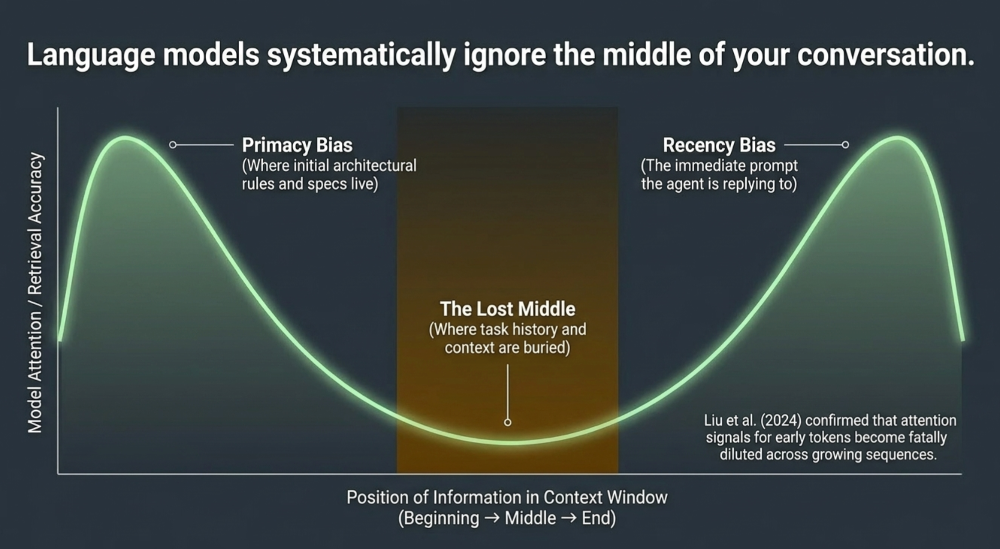

这一发现对智能体开发有深远影响。当你的 AI 智能体工作了三十分钟、累积了数千个 token 的对话历史后，你在会话开始时提供的约束和规格正好处于最糟糕的位置——上下文窗口的中间。

举一个具体例子：你在会话开始时告诉智能体"所有数据库访问必须经过仓储模式（repository pattern），绝不在服务类中直接创建数据库查询"。二十次提示之后，智能体正深陷复杂功能的实现中。你的仓储约束现在被埋在一个 40,000 token 对话的中段。智能体生成了一个包含内联 SQL 查询的服务类。这不是在故意违抗——它只是实际上已经无法访问你的约束。

2025 年，Veseli et al. 延伸了这项研究，发现了一个更令人担忧的现象。U 形模式只在上下文使用量低于 50% 时持续存在。当上下文超过 50% 容量时，模式发生转变：首位偏差显著减弱，而近因偏差保持相对稳定。你最初写下的需求、架构约束和编码标准——它们从靠近开头的位置出发——逐渐失去相对影响力。

下图展示了随着上下文窗口填充，输出质量和对早期 token 的关注度如何同步下降：

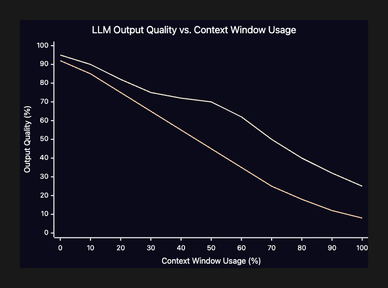

*随着上下文使用量增加，整体输出质量和模型对早期 token（你的初始约束所在之处）的关注度都急剧下降。50% 阈值标志着退化加速的临界点。*

### Chroma Research 研究

最全面的上下文腐化实证研究来自 Chroma Research。他们测试了来自各主要服务商的 18 个模型，包括 Claude 4（Opus 和 Sonnet 变体）、GPT-4.1、Gemini 2.5（Pro 和 Flash）以及 Qwen3 系列模型。研究结论相当直接：

**所有被测试的模型都随上下文增长而出现退化。不是某些模型，不是旧版模型，而是每一个。**

该研究还揭示了一个反直觉的发现：模型在处理打乱顺序的文本时，表现反而优于处理连贯文本。连贯文本会形成更强的位置模式，导致模型产生近因偏差，过度关注输入末尾的段落，而忽视较早的内容。换句话说，你与智能体的对话逻辑越严密，它就越容易受到上下文腐化的影响。

即使在文本复制这类简单任务上，性能退化也会出现——这意味着现实中的软件工程任务所受影响只会更严重。如果一个模型无法可靠地将上下文窗口开头的文本复制到输出，它又怎么能可靠地遵循 50,000 个 token 之前声明的架构约束？

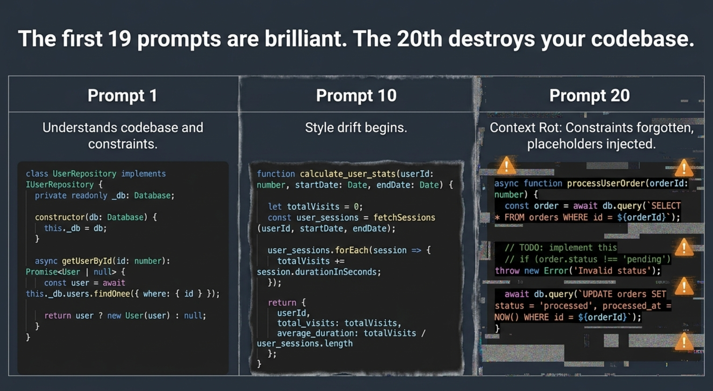

Chroma 的研究还发现，Claude 模型在聚焦提示（约 300 个 token）和完整提示（约 113K token）之间表现出最大的差异，主要体现在保守性的弃答上。当因上下文过载而产生不确定性时，这些模型选择不作答，而非胡乱猜测。对于代码生成而言，这或许是相对更安全的失效模式，但同样意味着生产力损失。

## 上下文腐化的实际表现

对于使用 AI 编码智能体的开发者来说，上下文腐化以可预测的方式显现：

**被遗忘的约束。** 你告诉智能体使用依赖注入（dependency injection），它却开始直接创建具体实例。你规定所有错误都应返回结构化 JSON 响应，它却开始抛出原始异常。这些不是随机错误，而是模型失去对早期会话指令访问权的症状。

**矛盾的输出。** 智能体产生的代码与同一会话中更早生成的代码相冲突。它在一个文件中定义了带有 `getUser(id: string)` 方法的 `UserService` 类，然后在另一个文件中调用 `userService.fetchUser(userId: number)`——方法名和参数类型都对不上。

**占位符蔓延（placeholder creep）。** 真实实现被 `// TODO: implement this` 注释或桩函数所取代。会话初期，智能体会写出完整的实现；随着上下文填满，它开始偷工减料，在本应有生产逻辑的地方留下占位符代码。

**虚构的 API。** 智能体发明了并不存在的函数签名、库方法或配置选项。它可能调用 `database.queryBatch()`，而 ORM 只支持 `database.query()`；或者引用一个从未在库中出现过的 `config.enableStrictMode()` 方法。

**风格漂移（style drift）。** 智能体停止遵循它之前在应用的命名规范、错误处理模式或编码风格。它原本用 camelCase 命名变量，突然切换到 snake_case；原本将所有异步调用包裹在 try-catch 块中，然后就不再这样做了。

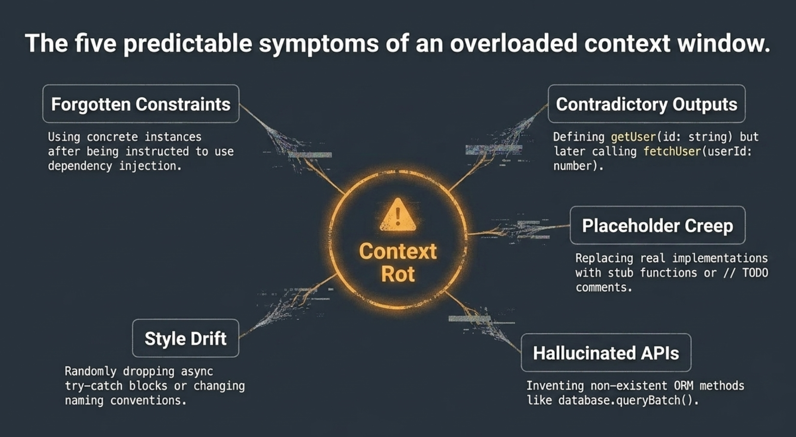

我亲眼看着一个与我配合了 60 分钟的智能体突然凭空发明了一个不存在的方法，因为它的原始规格已经被埋在一个 300K token 的上下文中。感觉二十五分钟的工作就这样白费了。

2025 年末至 2026 年初的一项关于上下文纪律与性能相关性的独立研究发现：Llama-3.1–70B 这样的高容量模型即使面对 15,000 词的无关上下文，也能将精度保持在 97.5% 到 98.5% 之间——但代价极高：70B 模型的延迟增加了 719%。该研究确认了"内存墙"（memory wall）是主要瓶颈，KV 缓存（KV cache）的增长导致处理时间呈非线性的二次方扩展。即使准确率保持住了，处理臃肿上下文的计算开销也会让长时会话的效率大幅下降。

## 一个实用的上下文预算计算

为了让上下文腐化更直观，以一个在 200K token 模型上构建中等复杂度功能的典型智能体编码会话为例：

- 大约 25 轮交互后，即使单次提示并不庞大，也很容易突破 50% 的上下文使用量。
- 到那时，你的早期约束（编码规范、架构规则、仓储模式）已落入"失落的中间"区域，注意力开始减弱。
- 你也许还剩很多 token，但遵循指令的质量已经在下滑。

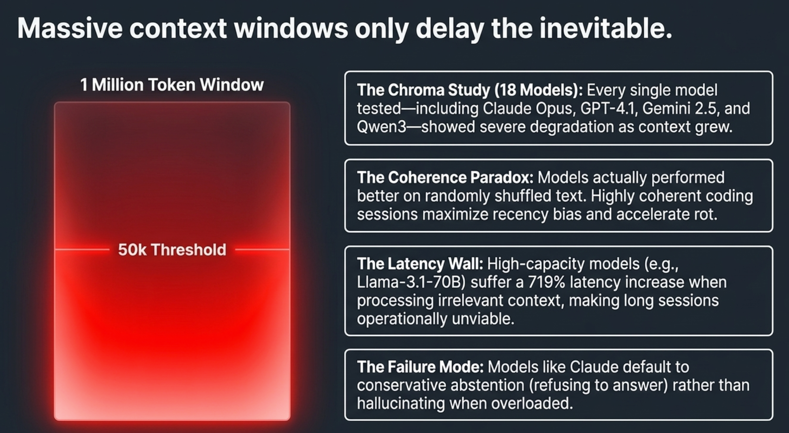

*这些数字是基于 2025–2026 年典型智能体编码会话的示意性数据，实际 token 数量因模型和实现而异。*

这就是"换个更大的上下文窗口"为何无法解决问题的原因。即使有 200K token，一个中等复杂度的任务也会在不到 30 分钟的主动工作中越过退化阈值。

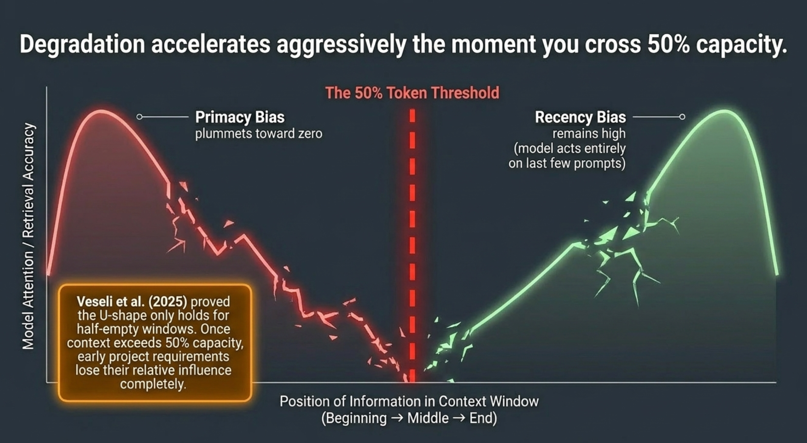

## 为什么更大的上下文窗口不能解决问题

当模型厂商宣布 200K、1M 甚至 10M token 的上下文窗口时，许多开发者以为问题已经解决了。事实并非如此。一个拥有 200K token 窗口的模型，可能在用到 50K token 时就开始退化。窗口更大了，但腐化依然会到来。

上下文腐化不是容量问题，而是架构问题。2025 年，MIT CSAIL 的研究人员从 transformer 架构本身找到了根源：注意力机制中的因果遮蔽（causal masking）意味着每个 token 只能关注它之前的 token。随着序列增长，早期 token 的注意力信号被稀释到越来越多的位置中。多尺度位置编码（Multi-scale Positional Encoding，Ms-PoE）和注意力校准（attention calibration）等技术可以减轻这种偏差，但截至 2026 年，还没有任何生产模型完全消除位置偏差（positional bias）。

更大的窗口推迟了上下文腐化的发生，但不能阻止它。

## GSD 的激进原子化方案

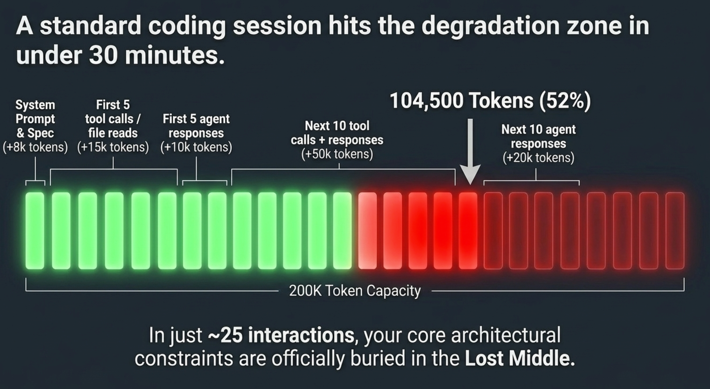

GSD（Get Stuff Done）在所有智能体框架中采取了对抗上下文腐化最激进的方案。GSD 不去尝试管理一个不断增长的上下文窗口，而是彻底消除这个问题——给每个任务分配独立的全新上下文。

### 每个任务都有全新上下文

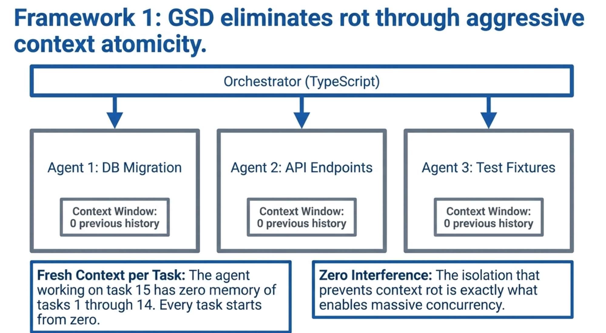

在 GSD 的架构中，编排器（orchestrator，作为一个控制智能体会话的 TypeScript 应用运行）将工作分解为独立单元。每个工作单元由一个全新的智能体会话在干净的上下文窗口中执行。智能体不继承前一个任务的对话历史，也不随时间累积上下文。每个任务都从零开始。

这是一个激进的设计选择。处理第 15 个任务的智能体对第 1 到第 14 个任务中发生的事情一无所知——它无法记住之前发现的某个巧妙解法，也无法回想关于架构权衡的讨论。每个任务都是隔离的。

### 波次并行（wave-based parallelism）

GSD 将这种隔离模型进一步延伸到波次并行。多个智能体会话同时运行，处理独立任务，每个都有自己的全新上下文窗口。一个波次可能有三个智能体并行工作：一个实现数据库迁移，一个编写 API 端点，一个生成测试数据。它们之间不共享任何上下文。

```
Wave 1: [Agent A: DB Migration] [Agent B: API Routes] [Agent C: Test Fixtures]
         |                        |                      |
         Fresh context            Fresh context           Fresh context

Wave 2: [Agent D: Integration]  [Agent E: Validation]
         |                        |
         Fresh context            Fresh contex
```

这种并行性之所以可行，正是因为每个智能体都是隔离运行的。如果它们共享上下文窗口，就会互相干扰。防止上下文腐化的隔离机制，同时也实现了并发。

### GSD 的持久化记忆系统

全新上下文隔离的明显问题是知识丢失。如果每个智能体都以空白上下文窗口启动，它如何知道项目是什么、已经构建了什么、应该遵循哪些约束？

GSD 通过我称之为"记忆即架构（memory as architecture）"的系统来解决这个问题：一套磁盘上的 Markdown 文件，充当项目的外部记忆。

**外部记忆的三大支柱**

- `PROJECT.md` 存储项目规格、架构决策、技术选型和编码规范。它在项目设置时写好，随重大决策变化而更新。
- `ROADMAP.md` 定义工作推进的顺序——将项目分解为阶段、里程碑和任务，提供"下一步做什么"的地图。
- `STATE.md` 追踪项目的当前状态：哪些任务已完成，哪些正在进行，存在哪些阻塞。`STATE.md` 是随每个完成任务而变化的活文档。

当 GSD 为新任务启动一个全新的智能体会话时，它从这些文件加上该任务专属的 `PLAN.md` 中组装出一个聚焦的上下文窗口。智能体读取 `PROJECT.md` 了解项目，读取 `ROADMAP.md` 了解当前任务的位置，读取 `STATE.md` 了解当前进度，读取 `PLAN.md` 了解它需要完成的具体工作。

与其依赖聊天记录充当"记忆"，GSD 使用一套简单的外部记忆模式：

- `PROJECT.md`（架构 + 规范）
- `ROADMAP.md`（下一步计划）
- `STATE.md`（当前真实状态）
- `PLAN.md`（任务专属指令）

每个全新的智能体会话只从这些文件中读取它所需要的内容，核心约束永远不会被埋进上下文中段。

### 记忆即架构 vs. 记忆即上下文

这一区分至关重要。传统 AI 交互将记忆视为上下文（memory as context）：模型需要记住的一切都被塞进对话窗口，随着对话增长，记忆不断退化。

GSD 将记忆视为架构（memory as architecture）：知识被存储在磁盘上的结构化文件中，按需读取，永远不受位置偏差或注意力稀释的影响。文件不会随时间退化。`PROJECT.md` 在第 100 个任务时的可读性与第 1 个任务时完全相同。

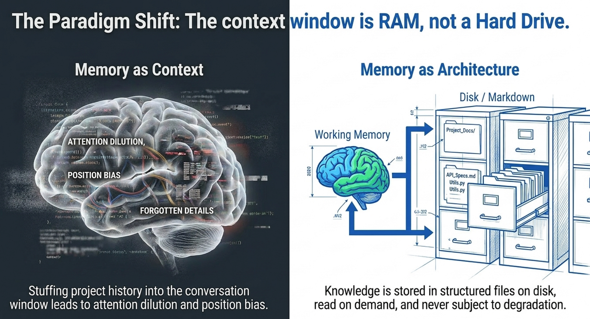

智能体之间的通信完全通过文件进行。如果 Agent A 发现了 Agent B 需要知道的信息，Agent A 将其写入磁盘（通常是更新 `STATE.md` 或共享的笔记文件），Agent B 启动时读取它。没有共享上下文窗口，没有通过模型传递的消息——文件系统就是消息总线。

### 故障恢复与弹性

GSD 基于文件的记忆系统还提供崩溃恢复能力。一个锁文件追踪当前工作单元。如果一个会话因模型超时、网络故障或达到上下文限制而中断，下一次执行 `/gsd auto` 命令时，系统会读取存活的会话文件，从每个已落盘的工具调用中合成恢复简报，并以完整上下文恢复工作。没有东西会丢失，因为没有任何东西是仅存储在上下文窗口中的。

这是一个微妙但重要的优势。仅靠上下文的记忆是易失的——会话崩溃，记忆消失。基于文件的记忆是持久的——项目状态能在任何单次会话故障中存活下来。

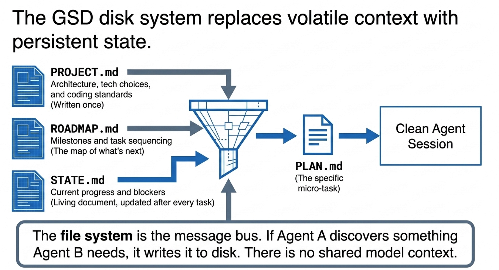

## Superpowers 的微任务策略

GSD 通过架构隔离来解决上下文腐化，Superpowers 框架则通过时间约束来解决——确保没有任何任务运行足够长的时间，使上下文腐化成为问题因素。

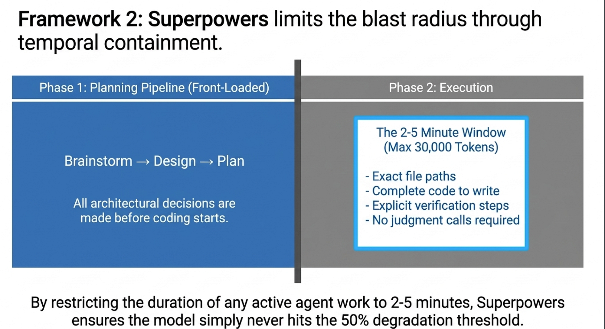

### 2–5 分钟任务窗口

正如我们在第 3 篇文章中探讨的，Superpowers 将所有工作分解为设计用时 2–5 分钟的任务。这并非随意为之。在 2–5 分钟的主动智能体工作时间内，现代编码智能体通常只会消耗 10,000 到 30,000 个 token 的上下文，远低于研究所识别的退化阈值。

每个任务都包含：

- 要修改的精确文件路径
- 要写入或更改的完整代码
- 明确的验证步骤（要运行的测试、要通过的检查）
- 无需智能体自行判断的歧义性内容

实现计划的设计目标，用 Jesse Vincent 的话说，是"一个热情但品味糟糕、判断力差、没有项目背景、且对测试有抵触的初级工程师"也能照着执行。这种程度的详细规定意味着每个子智能体（subagent）只需要极少的上下文就能完成工作。

### 前置决策（front-loading decisions）

让微任务奏效的关键，是将所有决策前置到规划阶段。Superpowers 强制执行严格的流程：先头脑风暴，再设计，再规划，再执行。子智能体收到任务时，每个架构决策都已经做好了。子智能体不需要理解完整的项目上下文，不需要权衡利弊——只需要执行指令。

这就是 Superpowers 能够在不偏离计划的情况下自主运行数小时的原因。每个单独的任务都足够简单，上下文腐化没有时间发生；而规划阶段已经做出了所有需要深度上下文理解的决策。

### 子智能体隔离

与 GSD 一样，Superpowers 为每个任务分配一个全新的专门子智能体。子智能体只接收它所需要的上下文：任务描述、相关文件路径和任何前置条件。它不继承父智能体的完整对话历史。即使编排智能体的上下文在增长，实际的代码编写工作也在干净、隔离的会话中完成。

## 其他上下文管理方案

GSD 和 Superpowers 代表了谱系的两端，其他框架也各自发展出了应对上下文退化的策略。

以下是一个便于查阅的对比表：

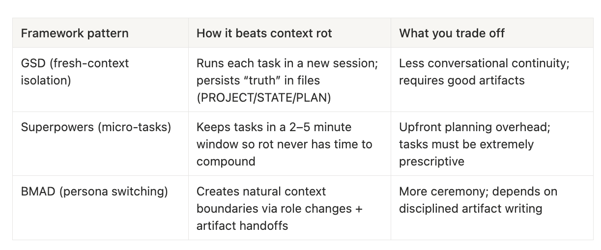

### BMAD 的角色切换（persona switching）

BMAD 方法（Breakthrough Method for Agile AI-Driven Development，敏捷 AI 驱动开发突破方法）采取了一种组织化的上下文管理方式。BMAD 并非隔离单个任务，而是围绕角色切换来组织整个开发生命周期。

BMAD 定义了若干专门角色：分析师（Analyst）、架构师（Architect）、开发者（Developer）、质量保证（QA）和项目经理（Project Manager）。每个角色都被定义为一个"Agent-as-Code" Markdown 文件，其中规定了专业领域、职责、约束和预期输出。当你从架构师角色切换到开发者角色时，你实际上是在以一套新的优先级和约束重置上下文。

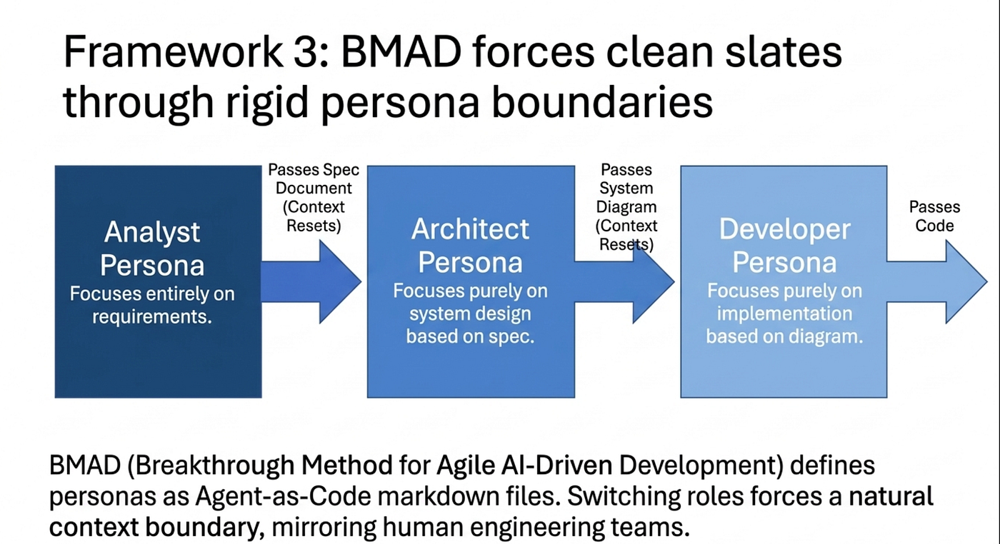

角色切换的核心洞见在于：它创造了自然的上下文边界。架构师不需要记住开发者写的每一行代码；QA 角色不需要完整的架构讨论。每个角色获得与其职责相关的聚焦上下文，以制品（文档、图表、规格）作为角色间的交接媒介。这与人类开发团队的运作方式相似：每个角色携带专业知识，而不是整个项目历史。

### 上下文压缩与摘要

一些框架和工具使用自动化的上下文压缩（context compression）：定期对对话历史进行摘要，用压缩版本替换完整的聊天记录。例如，Claude Code 使用一种 auto-compact 功能，当上下文使用量超过阈值时触发，在保留关键信息的同时对对话进行压缩。

其代价是信息损失。每次压缩都会丢失一些细微之处、一些细节、一些以后可能重要的约束。这是一种有损过程，而它作用的领域（软件规格）恰恰需要精确性。上下文压缩赢得了时间，但没有消除根本问题——更像是治标而非治本。

### Model Context Protocol（MCP）作为外部记忆

Model Context Protocol（MCP，模型上下文协议）由 Anthropic 于 2024 年末推出，现已被业界广泛采用（包括 OpenAI 和 Google）。它为 AI 智能体提供了与外部工具和数据源交互的标准化方式。虽然 MCP 的范围超出了纯粹的记忆管理，但它支持一种强大的模式：将外部系统用作持久化记忆。

通过 MCP，智能体可以将中间结果写入数据库、将上下文存储到暂存服务，或从知识库中检索项目信息——全部通过标准化协议实现。这实际上将智能体的记忆扩展到了其上下文窗口之外。智能体不需要记住一切，它只需要知道去哪里查找。

MCP 将智能体与记忆的关系从"把所有东西装进脑子里"转变为"知道去哪里找"。这与 GSD 基于文件的记忆做出了同样的哲学转变，但将其推广到了任意外部系统。通过外部持久化实现有状态交互，MCP 使智能体能够将上下文存储到外部仓库并在之后检索，在多轮对话乃至跨会话之间维持信息。

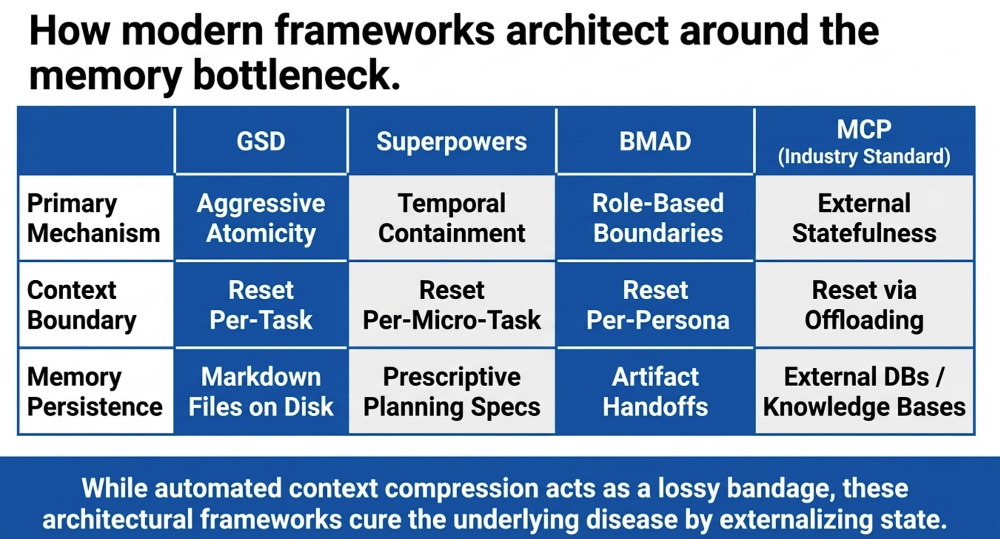

## 实践建议

基于上述研究和生产框架中涌现的模式，以下是降低自身智能体工作流中上下文腐化的具体策略。

### 1. 激进地分解任务

将工作分解为尽可能小的单元。如果一个任务需要智能体持续工作超过 5–10 分钟，那它就太大了。任务越小，上下文累积越少，退化越少。

### 2. 使用基于文件的记忆

不要依赖对话历史作为真实来源。将项目规格、架构决策、编码规范和当前状态存储在磁盘文件中。让智能体在每次会话开始时读取这些文件，而不是依赖对话上下文。GSD 的 `PROJECT.md`、`ROADMAP.md` 和 `STATE.md` 模式是一个经过验证的模板，可以适配到任何工作流。

### 3. 前置决策

在编码开始前做出架构决策。规划阶段能做出的决策越多，每个实现智能体需要进行的推理越少，它需要携带的上下文也越少。

### 4. 监控上下文使用量

关注你的模型上下文窗口被消耗了多少。大多数框架都提供这一信息。当你超过 50% 容量时，考虑启动一个全新会话或压缩上下文。研究已经表明：退化在过了半程之后会加速。

### 5. 为全新启动设计

将你的工作流结构化，使任何智能体都能仅凭项目文件中的信息完成任何任务。如果一个智能体需要读取完整对话历史才能理解该做什么，说明你的记忆架构存在缺口。

### 6. 优先选择隔离而非共享

当多个任务可以并行运行时，给每个任务分配独立的智能体会话。共享上下文窗口带来共同的退化，隔离的会话保持干净。

### 7. 在边界处测试

上下文腐化会产生微妙的错误。在智能体工作流中，自动化测试变得尤为关键。每完成一个任务就运行测试，而不是等到会话结束。及早发现上下文腐化引发的错误，可以阻止它们传播到下游任务。

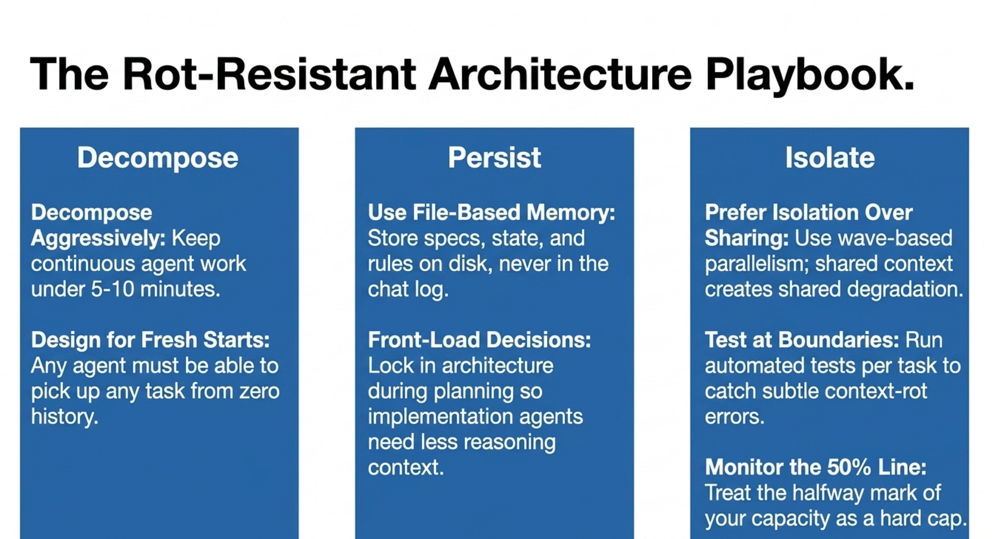

## 未来展望

上下文腐化不会消失。在 transformer 架构从根本上改变处理长序列的方式之前，每个 LLM 都会随着上下文窗口填满而退化。产出最佳结果的框架，不是那些忽视这一限制的框架，而是那些从设计层面绕开它的框架。

GSD 的激进方案给每个任务一个全新的上下文，并以文件作为外部记忆，以牺牲对话连续性为代价彻底消除上下文腐化。Superpowers 的微任务策略将任务保持得足够小，使腐化没有时间形成。BMAD 的角色切换创造出与开发阶段对齐的自然上下文边界。MCP 为智能体将记忆卸载到外部系统提供了基础设施。

所有这些方案有一个共同的核心洞见：上下文窗口不是可靠的长期记忆。把它当作工作记忆来用——保持聚焦，保持新鲜，把重要的东西存到模型不会遗忘的地方。

截至 2026 年 4 月，KV 缓存优化和 MCP 工具链都在持续改进，但 transformer 位置偏差的架构层面限制——以及本文描述的框架级解决方案——仍然是不可或缺的。

---

如果你觉得本文有价值，点击关注并开启通知——第 5 篇文章即将发布，我将分享我用来保持智能体敏锐的模板和检查清单。

欢迎在评论区写下你遇到过的最糟糕的上下文腐化惨案，我会认真阅读每一条。

本系列的前一篇文章探讨了目标反向验证（goal-backward verification），以及框架如何确保 AI 智能体不只是产出输出，而是产出正确的输出，即使在自主运行较长时间时也是如此。

这是关于智能体软件工程五部曲的第 4 篇。前几篇文章分别涵盖了 GSD 的规格驱动开发、框架对比，以及 Superpowers 的可组合技能流水线。

## 参考文献

- Liu, N. F., Lin, K., Hewitt, J., Paranjape, A., Bevilacqua, M., Petroni, F., & Liang, P. (2024). "Lost in the Middle: How Language Models Use Long Contexts." *Transactions of the Association for Computational Linguistics*, 12, 157–173.（原稿于 2023 年 7 月发布至 arXiv。）
- Veseli, B., et al. (2025). "Positional Biases Shift as Inputs Approach Context Window Limits." arXiv:2508.07479 (COLM 2025).
- Chroma Research. (2025). "Context Window Degradation Across 18 Production Language Models." Technical report.
- MIT CSAIL researchers. (2025). Papers on causal masking and adaptive positional encodings (e.g., PaTH Attention).


## 关于作者

Rick Hightower 曾任某世界 500 强企业高级杰出工程师（Senior Distinguished Engineer），专注于将机器学习/AI 洞见应用于前线业务，同时也是一名构建多智能体生产系统的实践者。欢迎在 Medium 上关注他，获取更多动手实践的智能体工程内容。


他创建了 skilz——通用智能体技能安装器，支持 30 多种编码智能体，包括 Claude Code、Gemini、Copilot 和 Cursor，并联合创办了全球最大的智能体技能市场。欢迎通过 LinkedIn 或 Medium 与 Rick Hightower 联系，也可访问 SpillWave，获取 AI 专业知识。

Rick 多年来一直在积极开发生成式 AI 系统、智能体和智能体工作流，是众多智能体框架和开发工具的作者，为希望采用 AI 的团队带来深厚的实践专业知识。他喜欢用第三人称介绍自己。

Rick 还写了一个 Claude Certified Architect（CCA）系列文章，其中包含大量关于编写智能体 AI 系统的实用信息。如果你想提升构建行为良好的 AI 智能体的能力，备考 CCA 考试是个不错的起点。

**CCA 备考系列**

- Claude Certified Architect：CCA Foundations 考试完全通关指南
- CCA 备考：掌握 Claude Code 代码生成场景
- CCA 备考：掌握多智能体研究系统场景
- CCA 备考：结构化数据提取
- CCA：掌握开发者生产力场景
- Claude Certified Architect：掌握 CI/CD 场景
- CCA 备考：掌握客户支持解决方案智能体场景

Rick 还写了一系列关于 harness 工程的文章，探讨如何通过 harness 工程利用反馈循环和对抗性智能体来改进智能体系统。

**Harness 工程系列文章**

- 9 美元的灾难：Anthropic 的 Harness 设计论文教会我们什么是自主 AI
- Harness 工程 vs. 上下文工程：模型是 CPU，Harness 是 OS
- LangChain 深度智能体：Harness 与上下文工程——记忆、技能与安全
- 走出 AI 编码宿醉：Harness 工程如何预防下一次故障
- LangChain 的 Harness 工程：从 Terminal Bench 2.0 前 30 晋升前 5
- Anthropic 的 Harness 工程：两个智能体，一个功能列表，零上下文溢出
- OpenAI 的 Harness 工程实验：零手写代码
