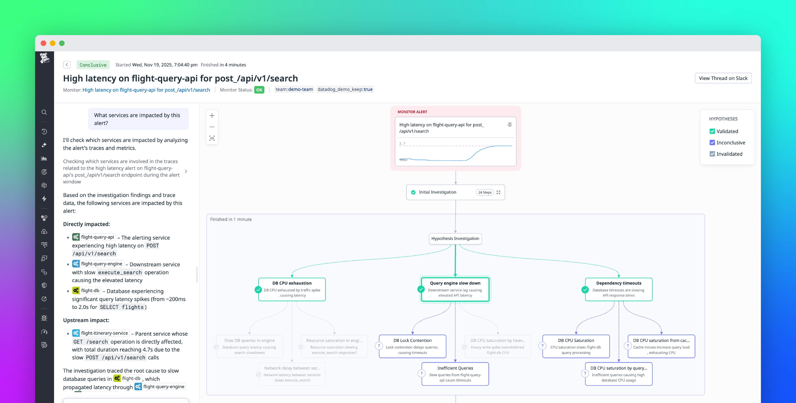
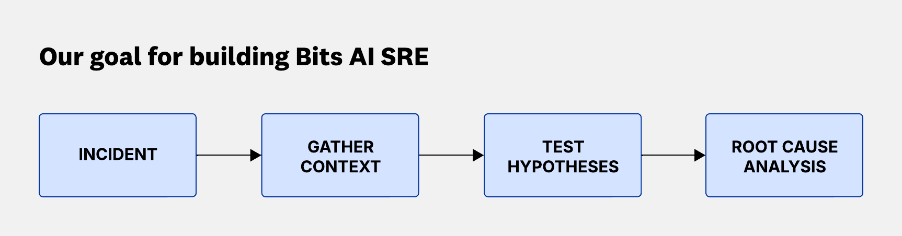
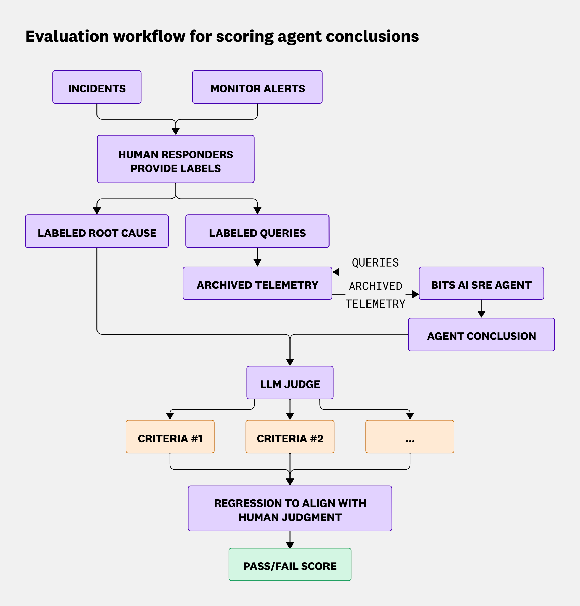
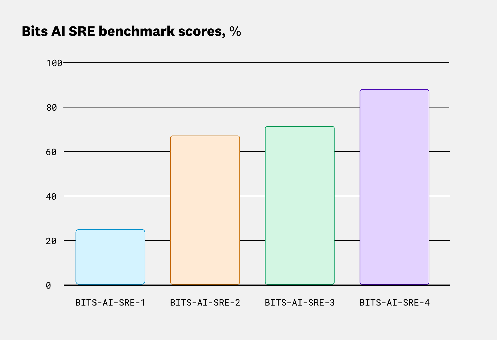
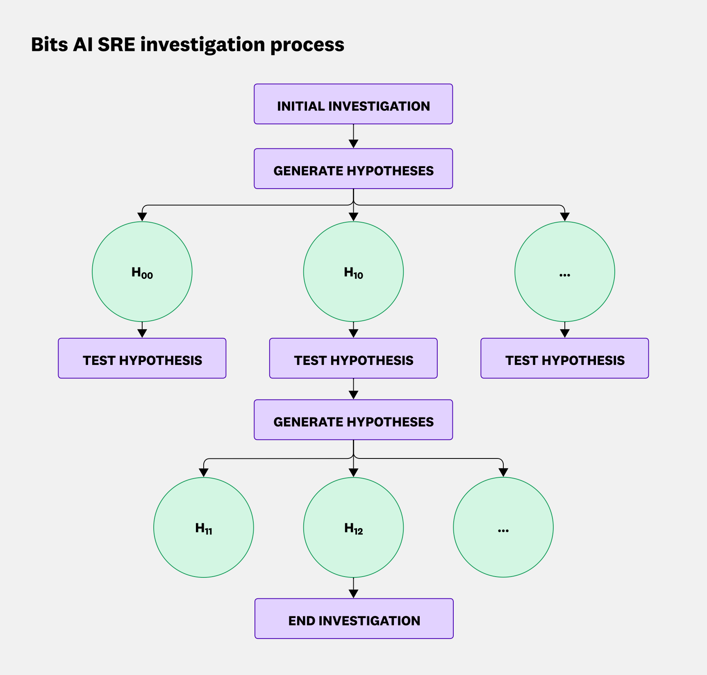
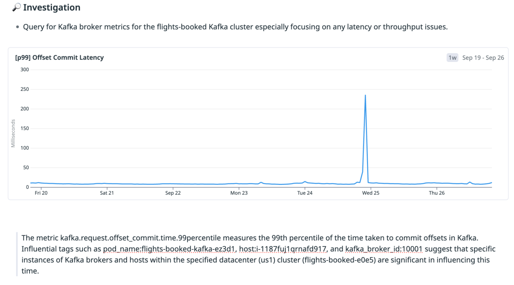
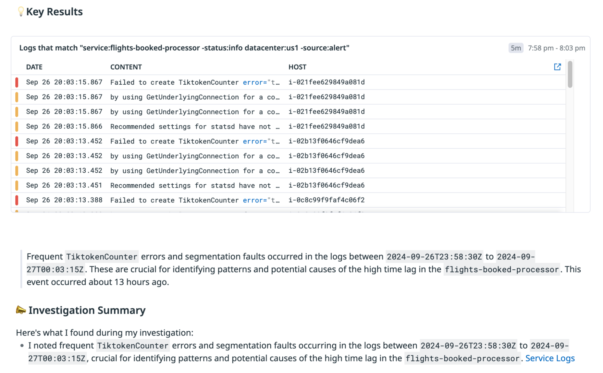
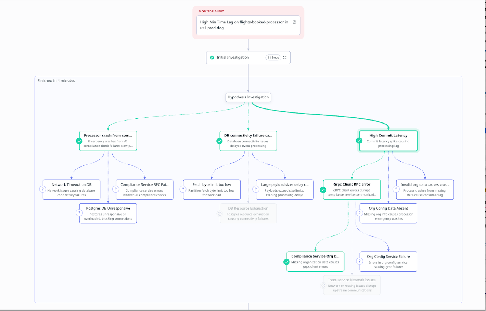
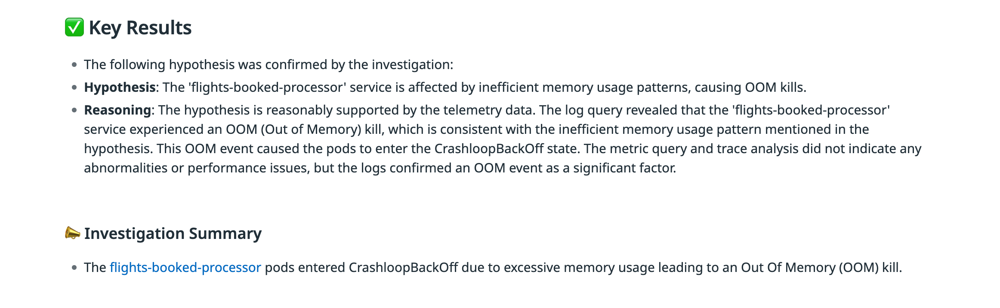
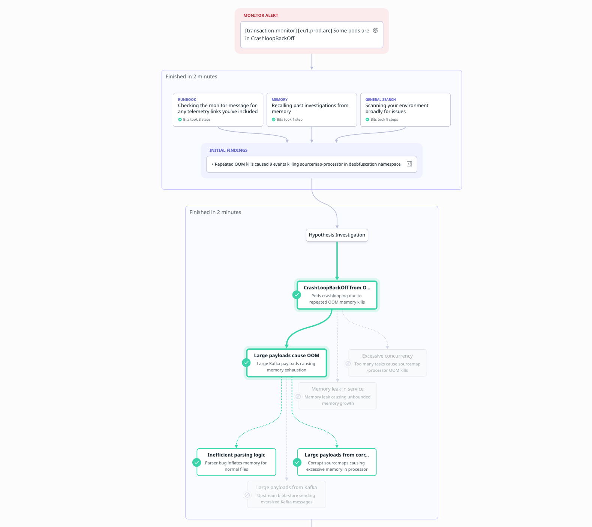

> 作者：Daniel Shan, Tristan Ratchford
> 发布日期：2026 年 1 月 12 日
> 原文链接：https://www.datadoghq.com/blog/building-bits-ai-sre/

# 我们如何构建一个能像工程师团队一样排查问题的 AI SRE agent

我们构建了 [Bits AI SRE](https://www.datadoghq.com/blog/bits-ai-sre/)，帮助工程师排查和解决生产故障——这是当今运行分布式系统中最困难的事情之一。随着环境变得越来越动态和复杂，问题的解决难度也在持续上升：故障会跨越更多服务，伴随更多噪声信号，涉及更大体量的遥测数据（telemetry data），让值班工程师很难迅速定位根因（root cause）。如今，Bits AI SRE 已经帮助多个团队将故障解决时间缩短了最高 95%。

Bits AI SRE 是我们推出的新型 agent，能自主分析复杂的遥测数据，自动排查故障和监控告警（monitor alert），并在数分钟内生成可审计的根因分析报告。在底层逻辑上，它模仿了人类站点可靠性工程师（SRE，Site Reliability Engineer）的思维方式：提出假设（hypothesis），用线上遥测数据加以验证，沿着最有价值的线索追溯到根因。

本文将介绍我们如何用真实数据评估 Bits AI SRE、分享性能测评结果，并重点解析该 agent 的设计思路。

### 以真实故障为基准进行测评

用真实故障来评估，是构建有效 AI SRE agent 的基础，也是关键所在。这是衡量实质性进步、确保 agent 能应对真实生产环境复杂性的最可靠方式。凭借业界规模最大的生产遥测数据集，Datadog 具备独特优势来做好这件事。

我们与 Datadog 内部数百个团队合作，收集并标注了真实故障案例，构建了一套基准测试（benchmark）数据集。评估流程如下：由人工应急响应者标注故障案例，将归档的遥测数据输入 Bits AI SRE agent，再由 LLM 裁判按多维标准对 agent 的结论打分，最终将分数与人工判断对齐，生成通过/未通过的结论。

我们用这套基准持续衡量 agent 的性能，并不断迭代改进。过去一年，agent 的能力已显著提升，随着持续投入，我们预期它还会更上一层楼。

### 像人一样排查，而不是摘要引擎

Bits AI SRE 的排查方式，就像一支 SRE 团队在进行值班排查。它不是简单地将所有原始遥测数据一次性汇总，而是像人一样逐步展开调查：

- 提出关于根因的假设
- 通过有针对性的数据查询验证或排除假设
- 重复以上过程，直至找到根因

这种方式能大幅减少干扰 agent 得出正确结论的噪声，同时让 agent 能够顺着证据的走向进行深度、有洞察力的排查。

### 聚焦因果关系，而非噪声

早期的 SRE agent 通过增加跨平台的工具调用数量来扩大覆盖范围，并用 LLM 对所有响应进行汇总。然而这种方式存在一个明显短板：工具调用数量的增加会导致汇总提示词的输入 token 数线性增长。这意味着引入更多遥测数据反而会降低模型性能，甚至超出上下文窗口（context window）的限制。

在下面这个故障案例中，Kafka 消息积压（lag）是由提交延迟（commit latency）的峰值引起的。早期版本的 Bits AI SRE 共发起了 12 次工具调用，覆盖了日志、链路追踪和指标数据。其中一次调用确实准确定位了根因，但由于其他工具的响应中包含上游服务的严重应用错误等可疑信号，汇总提示词最终给出了错误的根因结论。

最新版本的 Bits AI SRE 能够正确将提交延迟识别为根因，因为它聚焦于监控告警与特定遥测数据之间的因果关系，而不是一次性分析所有可用的遥测数据。

### 对多组件问题进行深度排查

在复杂故障中，根因可能跨越多个系统，或需要多个步骤才能找到。定位多组件根因，要求模型能够将多个独立信号关联起来。

Bits AI SRE 在排查时会将复杂假设拆解为子假设（sub-hypothesis）。当子假设得到证据支撑时，agent 会继续深挖；若不支撑，则转向其他方向——正如人类 SRE 跟踪最有价值的线索一样。

在下面这个故障案例中，agent 收到了 Pod 进入 CrashLoopBackOff 状态的告警。早期版本的 Bits AI SRE 给出的结论是：Pod 因内存不足（Out Of Memory，OOM）被强制终止，触发了告警。

这个答案表面上是正确的，但最新版本的 Bits AI SRE 更进一步：它发现 OOM 是由大量异常超大的 Kafka payload 涌入引起的，这导致单个 Pod 崩溃，进而触发了告警。新版 agent 会递归生成更深层的根因假设，直到穷尽搜索空间，从而实现更深入、更有洞察力的告警排查。

### Bits AI SRE 的下一步

过去一年，我们深刻体会到：解决真实 SRE 问题，前提是要有一套扎根于真实生产数据的健壮评估框架。我们相信，这是确保 agent 能可靠解决日常问题的最佳路径，而能否有效利用生产数据，将是决定谁能构建最强 SRE agent 的关键因素。

自主 SRE agent 的可能性，我们才刚刚开始探索。Bits AI SRE 已经收到了客户的大量正向反馈——他们观察到复杂故障的根因定位时间明显缩短，而产品本身还在持续进化。

我们正在积极拓展 Bits AI SRE 的覆盖范围，涵盖更多真实场景和数据源。同时，我们还在将它与 Datadog 平台上其他正在构建的专业排查 agent 和优化 agent 深度集成，使 Bits AI SRE 能够驱动端到端的全流程故障解决工作流（end-to-end resolution workflow）。

立即体验 [Bits AI SRE](https://app.datadoghq.com/bits-ai/investigations)。如果你还没有 Datadog 账号，可以注册 14 天免费试用。
