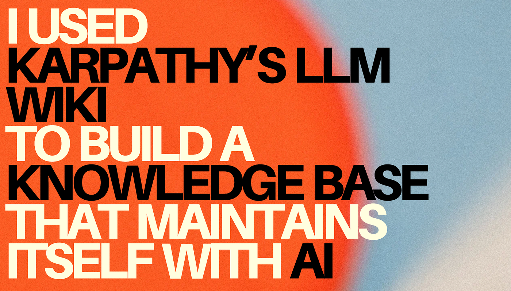
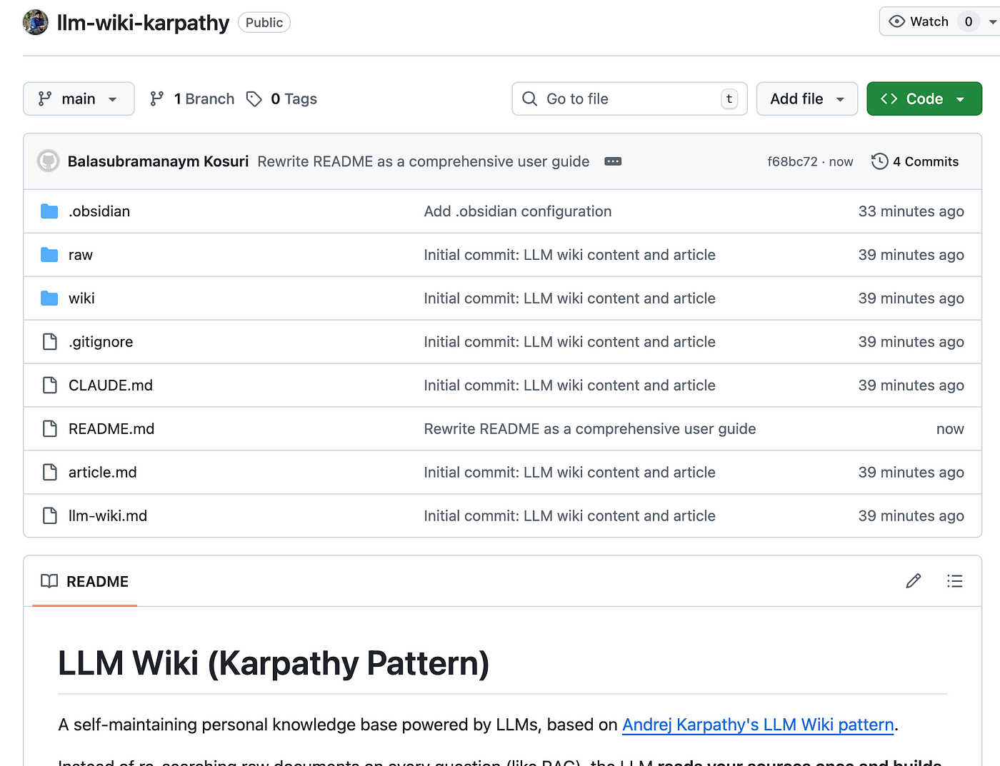
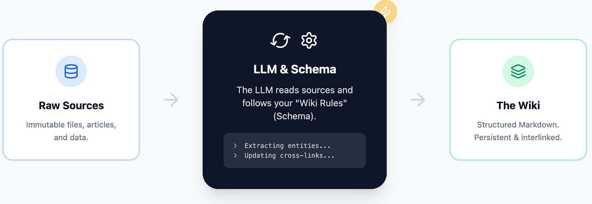
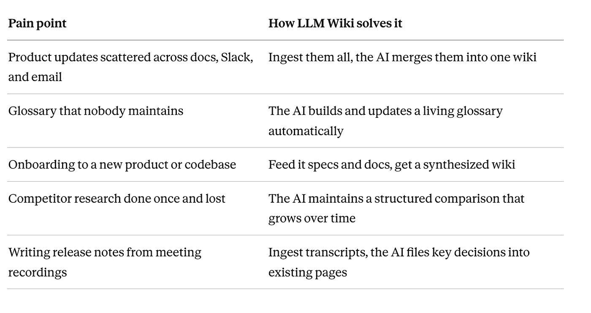

> 作者：Balu Kosuri
> 发布日期：2026 年 4 月 7 日
> 原文链接：https://medium.com/@k.balu124/i-used-karpathys-llm-wiki-to-build-a-knowledge-base-that-maintains-itself-with-ai-df968e4f5ea0

# 用 Karpathy 的 LLM Wiki 搭建一个能自我维护的知识库

这是大多数知识工作者都熟悉的场景。

你有 15 份关于某个项目的文档：这里是一份产品规格，那里是一段会议记录，竞品分析报告就压在下载文件夹的某个角落。三个月后，有人问你一个简单的问题，你却要花一个小时翻遍文件夹，只为找到那段你曾经读过的话。

文档是有的，知识也在里面。问题是这些知识散乱、割裂，不翻出原始文件根本没法检索。

我找到了一个解法，用到三样东西：Andrej Karpathy 的一页纸构想文档、一个叫 Cursor 的 AI 代码编辑器，以及一个免费的笔记应用 Obsidian。大约 30 分钟后，我从那一页构想出发，搭出了一个完整运行的个人知识库，可以把任意文档转化为结构化、相互关联的 wiki 页面。

而我自己没有手写过一个 wiki 页面。

这篇文章记录了整个过程，并附上了一个可以直接 clone 的仓库供你上手使用。



---

## 快速开始



仓库链接：https://github.com/balukosuri/llm-wiki-karpathy

仓库内包含：

- Karpathy 的原版 `llm-wiki.md` 构想文档
- 一份针对技术写作者定制的 `CLAUDE.md` schema（可按自己的领域修改）
- 预配置好的 Obsidian vault 设置（图谱视图、快捷键、侧边栏）
- 一个空的 `raw/` 文件夹，等待你放入第一份原始文档
- 一个 `wiki/` 文件夹，包含四个起始页面（index、log、overview、glossary）

放入第一份文档，说一句"ingest"，看着 wiki 自己写起来。

---

## Andrej Karpathy 是谁


Andrej Karpathy 是 AI 领域最知名的人物之一。他是 OpenAI 的创始成员，曾在 Tesla 领导 AI 与自动驾驶视觉团队，以善于将深度技术思想讲得浅显易懂著称。Karpathy 一旦分享什么，整个 AI 社区都会关注。

几天前，他分享了一份短文档，叫做 `llm-wiki.md`。这不是一个产品，也不是一个应用，只是一个构想——用 Markdown 写成，描述了一种用 AI agent 构建和维护个人知识库的模式。

这份文档设计为可以直接复制粘贴到任意 AI agent（Claude、ChatGPT、Codex 等）中。agent 读取之后，理解这套模式，然后根据你的需求构建出一个具体实现。

**原文链接：**[Karpathy's llm-wiki.md](https://gist.github.com/karpathy/442a6bf555914893e9891c11519de94f)

这一页纸的构想，是整个仓库的基础。

---

## LLM Wiki 是什么，如何运作



核心思路很简单。

**大多数 AI 工具的工作方式是这样的：** 你上传文档，提出问题，AI 在你的文件中检索，生成答案。这种方式没什么问题，但 AI 在每次会话结束后就会"遗忘"。下次再提问，它从头开始：重新读取、重新检索、重新推导答案。没有任何东西被保存下来，也没有积累。

**LLM Wiki 把这个逻辑翻转了。** 它不是每次都在原始文档里检索，而是让 AI 只读一次文档，然后从中构建出一个结构化的 wiki。这个 wiki 是一组 Markdown 文件，包含摘要页、产品页、概念页、人物页、对比表格，彼此通过 wiki 样式的链接相互关联。当你新增一份文档时，AI 不会重头来过，而是读取新内容，更新已有的 wiki 页面，在需要的地方新建页面，标记矛盾之处，并保持整体一致。

wiki 是持久积累的产物，会随时间不断丰富。喂入的原始资料越多，知识库就越充实、联系越紧密。

---

### 三层结构

LLM Wiki 由三个部分组成：

1. **原始资料（raw sources）** — 一个叫 `raw/` 的文件夹。把你的文档放在这里——PDF、Markdown 文件、剪藏的文章、会议记录。AI 从这里读取，但从不修改。你的原件保持原样。

2. **wiki** — 一个叫 `wiki/` 的文件夹。AI 创建并维护这个文件夹里的一切：建立页面、维护交叉引用、更新词汇表、维护索引。你负责浏览，AI 负责写作。

3. **schema（模式文件）** — 一个叫 `CLAUDE.md` 的单一文件。这是给 AI 的使用说明：定义了存在哪些类型的页面、处理新资料时遵循什么工作流程、页面如何格式化、何时对 wiki 进行健康检查。可以把它理解为一套规则手册，把通用 AI 变成一个专注的 wiki 维护者。

---

## 三种操作

**Ingest（摄入）：** 把一份文档放进 `raw/`，告诉 AI 去处理它。AI 读取文档，创建摘要页，更新 wiki 中的实体页，在词汇表中补充新术语，更新索引，并记录操作日志。一份原始资料可能影响 10 到 15 个 wiki 页面。

**Query（查询）：** 你提问，AI 读取 wiki（而不是原始文件）来整合答案。好的答案可以保存回 wiki，成为分析页面，于是你的每次提问都让知识库变得更丰富。

**Lint（检查）：** 让 AI 对 wiki 做一次健康检查。它会找出矛盾之处、被新资料推翻的过时内容、没有任何链接指向的孤儿页面，以及尚缺对应页面的重要概念。可以把它理解为知识库的拼写检查。

---

## 用三条 prompt 在 Cursor 中完成构建



下面是具体发生的事。我打开 Cursor（一个 AI 驱动的代码编辑器），把 Karpathy 的 `llm-wiki.md` 文件放进一个空白项目文件夹，然后开始和 AI 对话。

### Prompt 1："这是什么？作为技术写作者，我能怎么用它？"

Cursor 读完整份文档，把这个构想对应到我的工作场景：

| 痛点 | LLM Wiki 的解法 |
|---|---|
| 产品更新分散在文档、Slack 和邮件里 | 全部摄入，AI 合并成一个 wiki |
| 没人维护的词汇表 | AI 自动构建并持续更新活词汇表 |
| 接手新产品或代码库时的上手成本 | 喂入规格和文档，得到一份综合 wiki |
| 竞品调研做完就沉了 | AI 维护一份会持续成长的结构化对比 |
| 从会议记录写发布说明 | 摄入会议记录，AI 把关键决策归档到已有页面 |

### Prompt 2："能帮我制定计划并创建吗？"

五个字。Cursor 一次性规划并构建了整个项目：

- 创建了 `raw/` 和 `wiki/` 文件夹
- 写好了 `CLAUDE.md`，包含实体类型、页面格式、9 步摄入工作流、查询工作流、Lint 工作流、以及每次会话的启动检查清单
- 创建了四个起始 wiki 页面：`index.md`、`log.md`、`overview.md`、`glossary.md`

### Prompt 3："帮我配置好 Obsidian"

Cursor 通过 Homebrew 安装了 Obsidian，并预配置好了 vault：

- 新文件默认保存到 `wiki/`
- 图谱视图按页面类型着色
- 配置了图谱视图、搜索、快速切换的键盘快捷键
- 启动时打开 overview 页面

两个窗口并排：左边是 Cursor，用来和 AI 对话；右边是 Obsidian，实时浏览 wiki 的生长。

---

## Clone 后你得到什么

具体的文件结构如下：

```
project-root/
│
├── llm-wiki.md          # Karpathy 的原版构想文档
├── CLAUDE.md            # Schema — 告诉 AI wiki 如何运作
│
├── raw/                 # 你的原始文档（AI 只读，不写）
│   └── .gitkeep
│
├── wiki/                # AI 生成的知识库
│   ├── index.md         # 所有页面的主目录（空白，等待填充）
│   ├── log.md           # 发生了什么，什么时候发生的
│   ├── overview.md      # 全局综合视图（随时间演进）
│   ├── glossary.md      # 术语、定义、用词规范
│   └── sources/         # 每份原始文档对应一个摘要页
│
└── .obsidian/           # 预配置的 Obsidian vault
    ├── app.json         # 文件路径、链接行为
    ├── appearance.json  # 主题、字体大小
    ├── core-plugins.json# 启用的插件
    ├── graph.json       # 图谱视图颜色和布局
    ├── hotkeys.json     # 键盘快捷键
    └── workspace.json   # 默认标签页和侧边栏布局
```

这个结构为什么有效：

- **清晰分离。** `raw/` 是你的，`wiki/` 是 AI 的。你不在 `wiki/` 里写东西，AI 也不改动 `raw/`。
- **schema 是大脑。** `CLAUDE.md` 定义了实体类型、页面格式和工作流程。AI 先读这个文件，然后遵循其中的规则。编辑这个文件，就能改变 AI 针对你的领域的行为方式。
- **索引是地图。** 收到问题时，AI 先读 `index.md` 找到相关页面，再深入其中。不需要向量数据库（vector database）或嵌入（embedding）——索引在扩展到数百个页面之前，工作出人意料地好。
- **日志是时间线。** 每次摄入、查询、lint 都会带时间戳记录下来。你随时知道发生了什么。
- **Obsidian 已预配置好。** 任何人 clone 这个仓库，都能直接得到一个配好了图谱视图、快捷键和侧边栏布局的 Obsidian vault，无需手动配置。

---

## 如何使用这个仓库

### 第一步：Clone

```
git clone [YOUR-REPO-URL]
cd llm-wiki
```

### 第二步：在 Cursor 中打开

在 Cursor 中打开项目文件夹。AI 会自动读取 `CLAUDE.md`，理解 wiki 的结构和全部规则。

如果你使用其他 AI agent（Claude Code、Codex 等），把 `CLAUDE.md` 的内容粘贴到 agent 的上下文中即可。

### 第三步：在 Obsidian 中打开

把同一个文件夹作为 Obsidian vault 打开。如果还没有安装 Obsidian，直接告诉 Cursor："帮我配置 Obsidian。"它会自动安装并打开 vault。

所有配置已就绪——快捷键、图谱视图颜色、侧边栏布局，全都不需要再动。

### 第四步：把一份原始文档放入 `raw/`

任何文档都行：

- 产品规格或设计文档
- 会议记录
- 剪藏的网页文章（使用 Obsidian Web Clipper 浏览器扩展）
- 风格指南
- PDF 报告
- 保存为文本的邮件会话

### 第五步：说"ingest"

在 Cursor 中输入：

> *Ingest raw/my-document.pdf*

AI 会：

- 读取文档
- 和你讨论核心要点
- 在 `wiki/sources/` 下创建一个来源摘要页
- 为文档中发现的产品、功能、人物或概念新建页面
- 在词汇表中补充新术语
- 在索引中记录所有新页面
- 如果全局视图发生变化，更新 overview 页面
- 在 `wiki/log.md` 中记录所有操作，并附上时间戳

你可以实时看着页面在 Obsidian 里一一出现。

### 第六步：提问

> *我所有来源中识别出的主要风险是什么？*

AI 读取 wiki，整合答案，然后问你："要把这个保存为 wiki 页面吗？" 如果你说是，这个答案就成为 wiki 里的一个永久分析页面。你的每次提问都让知识库变得更丰富。

### 第七步：持续喂入

每新增一份来源，都在之前的基础上继续构建。overview 页面持续演进，词汇表持续增长，交叉引用不断增多。当积累了 10 到 15 份来源之后，wiki 开始向你展示此前没有注意到的联系。

### 第八步：定期 lint

每摄入 10 份来源左右：

> *Lint the wiki*

AI 会检查：

- 页面之间的矛盾
- 被新来源推翻的过时内容
- 没有任何链接指向的孤儿页面
- 已多次提及但缺少对应页面的重要概念
- 页面之间不一致的术语用法

它会报告发现的问题，并询问应用哪些修正。

---

## 适合哪些人

**技术写作者** — 每份规格更新词汇表，每次客户电话为人物页面添砖加瓦，每次竞品分析都在上次的基础上继续。

**研究人员** — 论文、文章、报告都会被归档、摘要、交叉引用。项目结束时，你手里有一个带着演进中的论点和所有关联的 wiki。

**产品经理** — 喂入 PRD、客户访谈、竞品分析、sprint 回顾。wiki 维护全局视图。

**学生** — 每个教材章节都成为一份来源，AI 建立概念页面并相互链接。考试前你有了一份彼此关联的复习指南。

**任何在积累知识的人** — 旅行规划、爱好研究、健康记录、课程笔记。只要信息来自多个来源的场景都适用。

---

## 示例：技术写作者的第一周

### 第 1 天

把三份入职文档放入 `raw/`（PRD、内部 FAQ、发布说明），逐一摄入。AI 创建产品页面、人物页面、词汇表，并标出文档之间的矛盾。当天结束：8 到 10 个 wiki 页面，一个没有手写。

### 第 2 天

录制工程师访谈，转录文字后放入 `raw/`。AI 提取技术决策，更新功能页面，补充词汇表术语，标出两处与 PRD 的冲突。你得到了一份具体的待澄清清单。

### 第 3 天

用 Obsidian Web Clipper 剪藏三份竞品文档，全部摄入。AI 创建对比分析。让它根据 wiki 起草一份文档大纲，保存为分析页面。

### 第 4 天

开始写作前打开 `wiki/glossary.md`。每个术语、每种拼写、每个已弃用的名称都在那里。查看人物页面了解受众，查看产品页面核实准确性。从 wiki 出发写作，而不是翻找原始文件。

### 第 5 天

收到审阅意见，保存为 Markdown 文件，放入 `raw/`，摄入。AI 在所有地方更新功能名称，把旧名称移入弃用列表，更新所有引用它的页面。一次摄入，全部页面更新完毕。

**一周结束后：** 15 到 20 个 wiki 页面，一个活词汇表，一份带着待解答问题的 overview，完整的操作日志，以及一个展示所有关联的图谱视图。

---

## 让系统跑得更好的技巧

**一次摄入一份来源。** 你可以批量摄入，但会失去引导 AI 的机会。保持参与——读摘要，告诉 AI 要强调什么，在摄入过程中追问。你的参与让 wiki 变得更好。

**保存你最好的问题。** 当你提问并得到有价值的答案时，告诉 AI 把它保存为分析页面。你的探索应该积累在 wiki 里，而不是消失在对话历史中。

**善用图谱视图。** 在 Obsidian 里经常按 `Cmd+G`。这张可视化的地图会告诉你哪些页面是枢纽，哪些是孤立节点，以及所有东西之间的联系。这是见证 wiki 生长最令人满意的方式。

**编辑 schema。** `CLAUDE.md` 不是一成不变的。如果你发现自己的领域需要一种新的页面类型（比如"API 端点"、"客户细分"或"食谱变体"），把它加进 schema，告诉 AI。wiki 会适应你的需求。

**写作前先查词汇表。** 每次坐下来写东西，先打开 `wiki/glossary.md`。正确的术语、错误的用法、每个选择背后的原因，全都在里面。这能让你的写作保持一致，而不用凭记忆把所有东西都记住。

**不要自己写 wiki 页面。** 抵制这种冲动。你的职责是找到好的来源，提出好的问题；AI 的职责是摘要、交叉引用、归档和记账。让它做它的工作。

---

## 结语

人们放弃 wiki 的原因，不是不再关心那些知识，而是维护的工作量变得太重。

想想看：更新交叉引用，保持摘要的时效性，确保第 7 页不与第 23 页矛盾，在词汇表中补充新术语，把新页面链接到旧页面。这些工作枯燥、重复、永无止境。于是 wiki 开始腐化，没有人再信任它，最终无人问津。

AI 彻底改变了这个等式。

AI 永远不会对维护感到疲倦。它可以在一次操作里更新 15 个文件，能注意到新信息与旧内容的矛盾，能让词汇表保持最新、索引保持完整、交叉引用保持到位。wiki 维护的成本降到了接近于零。

**这就是 Karpathy 构想背后的洞见。知识库的难题从来不在于阅读或思考，而始终在于那些繁琐的记账工作。而记账，恰恰是 AI 最擅长的事。**

你的职责变成了有趣的部分：找到好的来源，提出正确的问题，决定什么是重要的。其余的一切——那些曾经葬送了你维护过的每一个 wiki 的苦差——都有人代劳了。

> Karpathy 在他的原版文档中提到，这个构想与 Vannevar Bush 在 1945 年提出的 Memex 有关——那是一个关于个人知识存储系统的构想，系统里的文档之间有"联想索引（associative trails）"相互关联。Bush 设想了一台能在关联想法之间穿行的机器，构建出一张随每次使用都变得更丰富的关联知识网络。
>
> 我们最终建成的万维网与那个设想相去甚远——它是公开的、嘈杂的，文档之间的关联大多是偶然的。
>
> Bush 的构想是私密的、经过筛选的、深度个人化的。LLM Wiki 比我们 80 年来构建的任何东西都更接近他当初的设想。Bush 没能解决的问题是：谁来做维护工作。现在，我们有了答案。

---

*作者 Balasubramanyam Kosuri，Technical writer。更多内容请关注他的 [LinkedIn](https://www.linkedin.com/in/balukosuri/)。*
