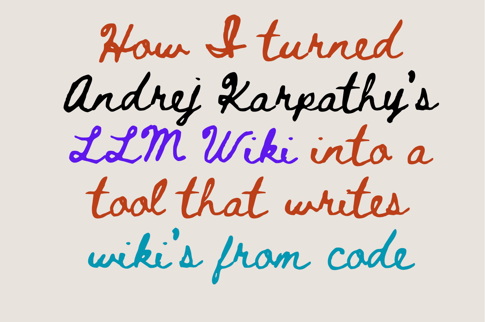
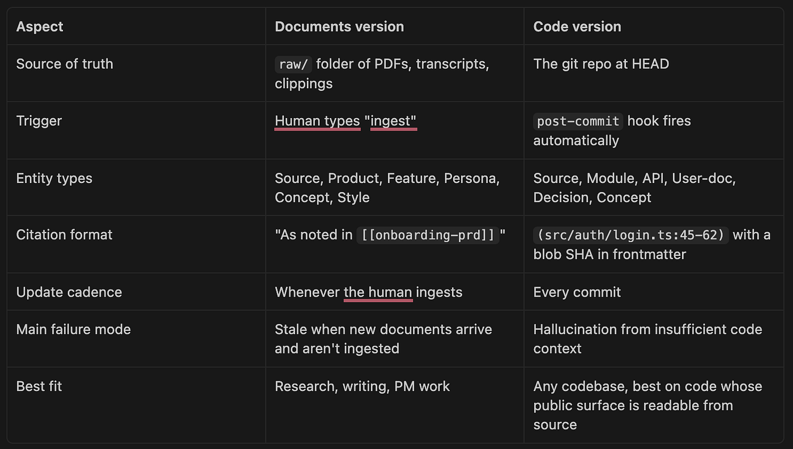

> 作者：Balu Kosuri
> 发布日期：2026-04-17
> 原文链接：https://medium.com/@k.balu124/how-i-turned-andrej-karpathys-llm-wiki-into-a-tool-that-writes-wiki-s-from-code-cfb7f73afa52

# 我如何将 Andrej Karpathy 的 LLM Wiki 改造成一个从代码自动生成文档的工具

几天前，我写了一篇关于 LLM Wiki 的文章——Andrej Karpathy 提出的一种模式，可以将一堆文档转变为自我维护的知识库。有人在评论里问：同样的思路能不能用于代码仓库，而不是文档？这个问题一直萦绕着我，这个项目就是由此而来的。

**它是什么：** 一个小型模板，将 LLM Wiki 模式指向代码仓库，并从中生成文档——最终用户文档、内部文档，或者任何你自定义的模板。

**它如何工作：** 你克隆仓库，编辑一个配置文件，运行一个安装脚本。此后，每次 `git commit` 都会在后台触发一个 agent，读取本次 diff、更新 wiki，并让文档与代码保持同步。



我的仓库：[https://github.com/balukosuri/docs-from-code-with-llm-wiki](https://github.com/balukosuri/docs-from-with-llm-wiki-karpathy)
我的上一篇文章：[I used Karpathy's LLM Wiki to build a knowledge base that maintains itself with AI](https://medium.com/@balukosuri/i-used-karpathys-llm-wiki-to-build-a-knowledge-base-that-maintains-itself-with-ai)
原始创意来自 Andrej Karpathy：[Karpathy's llm-wiki.md](https://gist.github.com/karpathy/1dd0294ef9567971c1e4348a90d69285)

本文接下来讲述这套方案为何有效，以及它在哪里会出问题。

---

## 这个项目是什么，不是什么

我想开门见山，因为这是被问得最多、也被回答得最错的问题。

这是一个小型个人项目。它将 Andrej Karpathy 的某个想法（llm-wiki.md 模式）实例化，并将其指向代码仓库，而不是文档文件夹。从代码生成 wiki。

它解决的是一个具体问题：内部 wiki 和工程知识库往往半途而废。它们起步良好，但因为维护没人负责而逐渐过时，最终失去可信度。一份有 20% 内容过时的 README 比没有 README 更糟糕，因为它会让人带着错误的信息自信地行动。

**这不是对技术写作者的替代。** 我要说两遍，因为这很重要，而且我本人就是一名技术写作者。写作者带来的是判断力、叙事能力、对受众的理解、编辑视角，以及与工程师据理力争的意愿。大语言模型不具备这些。这个工具能产出的是：

- 供写作者润色的草稿，而不是完成品
- 面向开发者的内部参考，而不是对外发布的产品手册
- 处理那 80% 随代码变化而腐烂的内容的工具，从而让人类写作者专注于那 20% 需要声音的部分

如果你的团队有写作者，这个工具能帮助他们——提供一份与代码同步、有据可查的参考资料。它不会取代他们。如果你没有写作者，这个工具能给团队一个内部使用可信赖的参考，但不要在没有人工审核的情况下就把生成的内容当作面向客户的文档发布。

**最适合的场景：** 内部开发者文档、CLI 工具和库、没有专职文档职能的独立开发者和小团队、希望在人工撰写的产品文档旁边维护一份代码同步参考的团队。

**没有人工编辑就不适合的场景：** 对外发布的最终用户产品文档、行为依赖运行时数据的重交互应用、合规/法律/安全关键内容。

说完这些免责声明，来讲讲我为什么要做这件事。

---

## 代码文档为何总是过时

想想你写过的每一份 README。它一开始很好。有人上手，扫了一眼，提交了一个修复。一个月后，某个功能被改名了。README 没变。三个月后，一个子系统被完全重写。README 还是没变。六个月后，README 成了一件遗物：错得足以误导人，对得足以让人不忍删除。

这不是动力问题，而是时机问题。

文档之所以腐烂，是因为代码变化的时刻和文档更新的时刻是分离的。等到有人注意到，做出那次修改的开发者早已切换到另一个心智空间（上下文切换，context switch），活在另一个世界了。

对于我上一篇文章来说，静态文档的问题很好解决。你把 PDF "ingest"（摄入）一次就完成了。但代码不是静态的。每次 commit 都是一次潜在的 ingest。没有人想在每次保存文件后都手动输入 `ingest src/auth/login.ts`。

所以我需要一个不同的触发机制。

---

## 为什么 git commit 是更新文档的正确触发器

关键的一步就在这里。代码项目的自然心跳不是"当开发者想起来更新文档的时候"，而是 `git commit`。每次 commit 都是一个原子性的变更单元：经过测试、经过审查（但愿如此），并附有人工撰写的提交摘要。如果 wiki 在每次 commit 时自动更新，文档就永远不会落后代码超过一次 commit。

这正是 `docs-from-code-with-llm-wiki` 所做的。一个 post-commit 钩子（post-commit hook）在后台触发，diff `HEAD~1..HEAD`，将 diff 交给你配置的 AI 工具，CLI 就地更新 wiki。几秒钟后，一个主题为 `wiki: update (<sha>)` 的后续 commit 落地。你的 `git commit` 瞬间返回，你继续写代码。

以下是完整的流程：

```
git commit（代码）
   │
   ▼
post-commit hook → nohup ingest.sh &   （立即返回，你继续写代码）
                          │
                          ├─ flock（防止并发运行）
                          ├─ git diff <last-ingested>..HEAD
                          ├─ claude -p  （或 cursor-agent，或 codex）
                          │     └─ 读取 CLAUDE.md + config.yml
                          │        就地编辑 wiki/*.md
                          └─ git commit -m "wiki: update (<sha>)"
```

对于沉浸式编码者（vibe coder）——那些进入心流状态写代码、凭感觉 commit、不想成为文档官僚的人——这是理想的循环。你永远不需要输入"ingest"。你只管 commit，文档自然出现。

---

## 这个 AI wiki 实际上生成哪类文档

第二个问题，在"什么触发它"之后，是"它生成什么"。这里我不想做一个固执的选择。内部架构文档、最终用户 README 草稿、API 参考、ADR（架构决策记录，Architecture Decision Records）——不同项目想要不同的组合。有些全部需要，有些一样都不需要。

所以这个模板有一个配置文件，可以按开关控制各类别：

```yaml
# .llmwiki/config.yml
cli: claude              # claude | cursor-agent | codex
doc_types:
  architecture: true     # 内部：模块图、数据流
  api: true              # 公开函数/类/命令参考
  user: false            # 最终用户 README 草稿和使用页面
  decisions: true        # ADR 风格的决策记录
  concepts: true         # 从代码中发现的领域概念
include:
  - "src/**"
  - "lib/**"
exclude:
  - "**/*.test.*"
  - "dist/**"
custom_types: []
#  - name: runbook
#    dir: runbooks/
#    trigger: "when the diff touches infra/ or ops/"
```

打开你关心的，在 `custom_types` 下添加你自己的类别。这是唯一的旋钮。

每次 ingest 时，CLI 重新读取这个文件。如果昨天你设置了 `user: false`，今天改为 `true`，下一次 commit 就会开始起草最终用户文档，无需任何代码变更。

启用的类别一一对应 `wiki/` 下的目录：

```
wiki/
  index.md          ← 主目录
  log.md            ← 只追加的活动日志（非常适合对文档做 git blame）
  overview.md       ← 全局综述
  glossary.md       ← 每个公开标识符、标志、配置键
  architecture/     ← 各子系统页面（按职责分组）
  api/              ← 每个导出函数、类或命令一个页面
  user/             ← README 草稿、使用说明、用法页面
  decisions/        ← 从 commit 信息中提炼的 ADR 页面
  concepts/         ← 领域概念（如"重试退避"、"任务队列"）
  sources/          ← 每个重要源文件一个摘要页面
```

在 Obsidian 中打开，图形视图按目录着色。一眼就能看出哪些子系统是核心枢纽，哪些是孤岛。

---

## 如何阻止大语言模型对你的代码产生幻觉

代码是一个吃力不讨好的摘要来源。

代码叙述的是"发生了什么"，比如 `function login(user, pass)`。它几乎从不叙述"为什么这个函数存在"、"谁在调用它"、"凌晨三点它出问题时会怎样"，或者"出问题时用户看到什么"。一个在没有这些上下文的情况下去总结函数的大语言模型，会很乐意用训练数据的分布来填补空白。如果这段代码看起来像它见过的其他代码，它就会按那种方式描述行为——即便这个特定实现做的是完全不同的事。

这有多糟糕，取决于有多少行为实际上存在于代码中。有些代码表面从源码就可以完整阅读：函数签名、带类型的 API schema、配置定义。另一些代码表面高度依赖源码没有叙述的东西：样式、运行时数据、用户交互、环境。行为越多地存在于代码之外，AI 就越需要猜测，幻觉（hallucination）就越多。

没有银弹，但两层防御能覆盖大部分问题：

### 1. 用严格的 CLAUDE.md 文件约束提示词

CLAUDE.md 是每个 AI CLI 在做任何事情之前都会读取的 schema 文件。这个模板附带的版本有七条硬规则，核心如下：

- **引用，或者不要声明。** 每个非平凡的陈述后面必须跟上 `(path:start-end)`。如果你给不出引用，就是在猜测。停下来，改用 `> TODO-VERIFY:` 的引用块。
- **永远不要描述不在 HEAD 的 API。** 如果 `timeout` 不在当前签名里，就不要写"这个函数接受一个可选的 timeout"。
- **永远不要叙述你读不到的运行时行为。** 不写"这里大概做了 X"。如果行为只能从测试推断，引用测试文件。
- **UI 约束。** 对于 React 组件、模板化 HTML 和 CSS 驱动的行为，除非有测试、快照或 Storybook 文件确认，否则不要描述用户看到的内容。
- **永远不要引用这个仓库之外的内容。** 不引用外部文档，不写"像这样的框架通常……"。只引用 HEAD 处的代码。

CLI 被用大写字母明确告知：`TODO-VERIFY` 块是特性，不是失败。一个有两段自信段落和三个 `TODO-VERIFY` 标记的页面，比一页自信幻觉有用得多。

### 2. 基于真实 git SHA 的新鲜度检查（freshness check）

每个 wiki 页面在前置元数据（frontmatter）中存储了它引用的每个文件的 `git hash-object` SHA：

```yaml
---
title: Login flow
type: module
sources:
  - path: src/auth/login.ts
    sha: 3f9a21bccd4e0f12abc34...
    lines: 1-120
  - path: src/auth/session.ts
    sha: 0b12aa99cc8d77eeff01...
    lines: 15-88
updated: 2026-04-17
---
```

新鲜度脚本遍历每个页面，对每个被引用文件重新运行 `git hash-object`，并报告引用已不匹配的页面。这两点让它既廉价又可靠：

- Git blob SHA 是确定性的。相同内容 → 相同 SHA。永远如此。
- 你可以在 pre-push 钩子、CI 任务中运行它，或者手动执行 `bash .llmwiki/freshness.sh`。它只读取工作树，别无其他。

当某个页面过期时，你把过期列表粘贴给 AI 并说"重新生成这些"。下一次 ingest 面前是真实的代码，幻觉的声明就消失了。

这是防弹的吗？不是。没什么是防弹的。但它把幻觉从一个无声的、累积性的衰减问题，变成了一个响亮的、有时间戳的、可追溯的问题。你始终知道哪些页面可能是错的，以及原因。

---

## 这与原始的 LLM Wiki（面向文档）有何不同

与我两周前发布的原始技术写作者版本的并排对比：



相同的模式，不同的刻度盘。

---

## 在真实开发者工作流中使用起来是什么感觉

想象你在周末构建一个小项目，不想停下来写文档，只想写代码。

你安装一次这个模板，然后忘掉它。从那时起，每次运行 `git commit`，一个小 agent 在后台运行，读取变化了什么，并为你更新 wiki。

- 你添加了一个新函数或 endpoint → wiki 里出现了对应页面。
- 你修改了一个签名或配置选项 → 相关页面自动更新。
- 你重命名或拆分了一个文件 → wiki 自动重整以匹配。
- 代码与文档之间有什么对不上的地方 → wiki 留下一个 `TODO-VERIFY` 注记，指向不匹配之处，让你在发布前发现。

你在写代码时从不打开 wiki。你只是 commit。之后，当你想分享项目、写博客文章或者让别人上手时，打开 `wiki/` 目录，大部分文档已经在那里了：概述、参考、术语表，以及各模块之间如何连接的关系图。

心智模型很简单：你写代码，agent 写文档，git 是两者之间的交接点。

---

## AI 生成代码文档的真实局限

- **幻觉被缓解，不被消除。** CLAUDE.md 中的引用规范和基于 SHA 的新鲜度检查减少了漂移，但不保证正确性。任何 AI 写的声明仍然可能是错的。
- **重交互代码是最弱的场景。** 如果你在做 React/Vue/Svelte 应用，打开 `api` 和 `architecture`，关掉 `user`，把输出当成人工需要补全的骨架。不要不经审核就发布生成的最终用户文档。
- **大型 diff（大规模重构、全面重命名的 commit）默认在超过 2000 行时跳过。** 你可以提高上限，但要做好成本准备。模板会打印一条跳过信息，而不是悄悄烧掉 token。
- **跨文件重命名。** Git 的重命名检测是启发式的。如果 AI 看到"删除 foo.ts + 添加 bar.ts"，它可能意识不到这是同一个东西。钩子会透传 commit 主题，所以像 `refactor: rename foo.ts to bar.ts` 这样的提交摘要会给它一个强烈的提示。
- **每次 commit 都有成本。** 钩子在每次匹配的 commit 时调用 AI API。收紧 glob 并关掉未使用的文档类型，以控制账单。
- **不是单一的事实来源。** 如果你同时有 Confluence/Notion/文档站，这个工具与它们并存。它记录与代码同步的那部分；其余内容留在原来的地方。
- **私有 API vs 公共 API。** 模板默认只记录公共接口。如果你也想记录内部实现，扩大 `include` glob 并启用 `architecture`。
- **Monorepo（单一代码仓库）。** 每个仓库一个 wiki 可以正常运行。对于 monorepo，要么在仓库根目录运行一个 wiki（范围宽），要么每个包有独立的 `.llmwiki/` 和 `wiki/`（范围窄）。后者通常更有用。
- **仅限 CI 的工作流。** 这个模板在本地运行。希望在合并到主分支时更新 wiki 而不是每次本地 commit 时更新的团队，应该把钩子改造成 GitHub Action。提示词和 CLAUDE.md 可以直接移植过去。
- **Windows。** 在 macOS 上测试过，Linux 应该也能用。Windows 需要 Git Bash 或 WSL；原生 cmd/PowerShell 无法运行钩子。
- **质量跟着 CLI 走。** wiki 的质量上限是你背后放的模型。升级模型，wiki 也随之升级。
- **不是代码审查者。** 它记录代码，不会告诉你代码是错的、不安全的或可以更简洁。

---

## 关于 AI 代码文档的常见误解

几个值得集中澄清的误解：

- **"这替代了技术写作者。"** 不。它产出草稿和一份动态参考。最后一公里——声音、叙事、受众理解、编辑判断——仍然是人的工作。
- **"我可以把生成的内容直接发布为最终用户文档。"** 内部使用通常可以。面向客户的内容，务必经过审核。幻觉在行为描述上的风险是真实的。
- **"它理解整个代码库。"** 它理解的是 diff 以及引用了被修改文件的页面。如果要全面扫描，直接让你的 CLI"重读 wiki/index.md 并做深度扫描"，那是另一种操作。
- **"没有 CONTRADICTION 块就意味着 wiki 是正确的。"** 没有被标记出问题不等于没有问题。运行 `freshness.sh`，抽查被引用的行号范围。信任，但要验证。
- **"钩子能修复糟糕的代码。"** 它记录的是现有的代码，不是代码审查工具，也不是重构工具。
- **"一次 commit 只更新一个 wiki 页面。"** 一次 commit 通常会触及 5–15 个页面：术语表、目录、概述，加上受影响实体的页面。这是设计如此。
- **"打开所有文档类型就能得到更好的文档。"** 它给你的是更宽泛的文档，代价是更高的成本。启用范围窄的类别，生成的页面更精准。
- **"我的团队可以用这个代替 Confluence。"** 不同工具，不同用途。这个工具与代码并排存放，产品规格、组织知识和面向客户的文档留在它们原来的地方。
- **"wiki: update commit 看起来没问题，就意味着 wiki 是对的。"** 这意味着 AI 认为它是对的。仍然需要定期人工审查。

---

## 如何在几分钟内为你的仓库安装 LLM Wiki

```bash
git clone https://github.com/balukosuri/docs-from-code-with-llm-wiki.git my-project
cd my-project
# 编辑 .llmwiki/config.yml：选择你的 CLI，切换文档类型
$EDITOR .llmwiki/config.yml
# 安装钩子
bash .llmwiki/install-hook.sh
# 提交一些代码（哪怕是"initial commit"也可以）
git add . && git commit -m "start"
# 观察 wiki 自动填充
tail -f .llmwiki/state/ingest.log
```

在 Obsidian 中把这个目录作为 vault 打开，概述页面默认打开，图形视图用 Cmd+G 触发。

如果你是沉浸式编码者，整个流程就是：clone、编辑一个 YAML 文件、运行一个脚本，然后忘掉 wiki 的存在。你的 commit 替你写文档。

---

## 最后的思考

文档失败几乎从来不是"我们不知道如何写文档"。而是"代码变化的时刻与文档应当更新的时刻，被太多的时间和太多次上下文切换所分隔"。

Karpathy 的 LLM Wiki 模式通过让 AI agent 成为 wiki 维护者，消除了文档与文档之间的这道鸿沟。这个变体通过让 `git commit` 成为触发器、并将每个声明都锚定在可被新鲜度检查验证的 `path:line` 引用上，消除了代码与文档之间的这道鸿沟。

wiki 不是一件你独自维护的东西，而是钩子起草、你来完善的东西。你的角色从账房先生转变为审查者：写代码、提交，然后审查钩子的提案。真正重要的写作——声音、叙事、判断、编辑品味——仍然是你的。这个工具只是移除了曾经横亘在你和文档中真正需要人来做的那部分之间的繁琐工作。

如果上一篇文章讲的是把 15 份散落的文档变成自动更新的知识库，这篇讲的就是把一个活跃演进中的代码库变成它自己的动态文档。模式是一样的，变化的是触发器。

---

我叫 Balasubramanyam Kosuri，是一名技术写作者。欢迎在 LinkedIn 上与我联系，获取更多此类内容。

仓库：[https://github.com/balukosuri/docs-from-code-with-llm-wiki](https://github.com/balukosuri/docs-from-with-llm-wiki-karpathy)
上一篇文章：[I used Karpathy's LLM Wiki to build a knowledge base that maintains itself with AI](https://medium.com/@balukosuri/i-used-karpathys-llm-wiki-to-build-a-knowledge-base-that-maintains-itself-with-ai)
原始创意：[Karpathy's llm-wiki.md](https://gist.github.com/karpathy/1dd0294ef9567971c1e4348a90d69285)
