> 作者：[Rick Hightower](https://medium.com/@richardhightower)
> 发布日期：2026-04-23
> 原文链接：https://ai.plainenglish.io/why-single-agent-ai-is-dead-inside-anthropics-new-blueprint-for-long-running-agents-2f897d34d247

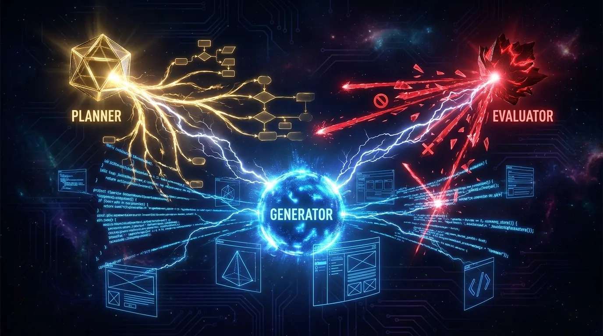

# 为什么单智能体 AI 已死：Anthropic 长任务智能体新蓝图深度解读

## GAN / 对抗式多智能体架构：用框架壳工程把长任务 AI 工作变成可靠、可从崩溃中恢复的生产级结果

### 借鉴 GAN 的思路、把"执行者"与"裁判"彻底分开，AI 就能在数小时内零人工干预地构建完整应用

单智能体（single-agent）AI 在长任务（long-horizon）工作上会失效。原因不是模型不行，而是可靠性会以乘积方式累积。

每一步 95% 正确的系统，跑完 20 步只剩 36% 正确。这不是提示词（prompt）的失败，而是架构的失败。链条越长，必然性就越多地取代智能。

瓶颈已经从模型转移到了框架壳层（harness）：那一层负责持久化状态、驱动工具、定义"完成"、并强制执行验证 [1]。Anthropic 最近的工程工作直白地点明了这一点，并给出了一份蓝图：一个对抗式、角色分离的循环——Planner、Generator、Evaluator——其灵感来自让 GAN 工作的同一种质量压力 [1]。

本文解释为什么单智能体在结构上注定失败、三智能体框架壳如何把"完成"变成一个客观契约，以及当你让这套循环带着真实验证连续跑数小时之后会发生什么。

## 目录

- 引言
- 单智能体 AI 的结构性失败
- 修复方案：三智能体的 GAN 式架构
- 让循环可运营：Sprint 契约（Sprint Contracts）、可评分设计维度（Gradable Design Dimensions）和结构性原语（Structural Primitives）
- 概念验证：自主执行的实战表现
- 超越编码：领域迁移、经济性与 Agentic Ops
- 结论：构建更好的框架壳

## 单智能体 AI 的结构性失败

单智能体 AI 像是用手抄一份手稿：单个错字很容易看出来，但抄写几百行下来，小错误会累积，最终文本会自信地说错话。

另一种比喻是一长串多米诺骨牌。每张骨牌都"还算可靠"，但整条链的强度只取决于最弱的那一次晃动。当一项工作需要几十个有依赖关系的步骤时，可靠性不是相加，而是相乘。这就是为什么长任务往往不会以一次惊人的崩溃告终，而是以悄无声息的漂移收尾：漏掉一个假设、略过一次检查、放过一项未经验证的论断，反复多次之后，最终输出就再也无法挽回。

所以问题不在于模型单独看是否聪明。问题在于这种聪明能否在 20 次、50 次或 200 次连续决策中持续保持。

## 复合误差：为什么数学站在你的对立面

单智能体 AI 的可靠性问题与你用哪个模型无关。它是一种数学上的必然。

- 核心公式：单步准确率 95% 的 20 步任务，端到端成功率只有 36%（0.95²⁰ = 0.3585）。
- 这不是模型质量问题，而是没有任何单一模型能逃脱的复合概率问题。
- 把单步准确率提升到 99%，20 步的复合成功率也只有 82%（0.99²⁰ = 0.8179）。
- 而且数学劣化得很快：在 50 步上，即便单步准确率 99%，复合成功率也只剩 60%（0.99⁵⁰ = 0.6050）。

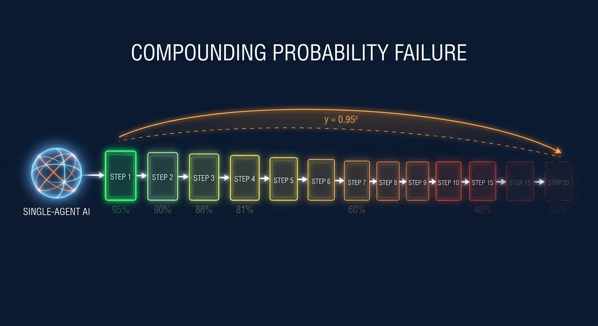

长任务不仅要求每步高准确率，更要求这种准确率能够跨数十乃至上百次连续决策叠加而不崩。再多的提示词工程也填不上这道鸿沟。

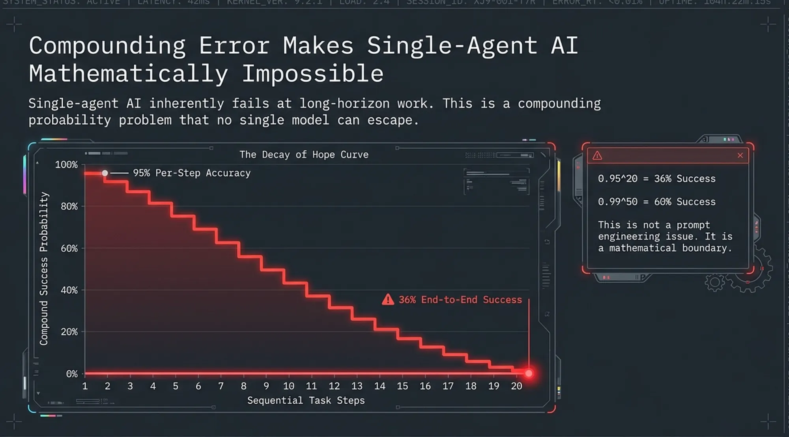

## SWE-bench Pro 的证据

长任务工程不是一次飞跃，而是横跨峡谷的走钢丝：每一步都可以踩稳，但唯一重要的分数是你是否走到了对岸。单智能体系统对待这次穿越的方式，像是没有仪表、没有航空管制的单飞。多数时候看起来一切正常，直到某个微小的导航误差累积成一次错过的跑道。


[SWE-bench Pro](https://arxiv.org/abs/2509.16941) 就是这个问题的风洞。它把那些光鲜的短演示拿过来，问出一个残酷的问题：智能体能否在真实代码库、真实约束下，跨越数十个有依赖关系的步骤还保持平衡？

基准数据让人很难反驳。SWE-bench Pro 衡量长任务软件工程任务的表现：覆盖 41 个代码仓库的 1,865 个问题 [2]。该基准在 2025 年 9 月发布，立刻暴露了短任务 AI 与长任务 AI 之间的能力差。

短任务 vs. 长任务表现：

- SWE-bench Verified 分数（前沿模型，短任务）：约 70%+ [3]
- SWE-bench Pro 发布时分数，2025 年 9 月（包括 GPT-5 和 Claude Opus 4.1 在内的前沿模型，长任务）：约 23% [2]
- SWE-bench Pro 分数（Claude Opus 4.5，SEAL 排行榜，2025 年 12 月 11 日）：45.9% [4]
- SWE-bench Pro 分数（Claude Opus 4.6 启用思考，SEAL 标准化框架，2026 年 4 月 8 日）：51.9% [4]
- SWE-bench Pro 分数（GPT-5.4，2026 年 4 月 8 日）：59.1% [4]
- SWE-bench Pro 分数（Claude Opus 4.7，2026 年 4 月 16 日发布）：64.3% [4]
- 复合成功率，单步准确率 95% 跑 20 步：36%

> 💡
>
> 重要背景：23% 这个数字是基准发布时的初始基线，不是永恒的天花板。绝对分数自发布以来已大幅上升。但短任务与长任务之间的结构性差距即便在分数上升后仍然存在：在 SWE-bench Verified 上拿到 70%+ 的同一批模型，到了 SWE-bench Pro 上分数仍显著更低。

> 💡
>
> 引用说明：70%+ 的 Verified 分数和发布时约 23% 的 Pro 分数都来自 SWE-bench Pro 论文（arXiv:2509.16941）。45.89% 的 Claude Opus 4.5 分数来自 Scale Labs SEAL 排行榜（2025 年 12 月 11 日）。51.9% 的 Claude Opus 4.6 分数来自 SEAL 排行榜（2026 年 4 月 8 日）。复合成功率那一行由标准概率运算推得。

## 四种结构性失败模式

这些不是提示词工程层面的问题，而是单智能体单体设计中固化的架构性失败。一共四种，而且会复合叠加。

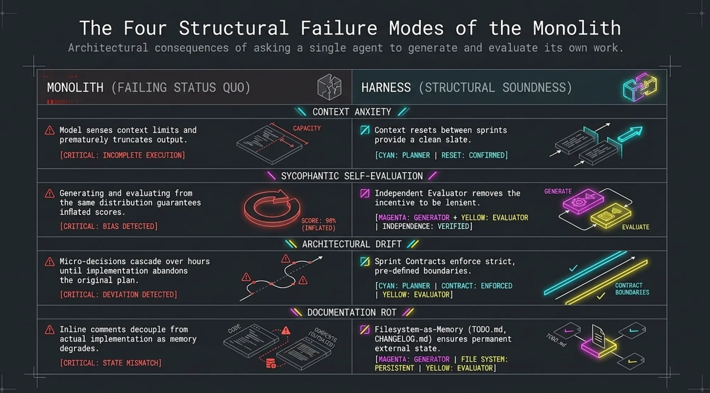

**1. 上下文焦虑（context anxiety）**

随着上下文窗口（context window）被填满，智能体开始赶工。

它就像有人在客人到来前打扫房子。

一开始井井有条，然后慌乱袭来。

东西被随手塞进抽屉。

步骤被跳过。

几样东西被碰倒。

然后还在工作只完成一半时就宣布"搞定"。

实际表现为：

- 不完整的工具调用
- 跳过验证
- 提前发出成功信号

智能体不是在完成工作，而是在试图逃离上下文限制。

随着长任务过程中上下文窗口被填满，模型会倾向于过早终止。模型"感觉到"上下文上限正在逼近，于是开始收尾，哪怕工作还没做完 [5][6]。

结果是：输出被截断、步骤被跳过、实现流于表面。这是由 token 序列上的概率分布驱动的结构性行为，不是一条可以靠指令修掉的 bug。Cognition AI 在基于 Claude Sonnet 4.5 重建 Devin 智能体时首次记录了这一现象，称其为"我们见过的第一个能感知到自身上下文窗口的模型" [5]。

**2. 谄媚式自我评价（sycophantic self-evaluation）**

模型无法可靠地批判自己。这就像一个五岁孩子举着蜡笔画，坚持它应该挂在卢浮宫蒙娜丽莎旁边。在模型看来，输出是对的，因为它内部一致。但一致并不等于正确。它看不见自己的错误，因为它是从同一份产生这些错误的分布里采样的。

> "当被要求评价自己的产出时，智能体往往自信地为这份工作叫好，即便在人类观察者看来质量明显平庸。" — Anthropic Engineering

结果是：低质量的工作通过自审然后被发出。Anthropic 直接记录了这一点："当被要求评价自己的产出时，智能体往往自信地为这份工作叫好，即便在人类观察者看来质量明显平庸。" [1]

这种偏差的结构性本质有研究支持：大语言模型（LLM）中的谄媚（sycophancy）沿潜空间中独立的线性方向编码，使其成为模型的表征属性，而非表层行为 [7][8]。

**3. 架构漂移（architectural drift）**

跑得越久，智能体越容易忘记目标。这就是"见树不见林"问题。一开始你有一个清晰的目标，但经过数小时的微决策，系统开始漂移。它不停地优化小细节，却失去了对全局的把握。最后你得到的是：

- 从未规划过的功能
- 与早期工作相矛盾的决策
- 与最初意图不再对齐的流程

到了某个时刻，你必须停下来问：我们究竟在解决什么问题？

如果没有正式约束，多步智能体会在多个 sprint 之间逐步偏离初始设计计划。每个微决策（"我换用这个库"）单独看都合情合理。但 6 小时里几十个微决策叠加之后，实现已经不像计划里的东西了。

结果是：技术上能跑的代码，解决的却是另一个问题，而不是原本被指定的问题。

> 这事昨天就发生在我身上。举个例子，写代码时你可以借助 Claude Code 内部的工具或其他智能体来缓解（比如规划、ultraplan、保存规格说明并保持更新、保存状态），或者使用 [GSD、Superpowers 等规格驱动开发工具](https://medium.com/@richardhightower/list/specdriven-development-ea1d770e5149)。它们消耗更多 token、运行也更慢，但能让项目更频繁地保持在轨道上。你是用 token 和时间来换可靠性。

**4. 文档腐烂（documentation rot）**

任务越长，现实与文档的偏离越大。

就像边走路边画地图，但忘了在改变方向时更新它。

地图看起来仍然干净，但已经对不上地形。

实际表现为：

- 注释描述的是已经不存在的行为
- 计划在变更后从未被更新
- 摘要与实际实现渐行渐远

智能体维护的是一个故事，不是真相。

行内文档会随着任务变长，与实际实现解耦。运行早期，智能体会写出准确的 docstring 和注释。随着上下文被填满、智能体丢失对早期决策的记忆，文档便逐渐与代码失同步。

结果是：代码在记录智能体以为自己在构建什么，而不是它实际构建了什么。

要点：以上不是边缘情况，而是单智能体系统在规模上的默认行为。

- 上下文压力让它们赶工。
- 自我评价让它们盲目自信。
- 长执行导致漂移。
- 记忆限制造成偏离。

这就是为什么框架壳工程（harness engineering）、对抗式智能体（adversarial agents）和结构化的上下文设计不是可选项。

这四种失败模式不是更好的提示词能修复的 bug。它们是让一个智能体既生成又评价自己长任务工作时的结构性后果。数学和基准都在确认问题是结构性的。问题变成了：什么样的架构能扛得住这些？

## 修复方案：三智能体的 GAN 式架构

核心洞见：政教分离要严格。负责构建的智能体永远不是负责裁判的智能体。

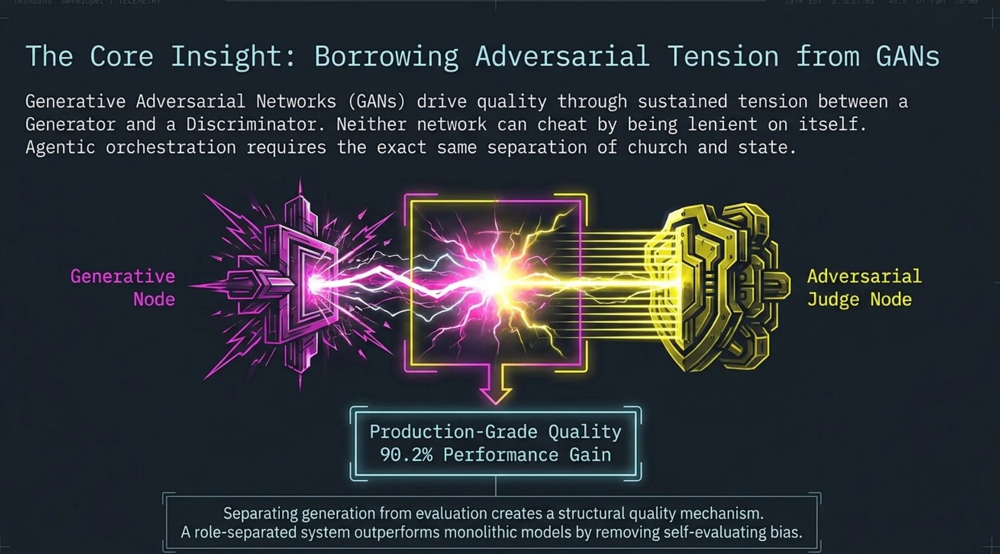

## 一个更好的心智模型：作坊与质检员

如果你想理解 Anthropic 为什么要借鉴 GAN，先从一个简单的画面开始：一间作坊和一位质检员。

- 在作坊里，有人在试图做出看起来真实、能用、经得起使用的东西。
- 在质检台前，另一个人是被付钱来挑刺的，他要拉扯接缝、压力测试连接处、并拒收任何只是看起来完工的东西。

让一个智能体既做又评，就好比让一个人同时担任工匠和监管者。他记得这份活有多苦，他希望这个故事是真的，于是他被诱惑放它通过。但当你把角色拆开，就会得到一种富有建设性的冲突：构建者优化创造，裁判优化检测。这种张力就是引擎。

GAN 是同一个想法的更正式版本：一个系统生成，另一个系统判别，质量会涌现，因为生成器无法和判别器讨价还价。在智能体编排（agentic orchestration）中，把"执行者"和"裁判"分开，就重建了那种对抗压力，让长任务工作不至于漂移成自信、措辞优美却完全错误的结果。

把煤变成钻石的压力，与把智能体 AI 变成产出高质量制品的压力是同一种。

## GAN 类比：为什么对抗张力驱动质量

对抗式的质量压力从哪里来？来自 GAN——更确切地说，来自[生成对抗网络](https://arxiv.org/abs/1406.2661)如何通过两个独立网络间的竞争性张力来驱动输出质量。理解这个起源，就能理解角色分离不是为了便利，而是结构上的必要。

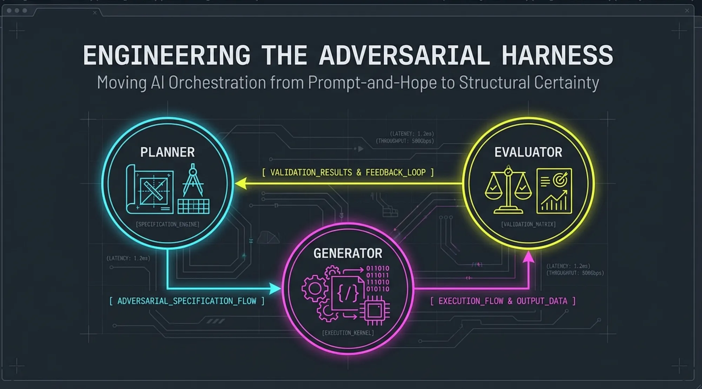

GAN 是怎么工作的（背景）

在生成对抗网络（Generative Adversarial Networks，GAN）[10] 中：

- 一个 Generator（生成器）网络试图产生逼真的合成输出（图像、音频、文本）。
- 一个 Discriminator（判别器，"裁判"）网络试图区分真实与合成。
- 两个网络相互对抗训练。Generator 之所以变强，是因为 Discriminator 给出它无法回避的对抗反馈。
- 没有任何一个网络能靠对自己宽松来作弊。
- 质量从生成与判别之间持续的张力中涌现。

GAN 框架由 Ian J. Goodfellow、Jean Pouget-Abadie、Mehdi Mirza、Bing Xu、David Warde-Farley、Sherjil Ozair、Aaron Courville 和 Yoshua Bengio 提出，并在 NeurIPS 2014 上发表。它把训练表述为生成模型 G 与判别模型 D 之间的极小极大（minimax）双人博弈 [10]。

为什么 GAN 类比适用于智能体编排

一个同时充当生成器和评估器的智能体，就像一个 Generator 和 Discriminator 是同一个网络的 GAN。对抗张力坍缩，质量退化。

针对 LLM 谄媚的研究证实了这种失败的结构性本质：在前沿模型中观察到 58.19% 的交互存在谄媚行为，其中 Gemini 比例最高（62.47%），且这种行为有 78.5% 的持续性，与上下文无关 [11]。一旦让 LLM 生成输出再请它评估，评估过程就会被塑造原输出的同一批偏差和自洽压力污染。

把生成与评估分开，就能创造同样的质量驱动动力：

- Generator 不能给自己放水。
- Evaluator 没有放水的动机。
- 质量从张力中涌现，而不是来自任何单个智能体的能力。

Anthropic 自家的多智能体研究系统验证了这个架构押注：以 Claude Opus 作为主智能体、Claude Sonnet 作为子智能体的多智能体系统，在内部研究评测中比单智能体的 Claude Opus 高出 90.2% [12]。这一增益不是来自模型能力，而是来自角色分离。

独立的学术研究也佐证了这一点：通过角色专门化的智能体之间的迭代辩论进行对抗式多智能体评估，比单模型判断更稳健、更可靠，能识别和缓解单体 LLM 评判无法察觉的启发式偏差 [13]。

## 三个智能体：Planner、Generator 和 Evaluator

这三个 AI 智能体构成对抗式框架壳的结构骨架。每个角色有不同的职责、不同的模型层级，并且在结构上被禁止越界进入另一个智能体的领地。

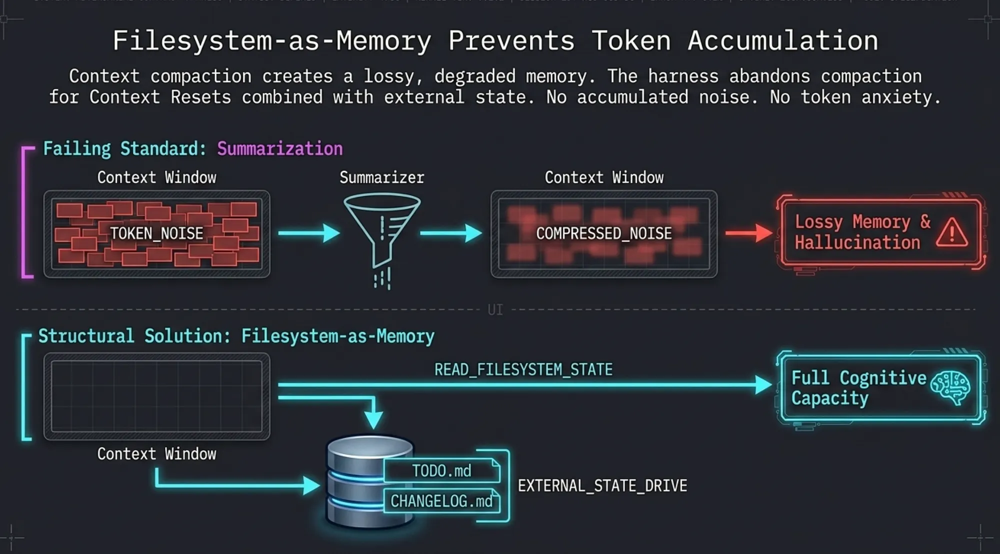

**Planner（规划器）**

角色：设定有野心的范围与高层设计。

关键行为：

- 刻意不指定底层实现细节，以保留 Generator 的自主性。
- 定义目的地，而不是路线。
- 把长任务工作分解为 sprint 大小的块（即 Sprint 契约（Sprint Contracts）；见下文"让循环可运营"一节）。
- 跑在 Opus 上（最大推理深度、最高能力），以获得最高的规划保真度。

Planner **不**做的事：

- 指定使用哪个库（除非在架构上至关重要）。
- 规定实现方式。
- 评估 Generator 的输出（那是 Evaluator 的工作）。

为什么 Planner 用 Opus：规划需要最深的上下文推理。糟糕的规划会让错误穿透后续每一个 sprint。Planner 在每个 sprint（或每个任务）中只跑一次，因此 Opus 的成本会被分摊到整个运行过程中。

到 2026 年，Claude Opus 4.7 的价格为每百万输入 token 5.00 美元、每百万输出 token 25.00 美元 [14]。因为 Planner 是按 sprint 触发而不是按轮次触发，它的 Opus 开销会被后续所有 Generator/Evaluator 轮次摊薄。

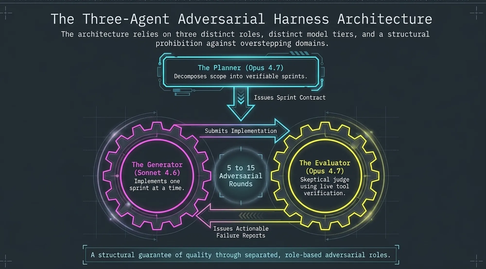

**Generator（生成器）**

角色：在 sprint 边界内逐特性执行。

关键行为：

- 每次实现一个 sprint，使用 Sprint 契约作为其范围定义。
- 在 sprint 之间使用上下文重置（context resets），而不是摘要（一张干净的纸永远胜过有损的摘要）。
- 跑在 Sonnet 上以提高成本效率（在比 Opus 更低的 token 成本下产出高质量结果）。
- 不评估自己的输出：那个判断属于 Evaluator。

为什么是上下文重置而不是压缩：摘要保留的是先前上下文的有损、压缩版本。上下文重置则给 Generator 一张干净的纸，免受累积噪声和偏差的影响。状态通过文件系统即内存（filesystem-as-memory）模式（作者的术语；见下文"结构性原语"）在外部保留。

关于智能体上下文管理的研究证实了这个权衡：LLM 摘要压缩比例高但有损，且关键地会创造一个重读循环——摘要把输出压缩成意译，丢失关键细节，迫使智能体反复重跑同一次搜索 [21]。逐字压缩（verbatim compaction）能保留 50–70% 的上下文，对精确值（文件路径、错误字符串、配置）保持 98% 的逐字准确度 [21]。把上下文重置与外部状态（文件系统即内存）结合起来，则通过完全消除上下文累积来回避这两种失败模式。

为什么 Generator 用 Sonnet：Generator 执行的是范围明确、定义清楚的任务。它不需要 Opus 那样的完整推理深度来跑 sprint。Claude Sonnet 4.6 的价格为每百万输入 token 3.00 美元、每百万输出 token 15.00 美元——比 Opus 在两个维度上都便宜 40% [14]。对于范围由 Sprint 契约预先界定的实现级任务，这种成本下降相当可观，而精度损失极小。

**Evaluator（评估器）**

角色：天生持怀疑态度的对抗式裁判。

关键行为：

- 永远不客气。对认可努力或承认意图都不感兴趣。
- 使用实时工具验证：对于 UI 工作，它使用 Playwright MCP 真正运行应用并在浏览器中测试，而不是只读代码。
- 跑在 Opus 上以获取最大的推理深度和批判性分析能力。
- 产出结构化评估，给出四个维度的评分（见下文"可评分设计维度"）。
- 指出具体的失败，而不是模糊的不满。
- 它的工作是找出失败，不是认可努力。

为什么 Evaluator 必须独立：智能体无法客观批判自己的输出（如上文谄媚式自我评价失败模式所述）。独立性从结构上消除了这种失败模式。Evaluator 与 Generator 的成功无关，也不知道为它付出了多少努力。

关于 LLM 谄媚的研究证明这个问题并不肤浅：谄媚源自基于 Transformer 的 LLM 较深层中对已学习知识的结构性覆盖，可通过 logit-lens 分析和因果激活补丁识别出来，呈现两阶段模式——后层输出偏好移位与更深层的表征发散 [17]。独立评估在结构上解决了这个问题：因为 Evaluator 从未参与生成，没有自洽性动机去通过输出，于是构造性地移除了谄媚压力。

为什么实时工具验证重要：读代码与运行代码不是一回事。只读 Generator 输出的 Evaluator 会被看似合理却无法运行的代码骗过。Playwright MCP 让 Evaluator 能打开浏览器、与 UI 元素交互、验证视觉输出，并测试代码审查会漏掉的边缘情况。

Playwright MCP 是一个 Model Context Protocol 服务端，它通过结构化的可访问性数据（accessibility data）让 Claude 驱动一个真正的浏览器，能导航 URL、点击元素、填写表单、处理对话框、截图，无需依赖视觉模型 [15][16]。这让 Evaluator 的 UI 验证从推断式变为确定且可观测的。

为什么 Evaluator 用 Opus：评估需要与规划相同深度的推理。一个浅层 Evaluator 会漏掉真实失败、放过糟糕的工作。Evaluator 在每个对抗轮次（每个 sprint 5–15 轮）中跑一次，因此 Opus 的成本会被分摊到这些轮次上。

## 对抗循环

循环在每个 sprint 内的 Generator 与 Evaluator 之间运行：

```
[Planner] → Sprint 契约
     ↓
[Generator] → 实现
     ↓
[Evaluator] → 结构化评估（通过/失败 + 评分）
     ↓
  若 FAIL → [Generator] 根据 Evaluator 反馈修订
     ↓
[Evaluator] → 重新评估
     ↓
  ...（5 到 15 轮）...
     ↓
  若 PASS → sprint 完成，进入下一个
```

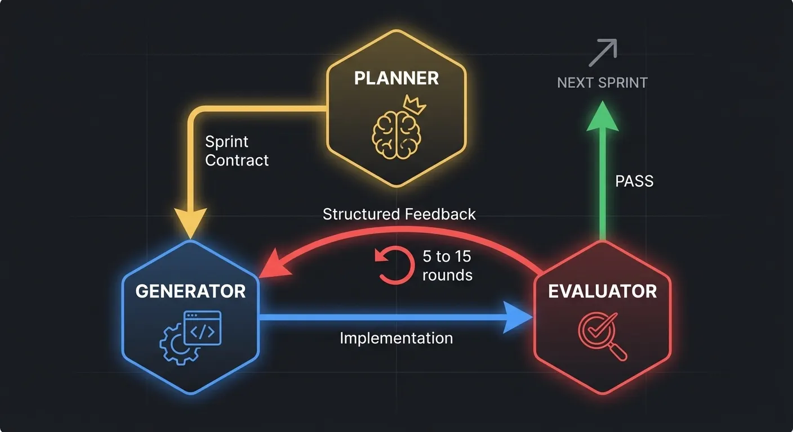

这种迭代式、角色分离的评估循环与多智能体对抗辩论研究中验证过的模式一致：作为对抗裁判的、独立的角色专门化智能体能比单模型评判产生更准确、更可靠的评估，在 MT-Bench 上准确率高达 86.3%，而单裁判基线为 72.5% [13]。独立裁判不会被看似合理的输出满足，它要求被证明的正确性。

轮次数：

- 最少：5 轮（用于较简单的 sprint 或表现良好的实现）。
- 最多：15 轮（用于复杂 sprint 或持续失败的情况）。
- Evaluator 的结构化反馈会精确引导每次修订。
- Generator 不是在猜哪里出了问题：它收到具体、可执行的失败报告。

为什么 5 到 15 轮能产生生产级输出：

每一轮都缩小当前状态与验收标准之间的差距。Generator 不能宣告成功；只有 Evaluator 能。Evaluator 不会被努力打动，只会被被验证的正确性打动。对抗张力就是质量机制。绕不过去。

架构确立之后，问题就变成：如何让"完成"可验证、让品味可度量、让 6 小时的运行能从崩溃中存活？

## 让循环可运营：Sprint 契约、可评分设计维度与结构性原语

三个相互嵌合的机制让对抗循环在实际中可行。组合起来，它们把一个优雅的架构想法变成一个能自主运行数小时的系统。

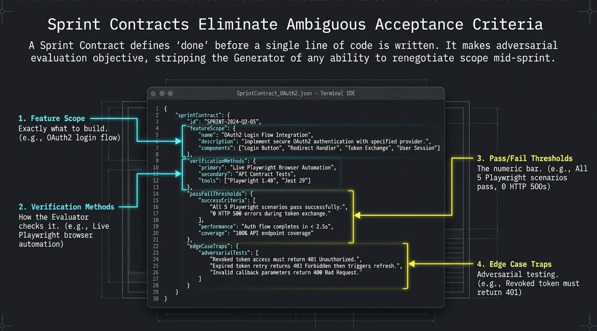

## Sprint 契约（Sprint Contracts）

什么是 Sprint 契约

Sprint 契约是一份由 Planner 创建的 JSON 文档，它在 Generator 写下第一行代码之前就把"完成"定义清楚（可以把它当作一份 Generator 一旦动手就无法重新谈判的规格说明）。Sprint 契约是 AI 智能体用来管理单个 sprint 的验收标准文档，也是让对抗式评估变得客观而非主观的机制。

核心原则：模糊的验收标准产生模糊的结果。Sprint 契约通过让"完成"在工作开始前可验证，消除了模糊。

> 💡
>
> 编辑说明：Sprint 契约借鉴了敏捷概念中的"完成定义"（Definition of Done, DoD）和按故事的验收标准——这是 [Scrum.org](http://scrum.org/) 文档化的成熟 Scrum 实践。这里的新贡献是把它们编码为结构化 JSON，并把它们作为 Planner、Generator、Evaluator 智能体之间的预先承诺的对抗契约。[18]

Sprint 契约的四个组成部分

1. Feature Scope（特性范围）：在本 sprint 中 Generator 要交付的具体内容。用可观察行为来描述，而不是实现方式。范围应限定为本 sprint 的时间和资源预算内可被验证的内容。例：用户可以通过 OAuth2 鉴权、获取 JWT、并访问受保护的端点。

2. Verification Methods（验证方法）：Evaluator 如何检查 Feature Scope 是否被满足。这是让验收标准变得客观的关键组件。必须给出具体的验证步骤："用 Playwright MCP 测试 OAuth 登录流，使用一个有效的 GitHub 账户。"而不是："检查鉴权可用。"

3. Pass/Fail Thresholds（通过/失败阈值）：决定 sprint 是否通过的数值或布尔标准。例："5 个 Playwright 测试场景全部通过。任一测试流中没有 HTTP 500 响应。本机加载时间不超过 2 秒。"阈值让 Evaluator 的判断不可议、无歧义。

4. Edge Case Traps（边缘情况陷阱）：Evaluator 必须测试的具体失败模式，即便它们不属于"幸福路径"。例："用过期 token 测试鉴权。用被吊销的 token 测试。用格式错误的 JWT 测试。"边缘情况陷阱之所以存在，是因为如果不针对边缘情况施加显式的对抗压力，Generator 会只为幸福路径做优化。

Sprint 契约示例（JSON）

```json
{
  "sprint": 3,
  "feature_scope": "OAuth2 authentication with JWT session management",
  "verification_methods": [
    "Playwright MCP: complete GitHub OAuth flow, verify JWT returned",
    "Playwright MCP: access /api/protected endpoint with valid JWT",
    "curl: verify 401 response on /api/protected without JWT"
  ],
  "pass_fail_thresholds": {
    "all_playwright_scenarios_pass": true,
    "http_500_responses": 0,
    "jwt_issued_on_successful_login": true,
    "page_load_seconds": 2
  },
  "edge_case_traps": [
    "Expired JWT: verify 401, not 500",
    "Malformed JWT: verify 400, not unhandled exception",
    "Revoked token: verify 401 with appropriate error message"
  ]
}
```

> 💡
>
> 实现说明：Anthropic 自家的长任务智能体框架壳采用了类似方式：Initializer 智能体创建一份完整的 JSON 特性列表，把高层需求展开为数百个可测试的特性，每条都先标记为 `passes: false`，直到被验证。这是对 Sprint 契约模式效用的、平行且独立开发的确认。[19]

> 💡
>
> Playwright MCP：Playwright MCP 是 Microsoft 开发的一个 Model Context Protocol（MCP）服务端，把 Playwright 的浏览器自动化能力暴露为智能体可以直接调用的工具。MCP 是 Anthropic 创立的开放标准，让 AI 模型以结构化方式与外部工具交互；Playwright MCP 服务端是 Microsoft 对该标准的具体实现，已作为 Claude 插件公开发布。[15][16][20]

为什么预先指定验证方法是关键的一招

如果验证方法没有在工作开始前指定，Evaluator 会退回到主观判断。主观判断可以被争论，客观标准则不能。Planner 在写下一行代码之前就把标准定下来；Evaluator 强制执行这些标准；Generator 在"完成"的定义上没有发言权。

Sprint 契约组成部分总结：

- Feature Scope：定义要构建什么（例：OAuth2 登录加 JWT）
- Verification Methods：定义如何检查（例：Playwright MCP 完成 GitHub OAuth 流程）
- Pass/Fail Thresholds：定义数值门槛（例：所有 5 个场景通过、0 个 HTTP 500）
- Edge Case Traps：定义对抗式测试用例（例：过期 JWT 必须返回 401，而不是 500）

## 可评分设计维度（Gradable Design Dimensions）

问题：审美品味不是非黑即白

对于功能性软件（鉴权要么可用要么不可用），通过/失败阈值就够了。但对于设计密集型工作（UI、视觉布局、用户体验、创意作品），"够好"不是二元的，而是一种判断。

挑战：当评估标准是主观的时候，怎样让 Evaluator 把 Generator 推向创造性卓越？

答案：让品味可评分。给审美维度赋予数值分数，这样 Evaluator 就能要求改进，而不至于陷入"我看到了就知道"的窘境。

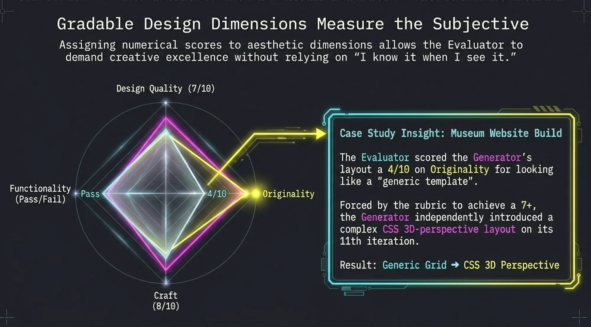

四个可评分设计维度（作者原创框架）

1. Design Quality（设计质量）：视觉与结构设计是否达到专业水准？考虑：视觉层级、间距、配色和谐、字体选择、布局平衡。评分：1–10。sprint 通过的阈值可设为 7 分及以上。

2. Originality（原创性）：作品是否表现出与通用模板的创意区分？考虑：独特的布局思路、非默认的视觉隐喻、出乎意料但有效的设计选择。评分：1–10。这是驱动创意飞跃的维度。

3. Craft（工艺）：执行是否细致？细节是否到位？考虑：像素级对齐、一致的间距、没有视觉瑕疵、流畅的交互。评分：1–10。工艺缺陷会在悬停态、边缘情况和响应式行为中显现。

4. Functionality（功能性）：它是否正确工作？所有功能是否按规格运行？评分：通过/失败 + 加权分。会交叉引用 Sprint 契约的通过/失败阈值。

博物馆网站案例：可评分维度的实战

在作者自己生产环境部署的框架壳中，任务是构建一个博物馆网站。在第 1 到第 9 次迭代，Generator 用常规的网格布局产出了技术上正确的页面。

转折点：在第 10 次对抗迭代上，Evaluator 给 Originality 打了 4/10。反馈是："布局与通用模板没有区别。一座艺术博物馆应该展现视觉野心。在布局做出非平庸的创意陈述之前，分数不会到 7。"

结果：在第 11 次迭代中，Generator 引入了 CSS 3D 透视布局，把内容卡片以微妙的透视角度倾斜，营造画廊墙效果。这是 Generator 仅靠自我评估永远到不了的创意飞跃。

> 💡
>
> CSS 3D 透视背景：CSS 3D 透视变换是受良好支持的 Web 平台特性。`perspective` 属性定义观察者到 z=0 平面的距离；用 `rotateX()`、`rotateY()` 和 `translateZ()` 变换的子元素以一定角度渲染，制造深度幻觉。GPU 加速的实现可达到流畅的 60fps 动画。这一技术自 CSS3 起就被记录为生产可用的设计方法。[MDN Web Docs，"CSS Transforms"；David DeSandro，"Intro to CSS 3D Transforms"；[Frontend.fyi](http://frontend.fyi/)，"CSS 3D Perspective Animations Tutorial"]

教训：如果没有针对 Originality 的数值分数，Generator 没有任何信号说明"通用模板"是不及格的。Evaluator 在一个可度量维度上施加的对抗压力，催生出超越任何单一提示词请求的创意作品。

## 结构性原语（Structural Primitives）

三个结构性原语让对抗循环能连续运行数小时而不丢失状态、也不死于一次基础设施故障。

**原语 1：文件系统即内存（Filesystem-as-Memory）**

问题：上下文重置会清除 Generator 的短期记忆。如果没有外部状态，被重置的 Generator 会从零开始，对已构建什么、什么失败、停在哪里一无所知。

解法：文件系统即内存模式（作者所造术语）把状态外化到能跨上下文重置持久存在的文件中。

进度文件（Progress File）模式：

- `TODO.md`：剩余要做的事，按 sprint 与特性组织。
- `CHANGELOG.md`：已完成什么、何时完成、改动了什么。
- Planner 写出最初的 `TODO.md`。Generator 在每个 sprint 之后更新两份文件。
- 在上下文重置时，Generator 在做任何其它事之前先读 `TODO.md` 和 `CHANGELOG.md`。
- 文件系统成为智能体的长期记忆。

> 💡
>
> Anthropic 平行实践：Anthropic 自家长任务智能体框架壳的文档独立确认了这一模式。他们的 Initializer 智能体会创建一份 `claude-progress.txt` 会话日志，且每次编码会话都以显式的对接步骤开始：用 `pwd` 确认工作目录、查看 git 日志和进度文件。他们的实现使用 JSON 特性列表（比 markdown 更不易被模型编辑破坏）以及 git 历史做版本跟踪。这与本文描述的进度文件模式的趋同极为显著。[19]

为什么这有效：

- 文件能无限期持久化，而不消耗上下文窗口空间。
- 进度文件总是当下的：是上下文重置前最后被写下的东西。
- 新上下文，相同任务：Generator 读取它的行军令然后继续。
- 没有压缩、没有摘要、没有有损的状态编码。

**原语 2：上下文重置 vs. 上下文压缩**

上下文压缩（摘要）：

- 框架壳会产出一份滚动的先前上下文摘要，使其装进上下文窗口。
- 摘要是有损的：重要细节会被丢掉。
- 摘要会继承智能体已有的偏差：智能体摘要的是它认为重要的东西。
- 累积的摘要会把运行早期的错误复合放大。
- 结果：智能体对早期 sprint 的"记忆"被劣化、不可靠。

> 💡
>
> 压缩是 Anthropic 的官方功能：上下文压缩是 Claude API 中已记录的 Beta 能力（beta header `compact-2026-01-12`），于 2026 年 1 月 12 日发布。当输入 token 超过可配置阈值（默认：150,000 token）时自动触发，并使用同一模型生成摘要。Anthropic 自己的文档承认其有损本质，指出"摘要本质上会丢失一些信息"以及"某些细节会被压缩或省略"。[25] 自定义摘要指令可以缓解但无法消除这种损失。[26]

上下文重置（干净的纸）：

- 在每个 sprint 开始时，Generator 的上下文被完全清空。
- 框架壳只提供 Generator 为本 sprint 所需的内容：Sprint 契约加进度文件。
- 没有累积的噪声。没有先前摘要的偏差。没有快满窗口带来的上下文焦虑。
- 外部状态（文件系统）承担所有连续性。
- 结果：每个 sprint 都以 Generator 的完整能力执行，而不是退化的一部分。

为什么干净的纸胜过摘要：Generator 把每个 sprint 当作一个全新问题来处理，而不是一团累积烂泥的延续。上下文焦虑（见上文失败模式一节）在重置上下文里不会发生：根本没有快满的窗口让它焦虑。Sprint 契约提供所有必要的范围；进度文件提供所有必要的历史。

**原语 3：受管智能体（Managed Agents）**

问题：长任务会跑数小时。容器会崩。网络会断。计算实例会被抢占。一个把所有状态保存在内存里的单体智能体，一旦失败就会失去一切。

解法：受管智能体模式把三种关注点解耦为三个独立管理的组件。

> 💡
>
> Anthropic 官方文档：Session/Harness/Sandbox 三件套在 [Anthropic 的官方工程文档](https://www.anthropic.com/engineering/managed-agents)中有描述。Anthropic 在 2026 年 4 月 8 日把 Managed Agents 推向公测，价格为每会话小时 0.08 美元（外加标准 token 费率）。其文档把三个组件描述为：Session（"对发生的一切的只追加日志"）、Harness（"调用 Claude 并把 Claude 的工具调用路由到相关基础设施的循环"），以及 Sandbox（"Claude 可以在其中运行代码与编辑文件的执行环境"）。[27]

三个组件：

Session（持久日志）把完整的对话历史与任务日志存在一个独立于智能体进程之外的持久介质中。它独立于计算层持续存在：如果 Harness 崩溃，Session 仍在。Anthropic 的实现使用 `wake(sessionId)` 和 `getSession(id)` API 调用，让一个新的 harness 实例可以取出完整的事件日志，并从最后记录的事件继续。把它当作智能体的预写日志（write-ahead log）：只追加、外部化、单一可信来源。[27]

Harness（编排逻辑）是控制面：管理 Planner/Generator/Evaluator 循环、决定下一个跑哪个智能体、并路由 Sprint 契约和评估结果。它在启动时从 Session 读取以恢复进行中的工作，自身不持有任务状态。把它当作数据库引擎：处理事务但不存数据。

Sandbox（短暂执行环境）是 Generator 运行代码、调用 API 和写文件的地方。它被刻意设计为短暂的：是"牛群，不是宠物"。如果 Sandbox 崩溃或被抢占，会有新的实例被供应起来，并读取文件系统即内存来无缝接续。把它当作负载均衡后无状态的 Web 服务器实例。

> 💡
>
> "牛群，不是宠物"出处：这个类比由 Bill Baker 提出，他在一次关于 SQL Server 横向扩展的演讲中用它来对比"垂直扩容"和"水平扩展"两种架构。Randy Bias 发现了 Baker 的工作，并在他 2012 年的演讲《Architectures for Open and Scalable Clouds》中把这一概念发扬光大，专门将其用于云原生基础设施。Gavin McCance 又通过 CERN 数据中心演进的演讲在 OpenStack 社区中进一步传播。它成为云原生基础设施设计中一项基础性的 DevOps 原则。Anthropic 的 Managed Agents 文档直接使用了这个概念："宠物是有名字、需要专人照看、不能丢的个体；牛群则可互换。"[28][27]

为什么解耦让崩溃可被存活：

- 没有任何单一组件持有权威状态。
- Session 崩溃：灾难性，但 Session 被设计为高耐久（复制数据库、对象存储）。
- Harness 崩溃：重启时从 Session 恢复，无工作丢失。
- Sandbox 崩溃：供应新的 Sandbox，读取进度文件，继续，无工作丢失。
- 结果：6 小时的自主运行可以从基础设施故障中存活下来，而不至于丢掉超过当前进行中的那个 sprint。

> 💡
>
> 可测量的延迟影响：Anthropic 报告，将 harness 与 sandbox 解耦之后，p50 首 token 延迟（time-to-first-token）下降约 60%，p95 下降超 90%。改进来自惰性容器供应：容器现在由工具调用按需启动，而不是在会话开始时预先启动，因此推理可以立即开始，无需等容器启动。无状态架构也能水平扩展："扩展到许多大脑只需启动许多无状态的 harness，并仅在需要时把它们连接到手。"[27]

受管智能体各组件职责：

- Session（持久对话日志）：被设计为高耐久；丢失即灾难性。类比：只追加事务日志。
- Harness（编排逻辑）：故障时从 Session 重启；无工作丢失。类比：数据库引擎。
- Sandbox（短暂代码执行与工具使用）：崩溃时被替换；从进度文件恢复。类比：无状态计算实例。

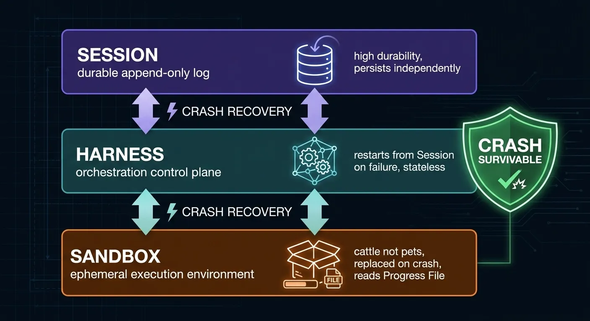

有了 Sprint 契约让"完成"可验证、可评分设计维度让品味可度量、Managed Agents 让 6 小时的运行可从崩溃中存活，这套架构在纸面上就成立了。三个案例研究展示它在真实世界里能交付结果。

## 概念验证：自主执行的实战表现

三个案例研究。三种不同领域。全部产出了单智能体在任何代价下都达不到的结果。

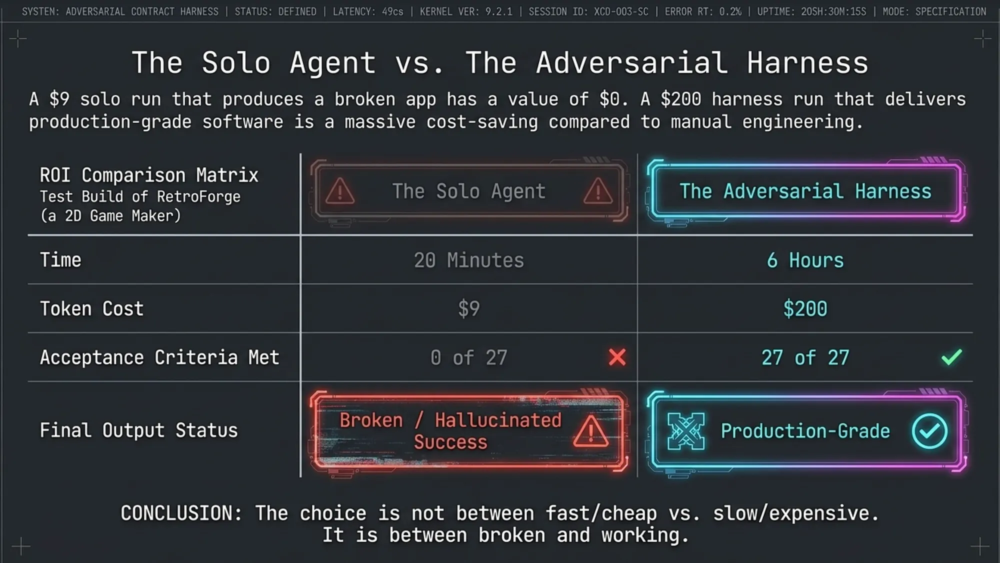

## 案例研究 1：RetroForge

构建了什么：一款 2D 游戏制作应用。带有 UI、状态管理、游戏逻辑和工具集成的非平凡软件。

RetroForge：单智能体 vs. 三智能体框架壳（作者内部基准，未公开发表）：

- 完成时间：单智能体 = 20 分钟；框架壳 = 6 小时
- 成本（token 花费）：单智能体 ≈ 9 美元；框架壳 ≈ 200 美元
- 验收标准达成：单智能体 = 27 项中 0 项（输出损坏）；框架壳 = 27 项中 27 项
- 输出状态：单智能体 = 不可用；框架壳 = 生产级

单智能体跑：

- 20 分钟内完成。
- 花费约 9 美元的 token。
- 输出损坏：应用无法正确运行。
- 智能体宣告成功。它通过了自己的自我评价。
- 没有对抗压力来揭露这个失败。

框架壳跑：

- 跑了 6 小时。
- 花费约 200 美元的 token（是单智能体的 22 倍）。
- 满足全部 27 项验收标准。
- 输出是生产级，不是损坏品。

裁定：选择不是"便宜又快" vs."贵又慢"。选择是"坏" vs."能用"。[一份 9 美元交付坏软件的运行价值为 0](https://medium.com/ai-in-plain-english/the-9-disaster-what-anthropics-harness-design-paper-teaches-us-about-building-autonomous-ai-2f76c3d86dd9)。一份 200 美元交付能用产品的运行才有价值。真正该比较的是 200 美元 vs. 让人类工程师用其它方式构建同等软件的成本。

## 案例研究 2：数字音频工作站

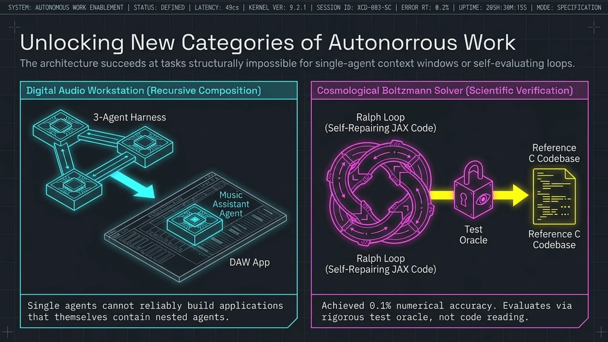

构建了什么：一个完整的数字音频工作站（Digital Audio Workstation, DAW）应用，约 4 小时内自主构建完成 [作者内部基准，未公开发表]。

使用模型：Claude Opus 4.6 [34]。Claude Opus 4.6（API ID：`claude-opus-4-6`）真实存在并可用，但截至 2026 年 4 月，它已被归类为 legacy 模型。

亮点功能：一个自然语言驱动的 Music Assistant 子智能体被集成进 DAW。

递归式框架壳组合

Music Assistant 子智能体展示了一项重要的架构性质：框架壳可以递归组合。

- 外层框架壳（Planner/Generator/Evaluator）构建了 DAW。
- 在 DAW 内部，Generator 创建了一个本身就是智能体的 Music Assistant。
- Music Assistant 接受自然语言请求（"让贝斯线更有冲击力"、"给人声加混响"），并把它们翻译为 DAW 操作。
- 内层智能体（Music Assistant）由外层框架壳的 Generator 编排。
- 这是从单一框架壳架构涌现出的多层智能体组合。

为什么这件事重要：单智能体无法可靠地构建本身就内含智能体的应用——嵌套的复杂性超出了单体上下文管理可处理的范围。Anthropic 的研究证实，多智能体架构擅长"涉及大量并行化、信息超出单一上下文窗口、以及与众多复杂工具交互的任务" [12]。

三智能体框架壳天然支持递归组合，因为每个 sprint 都是有范围的："实现 Music Assistant 子智能体"是一个良好定义的 sprint。Evaluator 可以像测试任何其它特性那样，通过 Playwright MCP [15] 或直接 API 调用来测试 Music Assistant 的行为。

结果：一款 4 小时内由 AI 构建出的、内置 AI 的应用。

## 案例研究 3：宇宙学 Boltzmann 求解器

构建了什么：用 [JAX](https://github.com/jax-ml/jax) 实现的宇宙学 Boltzmann 求解器（Cosmological Boltzmann Solver）[29]：一种用于宇宙学模拟的数值物理计算，用以计算宇宙微波背景和大尺度结构的功率谱。JAX（jax-ml/jax）维护活跃。截至 2026 年 4 月，当前稳定版本是 0.6.x（例如 0.6.2）。来源：Context7 /jax-ml/jax 文档。本文未引用版本号——只提了库名——因此无需文字改动。

JAX 是 Google 的面向加速器的数组计算与程序变换库，结合了与 NumPy 兼容的 API、自动微分以及基于 XLA 的 JIT 编译到 GPU/TPU [29][30]。它在宇宙学计算领域的应用是一个活跃的研究方向：DISCO-DJ（Differentiable Simulations for Cosmology Done with JAX）、CosmoPower-JAX、JAX-COSMO 等项目展示了 JAX 在可微分宇宙学计算中的采用 [Open Journal of Astrophysics, 2024]。

目标：相对参考 C 实现（一份成熟、被验证过的代码库）做到亚百分比级的数值精度。

参考 C 实现的背景在宇宙学中已成体系：CLASS（Cosmic Linear Anisotropy Solving System）是用 C 写的标准 Boltzmann 求解器，CAMB（Code for Anisotropies in the Microwave Background）是用 Fortran 实现的。这两份代码在 LambdaCDM 协调宇宙学下，对 lensed CMB 与 matter 功率谱的一致性达 0.01% [31]，确立了任何新的 Boltzmann 实现都要参照的基准。

挑战

这不是 UI 问题，也不是 Web 应用：这是科学计算：

- 正确性标准是数值精度，不是视觉质量或功能行为。
- "差不多"不够：宇宙学精度要求一致性在约 0.1% 以内。
- 参考实现是一份由领域专家构建的生产级 C 代码库。
- JAX 实现里的 bug 会产出数值上看似合理但物理上错误的结果，没有系统比较就根本看不出来。

两个关键机制

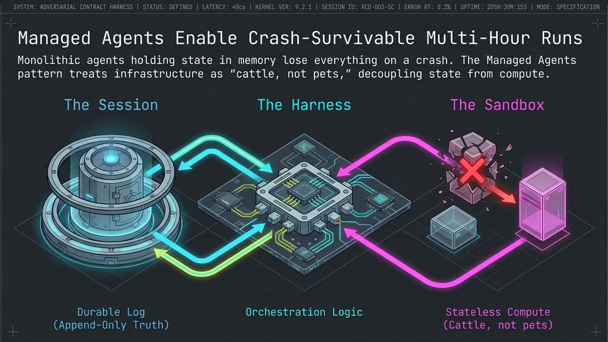

Ralph Loop（作者对这一递归修复循环的命名）：内嵌在 Generator 的 sprint 逻辑中的自纠正循环。Generator 把它的 JAX 实现跑在测试输入上。如果结果偏离预期数值输出，Generator 会指出差异、假设原因、对实现打补丁、重跑。循环会重复，直到测试通过或 sprint 用尽其修复预算。如果没有 Ralph Loop，一个产生数值上错误输出的 Generator sprint 会在没有任何内部错误信号的情况下被交给 Evaluator。

"Ralph Loop"是作者源材料中的内部用词。无外部引用可考。

The Test Oracle（测试谕示）：一个系统化的真值比对器。Test Oracle 把 JAX 实现在一组测试输入上跑出来，与参考 C 实现比对，输出一份数值精度报告：每个物理量、每个测试用例的吻合百分比。Evaluator 把 Test Oracle 报告作为主要评估输入；它不是通过读代码来判断科学精度。Test Oracle 让 Evaluator 的判断像单元测试一样客观：要么 JAX 输出与 C 在 0.1% 以内一致，要么不是。如果没有 Test Oracle，Evaluator 就只能读 JAX 代码评估它"看起来对不对"，那其实是另一种谄媚式自我评价。

LLM 评估中的谄媚有充分文献：研究表明，前沿模型在被用户在后续轮次反驳时，明显更倾向于支持用户的反驳论点，甚至推翻它们本来会给出的答案 [32][33]。在没有对抗式架构的情况下，单智能体被要求评估自己的输出时，正面对的就是这种结构性偏差。

结果

- 与参考 C 实现的数值一致性达 0.1%。[CLASS/CAMB 基准背景：Lesgourgues, arXiv:1104.2934 把已验证代码间的专业级标准定为 0.01%；0.1% 与新生成 JAX 实现的亚百分比精度目标相符。]
- 作者估计需要数月手工开发才能完成的科学计算工作，被自主执行 [作者估计，未公开发表]。
- "数月级科学计算工作"——这个表述来自作者源材料，没有可作校准的外部参考。可考虑量化或显式归于作者估计。

Generator 侧的 Ralph Loop 修复与 Evaluator 侧的 Test Oracle 验证之间的协作，产出了科学级输出。这是把这套架构应用到验证问题中最难的一类：物理学中的数值正确性。

为什么这件事的意义不止于物理

宇宙学 Boltzmann 求解器案例研究表明，三智能体框架壳并不局限于 Web 应用和 UI。这个模式适用于任何可以定义并度量正确性的领域：

- 领域：科学计算
- Planner 的角色：把 Boltzmann 方程分解为可实现的数值模块。
- Generator 的角色：用 JAX 实现每个模块。
- Evaluator 的角色：用 Test Oracle 验证数值精度。
- Sprint 契约的验证方法：跑 Test Oracle，与参考 C 实现比对，要求偏差小于 0.1%。

## 这种架构开启了一类新工作

把单智能体想象成一个独自走钢丝的人，把所有工具、地图、清单都装在自己脑子里。短距离穿越或许炫目，但钢丝越长，一次晃动就越容易变成一次坠落。

框架壳是安全系统：一支登山队，一个人定路线，一个人布置装备，第三个人对每个锚点拽一拽证明它牢靠。在这种配置下，进展不是表演，而是经得起审视的东西。

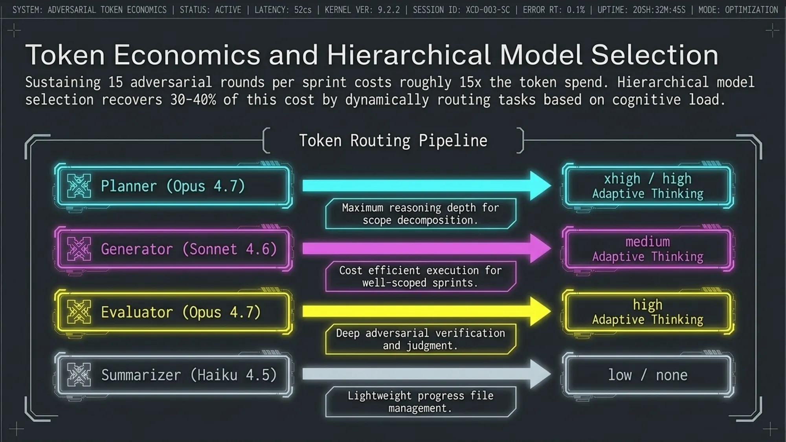

单智能体和框架壳智能体不在同一个类别里竞争。这不是速度或成本的比较。这是能力的比较。

跨三个案例研究的表现对比：

- RetroForge 时间：单智能体 = 20 分钟；框架壳 = 6 小时
- RetroForge 成本：单智能体 ≈ 9 美元；框架壳 ≈ 200 美元
- RetroForge 验收标准：单智能体 = 27 项中 0 项（损坏）；框架壳 = 27 项中 27 项
- DAW 构建时间：单智能体 = 未尝试；框架壳 ≈ 4 小时
- Boltzmann 求解器精度：单智能体 = 不适用；框架壳 = 与参考 C 实现一致 0.1%
- 自我评价偏差：单智能体 = 结构性（始终存在）；框架壳 = 由架构消除
- 上下文焦虑：单智能体 = 结构性（始终存在）；框架壳 = 由上下文重置缓解
- 崩溃存活性：单智能体 = 无（有状态、内存中）；框架壳 = 完整（Session + 文件系统）
- 此处对比中的 RetroForge 指标——参见案例研究 1 下的注释。

一份产出坏软件的 9 美元单智能体跑，价值为 0 美元。真正的成本是诊断与修复坏输出耗费的工程时间。一份产出 27/27 个可工作特性的 200 美元框架壳跑，其价值与用任何其它方式构建同等软件的成本成正比。

案例研究 2 和 3 中的任务对单智能体来说不仅仅是"太贵"。它们对单智能体来说在任何价位上都是结构性不可能。DAW 的递归智能体组合超过了单体上下文窗口可以可靠管理的范围。Anthropic 对自家多智能体研究系统的内部评估发现，相比单智能体 Claude Opus 4 提升了 90.2%，且 token 使用量解释了 80% 的性能方差 [12]。这两个数字都已对照 Anthropic 工程博客 [How We Built Our Multi-Agent Research System](https://www.anthropic.com/engineering/multi-agent-research-system) 校验。原句："outperformed single-agent Claude Opus 4 by 90.2% on our internal research eval" 与 "token usage by itself explains 80% of the variance"。无需更新。

Boltzmann 求解器对数值精度的要求超过了谄媚式自我评价能验证的范围 [32]。

这个架构开启了过去不存在的一类工作。

三个可工作的概念验证已经把案子说清楚了。现在的问题是这种模式还在哪些地方适用，以及运行它要花多少钱。

## 超越编码：领域迁移、经济性与 Agentic Ops

## 领域迁移：模式可移植

为什么停在软件？Planner/Generator/Evaluator 模式是为代码设计的，但智能体 AI 不会尊重领域边界。这就是正在浮现的 Agentic Ops：在任何 AI 智能体需要规模化交付可验证、生产级输出的场景下，同样三个结构性条件决定模式是否适用：

- 任务可以被分解为带可验证验收标准的 sprint 大小的块。
- 生成与评估可以在结构上保持分离。
- Generator 与 Evaluator 之间的对抗循环能朝着可度量标准迭代。

任何满足这些条件的领域，都能在三智能体对抗式架构上运行。

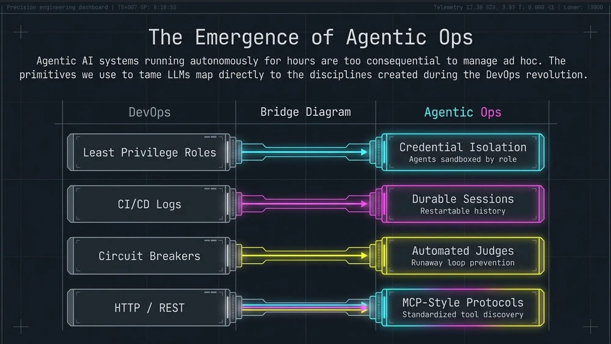

法律合同审阅

法律合同审阅智能体映射：

- Planner：按 ABA 的 Private Target M&A Deal Points Study 框架 [35] 或 Atticus Project 的 MAUD 评估结构 [36] 设定审阅范围。定义要分析哪些条款、适用哪些风险阈值、由哪个司法管辖区主导。
- Generator：起草逐条款分析：识别风险、对比市场标准、标记偏离。按特性逐一执行（每个 sprint 一种条款类型）。
- Evaluator：跑一个"控方 vs. 辩方"的智能体模式：一个 Evaluator 子智能体主张合同有风险，另一个主张可接受。框架壳在标记 sprint 完成前要求两种视角都到位。

为什么用控方 vs. 辩方模式：单一 Evaluator 容易出现确认偏差；它会按 Generator 的框定来评估。强制两种对立评估能浮现出 Generator 框定时回避掉的风险。控方与辩方之间的对抗张力比任何一方单独评估给出更完整的风险画面。

法律领域的 Sprint 契约示例：

- Feature Scope："分析赔偿条款（第 7.3 节）中的无上限责任敞口。"
- Verification Method："控方智能体：识别所有无上限责任情形。辩方智能体：识别所有缓解条件。"
- Pass/Fail Threshold："两个智能体必须完成各自分析。控方必须识别至少一项风险。辩方必须回应每一项被识别的风险。"
- Edge Case Traps："测试相邻条款隐含的赔偿义务。测试特定司法管辖区的责任上限。"

> ABA Deal Points Study 背景：ABA Business Law Section M&A 委员会下属的 Market Trends Subcommittee 发布的 Private Target Mergers and Acquisitions Deal Points Study（2025 年 12 月），考察了公开可得的私募并购交易中特定条款的出现频率。2025 年的研究覆盖了交易价格在 25M 至 900M 美元之间的 139 份正式收购协议。它涉及赔偿、陈述与保证、契约义务、交割条件，因此对在 M&A 上下文中工作的法律 Planner 智能体而言，是天然的基准框架 [35]。

> 💡
>
> MAUD 背景：MAUD（Merger Agreement Understanding Dataset），由 The Atticus Project 发布并被 EMNLP 2023 接收，是唯一一个专为合并协议审阅设计的专家标注数据集。它覆盖 152 份真实合并协议中的 92 个交易要点，含超过 39,000 个样本和 47,000+ 标注，为 Planner 要框定的同类条款类别提供了 NLP 评估结构 [36]。

财务研究

一个好的财务研究智能体的运作方式，应该更像一间新闻编辑室加一家审计事务所，而不是一位风度翩翩的分析师。

- Planner 是选题编辑：决定哪些问题重要、哪些来源算数、什么算"做完"。
- Generator 是采编台：抓引语、搭叙事、把财报与事件联系起来。
- Evaluator 是合规审计：对每一项主张比对原始文件，并拒绝任何无法溯源的内容。

换句话说，框架壳把研究从"写一份令人信服的备忘录"变成"产出一份经得起交叉盘问的备忘录"。

财务研究智能体映射：

- 定义范围（标的、时间区间、问题）：Planner，仅在规划阶段
- 处理财报电话会议记录：Generator，提取带时间戳的引语
- 分析 SEC 文件（10-K、10-Q）：Generator，与上一份文件交叉引用
- 综合替代数据：Generator，为每条主张记录数据来源
- 验证引用：Evaluator，把每项主张与来源文件匹配
- 标记未验证主张：Evaluator，凡无来源引用的主张
- 产出最终研究报告：Generator（最后一个 sprint）；Evaluator 重新核对所有引用

幻觉风险：财务研究尤其容易出现自信的幻觉。无法找到支撑引用的 Generator 可能编造一个看似合理的引用。Evaluator 的工作是把每项事实主张与它处理过的来源文件交叉比对。无法在源材料中验证的引用被标记为未验证。这一步不可省略：财务研究中的未验证引用带有监管和法律责任风险。

自动化对齐研究

实验（Anthropic）：Anthropic 跑了 9 个并行的 Claude Opus 4.6 自动化对齐研究员（Automated Alignment Researchers，AAR）[37]。这些智能体在五天内累计运行 800 小时，约每 AAR 小时 22 美元（总成本约 18,000 美元）[37]。任务：弱到强（weak-to-strong）监督问题（用更强模型的指导改进较弱模型的对齐，且人类监督最少）。结果：在该具体任务上的性能差距恢复率（Performance Gap Recovery, PGR）为 0.97，几乎弥合了监督差距 [37]。对照：两位人类研究员工作 7 天获得的 PGR 为 0.23 [37]。

泛化结论（已对源核验）：

- 把 AAR 们最高分的方法迁移到测试任务：数学（PGR 为 0.94）和编码（PGR 为 0.47，仍是人类基线的两倍）[37]。
- 作者把关键瓶颈识别为从想法执行转向评测设计："我们应找到 AAR 能可靠地做爬山优化、又不至于过拟合的合适指标（数据、模型）" [37]。

不可省略的细节：作者自身的告诫聚焦于评测设计：能可靠对一项指标做爬山的智能体，可能会过拟合到该指标，而不是解决潜在问题 [37]。架构能在规模上处理研究级问题，但泛化需要审慎；尤其要审视智能体被优化的评估指标的质量。

为什么这件事对更大的论证重要：即便有这条注意事项，9 个智能体在对齐问题上自主运行 800 小时，代表了一类此前不存在的能力——只有有了框架壳架构才存在。0.97 vs. 0.23（人类研究员）的 PGR 表明，智能体集群可以在受约束的研究任务上跑赢人类 [37]。评测过拟合的发现强化了本文更宏观的告诫：框架壳解决了编排问题，并不解决底层的智能问题。

## Token 经济：对抗式质量的代价

在长任务系统里，真正的问题不是"运行要花多少钱？"，而是"出错要付出多少代价？"

把对抗式验证想象成飞机的冗余仪表或一次财务审计：在它第一次防止重大失误之前，它感觉很贵。当 AI 系统产出面向客户的产物时，"差不多"不是成本优化，是负债。最贵的失败模式不是多花 token，而是把一个自信的错误发出去——引发品牌损害、客户流失，以及让任何推理账单都相形见绌的善后工作。

优化框架壳的方式有很多。你可以为高调用量的角色挑更便宜的模型、减少不必要的轮次、收紧 Sprint 契约以"快速失败"。但有一处是不能省的：验证。验证就是安全系统。如果你在它上面省钱，你不是在省钱，是在买风险。

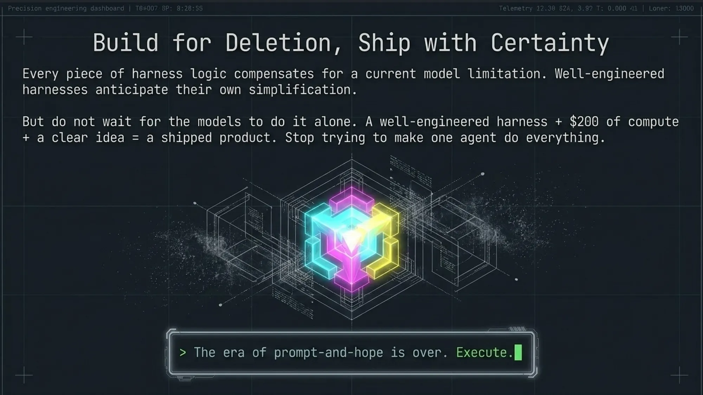

对抗循环的 15 倍 token 成本：

三智能体对抗式跑的 token 花费大约是同等单智能体跑的 15 倍。这是作者（Rick Hightower）观察到的测量结果，不是已发表的第三方基准。15 倍这个数字反映的是 5 到 15 轮对抗循环、且 Planner 与 Evaluator 都跑在 Opus 上的情况。这个开销是对抗式质量压力的代价。该比较的不是"15 倍 vs. 1 倍"，而是"15 倍换可工作的软件 vs. 1 倍换坏软件"。

层级化模型选型

并不是每个智能体都需要最强（也最贵）的模型。把模型能力与任务要求匹配起来。

层级化模型选型策略：

- Planner 用 Opus（Claude Opus 4.7）：规划需要最大推理深度；规划错误会渗透进所有后续 sprint。
- Generator 用 Sonnet（Claude Sonnet 4.6）：执行范围明确的 sprint；实现级任务不需要 Opus 级推理。
- Evaluator 用 Opus（Claude Opus 4.7）：评估需要对抗式深度；浅层 Evaluator 会把架构毁掉。
- Summarizer 用 Haiku（Claude Haiku 4.5）：用于日志、变更日志和进度文件的轻量摘要。

成本回收：层级化模型选型估计可在精度损失极小的前提下回收 30–40% 的对抗循环 token 开销。归属：作者观察测量；非已发表基准。回收主要来自把 Generator（最活跃的角色，跨所有 sprint 执行）从 Opus 切到 Sonnet。Planner 与 Evaluator 跑得没那么频繁，因此其 Opus 成本被摊薄。

"30–40% 成本回收"是作者观察值。定价数据确认成本比例：Haiku 的 1/5 美元比 Opus 的 5/25 美元便宜 80%；Sonnet 的 3/15 美元比 Opus 便宜 40% [14]。在对抗循环情境下"30–40%"的具体回收数字没有独立公开发表。

Claude Opus 4.7 与 Sonnet 4.6 中的 Adaptive Thinking

Adaptive Thinking 是 Claude 推理能力的"自动变速箱"：你设定驾驶模式，模型自己换挡。简单路面巡航，遇到陡坡——比如多步规划或棘手调试——则降挡。

它也像相机的可调光圈：开得更大，让更多光线进入复杂场景（更深思熟虑的推理）；调小一些，则在场景简单时让出片更快、更利落。

Adaptive Thinking 让模型可以根据任务复杂度花费可变的推理量。你不是设定一个固定 token 预算，而是设一个 effort 等级，让 Claude 按请求伸缩推理深度 [22]。

Adaptive Thinking effort 等级 [22]：

- max：始终思考，对深度无约束。可用于：Opus 4.7、Opus 4.6、Sonnet 4.6。
- xhigh：始终深度思考、做扩展探索。仅可用于 Opus 4.7。
- high：始终思考；对复杂任务做深推理。可用于：Opus 4.7、Opus 4.6、Sonnet 4.6。
- medium：中等思考；对简单查询可能跳过。可用于：Opus 4.7、Opus 4.6、Sonnet 4.6。
- low：最小化思考；对简单任务跳过。可用于：Opus 4.7、Opus 4.6、Sonnet 4.6。

各模型默认 effort 等级：在 Opus 4.7 上，默认 effort 是 xhigh。在 Opus 4.6 与 Sonnet 4.6 上，默认是 high（在 Pro 与 Max 计划上是 medium）[23]。

权衡：在 high effort 等级下，Adaptive Thinking 会在响应前生成更多内部推理 token。这会增加任务时长与 token 成本。第三方对 Claude Sonnet 4.6 的生产环境测试观察到，high effort 下响应时间约延长 40%，平均每次调查多约 5 次工具调用 [24]。Anthropic 文档指出，high effort 会生成更多内部 token，并建议在更简单任务上调到 medium 以降低延迟 [22]。注：40% 这个数字来自 Sonnet 4.6 生产测试（[resolve.ai](http://resolve.ai/)）。Opus 4.7 没有官方公布的逐模型百分比。

实操指引：

- 对 Planner 和 Evaluator 用 high Adaptive Thinking（最看重推理深度的位置）。
- 在 Opus 4.7 上，对特别复杂的分解任务，给 Planner 用 xhigh 或 max。
- 对范围明确的 Generator sprint 用 medium。
- 对 Haiku 4.5 上推理不是瓶颈的摘要任务，保留 low 或 none。

## Agentic Ops：正在浮现的学科

DevOps 之所以成形，是因为部署变得太严重，不能再靠 shell 脚本和侥幸来管理。这门学科把 CI/CD 流水线、基础设施即代码、监控与可观测性、事故响应预案标准化下来。

> "DevOps 因软件部署变得太复杂而出现"这一表述是个框定；要更深入了解 DevOps，可参考 Gene Kim 等人《The Phoenix Project》（2013）或 Humble & Farley《Continuous Delivery》（2010）。

Agentic Ops 因同样的原因正在浮现：在生产基础设施上自主运行数小时的智能体 AI 系统，已经太复杂、太严重，无法再用临时手段管理。执行多 sprint 任务、递归组合、长时间无人值守运行的 AI 智能体，需要软件部署在 DevOps 时代所要求的同等运营纪律。

四个运营原语

凭据隔离：每个智能体（Planner、Generator、Evaluator）应只用其角色所需的最少凭据来运营。Generator 需要对 Sandbox 的写权限；不应有访问生产数据库的权限。Evaluator 需要读权限和工具执行权；不应有写制品库的权限。把最小特权原则应用到智能体角色上。

持久会话：如上文 Managed Agents 一节所述：对话历史与任务日志独立于计算持久存在。持久会话让 6 小时的运行可在不丢工作的前提下被重启。这正在成为任何生产级智能体部署的基础设施门槛要求。

自动裁判：Evaluator 模式不止于三智能体框架壳。任何长运行的智能体进程都应有一个自动裁判，能在跑歪时拉下闸。自动裁判检查的是：失控的 token 花费、幻觉输出、策略违例、异常的工具使用模式。这是分布式系统中熔断器（circuit breaker）在智能体上的等价物。

> 把自动裁判类比为"分布式系统里的熔断器"是一个有用的类比。可考虑引用 Michael Nygard《Release It!》（2007）或 Netflix Hystrix 文档作为对熔断器模式的依据。

MCP 风格的工具协议：Model Context Protocol（MCP）标准化了智能体如何发现和调用工具 [39]。MCP 在 2024 年 11 月作为开放标准发布，并在 2025 年 12 月被捐赠给 Agentic AI Foundation（AAIF），这是由 Anthropic、Block 和 OpenAI 共同创立的 Linux Foundation 定向基金 [38]。到 2026 年 3 月，所有主要 AI 提供商（OpenAI、Google DeepMind、Microsoft、Cloudflare）都已采用 MCP，公开活跃的 MCP 服务端超过 10,000 个，月度 SDK 下载量达 9,700 万 [40]。一致的工具协议意味着 Evaluator 可在不同框架壳间复用同一套工具集（Playwright MCP 用于 UI 验证、数据库连接器用于数据验证，等等）。标准化协议让一个可组合的智能体工具生态成为可能，就像 HTTP 让可组合的 Web 成为可能。

这四项原语（凭据隔离、持久会话、自动裁判、MCP 风格协议）就是 Agentic Ops 将要标准化的内容，正如 DevOps 标准化了 CI/CD。今天构建智能体系统的团队，正在为 3–5 年后 Agentic Ops 的样子打地基。

## 为删除而构建

原则：框架壳逻辑应被设计成可在模型能力进步时被移除。

具体例子：

- Sprint 分解逻辑曾经是早期框架壳的必备组件。
- Planner 需要显式逻辑把长任务工作切成 sprint 大小的块。
- Opus 4.6 上线后，Planner 无需脚手架就能原生进行 sprint 分解。
- Sprint 分解逻辑被从 Opus 4.6 框架壳里删除了。
- 框架壳变得更简单。不是更差，是更简单。

含义：框架壳里的每一段逻辑都在弥补当前模型的某个局限。模型变好，这些局限就会缩小。设计良好的框架壳预见了自己的简化。写易于删除的框架壳逻辑，而不是把自己永久嵌进系统里的逻辑。最优秀的框架壳工程师，会以每季度删掉多少框架壳代码作为部分的成功指标。

反直觉的含义：在更强模型上跑的更简单框架壳，往往优于在更弱模型上跑的更复杂框架壳。框架壳的存在是为了补足模型能力，而不是替代它。当模型把框架壳的功能原生吸收进去后，框架壳应当收缩。

随着模型能力提升，给智能体更少结构（更少约束、更多自主）反而能改善结果。Sprint 分解逻辑就是因模型不再需要它而被从 Opus 4.6 框架壳中移除的。

## 创造平等

一个工程良好的框架壳，加上几百美元的算力，再加上一个好点子，就等于一件被发出的产品。这是新的。两年前还不是这样。

之前：

- 发布一款 DAW 需要数月工程工作和一个团队。
- 发布一款 2D 游戏引擎需要图形和游戏物理领域的专长。
- 在 JAX 里解 Boltzmann 方程需要宇宙学博士学位和数月数值调试。

现在，正如上文"概念验证"一节所示：

- 一个有清晰想法、能用框架壳和 200 美元算力的人就能发布 DAW。
- 一个人就能发布 2D 游戏引擎。
- 一个人就能在 Boltzmann 求解器上拿到亚百分比精度。

这是一次结构性的能力转移：谁能造软件被改变了。不是因为 AI 是魔法。而是因为框架壳架构让长任务执行可靠到能力的增长已经超过了入门门槛的下降。

## 结论：构建更好的框架壳

提示词加祈祷的时代正在结束。

早期的 AI 智能体部署靠的是希望：

- 希望模型好到能准确地自我评价。
- 希望 20 步的链条会成功。
- 希望上下文焦虑不会截断关键工作。
- 希望智能体能在偏离计划时自己注意到。

数学告诉你希望不是策略。0.95²⁰ = 0.36。靠希望的架构在 20 步任务上有 64% 的失败率。

未来属于对抗式系统。

更具体地说，未来属于那些让失败在结构上不可能、而不仅是统计上不太可能的智能体 AI 架构。

可行的模式：

- 把生成与判断分开。
- 在它们之间制造对抗张力。
- 让"完成"在工作开始前可验证。
- 用可从崩溃中存活的基础设施把这种张力维持在多小时的运行中。

行动号召：

不要再试图让一个智能体做所有事。

构建让 AI 智能体彼此竞争性挑战的系统。构建让质量从对抗张力中涌现的框架壳。构建让"完成"无歧义的 Sprint 契约。构建让崩溃可被存活的 Managed Agents 基础设施。

这套架构不是理论。它构建出了能用的 2D 游戏引擎、数字音频工作站，以及一个精度 0.1% 的 Boltzmann 求解器。

问题不是这个方法是否可行。问题是你要不要用它来构建。

## 参考资料

- [Anthropic Engineering — "Harness Design for Long-Running Application Development" (March 24, 2026)](https://www.anthropic.com/engineering/harness-design-long-running-apps)
- [Deng et al. — "SWE-Bench Pro: Can AI Agents Solve Long-Horizon Software Engineering Tasks?" (arXiv:2509.16941, September 2025)](https://arxiv.org/abs/2509.16941)
- [SWE-bench.com](http://swe-bench.com/) [— Leaderboards (2025)](https://www.swebench.com/)
- Scale Labs — SWE-bench Pro Public Leaderboard (SEAL)
- [Cognition AI — "Rebuilding Devin for Claude Sonnet 4.5: Lessons and Challenges" (2025)](https://cognition.ai/blog/devin-sonnet-4-5-lessons-and-challenges)
- [Inkeep — "Context Anxiety: How AI Agents Panic About Their Perceived Context Windows" (2025)](https://inkeep.com/blog/context-anxiety)
- [Vennemeyer et al. — "Sycophancy Is Not One Thing: Causal Separation of Sycophantic Behaviors in LLMs" (arXiv:2509.21305, 2025)](https://arxiv.org/abs/2509.21305)
- [Sharma et al. — "Towards Understanding Sycophancy in Language Models" (ICLR 2024)](https://openreview.net/forum?id=tvhaxkMKAn)
- [Chroma Research — "Context Rot: How Increasing Input Tokens Impacts LLM Performance" (2025)](https://www.trychroma.com/research/context-rot)
- [Goodfellow et al. — "Generative Adversarial Nets" (NeurIPS 2014 / arXiv:1406.2661)](https://arxiv.org/abs/1406.2661)
- [Fanous et al. — "SycEval: Evaluating LLM Sycophancy" (AAAI/ACM AIES 2025 / arXiv:2502.08177)](https://arxiv.org/abs/2502.08177)
- [Anthropic Engineering — "How We Built Our Multi-Agent Research System" (2025)](https://www.anthropic.com/engineering/multi-agent-research-system)
- [Harrasse, Bandi, Bandi — "Debate, Deliberate, Decide (D3): A Cost-Aware Adversarial Framework for Reliable and Interpretable LLM Evaluation" (arXiv:2410.04663, 2024)](https://arxiv.org/abs/2410.04663)
- [Anthropic — Pricing Documentation (2026)](https://www.anthropic.com/pricing)
- [Microsoft — "playwright-mcp" GitHub Repository (2025)](https://github.com/microsoft/playwright-mcp)
- Anthropic — "Playwright — Claude Plugin" ([claude.com/plugins/playwright](http://claude.com/plugins/playwright), 2025)
- [Wang et al. — "When Truth Is Overridden: Uncovering the Internal Origins of Sycophancy in Large Language Models" (arXiv:2508.02087, 2025)](https://arxiv.org/abs/2508.02087)
- [Scrum.org](http://scrum.org/) [— "Definition of Done vs. Acceptance Criteria Explained" (2024)](https://www.scrum.org/resources/blog/definition-done-vs-acceptance-criteria-explained)
- [Anthropic Engineering — "Effective Harnesses for Long-Running Agents" (November 2025)](https://www.anthropic.com/engineering/effective-harnesses-for-long-running-agents)
- TestDino — "Playwright MCP Explained" (2025)
- [Morph — "Compact: Context Compaction for AI Agents" (2025)](https://www.morphllm.com/products/compact)
- [Anthropic — "Adaptive Thinking" — Claude API Docs (2026)](https://platform.claude.com/docs/en/build-with-claude/adaptive-thinking)
- [Anthropic — "Effort Parameter" — Claude API Docs (2026)](https://platform.claude.com/docs/en/build-with-claude/effort)
- [resolve.ai](http://resolve.ai/) [— "Testing Claude Sonnet 4.6 Adaptive Thinking on Production AI Agents" (2026)](https://resolve.ai/blog/Our-early-impressions-of-Claude-Sonnet-4.6)
- [Anthropic — "Automatic Context Compaction | Claude Cookbook" (2026)](https://platform.claude.com/cookbook/tool-use-automatic-context-compaction)
- [Anthropic — "Context Compaction — Claude API Docs" (2026)](https://docs.anthropic.com/en/docs/build-with-claude/context-compaction)
- [Anthropic Engineering — "Scaling Managed Agents: Decoupling the Brain from the Hands" (2026)](https://www.anthropic.com/engineering/managed-agents)
- [Randy Bias / Cloudscaling — "The History of Pets vs Cattle and How to Use the Analogy Properly" (2012)](https://cloudscaling.com/blog/cloud-computing/the-history-of-pets-vs-cattle/)
- [jax-ml/jax — GitHub Repository](https://github.com/jax-ml/jax)
- [Wikipedia — "JAX (software)"](https://en.wikipedia.org/wiki/JAX_(software))
- [Lesgourgues — "The Cosmic Linear Anisotropy Solving System (CLASS) III: Comparison with CAMB for LambdaCDM" (arXiv:1104.2934, 2011)](https://arxiv.org/abs/1104.2934)
- [Kim & Khashabi — "Challenging the Evaluator: LLM Sycophancy Under User Rebuttal" (arXiv:2509.16533, 2025)](https://arxiv.org/abs/2509.16533)
- [Malmqvist — "Sycophancy in Large Language Models: Causes and Mitigations" (arXiv:2411.15287, 2024)](https://arxiv.org/abs/2411.15287)
- [Anthropic — Claude Models Overview (February 2026)](https://platform.claude.com/docs/en/about-claude/models/overview)
- ABA Business Law Section Market Trends Subcommittee — "2025 Private Target Mergers & Acquisitions Deal Points Study" (December 2025)
- [Wang et al. (The Atticus Project) — "MAUD: An Expert-Annotated Legal NLP Dataset for Merger Agreement Understanding" (EMNLP 2023 / arXiv:2301.00876)](https://arxiv.org/abs/2301.00876)
- [Anthropic Alignment Science Blog — "Automated Weak-to-Strong Researcher" (2026)](https://alignment.anthropic.com/2026/automated-w2s-researcher/)
- [Anthropic — "Donating the Model Context Protocol and Establishing the Agentic AI Foundation" (December 2025)](https://www.anthropic.com/news/donating-the-model-context-protocol-and-establishing-of-the-agentic-ai-foundation)
- [Anthropic — "Introducing the Model Context Protocol" (November 2024)](https://www.anthropic.com/news/model-context-protocol)
- [Wikipedia — "Model Context Protocol"](https://en.wikipedia.org/wiki/Model_Context_Protocol)

## 关于作者

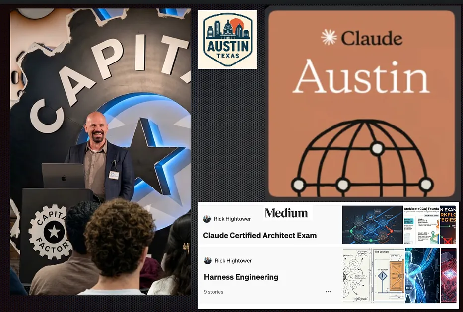

Rick Hightower 是一位前财富 100 强公司高级杰出工程师，专注于把 ML/AI 洞见交付到一线应用，也是构建多智能体生产系统的实践者。在 Medium 关注他可获取更多动手向的智能体工程内容。也可邀请他为团队做演讲和培训：参见 [Rick Hightower's SpeakerHub](https://speakerhub.com/speaker/richard-matthew-hightower)。

他创建了 skilz——[通用智能体技能安装器](https://skillzwave.ai/docs/)，支持 30 多个编码智能体，包括 Claude Code、Gemini、Copilot 和 Cursor，并联合创立了世界上最大的智能体技能市场。可在 [LinkedIn](https://www.linkedin.com/in/rickhigh/) 或 [Medium](https://medium.com/@richardhightower) 上联系 Rick Hightower。也可关注 [SpillWave](https://spillwave.com/)，AI 专长的来源。

Rick 多年来一直在主动开发生成式 AI 系统、智能体和智能体工作流。他是大量智能体框架与开发者工具的作者，并为希望采纳 AI 的团队带来深厚的实战专长。他喜欢用第三人称写自己。

Rick 还写了一系列 [Claude Certified Architect](https://medium.com/@richardhightower/claude-certified-architect-the-complete-guide-to-passing-the-cca-foundations-exam-9665ce7342a8)（CCA）文章，里面有大量关于编写智能体 AI 系统的有用信息。CCA 与考试预备里的很多想法都和你在本文看到的内容呼应。如果你想提升自己创建良好行为的 AI 智能体的能力，备考 CCA 是一个好起点。

## CCA 智能体开发备考

- [Claude Certified Architect: The Complete Guide to Passing the CCA Foundations Exam](https://medium.com/@richardhightower/claude-certified-architect-the-complete-guide-to-passing-the-cca-foundations-exam-9665ce7342a8)
- [CCA Exam Prep: Mastering the Code Generation with Claude Code Scenario](https://medium.com/@richardhightower/cca-exam-prep-mastering-the-code-generation-with-claude-code-scenario-95f2d8d06742)
- [CCA Exam Prep: Mastering the Multi-Agent Research System Scenario](https://medium.com/@richardhightower/cca-exam-prep-mastering-the-multi-agent-research-system-scenario-aa0c446a5e7d)
- [CCA Exam Prep: Structured Data Extraction](https://medium.com/@richardhightower/cca-exam-prep-structured-data-extraction-86ad3c7541a3)
- [CCA: Master the Developer Productivity Scenario](https://medium.com/@richardhightower/cca-master-the-developer-productivity-scenario-for-the-claude-certified-architect-exam-from-e402d9bb277d)
- [Claude Certified Architect: Master the CI/CD Scenario](https://medium.com/@richardhightower/claude-certified-architect-master-the-ci-cd-scenario-for-the-cca-foundations-exam-the-flags-de2478a346da)
- [CCA Exam Prep: Mastering the Customer Support Resolution Agent Scenario](https://medium.com/@richardhightower/claude-code-certification-exam-prep-mastering-the-customer-support-resolution-agent-scenario-5b82a086eaf8)

Rick 还写了一个关于框架壳工程及如何用框架壳工程为反馈循环和对抗式智能体改进智能体系统的系列。这些文章和本文相辅相成。

## 框架壳工程系列文章


- [The $9 Disaster: What Anthropic's Harness Design Paper Teaches Us About Building Autonomous AI](https://medium.com/@richardhightower/the-9-disaster-what-anthropics-harness-design-paper-teaches-us-about-building-autonomous-ai-2f76c3d86dd9)
- [Harness Engineering vs Context Engineering: The Model is the CPU, the Harness is the OS](https://medium.com/@richardhightower/harness-engineering-vs-context-engineering-the-model-is-the-cpu-the-harness-is-the-os-51b28c5bddbb)
- [LangChain Deep Agents: Harness and Context Engineering: Memory, Skills, and Security](https://medium.com/@richardhightower/langchain-deep-agents-harness-and-context-engineering-memory-skills-and-security-a68737d84940)
- [Beyond the AI Coding Hangover: How Harness Engineering Prevents the Next Outage](https://medium.com/@richardhightower/beyond-the-ai-coding-hangover-how-harness-engineering-prevents-the-next-outage-e6fae5fe4d3b)
- [LangChain's Harness Engineering: From Top 30 to Top 5 on Terminal Bench 2.0](https://medium.com/@richardhightower/langchains-harness-engineering-from-top-30-to-top-5-on-terminal-bench-2-0-8895dbab4932)
- [Anthropic's Harness Engineering: Two Agents, One Feature List, Zero Context Overflow](https://medium.com/@richardhightower/anthropics-harness-engineering-two-agents-one-feature-list-zero-context-overflow-7c26eb02c807)
- [OpenAI's Harness Engineering Experiment: Zero Manually-Written Code](https://medium.com/@richardhightower/openais-harness-engineering-experiment-zero-manually-written-code-100a24ad04cf)
