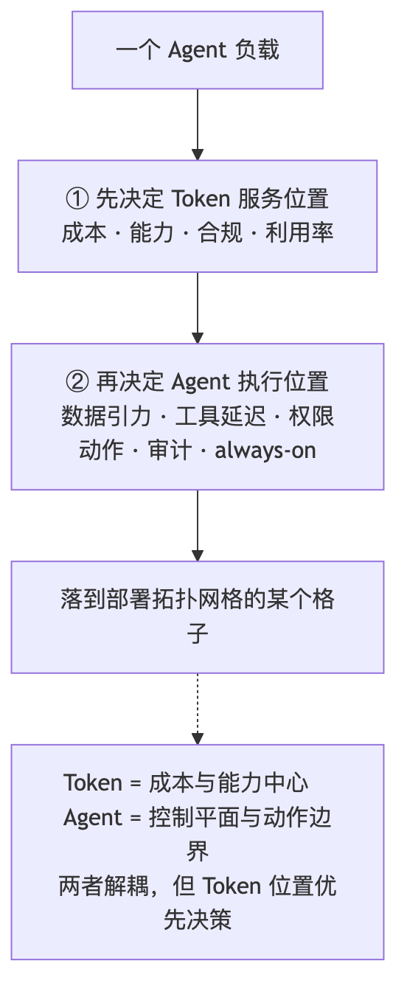
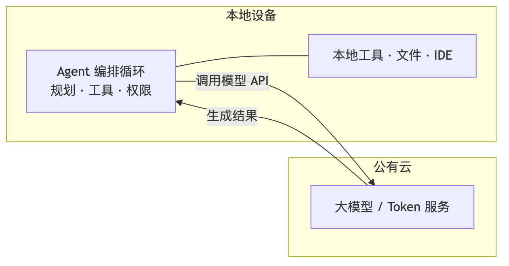
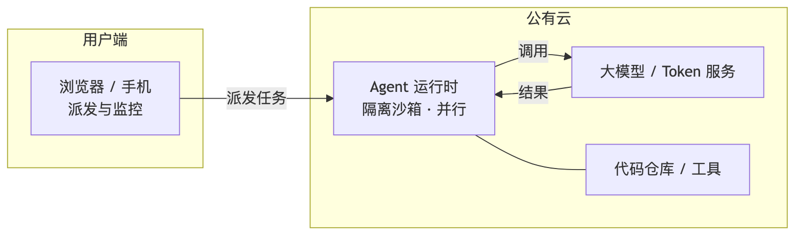
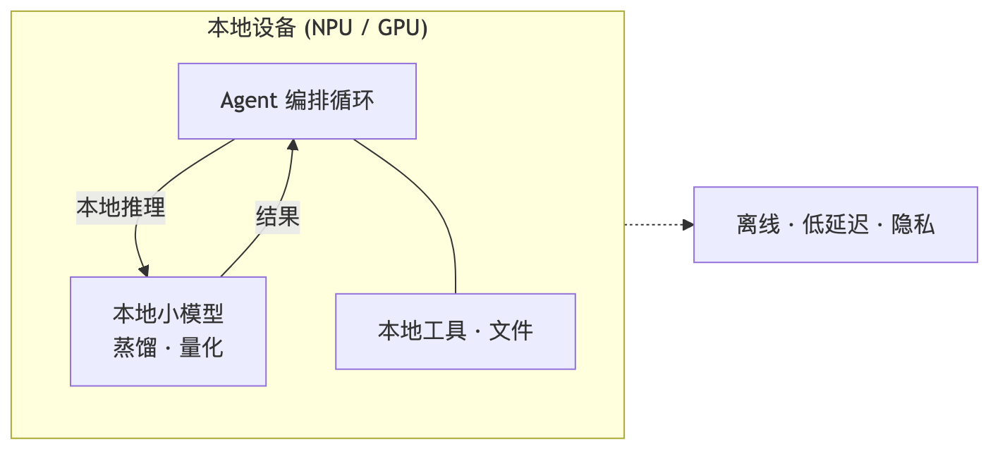
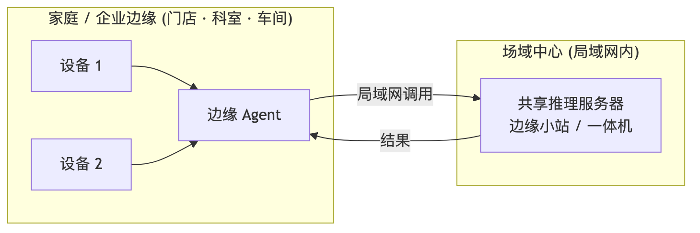
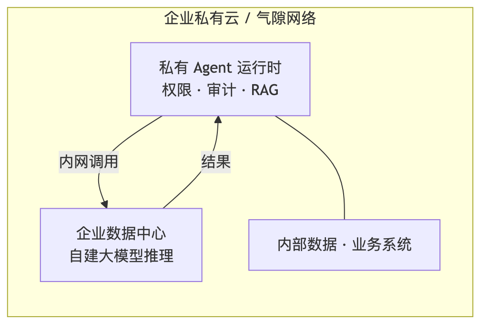
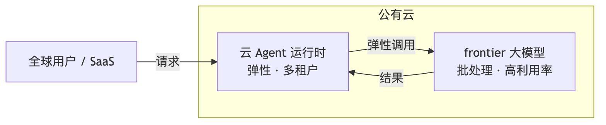
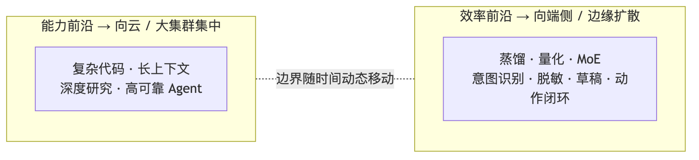
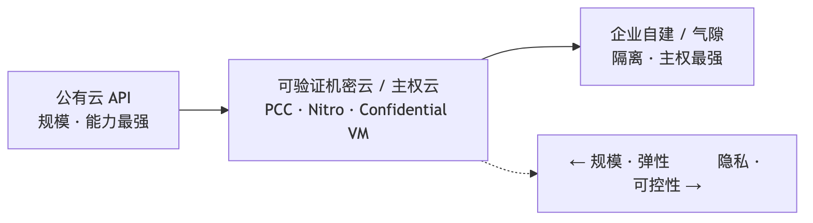

---
作者：roger
日期：2026-06-04
说明：本文是上一篇《从「发送到云端」说起》的续篇，探讨 AI Agent 的部署拓扑会如何演化。文章由我与 Codex 经过三轮辩论（首轮分析 → 我提出五点质疑 → Codex 逐条回应并修订）后综合而成；过程中双方在 Token 经济学、可验证私有云、中国一体机可持续性、能力边界等问题上发生过分歧并最终收敛。所有事实尽量内嵌官方一手链接，并已逐条用程序验活；少数官网（HPE、部分页面）对自动化抓取返回拦截但浏览器可访问，已在文末说明。
---

# 「发送到云端」之后：AI Agent 的部署拓扑会走向哪里

## 引子：按钮按下之后的下一个问题

上一篇文章从 Claude Code 的「Send to cloud」按钮讲起：任务从"本地 Agent + 云端 Token 服务"，开始出现"云端 Agent + 云端 Token 服务"这种新形态——[Claude Code on the web](https://www.claude.com/blog/claude-code-on-the-web) 和 [OpenAI Codex](https://openai.com/index/introducing-codex/) 都把任务派到云端自主跑完再交回。

那么再往后呢？最近 NVIDIA 把"个人 AI 超算"摆上桌面（[DGX Spark](https://www.nvidia.com/en-us/products/workstations/dgx-spark/)），Apple、Microsoft 在把模型塞进端侧设备，中国则刮起"大模型一体机"的私有化部署风。一个自然的问题浮现：会不会出现大量**本地 Agent + 本地 Token**、**家庭/企业内 Agent + 中心 Token**、甚至**企业私有云 Agent + 企业数据中心 Token**的形态？

这篇文章把这个问题走一遍。需要先说明的是：本文不是单方判断，而是我与 Codex 三轮辩论后的综合——其中几个关键结论，恰恰是在分歧和反驳中被修正出来的。

---

## 一、两根轴，和一个被辩论改写的核心结论

把任何 Agent 系统拆成两个**正交**的维度：

- **Agent 编排/执行位置**：负责规划、状态管理、工具调用、权限控制、文件/应用/设备操作、长任务调度的位置。
- **Token 服务（模型推理）位置**：负责模型推理、上下文处理、生成 token、模型路由的位置。

关键前提是：**这两者不必在同一个地方。** [Claude Code](https://www.claude.com/product/claude-code) 在本地终端跑 Agent 循环，却调用云端模型 API；Codex 既有本地 CLI、又有云端并行 Agent。它们不是"谁取代谁"，而是同一张网格上的不同格子。

辩论一开始，我们倾向把这张网格看成"六个并列的市场"。但经过交锋，框架被改写成一个更锋利的判断：

> **Token 服务是成本与能力中心，Agent 是控制平面与动作边界。两者解耦，但应先决定 Token 放哪（看成本、合规、能力），再让 Agent 位置跟随数据、工具、权限和动作延迟。**

为什么是这个顺序？因为 Agent 编排本身很"轻"——[OpenAI Agents SDK](https://openai.github.io/openai-agents-python/agents/) 把 agent 定义为带 instructions、tools、handoffs、guardrails 的 LLM 配置，[LangChain](https://docs.langchain.com/oss/python/langchain/agents) 也把 agent 描述为"让模型决定调用哪些工具并迭代"的系统。真正昂贵、且反复发生的，是模型推理生成 token。所以"贵的那部分放哪"才是主矛盾；Agent 跑哪，主要被"数据引力（data gravity）"和"到工具的延迟"牵引。

下面这张表因此应被读作**部署诊断矩阵**（帮你判断某个负载该落哪格），而不是六个体量相当的市场。

*图1：决策顺序——先按成本/能力/合规决定 Token 放哪，再让 Agent 位置跟随数据引力、工具延迟、权限与审计。Token 是成本与能力中心，Agent 是控制平面与动作边界。*

### 部署拓扑诊断矩阵

| 格子 | 适合的工作负载 | 决定变量 | 现实样本 |
|---|---|---|---|
| 本地 Agent + 云 Token | 代码编辑、桌面自动化，需本地文件/IDE 权限但仍要最强模型 | 本地工具可达性、模型质量、云 API 成本、数据出域边界 | [Claude Code](https://www.claude.com/product/claude-code) / Cursor |
| 云 Agent + 云 Token | 异步长任务、并行修 bug、批量审查、手机/浏览器发起的后台任务 | always-on、并行度、沙箱隔离、仓库托管位置 | [Claude Code on the web](https://www.claude.com/blog/claude-code-on-the-web) / [Codex](https://openai.com/index/introducing-codex/) |
| 本地 Agent + 本地 Token | OS/应用控制、低延迟交互、敏感改写、局部补全、离线助手 | NPU/GPU/RAM、散热/电池、量化蒸馏、可接受质量阈值 | [Copilot+ PC](https://www.microsoft.com/en-us/windows/copilot-plus-pcs) / [Apple 端侧模型](https://machinelearning.apple.com/research/introducing-apple-foundation-models) / [LM Studio](https://lmstudio.ai/) |
| 边缘 Agent + 中心 Token | 家庭中枢、门店/工厂/医院科室多设备共享推理 | 多设备摊销、局域网低延迟、数据不出场域、7×24 | [华为昇腾端边云](https://e.huawei.com/cn/products/computing/ascend) / [Atlas 500 A2 小站](https://e.huawei.com/cn/products/computing/ascend/atlas-500) |
| 私有云 Agent + 企业数据中心 Token | 金融/医疗/政务/制造研发、涉密气隙、内部 RAG | 合规、数据驻留、审计、GPU 利用率、供应链主权 | [NIM 气隙部署](https://docs.nvidia.com/nim/large-language-models/latest/deployment/air-gap-deployment.html) / [Red Hat OpenShift AI](https://docs.redhat.com/en/documentation/red_hat_openshift_ai_self-managed/3.4/html/installing_and_uninstalling_openshift_ai_self-managed_in_a_disconnected_environment/deploying-openshift-ai-in-a-disconnected-environment_install) |
| 公有云 Agent + 公有云 Token | frontier 推理、短期峰值、全球 SaaS、训练/微调实验 | 弹性、模型可得性、供应商锁定、跨境合规、单位 token 价格 | [NVIDIA NIM](https://www.nvidia.com/en-us/ai-data-science/products/nim-microservices/) / [阿里云百炼](https://www.alibabacloud.com/help/zh/doc-detail/2579562.html) |

六种模式的示意图如下（同一套视觉语言：黄色块=物理场域，紫色块=Agent/模型节点，箭头=Agent 调用 Token 与返回结果）：

*图2：本地 Agent + 云 Token（当前主流）——Agent 循环在本地、握有本地文件/IDE 权限，推理调用云端大模型 API。*

*图3：云 Agent + 云 Token（新兴）——从浏览器/手机派发任务，Agent 在云端隔离沙箱并行运行并调用云端模型。*

*图4：本地 Agent + 本地 Token——端侧 NPU/GPU 上跑小模型，离线、低延迟、隐私敏感的子任务与动作闭环。*

*图5：边缘 Agent + 中心 Token——门店/科室/车间内多设备共享一台局域网中心的推理服务器（边缘小站/一体机）。*

*图6：私有云 Agent + 企业数据中心 Token——强合规/气隙环境，Agent 运行时与自建推理都在企业内网，紧贴内部数据。*

*图7：公有云 Agent + 公有云 Token——frontier 推理、并行长任务、全球 SaaS 的主场，靠弹性与批处理摊薄成本。*

---

## 二、先看 Token 放哪：成本、能力、合规三股力

### 2.1 成本经济学：本地不是默认的便宜选项（一个被辩论纠正的判断）

辩论中我最先质疑的，就是"本地推理更便宜"这个流行直觉。结论是：**对单人/低利用率场景，本地默认不便宜。**

云端推理有结构性成本优势，因为它能靠**连续批处理（continuous batching）、KV/prefix cache 复用、高利用率**摊薄 GPU 成本——这正是 [vLLM](https://vllm.ai/) 的 PagedAttention 和 [NVIDIA NIM](https://www.nvidia.com/en-us/ai-data-science/products/nim-microservices/) 在做的事。云厂商还有价格杠杆：[OpenAI 的 Batch API](https://developers.openai.com/api/docs/pricing) 对输入输出再打五折，cached input 价格只有标准价的十分之一量级。

反过来，一台 [DGX Spark 官方售价约 4,699 美元](https://www.nvidia.com/en-us/products/workstations/dgx-spark/)，服务单人时大部分时间闲置。即便按 36 个月折旧，仅硬件就约 130 美元/月，再加电费、运维、闲置和模型换代的机会成本——粗算下来，单人本地推理的单位成本很难跑赢云端批处理。

所以本地/边缘 Token 真正稳定的护城河，不是成本，而是**隐私、低延迟交互、离线、合规**这四项；成本只在"负载稳定 + 硬件利用率高 + 可接受较小/开源模型 + 已有运维能力"同时成立时才成为第五项优势——而企业数据中心和边缘中心，比个人 PC 更容易满足这些条件。

### 2.2 能力边界：是动态的，会随前沿水涨船高而移动

第二个被辩论纠正的判断，是"小模型够用"的稳定性。事实是前沿仍在快速移动：[Stanford HAI 2026 AI Index](https://hai.stanford.edu/ai-index/2026-ai-index-report/technical-performance) 显示前沿模型一年内在 Humanity's Last Exam 上提升约 30 个百分点，且截至 2026 年 3 月最强闭源模型对最强开源模型的领先从 2024 年 8 月的 0.5% 扩大到 3.3%；[Epoch AI](https://epoch.ai/data/ai-models) 也持续记录训练 compute 的攀升。

但这不是单向"向云回摆"，而是**两条前沿同时移动**：

- **能力前沿向云/大集群集中**：复杂代码、长上下文法律/医疗、深度研究、高可靠 Agent，会继续靠最强模型，留在公有云或大型私有云。
- **效率前沿向端侧扩散**：过时一代的能力通过蒸馏、量化、MoE 下沉到本地。[DGX Spark 单机可跑至 200B 参数](https://www.nvidia.com/en-us/products/workstations/dgx-spark/)，Apple 端侧约 [3B 模型](https://machinelearning.apple.com/research/introducing-apple-foundation-models)，[DeepSeek-R1 提供 1.5B–70B 蒸馏模型](https://github.com/deepseek-ai/DeepSeek-R1)，[Qwen3 覆盖 0.6B–235B](https://qwenlm.github.io/blog/qwen3/)，Google [Gemma 3n](https://deepmind.google/models/gemma/gemma-3n/) 和 Microsoft [Phi Silica](https://learn.microsoft.com/en-us/windows/ai/cards/phi-silica-platform-card) 都瞄准端侧。

*图8：两条前沿同时移动——最难/最高价值的任务向云和大集群集中，过时一代的能力向端侧扩散；"本地够用"的边界因此是动态的，而非固定。*

结论：本地 Token 在**请求数量**上会增长，但在**最高难度/最高价值的 token** 上不一定增长。它更像 Agent 系统的"第一跳、过滤器、动作闭环"——做意图识别、权限判断、工具参数填充、敏感信息脱敏、草稿生成，把困难推理路由给云端或私有数据中心的大模型。

### 2.3 端侧硬件：把"够用"变成固定成本、低延迟、可离线的能力

端侧这一层正在快速成熟：NVIDIA [DGX Spark](https://www.nvidia.com/en-us/products/workstations/dgx-spark/)（GB10 Grace Blackwell、128GB 统一内存、1 PFLOP FP4，官方明确卖点是"在本地安全地构建和运行自主 AI Agent"）与 [DGX Station](https://nvidianews.nvidia.com/news/nvidia-announces-dgx-spark-and-dgx-station-personal-ai-computers)；Microsoft [Copilot+ PC](https://www.microsoft.com/en-us/windows/copilot-plus-pcs)（门槛 40+ TOPS NPU）；[AMD Ryzen AI 300](https://www.amd.com/en/newsroom/press-releases/2024-6-2-amd-unveils-next-gen-zen-5-ryzen-processors-to-p.html)（NPU 最高 50 TOPS）；[Qualcomm Snapdragon X](https://www.qualcomm.com/laptops/products)。本地推理软件把 Token 服务"商品化"：[Ollama](https://ollama.com/)、[LM Studio](https://lmstudio.ai/)、[llama.cpp](https://github.com/ggml-org/llama.cpp)（个人/工作站）与 [vLLM](https://vllm.ai/)、NIM（服务器）。

---

## 三、再看 Agent 跑哪：数据引力、动作边界、控制平面

Token 位置定了之后，Agent 位置由另一组变量决定，而且它有**独立的决定性**——这是辩论中 Codex 坚持、我也认同的一点：

- **权限与动作边界**：能否操作本地文件、IDE、浏览器、数据库、内网系统、OT 设备，取决于 Agent runtime 在哪、握有什么凭据和沙箱，而不取决于 Token 在哪。
- **数据引力**：大量代码仓库、日志、设计文件、医疗/工控数据沉在内网或设备侧，Agent 留在数据旁边可减少搬运和权限暴露。
- **审计与责任**：谁授权、调了什么工具、读写了什么、失败如何回滚——这是控制平面问题。
- **离线与 always-on**：云端 Agent 适合长任务/并行，边缘 Agent 适合门店/工厂/科室连续运行，本地 Agent 适合桌面动作闭环。

协议层在强化"Agent 靠近工具和数据"：Anthropic 的 [Model Context Protocol（MCP，模型上下文协议）](https://www.anthropic.com/news/model-context-protocol) 让本地文件系统、浏览器、数据库、企业 SaaS 都能把能力暴露给 Agent。当工具都能被 MCP 触达时，本地/内网 Agent 的价值上升——云端模型仍可参与推理，但不一定拥有工具执行权。

---

## 四、第三条路：可验证私有云，会分走"既要隐私又要 frontier"的需求

辩论中我提出的一个反方观点被部分采纳：**强合规需求不会简单二分为"公有云 API"与"企业自建气隙"，中间还有一条正在变宽的路——可验证的私有/机密计算云。**

旗舰案例是 Apple [Private Cloud Compute（PCC）](https://security.apple.com/blog/private-cloud-compute/)：端侧优先处理，复杂请求才进入 PCC，而 PCC 把无状态计算、端到端加密、软件透明度、远程证明、外部研究者可验证组合起来，[官方安全指南](https://security.apple.com/documentation/private-cloud-compute)明确把"对个人数据的无状态计算"和"可验证透明度"列为安全目标。它证明了"云端规模 + 可验证隐私"可以同时成立。

更广义地，机密计算（confidential computing）在三大云都已产品化：[AWS Nitro Enclaves](https://aws.amazon.com/ec2/nitro/nitro-enclaves/)、[Google Confidential VM](https://docs.cloud.google.com/compute/docs/about-confidential-vm)、[Azure Confidential Computing](https://learn.microsoft.com/en-us/azure/confidential-computing/overview)；主权云也在跟进：[Microsoft Sovereign Cloud](https://learn.microsoft.com/en-us/industry/sovereign-cloud/overview/microsoft-sovereign-cloud)、[AWS European Sovereign Cloud](https://aws.eu/european-sovereign-cloud/)。

*图9：第三条路。从左到右规模/弹性递减、隐私/可控性递增；中间的"可验证机密云/主权云"会分走一部分"既要隐私又要 frontier 能力"的需求，使强合规不再只能二选一。*

但它不会完全吃掉自建/气隙，原因有三：其一，PCC 目前是 Apple 生态内的架构，不是通用企业 LLM 托管标准；其二，机密计算主要降低"宿主机看到运行中数据"的风险，但司法辖区、控制平面、模型权重可控性、监管现场检查仍在;其三，气隙不只为隐私，也为运营隔离、国家安全、涉密网络和供应链主权——[NIM 气隙部署](https://docs.nvidia.com/nim/large-language-models/latest/deployment/air-gap-deployment.html) 和 [Red Hat OpenShift AI 断网安装](https://docs.redhat.com/en/documentation/red_hat_openshift_ai_self-managed/3.4/html/installing_and_uninstalling_openshift_ai_self-managed_in_a_disconnected_environment/deploying-openshift-ai-in-a-disconnected-environment_install) 服务的正是这类需求。企业级的整包交付（[NVIDIA AI Computing by HPE](https://nvidianews.nvidia.com/news/hpe-nvidia-ai-computing-generative-ai)、Dell AI Factory 等）也在把"私有 Agent 运行时 + 推理 + 治理"打包成采购品类。

所以修订后的判断是：**强合规需求会分流到三类——自建/气隙、可验证机密云、托管私有云/主权云——不同国家与行业的比例不同。**

---

## 五、中美分化：同一张网格，不同的重心

### 美国/欧洲

更可能接受"托管私有云 / confidential AI / 主权云"，因为它保留了云端规模、模型更新和运维能力。端侧则走"端云混合"：Apple 的端侧 + PCC、Microsoft 的 Copilot+ PC + 云、NVIDIA 的 DGX Spark/RTX AI PC。

### 中国

本地化拉力明显更强，由三股力量叠加：**数据出境监管**（网信办[《促进和规范数据跨境流动规定》](https://www.cac.gov.cn/2024-03/22/c_1712776612187994.htm)、[《数据出境安全评估办法》](https://www.cac.gov.cn/2022-07/07/c_1658811536396503.htm)）、**信创/国产化采购**、以及**出口管制下对可控算力供应链的重估**。供给侧也成熟了：[华为昇腾端边云](https://e.huawei.com/cn/products/computing/ascend)、[百度千帆私有化与昆仑芯一体机](https://cloud.baidu.com/deepseek.html)、[商汤大模型一体机](https://www.sensecore.cn/product/AI-in-One)、[ZStack 智塔一体机](https://www.zstack.io/product/aiosDeepSeek/)、以及联想/华为的[信创 AI PC](https://www.lenovo.com.cn/wiki/article-51809.html)。

**但 2025 的"一体机元年"需要降温。** 这是辩论中证据最扎实的一处修正。一方面，私有化在强合规行业是真需求：[中国信通院《大模型一体机应用研究报告（2025）》](https://www.caict.ac.cn/kxyj/qwfb/ztbg/202510/P020251031405764520571.pdf) 指出一体机降低使用门槛、推理一体机是当前落地主导形态，政务/金融/医疗/制造在数据安全和私有化上有明确选型需求；政府采购网也能看到真实项目（如某高校"AI 大模型训练与推理一体机"[中标 618 万元](https://www.ccgp.gov.cn/cggg/zygg/zbgg/202504/t20250411_24429839.htm)）。另一方面，**热度与复购并不匹配**：据中国电信天翼智库在 [C114 的跟踪](https://www.c114.com.cn/news/117/a1300068.html)，截至 2025 年 9 月全国大模型一体机累计中标金额仅约 2752 万元、全年预估约 3669 万元，远低于年初乐观预测；信通院同一报告也提醒本地化会抬高初始采购与运维成本，更适合"数据隐私要求极高、业务规模稳定、且有资金与技术能力"的用户。

结论：**中国的一体机热里有明显的 DeepSeek 出圈 + 信创采购脉冲；可持续的部分不是"买台盒子跑 DeepSeek"，而是行业化、可运维、可扩容的私有 AI 平台。** 没有强合规、固定高并发或内网数据闭环的中小企业，真实经济性通常仍不如公有云 MaaS 或托管私有云。

---

## 六、回到最初的问题：那几种形态会出现吗？

逐一回应引子里的设想：

- **本地 Agent + 本地 Token**：会出现，但定位是"高频、低风险、隐私敏感、低延迟、可离线"的子任务与动作闭环（DGX Spark、Copilot+ PC、Apple 端侧）。它不是 frontier 替代品，而是 Agent 的"第一跳"。
- **家庭/企业内 Agent + 中心 Token（边缘集中推理）**：会出现在多设备共享、局域网低延迟、数据不出场域的场景（门店、工厂、医院科室、园区），昇腾边缘小站、NIM on edge 是现实供给。成立条件是"多设备摊销 + 可运维"。
- **企业私有云 Agent + 企业数据中心 Token**：会在金融、医疗、政务、制造研发、涉密气隙规模化出现，尤其在中国；但它会与"可验证机密云/主权云"分享这块市场，而非独占。
- **云 Agent + 云 Token**：仍是 frontier 推理、并行长任务、全球 SaaS 的主场。

一句话总结：**不会收敛到单一拓扑，而是按"Token 的成本/能力/合规"先分流、再让 Agent 跟随数据与动作分布。** 未来的常见结构是混合的——本地小模型做前处理与动作、云端或私有大模型做困难推理、控制平面按合规和数据引力就近放置。

---

## 七、追踪信号

1. **可验证机密云的成熟度**：confidential computing / 主权云 / PCC 式架构能否成为通用企业 LLM 托管标准——它直接决定"自建气隙"的份额会被分走多少。
2. **端侧"够用线"的移动速度**：蒸馏/量化/MoE 把多旧一代的能力下沉到 NPU，与 frontier 上移的速度赛跑，决定本地 Token 的请求占比。
3. **中国一体机的复购/扩容曲线**：2025 之后是否从"采购脉冲"转为"行业化、可运维、可扩容"的结构性需求——盯政府采购与厂商财报的复购数据，而非舆情热度。

---

## 八、方法与时效声明

- 本文是我与 Codex 三轮辩论的产物：Codex 出首轮分析（[drafts/codex-r1.md](../drafts/codex-r1.md)）→ 我提出五点质疑（Token 经济学、可验证私有云、一体机可持续性、能力边界、框架重心）→ Codex 逐条回应并修订（[drafts/codex-r2.md](../drafts/codex-r2.md)）。多个结论（本地非成本默认、第三条路、一体机降温、动态边界）是在分歧中收敛的。
- 所有链接在成文时已逐条用程序验活。少数官网（如 HPE）对自动化抓取返回拦截、但在浏览器中可正常访问；个别 docs.redhat.com、openai.com/index 页面 curl 返回 403 亦属反爬，非失效。
- 价格、TOPS、参数、中标金额等数字以 2026-06 前后公开信息为准，变动很快，引用前应复核。凡缺乏官方一手来源的判断，文中已标注或降级处理；中国一体机市场数据以信通院报告与天翼智库/C114 跟踪为口径。
- 配图（图1–图9）为示意图，用 draw.io 生成（Mermaid → draw.io），并渲染为 PNG。每张图的源码见 [images/](images/) 目录下同名 `.mmd` 文件，在线可编辑链接见 [images/编辑器链接.md](images/编辑器链接.md)，便于复用与修改。
