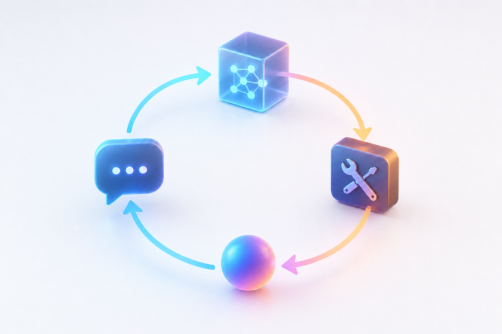
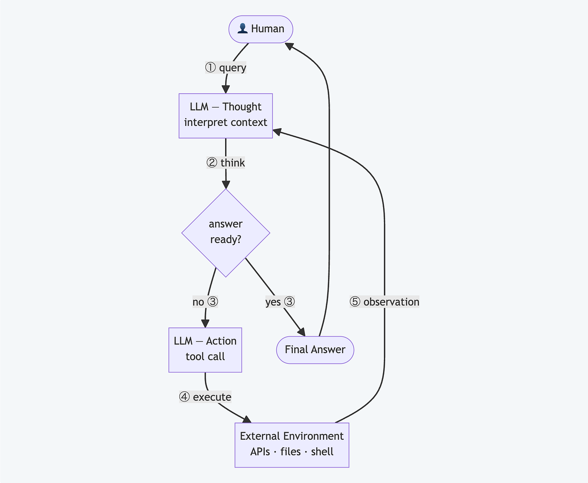
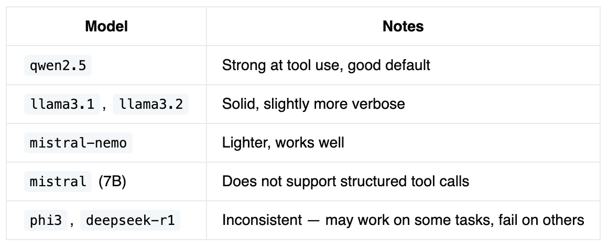
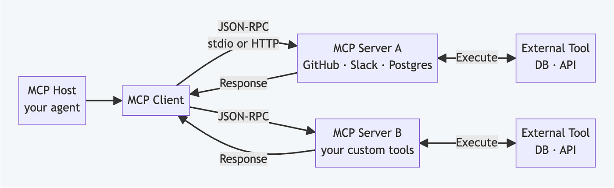

> 作者：Sergey Nes
> 发布日期：2026-05-05
> 原文链接：https://levelup.gitconnected.com/building-an-ai-agent-from-scratch-no-magic-just-a-deterministic-loop-a916161705fb

# 从零构建 AI 智能体：没有魔法，只有一个确定性循环

我每天都在用 Claude、Codex、Cursor、Gemini、Copilot 或 Junie，但仍然指不出哪一行代码让"chatbot"变成了"agent"，也说不清是什么让它们成为智能体（agent）。所以我自己从零写了一个最朴素的版本，把这件事弄个清楚。



对我来说，理解一个新概念最好的方式就是把它做出来，再讲给别人听。这篇文章两件事都做：把这次实验的过程和一个动手教程合在一起，我保证你会觉得有用。

我们会从 50 行 Python 出发，先连上 OpenAI，再换成通过 Ollama 运行的本地模型，构建一个同时使用两者的混合模式，加入工具（tool），实现 MCP，最后和 Claude CLI 做对比。读完之后，你会清清楚楚看到引擎盖下到底发生了什么。

不用 LangChain，不用 LangGraph，不用 CrewAI。只要 Python、一个大语言模型（LLM），还有一个 while 循环。

## 我们要构建什么（规格说明）

在动手之前，先得定义这个东西是什么、它要做什么。

一个 AI 智能体（AI agent）就是这样一个程序：

- 接收用户给定的高层任务
- 推理下一步该做什么
- 执行某个动作（调用工具、搜索网页、读取文件）
- 观察结果
- 决定继续，还是返回最终答案
- 维护对话历史，让每次决策都建立在之前的步骤之上

普通的 LLM 调用是一次性操作：你发一个提示（prompt），拿到一个响应，结束。智能体不一样，它会循环。它接收一个高层任务，推理下一步该做什么，执行动作，观察结果，然后一直这样下去，直到任务完成。

这个不断重复的"思考、行动、观察、决策"循环，正是把语言模型变成智能体的关键。

如今大多数智能体遵循一种叫 ReAct（Reason + Act，推理加行动）的范式。LLM 不会直接给出最终答案。它先产生一个关于该做什么的"思考"，然后是一个动作（一次工具调用），再等待观察结果，才决定下一步。



模型没有意识，也谈不上任何严格意义上的自我反思（self-reflection）。它有的是上下文窗口（context window）里那段对话历史 —— 它做过的每一次行动，以及每次行动得到的结果。ReAct 范式把这段历史变成了某种近似自我反思和自我纠错的东西。而它确实有效。

每一轮循环里发生的事情是这样的：

- 你把当前的对话发给 LLM：系统提示词（system prompt）、用户消息，以及之前所有的工具结果
- LLM 返回的要么是一个最终答案，要么是它想发起的一组工具调用
- 如果是最终答案，就完事了
- 如果是工具调用，你执行这些调用，把结果追加到对话里，然后回到第一步

整个架构就这些。

## 最小实现（用云端 API 当大脑）

第一步，我们用云端 API 当大脑。我选了 OpenAI，因为它的工具调用接口最干净，但任何兼容 OpenAI 的 API 都能用，Gemini、Anthropic 以及其他提供商都支持。

智能体的核心机制只有这么多：

```python
def run_agent(task: str, client: OpenAI, model: str = "gpt-4o-mini") -> str:
    messages = [
        {
            "role": "system",
            "content": (
                "You are a helpful assistant. Use tools when needed. "
                "When you have a final answer, respond without calling any tools."
            ),
        },
        {"role": "user", "content": task},
    ]

    while True:
        response = client.chat.completions.create(
            model=model,
            messages=messages,
            tools=TOOLS,
            tool_choice="auto",
        )

        message = response.choices[0].message
        messages.append(message)

        # This is the decision point: does the model have an answer, or does it need tools?
        if not message.tool_calls:
            return message.content

        # If we reach here, the model called one or more tools
        for tool_call in message.tool_calls:
            name = tool_call.function.name
            args = json.loads(tool_call.function.arguments)

            print(f"  > calling {name}({args})")

            fn = TOOL_FUNCTIONS.get(name)
            result = fn(**args) if fn else f"Unknown tool: {name}"

            messages.append({
                "role": "tool",
                "tool_call_id": tool_call.id,
                "content": result,
            })
        # End of iteration — go back to the top of the while loop
```

关键的一行是 `if not message.tool_calls`。如果模型返回的是文字、且没有请求任何工具，那就意味着它已经掌握了作答所需的一切。智能体就退出，并把这段文字返回。如果模型请求工具，智能体就执行这些工具，把结果追加到对话历史里，再把全部内容发回给模型进入下一轮。

`messages` 列表就是智能体的短期记忆。每一次工具调用和每一个结果都会被追加进去。当 LLM 决定它已经搞定的时候，它已经看过自己做过的一切，以及做这些事得到的全部反馈。

系统提示词同样重要，它就是方向盘。它告诉模型何时使用工具、何时停下、最终答案应该是什么样子。在真正的生产级智能体里，这段系统提示词通常相当庞大，从 Anthropic、Apple 等公司偶尔泄漏出的内容里就能看出这一点。

## 定义工具

为了把概念讲具体，我们用三个简单的工具：当前日期/时间、计算器，以及一个天气桩函数（stub）。在真实智能体里，你会把这个桩换成真正的 API 调用。

```python
import json
import os
from datetime import datetime
from openai import OpenAI


def get_current_date() -> str:
    return datetime.now().strftime("%Y-%m-%d %H:%M:%S")


def calculate(expression: str) -> str:
    try:
        result = eval(expression, {"__builtins__": {}}, {})
        return str(result)
    except Exception as e:
        return f"Error: {e}"


def get_weather(city: str) -> str:
    # Replace with a real weather API call
    return f"Weather in {city}: 72°F, partly cloudy"


TOOL_FUNCTIONS = {
    "get_current_date": get_current_date,
    "calculate": calculate,
    "get_weather": get_weather,
}
```

工具的 schema 用来告诉 LLM 有哪些可用工具。模型在决定调用哪个工具、传哪些参数时看到的就是这段 JSON：

```python
TOOLS = [
    {
        "type": "function",
        "function": {
            "name": "get_current_date",
            "description": "Returns the current date and time",
            "parameters": {"type": "object", "properties": {}, "required": []},
        },
    },
    {
        "type": "function",
        "function": {
            "name": "calculate",
            "description": "Evaluates a math expression and returns the result",
            "parameters": {
                "type": "object",
                "properties": {
                    "expression": {
                        "type": "string",
                        "description": "A Python math expression, e.g. '2 + 2' or '100 * 0.15'",
                    }
                },
                "required": ["expression"],
            },
        },
    },
    {
        "type": "function",
        "function": {
            "name": "get_weather",
            "description": "Gets current weather for a city",
            "parameters": {
                "type": "object",
                "properties": {
                    "city": {"type": "string", "description": "City name"}
                },
                "required": ["city"],
            },
        },
    },
]
```

跑起来：

```python
if __name__ == "__main__":
    client = OpenAI(api_key=os.environ["OPENAI_API_KEY"])

    task = "What's today's date? Also, what is 15% of 847? And what's the weather in Tokyo?"
    print(f"Task: {task}\n")
    answer = run_agent(task, client)
    print(f"\nAnswer: {answer}")
```

输出：

```
Task: What's today's date? Also, what is 15% of 847? And what's the weather in Tokyo?

  > calling get_current_date({})
  > calling calculate({'expression': '847 * 0.15'})
  > calling get_weather({'city': 'Tokyo'})

Answer: Today is 2026-04-30 09:14:22. 15% of 847 is 127.05.
The weather in Tokyo is 72°F and partly cloudy.
```

第一轮里，LLM 就识别出它需要的全部三个工具，逐个调用、拿到结果，然后拼出最终答案。没有框架，没有编排层。

## 用 Ollama 把云端 API 换成本地 LLM

Ollama 暴露了一个兼容 OpenAI 的 API，这意味着完全相同的智能体代码只需改一处，就能跑在本地模型上：

```python
ollama_client = OpenAI(
    base_url="http://localhost:11434/v1",
    api_key="ollama",  # required by the client library, ignored by Ollama
)

answer = run_agent(task, ollama_client, model="qwen2.5")
```

就这么简单。代码完全不知道自己在跟 OpenAI 的服务器说话，还是跟你机器上跑的一个模型说话。

让 Ollama 跑起来：

```bash
# install from ollama.com, then:
ollama pull qwen2.5
ollama serve
```

之后，这个智能体就完全离线运行了。我用它来测试新工具，省下 API 额度；也用它处理一些不该离开本机的数据。

## 不是所有本地模型都支持工具调用

这一点会咬人。我先试了 mistral（Mistral 7B），它被广泛推荐为能力不错的本地模型。智能体跑起来没报错，但输出大概是这样：

```
Answer: I need to call get_current_date() to find today's date.
Let me use the calculate tool: calculate(expression="847 * 0.15")...
```

只是用纯文本"描述"工具调用而已，并没有真的发起工具调用。`response.tool_calls` 每一轮都是空的，所以智能体看到没有工具调用就立刻退出，把模型写的内容直接返回了。

这不是智能体代码的 bug。它的行为完全符合实现：检查是否有工具调用，没有，就返回。问题在于 Mistral 7B 不支持 OpenAI 风格的结构化函数调用。它的训练目标是用散文描述动作，而不是把它们作为结构化 JSON 输出。模型只是在凭感觉幻觉出它以为我想看的语法。

通过 Ollama 能可靠支持函数调用的模型：



如果你的智能体没调用任何工具就直接退出，先怀疑模型，而不是代码。换成 qwen2.5，看看行为是否变化。

## 构建混合模式（本地编排，云端委派）

你完全可以在本地编排，只在任务真正需要的时候才付费调用云端。让智能体默认跑在本地模型上，但给它一个工具，可以把复杂的推理任务交给云端模型处理。本地模型负责整个循环和简单工具，遇到需要更深推理的问题时，再委派出去。

```python
def ask_cloud_expert(question: str) -> str:
    """Delegate complex questions to a cloud model."""
    cloud_client = OpenAI(api_key=os.environ["OPENAI_API_KEY"])
    response = cloud_client.chat.completions.create(
        model="gpt-4o",
        messages=[{"role": "user", "content": question}],
    )
    return response.choices[0].message.content
```

把它加到 `TOOL_FUNCTIONS` 中，再把它的 schema 加到 `TOOLS` 里。然后这样运行：

```python
answer = run_agent(
    task="What's 2+2? Also, explain the philosophical implications of the Ship of Theseus paradox.",
    client=ollama_client,
    model="qwen2.5"
)
```

本地模型搞定 2+2（通过 calculator 工具），意识到那个哲学问题超出了它的能力范围，便调用 `ask_cloud_expert()` 从 GPT-4 拿到一个像样的回答。你只为一次云端 API 调用付费，而不是几十次。

## 加更多工具

下面给智能体扩展几个能展示真实能力的工具：`web_search`、`read_file` 和 `write_file`。

```python
from pathlib import Path

def web_search(query: str) -> str:
    # Stub — replace with Brave Search API, SerpAPI, or Tavily
    return (
        f"Search results for '{query}':\n"
        f"1. Wikipedia: comprehensive overview\n"
        f"2. Recent article: explained in 5 minutes\n"
        f"3. Official docs"
    )

def read_file(path: str) -> str:
    # Safe path validation omitted for brevity
    return Path(path).read_text()

def write_file(path: str, content: str) -> str:
    Path(path).write_text(content)
    return f"wrote {len(content)} chars to '{path}'"

TOOL_FUNCTIONS = {
    "get_current_date": get_current_date,
    "calculate": calculate,
    "get_weather": get_weather,
    "web_search": web_search,
    "read_file": read_file,
    "write_file": write_file,
}
```

把它们的 schema 加到 `TOOLS`，智能体就能搜索网页并把结果落盘了。上面的 `web_search` 是桩函数，文件操作也只是简化版本。完整项目（[github.com/sergenes/mini_agent](https://github.com/sergenes/mini_agent)）里包含了完整的路径校验和错误处理。

有了这六个工具，智能体现在可以：

- 回答需要实时信息（日期/时间）的问题
- 做计算
- 查天气
- 搜索网页
- 读写文件

足够干一些真正的活了。剩下的缺口是：每个工具都硬编码在脚本里。没法把工具分享给其他智能体，也没法用别人写的工具。

## MCP 客户端：从外部服务器发现工具

上面的智能体缺的一件事，就是没法在不同项目间共享或复用工具。所有东西都硬编码在脚本里。如果我想让另一个智能体用同样的工具，就得复制粘贴。如果想用别人写的工具，就得重写。

MCP（Model Context Protocol，模型上下文协议），由 Anthropic 在 2024 年 11 月推出，正是为解决这件事的标准。它定义了一种统一的方式，让任何智能体都能从任何服务器发现并调用工具：你自己写的服务器，或者第三方提供的 GitHub、Slack、Postgres、Google Drive 等等数百个服务器。



你那套自制（DIY）智能体就此变成一个 MCP 客户端。你不再硬编码工具定义，而是调用服务器，拿回它暴露出的所有工具：已经发现、已经描述好、随时可以传给 LLM。

智能体的逻辑没变。变的是工具从哪儿来，以及由谁来维护。

配套项目里包含 `mcp_client.py`，它把 MCP 服务器作为子进程启动，并通过 JSON-RPC 调用工具。从智能体的视角看，MCP 工具和本地定义的工具没有区别。它们出现在 `TOOLS` 里，调用方式一样，返回结果方式也一样。

关键洞察是：智能体并不关心一个工具是同一个文件里的 Python 函数，还是跑在互联网另一头的服务。只要它讲 MCP 协议，就能用。

## MCP 服务器：把你的工具暴露给任何智能体

反过来，如果你想把自己的工具暴露给所有兼容 MCP 的智能体使用，那就构建一个 MCP 服务器。

下面是一个完整的 MCP 服务器，暴露两个工具 —— `to_uppercase` 和 `count_words`：

```python
# mcp_server.py — a real MCP server in 10 lines
from mcp.server.fastmcp import FastMCP

mcp = FastMCP("mini-tools")

@mcp.tool()
def to_uppercase(text: str) -> str:
    """Convert text to uppercase."""
    return text.upper()

@mcp.tool()
def count_words(text: str) -> int:
    """Count the number of words in a string."""
    return len(text.split())

if __name__ == "__main__":
    mcp.run()
```

它故意写得很平凡。重点在那条边界：`mcp_server.py` 是一个独立进程。智能体调用一个工具，子进程启动，JSON-RPC 握手发生，结果再传回来。你完全可以把它换成跑在互联网另一头的服务器，智能体的代码一行也不用改。

任何兼容 MCP 的智能体现在都能用你的工具 —— Claude Desktop、Cursor、你自制的智能体，谁都行。你发布服务器，别人把配置指过去，就能直接用。

整个生态正是这样扩展的。与其每个智能体都重新实现"调用 GitHub API"或"查询 Postgres"，不如有人写一次 MCP 服务器，所有人都用。

## 与 Claude CLI 做对比

Claude Code 是一个生产工具，我的智能体是一个学习工具。这是诚实的对比，也值得搞清楚原因。

Claude Code 能做我的智能体做不到的事情：在任务体量较大时启动具有独立上下文窗口的子智能体（subagent）；在执行破坏性命令前提示用户确认；跨会话维持持久记忆；在工具调用失败时调整参数重试；在接近上下文上限时压缩之前的消息。我的智能体一样都没做。它只有六个工具、一个 messages 列表、没有任何兜底。一旦工具抛异常，它就崩。

我的智能体的优势：每一行代码我都能读完。出问题的时候，我清楚该看哪里。我可以让它配合 Ollama 完全离线运行，也可以接上混合模式，只为真正需要的云端调用付费。Claude Code 按消息计费。我的智能体在我让它去调 GPT-4 之前，一分钱都不花。

如果我要交付可靠的东西，我会用 Claude Code。如果我想搞清楚底层到底发生了什么，或者想做点要跟框架硬扛才能实现的原型，我就从这个循环开始写。

## 框架在哪里登场

你不需要 LangGraph 来理解智能体是什么。当重试、检查点、审批门不再是可选项时，你才需要它。

上面的代码没有错误处理。一个工具抛异常，智能体就挂。没有重试逻辑。没有在做高风险动作前暂停征求人类同意的机制。除了一次会话之外没有任何记忆。也没法派生子智能体并行干活。

LangGraph 把智能体建模成一个状态机，节点和边都是显式的，由此解决这些问题。你定义每一步发生什么，以及触发下一步的条件。前期搭建多一些，但你能换来检查点、结构化错误处理、人类介入（human-in-the-loop）步骤，以及对智能体在做什么、为什么这样做的完整可观测性。

CrewAI 和 AutoGen 关注的是多智能体协作。不再是"一个智能体加一堆工具"，而是定义多个具有专业角色（研究员、写作者、批评者）的智能体，再编排它们之间的通信。适合那种不同步骤需要不同提示词或不同模型的复杂任务。

Claude Agents SDK 和 OpenAI Assistants API 是托管运行时（managed runtime），把状态管理、工具路由、线程交给平台。控制力少一些，但上线更快。

那个 50 行的版本是张草图。LangGraph 是把同一张草图，盖成一栋有合格承重墙的楼。

生产环境：用框架。要搞清楚到底在发生什么：自己写循环。

## 构建这个东西教会了我什么

我想搞清楚 AI 智能体到底怎么工作。现在我搞清楚了。

把它做出来，给了我之前缺失的那个完整心智模型。我能看清智能体可能在哪里卡住、它为何在多个工具之间挑了某一个，以及什么时候继续加工具反而会让事情更糟。当 Claude Code 启动一个子智能体，或者 Cursor 决定重试一个失败操作时，我清楚那一刻在发生什么。

我有一些项目需要智能体行为。其中一些会用 LangGraph 或 Claude Agents SDK —— 这些框架解决的是我不想重新造的真问题。但有些会从这个 50 行版本起步，因为我清楚它在做什么，并且不必和我看不懂的抽象层硬刚就能改它。

你现在也看到了同样的事。没有魔法。模型观察对话历史，决定自己是否已经能作答还是需要调工具，然后重复，直到搞定。其余的一切 —— 重试逻辑、人类介入、记忆、多智能体编排 —— 都是搭在这个循环之上的。

你将来再去拿框架的时候，会清楚它替你做了什么。当你不需要它的时候，你也不会引入一个调试不动的依赖。

先把朴素版做出来。然后再决定。

## 参考资料

代码：

- 完整配套项目：[github.com/sergenes/mini_agent](https://github.com/sergenes/mini_agent)

文档：

- OpenAI 函数调用：[platform.openai.com/docs/guides/function-calling](https://platform.openai.com/docs/guides/function-calling)
- Ollama API：[github.com/ollama/ollama/blob/main/docs/api.md](https://github.com/ollama/ollama/blob/main/docs/api.md)
- Model Context Protocol（MCP）：[modelcontextprotocol.io](https://modelcontextprotocol.io/)
- FastMCP：[github.com/jlowin/fastmcp](https://github.com/jlowin/fastmcp)

框架：

- LangGraph：[langchain-ai.github.io/langgraph](https://langchain-ai.github.io/langgraph)
- CrewAI：[crewai.com](https://crewai.com/)
- AutoGen：[microsoft.github.io/autogen](https://microsoft.github.io/autogen)
- Claude Agents SDK：[docs.anthropic.com/en/docs/agents](https://docs.anthropic.com/en/docs/agents)
- OpenAI Assistants API：[platform.openai.com/docs/assistants](https://platform.openai.com/docs/assistants)

论文：

- ReAct: Synergizing Reasoning and Acting in Language Models（Yao et al., 2022）：[arxiv.org/abs/2210.03629](https://arxiv.org/abs/2210.03629)

在 [LinkedIn](https://www.linkedin.com/in/sergey-neskoromny/) 上关注我，可以看到更多关于 AI 工具、移动开发，以及我手头正在为搞懂某件事而做的项目。

Tags: #AIAgents #Python #LLM #OpenAI #Ollama #MCP #SoftwareEngineering #LangGraph #ReAct
