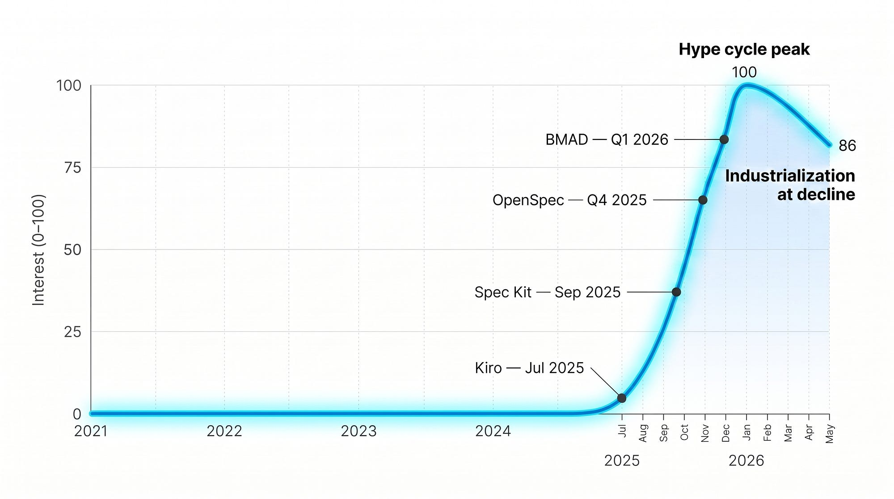
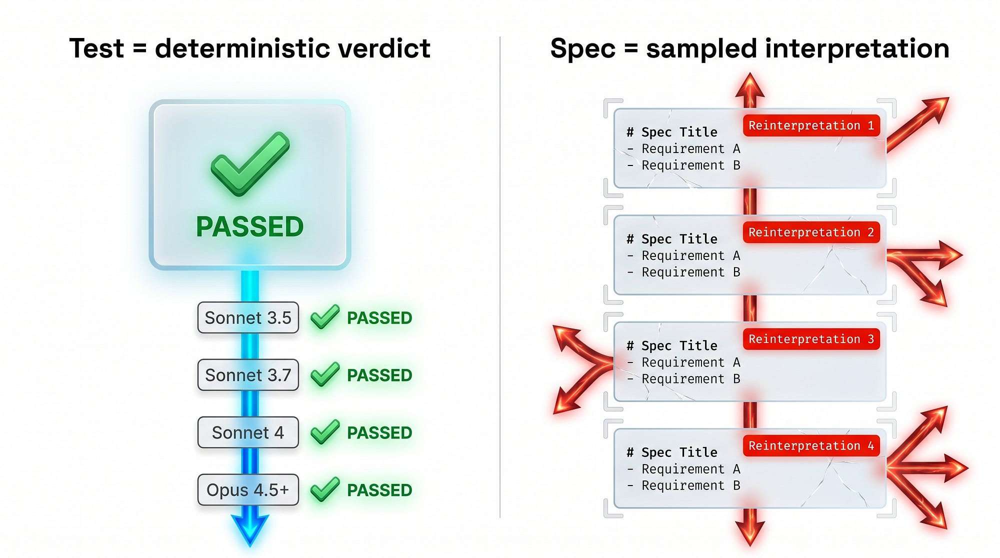
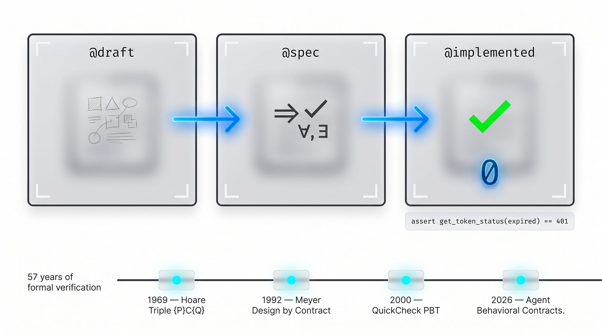
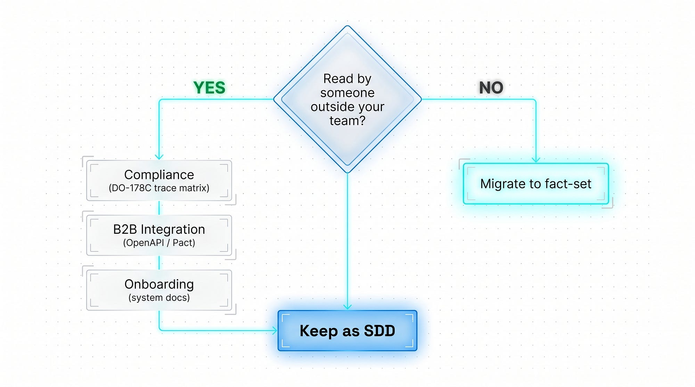
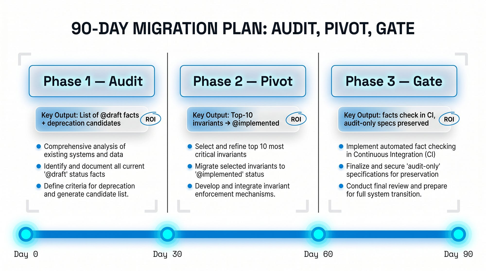
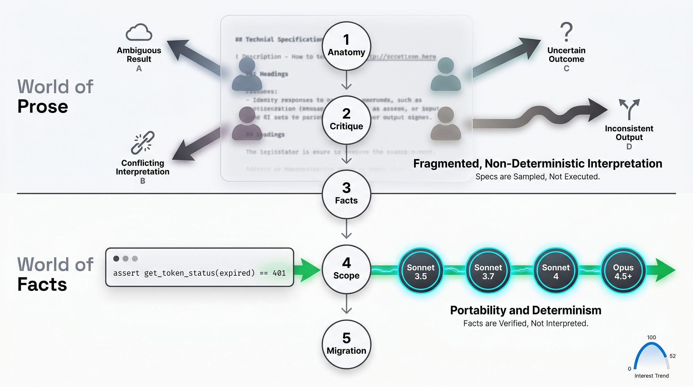

> 作者：Jaroslaw Wasowski
> 发布日期：2026 年 5 月 11 日
> 原文链接：https://medium.com/@wasowski.jarek/stop-writing-specs-start-writing-facts-the-entire-sdd-movement-is-already-obsolete-9045f7061e26

# 停止写规格，开始写事实。整个 SDD 运动已经过时。

## 一个测试挺过了 Sonnet 3.5、3.7、4 和 Opus 4.5+。而那份规格需要被重新解读四次。

> "一个解释一切的理论，什么也解释不了。" —— Karl Popper，科学哲学家

过去几个月里，我在 Medium 上写过六次，说规格驱动开发（Spec-Driven Development，SDD）是凭感觉写代码（vibe coding）那种混乱的解药——今天我要收回这句话的前半部分，只收回前半部分，而且我手上有这场运动的数据，你没法忽视。

如果你眼下正把 Spec Kit、Kiro、OpenSpec 或 BMAD 推向生产环境，而你的 CI 已经悄悄开始每隔几周就追着 Claude 模型升级跑，问题不在你这边——这些工具背后的根本假设，正在非确定性（non-deterministic）系统的重压下开裂，而 Google Trends 显示这场运动两个月前就开始走下坡了，从 3 月份 100 的峰值跌到 5 月份的 86。

接下来的十分钟里，你会看到为什么一个写于 2025 年 6 月的可执行测试，无需修改就一路通过了 Sonnet 3.5、3.7、4 和 Opus 4.5+ 的 CI，直到今天；而一份描述同一个端点（endpoint）的 1500 词规格却需要被重新解读四次——以及如何在 90 天内把 CI 从重度依赖 Spec-Kit 迁移到事实优先（facts-first），同时不丢掉可审计性（auditability）。

## 速胜——规格和事实之间究竟变了什么

规格不是一份与模型签订的契约。它是一个关于模型的预测。而模型会变。

每当一个 LLM 读一段散文（prose），它都是在从一个解释的概率分布里抽取一个样本——即便温度（temperature）设为 0.0 也是如此。独立研究表明，在确定性配置下，方差从几个准确率百分点到十个以上不等——取决于模型、提示词长度和任务。在极端的格式化情形下（Sclar 等人，2023），这个跨度达到 76 个准确率百分点，不过这适用于较弱模型上的极端格式变动，而非一次寻常的空白字符改动。你的规格——一份用 EARS notation 写就、塞满六页的 markdown——不是一个确定性的编译器。它是模型每一次都重新抽样的散文。

而一个事实——比如 `过期的 JWT 返回 401` 这样的可执行断言（executable assertion）——是一个确定性的裁决。它不经过模型解释。它经过一个退出码（exit code）。这就是官僚程序和物理定律之间的区别：一份办公室备忘录，每个新来的实习生都要重新解读一遍。万有引力定律不用。

在围绕规格搭了六期的繁文缛节（ceremony）之后，我落到了这样一个境地：那些项目里唯一还能在后续所有模型上无需修改就继续工作的产物，不是规格——是测试。本文余下的部分会解释，为什么这个区别是认识论上的（epistemological），而不仅仅是操作层面上的，以及 SDD 在哪些地方仍然能赢。

我先从我们用十个月搭起来的这场运动的解剖说起——因为如果不诚实地度量它的规模，这份批评就太廉价了。

## 一场十个月内从零跳到一百的运动的解剖

"spec driven development" 这个短语在 Google Trends 上有四年都趴在零。从 2025 年 8 月到 2026 年 3 月，它一路冲到 100，到 2026 年 5 月又回落到 86。这不是一个健康运动的轨迹——它是一条经典的"在顶峰处工业化"曲线，和我们在重型 AOP 框架、单体 ESB 退潮之前看到的形状一模一样。

就在同一个窗口期里，整个技术栈冒了出来：GitHub 的 Spec Kit，约九万个 star（截至 2026 年第二季度）；Amazon 的 Kiro，强制使用 EARS notation；OpenSpec，半年内 star 数增长达三位数；BMAD，将近五万个——加起来，五个主要的 SDD 框架共越过了 20 万个 GitHub star。来自 Amazon、GitHub 和独立开发者的四款工具，各有各的工作流。

SDD 具体许诺了四样东西：确定性的代码生成、更少的幻觉（hallucination）、在写代码之前先做验证、把意图（intent）当作唯一真实来源（source of truth）。我那六期逐一测试了每一样——展示了 Kiro 的三文档工作流、作为智能体契约的 EARS notation、BMAD 的人设（persona）栈，以及 OpenSpec 的增量（delta）架构。今天，在那每一个项目里，我恰恰只用其中一个元素——把 Spec Kit 的第一步当草稿本，别的什么都不用。

工具恰恰在根本假设开始开裂的那一刻被工业化——这不是对我论点的反驳，而是一个信号，说明我比其他人早两个月看到了它。如果你此刻正把 Spec Kit 部署为你团队的标准，Google Trends 告诉你，你正在采纳一项关注度在六十天内腰斩的技术。这不意味着你该立刻丢掉它——它意味着你需要一个 Plan B。

工具本身没坏。它们立足的那个假设坏了。

## 规格是一个关于模型的预测，而不是一份与模型签的契约

每一个读同一条指令的 LLM，本质上都在回答"这句话在统计上应该是什么意思？"，而不是"作者究竟想表达什么？"。把规格当一份办公室备忘录——一个心情不爽的实习生，周一和周五的解读会不一样。模型就是巨型的、心情不爽的实习生，只不过它们的心情每一次 API 调用都会变。

### 非确定性的机制

这个机制严格说来是系统性的，不是表面的。即便温度设为零，非确定性依然存在——独立研究记录到，在确定性模式下，一千个完全相同的提示词产生了八十种各不相同的补全（completion）。系统性的成因是浮点运算的非结合性（floating-point non-associativity）、批处理调度（batch scheduling）和融合注意力核（fused-attention kernel）——这些没有哪个是你靠更好的散文能修好的。

最强的那个信号，恰好颠覆了常见的直觉。在 IBM 一项关于金融领域 RAG 工作流的研究中，一个 100B+ 参数的模型只在 12.5% 的运行里复现出了完全一致的输出，而 7–8B 的模型则完全一致。这是某个特定任务的结果，不是适用于所有工作流的普适定律——但方向是清楚的："我们等模型变好了，规格自然就管用了"这种策略，恰恰与底层趋势背道而驰。另外，来自 Thoughtworks 的 Birgitta Böckeler 也注意到了同一个现象，她警告说，把规格当作来源（spec-as-source）可能会同时继承"MDD 和 LLM 两者的缺陷：不灵活，以及非确定性"。

跨格式的研究表明，在较弱的模型上，极端的格式化改动会让准确率波动多达七十六个百分点。更新的模型对此没那么敏感——但即便是在 markdown 结构上一个谨慎的改动，也可能生成不同的代码。跨厂商的数据同样令人不安：Anthropic 的模型违反自己的宪法（constitution）的概率在百分之几的量级，OpenAI 的模型违反的频率高出数倍——反过来对每家厂商也成立。规格是按厂商定形的，而非普适的。

### 意图鸿沟：意图与代码之间的距离

这不是一个实现层面的问题。微软研究院的 Shuvendu K. Lahiri 把它称为意图鸿沟（intent gap）——"AI 生成的代码在构造上是貌似合理的，但在构造上并不正确"——也就是用户想表达的，与程序实际所做的，这两者之间的距离。自然语言规格是非形式化的、无法核验的——形式化规格（formal specification）才是唯一可规模化的验证机制。SDD 把一个答案，与一个答案的统计近似，混为一谈了。

规格漂移（spec drift）——相当于数据库里的 schema drift——已经不再是理论上的事了。Spec Kit 在 2026 年 5 月发布了 `/speckit.spec-drift` 命令——一个用来解决一个已知问题的功能。这不能证明 SDD 架构正在开裂，但它确认了漂移是一个真实的运维风险，需要一个专门的工具来应对。你那条今天能从一份规格生成代码的 CI，明天可能会从同一份规格生成不同的代码——这不是 bug，这就是机制本身。一次模型迁移不是一次更新——它是一次解释器（interpreter）的更换。

既然散文继承了模型的非确定性，那么什么样的产物不会继承呢？

## 把事实当作可执行断言——什么能挺过抽样

事实是机器能自己核查、无需阅读的东西。一个测试的通过／失败。退出码 0 或非 0。没有解释，没有抽样，没有心情。这就是全部的区别。

我把粒度保持在三个层级：单个测试（一对具体的输入／输出）、性质（property，一个被全称量化的谓词——"对每一个已排序的列表，`binary_search` 的结果都正确"），以及契约（contract，按契约式设计（Design by Contract）风格的前置条件 + 后置条件 + 不变量）。每一个都是一条可执行断言——一个嵌入测试中、在运行时被核验、要么通过要么失败、永远不会"看情况"的布尔语句。

那个定义了事实优先方法的公开仓库，在操作层面演示了这套机制：生命周期标签 `@draft → @spec → @implemented`、一条以 `exit 0` 作为真值条件的 shell 命令，以及一个本身就是合法 YAML 的 markdown 文件。这不是一个框架——它是嵌进 git 里的纪律。

### 57 年的连续性——不是一个新范式

第二个、也更重要的观察：事实优先不是一场革命，它只是把分散了五十七年的工作做了一次 AI 时代的综合。形式化方法和基于性质的测试（property-based testing）原本有各自的轨迹——Hoare 那一支通向正确性证明，QuickCheck 那一支通向随机化的性质测试——但两者都归结于同一个直觉：正确性可由机器核验，而不是由机器去解释。1969 年的 Hoare 三元组 `{P} C {Q}`（C.A.R. Hoare，CACM）是"关于行为的最小事实单元"：如果条件 P 在 C 之前成立，那么条件 Q 在 C 之后成立。这是一份数学契约——而这条谱系正是从这里开始的。

Bertrand Meyer 在 1992 年的 Eiffel 里加入了契约式设计——`require`、`ensure`、`invariant`，都在运行时强制执行。2000 年的 QuickCheck 加入了基于性质的测试。2026 年的智能体行为契约（Agent Behavioral Contracts）则是 AI 时代的延续：一篇早期的学术论文测得每会话检出五到七次违规，开销在十毫秒以下。

我所知最强的生产案例来自 John Hughes 在 Quviq 的工作：在一家瑞典汽车制造商那里，六万行生产环境的 Erlang 代码，四百五十行 PBT（基于性质的测试）测试，检出二十五个 bug——其中包括那些基于样例的测试根本够不着的竞态条件（race condition）。一比一百三十三的比例。

同一个可执行测试，无需修改就穿过了 Sonnet 3.5 → 3.7 → 4 → Opus 4.5+：它不经过模型解释。它经过 Python 运行时。模型会变——事实不变。

明天早上你的第一条可执行断言：拿一个至今只存在于规格里的不变量（端点 `/auth/refresh` 对过期 token 返回 401），写一个测试，把它加进 CI。那就是一个事实。从一个开始。

这并不让 SDD 的所有使用场景都失效。恰好有一条边界，在那里繁文缛节本身就是产品，而不是成本。

## 繁文缛节即产品之处——诚实地界定 SDD 的适用范围

AWS 的 Marc Brooker 在 2026 年 4 月发表了我所知对 SDD 最有力的辩护："规格正在成为显式的、带版本的、活的产物"——这是指迭代式的 SDD，不是瀑布式的。我直说：这个辩护比大多数批评者所暗示的要更有力。SDD 不是一个错误——它是一个工具，只是它的适用领域比它的拥护者所许诺的要窄。

SDD 明显能赢的三个领域：

- **合规与监管**——在这里规格不是文档；它是法律证据。DO-178C 要求双向可追溯性（bidirectional traceability）。ISO 26262 ASIL C/D 强烈建议采用形式化／半形式化建模。欧盟《AI 法案》（European AI Act）规定的罚款高达一千五百万欧元，或全球营业额的百分之三。在这些领域里，繁文缛节"就是"产品——没有它就没有认证。
- **跨团队的 B2B 集成**——当五百名工程师分布在二十个团队里工作时，协调的成本超过了实现本身。OpenAPI 作为一份与合作伙伴之间的契约，发布在 Stripe 的 GitHub 上。Boost Insurance 报告称，在采用 Pact（消费者驱动的契约，Consumer-Driven Contracts）之后，服务稳定性提升了 80%。一条可执行断言无法替代 PM 与开发者之间对业务意图的共同理解。
- **新人上手与知识传递**——新团队成员读的是规格，不是测试。没有散文的测试只是机器可读的。markdown 解释的是"为什么"。

这一切归结为一个操作性的检验：这份产物会不会被团队之外的人——审计员、合作伙伴、新员工——阅读？是 → 它留作 SDD。否 → 它进入事实集（fact-set）。看看你的仓库，标出那些除了你的 CI 之外、确实有人在读的文件。那些就是你的 SDD 区。其余的，就是你的迁移目标。

现在你知道哪些该留作规格了。下一节会讲剩下的该怎么办。

## 九十天的迁移——审计、转向、设卡

第一个月你什么都不删。第二个月你写测试而不是写散文。第三个月你加一道 CI 关卡。三个阶段，各三十天，每一个都带有独立的 ROI 信号——你不必相信整件事，也能开始第一阶段。

### 第一阶段——审计（第 1–30 天）

把现有的规格盘点一遍，分成三堆。第一堆：合并（merge）之后会被团队之外的人阅读的——它们留下；那就是上一节说的你的 SDD 区。第二堆：自从提交（commit）以来就没人打开过的死文档——废弃（deprecation）的候选。第三堆：生产环境中所谓的隐式不变量——风险最高的前十个端点（认证、支付、数据联合），那里有一条规则只以散文声明的形式存在。

在这里你用一个处于改造（retrofitting）模式的智能体，从源代码里逆向工程出实际的运行时不变量。交付物：一份 `@draft` 事实清单，外加一份废弃候选清单。

### 第二阶段——转向（第 31–60 天）

你把边界处的规格转换成事实。每一份 API 契约 → 一个 Pact 测试。每一个性质／不变量 → Hypothesis 或 QuickCheck。每一个数据模型不变量 → 一条运行时断言。把测试金字塔倒过来：更少的单元测试，更多的契约／集成测试。

在新功能上，并行运行——规格和事实共存三十天，给你 A/B 层面的信心。交付物：前十大不变量从 `@spec` 推进到 `@implemented`，每一个都可由命令核验。

### 第三阶段——设卡（第 61–90 天）

`facts check` 成为一道必需的、会阻断合并的 CI 步骤。新功能要求在实现之前先有一个失败的事实——换了层皮的 TDD 节奏。把合规／上手之外的散文规格废弃掉（依据上一节的原则）。

交付物：事实优先的 CI 关卡已启用，仅供审计的规格得以保留，棕地（brownfield）代码通过事实、而非散文来把关。

一个实务观察：从业者报告称，在高强度的 SDD 工具工作流下会撞到 Pro 套餐的限额（在 OpenSpec 上记录得最清楚，但这个模式延伸到整个这一类工具）。`facts check` 核验整个仓库所用的 token，比把规格朗读一遍还少。迁移不仅减轻认知负担——它也削减账单。

从一个事实开始。真的就一个。明天早上，一个生产环境的不变量。

## 综合——六个站得住脚的结论

SDD 赢了工具之战：Spec Kit 约九万个 star，OpenSpec 半年三位数增长，整个生态系统二十万个 star。它正在输掉认识论之战——非确定性、意图鸿沟、规格漂移不是有待修复的 bug；它们就是机制本身。事实优先不是一个新范式——它是把分散了五十七年的工作做的一次 AI 时代综合：Hoare → Meyer → QuickCheck → 智能体行为契约。

一个方法论上的告诫：这些结论来自我的六个项目，而不是来自一项带对照组的受控研究。我与它保持着这个距离，你也应该如此。与 Birgitta Böckeler（Thoughtworks）和 Marc Brooker（AWS）的独立趋同——从两个对立的出发点——强化了这个方向，但并不证明它。

本文的四个具体要点：

- 规格是一个关于模型的预测，而不是一份与模型签的契约。散文在每一次调用时都会被 LLM 抽样——即便温度为零。
- 事实 = 一个由机器测试的可执行不变量。它能挺过一次模型升级，因为它不经过模型解释。
- SDD 赢在那些审计员、合作伙伴或新员工会阅读产物的地方。其余一切地方它都输。
- 九十天迁移：第一阶段审计 → 第二阶段转向 → 第三阶段设卡。每个阶段都交付一个独立的 ROI 信号——你不必相信整件事就能开始。

## 结语

PRD 正在消失。规格正在离开内层循环（inner loop）。事实在每个地方都能存活。在合规、B2B 和新人上手中，它们哪儿也不会去——在那里繁文缛节仍然是产品。其余一切地方：发布你的第一个事实集——一个不变量，一个测试，一个退出码 0。

谢谢你读到这里——我曾经以一个拥护者的身份写这场运动；今天我以一个已经得出自己结论的架构师的身份来写。如果这篇文章改变了你对规格的看法，把它分享给某个此刻正把 Spec Kit 推向生产环境的人。不同意？在评论里告诉我我的论点在哪里站不住脚。我在寻找那种散文规格比测试更干净地挺过一次模型升级的案例。
