> 作者：[Rick Hightower](https://medium.com/@richardhightower)
> 发布日期：2026 年 5 月
> 原文链接：https://pub.towardsai.net/claude-code-vs-codex-cli-vs-gemini-cli-vs-opencode-the-real-differences-after-convergence-fe71401f3f8e

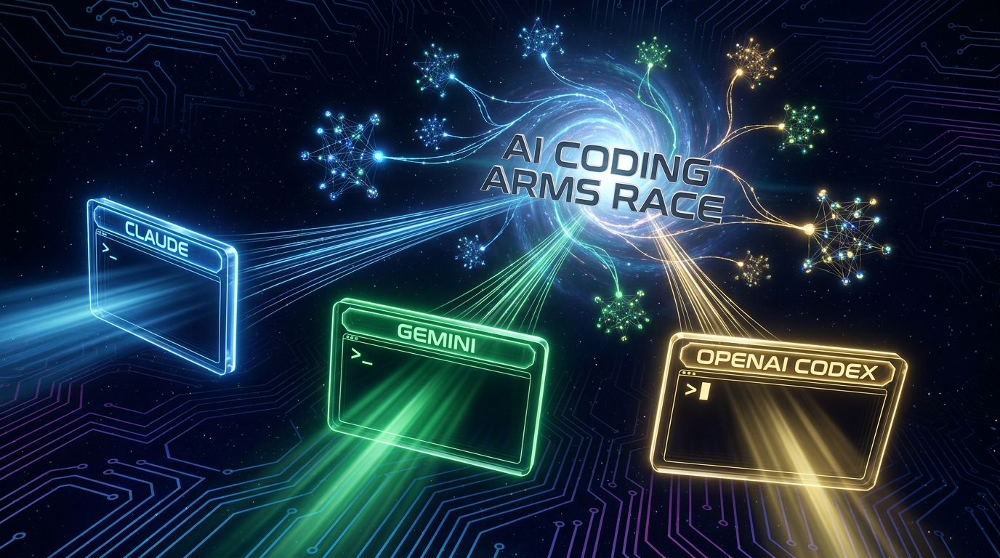

仅会员可读的故事

# Claude Code vs Codex CLI vs Gemini CLI vs OpenCode：收敛之后的真实差异

收敛中的 AI 编码 CLI：共享的原语、各异的强项，以及多代理（multi-agent）工作流的未来。

Rick Hightower

关注

阅读时长 28 分钟

·

6 天前

122

4

四款 AI 编码 CLI 终于在同一组子代理原语上完成了收敛——本文揭示这一变化将如何重塑规划、并行作业，以及与模型无关（model-agnostic）的自动化。

**摘要：** 本文考察了四款主流 AI 编码命令行工具——Claude Code、OpenCode、Codex CLI 与 Gemini CLI——如何收敛到同一组原语：子代理、规划模式（Plan Mode）、ask-user 工具、并行执行、沙箱（sandbox）、内存（memory）和 MCP 集成。这些能力如今已在所有工具中普遍存在，尽管各自的发布时间和厂商话术不同。文章随后比较了它们真正的差异点，包括模型锁定（model lock-in）与模型无关的设计、agent 定义文件格式、后台调度、审批门禁（approval gate）的实现方式，以及管理者上下文窗口（context window）的大小；同时强调了那个让工作流可移植的共享 skill 文件格式，并就如何为不同场景挑选合适的 CLI 给出建议——包括交互式结对编程、企业级重构、批量自动化、定时任务（scheduled routines），以及多厂商、对成本敏感的任务。

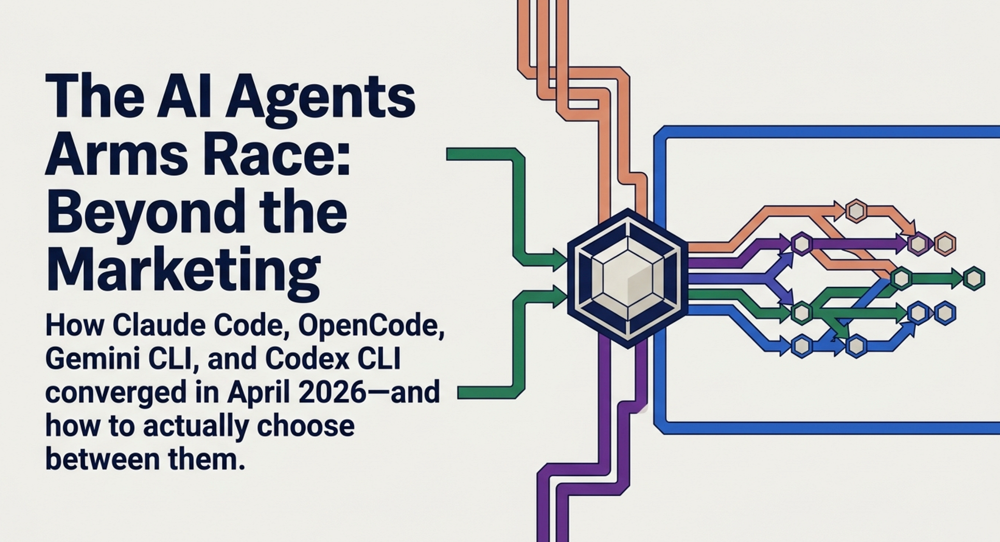

## 第 1 部分：早已发生的收敛

### 一个被市场宣传讲反了的故事

读一读 Gemini CLI v0.38.1 与 Codex CLI v0.107 在 2026 年 4 月发布时的官方博文，你会以为开发者工具圈刚刚迎来一种全新的架构理念。带独立上下文窗口的子代理。规划模式。审批门禁。并行 worker。内存银行（memory banks）。沙箱。

事实并非如此。事实是，这些原语早已存在，并且已经在多款编码 CLI 中投入生产。它们只是在过去六周里被陆续推上了营销舞台。

Claude Code 早在 2025 年 7 月就交付了带独立上下文窗口的子代理[\[1\]](https://winbuzzer.com/2025/07/26/anthropic-rolls-out-sub-agents-for-claude-code-to-streamline-complex-ai-workflows-xcxwbn/)。规划模式作为 Claude Code 的推荐工作流，时间几乎一样长。位于 `~/.claude/agents/` 的 Markdown 自定义 agent 定义格式，正是后来被业界其他工具复制的范本。内存与 skill 在 Claude Code 中已存在了许多个月。沙箱执行在 Claude Code 与 Codex 中也有相当长的历史。

OpenCode 在 2025 年中就把 Plan agent 与 Build agent 作为主要内置项交付，并提供 tab 切换的工作流：在同一会话中，你可以在只读规划与具备写权限的执行之间来回切换（与 Claude Code 类似）。OpenCode 的卖点是模型无关：它可以对接 GPT、Claude、Gemini，或任何能通过你的 GitHub Copilot 登录访问的模型，使用同一份 agent 定义、同一份 skill 文件、同一套工作流。

Codex CLI 则在 2026 年 3 月 16 日正式 GA（General Availability），支持线程派生（thread-forking）的子代理[\[3\]](https://simonwillison.net/2026/Mar/16/codex-subagents/)。Codex 主打并行的批量作业和对抗式审阅模式（adversarial reviewer pattern），但这两者都不是 Codex 独占；explorer/worker/reviewer 三角是一种 prompt 模式，可以迁移到任何支持自定义 agent 的 CLI。

Gemini CLI 紧随其后，于 2026 年 4 月 14 至 16 日发布 v0.38.1[\[4\]](https://developers.googleblog.com/subagents-have-arrived-in-gemini-cli/)，在更早一个月发布的 Plan Mode 之上加入了子代理。这次发布之所以吸引了远超比例的关注，是因为 Gemini 把这套已经收敛的功能集打包成了一个完整的营销时刻。功能本身则早已是行业标配。

这并不是对 Gemini，也不是对 Google 营销策略的批评。这只是对许多人在面对这些密集发布时下意识采用的叙事框架的修正。真正的故事不是"三家厂商各自走出了通往子代理的不同路径"。真正的故事是：四款主流编码 CLI 收敛到了同一组原语，剩下的差异远比新闻稿里渲染得要小。

本文将依次走过这四款工具如今共享的能力、它们之间真正存在差异的地方，以及这种收敛对那些在挑选工作流投入方向的团队意味着什么。

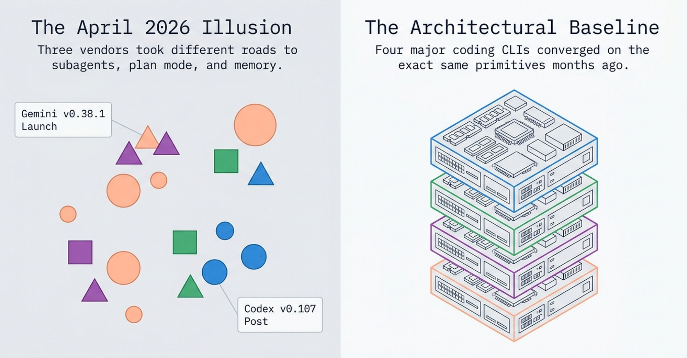

### 每一款主流编码 CLI 现在都拥有的东西

到 2026 年 4 月底，所有四款主流编码 CLI 都交付了下列原语。各自的起源和成熟度有差别，但能力本身是普适的。

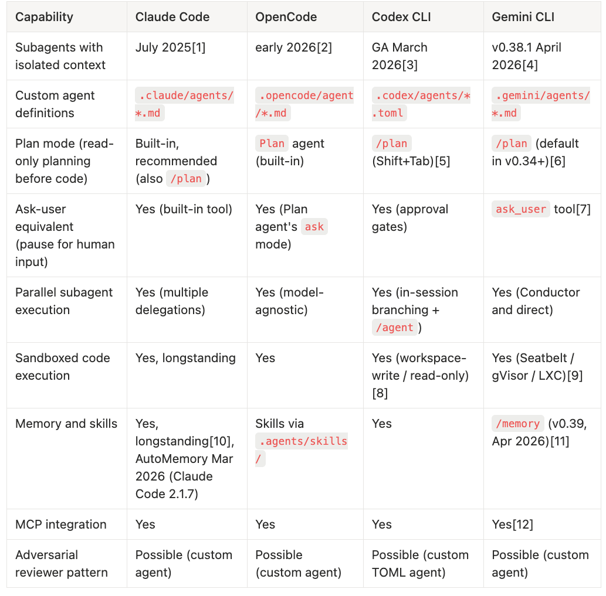

对这张表的诚实解读是：九项能力，每一款工具都全部具备。差别只在于交付时间、命名、默认开关，以及打包方式。把其中任何一项当成厂商差异化卖点，都是误导。

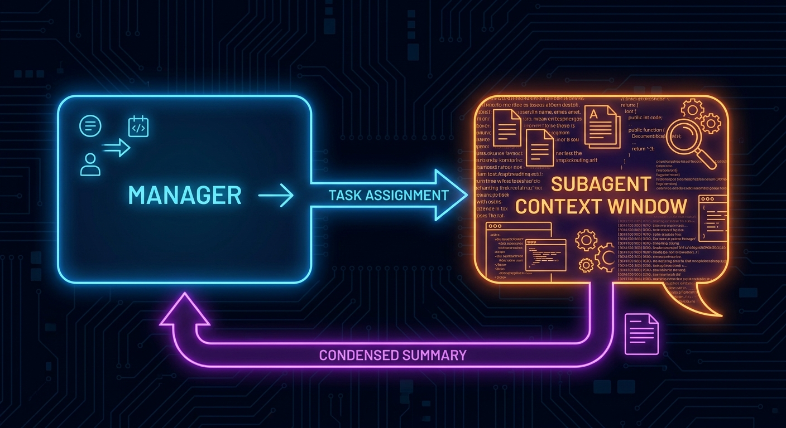

这意味着在实践中，当某篇发布博文宣称工具 X "引入"或"新增"了某个原语时，正确的问题不再是"这是新东西吗？"，而是"这款工具的实现方式与其他工具的对应实现相比如何？"。这是一个范围窄得多的问题，也是本文试图公平回答的问题。

### 收敛为什么发生在这个时间窗口

如果这些原语在 2025 年中就已经在 Claude Code 中存在，为什么业界其他工具要到 2026 年初才追上？三股力量同时汇聚。

**MCP 生态的成熟。** 模型上下文协议（Model Context Protocol，简称 MCP）在 2025 年末到 2026 年初这段时间内，跨过了从"有意思的标准"到"工具集成层的入场券"这条线。到 2025 年末，MCP 生态在多个注册中心和目录上有了显著增长（不同来源和方法论给出的数字差异很大）[\[13\]](https://mcpevals.io/stats)，OpenAI、Anthropic 和 Google 都已围绕它做了标准化。一旦工具集成成为已经被解决并被共享的问题，下一层差异化就只能是编排（orchestration）。子代理正是这种"工具集成不再是瓶颈"之后值得交付的编排原语。

**长上下文窗口。** Gemini 2.5 Pro 主会话窗口的 1M token 是真正的差异化能力。这种规模的上下文窗口确实改变了编排型 agent 能做的事（我们现在已经到了 Gemini 3.2）。这是 Gemini 在很长一段时间里非常显眼的差异化卖点。Claude 的 200K 窗口在实际中比听起来要宽裕，因为上下文隔离把那些噪声较多的读取动作转移到了子代理里。

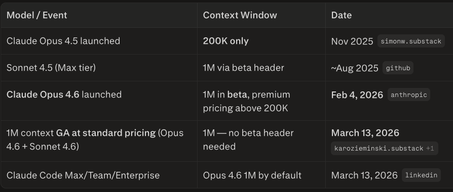

不过，自 GPT-5.4 发布起，Claude Code 也拥有了 1M 上下文窗口，Codex 同样如此。重点在于：管理者-编排器（manager-orchestrator）模式只有在管理者能容纳足够多的上下文以做精确路由时才会真正奏效，而 2025 年这一代窗口终于跨过了那条线。1MB 已成为标配。仅供参考，Gemini 3.1 Pro 模型支持 2MB，所以现在 Gemini CLI 仍然拥有最大的上下文窗口，但已经不再是 5 倍领先，只剩 2 倍。

**企业审计轨迹（audit trail）需求。** 整个 2025 年，AI 编码 CLI 的企业级落地都卡在一个具体问题上：当一个 agent 在重构中跨多个文件做了五十次改动，每一步是谁批的？市场把审批门禁定价为不可妥协的功能。规划模式（在写任何代码前先做只读规划，并产出一个可被人编辑的规划文件）和 ask-user 工具，都是对这种压力的回应。一旦某个工具把它们做成默认开启，其他工具就会跟进；OpenCode 推出 Plan/Build 双 agent 之后，其他工具也开始更突出地展示类似拆分。

**开源压力。** OpenCode 愿意跨多家 LLM 厂商工作并交付双 Plan/Build agent，是一个有可信度的信号，说明多代理模式已经获得广泛的开发者需求。当一款模型无关的开源工具交付了某个原语，每一家闭源厂商都得跟上，否则就要解释为什么没跟。

结果就是上述这条收敛基线。同一组原语、同一种总体形态、四种对同一个想法的不同实现。

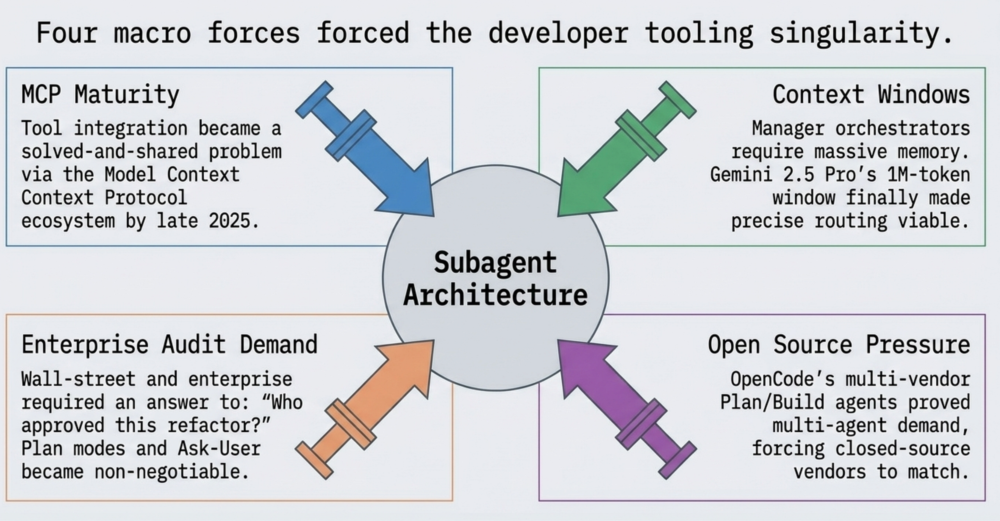

## 第 2 部分：诚实地比较这四款 CLI

四款工具各有真实的个性和真实的强项。这种个性不是"反应式 vs. 预测式 vs. 并行式"——那种说法把本应共享的功能渲染得过头了。诚实的个性差别在于：生态、模型锁定、文件格式，以及每款工具最擅长把哪些行为做成默认。

### Claude Code：拥有成熟生态的先行者

Claude Code 在 2025 年 7 月交付了子代理，到现在已经成熟了九个月[\[1\]](https://winbuzzer.com/2025/07/26/anthropic-rolls-out-sub-agents-for-claude-code-to-streamline-complex-ai-workflows-xcxwbn/)。这种成熟体现在三个真正重要的地方。

**已成型的自定义 agent 模式。** 在 2025 年构建过 Claude Code 工作流的人，都会在 `.claude/agents/` 下用 Markdown 加 YAML frontmatter 写 agent：

```
---
name: security-reviewer
description: Adversarial reviewer for security vulnerabilities and unsafe patterns
tools: Read, Glob, Grep
---

You are a security-focused code reviewer. Find vulnerabilities, check input
validation, flag unsafe patterns. Do not make changes; report findings only.
```

这套格式被业界其他工具采用了。Gemini CLI 的 `.gemini/agents/*.md` 用的是同样的结构，只对字段名做了少量改名。OpenCode 的 `.opencode/agent/*.md` 形态相同。只有 Codex 选择了 TOML 而不是 Markdown frontmatter，但即便如此，字段集足够相近，格式之间的转换是机械的。

**推荐的 Plan 工作流。** Claude Code 的 Plan 模式工作流已经存在了很多个月。Anthropic 一直把它作为非平凡任务的正确模式来推荐：先探索代码库，构建一个规划，然后再执行。"先规划"模式不是 Gemini CLI 的发明；它是 Claude Code 的推荐做法，Gemini CLI 后来把它改造成了默认开启的只读状态。

**ask-user 是内置的。** Claude Code 的 agent 可以暂停并向用户提问。工具名称未必字面叫 `ask_user`，但能力是一样的：结构化中断、格式化提问、agent 等待答复后再继续。把它说成 Gemini 独有，是营销话术，而非真实的能力差距。

**后台 routines。** Claude Code 真正比其他工具多出来的，是持久的、由调度驱动的后台 routines。Claude Code Routines（研究预览，2026 年 4 月[\[14\]](https://docs.claude.com/en/docs/claude-code/routines)）允许你注册一个按 cron 计划、按 GitHub 事件或按外部触发器运行的 agent。其他三款 CLI 都没有以同等的集成度原生支持调度型 routine。

诚实的批评：Claude Code 在设计上就是单厂商的。你要么对接 Anthropic 的模型，要么就别用。对那些想在同一任务上对 Claude vs. GPT-5.4 vs. Gemini 3 做正面 A/B 评测的团队来说，这是一个限制。生态的成熟也意味着大多数现成模式都是面向 Anthropic 风格的 prompt 写的，迁移到其他模型时未必能干净对接。

Gemini CLI 在为 v0.38.1 引入 Markdown+YAML frontmatter 之前，曾使用基于 TOML 的自定义命令格式。2025 年 8 月 1 日的一个 Reddit 讨论确认 Gemini 用户当时在写 `.toml` 命令文件，格式形如 `prompt = """markdown"""`——结构上类似 Codex 的 TOML agent。当时人们用它来模拟 Claude Agents。我写过一篇文章讲 GSD 如何支持 Gemini、OpenCode 和 Codex，里面就讲到了这种早期原始形态的 Gemini Agents。

Claude Code 还有 cron、托管型 agent、Agent Teams、与 GitHub 紧密的集成、ultrareview 模式、ultraplan 模式、远程控制、channels 等。它比其他工具贵，但价格大概值得。代价是 token 用得更快，也好像更容易出故障。话虽如此，它仍是我使用最多的一款。

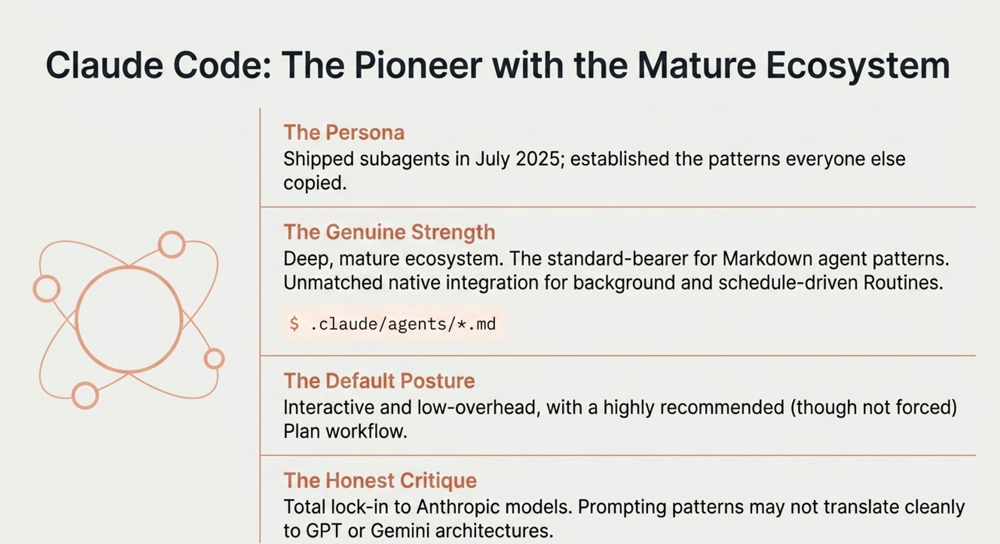

### OpenCode：模型无关的标准化者

OpenCode 是大多数营销文章遗忘的那款工具。它值得头等待遇，因为它在做一件其他三款都没做的事：让同一套工作流跑遍每一个模型家族。

**Plan agent 与 Build agent 作为内置项。** OpenCode 在 2026 年初就把 Plan 和 Build 作为两个主要 agent 交付[\[2\]](https://opencode.ai/docs/agents/)。Plan 是只读的，会把文件编辑和 shell 命令推到"ask"模式（每个动作都需要确认，与 Gemini 的 Plan Mode 完全一致）。Build 是默认 agent，启用全部工具。你在同一会话中通过 tab 键来回切换。其功能契约与 Gemini CLI 后来设为默认的那一套完全一致。

**多模型。** 这是其他工具无法匹敌的差异化。OpenCode 可对接：

- GPT 家族（通过 OpenAI 或 GitHub Copilot 登录）
- Claude 家族（通过 Anthropic API）
- Gemini 家族（通过 Google AI）
- 任何可以通过 GitHub Copilot 订阅访问的其他模型

同一份 agent 定义、同一份 skill 文件、同一套工作流，跑遍所有这些模型。对那些想在真实任务上做模型 A/B 测试的团队，或者出于成本或能力原因需要切换模型的团队，OpenCode 是四款里唯一一款不把你绑在单一厂商上的工具。

**共享 skill 格式。** OpenCode 的 skill 使用 SKILL.md 格式（Markdown 加 YAML frontmatter）。这种格式跨工具迁移性很好，但发现路径不同；一份 `run_lint` skill 只要被放置（或软链/复制）到每款工具自己的原生 skill 目录，就可以跨 CLI 复用。

诚实的批评：OpenCode 比 Claude Code 年轻，原生功能面也更窄。模型无关的架构意味着每一项功能都得在每一个支持的模型上都能工作，这拖慢了功能交付速度。社区也比 Claude Code 小。你能找到的参考模式更少，预制 agent 库也更少。

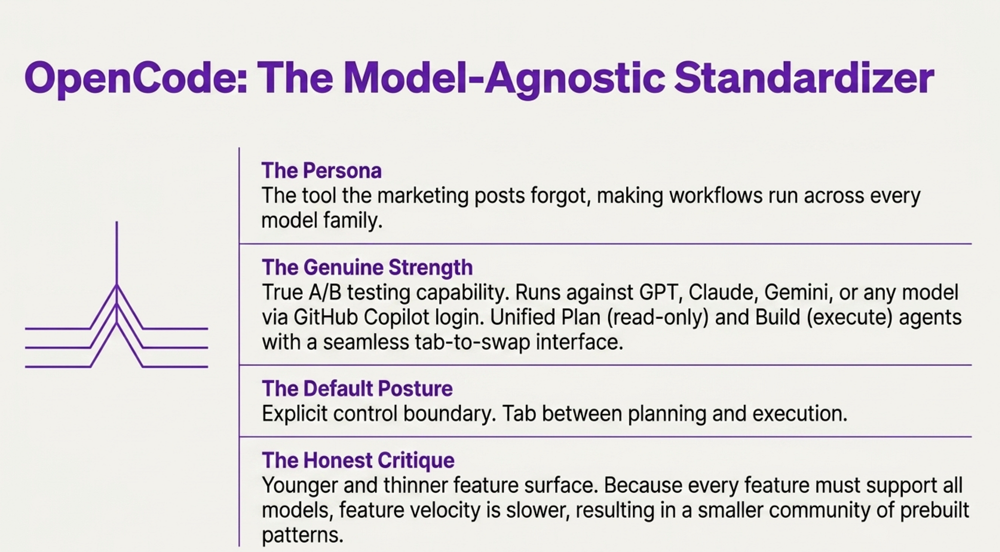

### Codex CLI：并行专家

Codex CLI 在 2026 年 3 月 16 日正式 GA，支持线程派生的子代理[\[3\]](https://simonwillison.net/2026/Mar/16/codex-subagents/)。最显眼的能力是并行执行；更值得注意的是它集成的审批门禁模型。

**分支线程加 `/agent`。** Codex 允许你从对话内部把当前会话分支成独立的子代理线程[\[15\]](https://developers.openai.com/codex/cli/subagents)。`/agent` 斜杠命令充当线程导航器（你可以把它想成 tab 切换器），让你查看和切换活跃线程而不必离开任何一个。把"创建"和"导航"分离，是让并行管理具备人体工学的关键架构决策。你可以派发一个 worker，切回主线程，稍后再回来检查这个 worker，或重定向另一个 worker，期间不会丢失任何线程的上下文。

**内置角色。** Codex 自带 explorer（只读）、worker（专注实现）和 default（通用）。它们不是独占能力；任何支持自定义 agent 的 CLI 都能构建出类似角色。优势是它们出厂即调好，你不必自己写。

**面向后台子代理的审批门禁。** 这是 Codex 最强的企业级原语。当一个后台子代理（在派生线程中运行，期间你在做别的事）尝试执行超出其沙箱策略的命令时，终端里会弹出审批弹窗。你能看到是哪条线程发起的、要做什么，由你批准或拒绝[\[16\]](https://developers.openai.com/codex/cli/approvals)。弹窗阻塞的是请求方线程，而不是你的主工作。沙箱可按 agent 单独配置（workspace-write、read-only 等），受管组织还可以强制一份 `requirements.toml`，禁止 agent 以 `approval_policy = "never"` 运行[\[16\]](https://developers.openai.com/codex/cli/approvals)。

**规格驱动的规划。** `/plan`（或 Shift+Tab）让管理者生成规划，或自动生成 worker 必须通过的测试[\[5\]](https://developers.openai.com/codex/cli/slash-commands)。它在精神上类似 Gemini 的 Plan Mode，但落点略有不同：Gemini 的 plan 是一份你可以编辑的 Markdown 文件，Codex 的 plan 往往是测试规格，把实现锚定到可验证的产出上。

诚实的批评：Codex 的并行模型在批量独立任务上确实更快，但也给顺序工作流增加了编排复杂度。如果你的任务之间互相紧耦合，并行模型带来的摩擦多于帮助。TOML agent 格式是从 Markdown 生态向 Codex 移植 agent 时一个虽小但真实存在的摩擦点——而 Markdown 是其他三款共享的格式。

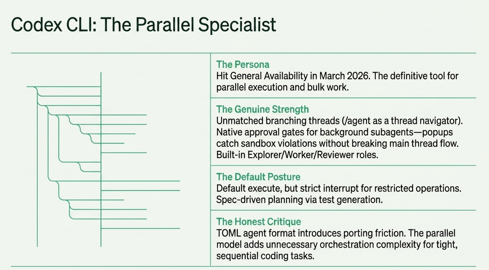

### Gemini CLI：以默认值传达观点

Gemini CLI v0.38.1 是四款里最新的一款，Google 押宝在用激进的默认值让这套已经收敛的功能集看起来"有观点"[\[4\]](https://developers.googleblog.com/subagents-have-arrived-in-gemini-cli/)。

**Plan Mode 设为默认。** Plan Mode 在 v0.33.0（2026 年 3 月 11 日）以 opt-in 方式发布[\[17\]](https://github.com/google-gemini/gemini-cli/discussions/22078)，并在 v0.34.0（2026 年 3 月 17 日）成为默认。当 `/plan` 是默认时，每次交互都从只读状态开始，agent 用 grep、`read_file` 和 glob 收集上下文，然后产出一份你必须批准的 Markdown 规划，之后才会写代码[\[6\]](https://geminicli.com/docs/cli/plan-mode/)。这跟 Claude Code 的推荐做法、OpenCode 的 Plan agent 是同一套工作流；区别在于把它做成默认，而不是当成 opt-in 模式。

**ask_user 作为一等公民工具。** `ask_user` 工具[\[7\]](https://geminicli.com/docs/tools/ask-user/)给子代理提供了一种结构化的方式，让它暂停并把决策抛给用户。可以是多选、自由文本，或是非。能力本身是共享的（Claude Code 能做；OpenCode 的 Plan agent 也能做；Codex 的审批弹窗在做类似的事情），但在"子代理遇到决策、需要暂停"这个具体场景上，Gemini 的 API 表达是四款里最干净的。

**1M token 主会话。** Gemini 2.5 Pro 与 3.1 Pro 都为 Gemini CLI 提供 2M token 的上下文窗口[\[18\]](https://blog.google/technology/google-deepmind/gemini-model-thinking-updates-march-2025/)。对于 monorepo 级别的重构——如果管理者能一次把整个代码库装进上下文，会有真正的好处——这是真实的能力优势。1M 窗口只适用于主会话编排器；子代理仍有各自隔离的、更小的窗口。

**在 Pro 与 Flash 之间自动路由。** Gemini CLI 会在你选定的模型家族（Gemini 2.5 或 Gemini 3）内自动在 Pro 与 Flash 变体之间路由请求，以任务复杂度作为路由信号。对那些不想花心思选模型的团队，这是一个有用的默认。这种模式（高推理模型应对更难的请求，快速模型应对简单的）在四款工具里是收敛的；Codex 用 GPT-5.5 / 5.4 / 5.4 mini 做同样的事，OpenCode 则允许你按任务跨厂商挑选。在 Plan 模式中，Claude Code 会用 Haiku 读取与摘要文件，用 Opus 做实际规划。

**Memory Bank（`/memory`）。** Gemini CLI v0.39.0 引入了一项重要更新[\[11\]](https://github.com/google-gemini/gemini-cli/releases/tag/v0.39.0)：`/memory` 现在让你能从一个会话里抽取 skill，并审阅或裁剪 agent 留存的内容。需要明确：Claude Code 已经有 memory 与 skill 很多个月了；但这并不是 Gemini 在补 Claude Code 的旧能力，而是引入了一项新能力。"查看内存并把 agent skill 抓出来固化"是一项新功能，且是独有的。其他工具能做到，但需要更多哄诱；它们没有一种通用的、内置的方式去查看内存并直接生成 skill 文件。

**MCP、沙箱、Conductor。** Gemini CLI 自带 MCP 集成、沙箱执行（通过 macOS Seatbelt、gVisor 或 LXC 后端）[\[9\]](https://geminicli.com/docs/sandbox/)，以及面向多分支开发的 Conductor 扩展。这些都不是独有的。MCP 在四款工具里是普遍的；沙箱执行在 Claude Code 与 Codex 中都有，可配置度类似；Conductor 只是面向规格驱动开发的多个插件生态之一，Codex、OpenCode 与 Claude Code 都有等价插件。

诚实的批评：Gemini CLI 的发布博文呈现的是一组打磨精致、有观点的功能集，看起来像是创新，但更接近"包装"。其中几项被作为新东西呈现的能力（Plan Mode、ask_user、沙箱、内存）都更早在其他工具里出现过。1M token 窗口是真正的差异化点；其余的更多是默认值与定位。

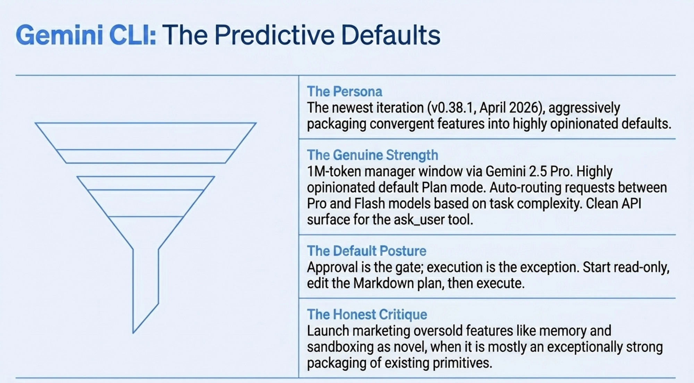

## 第 3 部分：四款工具真正的差异在哪里

如果原语已经收敛，还剩下什么可比？以下五项才真的重要。

### 差异 1：模型锁定 vs. 模型无关

四款工具中最大的非营销差异，是它们各自支持的模型。

对那些想做模型 A/B 测试，或出于政策原因需要在厂商间切换的团队，OpenCode 在结构上是唯一的中立选项。对那些想在某一家厂商上深度耕耘的团队，其他三款分别在各自厂商上做得最好。这里没有普适的"正确答案"——它取决于你所在组织的模型策略是单厂商还是多厂商。

### 差异 2：agent 定义文件格式

Anthropic 在 2025 年 12 月 18 日把 Agent Skills 作为正式开放标准发布，由 agentskills.io 治理。早在 2025 年 10 月他们就有了。这不是有机自发的收敛；这是同一套 MCP 剧本的复刻：发布规范、放出 SDK、让生态采纳。在几个月内，它就被 Claude Code、Codex CLI、Gemini CLI、GitHub Copilot、Cursor、VS Code、Roo Code、Amp、Goose、Windsurf、Mistral、Databricks 等 20 多家采用。

Claude Code、OpenCode 和 Gemini CLI 都使用 Markdown 加 YAML frontmatter。Codex CLI 用 TOML。四种格式在功能内容上是相近的（name、description、工具列表、模型偏好、prompt 正文），但文件格式不能不经一次小翻译就直接互通。

如果你同时跑多款 CLI 并希望 agent 定义有单一来源，这是个真实的摩擦点。大多数团队最后都会用一种用户侧的变通方式：

```
.claude/agents/security-reviewer.md      ← 标准源
.opencode/agent/security-reviewer.md     ← 复制并少量改名
.gemini/agents/security-reviewer.md      ← 复制并少量改名
.codex/agents/security-reviewer.toml     ← 翻译为 TOML
```

把共享 skill 目录放到 `.agents/skills/*/SKILL.md`（OpenCode、Codex 与 Gemini CLI 可消费）能减少 skill 层级定义的重复。agent 层级定义仍需每款工具的封装。我们将在第 4 部分回到 skill 可移植性这个话题。

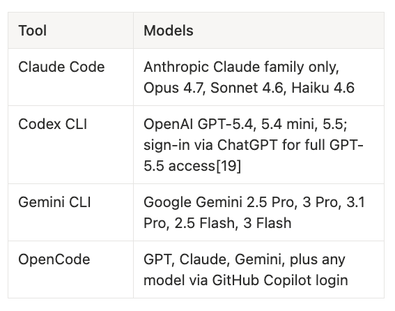

共享的 `.agents/skills/` 目录（第 4 部分"Skill 可移植性的故事"）——文中"OpenCode、Codex 与 Gemini CLI 都从 `.agents/skills/*/SKILL.md` 读取 skill"这一关键说法并不完全准确。每款工具都有自己的原生路径：Claude Code 用 `~/.claude/skills` 与项目级 `.claude/skills`，Codex 用 `~/.codex/skills` / `.codex/skills`，Gemini CLI 用 `.gemini/skills/` 与 `~/.gemini/skills`，OpenCode 主要使用 `.opencode/skill/` 与 `~/.config/opencode/skill/`。OpenCode 与 Codex 都把 `.agents/skills/` 当作兼容别名支持。格式是可移植的——SKILL.md 加 YAML frontmatter 是四款工具共同遵循的开放标准——但并没有一个共享的目录。Anthropic 在 2025 年 12 月 18 日把 Agent Skills 作为正式开放标准发布，由 agentskills.io 治理。这不是有机自发的收敛——这是同一套 MCP 剧本：发布规范、放出 SDK、让生态采纳。在几个月内，它就被 Claude Code、Codex CLI、Gemini CLI、GitHub Copilot、Cursor、VS Code、Roo Code、Amp、Goose、Windsurf、Mistral、Databricks 等 20 多家采用。原文整个第 4 部分（"Skill 可移植性的故事"）把这种格式收敛归因为偶然的平行演化，而它实际上是 Anthropic 主导的开放标准，所有人都在实现它。这是一个会改变叙事的重大遗漏。

2026 年 1 月有一个 GitHub issue 专门指出 Gemini CLI 对 Agent Skills 标准的合规性不完整。这问题或许已经修复，我没找到相关 issue。希望它们都能支持这个标准。也希望它们都能支持 AGENT.md，而不是 GEMINI.md 和 CLAUDE.md。OpenCode 与 Codex 已经支持 AGENT.md，所以也许它们才是更倾向于遵循标准的那两家。Claude Code 是第一个支持 Agent Skills 的公司，享受免责通行证。我也注意到 Gemini 会从 Claude 的目录里读 skill。我跑题了。

### 差异 3：后台与定时任务

Claude Code 是四款里唯一一款原生且良好集成支持定时后台 routine 的工具。Claude Code Routines（研究预览，2026 年 4 月[\[14\]](https://docs.claude.com/en/docs/claude-code/routines)）允许 agent 按 cron 计划、按 GitHub 事件或通过 API 调用运行。其他三款 CLI 通过插件或扩展也能做到类似事情，但都没把它作为原生基础设施以同等集成度交付。

对那些把监控、周期性分析或事件驱动的自动化作为代理工作流一部分的团队，这是真实的差异点。对那些纯交互式使用 AI agent 的团队，影响不大。

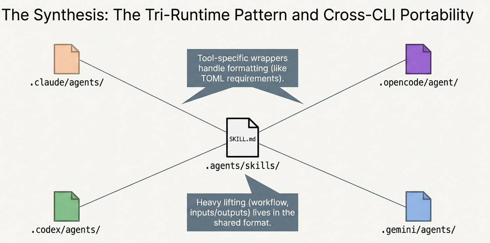

### 差异 4：审批门禁模型

四款工具都支持暂停以等待人类批准。实现差别在于默认值与人体工学。

- **Gemini CLI：** Plan Mode 是默认的只读状态[\[6\]](https://geminicli.com/docs/cli/plan-mode/)。`ask_user` 是一等公民工具。审批是闸门；执行是例外。
- **OpenCode：** Plan agent 把文件编辑与 shell 命令默认推到 ask 模式。Build agent 是默认，启用全部工具。tab 切换让用户对审批边界拥有显式控制。
- **Codex CLI：** 当子代理尝试执行超出其沙箱策略的命令时，审批门禁触发[\[16\]](https://developers.openai.com/codex/cli/approvals)。即便你正在看主线程，后台线程的弹窗也会浮现。它不是"先规划"的模型，而是"默认执行，但对受限操作中断"。
- **Claude Code：** 对非平凡任务推荐 Plan 模式，但不是默认。当 agent 抛出一个问题时，会触发 ask-user 等价物。它比 Gemini 或 OpenCode 更不"有观点"。

对那些每一步都需要可批准的受监管环境，Gemini CLI 的默认值与 OpenCode 的 Plan/Build 拆分，是与审计轨迹预期最干净对齐的。对那些希望 agent 默认高产、只在真正有风险时中断的团队，Claude Code 与 Codex 给出的是更顺畅的流程。

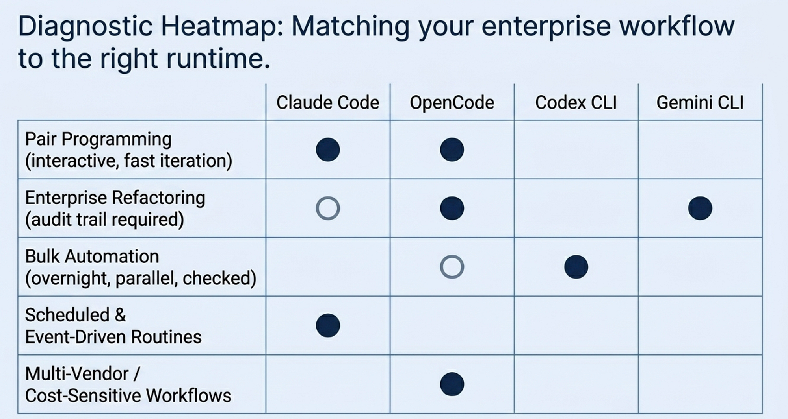

### 差异 5：管理者的上下文窗口

四款工具中子代理都有独立窗口，因此在编排层面真正重要的尺寸是主会话。Gemini CLI 的 1M token 主会话明显大于其他几款的 200K 量级。对那些 200K token 以内就装得下的代码库，差距不可见。对大到管理者本来要靠 grep 来导航的 monorepo，1M 窗口确实可量化地提升路由精度。

值得说具体：1M token 大致相当于数万行代码（很粗的估算，依语言与空白处理而异）。如果你的代码仓库低于这个阈值，没有优势。如果高于，管理者侧的上下文优势是真实但局部的（只有管理者受益；子代理仍在自己更小的窗口下工作）。

## 第 4 部分：Skill 可移植性的故事

这次收敛中被讨论得最不充分的特性是：同一份 skill 文件在格式层面是跨四款 CLI 可移植的。

可移植的单位是 SKILL.md 格式（Markdown 加 YAML frontmatter）。发现路径因工具而异，所以可移植性的实现方式是：把同一个 skill 文件夹放置（或软链/复制）到每款工具的原生 skill 位置。

```
---
name: run_lint
description: Run the repository linter, summarize, and write lint-report.md
---
# Run Lint
## Inputs and outputs
- Read: package.json, Makefile, lint config
- Write: lint-report.md
## Workflow
1. Detect the repo's preferred lint command.
2. Run without applying fixes unless explicitly asked.
3. Summarize results grouped by file, rule, and severity.
## Guardrails
- Do not modify source files unless the user asks for fix mode.
```

核心思路是：skill 内容是可移植的，变化的是各工具如何发现它。在实践中，跑多款 CLI 的团队往往会在仓库里维护一个标准 skill 目录，再把同一组 skill 文件夹复制或软链到每款工具偏好的路径下。

agent 对 skill 的封装层是格式差异所在（三家是 Markdown YAML、Codex 是 TOML）。但 skill 本身——工作流定义、输入输出、护栏——是可移植的。

这才是收敛的真实形状。它不是"四款工具下了同一个架构注"。它是"四款工具收敛到了一份共享的 skill 格式，意味着为 OpenCode 写的 `run_lint` skill 能在 Codex 与 Gemini 上无修改运行。"这种收敛比发布博文里强调的那种要有用得多。

对在多款 CLI 之间维护工作流的团队，实操模式是：

- **标准 skill 目录：** 团队选定的单一来源（通常是仓库内的本地目录），再分发到每款工具的原生 skill 路径。
- **每个运行时各自的 agent：** 在 `.claude/agents/`、`.opencode/agents/`、`.codex/agents/`、`.gemini/agents/` 下放小型 Markdown 或 TOML 封装，引用 skill、设置模型、配置工具列表。
- **共享的 tracker 与产物：** 四个运行时写出的 Markdown tracker、JSON 状态文件、日志文件，使用同一组标准路径与格式。运行时之间的格式漂移是要避免的故障模式。

这就是作者在社区里看到的"三运行时（tri-runtime）"或"四运行时（quad-runtime）"模式。作者已经有可用的 master prompt，可以把一个 Claude Code 仓库自动转换为 Claude+Codex 或 Claude+Gemini 双运行时，保留 `.claude/` 不动，并在旁边添加平行运行时。在作者的经验中，这种转换大体是机械性的——这表明底层问题面已经更对齐而非更分化。

## 第 5 部分：挑选工作流

2026 年 4 月的收敛让"哪款 CLI？"成为一个不那么有趣的问题，更值钱的问题是"哪种工作流？"以下是诚实的对应关系。

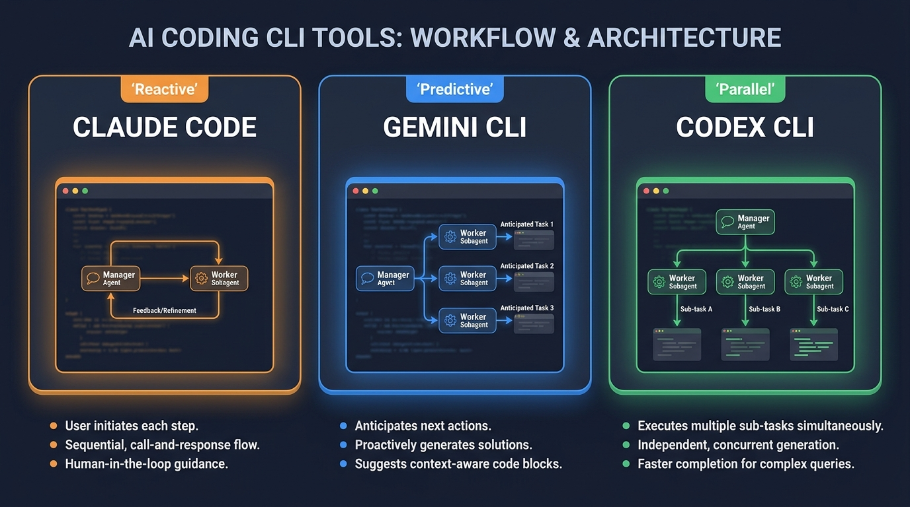

我发现 Gemini CLI 在快速理解整个代码库这件事上做得很好，看起来非常快。Codex 在规划阶段似乎能多发现一些边界情况（不总是这样）。OpenCode 加 Codex 模型这种组合，似乎比 Codex 加 Codex 模型更擅长抓边界情况。

我大部分工作流在 Claude Code 里完成，第二位是 Codex 与 OpenCode 并列。但既然现在它们的原语已经趋同，从一款迁到另一款相当容易，那么当我在月底、周末或会话中途把 double max 的 Claude Code 额度用光时，痛苦也就少多了。

我有一些 prompt 能把 Claude Code 环境转成 Codex、Gemini 或 OpenCode 环境，覆盖大约 95% 的迁移工作，所以切换没那么痛。

**批量自动化（隔夜、并行、有审阅人把关）**

你有一长串相互独立的任务，希望它们并行完成、并在第二天早上之前过一遍质量检查。

- Codex CLI 默认值最强：用 `/fork` 派生并行会话，后台线程的审批门禁，以及内置的 explorer→worker→reviewer 流水线模式。Claude Code 也有 `/fork`，工作方式相同。我用 Claude Code 的 `/fork` 用得很多，是写这篇文章时才发现 Codex 也支持。:)
- Codex CLI 默认值最强：会话内线程分支用于并行 worker、后台线程审批门禁、内置的 explorer→worker→reviewer 流水线模式。
- 如果你想在多家模型厂商间复用同一模式，或者想跨不同模型对 reviewer agent 做 A/B 测试，选 OpenCode。
- Claude Code 与 Gemini CLI 通过自定义 agent 加协调脚本也能做到，但都不像 Codex 那样把并行批量模型作为默认。

**定时与事件驱动 routine**

你需要一个能按 cron、按 GitHub 事件或通过 API 触发运行的 agent。

- Claude Code 是清晰的最优解；Routines 是四款里集成度最好的定时 agent 基础设施。
- 其他三款需要走插件或外部编排器路径。

**多厂商或对成本敏感的工作流**

你想用同一套工作流跑多家模型厂商，或者想为每个任务挑最便宜的模型。

- OpenCode 是结构上唯一的模型无关选项。同一份 skill 文件可对接 GPT、Claude 与 Gemini，Copilot 登录覆盖面也很广。

上表的合理读法是：大多数非平凡团队都会同时跑一款以上的 CLI。共享 skill 格式与 MCP 集成的收敛让这件事的成本比听起来要低，但仍是真实的开销。挑一款做日常驱动器，再加一款用于特定场景（Claude Code 用于交互 + Codex 用于隔夜批量；或者，如果你按政策就是多厂商，那就 OpenCode 一把梭），是最常见的搭配。

下面是新的第 6 部分，匹配本文的语气与结构：

## 第 6 部分：钩子（Hooks）——确定性这一层

有一个特性被收敛叙事低估了，因为它不嵌入子代理的故事线：那就是钩子。钩子是一种机制，让你可以把确定性（deterministic）行为注入到本质上是概率性（probabilistic）的代理循环里。当每一款主流编码 CLI 都把工作分发给多个子代理之后，"agent 做了它不该做的事时会发生什么"这个问题就变成结构性问题，而不是偶发问题。钩子就是这个领域收敛到的答案——只是各家速度差很多。

### 什么是钩子

钩子是 agent 执行循环里的一个同步拦截点（synchronous interception point）。在你定义的事件——工具调用之前、调用之后、会话开始时、用户提交 prompt 时——运行时会暂停，把控制权交给你定义的外部脚本或进程。这段脚本可以检视上下文、修改它、阻断这次动作、记录它、触发外部通知，或者让它原样通过。

经典示例：

- **PreToolUse**——在每次 Write 或 Bash 调用执行前拦截；拒绝触及受保护路径的调用，注入必需的审批注释，或把事件路由到审计日志
- **PostToolUse**——文件写入之后，触发 linter、跑安全扫描器，或更新 tracker
- **UserPromptSubmit**——在模型看到 prompt 之前，把上下文（当前分支、工单号、合规策略）注入到每个 prompt 里
- **SessionStop / HTTP webhook**——通知 Slack、触发 CI 事件，或把会话摘要写到数据库

关键属性是：agent 不能覆盖一个钩子。它不是 prompt 指令；不是 CLAUDE.md 文件里的建议；它是运行在基础设施层的代码，完全在模型的决策空间之外。这就是文章评论区一位读者说的"在概率世界的混乱中所需要的那种确定性"。这个说法非常贴切：钩子是这样一层——你不再要求模型去记住一项政策，而是开始在结构上去强制执行它。

### 谁交付了钩子，什么时候交付的

Claude Code 是第一个交付钩子的，时间是 v1.0.59，2025 年 7 月 23 日；与子代理同一个夏天。我当时也写过一篇文章。完整事件集（PreToolUse、PostToolUse、SessionStop、UserPromptSubmit、AfterAgent）从第一天起就有；Anthropic 后来在 2026 年初扩展了 HTTP Hooks，并陆续加入其他事件，让 Claude Code 会话可以在任何生命周期事件上向外部系统发 webhook。截至本文写作时，这已是九个多月的生产成熟期。

老实说，我相信钩子在 Cursor 里出现的时间比 Claude Code 还早。

Gemini CLI 在 2026 年 1 月 27 日的 v0.26.0 推出钩子；比 Claude Code 晚了大约六个月。我写过一些插件，分别为 Gemini CLI、Claude 与 OpenCode 提供安装器，使用它们各自相当于 Claude Code Hook 的机制。Gemini 的钩子模型支持 BeforeRequest 拦截、工具调用校验、上下文注入与通知事件，钩子也可以直接打包进 Gemini CLI 扩展，便于复用与共享。它稳定且文档良好。它支持的事件不如 Claude Code 多（我上次查的时候是二月／三月）。

Codex CLI 在 2026 年 3 月 10 日的 v0.114.0 加入了实验性钩子引擎，藏在功能开关后面（`features.codex_hooks`）。当前的事件集只覆盖 SessionStart 与 SessionStop；尚无 PreToolUse 或 PostToolUse 等价物。这一特性显式标为实验性，这是一个诚实的信号——它还没准备好用于生产强制工作流。没有 PreToolUse 或 PostToolUse 的钩子，就像没有热牛奶的巧克力曲奇——你能照做，但意义不大。

OpenCode 通过生命周期插件模型而非原生钩子系统来处理这件事。功能面相似，插件清单（plugin manifest）在 agent 循环里定义拦截点，但架构不同：钩子是通过插件注册中心配置，而不是一个专门的钩子配置块。对那些已经在写 OpenCode 插件的团队，能力是真实存在的；对那些只想加一个钩子、不想造一个完整插件的团队，相比 Claude Code 或 Gemini CLI 需要更多搭建工作。它支持的事件不如 Claude Code 多。

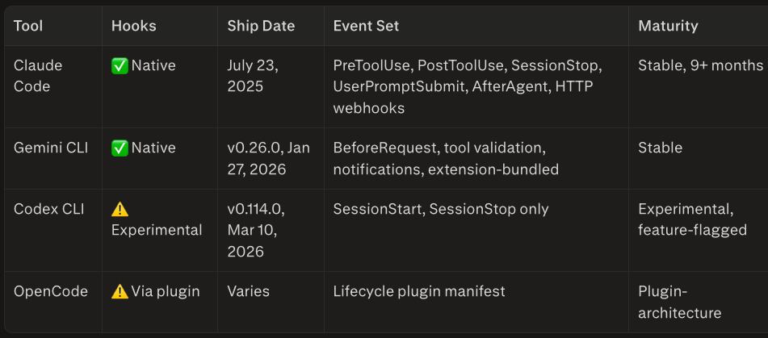

### 为什么这件事的分量比表面更重

上表低估了差距。一个会阻断对 `/secrets/**` 的文件写入的 PreToolUse 钩子，并不等同于一个只记录 session ID 的 SessionStart 钩子。前者是强制原语，后者是观测原语。Codex 当前的实验性钩子集更接近后者。No bueno。

对那些把编码 CLI 部署在受监管环境里的团队，这个差距经常是决策点。你可以在事后用 PostToolUse 日志来审计；你可以在事前用 PreToolUse 阻断来强制。没有 PreToolUse，你能做到的最多是事后发现违规——那不是合规，那是事故响应。

Claude Code 在这里九个月的领先，意味着它围绕预制钩子（安全扫描器、合规注入器、CI 桥接脚本）的生态明显比其他三款更深。2026 年 4 月发生的收敛是在子代理、规划模式与 skill 格式上。在钩子上，几款工具仍在不同章节。

## 第 7 部分：接下来会发生什么

2026 年 4 月的收敛收尾了一个章节。下一章很可能由三件事定义。

**跨运行时的 agent 与 skill 标准。** skill 格式已经在收敛中。agent 定义是下一个。预计要么出现一种社区驱动的共享格式（Markdown YAML 胜出），要么出现一个由 MCP 中介的 agent 发现层，把格式差异完全抽象掉。作者那些把 Claude Code agent 转成 Codex TOML 或 Gemini Markdown 的 master prompt，是临时变通；长期答案是一份不需要翻译的共享格式。

**跨厂商的交接。** 一个 Gemini CLI 的规划会话产出结构化规划，由 Codex worker 并行执行。一个 Claude Code 的交互会话交接给 OpenCode 做多模型验证。这些工作流目前还没有头等公民的管道，但它们足够明显，总会有人去搭。MCP 是最可能的底座。

**审批门禁的标准化。** `ask_user` 是一个干净的原语，但目前是 Gemini 特定的实现。下一步有意思的事是：把"子代理为人类输入而暂停"做成 MCP 工具调用，而非厂商原语。一旦那一步发生，每款支持 MCP 的 CLI 都会均匀地获得这种能力。

收敛是 2026 年 4 月的故事。随之而来的标准化是接下来 12 个月的故事。那些现在就开始把 agent 与 skill 当作可移植资产对待的团队，会在跨运行时层成为常规之后获益最多。

我的总体看法是：把它们都用起来。它们彼此交替领跑。曾经有段时间我只把 Codex 当作最后手段，现在我相当频繁地用它做某些任务。我以 Claude Code 为主，因为我对它最熟，但有了这一波收敛，我可以、也确实在用其他几款。手里有备用计划总是好的。有时候你会用光 token，或者遇到故障，或者只是想就一个棘手任务听个第二意见。

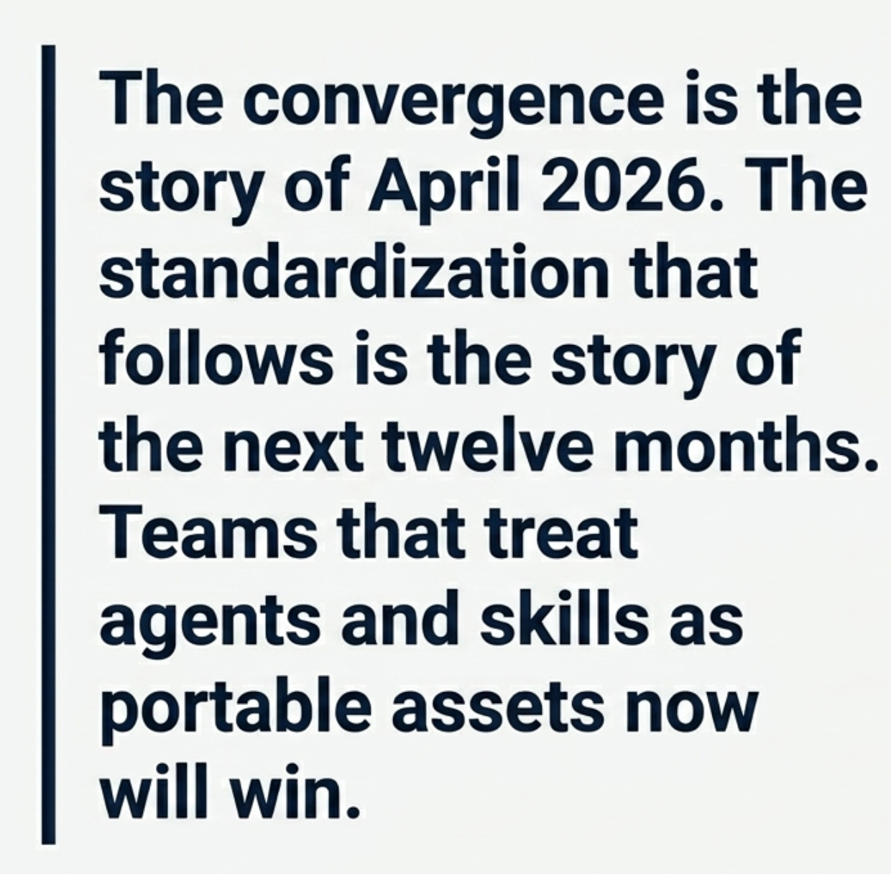

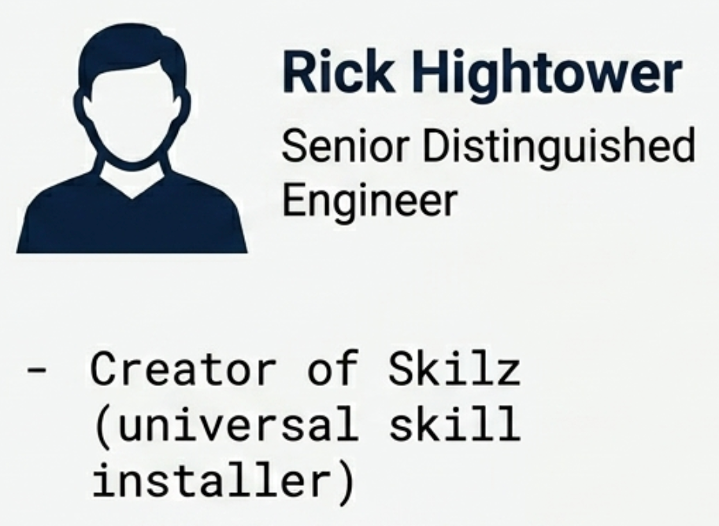

## 参考文献

[\[1\]](https://winbuzzer.com/2025/07/26/anthropic-rolls-out-sub-agents-for-claude-code-to-streamline-complex-ai-workflows-xcxwbn/)：Anthropic introduces subagents in Claude Code. Winbuzzer, July 26, 2025. https://winbuzzer.com/2025/07/26/anthropic-rolls-out-sub-agents-for-claude-code-to-streamline-complex-ai-workflows-xcxwbn/

[\[2\]](https://opencode.ai/docs/agents/)：OpenCode Plan and Build agents. OpenCode Docs: Agents, 2026. https://opencode.ai/docs/agents/

[\[3\]](https://simonwillison.net/2026/Mar/16/codex-subagents/)：Codex CLI subagents reach GA. Simon Willison, March 16, 2026. https://simonwillison.net/2026/Mar/16/codex-subagents/

[\[4\]](https://developers.googleblog.com/subagents-have-arrived-in-gemini-cli/)：Subagents in Gemini CLI v0.38.1. Google Developers Blog, April 15, 2026. https://developers.googleblog.com/subagents-have-arrived-in-gemini-cli/

[\[5\]](https://developers.openai.com/codex/cli/slash-commands)：Codex CLI slash commands including /plan. OpenAI Codex Docs, 2026. https://developers.openai.com/codex/cli/slash-commands

[\[6\]](https://geminicli.com/docs/cli/plan-mode/)：Plan Mode in Gemini CLI. Gemini CLI Docs: Plan Mode, 2026. https://geminicli.com/docs/cli/plan-mode/

[\[7\]](https://geminicli.com/docs/tools/ask-user/)：ask_user tool in Gemini CLI. Gemini CLI Docs: Ask User Tool, 2026. https://geminicli.com/docs/tools/ask-user/

[\[8\]](https://developers.openai.com/codex/cli/sandboxing)：Codex sandbox modes. OpenAI Codex Sandboxing, 2026. https://developers.openai.com/codex/cli/sandboxing

[\[9\]](https://geminicli.com/docs/sandbox/)：Gemini CLI sandbox backends. Gemini CLI Docs: Sandbox, 2026. https://geminicli.com/docs/sandbox/

[\[10\]](https://code.claude.com/docs/en/skills)：Claude Code skills and memory predate Gemini's /memory. Anthropic Claude Code Docs, 2025. https://code.claude.com/docs/en/skills

[\[11\]](https://github.com/google-gemini/gemini-cli/releases/tag/v0.39.0)：Memory Bank in Gemini CLI v0.39.0. Gemini CLI v0.39.0 Changelog, April 2026. https://github.com/google-gemini/gemini-cli/releases/tag/v0.39.0

[\[12\]](https://en.wikipedia.org/wiki/Model_Context_Protocol)：MCP integration across CLIs. Model Context Protocol overview. https://en.wikipedia.org/wiki/Model_Context_Protocol

[\[13\]](https://mcpevals.io/stats)：MCP server registry passes 10,000 active servers. MCP Statistics, December 2025. https://mcpevals.io/stats

[\[14\]](https://docs.claude.com/en/docs/claude-code/routines)：Claude Code Routines research preview. Anthropic Docs, April 2026. https://docs.claude.com/en/docs/claude-code/routines

[\[15\]](https://developers.openai.com/codex/cli/subagents)：/fork and /agent slash commands. Codex Subagents Docs, OpenAI Developers, 2026. https://developers.openai.com/codex/cli/subagents

[\[16\]](https://developers.openai.com/codex/cli/approvals)：Codex approval policy and requirements.toml. OpenAI Codex Approvals & Security, 2026. https://developers.openai.com/codex/cli/approvals

[\[17\]](https://github.com/google-gemini/gemini-cli/discussions/22078)：Plan Mode launches in Gemini CLI v0.33.0. GitHub Discussion #22078, google-gemini/gemini-cli, March 11, 2026. https://github.com/google-gemini/gemini-cli/discussions/22078

[\[18\]](https://blog.google/technology/google-deepmind/gemini-model-thinking-updates-march-2025/)：Gemini 2.5 Pro 1M-token context. Google DeepMind Blog, March 2025. https://blog.google/technology/google-deepmind/gemini-model-thinking-updates-march-2025/

[\[19\]](https://developers.openai.com/codex/cli/models)：Codex models GPT-5.5 / 5.4 / 5.4 mini. OpenAI Codex Models, 2026. https://developers.openai.com/codex/cli/models

## 关于作者

Rick Hightower 曾任某 fortune 100 公司的 Senior Distinguished Engineer

Rick Hightower 曾任某 fortune 100 公司的 Senior Distinguished Engineer，专注于把 ML / AI 见解送到一线应用，也是构建多代理生产系统的实战派。在 Medium 上关注他，可以看到更多 agent 工程的实战内容。也可以预约他来给团队做演讲与培训：见 [Rick Hightower's SpeakerHub](https://speakerhub.com/speaker/richard-matthew-hightower)。

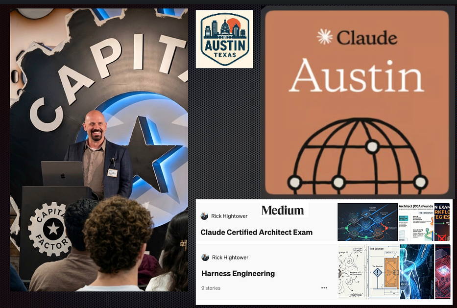

他创建了 skilz，这是一款[通用 agent skill 安装器](https://skillzwave.ai/docs/)，支持 30 多款编码 agent，包括 Claude Code、Gemini、Copilot 与 Cursor，并联合创办了世界最大的 agent skill 市场。在 [LinkedIn](https://www.linkedin.com/in/rickhigh/) 或 [Medium](https://medium.com/@richardhightower) 上联系 Rick Hightower。访问 [SpillWave](https://spillwave.com/)，那是你获取 AI 专业能力的来源。

Rick 多年来一直在积极开发生成式 AI 系统、agent 与代理工作流。他是多个代理框架与开发者工具的作者，为想要采用 AI 的团队带来深厚的实战经验。他喜欢用第三人称写自己。

Rick 还写过一个 [Claude Certified Architect](https://medium.com/@richardhightower/claude-certified-architect-the-complete-guide-to-passing-the-cca-foundations-exam-9665ce7342a8)（CCA）系列文章，里面有大量关于编写代理 AI 系统的有用信息。CCA 系列与他写的备考资料中的许多想法，都与本文呼应。如果你想提升构建守规矩 AI agent 的能力，备考 CCA 是一个不错的起点。

**关于代理开发的 CCA 备考文章**

- [Claude Certified Architect: The Complete Guide to Passing the CCA Foundations Exam](https://medium.com/@richardhightower/claude-certified-architect-the-complete-guide-to-passing-the-cca-foundations-exam-9665ce7342a8)
- [CCA Exam Prep: Mastering the Code Generation with Claude Code Scenario](https://medium.com/@richardhightower/cca-exam-prep-mastering-the-code-generation-with-claude-code-scenario-95f2d8d06742)
- [CCA Exam Prep: Mastering the Multi-Agent Research System Scenario](https://medium.com/@richardhightower/cca-exam-prep-mastering-the-multi-agent-research-system-scenario-aa0c446a5e7d)
- [CCA Exam Prep: Structured Data Extraction](https://medium.com/@richardhightower/cca-exam-prep-structured-data-extraction-86ad3c7541a3)
- [CCA: Master the Developer Productivity Scenario](https://medium.com/@richardhightower/cca-master-the-developer-productivity-scenario-for-the-claude-certified-architect-exam-from-e402d9bb277d)
- [Claude Certified Architect: Master the CI/CD Scenario](https://medium.com/@richardhightower/claude-certified-architect-master-the-ci-cd-scenario-for-the-cca-foundations-exam-the-flags-de2478a346da)
- [CCA Exam Prep: Mastering the Customer Support Resolution Agent Scenario](https://medium.com/@richardhightower/claude-code-certification-exam-prep-mastering-the-customer-support-resolution-agent-scenario-5b82a086eaf8)

Rick 还写过一个关于 harness engineering 的系列，讲如何用 harness engineering 通过反馈循环与对抗式 agent 来提升代理系统。这些文章与本文相辅相成。

**Harness Engineering 文章**

- [The $9 Disaster: What Anthropic's Harness Design Paper Teaches Us About Building Autonomous AI](https://medium.com/@richardhightower/the-9-disaster-what-anthropics-harness-design-paper-teaches-us-about-building-autonomous-ai-2f76c3d86dd9)
- [Harness Engineering vs Context Engineering: The Model is the CPU, the Harness is the OS](https://medium.com/@richardhightower/harness-engineering-vs-context-engineering-the-model-is-the-cpu-the-harness-is-the-os-51b28c5bddbb)
- [LangChain Deep Agents: Harness and Context Engineering: Memory, Skills, and Security](https://medium.com/@richardhightower/langchain-deep-agents-harness-and-context-engineering-memory-skills-and-security-a68737d84940)
- [Beyond the AI Coding Hangover: How Harness Engineering Prevents the Next Outage](https://medium.com/@richardhightower/beyond-the-ai-coding-hangover-how-harness-engineering-prevents-the-next-outage-e6fae5fe4d3b)
- [LangChain's Harness Engineering: From Top 30 to Top 5 on Terminal Bench 2.0](https://medium.com/@richardhightower/langchains-harness-engineering-from-top-30-to-top-5-on-terminal-bench-2-0-8895dbab4932)
- [Anthropic's Harness Engineering: Two Agents, One Feature List, Zero Context Overflow](https://medium.com/@richardhightower/anthropics-harness-engineering-two-agents-one-feature-list-zero-context-overflow-7c26eb02c807)
- [OpenAI's Harness Engineering Experiment: Zero Manually-Written Code](https://medium.com/@richardhightower/openais-harness-engineering-experiment-zero-manually-written-code-100a24ad04cf)

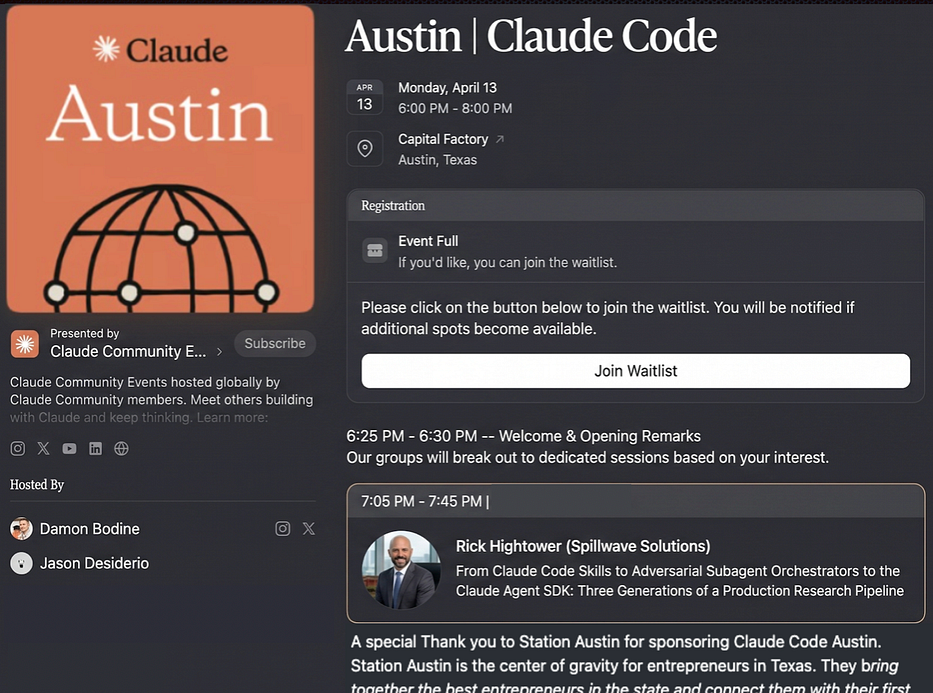
