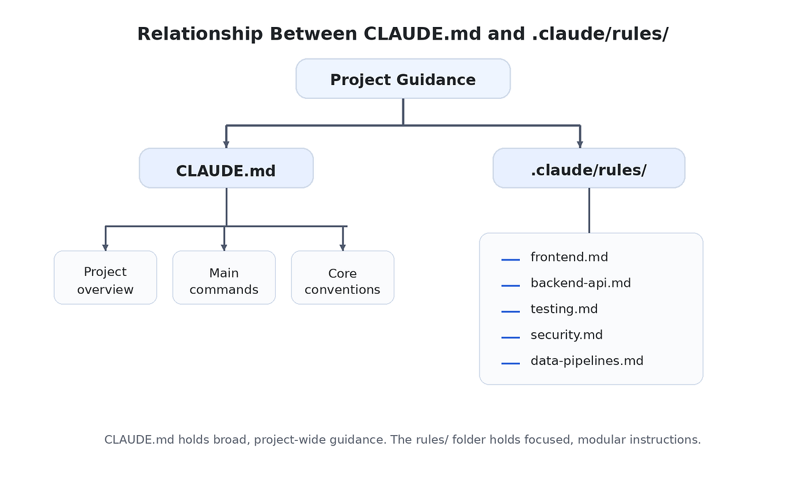
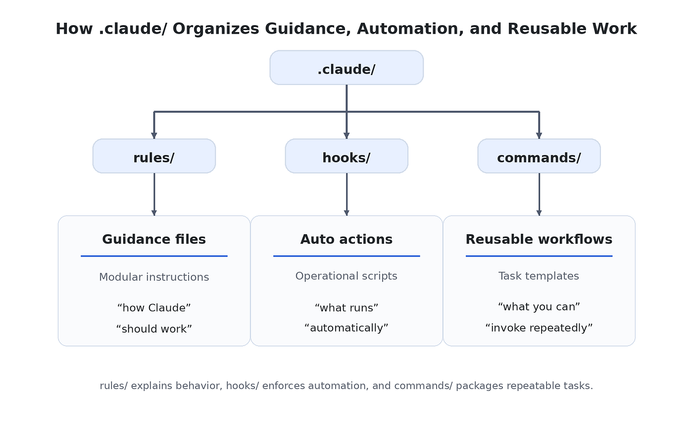
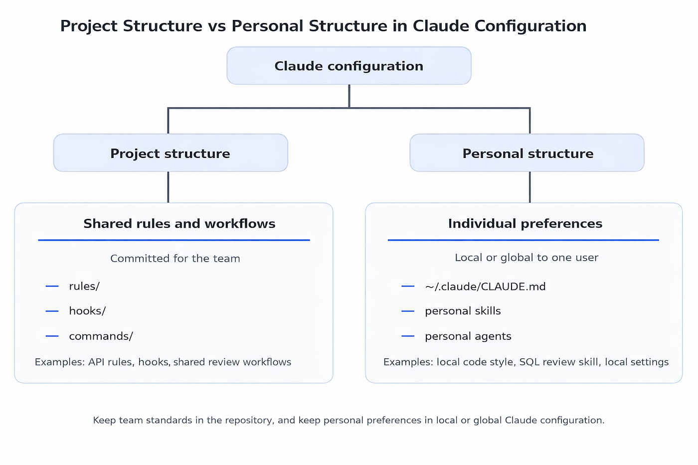

**作者：** Youssef Hosni
**发布日期：** 2026 年 4 月 11 日
**原文链接：** [How to Structure .Claude/ Folder for Maximum Efficiency](https://levelup.gitconnected.com/how-to-structure-claude-folder-for-maximum-efficiency-c26ef3f552ba)

---

# 如何组织 .claude/ 文件夹以实现最大效率

**副标题：如何为真实项目配置 Claude Code：instructions、rules、hooks、skills 与 permissions 实用指南**


**目录：**

1. 为什么 .claude/ 的结构很重要？
2. 从核心开始：顶层应该放什么
3. 保持指令精简：CLAUDE.md 与 rules/
4. 面向行动的组织：hooks/、commands/ 与可复用工作流
5. 构建专项能力：skills/ 与 agents/
6. 区分团队结构与个人结构
7. 高效 .claude/ 文件夹的实用蓝图
8. 常见结构错误及如何规避

---

大多数 Claude Code 用户知道 .claude/ 文件夹的存在，但真正认真考虑过如何组织它的人却少之又少。

起初，这通常不成问题。小型项目靠一个基础的 CLAUDE.md、几个配置项再加一两个额外文件就能应付。但随着项目规模扩大，这种随意的做法开始暴露短板：指令越来越难以维护，工作流分散在各个角落，文件夹慢慢变成有用配置与难以解释的杂物的混合体。

这就是结构重要的原因。

一个组织良好的 .claude/ 文件夹能让 Claude 更易引导、更值得信赖，也更容易在真实项目中规模化。它有助于将宽泛的指令与详细的规则分开，将可复用的工作流与自动化操作分开，将团队标准与个人偏好分开。与其把 .claude/ 当成随机配置的垃圾场，不如把它视为项目运行层（operating layer）的组成部分。

本文将介绍如何组织 .claude/ 文件夹以实现最大效率、每个部分应该放什么，以及随着工作流日趋复杂如何保持整洁。

---

## 1. 为什么 .claude/ 的结构很重要？

大多数人是偶然发现 .claude/ 文件夹的。

他们看到它出现在项目里，意识到这和 Claude Code 有关，然后就不管它了，除非需要改某个具体设置。随着时间推移，那个文件夹变成了指令、脚本、规则和实验文件的混合体，毫无清晰的结构可言。

起初还行，一旦项目成长就不灵了。

组织混乱的 .claude/ 文件夹和组织混乱的代码库一样，会带来同样的摩擦：指令越来越难维护，重要规则被淹没，自动化脚本堆积而没有命名规范，团队成员不再清楚该把新的指导放哪里，也不知道哪些文件还在使用。原本应该让 Claude 更好用的文件夹，反而开始制造噪音。

组织良好的 .claude/ 文件夹则截然相反。它让 Claude Code 配置的每个部分都有明确的位置：主要指令触手可及，可复用规则与一次性偏好分开存放，钩子（hook）和工作流文件放在可预期的位置，技能（skill）和代理（agent）作为经过精心设计的工具而非零散的实验来组织。

这种结构之所以重要，是因为 Claude Code 在配置易于理解时效果最好——不仅对 Claude 如此，对你和你的团队也一样。文件夹整洁，更新时才有信心；一旦凌乱，即便是小改动也会让人心生顾虑。

目标不是打造一个尽可能庞大的 .claude/ 文件夹，而是打造一个易于导航、易于维护、随工作流演进也易于扩展的文件夹。实践中，最大效率来自清晰度：每个文件都有明确用途，每个文件夹都解决具体问题，整体结构一目了然。

这正是妥善组织 .claude/ 的真正价值——你不只是在存储配置文件，你在构建一个塑造 Claude 在项目中工作方式的运行层。

在深入各个组成部分之前，先从整体上看一个高效 .claude/ 文件夹的结构，把它理解为随项目日趋复杂而逐步构建的目标布局：

```
your-project/
├── CLAUDE.md                  # 主项目指令
├── CLAUDE.local.md            # 个人覆盖（不提交）
└── .claude/
    ├── settings.json          # 控制层
    ├── rules/                 # 模块化指令
    ├── hooks/                 # 自动化脚本
    ├── commands/              # 可复用提示词工作流
    ├── skills/                # 封装的能力
    └── agents/                # 专项子代理（subagent）
```

---

## 2. 从核心开始：顶层应该放什么

略过子文件夹不谈，配置中最重要的部分仍然是顶层。Claude 应该在这里找到从最高层面定义项目的文件，而不必深入嵌套目录。

大多数情况下，这意味着两件事最先出现：主指令文件和主配置文件。

在项目根目录，CLAUDE.md 应作为 Claude 理解代码库的入口。这里放置的是 Claude 在几乎每次会话中都需要的核心上下文：技术栈、主要架构决策、重要约定，以及定义常规开发工作流的命令。如果团队成员想了解 Claude 在这个仓库中应该如何工作，这应该是他们首先查阅的文件。

在 .claude/ 文件夹内，settings.json 应位于顶层，原因相同。它不只是一个辅助文件，它控制着 Claude Code 的运行层面：权限（permission）、hook 和需要易于查找和更新的项目级别行为。把它埋在更深的子目录里，会让日常维护变得更难，毫无实际收益。

顶层应该刻意保持精简。很多人的错误在于把 .claude/ 的根目录当成存放各种脚本、工作流和实验笔记的地方。这通常会迅速导致杂乱。顶层应只包含全局定义项目的文件，更具体的内容应移入专门的文件夹。

一个简单的思路：

- **CLAUDE.md**：解释项目如何运作
- **settings.json**：控制 Claude 在项目中如何运行
- 子文件夹负责组织其余所有内容

这种区分很有价值，因为这两个文件有不同的用途：CLAUDE.md 关乎指导，settings.json 关乎控制。前者告诉 Claude 代码库中什么重要，后者规定 Claude 被允许做什么以及工作周围应发生哪些自动行为。

举例来说，在一个 FastAPI 项目中，CLAUDE.md 可能说明所有 API schema 位于 `schemas/`，所有服务逻辑位于 `services/`，每个端点都应用 Pydantic 模型验证输入。

而 `.claude/settings.json` 则可能允许 Claude 执行测试命令、拒绝访问 `.env` 文件，并在文件编辑后触发格式化 hook。这两个文件协同工作，但不应混为一谈。

顶层还应清晰区分共享文件与个人覆盖。共享的 CLAUDE.md 属于根目录，整个团队都能从中受益。

个人覆盖（如 CLAUDE.local.md）则不同——它存放本地偏好，不应纳入团队的共享结构。`.claude/` 内的 `settings.local.json` 也遵循同样的逻辑。

换言之，顶层应该优先回答最重要的问题：Claude 需要了解这个项目的什么？Claude 在这里被允许做什么？其余一切都可以在这个基础上分层组织。

这就是让结构高效的原因：最重要的文件保持显眼，而更专项的内容被推入各自的文件夹，在那里更易管理，不会拥挤核心配置。

---

## 3. 保持指令精简：CLAUDE.md 与 rules/

让 .claude/ 文件夹低效的最简单方式，就是往 CLAUDE.md 里塞太多东西。

起初这个文件通常运作良好，因为项目还小：加几个命令、一些编码约定，也许再写一段架构说明。但随着代码库扩大，CLAUDE.md 往往变成了团队希望 Claude 记住的所有内容的大杂烩。此时它开始失去清晰度。

更好的结构是将 CLAUDE.md 视为项目的操作指南，而非其完整的知识库。

CLAUDE.md 应包含 Claude 在大多数会话中需要的指令：

- 项目是什么
- 如何组织
- 哪些命令最重要
- 哪些约定适用范围较广
- Claude 不应忽视的约束

rules/ 文件夹则存放更具体的指导：与特定代码库区域、特定工作流或特定工程关注点（如测试或安全性）相关的指令。

简单来说：

- **CLAUDE.md** 存放全局指导
- **rules/** 存放专项指导

这种分离让结构更易维护、更易扩展。

**实例说明**

假设你在一个包含三个主要模块的产品上工作：

- Next.js 前端
- FastAPI 后端
- 用于报表任务的数据管道

如果把所有内容都写进 CLAUDE.md，文件很快变得嘈杂——前端约定、后端验证规则和数据管道说明堆在一起。Claude 获得的上下文更多，但不一定更好。

更清晰的结构如下：

```
your-project/
├── CLAUDE.md
└── .claude/
    └── rules/
        ├── frontend.md
        ├── backend-api.md
        ├── testing.md
        └── data-pipelines.md
```

在这个结构中：

- **CLAUDE.md**：从高层解释产品
- **frontend.md**：聚焦 UI 约定
- **backend-api.md**：聚焦 API 行为和验证规则
- **testing.md**：解释如何编写和运行测试
- **data-pipelines.md**：记录批处理任务和定时任务的约定

这比一个庞大的指令文件容易维护得多。

**CLAUDE.md 应该放什么**

一个好的 CLAUDE.md 通常包含：

- 主要技术栈
- 高层架构
- 最重要的开发命令
- 宽泛的代码约定
- 重要的全项目警告或约束

以下是一个 FastAPI 项目的简短示例：

```markdown
# Project: Customer Insights AP

## Stack
- FastAPI
- PostgreSQL
- SQLAlchemy
- Pytest

## Structure
- `app/api/` contains route definitions
- `app/services/` contains business logic
- `app/models/` contains ORM models
- `app/schemas/` contains request and response schemas

## Commands
- `pytest` runs the test suite
- `alembic upgrade head` applies migrations
- `ruff check .` runs linting
- `ruff format .` formats the code

## Conventions
- Validate all request bodies with Pydantic schemas
- Keep route handlers thin; business logic belongs in services
- Do not expose internal exception details in API responses
```

这很有价值，因为它给了 Claude 一个可靠的起点，而不会把它淹没在细节中。

**哪些内容应移入 rules/**

一旦指令变得狭窄或专属于某个区域，就把它们移出 CLAUDE.md。

例如，`backend-api.md` 可能包含如下规则：

```markdown
# Backend API Rules

- Every new endpoint must include request and response schemas
- Use dependency injection for database sessions
- Return paginated results for collection endpoints
- Log external API failures with the shared logger
- Prefer service-layer functions over logic inside route files
```

而 `frontend.md` 可能这样写：

```markdown
# Frontend Rules

- Prefer server components unless client interactivity is required
- Keep UI state local unless it is shared across pages
- Reuse design system components before creating new ones
- Put page-specific components beside their route when possible
```

每个文件都有明确的用途。

**何时选择 rules/**

以下情况通常应拆分到 rules/：

- CLAUDE.md 开始显得拥挤
- 仓库的不同部分需要不同指导
- 不同人有不同的标准
- 团队频繁更新约定
- 你想把指令限定到特定路径或关注点

这里模块化开始带来回报：不必每次都编辑一个大文档，只需更新与问题相关的那个文件。


这张图帮助读者理解：CLAUDE.md 是中心层，而 rules/ 把详细指导拆分成更小的单元。

**基于路径的规则：更强大的结构**

随着仓库增长，让某些规则仅适用于特定文件会很有用。例如：

```
.claude/
└── rules/
    ├── frontend.md
    ├── backend-api.md
    ├── tests.md
    └── migrations.md
```

这样，后端专用指令不会干扰前端工作，而迁移指导只在 Claude 处理数据库变更时出现。

即使不深入语法细节，核心的组织思路也很简单：全局指令保持宽泛，有针对性的指导移入模块化文件。

**为什么这种结构更高效**

这种分离从三个方面提升效率：

其一，保持 CLAUDE.md 可读。这让人和 Claude 都能快速提取项目的主要上下文。

其二，减少维护开销。不必每次某个约定发生变化就重新打开一个庞大的文件。

其三，为团队所有权创造更清晰的路径。负责测试、前端或 API 设计的人可以更新自己的规则文件，而不会把主指令文件变成共享的杂乱之所。

实践中，最好的配置不是指令最多的那个，而是指令被放在正确层级的那个。

---

## 4. 面向行动的组织：hooks/、commands/ 与可复用工作流

一旦 .claude/ 文件夹有了清晰的指令层，下一步就是组织那些将指导转化为行动的文件。

这里是很多配置开始变乱的地方：团队加了一个格式化的 shell 脚本，加了一个拉取请求（PR）审查的提示词文件，也许又加了一个检查测试的脚本——没多久，这些文件散落在 .claude/ 根目录，名字只有创建它们的人才能看懂。

更好的做法是将指令文件与行动文件分开。

**指令文件**解释 Claude 应该如何工作，**行动文件**支撑 Claude 重复执行的具体操作。这就是 hooks/ 和 commands/ 这类文件夹值得独立存在的原因。

**hooks/ 的作用**

hooks/ 文件夹存放在 Claude 工作流特定节点自动运行的脚本。

这些文件不是通用文档，而是操作脚本，它们的职责通常是以下三种之一：

- 阻止危险操作
- 清理或验证 Claude 的输出
- 强制执行工作流要求

一个清晰的结构可能如下：

```
.claude/
├── settings.json
├── hooks/
│   ├── block-dangerous-commands.sh
│   ├── format-edits.sh
│   └── run-tests-before-stop.sh
└── commands/
    ├── review-pr.md
    ├── write-tests.md
    └── summarize-changes.md
```

在这个结构中：

- `block-dangerous-commands.sh` 是安全 hook
- `format-edits.sh` 保持文件修改的整洁
- `run-tests-before-stop.sh` 在 Claude 结束前检查质量

这远比把所有三个脚本直接扔进 .claude/ 更易理解。

**一个实用的 hook 示例**

假设你在一个 Python 服务中工作，每次 Claude 编辑后都要自动格式化。

你的工作流可能用到：

- `ruff format .` 格式化
- `ruff check .` 检查 lint

一个好的做法是把格式化逻辑放在专用脚本里：

```bash
#!/usr/bin/env bash
jq -r '.tool_input.file_path' | xargs ruff format
```

这个脚本放在：

```
.claude/
└── hooks/
    └── format-edits.sh
```

关键在于结构本身：即使 hook 很小，它也应该放在 hooks/ 里，因为这个文件夹告诉团队这是什么类型的文件。

**commands/ 的作用**

commands/ 文件夹适合存放可复用的提示词工作流（prompt workflow）。

这些文件不像 hook 那样自动运行，而是封装你或团队重复执行的任务，例如：

- 审查 PR
- 补充缺失的测试
- 为 release notes 汇总变更
- 调查已报告的 bug
- 起草迁移步骤

commands/ 的价值在于减少重复输入。不必每次都重写同样的指令，而是将工作流一次性保存在清晰的位置。

例如：

```
.claude/
└── commands/
    ├── review-pr.md
    ├── fix-bug.md
    ├── write-tests.md
    └── prepare-release-notes.md
```

每个文件应有一个清晰的用途。这是高效的关键。

**一个实用的 command 示例**

假设你的团队经常在合并前让 Claude 审查后端变更。与其每次都写一遍新的提示词，不如创建：

```markdown
# review-pr

Review the current changes with a focus on:
- correctness
- missing edge cases
- API contract changes
- test coverage gaps
Summarize:
1. critical issues
2. medium-risk issues
3. suggested improvements
```

保存为：

```
.claude/
└── commands/
    └── review-pr.md
```

这立刻让工作流更易复用，也更易随时间改进。

**为什么这些应该分开**

一个常见的错误是模糊这些文件的用途，例如：

- 把可复用的审查提示词塞进 CLAUDE.md
- 把 hook 脚本直接放在 settings 文件旁边
- 用一个庞大的脚本把格式化、测试、通知和日志全部处理

这通常带来维护问题。

更清晰的模式是：

- **CLAUDE.md**：解释项目
- **rules/**：细化指导
- **hooks/**：自动化操作脚本
- **commands/**：可复用的提示词工作流

这种分工让文件夹更易扫描、更易扩展，也更易让队友理解。

整体结构如下：

```
.claude/
├── settings.json
├── rules/
│   ├── frontend.md
│   ├── backend-api.md
│   └── testing.md
├── hooks/
│   ├── block-dangerous-commands.sh
│   ├── format-edits.sh
│   └── run-tests-before-stop.sh
└── commands/
    ├── review-pr.md
    ├── write-tests.md
    └── summarize-changes.md
```

这很直观，因为它表明 hooks/ 和 commands/ 与指令层并列，而非嵌套其中。



**命名策略**

命名也是结构的一部分。

好的命名让用途一目了然：

```
format-edits.sh
block-dangerous-commands.sh
review-pr.md
write-tests.md
```

模糊的命名让文件夹难以使用：

```
script1.sh
helper.sh
misc.md
temp-review.md
```

当有人打开 `.claude/hooks/` 或 `.claude/commands/` 时，应该能立刻理解每个文件的用途。

**一个面向 Web 应用团队的实际示例**

对于一个 SaaS Web 应用，结构可能如下：

```
.claude/
├── hooks/
│   ├── lint-edits.sh
│   ├── block-prod-commands.sh
│   └── notify-on-completion.sh
└── commands/
    ├── review-ui-changes.md
    ├── generate-test-cases.md
    ├── investigate-bug-report.md
    └── draft-release-summary.md
```

这是一个强健的配置，因为每个文件都反映了一个重复出现的需求：hook 负责保护和验证，commands 加速重复任务。

**为什么这种结构更高效**

这种结构将操作逻辑从指令文件中分离出来，从而提升效率。

不必把流程细节塞进 CLAUDE.md，也不必把工具文件散落各处，而是给每种类型的文件指定了自己的位置。这让工作流更易维护，让队友更容易上手，也让人更清楚新文件该放哪里。

实践中，当人们不再需要猜测某个东西是项目规则、自动化脚本还是可复用任务定义时，.claude/ 文件夹才能真正发挥作用。这种清晰度就是让配置得以规模化的关键。

---

## 5. 构建专项能力：skills/ 与 agents/

一旦 .claude/ 文件夹的核心组织好了，下一个问题是：是否需要更专项的能力？

这就是 skills/ 和 agents/ 的用武之地。

这两个文件夹很有用，但对大多数项目来说不应作为起点。它们的意义在于：当团队有足够复杂、值得独立成结构的重复工作流时，才引入它们。如果 CLAUDE.md、rules/、hooks/ 和 commands/ 已经覆盖了大部分需求，那是个好信号——说明你的配置还简洁高效。

只有在想让 Claude 以更干净、更可复用的方式处理更专项工作时，才添加 skills/ 和 agents/。

**skills/ 文件夹存什么**

skill 最好理解为一种封装的能力（packaged capability）。当一个工作流具备以下特征时，它适合作为 skill：

- 有明确的用途
- 有可重复的流程
- 有配套文件或详细指导
- 复杂程度超出了一个简短 command 文件所能承载的范围

这就是 skills/ 通常以自包含目录而非散落文件来组织的原因。一个清晰的结构如下：

```
.claude/
└── skills/
    ├── api-review/
    │   ├── SKILL.md
    │   └── checklist.md
    ├── release-prep/
    │   ├── SKILL.md
    │   └── release-template.md
    └── docs-audit/
        ├── SKILL.md
        └── style-guide.md
```

每个 skill 都有自己的位置，这样高效：逻辑、说明和配套文件放在一起。

**一个实用的 skill 示例**

假设你的团队定期准备版本发布，该工作流包括：

- 检查近期变更
- 审查版本说明
- 起草发布摘要
- 确认是否存在迁移或破坏性变更

这已经不是一个简单的可复用提示词，而是一个有上下文的可重复流程。与其把所有内容存在 commands/ 里，不如这样封装：

```
.claude/
└── skills/
    └── release-prep/
        ├── SKILL.md
        └── release-template.md
```

SKILL.md 定义该 skill 的用途，release-template.md 给 Claude 提供可复用的输出结构。这比把发布指令分散在多个 command 文件里整洁得多。

**工作流什么时候应该保持 command 形式**

这个区别对结构很重要。以下情况，command 通常足够：

- 任务简短
- 直接明了
- 主要靠提示词驱动
- 一个文件就能表达清楚

以下情况，skill 更合适：

- 任务有多个步骤
- 需要配套文档
- 重要到值得更仔细地标准化
- 会被长期重复使用

简单来说：

- **commands/**：轻量级可复用任务
- **skills/**：有更多深度的封装工作流

**agents/ 文件夹存什么**

agents/ 文件夹存放专项子代理（subagent）。当你希望为某类工作定义一个更聚焦的角色化 persona，而不是对每个任务都使用相同的通用 Claude 配置时，它就派上用场了。你可以定义专注的角色，例如：

- 代码审查员（code reviewer）
- 安全审计员（security auditor）
- 文档编辑（documentation editor）
- 迁移检查员（migration checker）
- 性能审查员（performance reviewer）

一个清晰的结构如下：

```
.claude/
└── agents/
    ├── code-reviewer.md
    ├── security-auditor.md
    ├── docs-writer.md
    └── performance-checker.md
```

每个 agent 文件有单一、明确的用途，因此这种做法有效。

**一个实用的 agent 示例**

假设你的团队经常在合并前让 Claude 审查 API 变更的正确性和边界情况。通用提示词或许可用，但随着时间推移，你可能希望有一个边界更清晰的专属审查员 persona。

这就是创建这样一个 agent 的充分理由：

```
.claude/
└── agents/
    └── code-reviewer.md
```

该 agent 可专注于：

- 正确性
- 有风险的假设
- 缺失的边界情况
- 测试覆盖率不足

结构上的好处在于：专项审查逻辑不再隐藏在某个随机提示词里，或散落在多个文件中，而是有一个专属的位置。

**保持两个文件夹整洁且目的明确**

skills/ 和 agents/ 最大的错误之一是把它们当成实验存储区。这通常导致文件夹里充斥着：

- 未完成的 skill
- 重复的 agent
- 职责重叠的审查员 persona
- 模糊的名字如 `helper.md` 或 `analysis.md`

这让配置更难使用，而非更高效。更好的规则是：

- 每个 skill 解决一个重复出现的工作流
- 每个 agent 拥有一个专项角色
- 如果两个文件高度重叠，它们可能应该合并或简化

整体结构如下：

```
.claude/
├── commands/
│   ├── review-pr.md
│   └── write-tests.md
├── skills/
│   ├── release-prep/
│   │   ├── SKILL.md
│   │   └── release-template.md
│   └── docs-audit/
│       ├── SKILL.md
│       └── style-guide.md
└── agents/
    ├── code-reviewer.md
    ├── security-auditor.md
    └── docs-writer.md
```

这个结构展示了清晰的层次递进：

- **commands/**：更轻量的可复用任务
- **skills/**：更丰富的封装工作流
- **agents/**：专项 persona

**一个面向产品团队的实际示例**

对于一个 SaaS 团队，结构可能如下：

```
.claude/
├── skills/
│   ├── release-prep/
│   │   ├── SKILL.md
│   │   └── release-template.md
│   ├── api-audit/
│   │   ├── SKILL.md
│   │   └── api-checklist.md
│   └── onboarding-docs/
│       ├── SKILL.md
│       └── docs-outline.md
└── agents/
    ├── code-reviewer.md
    ├── security-auditor.md
    └── documentation-editor.md
```

当团队有几个值得超越单行 command 的重复工作流时，这种结构效果很好。

**什么时候还不需要这些文件夹**

不要仅仅因为这些文件夹存在就去创建它们。只有在有明确的结构需求时才添加。

以下情况可能还不需要：

- 大多数任务还很简单
- 团队很少重复同样的高级工作流
- command 文件已经能解决问题
- 还在细化基础指令和权限配置

效率不来自于拥有更多文件夹，而来自于只在工作流确实需要时才添加结构。

**为什么这种结构更高效**

skills/ 和 agents/ 在减少重复而不增加杂乱时，才能提升效率。

一个好的 skill 把复杂工作流封装在一处，一个好的 agent 让专项角色保持聚焦且可复用。两者在被有意使用时，都能让 .claude/ 文件夹更易扩展。

但关键在于克制：这些文件夹应该保持精简、目的明确、易于扫描。一旦变成实验的垃圾场，它们就不再有帮助。

最好的 .claude/ 结构不是那些功能最丰富的，而是那些只在进阶特性确实能改善工作流时才引入的。

---

## 6. 区分团队结构与个人结构

一旦你不再把 .claude/ 文件夹视为一个共享空间，而是开始把它看作两个独立的层——团队配置和个人配置——管理起来就会容易得多。

这个区别比大多数人预想的更重要。

在项目早期，所有内容混在同一个地方很常见：某个开发者把个人偏好加进了 CLAUDE.md，有人为只在自己机器上才有意义的工作流调整了 settings.json，还有人加了一个有用的 agent，但它反映的是个人工作风格而非团队需求。

起初这些都不显眼。但随着时间推移，共享配置变得愈发难以理解，因为它已不再清晰地代表项目——而是项目标准与个人习惯的混合体。

摩擦就从这里开始。

高效的配置会在"项目需要什么"与"个人开发者偏好什么"之间划出清晰的界限。

项目级结构应包含帮助整个团队保持一致的规则、工作流和保护措施。这些是你希望每个人克隆仓库并开始在该代码库中使用 Claude 时自动继承的文件。相比之下，个人偏好应保持本地，要么在项目内的覆盖文件中，要么在用户的全局 `~/.claude/` 目录中。

一个健康的结构通常如下：

```
your-project/
├── CLAUDE.md
├── CLAUDE.local.md
└── .claude/
    ├── settings.json
    ├── settings.local.json
    ├── rules/
    ├── hooks/
    ├── commands/
    ├── skills/
    └── agents/
~/.claude/
├── CLAUDE.md
├── settings.json
├── skills/
├── agents/
└── projects/
```

这个布局有效，因为边界清晰。

在项目层面，文件定义 Claude 在这个仓库中的行为方式，包括共享指令、模块化规则、自动化 hook、可复用团队工作流，以及解决重复项目问题的专项 skill 或 agent。

在个人层面，文件定义某个开发者在跨仓库工作时的偏好，可能包括个人写作风格偏好、私有 skill、自定义 agent，或不应提交到团队仓库的机器特定状态。

一个简单的判断标准：如果配置能帮助整个团队更一致地工作，就放在项目里；如果它主要反映某一个人的工作流，就放在他们的本地或全局配置中。

举例来说，假设一个后端团队正在开发一个支付服务。他们都希望 Claude 遵循相同的 API 约定，避免访问 `.env` 等敏感文件，在完成重大变更前运行检查，并对 PR 使用相同的审查工作流。这些应该放在共享的项目结构中，因为它们能提升所有人的一致性。

这样的配置可能如下：

```
your-project/
├── CLAUDE.md
└── .claude/
    ├── settings.json
    ├── rules/
    │   ├── api.md
    │   ├── testing.md
    │   └── security.md
    ├── hooks/
    │   ├── block-secrets-access.sh
    │   └── run-tests-before-stop.sh
    └── commands/
        ├── review-pr.md
        └── investigate-bug.md
```

这个结构里的所有内容都对团队有价值。任何加入仓库的开发者都应该能立刻从中受益。

再看个人配置。某个开发者可能在多个项目中使用 Claude 来起草技术文档，另一个可能依赖一个用于数据分析工作的私有 SQL 审查 skill。这些可能很有用，但不一定是项目标准，除非团队明确决定采纳，否则应该保持个人化。

个人结构可能如下：

```
~/.claude/
├── CLAUDE.md
├── skills/
│   ├── article-outline/
│   │   ├── SKILL.md
│   │   └── outline-template.md
│   └── sql-review/
│       ├── SKILL.md
│       └── checklist.md
└── agents/
    ├── documentation-editor.md
    └── sql-reviewer.md
```

这种配置提升了个人工作效率，而不会给共享仓库增加噪音。

还有一个有用的中间层：项目内的本地覆盖文件。`CLAUDE.local.md` 和 `.claude/settings.local.json` 这类文件很有用，当某个人想在特定仓库中调整行为而不影响版本控制的团队配置时，它们提供了这种空间。这让人们可以实验或个性化工作流，而不必把每个本地偏好都变成团队决策。

例如，某个开发者在测试 hook 时可能希望有略微不同的本地权限，另一个可能希望 Claude 为自己的审查流程生成更简短的摘要。这些都是本地覆盖文件的好用场景——它们紧贴项目，但不会成为所有人共同遵守的契约。

从结构角度来看，这很重要：.claude/ 配置不应只按文件类型来组织，还应按所有权来组织。

这种所有权划分让配置随团队增长仍可维护。共享文件值得信赖，因为所有人都知道它们代表真正的项目标准；个人文件保持灵活，因为个人可以适配 Claude 到自己的工作方式，而不会在仓库里造成混乱。



真正的结论是：**项目结构关乎一致性，个人结构关乎个人效率。**

当两者混在一起，.claude/ 文件夹变得难以信任也难以维护。当两者分开，配置变得更干净、更易扩展，团队也更容易长期协作。

---

## 7. 高效 .claude/ 文件夹的实用蓝图

一旦各个主要组件都清晰了，下一步就是把它们整合成一个在真实项目中易于维护的结构。

很多团队在这里把事情搞复杂了：他们理解了 CLAUDE.md 的作用，用 rules 和 hooks 做了实验，然后开始以超出管理能力的速度添加文件夹。结果是一个看起来很高级但比默认配置更难用的 .claude/ 配置。

更好的做法是从实用蓝图的角度思考：一个足够有组织以便扩展，但足够简单以让团队中任何人都能快速理解的结构。

一个稳固的基础结构如下：

```
your-project/
├── CLAUDE.md
├── CLAUDE.local.md
└── .claude/
    ├── settings.json
    ├── settings.local.json
    ├── rules/
    │   ├── backend.md
    │   ├── frontend.md
    │   ├── testing.md
    │   └── security.md
    ├── hooks/
    │   ├── block-dangerous-commands.sh
    │   ├── format-edits.sh
    │   └── run-checks-before-stop.sh
    ├── commands/
    │   ├── review-pr.md
    │   ├── write-tests.md
    │   └── summarize-changes.md
    ├── skills/
    │   └── release-prep/
    │       ├── SKILL.md
    │       └── release-template.md
    └── agents/
        ├── code-reviewer.md
        └── security-auditor.md
```

这个结构有效，因为每一层都有明确的职责。

**CLAUDE.md** 给 Claude 提供几乎每次会话都需要的广泛上下文：项目说明、主要命令、高层架构以及适用于整个仓库的约定。

**settings.json** 控制运行层面，权限、hook 和全项目行为都应放在这里。它应该容易找到，因为它定义了 Claude 在代码库内被允许如何工作。

**rules/** 文件夹存放模块化指导。项目将更聚焦的指令拆分到独立文件中（如 backend.md、frontend.md、testing.md、security.md），而不是把所有标准都塞进 CLAUDE.md。这让更新更容易，也防止主指令文件变得臃肿。

**hooks/** 文件夹把自动化脚本放在一个可预期的位置——这些文件自动运行以强制安全或一致性，如阻止危险命令、格式化编辑的文件，或在 Claude 结束前运行检查。

**commands/** 文件夹存放轻量级可复用工作流，适合那些重复频繁但仍适合放在单个提示词文件里的任务，如 PR 审查、编写测试或汇总近期变更。

**skills/** 文件夹是更复杂工作流开始值得额外结构的地方。在这个示例中，release-prep/ 作为独立文件夹封装，因为它很可能不止一个简单指令，还需要清单、模板和 SKILL.md 中清晰的工作流描述。

**agents/** 文件夹存放专项角色。在成熟的配置中，这些文件应保持聚焦和目的明确。如果团队经常让 Claude 审查正确性和边界情况，code-reviewer.md agent 就说得通；如果安全审查是一个有自己视角的重复工作流，security-auditor.md agent 也说得通。

这个蓝图高效的原因，不是它包含了所有可能的文件夹，而是**每个文件夹都有存在的理由**。

这个区别很重要。小型项目可能还不需要 skills/ 或 agents/，一个非常简单的仓库可能只需要：

```
your-project/
├── CLAUDE.md
└── .claude/
    ├── settings.json
    ├── rules/
    │   ├── testing.md
    │   └── security.md
    └── hooks/
        └── format-edits.sh
```

这仍然是一个强健的结构，事实上，在早期阶段往往是更好的选择。效率不来自于提前填满每个文件夹，而来自于只在工作流真正需要时才添加结构。

考虑这个蓝图的一个有用方式是把它看作一种渐进：

1. 从 CLAUDE.md 和 settings.json 开始
2. 当一个指令文件不再可扩展时，添加 rules/
3. 当需要自动化或强制执行时，添加 hooks/
4. 当提示词变得重复时，添加 commands/
5. 当工作流变得更深时，添加 skills/
6. 当专项化明显能改善结果时，添加 agents/

这种渐进让文件夹不会随意增长。

以下是一个拥有前端应用和后端 API 的产品团队的另一个示例：

```
.claude/
├── settings.json
├── rules/
│   ├── ui-components.md
│   ├── api-contracts.md
│   └── testing.md
├── hooks/
│   ├── lint-edits.sh
│   └── block-prod-commands.sh
├── commands/
│   ├── review-ui-changes.md
│   └── investigate-bug.md
└── agents/
    ├── ui-reviewer.md
    └── api-reviewer.md
```

这个版本更精简，但遵循相同的结构逻辑。这正是蓝图的核心要点：具体的文件会因项目而异，但组织原则保持稳定。

一个好的 .claude/ 结构应该能立刻回答以下问题：

- 全项目指令放在哪里？
- 模块化规则放在哪里？
- 自动化脚本放在哪里？
- 可复用工作流放在哪里？
- 哪些文件是共享的，哪些是个人的？
- 哪些部分是活跃的，哪些只是实验？

如果文件夹能清晰回答这些问题，它就已经在发挥作用了。



本节的核心结论很简单：最好的 .claude/ 文件夹不是功能最丰富的那个，而是结构随项目同步成长，每一次新增都让配置更易理解而非更难理解的那个。

---

## 8. 常见结构错误及如何规避

.claude/ 文件夹变得低效，不是因为它太简单，而是因为文件失去了用途。

这通常是渐进式发生的：团队从清晰的配置出发，然后加了几个快速修复、几个实验文件、一些个人偏好，还有一些从未清理的工作流。没有什么看起来严重损坏，但结构变得愈发难以信任。人们不再清楚新文件放哪里、哪些规则还在生效，或者某个脚本究竟是真正的团队标准还是某人的临时变通方案。

这就是 .claude/ 最大的问题通常是结构性的，而非技术性的。

**第一个错误：往 CLAUDE.md 里塞太多东西。** 这是最常见的问题，因为 CLAUDE.md 是最容易添加新指令的地方。随着时间推移，它变成一个将项目概述、编码规则、审查清单、测试说明、例外情况和一次性提醒混在一起的长文档。此时它已不再是高层指南，而是一个杂乱的存储文件。更好的做法是让 CLAUDE.md 聚焦于宽泛的项目上下文，把专项指导移入 rules/。

**第二个错误：在不需要时就添加文件夹。** 有些团队早早创建了 skills/、agents/ 和大量 command 集合，因为这种结构看起来很强大。但空的或几乎不用的文件夹不会让配置更成熟，往往只会让它更令人困惑。如果工作流还很简单，保持简单。一个 command 文件通常就够了；如果项目还不需要专项 agent，就不要为了填充结构而创建它们。

**第三个错误：将团队标准与个人偏好混在一起。** 这通常发生在本地工作习惯开始渗入提交的文件时：某个开发者把自己偏好的表述加进了共享指令，提交了一个只在自己机器上才有意义的工作流，或者没有充分理由就把一个个人 agent 变成了团队文件。一旦发生这种情况，仓库就不再反映团队的共同工作流，而开始反映个人风格。这就是项目结构和个人结构需要分开的原因。

**命名**是结构经常崩塌的另一个地方。一个充满 `misc.md`、`helper.sh`、`test2.md`、`temp-review.md` 的文件夹很快变得难以导航。命名应该让用途显而易见：`review-pr.md` 清晰，`block-dangerous-commands.sh` 清晰。好的命名减少摩擦，因为结构本身能自我说明。

**还有过期文件的问题**，在 commands/、skills/ 和 agents/ 中尤为常见。团队实验了一个工作流，停止使用了，但文件还留在那里；一个规则文件被新的替代了，旧的却没有删除；一个 hook 在实践中被禁用，但脚本还在文件夹里。随着时间推移，.claude/ 目录开始积累死重。这让人很难区分哪些部分是真实的、哪些是遗留物。高效的 .claude/ 文件夹需要定期清理，就像代码库本身一样。

**另一个错误是把所有指令都当作等价物。** 它们并不等价：有些属于 CLAUDE.md，有些属于 rules/，有些属于 commands/，有些根本不应该在 .claude/ 里。例如，如果某个东西本质上是格式化规则、lint 规则或构建规则，它可能应该放在实际的工具配置中，而不是作为 Claude 指令重复一遍。最好的 .claude/ 结构是补充仓库其他部分，而非取代它们。

当文件夹开始感觉拥挤时，问自己以下问题很有帮助：

- 这个文件有一个清晰的用途吗？
- 它属于共享的项目结构还是个人配置？
- 这是宽泛的指令、模块化规则、自动化脚本，还是可复用工作流？
- 当前的命名足够具体吗？
- 这个文件还在被积极使用吗？

如果这些问题的答案不清晰，结构可能需要简化。

常见的 .claude/ 错误一览：

```
常见 .claude/ 错误
│
├── CLAUDE.md 过载
├── 过早添加太多文件夹
├── 共享文件与个人偏好混在一起
├── 文件命名模糊或无意义
├── 废弃的工作流未清理
└── 指令放错了位置
```

目标不是打造一个尽可能精心设计的 .claude/ 文件夹，而是打造一个**每个文件都能站得住脚的**文件夹。

这是本文的核心结论：好的 .claude/ 结构不关乎复杂度，而关乎清晰度。当文件夹组织良好，Claude 变得更易引导、更值得信赖，在一个不断成长的项目中也更易使用。当结构混乱，即便是好的指令也会失去价值，因为围绕它们的系统变得难以维护。

---

## 结语

最好的配置通常从小开始、保持有意为之，并且只在工作流明确需要时才扩展。

这通常意味着：保持核心简单，只在需要扩展时才拆分指令，将自动化与指导分开组织，以及在团队配置和个人偏好之间划出清晰界限。这也意味着，在工作流真正需要之前，要抵制添加额外结构的冲动。

当 .claude/ 组织良好，Claude 的配合感会显著提升——整个配置变得可预期、可维护，也更容易在团队间共享。随着项目成长，文件夹也能随之成长，而不会变得混乱。

归根结底，最大效率来自清晰度：结构越干净，你和 Claude 就越容易用好它。
