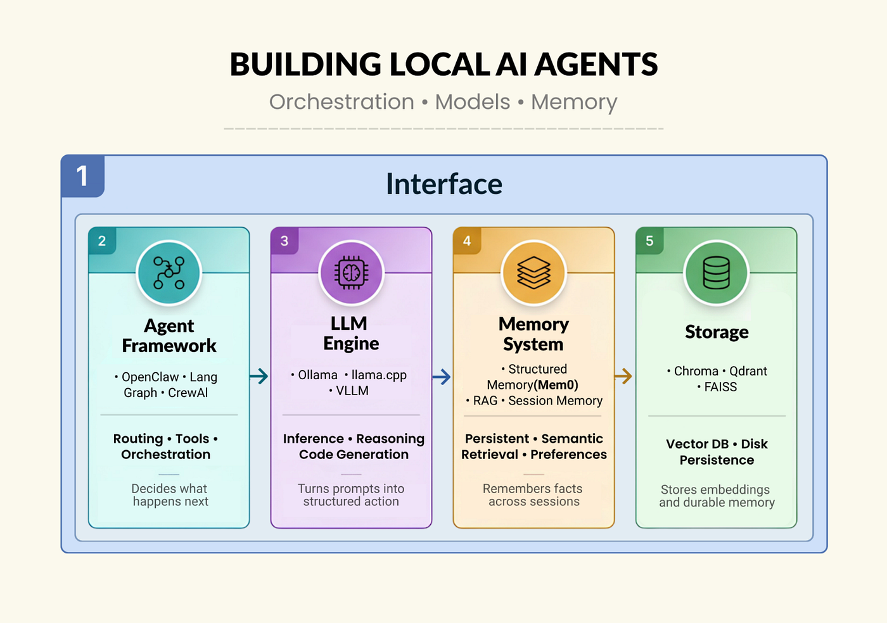
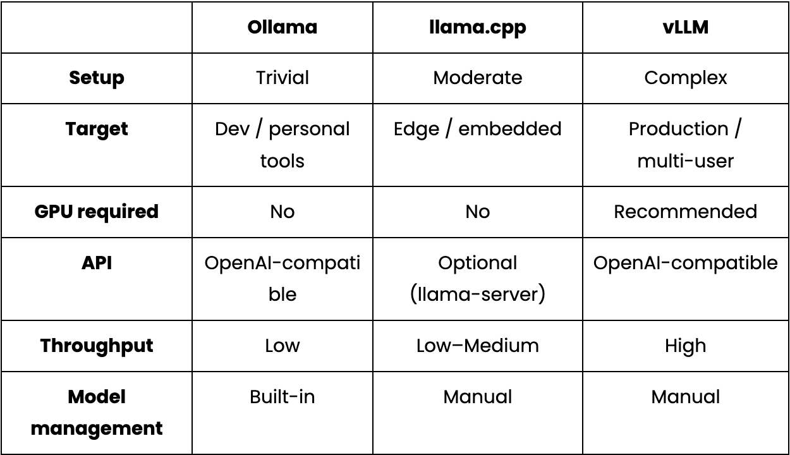
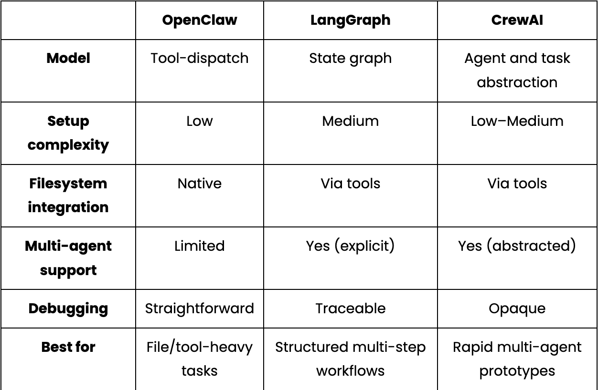
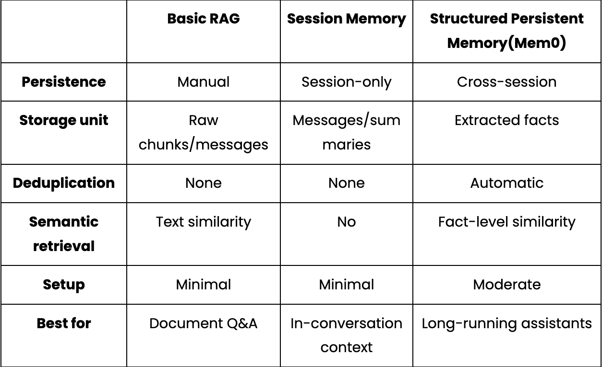
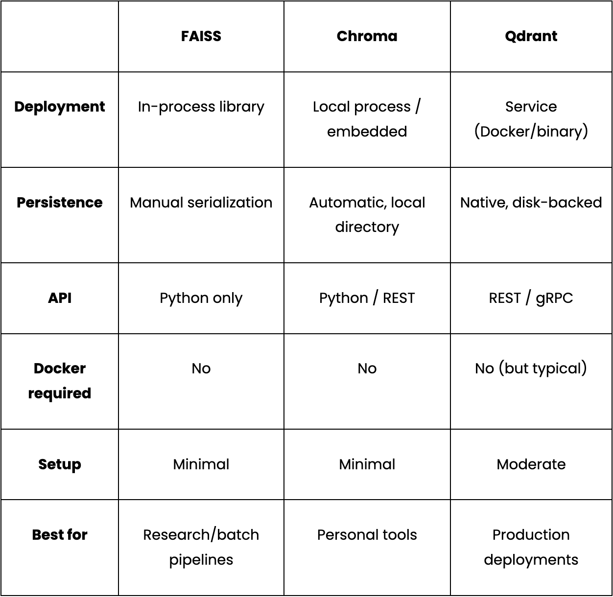
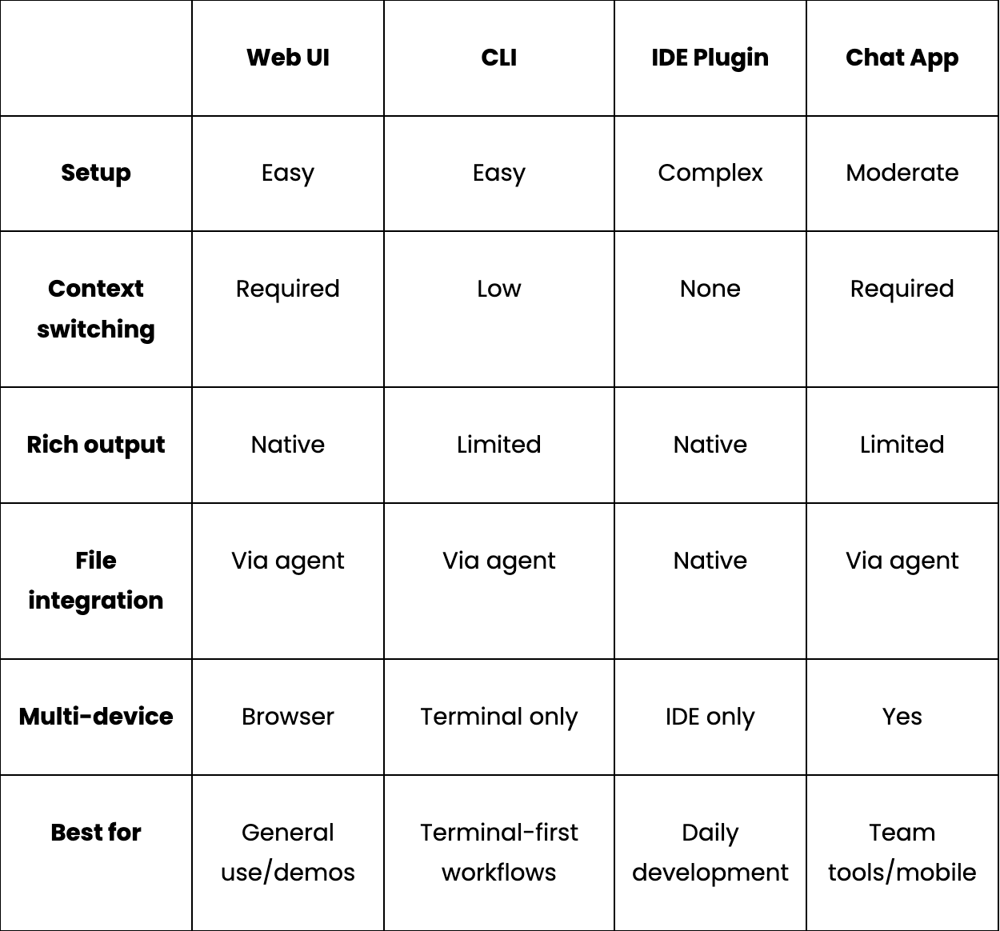

> 作者：Aashi Dutt
> 发布日期：2026-04-06
> 原文链接：https://generativeai.pub/building-local-ai-agents-a-practical-guide-to-models-memory-and-orchestration-12622e9e0269

# 构建本地 AI 智能体：模型、记忆与编排实战指南

本地 AI 智能体（local AI agent）是这样一种系统：模型在你自己的硬件上运行，代你执行动作，并跨会话保持上下文，整个过程不会把数据发送给任何外部 API。它和那种回答完就忘的简单聊天机器人不同——智能体可以进行多步推理（multi-step reasoning），调用工具，并随时间积累知识。把它跑在本地，意味着你既能享受智能助手的好处，又不必承担云端方案带来的隐私让步与 API 成本。

构建一个本地 AI 智能体需要五个层次协同工作：在你的硬件上跑推理（inference）的 LLM 层、负责路由和执行动作的智能体框架层、让智能体随时间变得更聪明的记忆层、把所学内容持久化下来的存储层、以及把它接入你日常工作方式的接口层。

本文将逐层介绍、对比可选方案，并解释其中的权衡，帮助你搭出一套契合自身使用场景的技术栈。



## Layer 1：LLM 层

这是发动机。模型负责意图检测（intent detection）、代码生成，以及栈中其他部分依赖的任何结构化数据提取。其余一切都只是围绕模型可靠能力搭建起来的管道。

主导本地推理领域的三大工具包括：

**Ollama**：这是进入本地推理最简单的入口。一条命令安装、一条命令拉模型，一个兼容 OpenAI 接口的 API 立刻就跑在了 localhost 上。它还会自动处理模型管理、量化（quantization）选择和上下文窗口（context window），无需任何配置。但它不是为生产流量设计的，更适合做个人助手或开发者工具。

```
ollama pull qwen3:8b
ollama pull nomic-embed-text
```

**Llama.cpp**：这个库比 Ollama 更底层。它是一个 C++ 推理引擎，直接运行量化后的 GGUF 模型，没有守护进程（daemon），也没有 HTTP 层。Llama.cpp 的内存占用极小，是边缘部署（edge deployment）的合适选择，比如树莓派、嵌入式 Linux 这类对 Ollama 来说太重的硬件。代价是没有内置的模型管理，配置工作更多需要手动完成。

**vLLM**：这是面向生产的选项。它实现了 PagedAttention 和连续批处理（continuous batching），这些技术正是云端推理 API 大规模使用的方案。如果你要构建的东西需要服务多用户或对吞吐量（throughput）有真实要求，vLLM 才是合适的选择。它需要正经的 GPU 基础设施，但相比 Ollama 或 llama.cpp，它的扩展性更好。



实际操作中，对于单人开发者的本地助手，Ollama 是合适的默认选择，简单性比吞吐量更重要。`qwen3:8b` 模型尤其值得一提：它能产出可靠的 JSON 用于意图检测，代码生成处理得很干净，而且 8 GB VRAM 就装得下。需要注意的一个怪癖是，它会把输出包在 `<think>…</think>` 块里再返回真正的内容，这会让任何处理原始响应的下游 JSON 解析器崩溃。修复方法是写一个小拦截，在全局注入 `think: False`：

```python
_orig_ollama_chat = ollama.chat
def _no_think_chat(*args, **kwargs):
    opts = kwargs.get("options") or {}
    if isinstance(opts, dict):
        opts.setdefault("think", False)
        kwargs["options"] = opts
    return _orig_ollama_chat(*args, **kwargs)
ollama.chat = _no_think_chat
```

用 `setdefault` 意味着个别调用方仍可以在需要时显式启用思考模式。在工具使用流水线中做 JSON 提取和代码生成时，思考模式只会增加延迟，并不会提升输出质量。

## Layer 2：智能体框架层

LLM 层负责生成文本，而智能体框架（agent framework）决定拿这些文本做什么、下一步做什么。这一层处理意图分类（intent classification）、动作路由和执行。

**OpenClaw** 采用工具优先（tool-first）、文件系统原生（filesystem-native）的方式。每个智能体动作都是一条命令，被分发给一个声明好的技能（skill），比如创建文件、写代码、打开文件夹、运行 shell 命令。你写一份 `SKILL.md` 文件，声明技能名称和分发方式，OpenClaw 负责路由：

```yaml
---
name: local-ai-assistant
description: Local AI coding assistant with persistent memory
command-dispatch: tool
command-tool: exec
command-arg-mode: raw
---
```

对于一个绝大多数操作都是文件 I/O 的代码助手来说，这种模型很自然契合。它的局限在于，它并非为复杂的多步推理链或多智能体协调而设计。

**LangGraph** 走的是相反的路线。你定义一张显式的状态图（state graph）：节点是 LLM 调用或动作，边是状态转移，框架负责跨步骤管理状态。代价是前期设计工作量——你必须先定义状态 schema 和图拓扑，才能写业务逻辑。对简单的工具使用任务，它属于过度工程；但对于复杂的多步流水线，它能提供一份可追溯、可审视的执行记录。

**CrewAI** 在更高的抽象层级上：你定义带角色的智能体、带描述的任务，由框架自行决定执行顺序和智能体间通信。它是搭出可运行多智能体原型最快的路径。缺点是抽象层让失败更难调试。



实际操作中，OpenClaw 的 `command-dispatch: tool` 和 `command-tool: exec` 告诉它在某个技能被调用时去 shell 出 Python 脚本，使文件操作流经框架。无论你选择哪个框架，意图分类都是每条消息进来后第一个跑的环节。两层结构——LLM 分类 + 正则回退（regex fallback）——比单用任何一种都更能应对失败模式：

```python
def detect_intent(message: str) -> dict:
    try:
        resp = ollama.chat(
            model=OLLAMA_CHAT_MODEL,
            messages=[{"role": "user", "content": INTENT_PROMPT.format(message=message)}],
            options={"temperature": 0, "num_predict": 1024},
        )
        return extract_json(resp["message"]["content"])
    except Exception:
        return keyword_intent_fallback(message)
```

正则回退在 LLM 返回畸形输出时捕获常见模式。在思考模式被关闭、温度为 0 的情况下，LLM 路径能处理绝大多数请求，而回退则是让智能体保持可用的兜底。

## Layer 3：记忆层

记忆，是把适应你的智能体和把每次对话都当作第一次的智能体区分开的东西。记忆帮助它学习你的约定、偏好以及项目上下文，并在没人提醒时主动应用。

对所有形式的记忆来说，核心问题都在于上下文内记忆（in-context memory）。常见的绕开方法包括：启动时加载一份 `PREFERENCES.md`、写一段长长的系统提示（system prompt）、维护一个 `CONTEXT.md` 文件。这些方案有一个共同缺陷——它们都活在上下文窗口里，会被上下文压缩（context compaction）、token 上限和会话重启所抑制。

而智能体真正需要的是活在上下文窗口之外的记忆：被持久存储、在相关时按语义被检索、并随事实变化而更新。

下面是几种常见的记忆方案，各自适合不同场景：

**基础 RAG（Retrieval-Augmented Generation，检索增强生成）**：这是最常见的方案，对新手完全友好。一个基础 RAG 流程包括：把文档或对话历史切块（chunking）、做嵌入（embedding），并在查询时检索 top-k 个最相似的片段，配置非常少。它的局限是把记忆当作文档库，因此无法区分什么值得长期保留、什么只是一次性的提问。

**会话级记忆**（如 LangChain 的 `ConversationBufferMemory`、`ConversationSummaryMemory` 等）：它解决了会话内连贯性（in-session coherence），让智能体不会忘记你五条消息之前说过什么，摘要也能阻止上下文窗口被填满。但它撑不过会话重启。对于一个代码助手，这正是核心缺口。

**结构化持久记忆**（Mem0）：它把记忆当作一等公民数据，而非原始文本。系统不再原样存储消息，而是用 LLM 把消息中的离散事实抽取出来，再嵌入并存入向量数据库（vector database）。检索时把查询嵌入，返回语义相似的事实——即便当前消息和事实存储时用词完全不同也能匹配。事实在会话间持续存在，并能随时间被去重（deduplicated）和更新。Mem0 这类库实现了这一模式，并支持本地模型，可以直接接入基于 Ollama 的技术栈。

实际操作中，如果你告诉一个基础 RAG 系统你偏好 pytest，它存的是原始消息。而像 Mem0 这样的结构化记忆系统，会抽取并存储一条离散偏好。下次你让它写一个带测试的函数时，记忆会返回"用户偏好 pytest"——即使你当前的消息根本没提到测试框架。



把 Mem0 集成进本地 Ollama 配置只需一小段配置代码。你只要把它指向本地 LLM、本地嵌入模型和你选择的向量库即可：

```python
from mem0 import Memory
config = {
    "llm": {
        "provider": "ollama",
        "config": {"model": "qwen3:8b", "ollama_base_url": "http://localhost:11434"},
    },
    "embedder": {
        "provider": "ollama",
        "config": {"model": "nomic-embed-text", "ollama_base_url": "http://localhost:11434"},
    },
    "vector_store": {
        "provider": "qdrant",
        "config": {"host": "localhost", "port": 6333, "embedding_model_dims": 768},
    },
}
memory = Memory.from_config(config)
memory.add("I always use type hints and pytest", user_id="dev")
results = memory.search("write a utility function", user_id="dev")
```

上面的 llm 块把 Mem0 指向 `qwen3:8b` 来做事实抽取——把原始消息变成离散的偏好事实，而非逐字文本。embedder 块用 `nomic-embed-text` 在写入时把这些事实转成向量，并在检索时把查询嵌入。最后，`memory.search()` 按语义而非关键字匹配来召回内容。

无论采用哪种记忆方案，都有一个被低估的改进——在写入存储之前先过滤内容。你可以在每次写入前跑一个轻量级分类器，让记忆层保持干净、检索质量保持高。下面这段代码就是做这件事的：

```python
def _is_worth_storing(self, user_message: str) -> bool:
    response = ollama.chat(
        model=OLLAMA_CHAT_MODEL,
        messages=[{"role": "user", "content": SMART_MEMORY_PROMPT.format(
            user_message=user_message
        )}],
        options={"temperature": 0, "num_predict": 512},
    )
    data = self._extract_json_robust(response["message"]["content"])
    return bool(data.get("worth_storing", False))
```

分类器的提示给模型清晰的判别示例：

```
HIGH-VALUE (worth storing):
- "I prefer TypeScript over JavaScript"
- "I use pytest, never unittest"
- "Always use Google-style docstrings"

LOW-VALUE (discard):
- "What does enumerate() do?"
- "Write a retry decorator"
- "Thanks"
```

没有这层过滤，向量数据库会被一次性请求灌满，时间一长会稀释检索质量。

## Layer 4：存储层

记忆层决定记什么，存储层则是这些记忆在磁盘上真正栖身的地方。

**FAISS**：这是一个进程内库（in-process library），速度快、经过充分测试、没有基础设施依赖。我们可以把它直接嵌入 Python 进程，让它在内存中运行或序列化（serialization）到磁盘。它唯一的局限是运维上的：持久化需要显式调用序列化方法，没有 HTTP API 也没有内置复制。它适合研究流水线和批处理任务，但对于频繁重启的长时运行助手来说更脆弱。

**Chroma**：Chroma 是面向开发者最简单的向量数据库。它作为本地 Python 进程运行，并提供可选的嵌入模式。数据自动持久化到本地目录。安装方式只是一条命令：

```
pip install chromadb
```

对于一个有几千条事实的个人助手，Chroma 已经绰绰有余。它彻底消除了基础设施依赖，代价是过滤能力相对 Qdrant 受限。

**Qdrant**：它作为一个正式服务运行，暴露完整的 REST 和 gRPC API，支持载荷过滤（payload filtering）和命名向量（named vectors）。Qdrant 是为百万级向量和并发查询的部署设计的。它作为独立服务运行，原生持久化到磁盘，重启 Docker 也不需要任何特殊处理：

```
# Qdrant via Docker
docker run -d --name qdrant-local -p 6333:6333 \
-v $(pwd)/qdrant_storage:/qdrant/storage qdrant/qdrant
```

下面是这几款服务的快速对比：



有一个会悄悄出错的配置细节：向量库配置中的嵌入维度必须和你嵌入模型输出的维度精确一致。例如，`nomic-embed-text` 模型产出 768 维向量。换成另一个嵌入模型而忘了更新这个值，所有写入会静默失败。

```python
"vector_store": {
    "provider": "qdrant",
    "config": {
        "collection_name": "coding_assistant",
        "host": "localhost",
        "port": 6333,
        "embedding_model_dims": 768,  # must match your embedding model exactly
    },
}
```

如果你想去掉 Docker 依赖，Chroma 是直接的替换——只需把 config 中的 `vector_store` provider 改一下，整套技术栈的其余部分保持不变。

## Layer 5：接口层

这是技术栈最外层、也是最后一层，决定用户如何与智能体交互。合适的接口完全取决于智能体在你既有工作流里嵌入的位置。最常用的几种接口包括：

**Web UI**：这是本地智能体最灵活的接口。它在浏览器里运行，支持 markdown 格式、语法高亮代码、可折叠区域等格式化能力，跨操作系统而无需安装。对于一个代码助手，Web UI 可以在同一视图里并排显示当前文件、生成的代码以及智能体的记忆状态。

**CLI**：CLI 是一个终端助手，自然融入 shell 工作流，能把输出通过管道传给其他工具，且没有任何视觉开销。代价是富文本输出需要额外处理，多轮对话也比聊天界面笨拙。CLI 最适合快速查询、文件操作和脚本化工作流——你希望助手就在已有的终端会话里。

**IDE 插件**：插件作为一个嵌入式助手存在于 VS Code 或 JetBrains 中，与你正在编辑的文件比邻而居，能看到当前打开的是哪个文件，并以行内方式建议修改。代价是 IDE 扩展需要懂特定的扩展 API，且要随 IDE 升级持续维护。对于团队每天都在用的工具，这个投入可能值得。

**聊天应用**（Slack 机器人、Discord 机器人、Telegram 集成）：当助手需要跨设备访问或在团队中共享时，聊天应用就有意义。它在你想从多设备或移动场景接触智能体时表现良好。对代码助手而言的局限是，聊天界面并非为代码评审或文件编辑设计——它更适合问答、状态检查和轻量级请求。

下面这张表可以帮你理解这些对比：



## 收尾

每一层都做了一个会约束相邻层的决策。LLM 的选择决定智能体框架要调用什么形状的 API；记忆方案决定存储层需要支持什么；接口的选择决定输出格式化有多重要。

对于一个单人开发者的本地编码助手，下面这套技术栈在保留每一层可替换性的同时把摩擦最小化：

```
接口：localhost 上的 Web UI
│
框架：OpenClaw —— 工具分发，SKILL.md 路由
│
LLM：Ollama 跑 qwen3:8b
（关闭思考模式以保证 JSON 可靠）
│
记忆：带价值过滤的结构化持久记忆
嵌入由 nomic-embed-text 提供
│
存储：Chroma（零基础设施）或 Qdrant（更稳健）
```

由于每一层都可以独立替换，我们可以在每个层级都从最简单的选项起步，等需求变大了再升级单独的层。把 Chroma 换成 Qdrant，或把 Ollama 换成 vLLM，并不需要重建它上下方的任何东西。

在优化其他东西之前，唯一值得早期投入的一层是记忆。一个体量适中的本地模型搭配设计良好的持久记忆层，往往能稳定胜过那种每次会话都从零开始的更大模型。

如果你想从头到尾跑通这套技术栈，下面是运行本地 AI 智能体流水线的完整可工作源码：

完整源码：[https://github.com/AashiDutt/OpenClaw_Mem0_Ollama](https://github.com/AashiDutt/OpenClaw_Mem0_Ollama)

---

本文发布于 [Generative AI](https://generativeai.pub/)。在 [LinkedIn](https://www.linkedin.com/company/generative-ai-publication) 关注我们，也欢迎关注 [Zeniteq](https://www.zeniteq.com/)，及时获取最新的 AI 内容。

订阅我们的 [newsletter](https://www.generativeaipub.com/) 和 [YouTube](https://www.youtube.com/@generativeaipub) 频道，获取关于生成式 AI 的最新动态。让我们一起塑造 AI 的未来。
