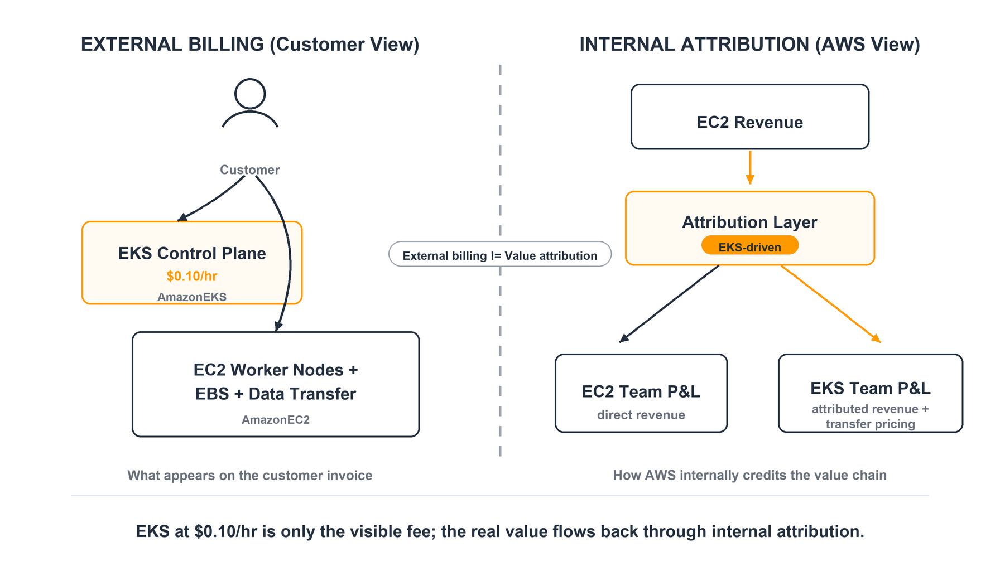
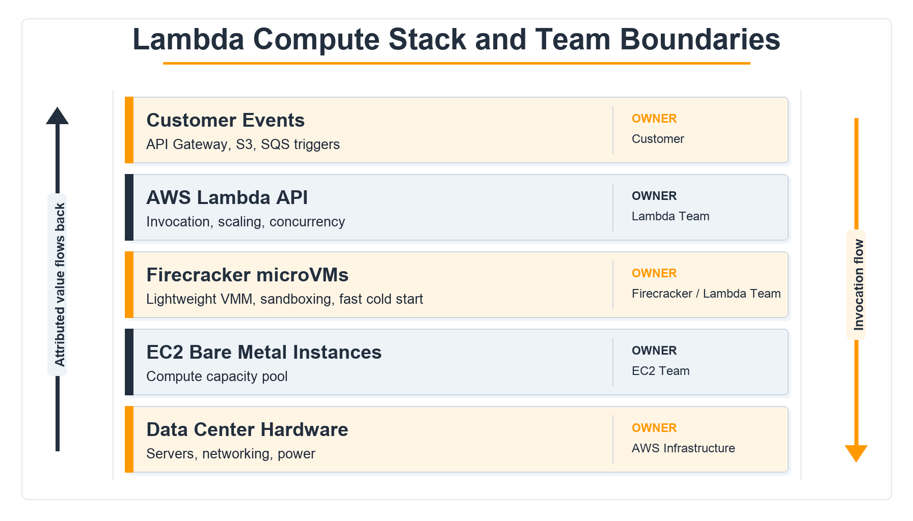

## 开篇案例：EKS 代客拉起的 EC2 节点

先从一个工程师最熟悉的场景开始：团队创建一个 Amazon Elastic Kubernetes Service（EKS）集群，然后用 managed node group、Karpenter 或自建 Auto Scaling Group 拉起一批 EC2 worker nodes。外部账单上，这件事被拆成两层。

第一层是 EKS 控制平面。AWS 当前 [EKS 定价页](https://aws.amazon.com/eks/pricing/)写得很清楚：标准 Kubernetes 版本支持期内，EKS 按每个集群每小时 `$0.10` 收费；进入 extended support 后，价格是每个集群每小时 `$0.60`。同一页还说明，使用 EKS 时，运行应用所需的 worker node 资源要另行付费，例如 EC2 instances、EBS volumes、public IPv4 addresses，以及跨 AZ 到控制平面的流量。[^1]

第二层是这些 worker nodes 及其周边资源。它们在账单视角属于 EC2、EBS、VPC data transfer 等服务，而不是 EKS。AWS Cost and Usage Report（CUR）的 [`lineItem/ProductCode`](https://docs.aws.amazon.com/cur/latest/userguide/Lineitem-columns.html) 字段就是外部账单归属的基本维度之一；AWS 文档举例说明，Amazon EC2 是 Amazon Elastic Compute Cloud 的 product code，`lineItem/Operation` 还能进一步显示诸如 `RunInstances` 这样的操作。[^2] 也就是说，如果只按客户账单的 service line 来看，EKS 团队的显性收入主要是控制平面的 `$0.10/h`，而真正的大头，通常是被 Kubernetes 调度出来的 EC2、EBS、网络与负载均衡资源。

这就产生了一个悖论。EKS 的产品价值并不在于每小时收十美分，而在于它让客户更愿意把容器工作负载放到 AWS 上运行，并持续消耗底层基础设施。如果内部考核也只照搬外部账单归属，EKS 团队会被激励去提高控制平面费用，或者把更多功能包装成 EKS 自己的收费项；而不是把产品做得更好用、更便宜、更能带动客户使用 AWS 的底层计算资源。

AWS 给客户提供的成本分摊机制，已经显示出它理解这个问题。[Cost allocation tags](https://docs.aws.amazon.com/awsaccountbilling/latest/aboutv2/cost-alloc-tags.html)（成本分摊标签）允许客户把 EC2、S3 等资源按 cost center、application name、owner 等业务维度重新组织成本；AWS 文档还强调，激活标签后，账单报告会用这些标签把 usage 和 costs 分组，帮助客户跟踪跨服务成本。[^3] 这不是 AWS 内部的财务系统，但它说明了一个基本事实：真实业务归属往往不等于账单服务名。

这一节对本系列核心问题的意义在于：PaaS 产品的价值经常体现在 IaaS 消耗里。如果组织只按账单服务名核算，PaaS 团队天然会被低估。

## AWS 内部财务系统如何解这个悖论

先把边界说清楚：AWS 没有公开一份文档，逐条说明 EKS、Lambda、Bedrock 等服务团队之间如何结算 attributed revenue（影子收入 / 关联归属收入）和 transfer pricing（内部转移定价）。因此，本文不会声称知道某个服务团队的具体比例、公式或利润分成规则。公开材料能支持的是三件事。

第一，AWS 作为公司明确按 AWS segment 披露收入和 operating income。[Amazon 2024 Annual Report](https://www.sec.gov/Archives/edgar/data/1018724/000110465925033453/tm254123d4_ars.pdf) 写明，公司把业务组织为 North America、International 和 AWS 三个 segment，并披露各 segment 的 net sales、operating expenses 和 operating income。[^4] 这说明 AWS 至少在 segment 层面是强财务核算单元。

第二，Amazon / AWS 的组织设计强调小团队对服务或产品负责。[Werner Vogels](https://www.allthingsdistributed.com/2019/08/modern-applications-at-aws.html) 在《Modern applications at AWS》中回顾 Amazon 从单体应用转向服务化时写到，Amazon 打破职能层级，把组织重构成 small autonomous teams，并让 two-pizza teams 聚焦在特定 product、service 或 feature set 上，使开发者成为 product owners。[^5] AWS Startups 官方材料也把 [service teams](https://aws.amazon.com/startups/learn/meet-your-aws-account-team) 描述为 AWS 内部设计、开发和运营 200+ services 的工程组织，产品经理会直接与客户互动，收集需求并影响 roadmap。[^6]

第三，AWS 已经把“某个上层产品带动了哪些 AWS 服务消费”产品化给合作伙伴使用。AWS Partner Central 的 [Attributed Revenue dashboard](https://docs.aws.amazon.com/partner-central/latest/getting-started/partner-analytics-attributed-revenue.html) 文档说明，它会展示 partner product 带动的 AWS service consumption，并按 product、AWS service、billing month 展示 attributed revenue。文档还列出 Resource Tagging、User Agent string、AWS Marketplace Metering 等 Partner Revenue Measurement（PRM）能力作为归因输入。[^7] 这不是内部服务团队考核文档，但它是 AWS 官方公开承认的一类机制：收入可以不只归给账单上的原始服务，也可以按“谁驱动了消费”重新归因。

把这三件事放在一起，可以得到一个保守推断：在强服务团队 ownership 的组织里，如果 EKS 带动了 EC2 消费，内部管理会需要某种 attribution 层来回答“这部分 EC2 增长是谁驱动的”。一个典型实现会把 EC2 revenue line item 保留在外部账单服务名下，同时在内部数据仓库里打上类似 `EKS-driven` 的归因标签；再通过 transfer pricing，把底层基础设施的成本、毛利或经营贡献按规则分摊给上层服务团队。具体到 AWS 是否使用这个字段名、比例和利润池，未找到公开来源支持。

为什么还要讨论 transfer pricing？因为 attributed revenue 只解决“功劳归谁”的问题，不解决“利润怎么算”的问题。EKS、Lambda、Bedrock 这些服务都站在 EC2、EBS、S3、VPC、Nitro、内部网络和数据中心容量之上。如果只给上层服务记收入、不计入底层真实成本，就会鼓励过度消耗；如果只给底层团队记收入、不把增量贡献分给上层服务，就会压制 PaaS 产品改进。Transfer pricing 的作用，是把底层资源的内部成本和利润边界制度化。

公开材料里最接近客户侧 analog 的，是 [AWS Billing Conductor](https://docs.aws.amazon.com/awsaccountbilling/latest/aboutv2/orgs_transfer_billing.html)。AWS 文档称 Billing Conductor 支持 showback 和 chargeback workflows，允许按 pricing plan 和 billing group 自定义计费视图。[^8] 它同样不是 AWS 内部团队结算系统，但说明 AWS 对“同一份底层 usage，可以按不同管理口径重新计价和分摊”有成熟产品化抽象。

这一节的意义在于：Attributed Revenue 不是一句文化口号，而是一种数据模型；Transfer Pricing 不是财务部门的附属流程，而是让 PaaS 团队愿意优化客户整体用量的组织接口。

## 对照案例：Lambda on Firecracker

Lambda 的例子更极端。客户不创建 EC2 实例，也不选择 instance family。客户看到的是 request、duration、memory、provisioned concurrency 等 [Lambda 计费维度](https://aws.amazon.com/lambda/pricing/)。Lambda 定价页说明，Lambda 会按事件触发或 invoke 调用计 request；免费层包含每月 100 万次请求和 400,000 GB-seconds compute time；Compute Savings Plans 也适用于 Lambda duration 和 Provisioned Concurrency。[^9]

但 Lambda 并不是魔法。[Firecracker 论文](https://www.amazon.science/publications/firecracker-lightweight-virtualization-for-serverless-applications)写明，Firecracker 是为 serverless workloads 设计的轻量虚拟机监控器（Virtual Machine Monitor, VMM），已经部署在 AWS Lambda 和 AWS Fargate 两个公开 serverless compute 服务中，支撑每月数万亿请求和数百万生产工作负载。[^10] AWS Open Source Blog 在 2018 年发布 [Firecracker](https://aws.amazon.com/blogs/opensource/firecracker-open-source-secure-fast-microvm-serverless/) 时也说明，Lambda 使用 Firecracker 作为 provisioning and running sandboxes 的基础；Fargate tasks 也转向在 EC2 bare metal instances 上通过 Firecracker microVM 运行，以提升启动速度和密度。[^11]

从组织激励看，Lambda 团队的价值不可能只看每百万次请求 `$0.20` 这一类显性请求费。Lambda 的真实贡献是：把客户从“先选择 EC2 instance，再做容量规划”的心智里解放出来，让事件驱动计算更容易落到 AWS 上。Werner Vogels 在 [Lambda 发布时](https://www.allthingsdistributed.com/2014/11/aws-lambda.html)的文章就强调，Lambda 让开发者上传代码、设置触发器，然后由 AWS 处理底层 compute resources 的管理，包括 server and operating system maintenance、capacity provisioning、automatic scaling 等。[^12]

这意味着 Lambda 的内部业绩如果要合理，必须能看见它驱动的底层 compute fleet 使用效率和消耗。Firecracker 的设计目标也在支持这个方向：AWS 官方博客写到，Firecracker 通过更小 footprint、更快 provisioning 和更高硬件利用率，让 Lambda 能更好地在物理硬件上分布和运行工作负载。[^11] Werner Vogels 2024 年关于 [Lambda networking](https://www.allthingsdistributed.com/2024/04/the-invisible-engineering-behind-lambdas-network.html) 的文章进一步给出一个规模侧证：Lambda 从传统 on-demand topology 走向 snapshot-based topology，团队把每 worker 的 snapshot networks 从 200 扩到 4,000，优化还降低了 CPU 使用率；他特别指出，在 Lambda 的规模下，每 1% 都意味着显著基础设施节省。[^13]

这里仍然要保持边界：公开材料没有说 Lambda 团队如何在内部拿到 EC2 fleet 的利润分成。但如果一个团队通过 Firecracker、networking、snapshot、runtime 和调度系统把同一批底层硬件卖出更高利用率，这种价值若不能在内部财务上被识别，团队就会被迫只优化可直接收费的 Lambda line item。那会扭曲产品方向。

这一节的意义在于：Lambda 证明了更高层抽象并不是脱离 IaaS，而是更深地重塑 IaaS 的使用方式。好的内部结算机制必须奖励这种重塑。

## 政策事件证据：2020 年 EKS 集群费降价

EKS 的价格史是一个有用信号。EKS 在 [2018 年 GA](https://aws.amazon.com/blogs/aws/amazon-eks-now-generally-available/) 时，AWS News Blog 写明：EKS control plane 每小时 `$0.20`，运行在客户账户里的资源仍按 EC2、EBS 和 Load Balancing 的通常价格收费。[^14] 2020 年 1 月 21 日，AWS News Blog 宣布 [EKS 降价 50%](https://aws.amazon.com/blogs/aws/eks-price-reduction/)，从每个集群每小时 `$0.20` 降到 `$0.10`，且适用于所有新老 EKS 集群。[^15]

这次降价不能单独证明 AWS 内部一定把 EC2 利润划给 EKS 团队。更严谨的说法是：这次降价和 attributed revenue 逻辑高度一致。EKS control plane 的显性收入被砍半，但 AWS 在同一篇公告里强调 EKS 已经发布 62 个功能、进入 14 个区域、支持 4 个 Kubernetes 版本，还引用客户案例说明 EKS 帮助客户更可靠、更高效地运行不同应用类型。[^15] 也就是说，AWS 愿意降低控制平面收费，是因为 EKS 的战略价值不只在控制平面收入，而在于扩大 Kubernetes 工作负载在 AWS 上的承载面。

如果一个组织只看 EKS line item，这次降价会像是主动牺牲服务团队收入；如果组织能看见 EKS 带动的 EC2、EBS、Load Balancing 和网络消费，这次降价就是降低采用门槛、扩大底层消耗池的理性选择。客户侧也能理解这个逻辑：EKS 定价页现在仍然明确说，使用 EC2 worker nodes 时，EC2、EBS、公有 IPv4 等资源另行计费；使用 Fargate 时，则按 pod 从拉取镜像到终止期间的 vCPU 和内存资源计费。[^1]

这一节的意义在于：价格政策经常比口号更诚实。EKS 降价显示 AWS 愿意压低 PaaS 入口费，只要它能扩大客户在 AWS 上的整体使用。

## 产品形态差异印证机制：Fargate、EKS Node 与 Savings Plans

Fargate 是另一个能看出归属差异的产品。[AWS Fargate pricing page](https://aws.amazon.com/fargate/pricing/) 说明，Fargate 按 containerized applications 在 ECS 或 EKS 上消耗的 vCPU、memory、OS、CPU architecture 和 storage 计费，从开始拉取镜像到 ECS Task 或 EKS Pod 终止，按秒计费，至少一分钟。[^16] 这和 EKS on EC2 的账单形态不同：EKS on EC2 下，客户看到的是 EKS cluster fee 加上 EC2/EBS/VPC 等资源；EKS on Fargate 下，客户看到的是 Fargate 资源维度，而不是自己管理的 EC2 instance。

ECS 文档也把 [launch type](https://docs.aws.amazon.com/AmazonECS/latest/developerguide/capacity-launch-type-comparison.html)（启动类型）说得很清楚：EC2、Fargate、External、Amazon ECS Managed Instances 都是任务运行的基础设施兼容性维度；同时 AWS 推荐用 capacity providers 配置实际 compute capacity。[^17] 这说明“容器编排服务”和“承载 compute 的服务”在产品边界上是可拆分的。同一个 container workload，可以跑在客户账户里的 EC2 capacity 上，也可以跑在 AWS 管理的 Fargate capacity 上。

Savings Plans 的抵扣行为进一步显示这种跨产品的底层 compute 统一性。[Compute Savings Plans](https://aws.amazon.com/savingsplans/compute-pricing/) 官方页写明，它适用于 Amazon EC2、AWS Lambda 和 AWS Fargate usage。[^18] Savings Plans 用户指南的[示例](https://docs.aws.amazon.com/savingsplans/latest/userguide/sp-applying.html)则展示了在同一小时承诺下，Savings Plans 会先按最高折扣百分比应用到 EC2 `r5.4xlarge`，再应用到 Fargate usage；另一个场景中，EC2 Reserved Instances 先覆盖部分 EC2，再由 Savings Plans 覆盖剩余 EC2 和 Fargate usage。[^19] Lambda pricing page 也说明 Lambda 参与 Compute Savings Plans，最高可节省 17%，适用于 duration 和 Provisioned Concurrency。[^9]

这带来一个重要观察：客户外部账单按服务区分，但折扣和容量经济性按 compute family 贯通。EC2、Fargate、Lambda 在产品体验上差异很大，却共享一部分底层经济模型。对内部管理来说，如果每个上层服务都只对自己的显性 fee 负责，就很难解释为什么 Compute Savings Plans 要跨 EC2、Fargate、Lambda 自动套用；更自然的解释是，AWS 把客户视角的产品入口和内部视角的 compute economics 分开处理。

[EKS best practices](https://docs.aws.amazon.com/eks/latest/best-practices/cost-opt-compute.html) 文档也承认这种 trade-off：Fargate 减少 EC2 instance 和 OS 管理，但由于每个 pod 作为单独 node 隔离，可能比传统 EC2 capacity 需要更多 compute capacity；Fargate pods 可以使用 Compute Savings Plans 降低 on-demand cost。[^20] 这不是单纯“哪个服务赚钱”的问题，而是客户在运营负担、隔离边界、bin packing、成本弹性之间做选择。

这一节的意义在于：产品边界越灵活，内部结算越不能机械绑定外部 SKU。否则，团队会被激励维护自己的 SKU，而不是提供最适合客户工作负载的运行形态。

## 机制失效、公开质疑与反例

任何 attribution 机制都有边界问题。外部最常见的争议，集中在 data transfer 和 observability 这类横跨所有服务、但又独立收费的项目上。

Corey Quinn 在 [Last Week in AWS](https://www.lastweekinaws.com/podcast/last-week-in-aws-podcast/how-aws-is-still-egregiously-egressing/) 的一集节目中专门批评 AWS data transfer pricing。他的核心观点是，某些数据传输价格会让客户做出反直觉架构选择，例如保留两份数据反而比跨 AZ 来回复制更符合账单经济性；他把这称为不符合 customer obsession。[^21] 这类公开质疑虽然不是 AWS 内部 attribution 争议的直接证据，但它暴露了机制可能失效的地方：当共享基础设施项目以独立收费实体存在，且价格信号过强时，客户体验和内部 P&L 可能重新发生冲突。

CloudWatch 也是类似例子。[CloudWatch pricing page](https://aws.amazon.com/cloudwatch/pricing/) 展示了 metrics、logs、dashboards、alarms、events 等多维收费项；CloudWatch billing 文档还专门指导客户分析、优化和降低 CloudWatch 成本。[^22] 对客户来说，CloudWatch 往往是“使用其他 AWS 服务时自然产生的观测成本”，但在账单上它是独立服务。如果一个组织内部过度强调 CloudWatch 自身收入，而不是把一部分 observability 价值归因到被观测的 workload，就可能导致监控成本成为客户迁移和扩容的心理阻力。

这里不能过度推断。未找到公开来源支持“CloudWatch 团队因为独立 P&L 拒绝被 attribution”这一具体说法，也未找到 AWS 官方确认 data transfer 定价背后存在部门博弈。因此本文只把 Corey Quinn 的批评作为外部价格信号争议，而不是内部组织事实。真正能下的结论更窄：attribution 和 transfer pricing 的设计如果覆盖不到共享服务、网络、观测、支持等横向能力，客户账单中的“协同成本”仍然可能变成组织激励中的盲点。

这一节的意义在于：机制不是银弹。它能缓解 PaaS 与 IaaS 的利益错位，但如果边界画错，新的收费实体仍然会制造新的局部最优。

## 收尾：把客户价值链翻译成内部利益对齐

AWS 的难题不是“如何给 EKS 收钱”，而是“如何让 EKS 团队愿意降低进入门槛、提升开发者体验，并因此扩大 EC2、EBS、网络和托管能力的整体使用”。Lambda、Fargate、Bedrock 也一样。它们的产品价值越高，越可能让客户少思考底层资源；但客户少思考，不代表底层资源不重要，恰恰意味着底层消耗被上层产品重新组织了。

Attributed Revenue 解决的是可见性：谁真正驱动了客户的 AWS 消费。Transfer Pricing 解决的是激励：当一个团队改善客户路径、带动另一个团队的底层收入时，贡献如何进入自己的业绩与利润模型。公开资料不足以证明 AWS 内部每个服务的具体公式，但 EKS 价格结构、Lambda on Firecracker、Fargate 与 Savings Plans 的跨产品 compute 经济性，以及 Partner Revenue Measurement 对 attributed revenue 的产品化，都指向同一个管理逻辑：账单归属不是价值归属的终点。

对一个强 P&L 组织来说，这一点很关键。PaaS 团队如果只能靠自己的服务费活着，就会把产品做成收费闸口；如果能分享自己带动的 IaaS 价值，就有动力把产品做成更低摩擦、更高采用率、更能放大底层平台的入口。这就是 AWS 机制最值得拆解的地方：它把客户价值链上的协同，翻译成了内部团队可被衡量、可被奖励、也可被约束的利益对齐。

## 参考资料

[^1]: [Tier 1] Amazon EKS Pricing — Amazon Web Services — 2026-05-28（访问） — https://aws.amazon.com/eks/pricing/
[^2]: [Tier 1] Line item details - AWS Data Exports — AWS Documentation — 2026-05-28（访问） — https://docs.aws.amazon.com/cur/latest/userguide/Lineitem-columns.html
[^3]: [Tier 1] Organizing and tracking costs using AWS cost allocation tags — AWS Billing Documentation — 2026-05-28（访问） — https://docs.aws.amazon.com/awsaccountbilling/latest/aboutv2/cost-alloc-tags.html
[^4]: [Tier 1] Amazon 2024 Annual Report — Amazon.com, Inc. — 2025-04-11 — https://www.sec.gov/Archives/edgar/data/1018724/000110465925033453/tm254123d4_ars.pdf
[^5]: [Tier 2] Modern applications at AWS — Werner Vogels — 2019-08-22 — https://www.allthingsdistributed.com/2019/08/modern-applications-at-aws.html
[^6]: [Tier 1] Meet your AWS account team — AWS Startups — 2026-05-28（访问） — https://aws.amazon.com/startups/learn/meet-your-aws-account-team
[^7]: [Tier 1] Attributed Revenue — AWS Partner Central Documentation — 2026-05-28（访问） — https://docs.aws.amazon.com/partner-central/latest/getting-started/partner-analytics-attributed-revenue.html
[^8]: [Tier 1] Transfer billing management to external accounts — AWS Billing Documentation — 2026-05-28（访问） — https://docs.aws.amazon.com/awsaccountbilling/latest/aboutv2/orgs_transfer_billing.html
[^9]: [Tier 1] AWS Lambda Pricing — Amazon Web Services — 2026-05-28（访问） — https://aws.amazon.com/lambda/pricing/
[^10]: [Tier 2] Firecracker: Lightweight virtualization for serverless applications — Alexandru Agache, Marc Brooker, Andreea Florescu, Alexandra Iordache, Anthony Liguori, Rolf Neugebauer, Phil Piwonka, Diana-Maria Popa — 2020-02-25 — https://www.amazon.science/publications/firecracker-lightweight-virtualization-for-serverless-applications
[^11]: [Tier 1] Announcing the Firecracker Open Source Technology: Secure and Fast microVM for Serverless Computing — Arun Gupta and Linda Lian, AWS Open Source Blog — 2018-11-27 — https://aws.amazon.com/blogs/opensource/firecracker-open-source-secure-fast-microvm-serverless/
[^12]: [Tier 2] The Easiest Way to Compute in the Cloud – AWS Lambda — Werner Vogels — 2014-11-13 — https://www.allthingsdistributed.com/2014/11/aws-lambda.html
[^13]: [Tier 2] The invisible engineering behind Lambda’s network — Werner Vogels — 2024-04-22 — https://www.allthingsdistributed.com/2024/04/the-invisible-engineering-behind-lambdas-network.html
[^14]: [Tier 1] Amazon EKS – Now Generally Available — Jeff Barr, AWS News Blog — 2018-06-05 — https://aws.amazon.com/blogs/aws/amazon-eks-now-generally-available/
[^15]: [Tier 1] Amazon EKS Price Reduction — Martin Beeby, AWS News Blog — 2020-01-21 — https://aws.amazon.com/blogs/aws/eks-price-reduction/
[^16]: [Tier 1] AWS Fargate Pricing — Amazon Web Services — 2026-05-28（访问） — https://aws.amazon.com/fargate/pricing/
[^17]: [Tier 1] Amazon ECS launch types and capacity providers — Amazon ECS Documentation — 2026-05-28（访问） — https://docs.aws.amazon.com/AmazonECS/latest/developerguide/capacity-launch-type-comparison.html
[^18]: [Tier 1] Compute Savings Plans — Amazon Web Services — 2026-05-28（访问） — https://aws.amazon.com/savingsplans/compute-pricing/
[^19]: [Tier 1] Understanding how Savings Plans apply to your usage — AWS Savings Plans Documentation — 2026-05-28（访问） — https://docs.aws.amazon.com/savingsplans/latest/userguide/sp-applying.html
[^20]: [Tier 1] Compute and Autoscaling — Amazon EKS Best Practices Documentation — 2026-05-28（访问） — https://docs.aws.amazon.com/eks/latest/best-practices/cost-opt-compute.html
[^21]: [Tier 2] How AWS is Still Egregiously Egressing — Corey Quinn, Last Week in AWS — 2021-08-26 — https://www.lastweekinaws.com/podcast/last-week-in-aws-podcast/how-aws-is-still-egregiously-egressing/
[^22]: [Tier 1] Amazon CloudWatch Pricing — Amazon Web Services — 2026-05-28（访问） — https://aws.amazon.com/cloudwatch/pricing/
