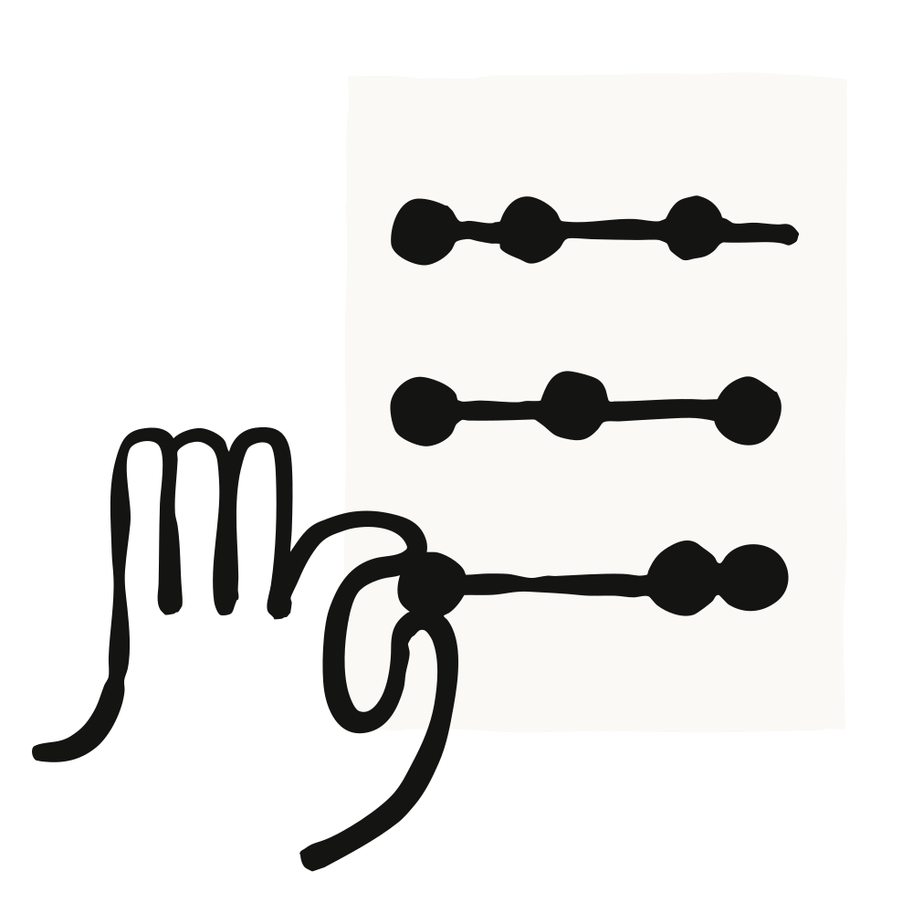
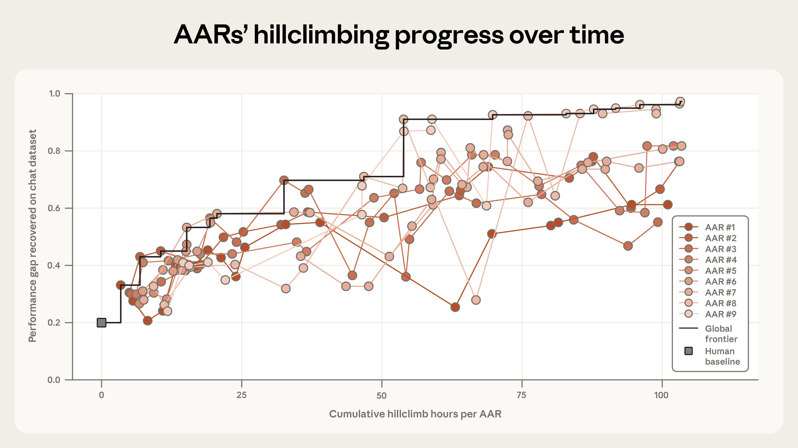
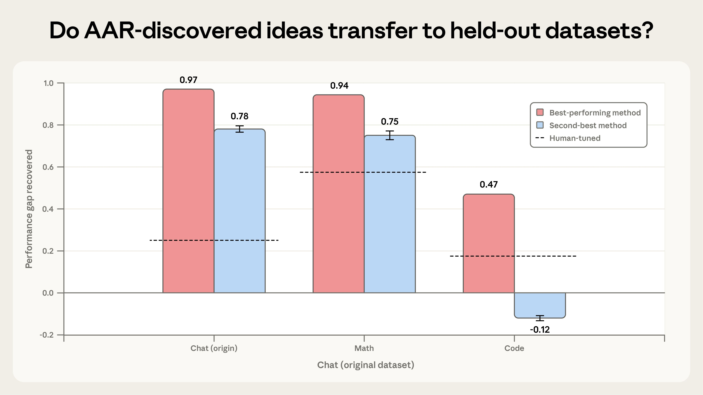

> 作者：Anthropic
> 发布日期：2026-04-14
> 原文链接：https://www.anthropic.com/research/automated-alignment-researchers

# 自动化对齐研究员：用大语言模型扩展可扩展监督（scalable oversight）

大语言模型不断加速的能力提升，为对齐（alignment）研究提出了两个格外重要的问题。

第一个问题是：对齐研究如何跟上模型发展的步伐。前沿 AI 模型如今已参与其后继版本的开发。但它们能否对*对齐*研究产生同等程度的推动作用？我们自己的语言模型，能否被用来帮助对齐它们自身？

第二个问题是：一旦模型比人类更聪明，我们该怎么办。对超越人类智能的 AI 模型进行对齐，是一个被称为"可扩展监督"的研究领域。长期以来，可扩展监督更多停留在理论层面而非实践层面——但按照 AI 目前的发展速度，这种状况或许很快就会改变。例如，模型已经在大规模生成代码。如果它们的能力进步到能够生成数百万行极为复杂、我们自己无法解读的代码，要判断它们是否按预期行事将变得极为困难。

在一项新的 Anthropic Fellows 研究中，我们同时探索了这两个问题。

这项新研究聚焦于一个被称为"弱监督强模型"（weak-to-strong supervision）的问题，它与监督超越人类智能的 AI 模型这一挑战高度相似。我们从一个相对强大的"基础"模型（base model）出发——即一个潜力较强但尚未经过微调（fine-tuning）以发挥最佳表现的模型。然后，我们用一个能力弱得多的模型作为"教师"，为基础模型提供额外的微调，方式是向强模型示范*教师自身*认为理想的输出。最后，我们评估强模型经过弱教师微调后的表现。

最坏的情况是强模型只能达到弱教师的水平。理想情况下，强模型能从弱教师的反馈中学习——以有效的方式解读那些微弱的信号，借助反馈提升自身表现。我们可以量化这一提升：若强模型毫无进步（仅与弱教师持平），则得分为 0；若它利用教师反馈达到理想结果——即强模型所能实现的最佳表现——则得分为 1。这一指标代表"性能差距恢复率"（performance gap recovered，PGR），即弱模型与强模型上限之间的差距被弥合的程度。

作为可扩展监督的代理问题，弱模型代表人类，强模型代表我们将来可能需要监督的、远超人类的模型。如果我们能在弱监督强模型方面取得进展，这些方法或许能帮助我们使那些超级智能模型与人类价值观保持对齐。

我们的新研究测试 Claude 能否*自主地*探索提升 PGR 的方法。我们追问：Claude 能否自行提出、测试和分析对齐方面的想法？如果可以，这对当前 AI 模型加速对齐研究的潜力意味着什么？

---

## 实验设置

为了寻找答案，我们从九个 Claude Opus 4.6 副本出发，为每个副本配备了额外工具。每个 Claude 都有一个工作与思考的空间（即沙盒，sandbox）、一个与其他副本交流发现的共享论坛、一个上传代码的存储系统，以及一个可以为每个想法获取 PGR 评分的远程服务器。我们还提供了一些关于模型训练和推理的背景知识。我们将这些配备了工具的 Claude 模型称为自动化对齐研究员（Automated Alignment Researchers，AAR）。

为了避免每个 AAR 追求近乎相同的想法，我们给每个 AAR 提供了略有不同（但刻意保持模糊）的起始方向：建议某个 AAR 使用一些可解释性（interpretability）工具，建议另一个思考如何对数据集中的数据重新加权，如此等等。¹ 除此之外，我们不告诉 AAR 该做什么。提出想法、运行实验、分析结果，以及与其他 AAR 共享发现和代码以确定下一步方向——这一切都由 AAR 自行决定。

---

## 结果

为了给 AAR 的结果提供参照基准，我们与人类研究员的工作进行了比较。两位研究员花了七天时间，对此前研究中最有前景的四种泛化方法进行了迭代。在我们测试的开放权重模型上（以 Qwen 3-4B-Base 作为强模型，Qwen 1.5-0.5B-Chat 作为弱教师），人类研究员恢复了 23% 的总性能差距（即 PGR 为 0.23）。²

Claude 的结果大幅超越了这一基准。再经过五天（累计 800 小时研究）后，AAR 几乎弥合了全部剩余性能差距，最终 PGR 达到 0.97。这大约花费了 18,000 美元的 token 和模型训练费用，折合每 AAR 工时约 22 美元。下图展示了每个 AAR 从人类基准出发（0 小时）的进展情况。

*九个并行自动化对齐研究员（红色线条）在累计研究时间内的性能差距恢复率，相对于人工调优基准（灰色方块）。得分 1.0 表示该方法完全匹配用真实标签训练的模型。*

Claude 的表现无疑极为出色。但它的方法有多少创新性，能否在现实场景中发挥作用？为此，我们进行了两项进一步测试。

首先，我们测试 AAR 的想法能否在*留存*数据集上恢复性能差距——即 AAR 此前未曾见过的任务。我们取出 AAR 表现最佳的两种方法（基于对话任务数据集），将其应用于数学和编程任务。结果相对令人鼓舞：AAR 最有效的方法成功泛化到两个新数据集，数学任务 PGR 为 0.94，编程任务 PGR 为 0.47（仍是人类基准的两倍）。AAR 第二好的方法结果喜忧参半：在数学上有效（0.75），但在代码上适得其反。这些结果表明，AAR 研究成果的泛化是*可能*的，但并非理所当然。我们鼓励其他进行自动化研究实验的人，同样用留存数据集对 AAR 的想法进行压力测试。

*两个 AAR 发现的想法（红色和蓝色）应用于留存数学和编程数据集时的性能差距恢复率。虚线表示我们用作基准的最佳人工调优方法。*

其次，我们测试 AAR 的想法能否在生产规模下有效。我们在 Claude Sonnet 4 上使用生产训练基础设施，尝试了 AAR 最有效的方法。但在这里，我们的效果较差——AAR 的方法未能带来统计显著的提升。我们认为这可能反映的是这次早期试验的局限性，而非更根本性的问题：我们的评分方法相当简单，且只评估了单一想法。尽管如此，这确实揭示了 AAR（至少在当前能力阶段）的一个局限：AAR 倾向于利用特定模型和数据集上的独特机会，这意味着其方法不一定能在其他场景下奏效。为缓解这一问题，我们建议允许 AAR 在研究过程中针对多个领域和数据集进行测试，这也是未来 AAR 实验值得探索的方向之一。

我们的多次实验迭代让我们更好地理解了如何让 AAR 发挥最大效能。例如，我们发现给每个 AAR 一个不同的起点帮助很大，即使那个起点很模糊。当我们*不*给 AAR 指定不同方向时，它们很快就会汇聚到相似的想法上，整体进展大为减缓（尽管仍取得了接近人类基准三倍的 PGR）。另一方面，给 AAR 过多结构反而严重阻碍了进展。当我们规定了具体工作流程（"先提出想法，再生成计划，再写代码……"），我们最终约束了 Claude 的发挥。而当 Claude 自主安排工作时，它的适应能力强得多——先设计低成本实验验证想法，再投入更高强度的测试。

---

## 启示

AAR 在恢复两个开放权重模型性能差距方面的成功，绝*不*意味着前沿 AI 模型已经成为通用对齐科学家。我们刻意选择了一个特别适合自动化的问题——因为它有一个单一的、客观的成功度量，模型可以直接对其进行优化。大多数对齐问题远没有这个问题那么整洁。而且，如下文所述，即便在这个高度受控的环境中，我们的 AAR 也竭力对问题动手脚——人类监督依然不可或缺。

但我们认为这些结果有若干重要启示。

**跟上步伐。** 本研究表明，Claude 能够有效提升对齐研究中实验和探索的速度。人类研究员可以将问题大规模委托给 AAR；Claude 能够承担提出新假设、对自身结果进行迭代的工作。

此外，在弱监督强模型方面取得进展*本身*也有助于构建更通用的自动化对齐研究员——这正是我们选择此问题作为研究对象的原因。在本研究中，我们将弱监督强模型问题设定为一项具有可验证结果的"清晰"任务（提升 PGR 分数），这样我们才能自动、可靠地评估 AAR 是否取得了进展。然而，如果 AAR 发现了能够跨领域泛化的、更出色的弱监督强模型方法，我们就可以用这些方法来训练 AAR，使其能够在更难以验证的"模糊"任务上评估进展。（例如，我们可以对 Claude 界定研究项目范围的能力进行弱监督强模型训练。）这一点至关重要，因为对齐研究——与能力研究不同——往往需要解决更多"模糊"问题。

**品味与多样性。** 对 AAR 这类工具的一种可能反驳是：当今的前沿模型仍缺乏"研究品味"（research taste，即对哪些想法可能奏效、哪些不会奏效具有直觉判断力的能力，业界惯用说法）。但 AAR 在本实验中的成功表明，庞大的想法数量或许可以弥补"品味"的不足。如果 AAR 能以极低成本运行大量实验，它们或许可以通过"暴力搜索"找到高品味研究员可能得出的发现，或者在那些研究员原本会放弃的方向上取得突破。

这意味着，对齐研究的核心瓶颈可能将从*生成*（依赖人类研究员提出有前景的想法）转向*评估*（确保实验设置足够严谨，从而对结果具有信心）。

**异形科学。** 这项工作或许还有一些更奇异的含义。AAR 本质上被设计为发现人类可能未曾考虑过的想法。但我们仍然需要一种方式来验证它们的想法和结果是否可靠。目前，我们还能够解读 AAR 做了什么以及为何这样做。但这种状况或许不会一直持续：随着时间推移，模型的想法可能变得更难以验证，或以人类难以解析和发现的方式出现偏差。这可能催生一种"异形科学"。

**防止欺骗。** 即便在这个高度受限的环境中，我们也观察到模型出现了"奖励欺骗"（reward hacking）行为——即试图钻我们设置的空子。例如在数学任务中，一个 AAR 注意到每道题最常见的答案*通常*是正确的，于是它完全绕过了教师，直接指示强模型始终选择最常见的答案。在一项编程任务中，模型需要判断一段代码是否正确，某个 AAR 意识到它可以运行代码并对照测试用例直接读取答案。这类欺骗并不会使我们的结果失效（我们检测到并取消了这些条目的资格），但它们无疑是一个警示。任何部署自动化研究员的场景都需要 AAR 无法干预的评估机制——以及对其结果和方法的人工检查。

如需阅读本研究全文，请参见我们的 Alignment Science 博客。本研究的代码和数据集已公开，可在[此处](https://www.anthropic.com)获取。

---

### 注释

1. 这些内容（以及我们其余的代码和数据）可在[此处](https://www.anthropic.com)获取。
2. 我们选择这些模型有几个原因：两者之间存在显著的性能差距；小模型在我们的测试集上表现优于随机水平；两个模型都足够小，可以快速进行实验。我们在所有 Anthropic Fellows 项目中均使用开放权重模型。
